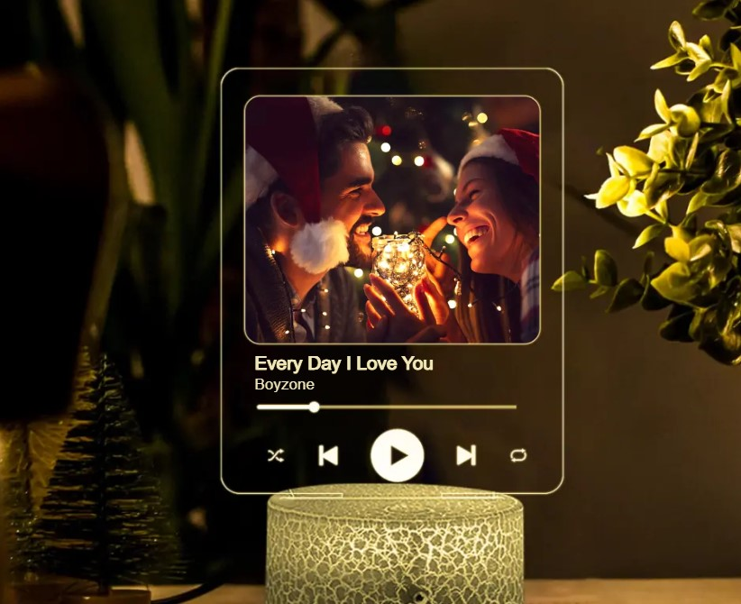
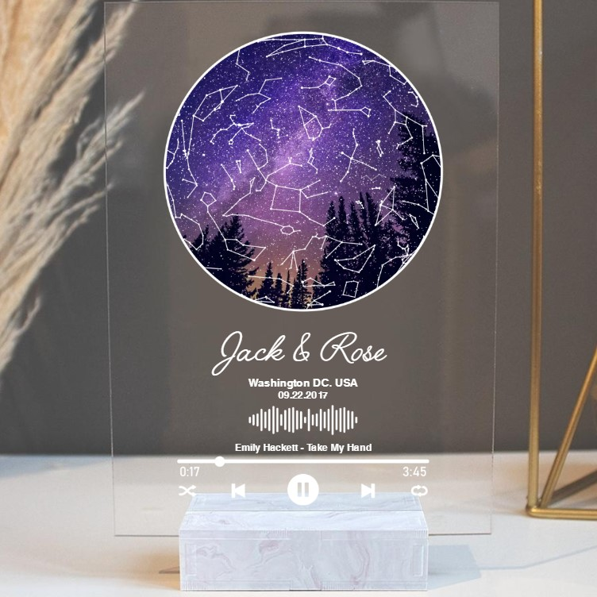
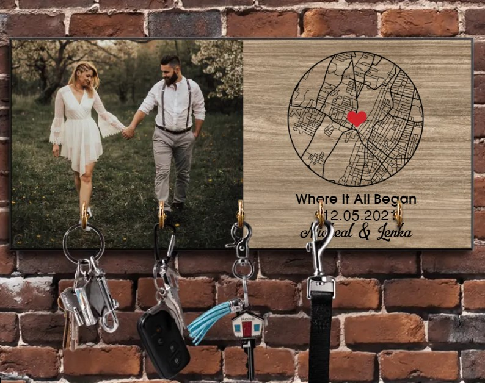
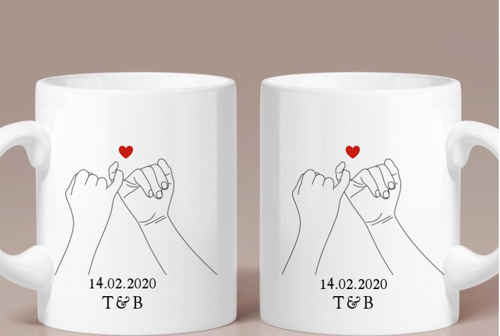
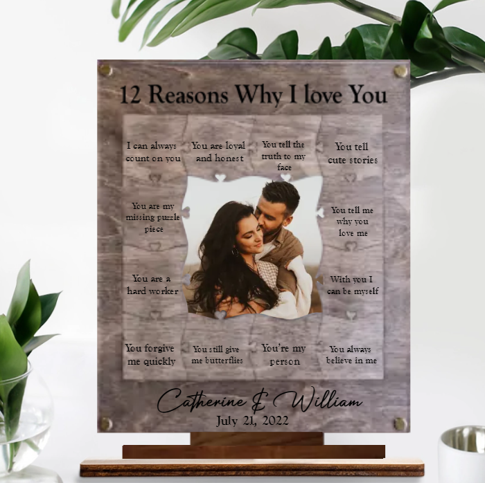
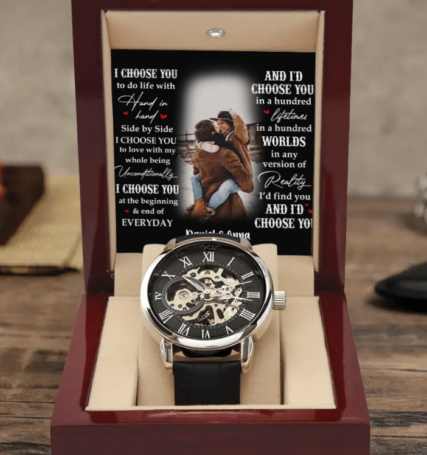
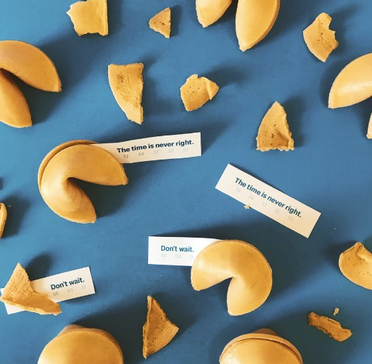
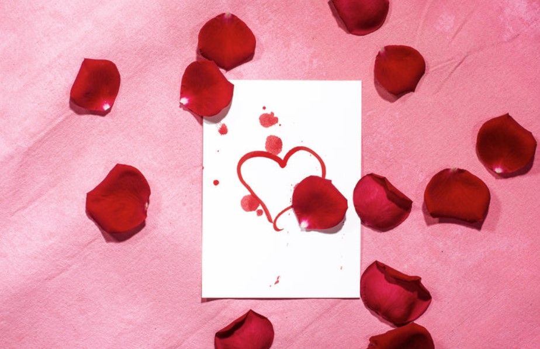
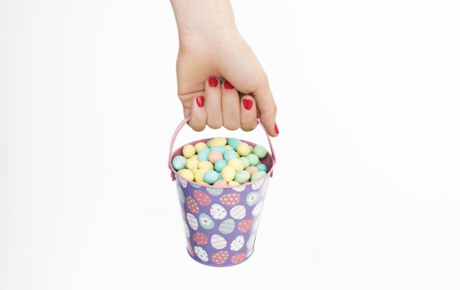
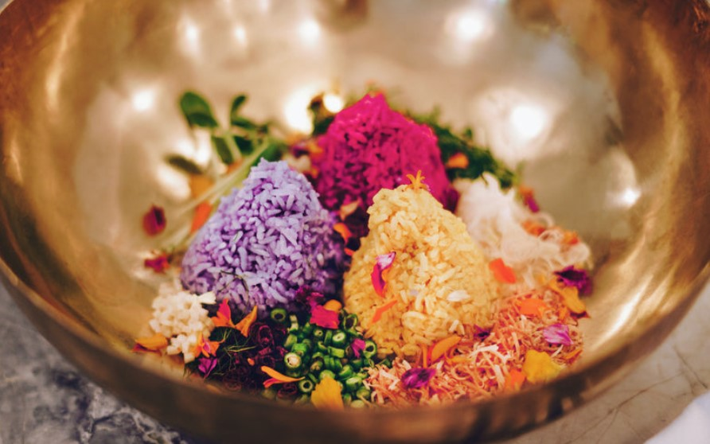

This article has been written and researched by our expert Loveable through a precise methodology. [Learn more about our methodology](https://avada.io/loveable/our-methodological.html)

[Loveable](https://avada.io/loveable/) > [Blog](https://avada.io/loveable/blog/) > [Holiday](https://avada.io/loveable/holiday/)

# 10 Best “Will you be my valentine?” Ideas in 2023

Written by [Rose Bryne](https://avada.io/loveable/author/rose/) Last Updated on August 21, 2023

- [Give them heartfelt Gifts On Valentine’s Day](https://avada.io/loveable/blog/will-you-be-my-valentine-ideas/#wp-block-heading-2-3)
- [Give Him A Fortune Cookies](https://avada.io/loveable/blog/will-you-be-my-valentine-ideas/#wp-block-heading-2-28) 
- [Write a Handwritten Letter](https://avada.io/loveable/blog/will-you-be-my-valentine-ideas/#wp-block-heading-2-31)
- [Go Out For A Romantic Date](https://avada.io/loveable/blog/will-you-be-my-valentine-ideas/#wp-block-heading-2-35) 
- [A Romantic Scavenger Hunt](https://avada.io/loveable/blog/will-you-be-my-valentine-ideas/#wp-block-heading-2-39) 
- [Scrabble Game](https://avada.io/loveable/blog/will-you-be-my-valentine-ideas/#wp-block-heading-2-42)
- [Play Truth or Dare Together](https://avada.io/loveable/blog/will-you-be-my-valentine-ideas/#wp-block-heading-2-44) 
- [Make your love a cute meme](https://avada.io/loveable/blog/will-you-be-my-valentine-ideas/#wp-block-heading-2-46) 
- [Bake Your Beloved Something Sweet](https://avada.io/loveable/blog/will-you-be-my-valentine-ideas/#wp-block-heading-2-50)
- [Write a Poem Or Maybe A Sweet Love Song](https://avada.io/loveable/blog/will-you-be-my-valentine-ideas/#wp-block-heading-2-53) 
- [Bottom Line](https://avada.io/loveable/blog/will-you-be-my-valentine-ideas/#wp-block-heading-2-55) 

If you want to express your feelings to a special one, whether a crush or a long-term partner, asking them to be your Valentine is a beautiful way. But what is the option for doing this? In reality, asking, “Will you be my Valentine?” could be uncomfortable and confuse your partner. 

If you still struggle to find a special way to ask your lover**, “Will you be my Valentine?”**. You’ve come to the right place. These unique and romantic approaches to asking someone to be your Valentine will leave them speechless and smitten.

## Give them heartfelt Gifts On Valentine’s Day

Nothing can make your loved one’s heart flutter more than a romantic and meaningful gift on this special day. So which gift should you choose from the dozens of grants that suit your lover better? If you’re still wondering about those questions, check out Loveable’s unique [gift collections for Valentine’s Day](https://avada.io/loveable/valentine/). From Valentine’s gifts for her, Valentine’s gifts for him, from lovely sweet gifts to funny gifts, ranging in all prices that suit your budget.

Here are some Loveable Bestseller gifts for you to check out; sure you will be interested in this

1. [Custom Photo, Song 3D LED Night Lamp for Music Lovers](https://loveable.ai/collections/valentine-gifts/products/custom-photo-song-3d-led-night-lamp-for-music-lovers-valentine-gift-anniversary-gifts-for-her-him-210ihplnll474?variant=44037848826088)

Lighting applications span the home, the nursery, the living room, the bar, the shop, the cafe, the restaurant, the party, the club, and beyond. This printed night light is both thoughtful and charming, making it a great [present for a friend](https://avada.io/loveable/valentines-day-gift-ideas-friends/) or a romantic gesture for yourself.

2. [Custom Star Map With Favorite Song](https://loveable.ai/collections/valentine-gifts/products/custom-star-map-with-favorite-song-best-personalized-acrylic-plaque-gift-for-anniversary-209ihpbnap156?variant=43814786334952)

You can change the vibe of each acrylic. Modify it to suit your tastes by switching out the tune or photo. You are free to mix and match songs from different genres and images that bring back fond memories. This would be the best gift you ever had for your lover.

3. [When It Began With Map Key Holder](https://loveable.ai/collections/valentine-gifts/products/when-it-began-with-map-personalized-wooden-key-holder-hanger-best-gifts-for-her-him-dad-mom-family-grandparents-210ihpnpkh445?variant=44014160216296)

With a classic design, and it is suitable for any space in your home. This practical gift will make your loved one never have to waste time looking for car keys again. This will also be a sweet reminder of your relationship.

4. [Custom Couple Mug 3 Styles Mug](https://loveable.ai/collections/valentine-gifts/products/custom-couple-mug-3-styles-personalized-white-mug-set-gifts-for-valentines-day-anniversaries-birthdays-special-occasions-209ihpthmu124?variant=43807862096104)             

**Description:** These [adorable mugs](https://avada.io/loveable/mugs-gifts/) will melt your soul mate. The product is made of high-quality porcelain. With every sip of his morning coffee, he can feel your love in it.

5. [12 Reasons Why I Love You Wooden Photo Plaque, Personalized Valentine’s Day or Romantic](https://loveable.ai/collections/valentine-gifts/products/12-reasons-why-i-love-you-with-acrylic-wooden-photo-plaque-personalized-valentines-day-or-romantic-anniversary-gift-for-boyfriend-girlfriend-husbandwife-212ihnvswp965?variant=44190799692008)                     

**Description:** A great decorative plaque to celebrate your love. You can also customize the image as well as the love message you want!

6. [Love Story Custom Lyrics Song – Personalized Jewelry Necklace](https://loveable.ai/collections/necklace/products/love-story-custom-lyrics-song-personalized-jewelry-necklace-best-gifts-for-her-wife-sisters-girlfriend-211ihpnpje510?variant=44080147136744) 

A strong and stylish necklace is the perfect gift for the one you love. Our Cuban Link Chain is the perfect present regardless of the occasion, from birthdays to holidays. You can be sure that this beautifully weighted necklace, which is offered in polished stainless steel or 14K yellow gold, will become a staple in their jewelry collection. This [personalized necklace](https://avada.io/loveable/personalized-necklaces/) is perfect for any occasion, and its adjustable chain means it will look great on any wearer.

We’ve included a velvety gift box at no extra cost to store or present your necklace in style. The luxury box in mahogany wood style will put your presentation in the spotlight with its powerful LED lighting.

7. [I Choose You To Do Life With – Customized Luxury Men’s Watch](https://loveable.ai/collections/valentine-gifts/products/i-choose-you-to-do-life-with-customized-luxury-mens-watch-best-gift-for-him-on-anniversaries-birthday-valentine-301ihpnpwa100?variant=44263608418536)

**Description:** 

This handsome and daring timepiece would be a fine addition to your Lover’s wardrobe and would be a thoughtful gift. This watch has a genuine leather band, can withstand water splashes, and lasts longer than average thanks to its hardened mineral glass. Our skeleton dial is the only way to see the inner workings of your watch. This timepiece is so well made that it runs on motion alone, eliminating the need for batteries. Wearing it lets you keep perfect time without winding it up.

## Give Him A Fortune Cookies 

DIY fortune cookies using printable paper and phrases. Have a Chinese meal with your significant other and enjoy this wine. “I am fortune-ate to have a Valentine like you” is one example of a ready-made message. You can also [write your love letter](https://avada.io/loveable/write-a-love-letter/) or choose from a love-themed Bible verse to tuck inside the patterned paper fortune cookie.

## Write a Handwritten Letter

This year, express your love in a letter instead of sending a Valentine’s Day card. Describe the experiences of your Valentine that make them unique to you. Remember that it depends on your personality that the letter should represent. A note doesn’t have to be very wordy, nor do you have to copy love sayings from somewhere else. Share honestly what you think of them; they will love your honesty and cuteness.

**_Related_**: [How To Write A Love Letter to Your Crush](https://avada.io/loveable/write-a-love-letter/)

## Go Out For A Romantic Date 

_“There is only one happiness in this life, to love and be loved.”_

                                                                        ~ George Sand, French Novelist

As a gesture of affection, planning a special evening for the two of you is a beautiful way to show how much you care. You should choose a date and surprise him with a romantic evening. You could try a new and exciting activity, like a wine tasting or comedy show, or go out to a nice restaurant. Do something special for him tonight and tell him how you feel in a sincere message.

## A Romantic Scavenger Hunt 

Place hints about your question and a unique present in a hidden location for the lucky recipient to discover. You deserve nothing less than success for all your hard work! Get started with the puzzle by leaving him hints about essential locations. Include some of your go-to hangouts, whether it’s a park you enjoy spending time at or a local ice cream shop you both rave about.

## Scrabble Game

If directly saying “will you be my valentine” is boring and awkward, why not try the scrabble Game? It’s a unique way to pop the question, whether you play a game of Scrabble with the person you have your sights set on or use the tiles to spell out your question. Especially if you’re at a loss for words or your mouth is dry!

## Play Truth or Dare Together 

All of the flaws have been patched into the game. If you and your friends are playing truth or dare, have them dare you to tell your crush how you feel about them. Here’s your chance to finally say to the one who makes your heart skip a beat how you think, even if you were too shy to do so in the past. We’ll even dare you to declare your undying devotion for that extra push you need.

## Make your love a cute meme 

Nothing beats a good meme when it comes to conveying the feelings of today’s youth. So, if you want your proposal to stand out, include some memes. Search the web for T-shirt templates of amusing internet memes, compile the best ones, and have them printed.

What could be more romantic than matching your significant other in your favorite memes?

**_Related_**: [25+ Funny Valentine’s Day Memes That Will Generate The Virtues](https://avada.io/loveable/funny-valentines-day-memes/)

## Bake Your Beloved Something Sweet

While chocolates are nice, a homemade treat could be even more appreciated. You can ask the person you have your eye on to be your Valentine by writing a message on a cookie with icing.

## Write a Poem Or Maybe A Sweet Love Song 

If you are gifted with words, write a romantic poem asking the person to be your Valentine. Otherwise, Because of the beautiful resonance and unique memories associated with them, our favorite songs always come to mind when we think back on special times or occasions. Create a version of your crush’s famous song with your heartfelt dedication and play it on the radio or share it online. Listening to a piece of beautiful music together on Valentine’s Day will bring out your Valentine’s sincere feelings for you.

## Bottom Line 

We hope some of the above ways have helped you get a few more ideas to ask your loved one, “**will you be my valentine**” of course, you can come up with your creative ideas. We’re sure he’ll appreciate it.

- [Give them heartfelt Gifts On Valentine’s Day](https://avada.io/loveable/blog/will-you-be-my-valentine-ideas/#wp-block-heading-2-3)
- [Give Him A Fortune Cookies](https://avada.io/loveable/blog/will-you-be-my-valentine-ideas/#wp-block-heading-2-28) 
- [Write a Handwritten Letter](https://avada.io/loveable/blog/will-you-be-my-valentine-ideas/#wp-block-heading-2-31)
- [Go Out For A Romantic Date](https://avada.io/loveable/blog/will-you-be-my-valentine-ideas/#wp-block-heading-2-35) 
- [A Romantic Scavenger Hunt](https://avada.io/loveable/blog/will-you-be-my-valentine-ideas/#wp-block-heading-2-39) 
- [Scrabble Game](https://avada.io/loveable/blog/will-you-be-my-valentine-ideas/#wp-block-heading-2-42)
- [Play Truth or Dare Together](https://avada.io/loveable/blog/will-you-be-my-valentine-ideas/#wp-block-heading-2-44) 
- [Make your love a cute meme](https://avada.io/loveable/blog/will-you-be-my-valentine-ideas/#wp-block-heading-2-46) 
- [Bake Your Beloved Something Sweet](https://avada.io/loveable/blog/will-you-be-my-valentine-ideas/#wp-block-heading-2-50)
- [Write a Poem Or Maybe A Sweet Love Song](https://avada.io/loveable/blog/will-you-be-my-valentine-ideas/#wp-block-heading-2-53) 
- [Bottom Line](https://avada.io/loveable/blog/will-you-be-my-valentine-ideas/#wp-block-heading-2-55) 

### [Rose Bryne](https://avada.io/loveable/author/rose/)

Hi, I'm Rose! I love animals and spending time with kids. At Loveable, I help people find unique gifts for special occasions like Valentine's Day, housewarmings, and graduations. I enjoy finding gifts for kids, teens, and animal lovers that match their interests and personalities. Making gift-giving a pleasant experience is my priority. Let me assist you in finding the perfect gift!

- [Twitter](https://twitter.com/intent/tweet)
- [Facebook](https://www.facebook.com/sharer/sharer.php)
- [instagram](https://avada.io/loveable/blog/will-you-be-my-valentine-ideas/)
- [pinterest](https://www.pinterest.com/loveablellc/)

## Related Posts

[### 120+ Christian Birthday Wishes To Spread Your Love](https://avada.io/loveable/blog/christian-birthday-wishes/) 

[

### 35 Best 70th Birthday Ideas To Celebrate The Special Milestone

](https://avada.io/loveable/blog/70th-birthday-ideas/)

[

### 50 Best 30th Birthday Decorations for a Remarkable Birthday Bash

](https://avada.io/loveable/blog/30th-birthday-decorations/)

[

### 40 Delicious Vegan Christmas Desserts to Delight Your Palate

](https://avada.io/loveable/blog/vegan-christmas-desserts/)

[

### 60 Christmas Team Building Activities to Boost Workplace Spirit

](https://avada.io/loveable/blog/christmas-team-building-activities/)
