This article has been written and researched by our expert Loveable through a precise methodology. [Learn more about our methodology](https://avada.io/loveable/our-methodological.html)

[Loveable](https://avada.io/loveable/) > [Blog](https://avada.io/loveable/blog/) > [Holiday](https://avada.io/loveable/holiday/)

# 10+ Creepy Halloween Cookie Ideas to Delight Your Senses in 2023

Written by [Blake Simpson](https://avada.io/loveable/author/blake/) Last Updated on September 21, 2023

- [Pumpkin Cookies](https://avada.io/loveable/blog/halloween-cookie-ideas/#wp-block-heading-2-4)
- [Ghost Cookies](https://avada.io/loveable/blog/halloween-cookie-ideas/#wp-block-heading-2-9)
- [Bat Cookies](https://avada.io/loveable/blog/halloween-cookie-ideas/#wp-block-heading-2-14)
- [Spiderweb Cookies](https://avada.io/loveable/blog/halloween-cookie-ideas/#wp-block-heading-2-19)
- [Skeleton Cookies](https://avada.io/loveable/blog/halloween-cookie-ideas/#wp-block-heading-2-24)
- [Eyeball Cookies](https://avada.io/loveable/blog/halloween-cookie-ideas/#wp-block-heading-2-29)
- [Mummy Cookies](https://avada.io/loveable/blog/halloween-cookie-ideas/#wp-block-heading-2-34)
- [Witch Hat Cookies](https://avada.io/loveable/blog/halloween-cookie-ideas/#wp-block-heading-2-39)
- [Frankenstein Cookies](https://avada.io/loveable/blog/halloween-cookie-ideas/#wp-block-heading-2-44)
- [Monster Cookies](https://avada.io/loveable/blog/halloween-cookie-ideas/#wp-block-heading-2-49)
- [Superhero Cookies](https://avada.io/loveable/blog/halloween-cookie-ideas/#wp-block-heading-2-54)
- [Cartoon Character Cookies](https://avada.io/loveable/blog/halloween-cookie-ideas/#wp-block-heading-2-58)
- [Candy Corn Cookies](https://avada.io/loveable/blog/halloween-cookie-ideas/#wp-block-heading-2-62)
- [Jack-o’-Lantern Cookies](https://avada.io/loveable/blog/halloween-cookie-ideas/#wp-block-heading-2-67)
- [Rainbow Cookies](https://avada.io/loveable/blog/halloween-cookie-ideas/#wp-block-heading-2-72)
- [Haunted House Cookies](https://avada.io/loveable/blog/halloween-cookie-ideas/#wp-block-heading-2-76)
- [Witch’s Cauldron Cookies](https://avada.io/loveable/blog/halloween-cookie-ideas/#wp-block-heading-2-81)
- [Graveyard Cookies](https://avada.io/loveable/blog/halloween-cookie-ideas/#wp-block-heading-2-86)
- [Tips and Tricks for Halloween Cookie Decorating](https://avada.io/loveable/blog/halloween-cookie-ideas/#wp-block-heading-2-91)
    - [Choosing Halloween-themed cookie dough and flavors](https://avada.io/loveable/blog/halloween-cookie-ideas/#wp-block-heading-3-92)
    - [Using icing, food coloring, and edible decorations](https://avada.io/loveable/blog/halloween-cookie-ideas/#wp-block-heading-3-96)
    - [Packaging and presenting Halloween cookies for gifting or parties](https://avada.io/loveable/blog/halloween-cookie-ideas/#wp-block-heading-3-103)
- [In Conclusion,](https://avada.io/loveable/blog/halloween-cookie-ideas/#wp-block-heading-2-109)

Fall is undeniably the prime time for baking, but during Halloween, we often prioritize Halloween candy over our beloved cookie sheets. While that’s perfectly fine, why not enjoy the best of both worlds? Allow us to convince you to include Halloween cookies in your seasonal baking repertoire. 

Of course, you can still indulge in a bag of your preferred mini chocolate bars. In fact, some of these cookie recipes even incorporate extra candy for [delightful decorations](https://avada.io/loveable/cool-halloween-decorations/). Additionally, you’ll find a plethora of choices for vibrant frostings and festive Halloween sprinkles. 

Don’t worry though; these **Halloween cookie ideas** are a breeze to make. Whip up a large batch for a [Halloween potluck](https://avada.io/loveable/blog/halloween-potluck-ideas/) or create them as a wonderfully spooky after-school snack.

## **Pumpkin Cookies**

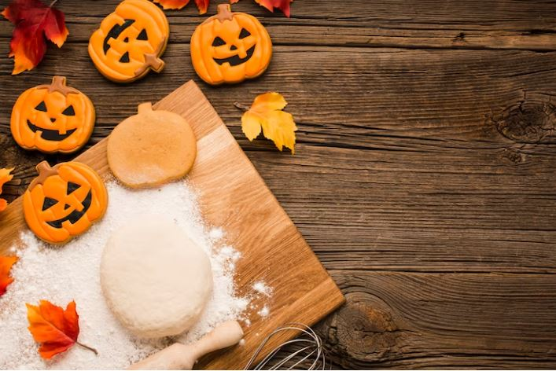

If you’re a pumpkin lover, these adorable cookies are an absolute must-try. Infused with aromatic fall spices and enriched with luscious pumpkin puree, each bite is a heavenly combination of warmth and sweetness. The dough can be easily rolled out and cut into various spooky shapes, allowing for endless creativity. 

Whether you opt for classic pumpkin shapes or venture into ghoulish designs, these cookies are sure to captivate both kids and adults alike. Treat yourself to the comforting essence of pumpkin and spices with these delectable Halloween cookie ideas.

[Get the Pumpkin Oatmeal Cookies recipe at A Classic Twist!](https://aclassictwist.com/pumpkin-oatmeal-cookies/)

## **Ghost Cookies**

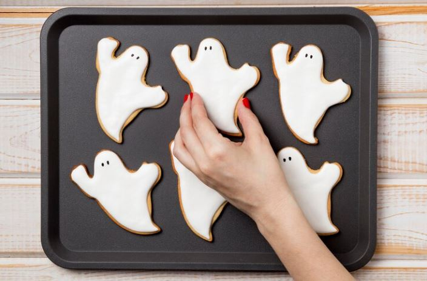

Each cookie is carefully shaped into an adorable ghost silhouette, complete with smooth, white icing that resembles a flowing sheet. Decorate these sweet apparitions with edible eyes or mini chocolate chips to bring their personalities to life. 

The soft and buttery texture of the Halloween cookie ideas perfectly complements the sweet icing, making these ghost cookies a delightful combination of flavors and textures. Whether you’re hosting a Halloween party or seeking a frightfully fun baking activity, these ghost cookies are bound to cast a deliciously sweet spell on your taste buds.

[Get the Ghost Cookies recipe!](https://www.delish.com/holiday-recipes/halloween/a28637917/ghost-cookies-recipe/)

## **Bat Cookies**

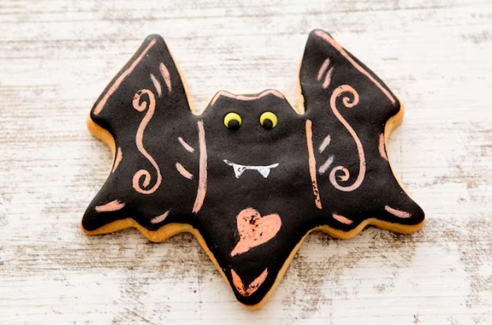

Prepare to take flight into the world of Halloween treats with our spooky Bat Cookies! These delectable delights will have your taste buds soaring with delight. Crafted into the shape of eerie bats, these cookies are as visually captivating as they are delicious. 

Sink your teeth into their soft and buttery texture, complemented by a rich chocolate flavor that is sure to satisfy any sweet tooth. With a touch of creativity, you can decorate these bat-shaped cookies with black icing or sprinkles to add an extra touch of darkness and mystery.

[Get the recipe for Spiced Chocolate Bat Cookies!](https://www.countryliving.com/food-drinks/recipes/a5688/spiced-chocolate-bat-cookies-recipe-clx1014/)

## **Spiderweb Cookies**

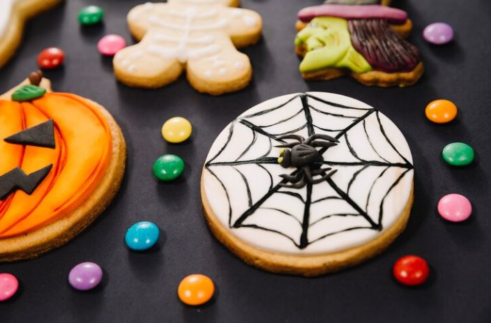

Get tangled in a web of deliciousness with our Spiderweb Cookies, the perfect Halloween treat for arachnid enthusiasts! These captivating cookies feature a delicate web design that will impress both kids and adults alike. 

Made with precision, each cookie is adorned with intricate black icing lines that resemble a spider’s intricate web. The combination of a buttery, melt-in-your-mouth texture, and the visually stunning design makes these cookies a delightful feast for both the eyes and the taste buds.

[Get the recipe for Spiderweb Halloween Cookies at Cooking Classy!](https://www.cookingclassy.com/spiderweb-halloween-cookies/)

## **Skeleton Cookies**

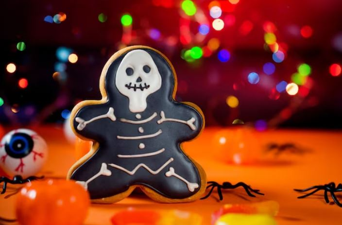

These delightful Halloween cookie ideas feature a classic chocolate cookie base that is as delicious as it is eerie. But what truly brings these skeletons to life is the homemade royal icing. With meticulous attention to detail, you can create intricate designs resembling skeletal structures, making these cookies both visually captivating and irresistibly tasty. 

Whether you’re hosting a Halloween party or simply looking for a fun baking project, these Skeleton Cookies are sure to impress with their delectable flavor and creepy charm.

[Get the Skeleton Cookies recipe at The Simple Sweet Life!](https://go.skimresources.com/?id=74968X1616970&isjs=1&jv=15.4.2-stackpath&sref=https%3A%2F%2Fwww.thepioneerwoman.com%2Ffood-cooking%2Fmeals-menus%2Fg36866250%2Fhalloween-cookies%2F%3Fslide%3D26&url=https%3A%2F%2Fthesimple-sweetlife.com%2Fskeleton-cookies%2F&xs=1&xtz=-420&xuuid=bb1f50d088e7a6ea6f5f070e06006513&xjsf=other_click__auxclick%20%5B2%5D)

## **Eyeball Cookies**

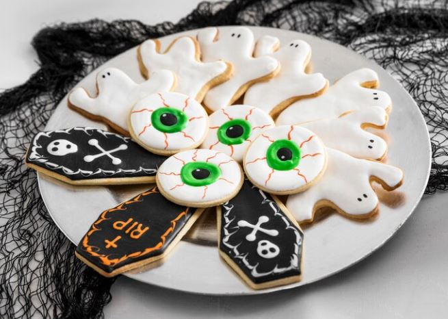

The cookies have gained significant popularity in recent years, especially during the Halloween season. These visually striking treats have captured the imagination of bakers and partygoers alike with their eerie and whimsical designs. The combination of a cookie base, usually soft and chewy, adorned with colorful icing to resemble eyeballs, creates a unique and [eye-catching dessert](https://avada.io/loveable/blog/halloween-dessert-recipes/) that stands out on any dessert table.

Eyeball Cookies have become a favorite choice for Halloween parties, themed events, and even [horror movie marathons](https://avada.io/loveable/blog/best-halloween-movies/). The playful and spooky nature of these cookies adds a touch of fun and intrigue to the celebration, making them a hit among both children and adults.

[Get Ree’s Sugar Cookie Eyeballs recipe!](https://www.thepioneerwoman.com/food-cooking/recipes/a32128998/sugar-cookie-eyeballs/)

## **Mummy Cookies**

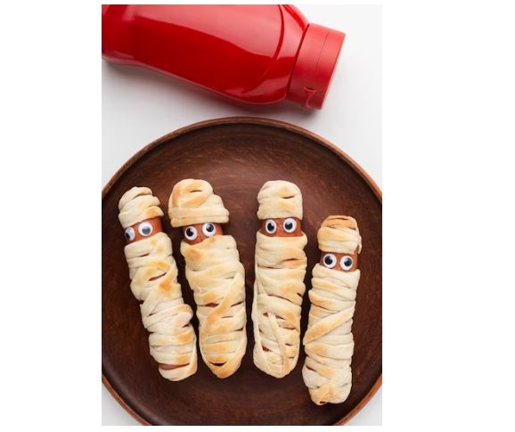

Transform ordinary packaged cookies into adorable Mummy Cookies with this [Halloween-inspired recipe idea](https://avada.io/loveable/halloween-food-ideas/)! With just a few simple ingredients, including white candy coating and mini M&Ms, you can bring these cute little mummies to life. The process is quick and easy, making it a fun activity for both kids and adults. 

Let your creativity shine as you drizzle the white candy coating to resemble mummy bandages and add mini M&Ms for your eyes. These spooky treats are sure to delight everyone at your Halloween gathering!

[Get the Mummy Pops recipe!](https://www.delish.com/cooking/recipes/a43937/mummy-pops-recipe/)

## **Witch Hat Cookies**

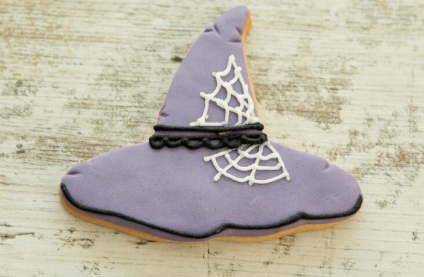

Crafted with a cookie base and an ice cream cone hat tip, these Halloween cookie ideas will have everyone wondering if they’re truly edible or part of a magical illusion. The combination of the crunchy cookie and the sweet, crispy ice cream cone creates a delightful contrast of textures. 

With a touch of creativity, you can personalize each witch hat with colorful icing or sprinkles for a bewitchingly delicious Halloween treat that will leave your guests spellbound.

[Get the Witch Hat Cookies recipe at Preppy Kitchen!](https://go.skimresources.com/?id=74968X1616970&isjs=1&jv=15.4.2-stackpath&sref=https%3A%2F%2Fwww.thepioneerwoman.com%2Ffood-cooking%2Fmeals-menus%2Fg36866250%2Fhalloween-cookies%2F%3Fslide%3D27&url=https%3A%2F%2Fpreppykitchen.com%2Fwitch-hat-cookies%2F&xs=1&xtz=-420&xuuid=bb1f50d088e7a6ea6f5f070e06006513&xjsf=other_click__auxclick%20%5B2%5D)

## **Frankenstein Cookies**

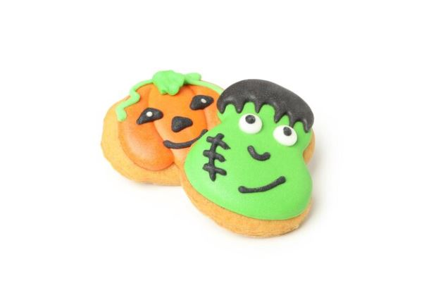

These spooktacular treats are a must-have for any Halloween celebration. Each cookie is expertly decorated to resemble the iconic monster himself, with a green icing base, bolts on the sides, and signature facial features.

These Frankenstein Cookies not only captivate with their intricate design but also satisfy your taste buds with their delectable flavor. Sink your teeth into a soft and chewy cookie, complemented by the sweet and smooth icing. The combination of textures and flavors creates a delightful treat that is sure to delight both kids and adults.

[Get a tutorial!](https://www.shakentogetherlife.com/sugar-wafer-frankenstein-cookies-halloween/)

## **Monster Cookies**

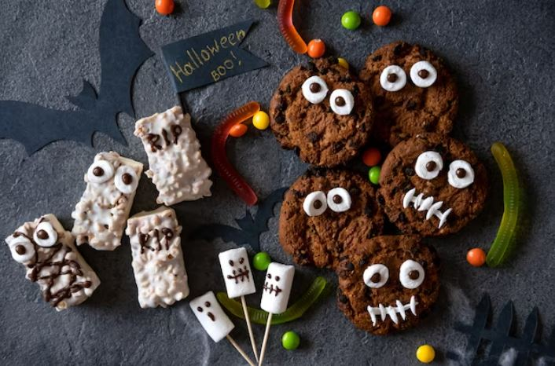

These delectable Halloween cookie ideas begin with a delectable combination of peanut butter and oatmeal batter, providing a soft and chewy texture. But we don’t stop there! We take these cookies to the next level by adding a generous amount of chocolate chips and vibrant Reese’s Pieces, giving them an extra burst of sweetness and a playful, colorful appearance. 

These Halloween Monster Cookies are a perfect blend of spooky and scrumptious, making them a must-have for any Halloween celebration!

[Get the Monster Cookies recipe!](https://www.delish.com/cooking/recipe-ideas/a54348/monster-cookies-recipe/)

## **Superhero Cookies**

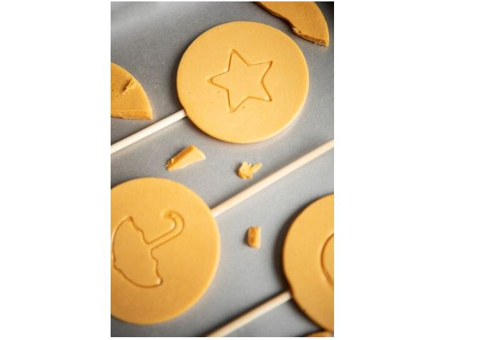

These cookies are a fantastic idea to celebrate your favorite characters, add excitement to gatherings, and enjoy a fun and creative activity. They make great treats for themed parties or gifts for superhero enthusiasts. 

Unleash your creativity with vibrant icing and decorations to bring these iconic symbols to life. Whether for a birthday party or a movie night, Superhero Cookies are sure to delight both kids and adults alike. So, channel your inner hero and enjoy these delicious and visually stunning treats!

## **Cartoon Character Cookies**

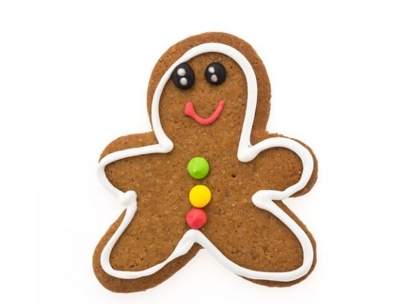

They are a perfect addition to any Halloween party or gathering. They add a touch of playfulness and nostalgia, appealing to both kids and adults. Serve them as a delightful centerpiece or hand them out as party favors to spread the festive cheer.

These cookies also offer a creative outlet for the whole family to enjoy. Gather around the kitchen table and let your imagination run wild as you decorate the cookies together. It’s a fun and engaging activity that allows everyone to express their artistic flair.

## **Candy Corn Cookies**

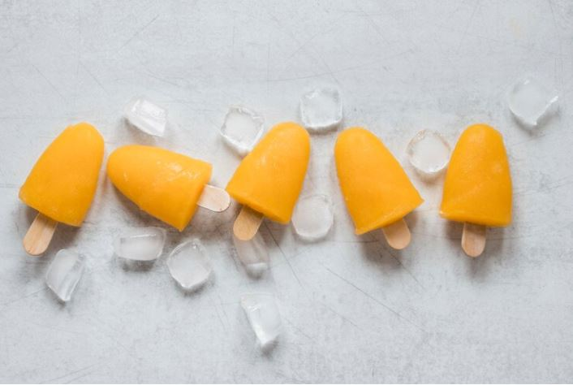

The debate surrounding candy corn is notorious, but if you find yourself firmly in the camp of sweet and chewy candy enthusiasts, then these delectable homemade cookies are destined to be your new favorite. Embracing the distinct flavors and vibrant colors of candy corn, these cookies shine with their irresistible charm. 

But we couldn’t stop there. To take the sweetness to a whole new level, we’ve added a generous amount of creamy white chocolate chips that perfectly complement the candy corn’s delightful taste.

[Get the Candy Corn Cookies recipe!](https://www.thepioneerwoman.com/food-cooking/recipes/a40625994/candy-corn-cookies-recipe/)

## **Jack-o’-Lantern Cookies**

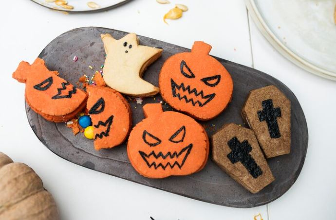

Whether you’re hosting a Halloween party or simply looking for a fun baking project, Jack-o’-Lantern Cookies are sure to impress. They are a fantastic way to engage the whole family in a creative activity, allowing each person to design their own unique pumpkin face.

Serve these delightful cookies as a centerpiece on your dessert table or package them individually as party favors. They are guaranteed to bring smiles and a touch of whimsy to any Halloween gathering.

[Get the Jack-O’-Lantern Sandwich Cookies recipe!](https://www.delish.com/cooking/recipe-ideas/a37887818/jack-olantern-sandwich-cookies-recipe/)

## **Rainbow Cookies**

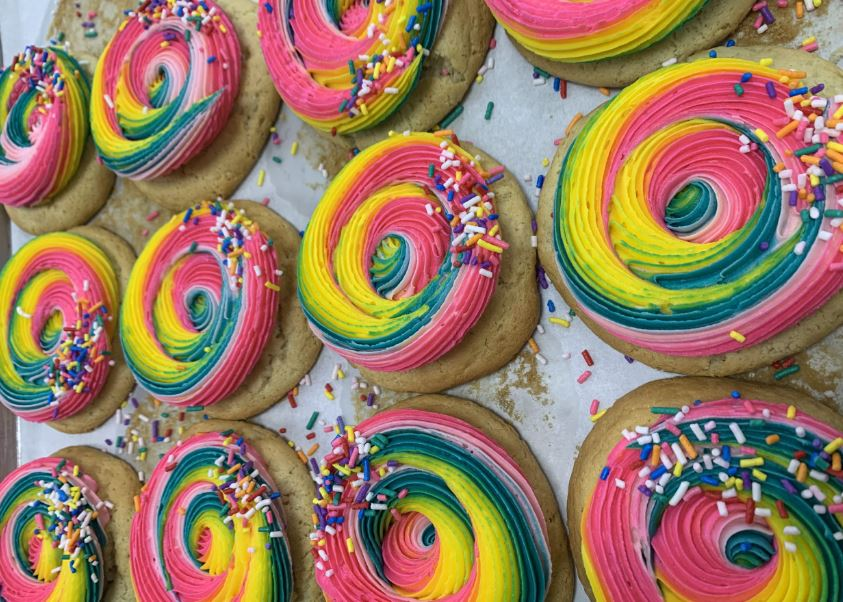

Each cookie showcases a beautiful rainbow of colors, creating a whimsical and festive treat for birthdays, celebrations, or simply to brighten someone’s day. The soft and chewy texture of the cookie pairs perfectly with the sweet and delightful flavors of the different colored doughs.

Rainbow Cookies are not only delicious but also offer a creative outlet. You can mix and match colors, experiment with different patterns, or even add edible glitter for an extra touch of magic. The possibilities are endless, allowing you to customize each batch to your heart’s content.

## **Haunted House Cookies**

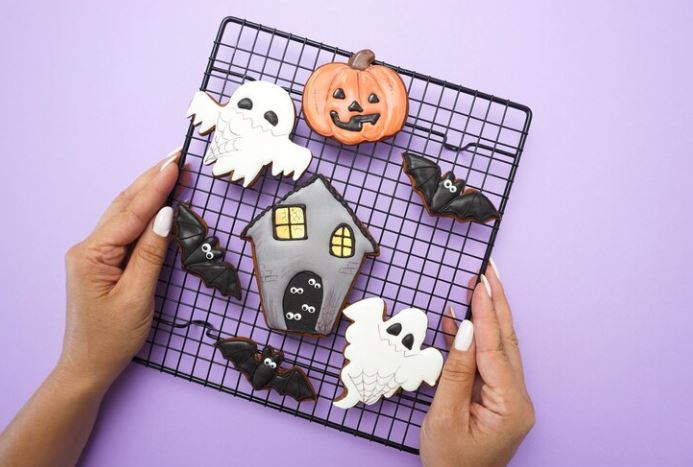

Step into a world of spooky delight with Haunted House Cookies! These enchanting treats are sure to transport you to a haunted realm filled with ghosts, witches, and mysterious creatures. Each cookie is shaped and decorated to resemble a hauntingly beautiful haunted house, complete with intricate details that will captivate both young and old.

These cookies also make great gifts or party favors. Package them in themed treat bags or present them individually to delight your family, friends, or fellow Halloween enthusiasts. They are sure to appreciate the craftsmanship and love that goes into creating these mini edible haunted houses.

[Get Ree’s Haunted House Gingerbread Cookies recipe!](https://www.thepioneerwoman.com/food-cooking/cooking-tips-tutorials/a11237/haunted-house-cookies/)

## **Witch’s Cauldron Cookies**

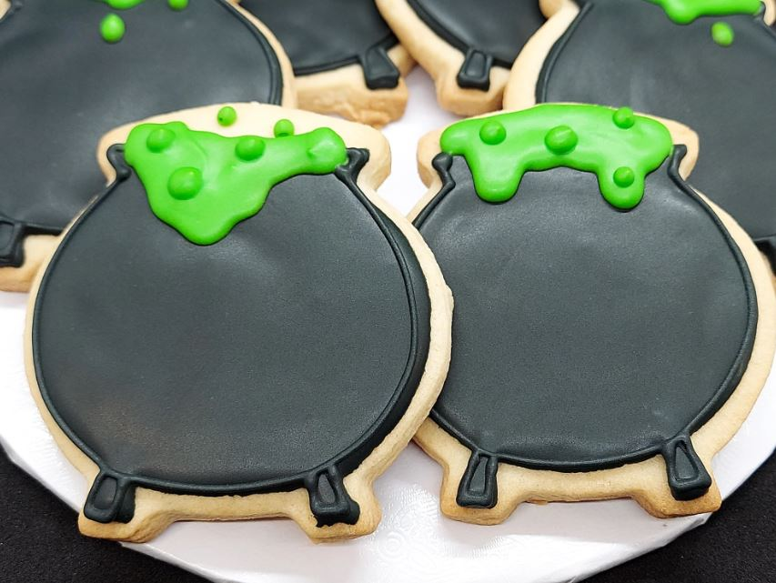

Crafted with a buttery and tender cookie base, these Witch’s Cauldron Cookies offer a delightful combination of flavor and texture. Decorate them with dark chocolate icing and add colorful sprinkles or edible glitter to create a mesmerizing potion effect.

These Halloween cookie ideas are perfect for Halloween parties or as a delightful surprise for little witches and wizards. Serve them as a centerpiece on your dessert table or place them in individual treat bags for a fun party favor.

Get creative with the decorations and add candy eyes, licorice “handles,” or gummy worms to complete the witchy theme. The possibilities are endless, allowing you to customize each cookie to your liking and create a truly magical treat.

## **Graveyard Cookies**

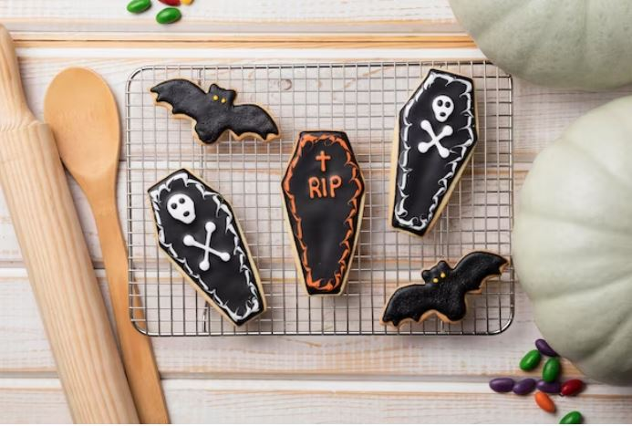

Enter the eerie realm of Graveyard Cookies, where spooky delights and sweet flavors come together in a hauntingly delicious treat. These cookies, inspired by the chilling atmosphere of a graveyard, are sure to send shivers down your spine while satisfying your cravings.

Decorate each cookie with dark chocolate icing to resemble the eerie soil of a graveyard. Then, use crushed chocolate cookies or cookie crumbs to create tombstones standing tall amidst the darkness. Add candy ghosts or skeleton-shaped sprinkles for an extra touch of spookiness. These cookies are perfect for Halloween gatherings, haunted-themed parties, or simply to indulge in a wickedly fun baking project.

**_Related_**: Spooky [Halloween Pretzels](https://avada.io/loveable/halloween-pretzels/) Recipe For Halloween

## **Tips and Tricks for Halloween Cookie Decorating**

### **Choosing **Halloween-themed** cookie dough and flavors**

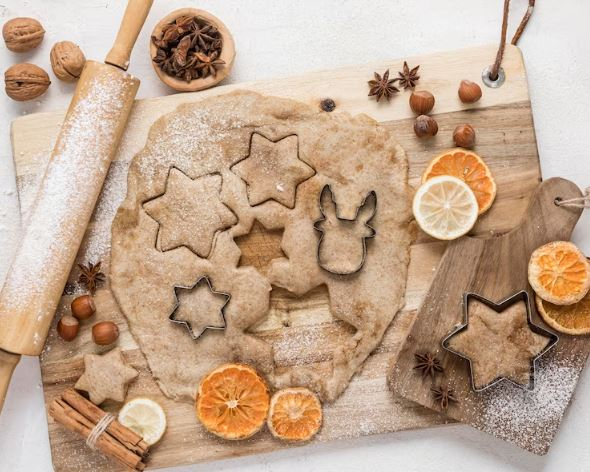

When selecting the perfect cookie dough and flavors for your Halloween-themed cookies, there are a few factors to consider. Opt for a dough that holds its shape well during baking, such as a sugar cookie or gingerbread dough. These sturdy bases are ideal for intricate Halloween designs. 

To add a festive touch, incorporate flavors like pumpkin spice or cinnamon into your dough. These autumn-inspired flavors will complement the Halloween theme and create a delicious treat that captures the essence of the season.

### **Using icing, food coloring, and edible decorations**

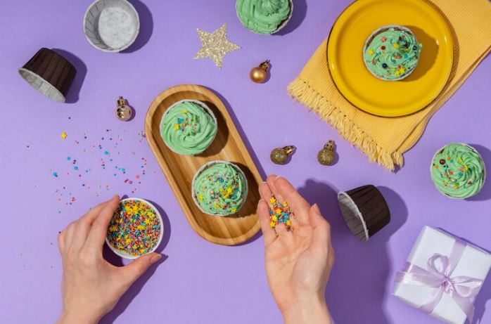

When it comes to decorating Halloween cookies, there are various techniques you can use to bring your treats to life. Icing, food coloring, and edible decorations are key elements in creating visually stunning designs. 

Start by using different icing consistencies and colors to achieve different effects. Thicker icing can be used for outlining and adding texture, while thinner icing is perfect for filling in larger areas or creating smooth finishes. Experiment with piping tips to create different patterns and shapes.

Food coloring is a great way to add vibrant hues to your cookies. Gel-based colors work best as they won’t alter the consistency of the icing. Mix and match colors to create gradients, ombre effects, or bold contrasts. You can also use food coloring pens or brushes to add intricate details and fine lines.

Edible decorations like sprinkles, colored sugar, edible glitter, or shaped candies can add texture, sparkle, and dimension to your cookies. Sprinkle them over wet icing for an extra touch of magic. Consider using themed decorations such as mini pumpkins, bats, or ghosts to enhance the Halloween spirit.

Don’t be afraid to get creative and experiment with different combinations of icing, colors, and decorations. Whether it’s spooky spiders, haunting ghosts, or pumpkin faces, let your imagination run wild and bring your Halloween cookies to life using these decorating techniques.

### **Packaging and presenting Halloween cookies for gifting or parties**

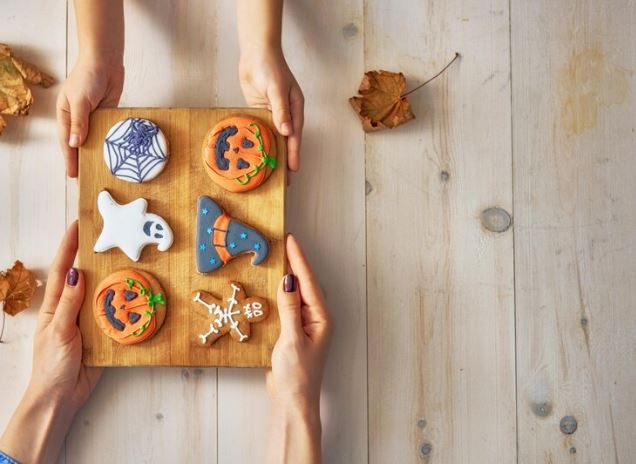

Consider using clear cellophane bags to showcase the decorated Halloween cookie ideas. Place the cookies inside the bag and tie it with colorful ribbons or themed twine. This not only adds a festive touch but also allows the recipients to see the beautiful designs.

If you prefer a more structured packaging option, opt for decorative cookie boxes. These boxes are available in various sizes and designs, often featuring Halloween motifs like pumpkins, witches, or bats. Place the cookies carefully inside the boxes, ensuring they are protected and won’t move around during transportation.

For a party setting, display the cookies on a decorative tray or platter. Choose a Halloween-themed tray or one in a vibrant color that complements the cookies. You can also add small Halloween props like mini pumpkins, plastic spiders, or decorative leaves to enhance the festive atmosphere.

Personalize your packaging by adding themed tags or labels with handwritten messages. These can include spooky phrases, names of the recipients, or playful Halloween greetings. It adds a thoughtful touch and makes the cookies feel even more special.

## **In Conclusion,**

You have discovered an array of spine-chilling **Halloween cookie ideas**, such as iced cookies in the shape of mummies, spider cookies, and delightful candy-filled cookies. Alternatively, if you prefer to skip the frightful creations, there are also delectable pumpkin desserts and other fall-inspired cookie recipes to explore. 

Indulge in the delightful sugar-coated pumpkin snickerdoodles or savor the soft pumpkin cookies adorned with delectable salted maple icing. For a Halloween activity that involves the kids, why not try Ree Drummond’s twist on holiday gingerbread, transformed into mini haunted houses? It’s a fantastic opportunity to hone your decorating skills. 

Lastly, remember to acquire a Halloween cookie jar to safely store all your freshly baked goodies!

- [Pumpkin Cookies](https://avada.io/loveable/blog/halloween-cookie-ideas/#wp-block-heading-2-4)
- [Ghost Cookies](https://avada.io/loveable/blog/halloween-cookie-ideas/#wp-block-heading-2-9)
- [Bat Cookies](https://avada.io/loveable/blog/halloween-cookie-ideas/#wp-block-heading-2-14)
- [Spiderweb Cookies](https://avada.io/loveable/blog/halloween-cookie-ideas/#wp-block-heading-2-19)
- [Skeleton Cookies](https://avada.io/loveable/blog/halloween-cookie-ideas/#wp-block-heading-2-24)
- [Eyeball Cookies](https://avada.io/loveable/blog/halloween-cookie-ideas/#wp-block-heading-2-29)
- [Mummy Cookies](https://avada.io/loveable/blog/halloween-cookie-ideas/#wp-block-heading-2-34)
- [Witch Hat Cookies](https://avada.io/loveable/blog/halloween-cookie-ideas/#wp-block-heading-2-39)
- [Frankenstein Cookies](https://avada.io/loveable/blog/halloween-cookie-ideas/#wp-block-heading-2-44)
- [Monster Cookies](https://avada.io/loveable/blog/halloween-cookie-ideas/#wp-block-heading-2-49)
- [Superhero Cookies](https://avada.io/loveable/blog/halloween-cookie-ideas/#wp-block-heading-2-54)
- [Cartoon Character Cookies](https://avada.io/loveable/blog/halloween-cookie-ideas/#wp-block-heading-2-58)
- [Candy Corn Cookies](https://avada.io/loveable/blog/halloween-cookie-ideas/#wp-block-heading-2-62)
- [Jack-o’-Lantern Cookies](https://avada.io/loveable/blog/halloween-cookie-ideas/#wp-block-heading-2-67)
- [Rainbow Cookies](https://avada.io/loveable/blog/halloween-cookie-ideas/#wp-block-heading-2-72)
- [Haunted House Cookies](https://avada.io/loveable/blog/halloween-cookie-ideas/#wp-block-heading-2-76)
- [Witch’s Cauldron Cookies](https://avada.io/loveable/blog/halloween-cookie-ideas/#wp-block-heading-2-81)
- [Graveyard Cookies](https://avada.io/loveable/blog/halloween-cookie-ideas/#wp-block-heading-2-86)
- [Tips and Tricks for Halloween Cookie Decorating](https://avada.io/loveable/blog/halloween-cookie-ideas/#wp-block-heading-2-91)
    - [Choosing Halloween-themed cookie dough and flavors](https://avada.io/loveable/blog/halloween-cookie-ideas/#wp-block-heading-3-92)
    - [Using icing, food coloring, and edible decorations](https://avada.io/loveable/blog/halloween-cookie-ideas/#wp-block-heading-3-96)
    - [Packaging and presenting Halloween cookies for gifting or parties](https://avada.io/loveable/blog/halloween-cookie-ideas/#wp-block-heading-3-103)
- [In Conclusion,](https://avada.io/loveable/blog/halloween-cookie-ideas/#wp-block-heading-2-109)

### [Blake Simpson](https://avada.io/loveable/author/blake/)

Hi, I'm Blake from Loveable. I help people find perfect gifts for occasions like anniversaries and weddings. I also write a blog about holidays, sharing insights to make them more meaningful. Let's create unforgettable moments together!

- [Twitter](https://twitter.com/intent/tweet)
- [Facebook](https://www.facebook.com/sharer/sharer.php)
- [instagram](https://avada.io/loveable/blog/halloween-cookie-ideas/)
- [pinterest](https://www.pinterest.com/loveablellc/)

## Related Posts

[### 120+ Christian Birthday Wishes To Spread Your Love](https://avada.io/loveable/blog/christian-birthday-wishes/) 

[

### 35 Best 70th Birthday Ideas To Celebrate The Special Milestone

](https://avada.io/loveable/blog/70th-birthday-ideas/)

[

### 50 Best 30th Birthday Decorations for a Remarkable Birthday Bash

](https://avada.io/loveable/blog/30th-birthday-decorations/)

[

### 40 Delicious Vegan Christmas Desserts to Delight Your Palate

](https://avada.io/loveable/blog/vegan-christmas-desserts/)

[

### 60 Christmas Team Building Activities to Boost Workplace Spirit

](https://avada.io/loveable/blog/christmas-team-building-activities/)
