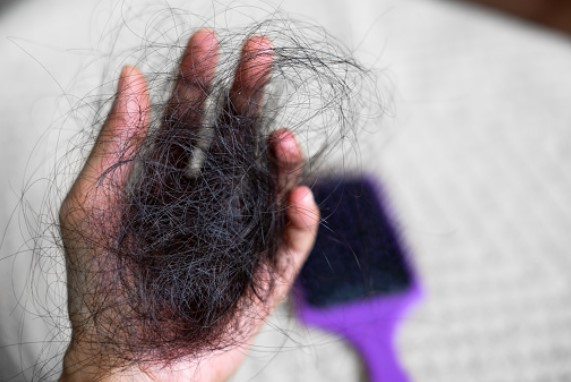

This article has been written and researched by our expert Loveable through a precise methodology. [Learn more about our methodology](https://avada.io/loveable/our-methodological.html)

[Loveable](https://avada.io/loveable/) > [Blog](https://avada.io/loveable/blog/) > [Parenting](https://avada.io/loveable/parenting/)

# 10 Essential Postpartum Care Tips: What You Need to Know for a Healthy Recovery

Written by [Benjamin Collins](https://avada.io/loveable/author/benjamin/) Last Updated on September 05, 2023

- [10 Ways To Deal With Common Postpartum Problems – Postpartum Care](https://avada.io/loveable/blog/postpartum-care-tips/#wp-block-heading-2-3)
    - [1\. Weight Loss](https://avada.io/loveable/blog/postpartum-care-tips/#wp-block-heading-3-4)
    - [2\. Tender Breasts](https://avada.io/loveable/blog/postpartum-care-tips/#wp-block-heading-3-8)
    - [3\. Vaginal Discharge](https://avada.io/loveable/blog/postpartum-care-tips/#wp-block-heading-3-11)
    - [4\. Changes in Mood](https://avada.io/loveable/blog/postpartum-care-tips/#wp-block-heading-3-14) 
    - [5\. Contractions](https://avada.io/loveable/blog/postpartum-care-tips/#wp-block-heading-3-18)
    - [6\. Vaginal Soreness](https://avada.io/loveable/blog/postpartum-care-tips/#wp-block-heading-3-21)
    - [7\. Incontinence](https://avada.io/loveable/blog/postpartum-care-tips/#wp-block-heading-3-24)
    - [8\. Bad Skin and Hair](https://avada.io/loveable/blog/postpartum-care-tips/#wp-block-heading-3-27)
    - [9\. Hemorrhoids](https://avada.io/loveable/blog/postpartum-care-tips/#wp-block-heading-3-31)
    - [10\. The Postpartum Checkup](https://avada.io/loveable/blog/postpartum-care-tips/#wp-block-heading-3-38)
- [Get Used To Motherhood](https://avada.io/loveable/blog/postpartum-care-tips/#wp-block-heading-2-41)
- [Postpartum Care FAQ](https://avada.io/loveable/blog/postpartum-care-tips/#wp-block-heading-2-44)
    - [1\. What does postpartum care include?](https://avada.io/loveable/blog/postpartum-care-tips/#wp-block-heading-3-46)
    - [2\. What is normal postpartum care?](https://avada.io/loveable/blog/postpartum-care-tips/#wp-block-heading-3-48)
    - [3\. What is the 5 5 5 rule postpartum?](https://avada.io/loveable/blog/postpartum-care-tips/#wp-block-heading-3-50)
- [Bottom Line](https://avada.io/loveable/blog/postpartum-care-tips/#wp-block-heading-2-52) 

Welcome to the transformative phase of postpartum! The transition to parenthood is a life-changing experience, but it’s vital to remember that caring for yourself after childbirth is just as important as caring for your infant. For new moms, the postpartum period, often known as the fourth trimester, is a time of enormous physical and mental changes. It’s a time when self-care is crucial, and understanding the fundamentals of **postpartum care** is essential for a good recovery.

Prepare to go on a journey that acknowledges the sacred relationship between mother and child while celebrating the resiliency of the human spirit. Remember that the journey to postpartum wellness starts with self-care, and with the correct information and support, you’ll emerge stronger, revitalized, and ready to enjoy the pleasures of parenting. Let’s start and learn the essential postpartum care strategies to turn your recovery into a genuinely empowered experience.

## **10 Ways To Deal With Common Postpartum Problems – Postpartum Care**

### **1\. Weight Loss**

Following childbirth, it’s not uncommon for your body to retain some pregnancy weight, giving the appearance that you’re still pregnant. Then, you naturally shed around 13 pounds (6 kilograms). In the days that follow, you’ll continue to lose additional weight. 

Begin by implementing good eating habits like balanced meals with fruits and vegetables. Staying hydrated by drinking enough water throughout the day. Furthermore, mild workouts, including walking or postnatal yoga, will assist in raising your metabolism and support steady weight reduction. 

### **2\. Tender Breasts**

Engorgement is a condition characterized by large, tight breasts that might make it difficult for your infant to latch on properly. It is suggested to nurse your infant often on both breasts to aid breastfeeding since this can help avoid engorgement.

You can try a few methods. Before feeding, express a tiny bit of breast milk by hand to soften the breast and make it easier for your infant to latch on. Before nursing, use warm washcloths to give comfort and help in milk removal. 

### **3\. Vaginal Discharge**

Initially, the discharge will combine this membrane and blood, appearing as a heavy, red flow in the first few days. However, the discharge will gradually decrease, become more watery, and transition in color from pinkish-brown to yellowish-white.

While postpartum vaginal discharge is a typical part of the healing process, its severity must be monitored. If you have significant vaginal bleeding that necessitates frequent pad changes (soaking a pad in less than an hour), you should call your healthcare professional right after feeling uncomfortable.

### **4\. Changes in Mood** 

It’s normal to go through a time of emotional ups and downs known as the baby blues. This might appear as mood swings, sobbing spells, worry, and problems sleeping. Rest assured, these symptoms are really transient and usually go gone within a few weeks. 

If you believe you have this illness, you must immediately contact your healthcare professional, especially if your symptoms continue to make it difficult to care for your infant or do everyday duties.

### **5\. Contractions**

Similar to menstruation pains, these contractions aim to prevent excessive bleeding by compressing the blood vessels in the uterus. They are more common when nursing because the hormone oxytocin is produced, causing deeper contractions.

If you have difficulty from the afterpains, your healthcare professional may advise you to use an over-the-counter pain medication. It is vital to follow their instructions and take medicine as prescribed. 

### **6\. Vaginal Soreness**

Due to the stretching and pressure during birth, the tissues of the vagina and perineum may become swollen, painful, or even damaged. This pain can make activities like sitting, walking, and going to the restroom painful.

To alleviate discomfort and promote healing, consider sitting on a pillow, using cold packs, gently rinsing with warm water while urinating, and taking warm baths.

### **7\. Incontinence**

The pelvic floor muscles that support the uterus, bladder, and rectum can get strained during pregnancy. As a result, you may suffer urine leakage when coughing, laughing, or sneezing.

Wearing sanitary pads might give temporary protection from incontinence. Furthermore, completing pelvic floor muscle exercises, known as Kegels, can help strengthen the muscles and recover bladder control.

### **8\. Bad Skin and Hair**

Hair loss is a frequent alteration that occurs as a result of hormonal shifts during and after pregnancy. You may see more shedding for up to five months before your hair recovers to its natural growth cycle.

Furthermore, if you have stretch marks during pregnancy, keep in mind that they will not totally vanish after delivery. However, they tend to fade from their initial red color to a silvery tinge with time. Similarly, any skin darkening will diminish gradually as your hormones settle.

### **9\. Hemorrhoids**

If you have bowel discomfort and detect swelling near your anus, it might be an indication of hemorrhoids, which are bulging veins in the anal region. 

You might attempt one of the following techniques to get comfort: 

- Use hemorrhoids cream or suppository containing hydrocortisone.
- Apply pads or wipes packed with witch hazel or numbing chemicals.
- Warm sitz baths for 10 to 15 minutes multiple times a day. 
- Consume a high-fiber diet as well as enough water.

### **10\. The Postpartum Checkup**

Postpartum care is a continual procedure, not a single postpartum visit. Contact your healthcare provider within the first three weeks of birth for any required check-ups. A full postpartum examination should also be scheduled within 12 weeks of birth.

During this examination, your healthcare practitioner will analyze your emotional well-being, including your mood, and advise you on contraception and birth spacing. They will also go over important newborn care and feeding.

## **Get Used To Motherhood**

As a new mother, you need to strike a balance between caring for your kid and caring for yourself. Prioritize [relaxation](https://avada.io/loveable/relaxing-gifts-mom/), accept aid from loved ones, nurture your body with nutritious foods, and include light exercise as directed by your doctor. Accept this life-changing adventure, be patient with yourself, and appreciate each step along the road. With time, you’ll grow comfortable in your mothering position and gain confidence in managing the joys and trials of parenting.

## **Postpartum Care FAQ**

### **1\. What does postpartum care include?**

Postpartum care consists of medical, emotional, and practical assistance for the mother and infant following childbirth. Otherwise, some [small postpartum gifts](https://avada.io/loveable/gifts-new-moms-after-birth/) may have a remarkable meaning to help women unwind and reduce stress after birth; they will feel continually supported by family, loved ones, and persons around them.

### **2\. What is normal postpartum care?**

Routine postpartum care includes regular check-ups, monitoring physical recovery, dealing with difficulties, and offering advice on baby care, breastfeeding, and mental health.

### **3\. What is the 5 5 5 rule postpartum?**

The [5 5 5 rule](https://ahaslides.com/blog/what-is-5-5-5-rule/) postpartum is a postpartum healing guideline that advocates relaxing for 5 days, limiting visitors for the first 5 days, and avoiding chores and hard lifting for the first 5 weeks.

## **Bottom Line** 

Prioritizing **postpartum care** is essential for a good [postpartum recovery](https://avada.io/loveable/blog/postpartum-recovery-tips/). This article gives new mothers vital insights and direction. By following these suggestions, you may make the adjustment to motherhood easier and improve your entire well-being.

Postpartum care includes a variety of features, such as physical recovery and emotional assistance. You may improve your physical and mental well-being, build a strong relationship with your baby, and confidently handle the obstacles of early parenthood by being proactive in your postpartum care. Remember that postpartum care is a continuous process that goes beyond the first few weeks after birth. 

- [10 Ways To Deal With Common Postpartum Problems – Postpartum Care](https://avada.io/loveable/blog/postpartum-care-tips/#wp-block-heading-2-3)
    - [1\. Weight Loss](https://avada.io/loveable/blog/postpartum-care-tips/#wp-block-heading-3-4)
    - [2\. Tender Breasts](https://avada.io/loveable/blog/postpartum-care-tips/#wp-block-heading-3-8)
    - [3\. Vaginal Discharge](https://avada.io/loveable/blog/postpartum-care-tips/#wp-block-heading-3-11)
    - [4\. Changes in Mood](https://avada.io/loveable/blog/postpartum-care-tips/#wp-block-heading-3-14) 
    - [5\. Contractions](https://avada.io/loveable/blog/postpartum-care-tips/#wp-block-heading-3-18)
    - [6\. Vaginal Soreness](https://avada.io/loveable/blog/postpartum-care-tips/#wp-block-heading-3-21)
    - [7\. Incontinence](https://avada.io/loveable/blog/postpartum-care-tips/#wp-block-heading-3-24)
    - [8\. Bad Skin and Hair](https://avada.io/loveable/blog/postpartum-care-tips/#wp-block-heading-3-27)
    - [9\. Hemorrhoids](https://avada.io/loveable/blog/postpartum-care-tips/#wp-block-heading-3-31)
    - [10\. The Postpartum Checkup](https://avada.io/loveable/blog/postpartum-care-tips/#wp-block-heading-3-38)
- [Get Used To Motherhood](https://avada.io/loveable/blog/postpartum-care-tips/#wp-block-heading-2-41)
- [Postpartum Care FAQ](https://avada.io/loveable/blog/postpartum-care-tips/#wp-block-heading-2-44)
    - [1\. What does postpartum care include?](https://avada.io/loveable/blog/postpartum-care-tips/#wp-block-heading-3-46)
    - [2\. What is normal postpartum care?](https://avada.io/loveable/blog/postpartum-care-tips/#wp-block-heading-3-48)
    - [3\. What is the 5 5 5 rule postpartum?](https://avada.io/loveable/blog/postpartum-care-tips/#wp-block-heading-3-50)
- [Bottom Line](https://avada.io/loveable/blog/postpartum-care-tips/#wp-block-heading-2-52) 

### [Benjamin Collins](https://avada.io/loveable/author/benjamin/)

I'm Benjamin Collins, a gift ideas creator at Loveable. We specialize in unique and personalized gifts for any occasion. With my honed skills, I recommend gifts tailored to the recipient's personality and interests, whether it's Halloween, Christmas, or any other celebration.

- [Twitter](https://twitter.com/intent/tweet)
- [Facebook](https://www.facebook.com/sharer/sharer.php)
- [instagram](https://avada.io/loveable/blog/postpartum-care-tips/)
- [pinterest](https://www.pinterest.com/loveablellc/)

## Related Posts

[

### 79 Heartfelt Missing Mom Quotes for Expressing Love and Longing

](https://avada.io/loveable/blog/missing-mom-quotes/)

[

### Parenting with Depression: Strategies for Coping, Seeking Help, and Building Resilience

](https://avada.io/loveable/blog/parenting-with-depression/)

[

### 100 Empowering Single Mom Quotes: Inspirational Words for Strong Mothers

](https://avada.io/loveable/blog/single-mom-quotes/)

[

### 99+ Heartfelt Quotes And Wishes: Happy Anniversary to Mom and Dad!

](https://avada.io/loveable/blog/quotes-happy-anniversary-mom-dad/)

[

### 5 Ways to Foster a Positive Parent-Teacher Relationship

](https://avada.io/loveable/blog/parent-teacher-relationship/)
