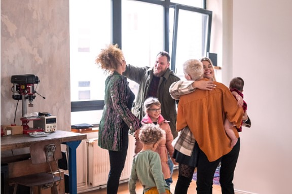

This article has been written and researched by our expert Loveable through a precise methodology. [Learn more about our methodology](https://avada.io/loveable/our-methodological.html)

[Loveable](https://avada.io/loveable/) > [Blog](https://avada.io/loveable/blog/) > [Family](https://avada.io/loveable/family/)

# 10 Expert Tips and Advice for Successful Stepparenting

Written by [Rose Bryne](https://avada.io/loveable/author/rose/) Last Updated on August 23, 2023

- [Why Makes Step Parenting So Hard?](https://avada.io/loveable/blog/successful-stepparenting/#wp-block-heading-2-4)
- [10 Keys for Successful Stepparenting](https://avada.io/loveable/blog/successful-stepparenting/#wp-block-heading-2-12) 
    - [1\. Have Family Meetings Weekly](https://avada.io/loveable/blog/successful-stepparenting/#wp-block-heading-3-13)
    - [2\. Don’t Go Over Your Limit](https://avada.io/loveable/blog/successful-stepparenting/#wp-block-heading-3-16)
    - [3\. Plan Activities With Your Stepchild.](https://avada.io/loveable/blog/successful-stepparenting/#wp-block-heading-3-18)
    - [4\. Don’t Set High Expectations](https://avada.io/loveable/blog/successful-stepparenting/#wp-block-heading-3-20)
    - [5\. Prepare Yourself For Rejection](https://avada.io/loveable/blog/successful-stepparenting/#wp-block-heading-3-23)
    - [6\. Understand that any Relationship Takes Time to Build](https://avada.io/loveable/blog/successful-stepparenting/#wp-block-heading-3-25) 
    - [7\. Respect other Parents](https://avada.io/loveable/blog/successful-stepparenting/#wp-block-heading-3-27) 
    - [8\. Don’t Take Things Personally](https://avada.io/loveable/blog/successful-stepparenting/#wp-block-heading-3-30)
    - [9\. Plan Your Approach to Your New Family and Role Intentionally.](https://avada.io/loveable/blog/successful-stepparenting/#wp-block-heading-3-32)
    - [10\. Never Act in The Role of a “Replacement”](https://avada.io/loveable/blog/successful-stepparenting/#wp-block-heading-3-34)
- [Bottom Line](https://avada.io/loveable/blog/successful-stepparenting/#wp-block-heading-2-38) 

Remarriage is no longer something rare in today’s society when people are aware of finding their own happiness. However, it is easy to encounter inadequacies in remarried life. It’s not just about finding a new destination; it’s a trade-off.

**Stepparenting** may be a difficult task for many people who are negotiating the complications of families. Stepparents confront a unique set of obstacles, from coping with children who are reluctant to change to navigating difficult relationships with ex-partners. However, stepparenting, with prepared strategies, can help them to solve unexpected situations. 

Are you having a headache about not being able to balance your married life? What you need to do to overcome this difficulty? Whether you’re a new stepparent or have been one for a while, maybe you can still get into some trouble. So, these suggestions are carefully prepared for you to make life easier. So, let’s learn about successful stepparenting.

## **Why Makes Step Parenting So Hard?**

Step-parenting can be challenging because of many unpredicted situations: 

- Children frequently think that their step-parent will disrupt their life.
- Adjustments, such as relocating to a new home or following new house rules, may be required.
- Traditions may need to be modified to fit the step-parent’s family.
- The step-parent is often seen as the least favored member of the family.

So, stepparents need to act gently and slowly to get sympathy from children.

## **10 Keys for Successful Stepparenting** 

### **1\. Have Family Meetings Weekly**

It’s a time to gather together and talk about problems that have been encountered. Everyone should have an opportunity to speak and be heard at meetings. Family gatherings foster trust and a sense of belonging among stepparents and stepchildren. A weekly meeting keeps everyone on the same page and working towards similar goals. In that way, you can develop strong connections among family members. 

### **2\. Don’t Go Over Your Limit**

Although you just want to show your care, it’s sometimes over boundaries that make others uncomfortable. As much as you want to be with your stepchildren, it’s important to acknowledge your own needs and schedule time for self-care. Overexertion can lead to exhaustion and harm your connection with your stepchildren. It’s good to say no and put your own needs first.

### **3\. Plan Activities With Your Stepchild.**

There is nothing better to strengthen a relationship than spending time together. Plan activities that your stepchild love to do ( game, sport, camping). Inviting all family members to join in these activities might also assist in creating a family dynamic. Remember to be patient and allow your stepchild time to open up.

### **4\. Don’t Set High Expectations**

The process can be difficult and time-consuming because each child will react differently. Building a foundation of trust and respect is the first step to connecting relationships naturally over time. If there are bumps on the road, don’t be disheartened. Remember that you are still a significant presence in your stepchild’s life, even if it takes a while for them to accept you as a parent.

### **5\. Prepare Yourself For Rejection**

It is important to be ready for any rejection and not react to it personally. Children may struggle to welcome someone new into their life and may even reject them outright. It doesn’t their fault; you can put yourself in their position to feel and sympathize. What you have to do is just keep persistence to show your sincerity. 

### **6\. Understand that any Relationship Takes Time to Build** 

Understand that it will not work immediately. Don’t urge them to open up to you before they’re ready. Allow the connection to evolve gradually over time while remaining sensitive to the child’s needs and feelings. Remember that the child’s attachment to their original parent may influence their willingness to accept you as their new parent figure. If you are patient, you may create a sustainable connection with your stepchild over time. 

### **7\. Respect other Parents** 

It would be despicable if you said something unkind about other parents. Instead of getting a consensus, you maybe get a bad look in their eyes. Avoid criticizing or disparaging them in front of the children. You should strive to keep a nice connection with them for the sake of the children. Communicate effectively with them and be willing to collaborate to address any problems that may emerge. Remember to respect their role and authority in their child’s life as a stepparent. 

### **8\. Don’t Take Things Personally**

To understand a child, you have to spend much more time than you can imagine. Remember to don’t take things personally and respect children’s perspectives. You will soon get the acceptance.

### **9\. Plan Your Approach to Your New Family and Role Intentionally.**

You should create a solid foundation and clear communication from the start. Take the time to initially learn about family members’ interests and attempt to have an overall insight. Let’s show them what you can do as a new member. Show your care with some simple behavior; it would be some compliments or greetings. Otherwise, It’s not bad to prepare some simple gifts to attract them.

### **10\. Never Act in The Role of a “Replacement”**

There is no one for replacement. Attempting to fill that position will only result in frustration and anger on the part of both the kid and the biological parent. Keep in mind and persuade others that you are unique; your fate is here, and you can bring new things. 

**_Related_**: [4 Types Of Parenting Styles And Effects On Children | According To Psychologists](https://avada.io/loveable/types-of-parenting-styles/)

## **Bottom Line** 

We all know that becoming the role of a stepparent is not easy. However, when being ready for a new relationship, you need to accept all the bonds around them. It’s inevitable. However, don’t be worried; just try your best with deep sincerity and respect, and you can soon get achievements.

Looking for advice on how to negotiate the intricacies of stepparenting and create a happy [blended family](https://avada.io/loveable/blog/common-blended-family-issues/)? Look no further **10 Expert Tips and Advice for Successful Stepparenting.** These ideas will help you handle your new family position with intention and confidence.

- [Why Makes Step Parenting So Hard?](https://avada.io/loveable/blog/successful-stepparenting/#wp-block-heading-2-4)
- [10 Keys for Successful Stepparenting](https://avada.io/loveable/blog/successful-stepparenting/#wp-block-heading-2-12) 
    - [1\. Have Family Meetings Weekly](https://avada.io/loveable/blog/successful-stepparenting/#wp-block-heading-3-13)
    - [2\. Don’t Go Over Your Limit](https://avada.io/loveable/blog/successful-stepparenting/#wp-block-heading-3-16)
    - [3\. Plan Activities With Your Stepchild.](https://avada.io/loveable/blog/successful-stepparenting/#wp-block-heading-3-18)
    - [4\. Don’t Set High Expectations](https://avada.io/loveable/blog/successful-stepparenting/#wp-block-heading-3-20)
    - [5\. Prepare Yourself For Rejection](https://avada.io/loveable/blog/successful-stepparenting/#wp-block-heading-3-23)
    - [6\. Understand that any Relationship Takes Time to Build](https://avada.io/loveable/blog/successful-stepparenting/#wp-block-heading-3-25) 
    - [7\. Respect other Parents](https://avada.io/loveable/blog/successful-stepparenting/#wp-block-heading-3-27) 
    - [8\. Don’t Take Things Personally](https://avada.io/loveable/blog/successful-stepparenting/#wp-block-heading-3-30)
    - [9\. Plan Your Approach to Your New Family and Role Intentionally.](https://avada.io/loveable/blog/successful-stepparenting/#wp-block-heading-3-32)
    - [10\. Never Act in The Role of a “Replacement”](https://avada.io/loveable/blog/successful-stepparenting/#wp-block-heading-3-34)
- [Bottom Line](https://avada.io/loveable/blog/successful-stepparenting/#wp-block-heading-2-38) 

### [Rose Bryne](https://avada.io/loveable/author/rose/)

Hi, I'm Rose! I love animals and spending time with kids. At Loveable, I help people find unique gifts for special occasions like Valentine's Day, housewarmings, and graduations. I enjoy finding gifts for kids, teens, and animal lovers that match their interests and personalities. Making gift-giving a pleasant experience is my priority. Let me assist you in finding the perfect gift!

- [Twitter](https://twitter.com/intent/tweet)
- [Facebook](https://www.facebook.com/sharer/sharer.php)
- [instagram](https://avada.io/loveable/blog/successful-stepparenting/)
- [pinterest](https://www.pinterest.com/loveablellc/)

## Related Posts

[### 30 Best 4 Year Old Birthday Party Ideas For A Memorable Celebration](https://avada.io/loveable/blog/4-year-old-birthday-party-ideas/) 

[

### 16th Birthday Party Ideas to Make an Unforgettable Day

](https://avada.io/loveable/blog/16th-birthday-party-ideas/)

[

### 150+ Inspirational Birthday Quotes to Spread Joy on Special Day

](https://avada.io/loveable/blog/inspirational-birthday-quotes/)

[

### 160+ Birthday Wishes for Wife to Express Eternal Love

](https://avada.io/loveable/blog/birthday-wishes-for-wife/)

[### 90+ Heart Touching Birthday Wishes for Niece to Make Her Day Extra Special](https://avada.io/loveable/blog/birthday-wishes-for-niece/)
