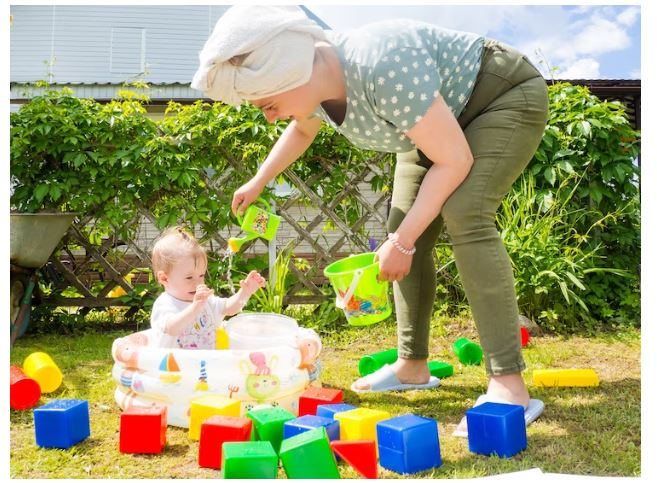
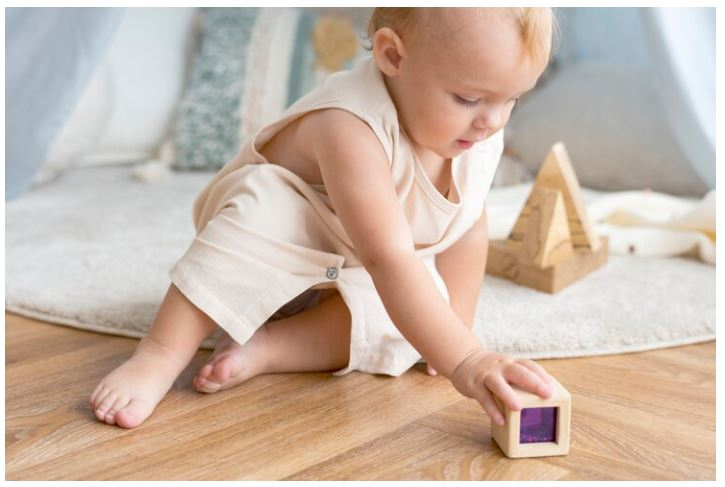
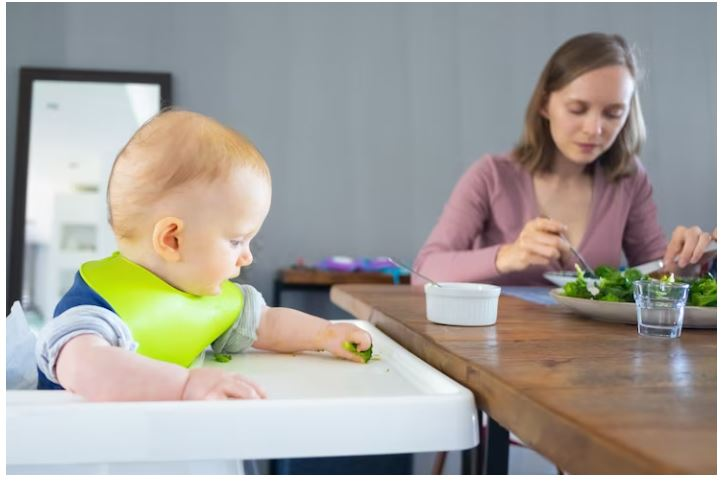
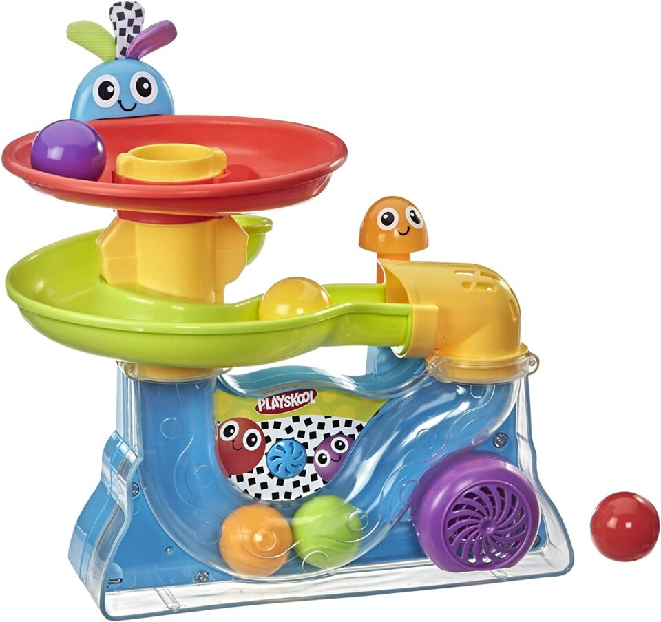
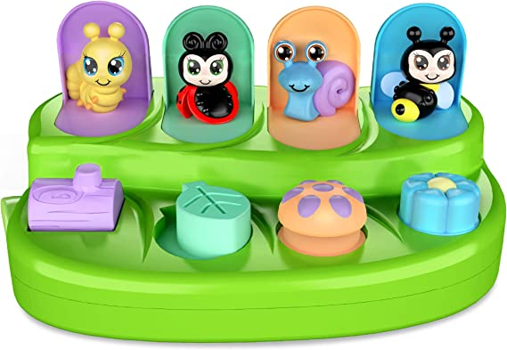
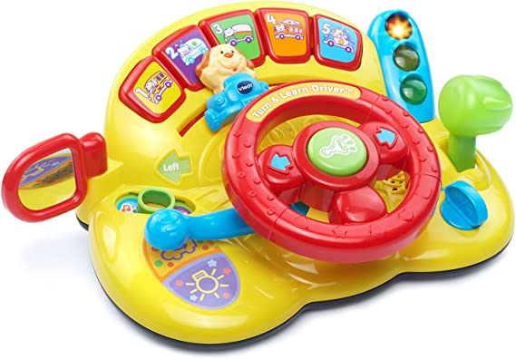
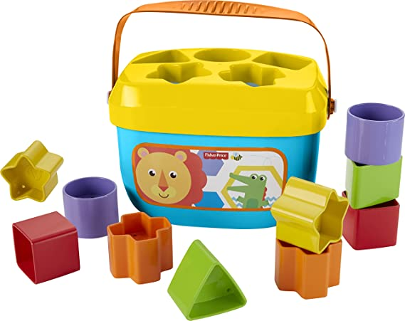
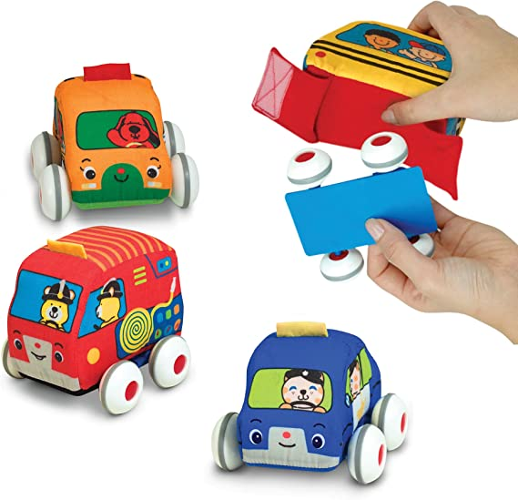
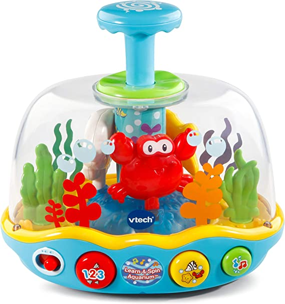

This article has been written and researched by our expert Loveable through a precise methodology. [Learn more about our methodology](https://avada.io/loveable/our-methodological.html)

[Loveable](https://avada.io/loveable/) > [Blog](https://avada.io/loveable/blog/) > [Parenting](https://avada.io/loveable/parenting/)

# 10 Fun and Engaging Activities with 10-Month-Olds: Helpful Advice

Written by [Benjamin Collins](https://avada.io/loveable/author/benjamin/) Last Updated on August 28, 2023

- [10 Interesting Activities for a 10-month-old Baby](https://avada.io/loveable/blog/activities-with-10-month-olds/#wp-block-heading-2-3)
    - [1\. Block Stacking](https://avada.io/loveable/blog/activities-with-10-month-olds/#wp-block-heading-3-5) 
    - [2\. Drawing](https://avada.io/loveable/blog/activities-with-10-month-olds/#wp-block-heading-3-7)
    - [3\. Imitating](https://avada.io/loveable/blog/activities-with-10-month-olds/#wp-block-heading-3-10)
    - [4\. Arranging Things](https://avada.io/loveable/blog/activities-with-10-month-olds/#wp-block-heading-3-14) 
    - [5\. Sorting Game](https://avada.io/loveable/blog/activities-with-10-month-olds/#wp-block-heading-3-17)
    - [6\. Singing with Simple Words](https://avada.io/loveable/blog/activities-with-10-month-olds/#wp-block-heading-3-21)
    - [7\. Cruising](https://avada.io/loveable/blog/activities-with-10-month-olds/#wp-block-heading-3-24)
    - [8\. Walking](https://avada.io/loveable/blog/activities-with-10-month-olds/#wp-block-heading-3-27)
    - [9\. Advanced Crawling Exploration](https://avada.io/loveable/blog/activities-with-10-month-olds/#wp-block-heading-3-31)
    - [10\. Playing with Food](https://avada.io/loveable/blog/activities-with-10-month-olds/#wp-block-heading-3-35)
- [6 Best Toys for 10-Month-Old Well Development](https://avada.io/loveable/blog/activities-with-10-month-olds/#wp-block-heading-2-40)
    - [Busy Ball Popper Toy](https://avada.io/loveable/blog/activities-with-10-month-olds/#wp-block-heading-3-41)
    - [Pop Up Cause and Effect Toy](https://avada.io/loveable/blog/activities-with-10-month-olds/#wp-block-heading-3-45)
    - [Turn and Learn Driver](https://avada.io/loveable/blog/activities-with-10-month-olds/#wp-block-heading-3-49)
    - [Stacking Toy](https://avada.io/loveable/blog/activities-with-10-month-olds/#wp-block-heading-3-53)
    - [Kids Pull-Back Vehicle Set](https://avada.io/loveable/blog/activities-with-10-month-olds/#wp-block-heading-3-57)
    - [Learn and Spin Aquarium](https://avada.io/loveable/blog/activities-with-10-month-olds/#wp-block-heading-3-61)
- [FAQ Activities with 10 Month Old](https://avada.io/loveable/blog/activities-with-10-month-olds/#wp-block-heading-2-68) 
    - [1\. What activities should a 10-month-old baby do?](https://avada.io/loveable/blog/activities-with-10-month-olds/#wp-block-heading-3-69)
    - [2\. How should a 10-month-old play with toys?](https://avada.io/loveable/blog/activities-with-10-month-olds/#wp-block-heading-3-71)
    - [3\. What are fun, creative activities for babies?](https://avada.io/loveable/blog/activities-with-10-month-olds/#wp-block-heading-3-73)
- [Bottom Line](https://avada.io/loveable/blog/activities-with-10-month-olds/#wp-block-heading-2-78) 

Looking for fun activities to engage your 10-month-old baby? As your baby grows and develops, their curiosity and desire to explore the world around them increases. It’s essential to provide them with opportunities to learn and have fun through play. 

Here, we will present **10 fun and creative activities for 10 months old** that can help promote your baby’s cognitive, motor, and social-emotional development. So, let’s dive in and discover some helpful advice for playing with your 10-month-old baby!

## **10 Interesting Activities for a 10-month-old Baby**

### **1\. Block Stacking** 

Unlock your child’s potential for improved motor and concentration skills by introducing them to building blocks or cubes of different sizes. Building and stacking with these toys not only teach them about balance and weight but also encourages cognitive development. Just make sure to choose blocks that are large enough to prevent any safety concerns.

### **2\. Drawing**

Boost your baby’s developing motor skills with the perfect activities with a 10-month-old – drawing! Give them a large sheet of paper and colorful crayons to create their own masterpiece as they explore their world. 

While their technique may not be advanced, the joy of seeing their imagination come to life in vibrant colors will be priceless. Always prioritize safety by using non-toxic crayons and paying attention to your little one to prevent any potential accidents.

### **3\. Imitating**

At 10 months old, your baby is a curious observer and eager imitator. Scientific research has shown that when babies observe the body or facial movements of others, it actually stimulates the corresponding area of their brain. This vital observation and imitation process not only aids in long-term memory retention but also strengthens social and emotional bonds. 

Why not encourage your little one to imitate simple gestures, like hand waving and clapping together? These playful interactions will not only provide entertainment for your baby but also promote healthy brain development and strengthen your parent-child bond.

### **4\. Arranging Things** 

Looking for fun and engaging activities for 10-month-old to help your baby develop their focus and coordination skills? Try giving them a big, easy-to-open box along with an assortment of objects to place inside it. 

Show them how to put in and take out the objects, and watch as they imitate your actions. Not only will this simple activity provide hours of entertainment, but it will also enhance your little one’s ability to hold and coordinate movements between different objects.

### **5\. Sorting Game**

At 10 months old, your baby’s growth and development are in full swing. They are mastering new skills at an incredible rate and becoming more active and sociable. You can help them reach their full potential by engaging them in simple activities with 10 month old, like reading, singing, and playing peek-a-boo. 

Additionally, sorting toys can aid in their cognitive development by encouraging them to sort toys by color and shape, improving their memory, attention, and problem-solving abilities. 

### **6\. Singing with Simple Words**

As your baby reaches the 10-month milestone, you might notice that they start to groove along with the music. Nurture their musical inclination by singing songs your baby enjoys and encouraging them to hum along. 

Not only will this enhance their language skills and rhythm sense, but it will also promote their motor development in a fun and engaging way.

### **7\. Cruising**

Coming to their first birthday, you may notice your babies starting to take their first unassisted steps. This is a major milestone and can be an exciting and emotional time for parents. However, keep in mind that not all babies learn to walk at the same pace. While some babies may be walking confidently by 10-12 months, others may not take their first steps until 16-18 months.

During this time, giving your baby plenty of opportunities to practice and develop their walking skills is important. Encourage them to cruise around furniture and use their hands to balance themselves. You may also want to invest in a walker or push toy to help them gain more confidence in their walking abilities.

### **8\. Walking**

As your little one gains confidence with their newfound mobility, you may find that they are increasingly eager to explore their surroundings. Once they take those first steps, there’s no stopping them! Even if you set limits on where they can go, they’ll find creative ways to venture beyond those boundaries. 

Before you know it, you may find them toddling into the bathroom, reaching for your toothbrush, or investigating the kitchen, perhaps trying to help you with cooking. This newfound independence is an exciting time for both you and your child, and as they continue to explore and learn about their environment, they’ll be developing essential skills and abilities well throughout their lives.

### **9\. Advanced Crawling Exploration**

Encouraging your baby to crawl through various surfaces or obstacles helps to stimulate their gross motor skills and cognitive development. It also helps to promote their confidence and independence. As your baby becomes more active, you should create fun and challenging activities to help them improve their crawling skills.

One idea is to set up an obstacle course using homemade mazes. You can use cushions, pillows, or small gym mattresses to create a winding path for your baby to navigate through. This activity helps develop their problem-solving abilities as they determine the best way to maneuver through the course.

Another fun idea is to set up tents and tunnels for your baby to crawl through. This activity not only helps with their gross motor skills but also promotes their imaginative play and creativity. You can even add some colorful lights or music to make it a sensory experience.

### **10\. Playing with Food**

Exploring food through their hands and mouth is an important part of your baby’s developmental journey, especially as they approach 10 months old. While it may seem daunting to let your little one make a mess, it’s essential to learn to eat.

As babies explore food with their hands and mouth, they begin to understand the properties of different foods, including their texture, taste, and smell. They also develop vital motor skills by learning to pick up food and bring it to their mouth. Allowing them to feed themselves this way also helps build their confidence and independence.

_**Related**_: How To [Make Your Baby Food Easily](https://avada.io/loveable/how-to-make-baby-food/)

## **6 Best Toys for 10-Month-Old Well Development**

### [**Busy Ball Popper Toy**](https://www.amazon.com/Playskool-Explore-Popper-Amazon-Exclusive/dp/B00U5U5VWM/ref=sr_1_3?keywords=10+month+old+baby+toys&qid=1684425249&sr=8-3)

The Busy Ball Popper Toy is a colorful and exciting toy for babies and toddlers aged 9 months and up. With its fun and engaging design, it encourages your little one to explore and play safely and enjoyably. 

The toy comes with five colorful balls that pop out of the top when your child presses the button, stimulating their visual and motor skills. The bright colors and playful sounds help entertain your child for hours. The toy is a great child’s toy collection as it is easy to use, clean, and maintain.

### [**Pop Up Cause and Effect Toy**](https://www.amazon.com/Montessori-Cause-Effect-Developmental-Toddler/dp/B09M4DDKDW/ref=sr_1_4?keywords=10+month+old+baby+toys&qid=1684425249&sr=8-4)

Perfect for babies and toddlers aged 9 months and up, this toy promotes early developmental skills and provides hours of entertainment. This toy will quickly become a favorite with its bright colors and easy-to-use design. 

Simply press the button and watch as the balls pop up and down, teaching your little one about cause and effect. Made from high-quality materials and designed with safety in mind, this toy is the perfect gift for any occasion, from birthdays to holidays.

### [**Turn and Learn Driver**](https://www.amazon.com/VTech-Learn-Driver-Frustration-Packaging/dp/B078KGNGNS/ref=sxin_16_ac_d_mf_brs?ac_md=1-0-VlRlY2g%3D-ac_d_mf_brs_brs&content-id=amzn1.sym.1ad31f34-ba12-4dca-be4b-f62f7f5bb10d%3Aamzn1.sym.1ad31f34-ba12-4dca-be4b-f62f7f5bb10d&cv_ct_cx=10+month+old+baby+toys&keywords=10+month+old+baby+toys&pd_rd_i=B078KGNGNS&pd_rd_r=ceb0afb8-76dc-4ff5-910d-b509e2db1548&pd_rd_w=JulgY&pd_rd_wg=SfsM2&pf_rd_p=1ad31f34-ba12-4dca-be4b-f62f7f5bb10d&pf_rd_r=T8H62WSQ82HBHC2BQS5C&qid=1684425249&sbo=RZvfv%2F%2FHxDF%2BO5021pAnSA%3D%3D&sr=1-1-8b2f235a-dddf-4202-bbb9-592393927392)

The Turn and Learn Driver toy allows children to pretend to drive using the steering wheel, which moves a cute dog character back and forth. It also features five colorful buttons that play over 60 songs and phrases about various animals and vehicles. 

Additionally, the toy encourages imaginative play with fun sounds and music, a traffic light, and a shifter that teaches opposites through push and pull actions. This toy is perfect for encouraging children’s creativity and will provide hours of fun!

### [**Stacking Toy**](https://www.amazon.com/Fisher-Price-FFC84-Babys-First-Blocks/dp/B01NCUSC7V/ref=sxin_16_ac_d_mf_brs?ac_md=2-1-RmlzaGVyLVByaWNl-ac_d_mf_brs_brs&content-id=amzn1.sym.1ad31f34-ba12-4dca-be4b-f62f7f5bb10d%3Aamzn1.sym.1ad31f34-ba12-4dca-be4b-f62f7f5bb10d&cv_ct_cx=10+month+old+baby+toys&keywords=10+month+old+baby+toys&pd_rd_i=B01NCUSC7V&pd_rd_r=ceb0afb8-76dc-4ff5-910d-b509e2db1548&pd_rd_w=JulgY&pd_rd_wg=SfsM2&pf_rd_p=1ad31f34-ba12-4dca-be4b-f62f7f5bb10d&pf_rd_r=T8H62WSQ82HBHC2BQS5C&qid=1684425249&sbo=RZvfv%2F%2FHxDF%2BO5021pAnSA%3D%3D&sr=1-2-8b2f235a-dddf-4202-bbb9-592393927392)

Bring your little baby to the world of shapes and colors with Fisher-Price Stacking Toy Baby’s First Blocks. This set includes 10 colorful blocks, each in a different shape, that your baby can sort and stack. With the help of the shape-sorting lid, your baby can easily drop each block into the corresponding slot. 

This toy is perfect for promoting hand-eye coordination and problem-solving skills in infants. Made of durable and safe materials, it’s a great addition to any baby’s toy collection.

### [**Kids Pull-Back Vehicle Set**](https://www.amazon.com/Melissa-Doug-Pull-Back-Vehicles-Carrying/dp/B00EX5K1GG/ref=sr_1_13?keywords=10+month+old+baby+toys&qid=1684425249&sr=8-13)

This set comes with four colorful vehicles – a car, truck, fire truck, and police car – that are easy to grasp and pull back for hours of fun. Each vehicle is designed with a soft, plush material that is safe for babies and toddlers.

This toy set is perfect for developing a range of skills, including sensory, fine motor, gross motor, problem-solving, language, and social-emotional skills. As babies and toddlers play with these soft vehicles, they’ll explore different textures and shapes, developing their sensory skills.

### [**Learn and Spin Aquari**](https://www.amazon.com/VTech-Learn-and-Spin-Aquarium/dp/B07FK9RNN9/ref=sr_1_12?keywords=10+month+old+baby+toys&qid=1684425249&sr=8-12)**[u](https://www.amazon.com/VTech-Learn-and-Spin-Aquarium/dp/B07FK9RNN9/ref=sr_1_12?keywords=10+month+old+baby+toys&qid=1684425249&sr=8-12)**[**m**](https://www.amazon.com/VTech-Learn-and-Spin-Aquarium/dp/B07FK9RNN9/ref=sr_1_12?keywords=10+month+old+baby+toys&qid=1684425249&sr=8-12)

As your baby pushes the water spout, the aquarium spins, lights up, and plays live music, creating a magical undersea world. The aquarium is home to friendly ocean creatures that playfully swim and spin while the lights flash. 

Your little one will love singing along with the crab, fish, and starfish as they join in with playful sea animal voices. The soft and rounded edges of the aquarium make it safe and perfect for little hands to hold, developing sensory, fine motor, gross motor, problem-solving, language, and social-emotional skills.

_**See More:**_

- Exciting and Educational [Activities for 12-Month-Olds](https://avada.io/loveable/blog/activities-for-12-month-olds/)

- Fun and Stimulating [Activities for 18-Month-Olds](https://avada.io/loveable/blog/activities-for-18-month-olds/)

## **FAQ Activities with 10 Month Old** 

### **1\. What activities should a 10-month-old baby do?**

At 10 months old, babies are developing rapidly and can benefit from a variety of activities such as stacking blocks, drawing with crayons, imitating simple gestures, and sorting toys. Additionally, parents can encourage their musical side by singing and humming along with them. As they become more mobile, obstacle courses and crawling challenges can be introduced to encourage physical development.

### **2\. How should a 10-month-old play with toys?**

A 10-month-old can play with toys by exploring and manipulating them with their hands and mouth. They may enjoy toys that can be stacked or nested. Toys with different textures and shapes can also be engaging. Supervising their play is crucial to ensure the toys are safe and appropriate for their age.

### **3\. What are fun, creative activities for babies?**

- Finger painting with non-toxic paint
- Making sensory bags using different textures and objects
- Playing with homemade playdough
- Exploring bubbles with a bubble machine or blowing bubbles manually.

## **Bottom Line** 

Engaging your 10-month-old in fun and stimulating activities can greatly benefit their overall development. From encouraging their motor skills to fostering social and emotional growth, these activities can lay the foundation for lifelong learning.

Remember to always prioritize your child’s safety and comfort during playtime and to keep a watchful eye on their exploration. With **these activities with 10 months old and toys**, you can create a world of wonder and joy for your growing baby.

- [10 Interesting Activities for a 10-month-old Baby](https://avada.io/loveable/blog/activities-with-10-month-olds/#wp-block-heading-2-3)
    - [1\. Block Stacking](https://avada.io/loveable/blog/activities-with-10-month-olds/#wp-block-heading-3-5) 
    - [2\. Drawing](https://avada.io/loveable/blog/activities-with-10-month-olds/#wp-block-heading-3-7)
    - [3\. Imitating](https://avada.io/loveable/blog/activities-with-10-month-olds/#wp-block-heading-3-10)
    - [4\. Arranging Things](https://avada.io/loveable/blog/activities-with-10-month-olds/#wp-block-heading-3-14) 
    - [5\. Sorting Game](https://avada.io/loveable/blog/activities-with-10-month-olds/#wp-block-heading-3-17)
    - [6\. Singing with Simple Words](https://avada.io/loveable/blog/activities-with-10-month-olds/#wp-block-heading-3-21)
    - [7\. Cruising](https://avada.io/loveable/blog/activities-with-10-month-olds/#wp-block-heading-3-24)
    - [8\. Walking](https://avada.io/loveable/blog/activities-with-10-month-olds/#wp-block-heading-3-27)
    - [9\. Advanced Crawling Exploration](https://avada.io/loveable/blog/activities-with-10-month-olds/#wp-block-heading-3-31)
    - [10\. Playing with Food](https://avada.io/loveable/blog/activities-with-10-month-olds/#wp-block-heading-3-35)
- [6 Best Toys for 10-Month-Old Well Development](https://avada.io/loveable/blog/activities-with-10-month-olds/#wp-block-heading-2-40)
    - [Busy Ball Popper Toy](https://avada.io/loveable/blog/activities-with-10-month-olds/#wp-block-heading-3-41)
    - [Pop Up Cause and Effect Toy](https://avada.io/loveable/blog/activities-with-10-month-olds/#wp-block-heading-3-45)
    - [Turn and Learn Driver](https://avada.io/loveable/blog/activities-with-10-month-olds/#wp-block-heading-3-49)
    - [Stacking Toy](https://avada.io/loveable/blog/activities-with-10-month-olds/#wp-block-heading-3-53)
    - [Kids Pull-Back Vehicle Set](https://avada.io/loveable/blog/activities-with-10-month-olds/#wp-block-heading-3-57)
    - [Learn and Spin Aquarium](https://avada.io/loveable/blog/activities-with-10-month-olds/#wp-block-heading-3-61)
- [FAQ Activities with 10 Month Old](https://avada.io/loveable/blog/activities-with-10-month-olds/#wp-block-heading-2-68) 
    - [1\. What activities should a 10-month-old baby do?](https://avada.io/loveable/blog/activities-with-10-month-olds/#wp-block-heading-3-69)
    - [2\. How should a 10-month-old play with toys?](https://avada.io/loveable/blog/activities-with-10-month-olds/#wp-block-heading-3-71)
    - [3\. What are fun, creative activities for babies?](https://avada.io/loveable/blog/activities-with-10-month-olds/#wp-block-heading-3-73)
- [Bottom Line](https://avada.io/loveable/blog/activities-with-10-month-olds/#wp-block-heading-2-78) 

### [Benjamin Collins](https://avada.io/loveable/author/benjamin/)

I'm Benjamin Collins, a gift ideas creator at Loveable. We specialize in unique and personalized gifts for any occasion. With my honed skills, I recommend gifts tailored to the recipient's personality and interests, whether it's Halloween, Christmas, or any other celebration.

- [Twitter](https://twitter.com/intent/tweet)
- [Facebook](https://www.facebook.com/sharer/sharer.php)
- [instagram](https://avada.io/loveable/blog/activities-with-10-month-olds/)
- [pinterest](https://www.pinterest.com/loveablellc/)

## Related Posts

[

### 79 Heartfelt Missing Mom Quotes for Expressing Love and Longing

](https://avada.io/loveable/blog/missing-mom-quotes/)

[

### Parenting with Depression: Strategies for Coping, Seeking Help, and Building Resilience

](https://avada.io/loveable/blog/parenting-with-depression/)

[

### 100 Empowering Single Mom Quotes: Inspirational Words for Strong Mothers

](https://avada.io/loveable/blog/single-mom-quotes/)

[

### 99+ Heartfelt Quotes And Wishes: Happy Anniversary to Mom and Dad!

](https://avada.io/loveable/blog/quotes-happy-anniversary-mom-dad/)

[

### 5 Ways to Foster a Positive Parent-Teacher Relationship

](https://avada.io/loveable/blog/parent-teacher-relationship/)
