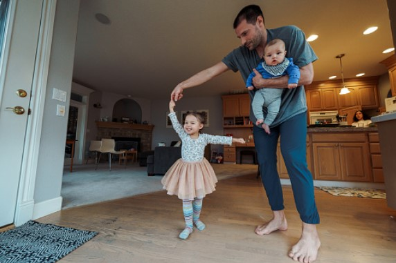
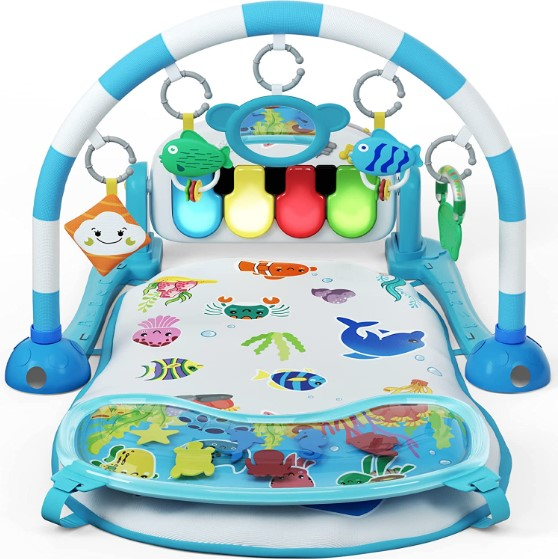
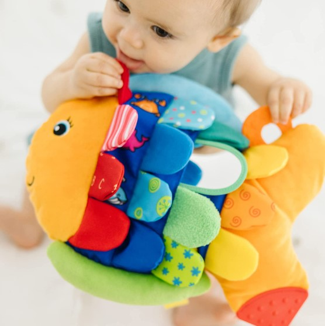
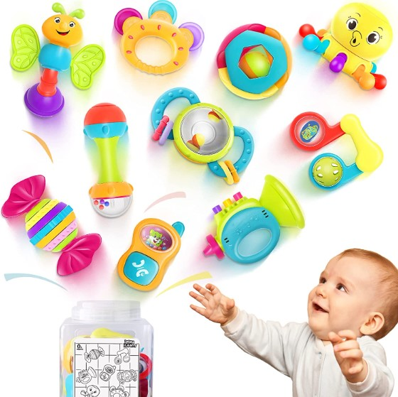
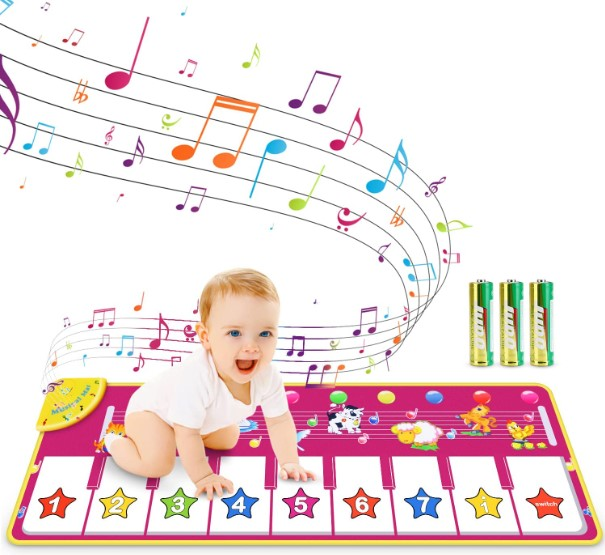
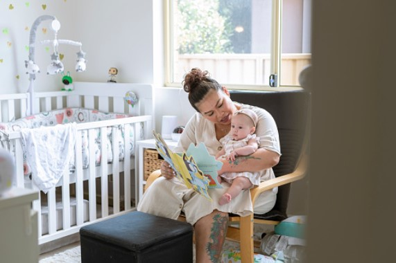

This article has been written and researched by our expert Loveable through a precise methodology. [Learn more about our methodology](https://avada.io/loveable/our-methodological.html)

[Loveable](https://avada.io/loveable/) > [Blog](https://avada.io/loveable/blog/) > [Parenting](https://avada.io/loveable/parenting/)

# 10 Fun And Stimulating Activities with 4-Month-Old Baby You Need To Know

Written by [Benjamin Collins](https://avada.io/loveable/author/benjamin/) Last Updated on August 28, 2023

- [10 Fun And Stimulating Activities with 4-Month-Old to Help Them Develop](https://avada.io/loveable/blog/activities-4-month-old-baby/#wp-block-heading-2-4) 
    - [1\. Allow your baby to explore toys using their mouth.](https://avada.io/loveable/blog/activities-4-month-old-baby/#wp-block-heading-3-5)
    - [2\. Assist your baby in standing on your legs.](https://avada.io/loveable/blog/activities-4-month-old-baby/#wp-block-heading-3-9)
    - [3\. Put on a Show](https://avada.io/loveable/blog/activities-4-month-old-baby/#wp-block-heading-3-12)
    - [4\. Touch Different Textures](https://avada.io/loveable/blog/activities-4-month-old-baby/#wp-block-heading-3-16) 
    - [5\. Make More Facial Expressions](https://avada.io/loveable/blog/activities-4-month-old-baby/#wp-block-heading-3-19) 
    - [6\. Rolling](https://avada.io/loveable/blog/activities-4-month-old-baby/#wp-block-heading-3-23)
    - [7\. Laughing](https://avada.io/loveable/blog/activities-4-month-old-baby/#wp-block-heading-3-26)
    - [8\. Babbling](https://avada.io/loveable/blog/activities-4-month-old-baby/#wp-block-heading-3-30)
    - [9\. Reading for Them](https://avada.io/loveable/blog/activities-4-month-old-baby/#wp-block-heading-3-33) 
    - [10\. Play Peek a Boo](https://avada.io/loveable/blog/activities-4-month-old-baby/#wp-block-heading-3-37)
- [5 Best Toys for 4-Month-Olds to Boost Their Development](https://avada.io/loveable/blog/activities-4-month-old-baby/#wp-block-heading-2-40)
    - [1\. Kick and Play Piano Gym with Water Mat](https://avada.io/loveable/blog/activities-4-month-old-baby/#wp-block-heading-3-41)
    - [2\. Melissa & Doug Flip Fish Soft Baby Toy](https://avada.io/loveable/blog/activities-4-month-old-baby/#wp-block-heading-3-45)
    - [3\. Early Development Learning Music Toy](https://avada.io/loveable/blog/activities-4-month-old-baby/#wp-block-heading-3-49)
    - [4\. Baby Einstein Take Along Tunes Musical Toy](https://avada.io/loveable/blog/activities-4-month-old-baby/#wp-block-heading-3-53)
    - [5\. Musical Piano Mat](https://avada.io/loveable/blog/activities-4-month-old-baby/#wp-block-heading-3-57)
- [FAQ: Activities with a 4-Month-Old Baby](https://avada.io/loveable/blog/activities-4-month-old-baby/#wp-block-heading-2-61)
    - [1\. Do I need to play with my 4-month-old all the time?](https://avada.io/loveable/blog/activities-4-month-old-baby/#wp-block-heading-3-62)
    - [2\. What should a 4-month-old do in a day?](https://avada.io/loveable/blog/activities-4-month-old-baby/#wp-block-heading-3-65)
    - [3\. How long should tummy time be at 4 months?](https://avada.io/loveable/blog/activities-4-month-old-baby/#wp-block-heading-3-67)
    - [4\. How do I know if my 4-month-old is bored?](https://avada.io/loveable/blog/activities-4-month-old-baby/#wp-block-heading-3-70)
    - [5\. How do I know my 4-month-old is happy?](https://avada.io/loveable/blog/activities-4-month-old-baby/#wp-block-heading-3-73)
- [Bottom Line](https://avada.io/loveable/blog/activities-4-month-old-baby/#wp-block-heading-2-78) 

Have you ever wondered how to keep your 4-month-old infant interested and engaged while still promoting their development? There is no need to look any further! Prepare to start on a fantastic trip filled with ten wonderful activities meant to fascinate and excite your growing child’s intellect. Explore the world through their eyes and discover the wonder of engaging their senses.

Consider how happy your baby will be while they play engaging activities and experience new things. **These activities with a 4-month-old** will not only delight your child but will also give them significant opportunities to learn, grow, and explore their environment.

Join us as we explore the realm of interactive play, where every moment offers the chance for exploration and connection. So, if you’re excited to begin this fantastic journey of exploration and growth with your 4-month-old, prepare to be enlightened by a world of fun and engaging activities. Let’s dig in and see what surprises await you and your tiny bundle of joy!

## **10 Fun And Stimulating Activities with 4-Month-Old to Help Them Develop** 

### **1\. Allow your baby to explore toys using their mouth.**

Give your lightweight infant items to bring up to their lips to encourage exploring. It is important that the toys be age-appropriate and free of tiny components or choking dangers. Your child will improve their physical abilities by participating in this exercise. 

They will also learn about different textures as they safely explore new things like a soft fabric ball or a smooth plastic teething ring. This exercise encourages sensory exploration and fine motor development. 

### **2\. Assist your baby in standing on your legs.**

Sitting on a chair or sofa with your child in your arms, gently raise them to a standing posture with their feet resting on your thighs. Encourage your baby to push on his/her legs as you support him/her with your arms. 

This action strengthens the big muscles in their legs, preparing them for critical milestones, including standing, crawling, and, eventually, walking. With time and effort, your baby will be able to experience the excitement of bouncing up and down on his/her legs.

### **3\. Put on a Show**

Get creative and show off your skills! You may imitate barnyard animal sounds, execute letter actions while singing and dancing to the popular melody, or even create your own expressive performance. 

The objective is to engage your child with exaggerated behaviors that evoke laughter and enjoyment. Prepare to create amazing moments filled with delight as you demonstrate your abilities for your kid’s amusement.

### **4\. Touch Different Textures** 

Collect various goods, including a soft blanket, a smooth cloth ball, and a rough teething toy. Touch each thing with your baby’s hand and explain its feel using terms like fuzzy, smooth, and bumpy. 

While your child may not comprehend the meaning of these words yet, they will begin to correlate them with various tactile experiences, enhancing their comprehension of the world through touch. 

### **5\. Make More Facial Expressions** 

Exaggerate your facial expressions by smiling, frowning, and sticking out your tongue. This exercise not only causes chuckles and fun but also helps your baby’s emotional and social development. Your kid learns to perceive and understand different emotions by copying your facial expressions. 

They learn to recognize nonverbal signs and develop empathy, all of which are necessary for developing healthy connections later in life. This fun engagement improves their visual tracking skills as they focus on your face and strive to emulate your gestures. 

### **6\. Rolling**

Introduce your child to the fun world of rolling! Locate a soft, safe area for your child to explore, such as a cushioned play mat. Place your baby on their back and gently urge them to roll over onto their stomach. Place a colorful toy or object just out of their grasp to attract their interest.

Celebrate your baby’s accomplishment with clapping and excitement when they begin to roll. Let’s create a secure and stimulating rolling environment for your baby and watch as he or she discovers the joys of mobility and discovery.

### **7\. Laughing**

Playful activities that bring contagious laughs are ideal. To generate joyous responses, make funny expressions, tickle their tummy, or play peek-a-boo. It’s not only fun for both of you, but it also helps your baby’s general growth and enjoyment.

Laughter offers several developmental advantages for your infant. Your infant learns about comedy, emotional expression, and communication via laughter. It fosters a strong parent-child relationship by creating a good and caring environment. 

### **8\. Babbling**

Babbling is your baby’s method of exploring different sounds and honing their vocal abilities. It sets the groundwork for language learning and communication. You may assist children in comprehending the back-and-forth of communication by imitating their rambling and replying with words and phrases. 

As though you were having a real discussion, respond to their babbles with passionate and encouraging tones. It teaches kids how to take turns, listen, and grasp the rhythm and patterns of speech. Make time for babbling sessions with your child. 

### **9\. Reading for Them** 

Even at an early age, reading helps children lay the groundwork for future learning and literacy. Choose age-appropriate board books with vibrant colors, basic drawings, and textures to stimulate their senses. Use a calm, soothing voice while reading and altering your tone. 

Make reading a regular habit, whether it’s before bed or at peaceful periods during the day. Your infant will acquire a love of books and become an eager participant in the reading experience as they grow.

### **10\. Play Peek a Boo**

Simply hide your face with your hands to play peek-a-boo, then swiftly uncover your face while saying “peek-a-boo!” As your infant anticipates the surprise, watch their face light up with joy.

Peek-a-boo promotes social contact and communication. You should use eye contact and dynamic facial gestures while playing. This engagement aids your baby’s emotional connections, social abilities, and learning to comprehend nonverbal clues.

## **5 Best Toys for 4-Month-Olds to Boost Their Development**

### **1\.** [**Kick and Play Piano Gym with Water Mat**](https://www.amazon.com/UNIH-Musical-Activity-Toddlers-Birthday/dp/B09XGP83BX/)

It provides a variety of play possibilities for laying, sitting, tummy time, and kicking, with 5 colorful hanging rattles and peaceful piano music. The detachable design makes it portable and great for on-the-go playing games. 

During tummy time, the water mat with vibrant floating marine animals fascinates babies, while the water cushion molds and supports their heads, avoiding the formation of a flat head. The adjustable piano toy with relaxing LED lighting improves visual discrimination and sensory development. 

### **2\.** [**Melissa & Doug Flip Fish Soft Baby Toy**](https://www.amazon.com/Melissa-Doug-Developmental-Squeaker-Shatterproof/dp/B00MYWGTGQ/)

This cuddly fish companion provides sensory stimulation and tactile exploration with its squeaking, crinkling, and multi-textured qualities. The toy’s eye-catching facial features and concealed graphics behind the scales contribute to its visual appeal. This toy is easy to clean because it is made of washable materials, making it convenient for parents.

The squeaker tail encourages clutching and finger strength, which aids in the development of fine motor skills. The crinkly scales encourage newborns’ exploration and touch, promoting sensory development. This toy is an excellent baby present, giving hours of enjoyment and sensory stimulation. 

### **3\.** [**Early Development Learning Music Toy**](https://www.amazon.com/iPlay-iLearn-Rattles-Teether-Educational/dp/B071YCHDX1)

It is a set of 10 colored rattles/teethers to help a baby through the many growth phases. Each rattle has a distinct form and grip, facilitating the development of fine motor skills. This toy, with its many textures, colors, and noises, will assist newborns in exploring and developing their senses of touch, taste, smell, and sound. 

This set is suited for use in nurseries and childcare centers. It comes in its own container, making it simple to store and keep clean. The rattles may also be simply added to a stroller for fun on the move. 

### **4\.** [**Baby Einstein Take Along Tunes Musical Toy**](https://www.amazon.com/Baby-Einstein-Along-Tunes-Musical/dp/B000YDDF6O/)

It requires no assembly and is ready to use right out of the box. This toy creates a lifelong love of music in young children by allowing them to alternate between 10 distinct tunes, exposing them to various musical styles and sounds.

This musical toy is safe and pleasant for tiny hands to grip and explore. The volume control function allows parents to adjust the music level to their liking, making it pleasurable for both babies and adults. 

### **5\.** [**Musical Piano Mat**](https://www.amazon.com/RenFox-Electronic-Different-Education-Batteries/dp/B0863CGZ6Y/)

Children may experiment with numerous sounds from animals and piano scales using the 8 animal keys, 8 piano keys, and various modes. The mat is made of high-quality, non-toxic polyester, which ensures the safety and comfort of small feet. 

This educational toy improves language development, hand-foot coordination, cognitive capacity, and other skills. Children may sing, dance, and make their own music, which promotes their creativity and cognitive development. The folding shape makes it compact and space-saving, making transit and storage simple. 

## **FAQ: Activities with a 4-Month-Old Baby**

### **1\. Do I need to play with my 4-month-old all the time?**

No, you do not have to entertain your 4-month-old infant constantly. While engaging in interactive activities and stimulating their growth, it is also essential to provide them with time for independent play. You should strike a balance between supervised playtime and individual discovery. Remember to pay attention to your baby’s indications and wants, and respond accordingly.

### **2\. What should a 4-month-old do in a day?**

As mentioned above, there is a list of activities with a 4-month-old for you. All of them have been proven to be beneficial for infants in both physical and mental health. You should spend a little leisure to help your babies form their good habits. It’s not bad to prepare some [4-Month-Old Baby Gifts](https://avada.io/loveable/gifts-for-4-month-old/) for them to play and learn. When they know how to play, you can let them play independently. 

### **3\. How long should tummy time be at 4 months?**

Starting tummy time early is important, and you may be wondering about the duration of each session. It’s worth noting that even short sessions can have a significant impact. For newborns, aim for two to three sessions a day, lasting three to five minutes each. 

As your baby grows and becomes more comfortable with tummy time, you can gradually increase both the frequency and duration of the sessions. They need a total of 20 to 30 minutes of tummy time spread throughout the day. Remember that this time can be divided into shorter sessions. Continue practicing tummy time until your baby can roll over independently, typically around 6 or 7 months of age. 

### **4\. How do I know if my 4-month-old is bored?**

When your infant looks distracted and uninterested in their environment, lacking the desire to connect with toys or activities, this is a sign. Furthermore, if your child gets fussy or easily agitated, it may indicate a desire for additional stimulation. Boredom can also be indicated by short attention spans, such as frequent wiggling.

### **5\. How do I know my 4-month-old is happy?**

Observing your 4-month-old’s behavior and body language might help you see indicators of pleasure. When your baby is content, they may smile and laugh, accompanied by cooing sounds. They may also express their excitement and enthusiasm by clapping or waving their hands.

**_See More:_**

- Fun and Creative [Activities for a 5-Month-Old Baby](https://avada.io/loveable/blog/activities-for-5-month-old-baby/)

- Engaging [Activities for a 6-Month-Old Baby](https://avada.io/loveable/blog/activities-for-6-month-old/)

## **Bottom Line** 

Playing and interacting with your 4-month-old infant is essential for their nurturing and growth. The **“10 Fun And Stimulating Activities with 4-Month-Old Baby”** offers a variety of engaging activities that encourage your baby’s development, excite their senses, and create family bonding.

Parents who participate in these activities not only assist their kid’s physically develop but also foster cognitive development and social connection.  You set up a loving and developing environment for your 4-month-old via active participation and interaction with your infant. Observing and responding to your kid, as well as giving age-appropriate toys, will aid in their overall development.

Finally, spend time and love playing and engaging with your child. This creates treasured memories and contributes favorably to their growth during this critical period. And if you can, don’t forget some toy suggestions above.

- [10 Fun And Stimulating Activities with 4-Month-Old to Help Them Develop](https://avada.io/loveable/blog/activities-4-month-old-baby/#wp-block-heading-2-4) 
    - [1\. Allow your baby to explore toys using their mouth.](https://avada.io/loveable/blog/activities-4-month-old-baby/#wp-block-heading-3-5)
    - [2\. Assist your baby in standing on your legs.](https://avada.io/loveable/blog/activities-4-month-old-baby/#wp-block-heading-3-9)
    - [3\. Put on a Show](https://avada.io/loveable/blog/activities-4-month-old-baby/#wp-block-heading-3-12)
    - [4\. Touch Different Textures](https://avada.io/loveable/blog/activities-4-month-old-baby/#wp-block-heading-3-16) 
    - [5\. Make More Facial Expressions](https://avada.io/loveable/blog/activities-4-month-old-baby/#wp-block-heading-3-19) 
    - [6\. Rolling](https://avada.io/loveable/blog/activities-4-month-old-baby/#wp-block-heading-3-23)
    - [7\. Laughing](https://avada.io/loveable/blog/activities-4-month-old-baby/#wp-block-heading-3-26)
    - [8\. Babbling](https://avada.io/loveable/blog/activities-4-month-old-baby/#wp-block-heading-3-30)
    - [9\. Reading for Them](https://avada.io/loveable/blog/activities-4-month-old-baby/#wp-block-heading-3-33) 
    - [10\. Play Peek a Boo](https://avada.io/loveable/blog/activities-4-month-old-baby/#wp-block-heading-3-37)
- [5 Best Toys for 4-Month-Olds to Boost Their Development](https://avada.io/loveable/blog/activities-4-month-old-baby/#wp-block-heading-2-40)
    - [1\. Kick and Play Piano Gym with Water Mat](https://avada.io/loveable/blog/activities-4-month-old-baby/#wp-block-heading-3-41)
    - [2\. Melissa & Doug Flip Fish Soft Baby Toy](https://avada.io/loveable/blog/activities-4-month-old-baby/#wp-block-heading-3-45)
    - [3\. Early Development Learning Music Toy](https://avada.io/loveable/blog/activities-4-month-old-baby/#wp-block-heading-3-49)
    - [4\. Baby Einstein Take Along Tunes Musical Toy](https://avada.io/loveable/blog/activities-4-month-old-baby/#wp-block-heading-3-53)
    - [5\. Musical Piano Mat](https://avada.io/loveable/blog/activities-4-month-old-baby/#wp-block-heading-3-57)
- [FAQ: Activities with a 4-Month-Old Baby](https://avada.io/loveable/blog/activities-4-month-old-baby/#wp-block-heading-2-61)
    - [1\. Do I need to play with my 4-month-old all the time?](https://avada.io/loveable/blog/activities-4-month-old-baby/#wp-block-heading-3-62)
    - [2\. What should a 4-month-old do in a day?](https://avada.io/loveable/blog/activities-4-month-old-baby/#wp-block-heading-3-65)
    - [3\. How long should tummy time be at 4 months?](https://avada.io/loveable/blog/activities-4-month-old-baby/#wp-block-heading-3-67)
    - [4\. How do I know if my 4-month-old is bored?](https://avada.io/loveable/blog/activities-4-month-old-baby/#wp-block-heading-3-70)
    - [5\. How do I know my 4-month-old is happy?](https://avada.io/loveable/blog/activities-4-month-old-baby/#wp-block-heading-3-73)
- [Bottom Line](https://avada.io/loveable/blog/activities-4-month-old-baby/#wp-block-heading-2-78) 

### [Benjamin Collins](https://avada.io/loveable/author/benjamin/)

I'm Benjamin Collins, a gift ideas creator at Loveable. We specialize in unique and personalized gifts for any occasion. With my honed skills, I recommend gifts tailored to the recipient's personality and interests, whether it's Halloween, Christmas, or any other celebration.

- [Twitter](https://twitter.com/intent/tweet)
- [Facebook](https://www.facebook.com/sharer/sharer.php)
- [instagram](https://avada.io/loveable/blog/activities-4-month-old-baby/)
- [pinterest](https://www.pinterest.com/loveablellc/)

## Related Posts

[

### 79 Heartfelt Missing Mom Quotes for Expressing Love and Longing

](https://avada.io/loveable/blog/missing-mom-quotes/)

[

### Parenting with Depression: Strategies for Coping, Seeking Help, and Building Resilience

](https://avada.io/loveable/blog/parenting-with-depression/)

[

### 100 Empowering Single Mom Quotes: Inspirational Words for Strong Mothers

](https://avada.io/loveable/blog/single-mom-quotes/)

[

### 99+ Heartfelt Quotes And Wishes: Happy Anniversary to Mom and Dad!

](https://avada.io/loveable/blog/quotes-happy-anniversary-mom-dad/)

[

### 5 Ways to Foster a Positive Parent-Teacher Relationship

](https://avada.io/loveable/blog/parent-teacher-relationship/)
