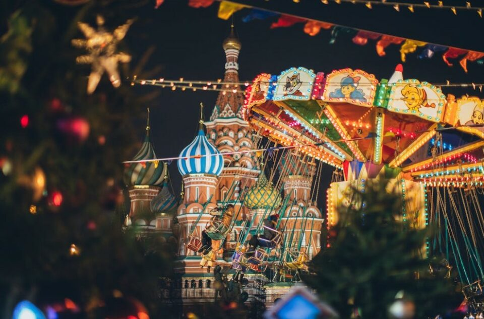
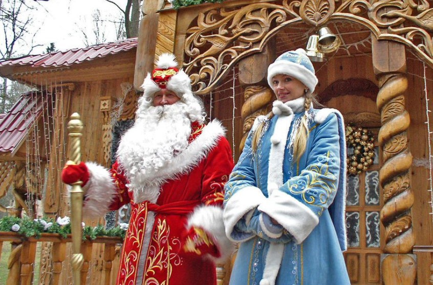
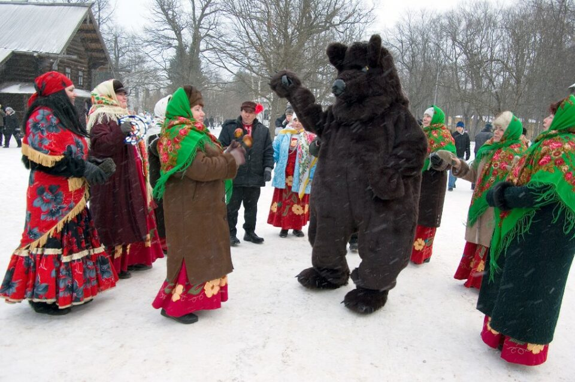
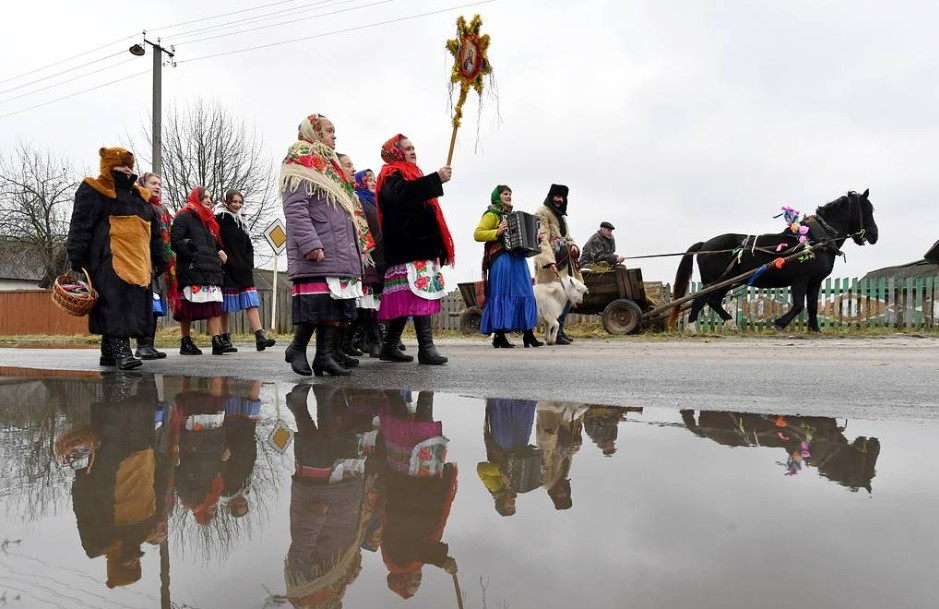
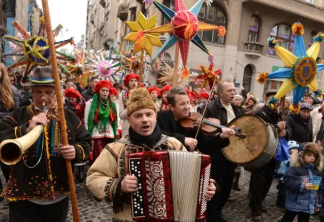
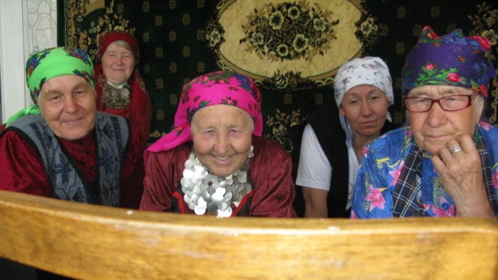
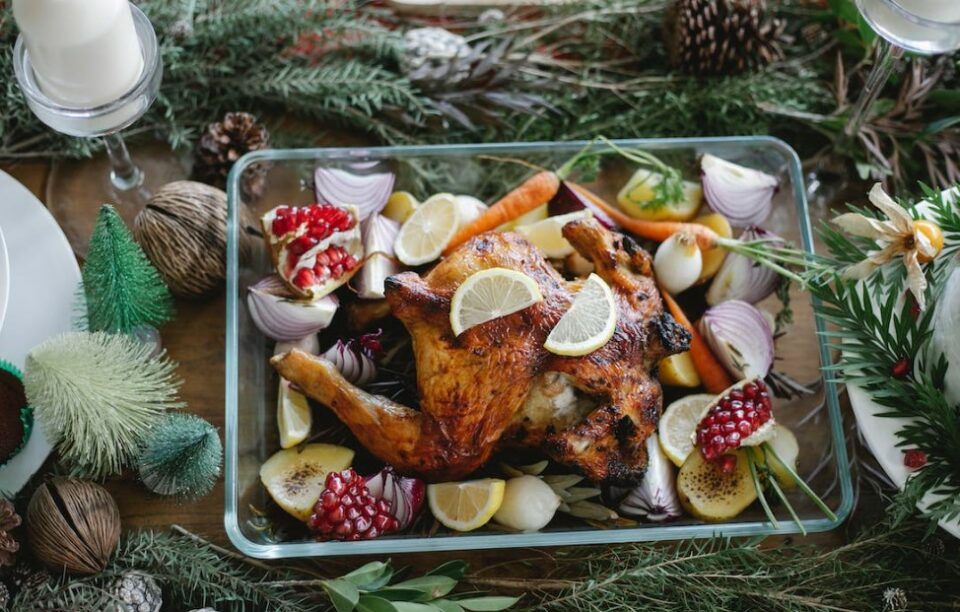
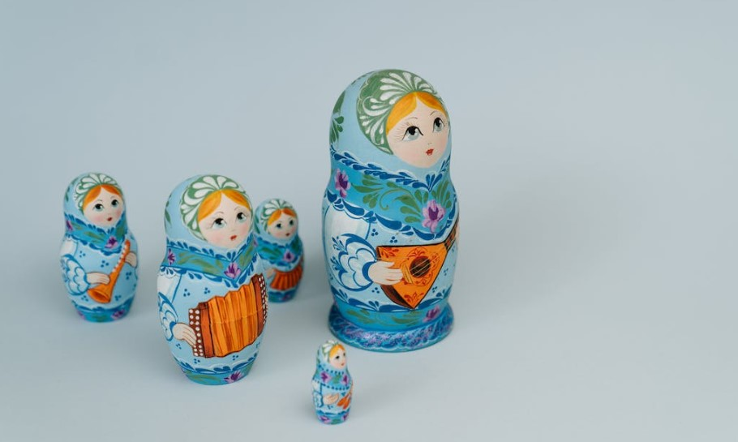

This article has been written and researched by our expert Loveable through a precise methodology. [Learn more about our methodology](https://avada.io/loveable/our-methodological.html)

[Loveable](https://avada.io/loveable/) > [Blog](https://avada.io/loveable/blog/) > [Holiday](https://avada.io/loveable/holiday/)

# 10 Interesting Russian Christmas Traditions Make You Surprise

Written by [Blake Simpson](https://avada.io/loveable/author/blake/) Last Updated on September 13, 2023

- [10 Russian Christmas Traditions You Should Know](https://avada.io/loveable/blog/russian-christmas-traditions/#wp-block-heading-2-3)
    - [1\. It Happens In January](https://avada.io/loveable/blog/russian-christmas-traditions/#wp-block-heading-3-4) 
    - [2\. Ded Moroz – The Russian Santa Claus](https://avada.io/loveable/blog/russian-christmas-traditions/#wp-block-heading-3-8)
    - [3\. Russian Xmas Table Decorations](https://avada.io/loveable/blog/russian-christmas-traditions/#wp-block-heading-3-13)
    - [4\. Svyatki](https://avada.io/loveable/blog/russian-christmas-traditions/#wp-block-heading-3-17)
    - [5\. Fortune-Telling](https://avada.io/loveable/blog/russian-christmas-traditions/#wp-block-heading-3-21)
    - [6\. Koliada](https://avada.io/loveable/blog/russian-christmas-traditions/#wp-block-heading-3-25)
    - [7\. Religious Observances](https://avada.io/loveable/blog/russian-christmas-traditions/#wp-block-heading-3-29)
    - [8\. Story Of Baboushka](https://avada.io/loveable/blog/russian-christmas-traditions/#wp-block-heading-3-34)
    - [9\. Nativity Fast For The Christmas Eve](https://avada.io/loveable/blog/russian-christmas-traditions/#wp-block-heading-3-38)
    - [10\. Russian Christmas Gifts: Nesting Dolls](https://avada.io/loveable/blog/russian-christmas-traditions/#wp-block-heading-3-42)
- [Bottom Line](https://avada.io/loveable/blog/russian-christmas-traditions/#wp-block-heading-2-48)

**Russian Christmas traditions** are a captivating fusion of centuries-old customs, rich folklore, and spiritual significance, creating a festive tapestry like no other. The snow-covered landscapes and frosty air set the stage for a magical holiday season.

Imagine a world where Christmas isn’t celebrated on December 25th but instead on January 7th, in accordance with the Julian calendar. Picture ornately decorated Christmas trees that evoke a sense of wonder. Join us on a virtual journey through the enchanting Russian Christmas traditions, infusing a new touch into your own holiday celebrations.

## **10 Russian Christmas Traditions You Should Know**

### **1\. It Happens In January** 

In Russia, the celebration of Christmas takes place on January 7. This variance arises due to the employment of distinct calendars by the Russian Orthodox Church for religious festivities and other periods of the year.

Characteristically, Advent unfolds from November 28 through January 6, adhering to fixed dates. On a broader scale in the nation, the officially recognized celebration holidays span from December 31 to January 10.

### **2\. Ded Moroz – The Russian Santa Claus**

In Russia, the figure comparable to Santa Claus goes by Ded Moroz, which translates to Father Frost. When the New Year’s Eve festivities roll around, “Ded Moroz” takes on the role of gift-giver. Accompanying him is Snegurochka, the snow maiden – often seen as his granddaughter.

Ded Moroz is tall and slender, unlike the rotund Santa Claus. It’s quite different from Santa’s sleigh – Ded Moroz elegantly traverses the Russian landscape using a troika, a vehicle drawn by a trio of horses. So you should attend Moscow’s Russian Winter Festival when traveling.

**See more:** _[Secret Santa Gift Ideas](https://avada.io/loveable/secret-santa-gift-ideas/) to dive into Russian festive traditions_

### **3\. Russian Xmas Table Decorations**

For Russian Christmas celebrations, they often adorn their tables with pristine white tablecloths, evoking the swaddling clothes that enwrapped the infant Jesus. Hay is arranged on or near the table to evoke the essence of Jesus’s modest beginnings, reminding him of his nativity setting. 

The table’s heart is graced by a white candle – a symbolic representation of Jesus, given his designation as the “light of the world.” Positioned adjacent to or encircling the candle, one will likely encounter a loaf of pagach bread – a special variety specifically enjoyed. This bread signifies Jesus’s role as the “bread of life” offered to humanity.

### **4\. Svyatki**

In the wake of Christmas, the period known as Svyatki in Russia extends for two weeks. This Christmastide tradition, encompassing the timeframe from Christmas until January 19th, coinciding with the celebration of Epiphany, holds profound significance. 

That day also commemorates the baptism of Jesus Christ, prompting individuals to pay tribute to this event in a rather unconventional manner. They will take a daring plunge into the frigid waters of the country’s icy rivers and lakes. This practice embodies the convergence of spirituality and devotion intersecting with the depths of winter.

### **5\. Fortune-Telling**

Once upon a time, it was exclusively the domain of young, unmarried women who would engage in divination rituals within the confines of a banya. However, contemporarily, this custom has evolved to encompass participation from the entire family.

The spectrum of these traditions spans far and wide, featuring an array of regional and locally distinctive variations. These include interpreting tea leaves, reading tarot cards, and analyzing patterns formed by coffee grounds. In certain regions, a peculiar ritual involves filling a bowl with rice and posing a question.

### **6\. Koliada**

Another tradition rooted in pre-Christian times is the winter festival known as “Koliada”, similar to Christmas caroling. Its remarkable characteristic is the performance of Mummers’ plays, employing fur, horns, and masks for authenticity. “Kolyadary” participants orchestrate a carnival with dances within households and on the streets.

If treats are proffered in the yard, the Kolyadary expresses gratitude and moves on to the subsequent house. If invited indoors, they perform specialized carols tailored to each household member.

### **7\. Religious Observances**

For a significant portion of the 20th century, Russia was a Communist nation that embraced atheism. However, with the dissolution of the Soviet Union in 1991, there has been a notable resurgence of religious inclination among Russians, particularly toward Russian Orthodoxy. This shift is evident in the increasing number of individuals who now commemorate Christmas as a religious holiday.

Several traditions within Russian Orthodoxy mirror those observed in various parts of Eastern Europe. Russians often spread hay across their floors and tables to symbolize the manger of baby Jesus. Subsequently, a white tablecloth is laid over the hay to represent the swaddling clothes in which Jesus was wrapped.

**See more:** _[Gift For Those Who Have A Religious Life](https://avada.io/loveable/personalized-bible/)_

### **8\. Story Of Baboushka**

Whether originating in Russia or a 20th-century American poem, the story remains a cherished tale shared with Russian children during Christmas. It revolves around Baboushka, also known as “Grandmother,” whose life intersected with the birth of Jesus profoundly, even if she did not personally meet him. 

According to the narrative, Baboushka was at home tending her fire for warmth when the three Magi arrived during a blizzard. Seeking shelter, they informed her of their journey to greet the newly born Christ child, guided by a hidden star. This radiant star symbolized the birth of a sacred infant, and they planned to bestow gifts.

### **9\. Nativity Fast For The Christmas Eve**

During this festive gathering, family members partake in lenten bread dipped in a mix of honey and garlic. Among the main dishes that grace the Christmas feast, one finds “kutya”, a blend of grains and poppy seeds sweetened with honey.

Another flavorful stew is the vegetarian-style “borscht” or “solyanka”. This stew often features an array of components, including salads, “sauerkraut”, dried fruits, potatoes, and beans. Transitioning to the Christmas Day meal, the spotlight shifts to the main course, like pork, goose, or an alternative meat dish.

### **10\. Russian Christmas Gifts: Nesting Dolls**

If your quest involves seeking Christmas presents with a touch of Russian traditions, it’s worth exploring the Nesting Dolls and Russian lacquer boxes. If you find yourself in Moscow, your search could lead you to the Izmaylovo Market or Revolution Square during the Russian Winter Festival. Alternatively, you’re likely to find them in the majority of souvenir shops nationwide. And should luggage space pose a constraint, these cherished gifts are also readily available online.

**_See More:_**

- [Irish Christmas Traditions](https://avada.io/loveable/blog/irish-christmas-traditions/)

- [Polish Christmas Traditions](https://avada.io/loveable/blog/polish-christmas-traditions/)

## **Bottom Line**

Dive into the captivating world of **Russian Christmas traditions**, discover the unique blend of Koliada, and witness the magical ritual of fortune-telling. Whether the aromatic allure of “kutya”, or the mesmerizing appeal of Mummers’ plays captures your curiosity, these customs vividly depict Russia’s dynamic holiday spirit. 

Embark on a voyage of discovery into the concealed gems of Russian Christmas, where time-honored rituals seamlessly intertwine with contemporary celebrations. It definitely offers you a delightful odyssey into the heart of this rich and diverse culture.

- [10 Russian Christmas Traditions You Should Know](https://avada.io/loveable/blog/russian-christmas-traditions/#wp-block-heading-2-3)
    - [1\. It Happens In January](https://avada.io/loveable/blog/russian-christmas-traditions/#wp-block-heading-3-4) 
    - [2\. Ded Moroz – The Russian Santa Claus](https://avada.io/loveable/blog/russian-christmas-traditions/#wp-block-heading-3-8)
    - [3\. Russian Xmas Table Decorations](https://avada.io/loveable/blog/russian-christmas-traditions/#wp-block-heading-3-13)
    - [4\. Svyatki](https://avada.io/loveable/blog/russian-christmas-traditions/#wp-block-heading-3-17)
    - [5\. Fortune-Telling](https://avada.io/loveable/blog/russian-christmas-traditions/#wp-block-heading-3-21)
    - [6\. Koliada](https://avada.io/loveable/blog/russian-christmas-traditions/#wp-block-heading-3-25)
    - [7\. Religious Observances](https://avada.io/loveable/blog/russian-christmas-traditions/#wp-block-heading-3-29)
    - [8\. Story Of Baboushka](https://avada.io/loveable/blog/russian-christmas-traditions/#wp-block-heading-3-34)
    - [9\. Nativity Fast For The Christmas Eve](https://avada.io/loveable/blog/russian-christmas-traditions/#wp-block-heading-3-38)
    - [10\. Russian Christmas Gifts: Nesting Dolls](https://avada.io/loveable/blog/russian-christmas-traditions/#wp-block-heading-3-42)
- [Bottom Line](https://avada.io/loveable/blog/russian-christmas-traditions/#wp-block-heading-2-48)

### [Blake Simpson](https://avada.io/loveable/author/blake/)

Hi, I'm Blake from Loveable. I help people find perfect gifts for occasions like anniversaries and weddings. I also write a blog about holidays, sharing insights to make them more meaningful. Let's create unforgettable moments together!

- [Twitter](https://twitter.com/intent/tweet)
- [Facebook](https://www.facebook.com/sharer/sharer.php)
- [instagram](https://avada.io/loveable/blog/russian-christmas-traditions/)
- [pinterest](https://www.pinterest.com/loveablellc/)

## Related Posts

[### 120+ Christian Birthday Wishes To Spread Your Love](https://avada.io/loveable/blog/christian-birthday-wishes/) 

[

### 35 Best 70th Birthday Ideas To Celebrate The Special Milestone

](https://avada.io/loveable/blog/70th-birthday-ideas/)

[

### 50 Best 30th Birthday Decorations for a Remarkable Birthday Bash

](https://avada.io/loveable/blog/30th-birthday-decorations/)

[

### 40 Delicious Vegan Christmas Desserts to Delight Your Palate

](https://avada.io/loveable/blog/vegan-christmas-desserts/)

[

### 60 Christmas Team Building Activities to Boost Workplace Spirit

](https://avada.io/loveable/blog/christmas-team-building-activities/)
