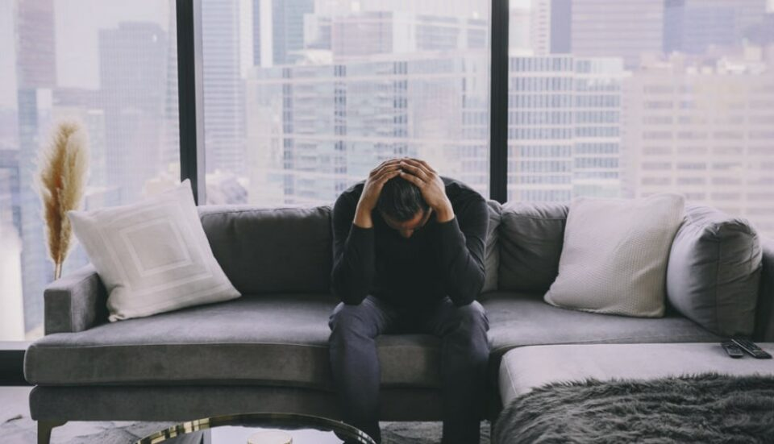
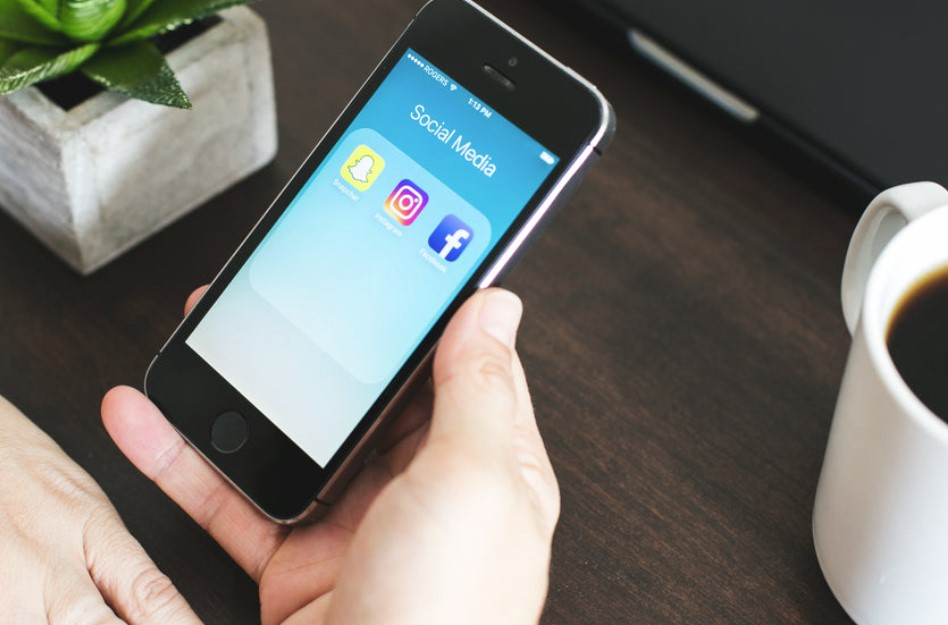
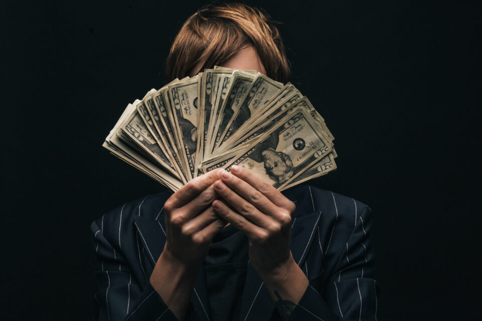

This article has been written and researched by our expert Loveable through a precise methodology. [Learn more about our methodology](https://avada.io/loveable/our-methodological.html)

[Loveable](https://avada.io/loveable/) > [Blog](https://avada.io/loveable/blog/) > [Holiday](https://avada.io/loveable/holiday/)

# 10 Reasons Why Valentines Day Is Bad

Written by [Blake Simpson](https://avada.io/loveable/author/blake/) Last Updated on August 18, 2023

- [Valentine’s Day May Induce Feelings of Depression](https://avada.io/loveable/blog/reasons-why-valentines-day-is-bad/#wp-block-heading-2-4)
- [Waste Of Time And Effort In Making Restaurant Reservations And Planning For The Date](https://avada.io/loveable/blog/reasons-why-valentines-day-is-bad/#wp-block-heading-2-9) 
- [Valentine Brings About Lots Of Spending Pressure](https://avada.io/loveable/blog/reasons-why-valentines-day-is-bad/#wp-block-heading-2-13)  
- [Expecting Too Much From A Perfect Date Can Negatively Affect The Relationship](https://avada.io/loveable/blog/reasons-why-valentines-day-is-bad/#wp-block-heading-2-19)
- [Valentine’s Day Keeps Outdated Gender Roles In Place.](https://avada.io/loveable/blog/reasons-why-valentines-day-is-bad/#wp-block-heading-2-22)
- [Valentine Puts People Under Pressure When They Try To Compare Their Own Efforts With Others](https://avada.io/loveable/blog/reasons-why-valentines-day-is-bad/#wp-block-heading-2-25)
- [The Origin Of Valentine’s Day Is Extremely Dark](https://avada.io/loveable/blog/reasons-why-valentines-day-is-bad/#wp-block-heading-2-27)
- [Tons Of Cheesy Posts On Social Media Can Make A Lot Of People Uncomfortable](https://avada.io/loveable/blog/reasons-why-valentines-day-is-bad/#wp-block-heading-2-31)
- [Everything Becomes Way Overpriced!](https://avada.io/loveable/blog/reasons-why-valentines-day-is-bad/#wp-block-heading-2-35)
- [Some Colours Are More Preferable Than Other For No Reasons](https://avada.io/loveable/blog/reasons-why-valentines-day-is-bad/#wp-block-heading-2-40) 
- [Bottom line](https://avada.io/loveable/blog/reasons-why-valentines-day-is-bad/#wp-block-heading-2-42) 

The holiday that I dislike the most may be [Valentine’s Day](https://avada.io/loveable/what-is-valentines-day/). Moreover, I also feel the most pressure around this particular holiday. Why? The poisonous notion is that we have to prove to “the world” how deeply in love we are and that we should feel guilty about our single status if we do not have a significant other.

Do you think It is bad enough? According to CNN, a study conducted in 2010 on the relationship statuses of users on Facebook found that most breakups occur after Valentine’s Day. This may be due to the high number of unfulfilled expectations associated with the occasion. On the other hand, if you don’t have a significant other, you might feel the need to swipe your way into a date because of the fear of missing out (FOMO). All in all, although some people feel really excited about this time, It can’t be denied that this holiday has disappointed many of us.

If you want to dig deep into it, then keep reading this article because we are going to get you through 10 Reasons why Valentine’s day is bad for us. 

## Valentine’s Day May Induce Feelings of Depression

As Psychologist Linda Walter described in Psychology Today: “The isolation of being single on Valentine’s Day can make you feel anxious or depressed. Perhaps you fear that you will never find love or be loved. You might feel the same if you were in an unhappy relationship.” 

If you’re single and spending Valentine’s Day among the world’s most content couples and if you’re already struggling with anxiety or depression, this holiday can be a significant trigger. It may seem like everyone else in the world has found their soul mate except you, with everyone carefully curating their social media, feeds to show the best version of themselves rather than who they really are. However, that is not accurate. 

Don’t judge yourself based on the actors and actresses you see on screen. Is there any couple you know in real life that looks like the ones in the movies and commercials?

## Waste Of Time And Effort In Making Restaurant Reservations And Planning For The Date 

Expectations for a holiday meal can get stressful if you wait until the last minute to make a reservation and then are disappointed. According to OpenTable’s 2017 Valentine’s Day dining data, about 40% of reservations were made the week before the holiday across all restaurants accessible via the app. 

Indeed, Valentine’s Day makes it even more challenging to secure a table at a popular restaurant in major cities. And this could make you feel even more anxious. And that’s not all. After you have finished the booking, the price of that fancy dinner is going to be absolutely unreasonable.

## Valentine Brings About Lots Of Spending Pressure  

The National Retail Federation has estimated the number that an average person will spend $161.96 on [Valentine’s Day gifts for their loved ones](https://avada.io/loveable/valentine/), including spouses, children, parents, friends, and coworkers. It’s even crazier to know that in 2017, Americans spent over $30 billion on this holiday. That’s a lot of cash for a Wednesday, honestly.

The pressure to get your boo the loveliest, biggest gift in the history of the world at Valentine’s can throw your money into a firestorm from which you may spend the rest of the year trying to recover if your bank account is in the single digits after the holidays.

However, when it comes to gifts, you don’t have to spend hundreds of dollars on luxury gifts to impress your beloved. Sometimes just small gifts showing your love and effort can make your significant other happy. For example, you can make a DIY gift like a romantic valentine’s card, a craft book about your relationship, or an adorable keychain. Guarantees they will burst out. 

But if you are not skillful enough to make a gift yourself. Don’t worry! Loveable is here to help. We’ve compiled a list of beautiful, meaningful, and extremely affordable Valentine’s gifts. Surely with this list of [cheap Valentine’s gifts](https://avada.io/loveable/cheap-valentines-day-gifts/), you will not need to worry much about financial problems during Valentine’s Day. 

## Expecting Too Much From A Perfect Date Can Negatively Affect The Relationship

It’s believed that viewing Valentine’s Day as a day apart from the rest of the year to express affection could diminish the significance of showing appreciation daily. As Fader mentioned the same point of view in [Psychology Today](https://www.psychologytoday.com/us/blog/the-new-you/201503/how-valentines-day-is-ruining-relationships), “Having unrealistically high expectations, especially for just one day, is a surefire way to feel let down.”.

Many Couples have high expectations for Valentine’s Day, from finding the perfect gift and reserving the most elegant restaurant to the idea of eternal love and romance. That’s a lot for just one day, don’t you think? And all the “over preparation” put on relationships on Valentine’s Day can have a negative impact, even leading to a breakup.

## Valentine’s Day Keeps Outdated Gender Roles In Place.

According to Ian Morrison, assistant professor of sociology, told The American University in Cairo, most of today’s commercial ads strengthen the idea that women care a lot about Valentine’s Day, while men tend to forget about it, which makes their partners angry and forces them to do something big or buying something expensive to make up for it. As a result, the holiday’s commercialization upholds and depends upon a conventional, heteronormative view of gender roles and traits. In fact, it’s a compilation of every sexist romantic comedy ever made.

## Valentine Puts People Under Pressure When They Try To Compare Their Own Efforts With Others

Everyone strives to maintain an ideal image that everything in their life is perfect. When couples compare their gifts to John’s surprise for Jamie this year, the holiday turns an act of affection into a game of jealousy. After all, human love will be expressed in different ways with different individuals. And sometimes Valentine’s Day doesn’t work that way. For many people, it’s simply ” Buy a more expensive gift than your neighbors.”

## The Origin Of Valentine’s Day Is Extremely Dark

Valentine’s Day derives from a couple of rather depressing stories.

Valentine’s Day has been celebrated for a long time, with its roots going all the way back to the Middle Ages. According to [History.com](https://www.history.com/topics/valentines-day/history-of-valentines-day-2), at least three heroes by the names of Valentine or Valentinus were canonized by the Catholic Church. The 14th of February was chosen as the holiday’s official start date because it was traditionally the first day of bird mating. What we now celebrate as Valentine’s Day was inspired by this.

On the other hand, Some others claim that Lupercalia, the Roman fertility festival, was reportedly first celebrated in mid-February when men would sacrifice a goat and a dog and whip women with the hides of the dead animals in the hopes of increasing the women’s fertility.

## Tons Of Cheesy Posts On Social Media Can Make A Lot Of People Uncomfortable

Everyone appreciates your love for your other half. But isn’t love a personal story between two people? Whenever Valentine’s Day comes, dozens of cheesy posts and beautiful love stories are posted on social media such as Instagram and Facebook. Still, they are unlikely to be as romantic as reality. These posts only make those who are still single feel more stressed. Moreover, this also reinforces unwarranted prejudices about love. 

The abundance of Valentine’s Day social media posts depicting [happy couples](https://avada.io/loveable/romantic-ways-to-celebrate-valentines-day/) may cause you to reflect on your partnership for the first time. Unfortunately, in light of these seemingly perfect couples, you may begin to question the state of your relationship. This way of thinking, however, is not only incorrect but also harmful.

## Everything Becomes Way Overpriced!

Everything Becomes Way Overpriced

One of the best explanations for why Valentine’s Day is bad is that everything is extremely expensive on this day. 

In 2017, a Zagat report estimated that a Valentine’s Day dinner for two would set you back $170.53, up 16% from 2012. To spend that much on a single dinner for two people is outrageous. 

In addition, candy also becomes ways too expensive. Everyone wants more than a big bag of our favorite candy around this time of year, but the prices of sweets are unbelievable at every store; in some places, the number is even doubled! It’s difficult to taste the sweetness without thinking about our pocket. By the 15th, however, there is a plethora of bargains to be had.

## Some Colours Are More Preferable Than Other For No Reasons 

Well, this is not so important, but the traditional Valentine’s Day color scheme of red and pink seems arbitrary. It’s common knowledge that contrasting colors create a more pleasing overall effect. Why not use orange and blue instead? How about lilac and sunshine? We could have done anything, and we went with pink and red.

## Bottom line 

All in all, those are 10 reasons why Valentine’s Day is bad. After spending a lot of money on presents, decorations, elaborate meals, and entertaining guests, many people feel let down because the holiday didn’t live up to their expectations. And for those who are still single, this is truly a disaster! So let’s be honest: St. Valentine’s Day may be the worst holiday ever. Whether or not you have a significant other to spend Valentine’s Day with, I believe that this commercial holiday serves only to exploit those in committed relationships. 

- [Valentine’s Day May Induce Feelings of Depression](https://avada.io/loveable/blog/reasons-why-valentines-day-is-bad/#wp-block-heading-2-4)
- [Waste Of Time And Effort In Making Restaurant Reservations And Planning For The Date](https://avada.io/loveable/blog/reasons-why-valentines-day-is-bad/#wp-block-heading-2-9) 
- [Valentine Brings About Lots Of Spending Pressure](https://avada.io/loveable/blog/reasons-why-valentines-day-is-bad/#wp-block-heading-2-13)  
- [Expecting Too Much From A Perfect Date Can Negatively Affect The Relationship](https://avada.io/loveable/blog/reasons-why-valentines-day-is-bad/#wp-block-heading-2-19)
- [Valentine’s Day Keeps Outdated Gender Roles In Place.](https://avada.io/loveable/blog/reasons-why-valentines-day-is-bad/#wp-block-heading-2-22)
- [Valentine Puts People Under Pressure When They Try To Compare Their Own Efforts With Others](https://avada.io/loveable/blog/reasons-why-valentines-day-is-bad/#wp-block-heading-2-25)
- [The Origin Of Valentine’s Day Is Extremely Dark](https://avada.io/loveable/blog/reasons-why-valentines-day-is-bad/#wp-block-heading-2-27)
- [Tons Of Cheesy Posts On Social Media Can Make A Lot Of People Uncomfortable](https://avada.io/loveable/blog/reasons-why-valentines-day-is-bad/#wp-block-heading-2-31)
- [Everything Becomes Way Overpriced!](https://avada.io/loveable/blog/reasons-why-valentines-day-is-bad/#wp-block-heading-2-35)
- [Some Colours Are More Preferable Than Other For No Reasons](https://avada.io/loveable/blog/reasons-why-valentines-day-is-bad/#wp-block-heading-2-40) 
- [Bottom line](https://avada.io/loveable/blog/reasons-why-valentines-day-is-bad/#wp-block-heading-2-42) 

### [Blake Simpson](https://avada.io/loveable/author/blake/)

Hi, I'm Blake from Loveable. I help people find perfect gifts for occasions like anniversaries and weddings. I also write a blog about holidays, sharing insights to make them more meaningful. Let's create unforgettable moments together!

- [Twitter](https://twitter.com/intent/tweet)
- [Facebook](https://www.facebook.com/sharer/sharer.php)
- [instagram](https://avada.io/loveable/blog/reasons-why-valentines-day-is-bad/)
- [pinterest](https://www.pinterest.com/loveablellc/)

## Related Posts

[### 120+ Christian Birthday Wishes To Spread Your Love](https://avada.io/loveable/blog/christian-birthday-wishes/) 

[

### 35 Best 70th Birthday Ideas To Celebrate The Special Milestone

](https://avada.io/loveable/blog/70th-birthday-ideas/)

[

### 50 Best 30th Birthday Decorations for a Remarkable Birthday Bash

](https://avada.io/loveable/blog/30th-birthday-decorations/)

[

### 40 Delicious Vegan Christmas Desserts to Delight Your Palate

](https://avada.io/loveable/blog/vegan-christmas-desserts/)

[

### 60 Christmas Team Building Activities to Boost Workplace Spirit

](https://avada.io/loveable/blog/christmas-team-building-activities/)
