This article has been written and researched by our expert Loveable through a precise methodology. [Learn more about our methodology](https://avada.io/loveable/our-methodological.html)

[Loveable](https://avada.io/loveable/) > [Blog](https://avada.io/loveable/blog/) > [Holiday](https://avada.io/loveable/holiday/)

# 10+ Unique Halloween Hairstyles in 2023 to Complete Your Costume

Written by [Blake Simpson](https://avada.io/loveable/author/blake/) Last Updated on August 24, 2023

- [Witchy Waves](https://avada.io/loveable/blog/halloween-hairstyles/#wp-block-heading-2-4)
- [Vampiric Elegance](https://avada.io/loveable/blog/halloween-hairstyles/#wp-block-heading-2-8)
- [Ghostly Glamour](https://avada.io/loveable/blog/halloween-hairstyles/#wp-block-heading-2-12)
- [Enchanting Mermaid Waves](https://avada.io/loveable/blog/halloween-hairstyles/#wp-block-heading-2-16)
- [Elven Elegance](https://avada.io/loveable/blog/halloween-hairstyles/#wp-block-heading-2-22)
- [Unicorn Dreams](https://avada.io/loveable/blog/halloween-hairstyles/#wp-block-heading-2-27)
- [Creepy Spider Updo](https://avada.io/loveable/blog/halloween-hairstyles/#wp-block-heading-2-31)
- [Medusa’s Snakes](https://avada.io/loveable/blog/halloween-hairstyles/#wp-block-heading-2-35)
- [Zombie Chic](https://avada.io/loveable/blog/halloween-hairstyles/#wp-block-heading-2-39)
- [Superhero Style](https://avada.io/loveable/blog/halloween-hairstyles/#wp-block-heading-2-44)
- [Movie Monster Hairdos](https://avada.io/loveable/blog/halloween-hairstyles/#wp-block-heading-2-49)
- [Cartoon Character Curls](https://avada.io/loveable/blog/halloween-hairstyles/#wp-block-heading-2-54)
- [Intricate Braided Masterpieces](https://avada.io/loveable/blog/halloween-hairstyles/#wp-block-heading-2-59)
- [Fierce Animal-Inspired Looks](https://avada.io/loveable/blog/halloween-hairstyles/#wp-block-heading-2-63)
- [Bold and Colorful Hairdos](https://avada.io/loveable/blog/halloween-hairstyles/#wp-block-heading-2-68)
- [Halloween Hairstyles – Accessories and Finishing Touches](https://avada.io/loveable/blog/halloween-hairstyles/#wp-block-heading-2-72)
- [Tips and Tricks for Halloween Hair Styling](https://avada.io/loveable/blog/halloween-hairstyles/#wp-block-heading-2-80)
- [In Conclusion,](https://avada.io/loveable/blog/halloween-hairstyles/#wp-block-heading-2-88)

As Halloween draws near, the opportunities to embrace festive hairstyles and hair colors are endless. The best part? Achieving your desired spooky season looks will be a breeze.

Take inspiration from classic **Halloween hairstyles** like Maleficent’s iconic horns or Princess Leia’s signature buns. Explore intricate styles that allow for creativity and experimentation. This holiday is all about embracing witchy hairstyles, playful space buns, vibrant colors, and incorporating spooky accessories into your hair. Don’t be afraid to explore Halloween-themed updos for an extra touch of flair.

So, read on and indulge in the excitement of trick-or-treating yourself to a Halloween hair transformation. With a range of options available, you deserve to embrace the spirit of the season and rock a hairdo that will make heads turn.

## **Witchy Waves**

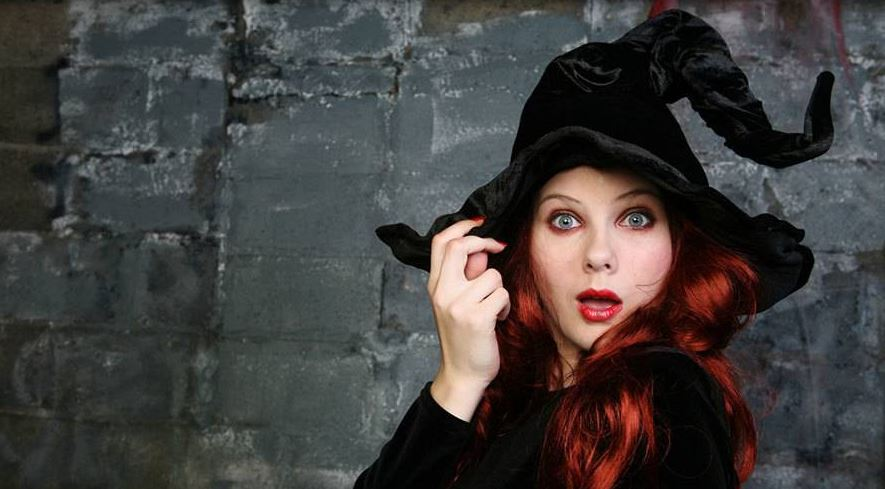

Summon the ideal enchanting hairstyle with bewitching beachy waves and striking colors. Begin by applying a root booster mousse to damp hair before blow-drying to achieve voluminous locks. Infuse texture with a texturizing spray, such as the beloved cult classic by Oribe. 

This versatile look can be parted in any direction of your choosing, and by utilizing a larger curling iron barrel, you’ll unveil sumptuous loose curls and waves. With this captivating Halloween hairstyle, you’ll undeniably cast a spell on everyone who lays eyes upon you!

## **Vampiric Elegance**

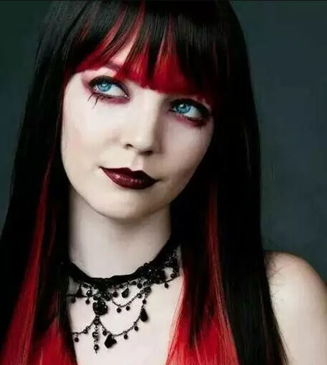

Embrace the allure of vampiric elegance with haunting Halloween hairstyles. Opt for sleek, straight locks with a deep side part for a touch of mystery. Enhance the look by adding dark, blood-red highlights or a rich, deep purple hue for a bewitching transformation. 

For added drama, consider intricate braids or twisted updos adorned with elegant accessories like blood-red roses or jeweled hairpins. Complete the look with a touch of shimmery, smoky [eye makeup](https://avada.io/loveable/blog/halloween-eyeliner/) and deep red lipstick for a truly mesmerizing and seductive vampire-inspired style.

## **Ghostly Glamour**

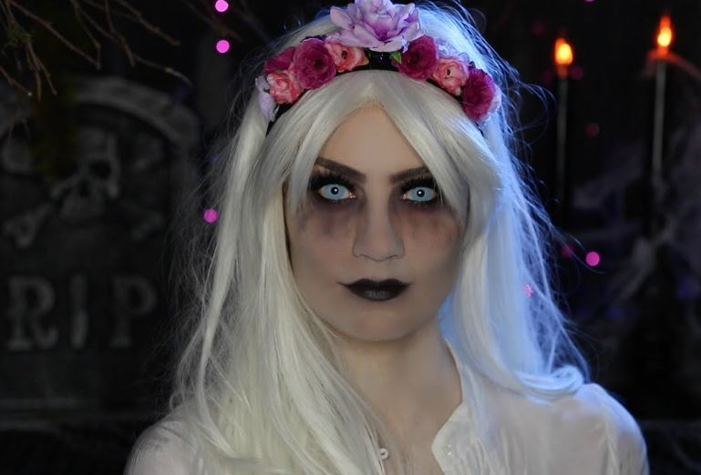

Unleash your ethereal side with ghostly glamour Halloween hairstyles. Opt for cascading curls or soft waves for an otherworldly effect. Enhance the look with silver or pale gray highlights for a hauntingly beautiful touch. Consider adding hair extensions or a clip-in ghostly veil for an extra touch of mystique. 

For an elegant twist, create a chic updo with wispy tendrils framing your face. Complete the look with pale, shimmering makeup and a touch of silver or holographic hair accessories to embody the enchanting spirit of the supernatural.

## **Enchanting Mermaid Waves**

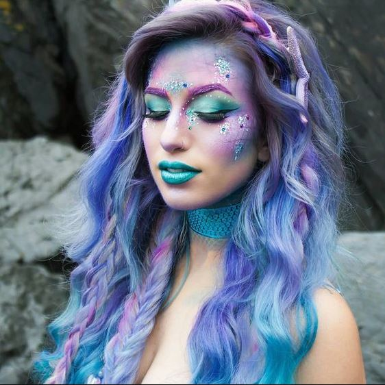

Creating mermaid waves is a quick and effortless hairstyle, perfect for Halloween and beyond.

Begin by applying mousse to damp hair, then use your fingers to tousle and blow-dry.

Next, grab a 3-barrel curling wand like the Beachwaver Midnight Rose 3B Waver ($89; ulta.com). Clamp sections of hair, hold for a moment and release to achieve beautiful crimpy waves.

Lastly, run your fingers through the curls to transform them into larger waves, and finish with a light mist of hairspray to ensure they maintain their shape throughout the day.

## **Elven Elegance**

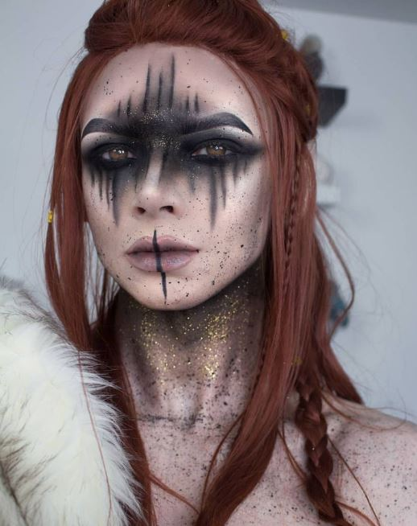

These hairstyles often feature intricate braids, delicate twists, and whimsical accessories that mimic the enchanting beauty of elven creatures.

Elven-inspired hairstyles may include cascading curls adorned with floral accents or delicate braids woven into [intricate patterns.](https://avada.io/loveable/blog/halloween-crochet-patterns/) They often incorporate elements of nature, such as leaves, flowers, or feathers, to evoke a mystical and organic feel.

The hair is often in loose, flowing waves or soft updos with loose tendrils framing the face. Elven elegance hairstyles are unique because of their gracefulness and a touch of whimsy, creating a look that is both ethereal and captivating.

## **Unicorn Dreams**

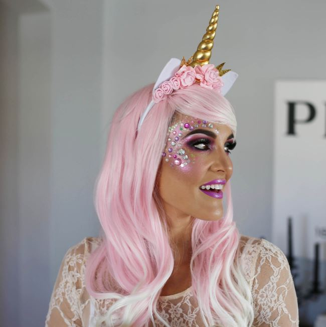

Unleash your inner extra with a stunning silver glitter ponytail, complemented by a [magnificent unicorn](https://avada.io/loveable/unicorn-gifts/) horn, creating a show-stopping costume. However, remember that glitter can be a bit challenging to remove from your hair. 

To ease the process, massage a generous amount of coconut oil into damp hair before shampooing to loosen the pigment and facilitate easier rinsing. This precaution ensures that your Halloween hairstyle remains a dazzling success while also making the post-celebration cleanup a little less daunting.

## **Creepy Spider Updo**

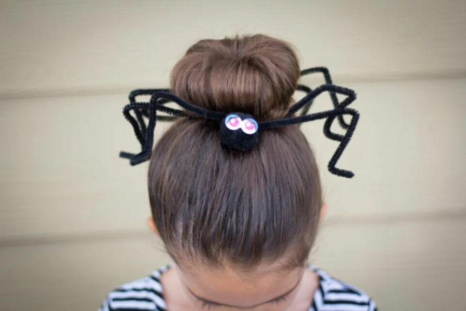

The creepy spider updo Halloween hairstyle creates a spine-chilling and captivating look that is perfect for the occasion. This hairstyle often features a twisted or braided updo with strategically placed spider-themed accents.

To achieve the creepy spider updo, the hair is typically pulled back and twisted into a bun or secured in a braided updo style. Fake spiders or spider-shaped hair accessories are strategically placed within the hairstyle to create the illusion of spiders crawling through the hair.

## **Medusa’s Snakes**

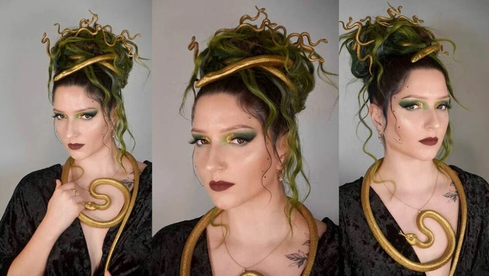

The focal point of this hairstyle is the addition of faux snakes, which can be synthetic hair extensions designed to resemble snakes or snake-shaped hair accessories. These snakes are strategically positioned within the hairstyle to mimic the appearance of living serpents entwined within the hair.

To enhance the eerie vibe, some variations of this hairstyle incorporate [snake-themed](https://avada.io/loveable/snake-gift/) hair accessories such as snake-shaped hairpins or jewel-encrusted serpent headbands. With Creepy Medusa’s Snakes Halloween hairstyles, you can transform into a fearsome and mythical creature, evoking both fascination and terror in equal measure.

## **Zombie Chic**

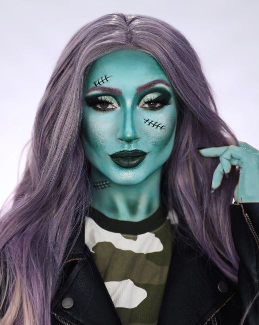

To achieve the Zombie Chic look, the hair is typically styled in a messy, tousled manner, resembling unkempt or slightly matted hair. Tousled waves or loose curls can be incorporated to add texture and a sense of disarray.

The hairstyle may also incorporate elements like fake blood, gel, or wax to create the illusion of damp or matted hair. This can be applied strategically to give the impression of blood splatters or oozing wounds.

To enhance the undead vibes, accessories like torn ribbons, black veils, or small faux insects can be intertwined within the hair, adding an extra touch of creepiness.

## **Superhero Style**

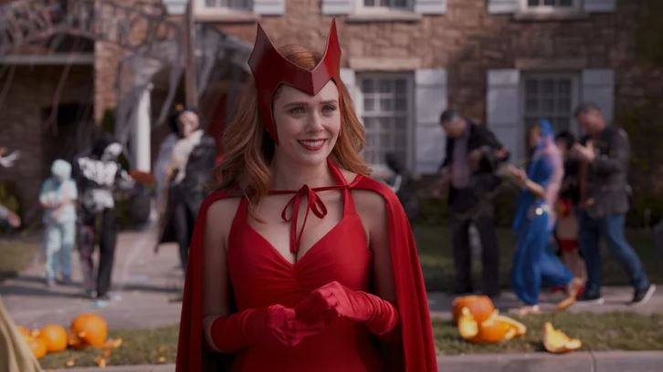

These smooth and bouncy waves are perfect for embodying the strength and grace of a superhero. Whether you’re channeling Wonder Woman, [Black Widow](https://en.wikipedia.org/wiki/Black_Widow_(Natasha_Romanova)#:~:text=Black%20Widow%20(Natalia%20Alianovna%20%22Natasha,%2352%20(April%201964).), or any other iconic character, this hairstyle will complement your superhero costume and complete your powerful ensemble.

Remember to choose a humidity-fighting hair spray that offers long-lasting hold and protection against frizz. This will ensure your superhero hairstyle remains intact throughout the night, allowing you to focus on saving the world or enjoying the Halloween festivities.

With Superhero Style Halloween hairstyles, you’ll feel empowered and ready to conquer any challenge that comes your way, all while looking fabulous and embracing your favorite superhero persona.

## **Movie Monster Hairdos**

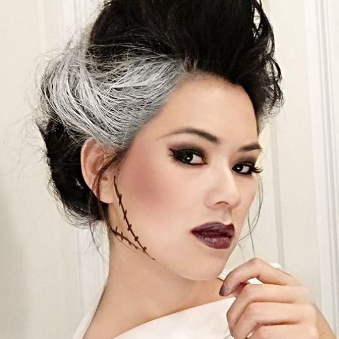

Movie Monster Hairdos can feature a range of styles, from wild and untamed to sleek and sophisticated, depending on the monster being portrayed. For example, hairstyles inspired by werewolves may involve tousled and textured hair with added volume to mimic the creature’s wild and unruly nature.

Vampire-inspired hairdos often showcase sleek and polished looks with sharp, defined lines, reflecting the sophistication and allure of these immortal beings. Incorporating dark or bold hair colors can further enhance the vampiric aesthetic.

Frankenstein-inspired hairstyles may involve a combination of messy and structured elements, featuring teased or backcombed hair with added volume and texture, creating a disheveled yet intentional look.

## **Cartoon Character Curls**

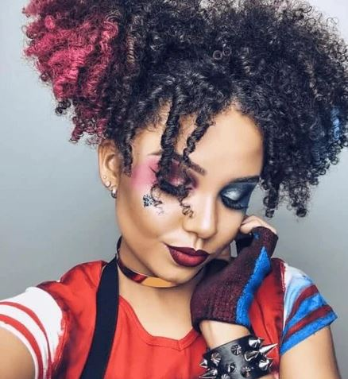

To achieve [Cartoon Character](https://avada.io/loveable/blog/famous-halloween-cartoon-characters/) Curls, start by prepping your hair with a heat-protectant spray to shield it from damage. Use a large barrel curling iron or hot rollers to create loose and defined curls throughout your hair. Alternatively, you can also opt for foam or fabric curlers to achieve a more exaggerated cartoon-like effect.

Once the curls are set, gently comb through them with your fingers or a wide-toothed comb to create soft, voluminous curls. You can also tease the hair at the roots for added height and fullness, reminiscent of the larger-than-life hairstyles seen in cartoons.

To enhance the cartoon-inspired vibe, consider adding colorful hair extensions or clip-in accessories in vibrant hues. These can mimic the bold and vibrant colors often seen in animated characters’ hair.

## **Intricate Braided Masterpieces**

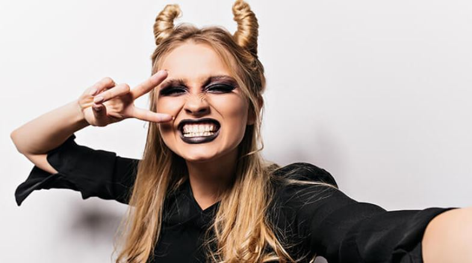

Intricate Braided Masterpieces Halloween hairstyles are a display of stunning and elaborate braiding techniques that elevate your look to a whole new level of artistry. These hairstyles showcase intricate braids woven together to create mesmerizing patterns and designs.

The key feature of Intricate Braided Masterpieces is the meticulous weaving and interlacing of hair, resulting in visually striking hairstyles. They can range from small and delicate braids intricately woven throughout the hair to larger and more complex braided patterns that adorn the entire head.

## **Fierce Animal-Inspired Looks**

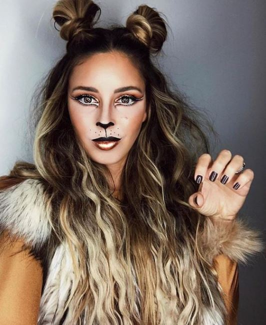

Fierce Animal-Inspired Looks Halloween hairstyles channel the untamed and wild essence of various animals, infusing your Halloween look with a captivating and ferocious vibe. These hairstyles draw inspiration from the unique characteristics and textures found in the animal kingdom.

One popular approach is to create hairstyles that mimic the manes of lions, tigers, or other big cats. These looks often involve voluminous, textured hair styled with waves or curls to replicate the majestic appearance of a lion’s mane or the stripes of a tiger.

**_Related_**: Best [Halloween Nail Ideas](https://avada.io/loveable/halloween-nail-ideas/) With Tutorials

## **Bold and Colorful Hairdos**

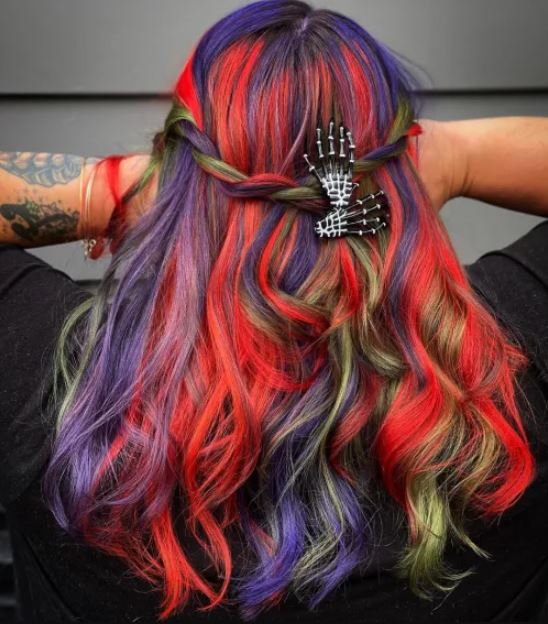

Bold and Colorful Hairdos Halloween hairstyles are all about embracing vibrant hues and creative color combinations to make a striking and eye-catching statement. These hairstyles break away from traditional hair colors and allow you to explore the realms of imagination and self-expression.

One popular style is the rainbow hair trend, where multiple vibrant colors are seamlessly blended throughout the hair. This creates a mesmerizing effect reminiscent of a colorful rainbow. You can choose to incorporate all the colors of the rainbow or select specific shades that complement your costume or personal style.

## **Halloween Hairstyles – Accessories and Finishing Touches**

Accessories and Finishing Touches are essential elements to elevate your Halloween hairstyle and add that extra touch of magic and spookiness. These additions can take your look from ordinary to extraordinary, ensuring that your Halloween hairstyle stands out from the rest.

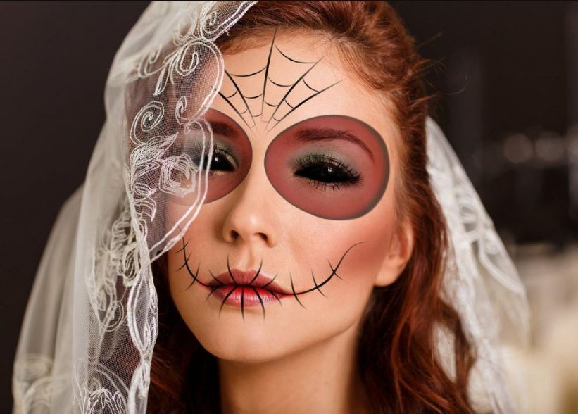

- Hair Accessories play a crucial role in transforming your hairdo into a Halloween masterpiece. Consider incorporating Halloween-themed accessories such as spider-shaped hair clips, skull hairpins, or bat-shaped headbands. These accessories can be strategically placed to complement your hairstyle and enhance the overall Halloween theme.
- Temporary Hair Color is a fun and temporary way to add a pop of color or create a dramatic effect. Experiment with temporary hair color sprays or chalks in vibrant shades that match your costume or Halloween theme. These products allow you to temporarily transform your hair without the commitment of permanent dyes. Follow the instructions on the product and apply the color sparingly for a subtle or bold effect, depending on your preference.
- Finishing Touches are the final details that complete your Halloween hairstyle. Consider adding styling details such as braids, twists, or intricate updos to enhance the overall look. You can incorporate elements like ribbons, glitter, or even small Halloween-themed props to give your hairstyle that extra wow factor. Additionally, use hairspray or hair gel to ensure that your hairstyle stays in place throughout the Halloween festivities.

Remember to consider the overall balance and cohesion of your look. Coordinate your accessories and finishing touches with your costume and makeup for a cohesive and harmonious appearance.

**_Related_**: [Halloween Eyeliner](https://avada.io/loveable/halloween-eyeliner/): Create Effortless Halloween Looks Primarily Using Eyeliner

## **Tips and Tricks for Halloween Hair Styling**

When it comes to Halloween Hair Styling, the right tips and tricks can make all the difference in achieving your desired look and ensuring your hair stays healthy and fabulous throughout the festivities.

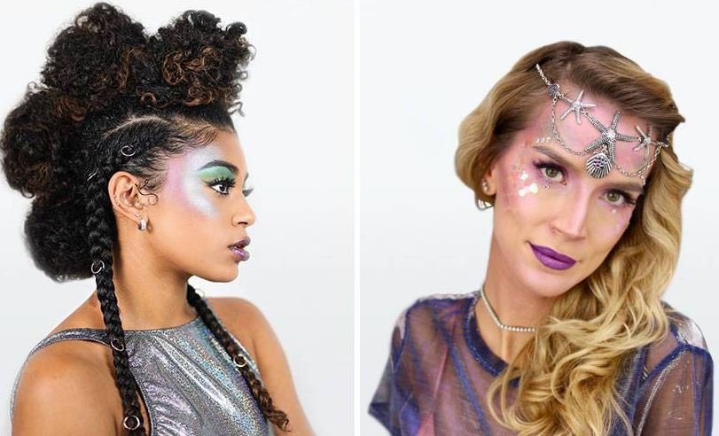

- First and foremost, choosing the right hair products and tools is crucial. Consider using styling products such as mousse, gel, or hairspray that offer long-lasting hold and control. Invest in quality hair tools like curling wands, flat irons, or hairbrushes that suit your hair type and desired hairstyle.
- Preparing the hair is essential before diving into the styling process. Make sure your hair is clean and dry before applying any products or using heat styling tools. If your hair needs some extra volume or texture, consider using a root booster or texturizing spray. Additionally, always use a heat protectant spray before using heat styling tools to prevent damage to your hair.
- Ensuring the health and safety of your hair during Halloween styling is crucial. Avoid using harsh chemicals or hair dyes that could damage your locks. Instead, opt for temporary hair color sprays or chalks for vibrant and temporary transformations.
- Styling techniques and hacks can help you achieve the Halloween hairstyle of your dreams. Explore different braiding styles, twists, and updos to create stunning and unique looks. If you’re aiming for curls or waves, consider using the “pin curl” method for defined and long-lasting curls. For elaborate hairstyles, use bobby pins or hair elastics that match your hair color to keep everything securely in place.
- Lastly, don’t forget to have fun and experiment with your Halloween hair styling. Practice different techniques and styles in advance to ensure you’re comfortable with the process.

## **In Conclusion,**

These 10+ spellbinding **Halloween hairstyles** provide a plethora of options to elevate your costume and create a truly unforgettable look. Whether you’re channeling the allure of a glamorous vampire, the enchantment of a whimsical mermaid, or the strength of a fierce superhero, these hairstyles offer versatility and creativity.

The addition of accessories, finishing touches, and styling techniques further enhance the impact of these hairstyles. Whether it’s adding spooky hair accessories, experimenting with temporary hair color sprays, or perfecting intricate braids, these elements complete the transformation and help you embody the essence of Halloween.

So, go ahead and unleash your creativity, experiment with different styles, and let your hair become a work of art this Halloween. With these spellbinding hairstyles, you’re sure to cast a mesmerizing spell and make this Halloween an unforgettable experience for everyone around you. Get ready to step into the spotlight and shine with hair-raising elegance!

- [Witchy Waves](https://avada.io/loveable/blog/halloween-hairstyles/#wp-block-heading-2-4)
- [Vampiric Elegance](https://avada.io/loveable/blog/halloween-hairstyles/#wp-block-heading-2-8)
- [Ghostly Glamour](https://avada.io/loveable/blog/halloween-hairstyles/#wp-block-heading-2-12)
- [Enchanting Mermaid Waves](https://avada.io/loveable/blog/halloween-hairstyles/#wp-block-heading-2-16)
- [Elven Elegance](https://avada.io/loveable/blog/halloween-hairstyles/#wp-block-heading-2-22)
- [Unicorn Dreams](https://avada.io/loveable/blog/halloween-hairstyles/#wp-block-heading-2-27)
- [Creepy Spider Updo](https://avada.io/loveable/blog/halloween-hairstyles/#wp-block-heading-2-31)
- [Medusa’s Snakes](https://avada.io/loveable/blog/halloween-hairstyles/#wp-block-heading-2-35)
- [Zombie Chic](https://avada.io/loveable/blog/halloween-hairstyles/#wp-block-heading-2-39)
- [Superhero Style](https://avada.io/loveable/blog/halloween-hairstyles/#wp-block-heading-2-44)
- [Movie Monster Hairdos](https://avada.io/loveable/blog/halloween-hairstyles/#wp-block-heading-2-49)
- [Cartoon Character Curls](https://avada.io/loveable/blog/halloween-hairstyles/#wp-block-heading-2-54)
- [Intricate Braided Masterpieces](https://avada.io/loveable/blog/halloween-hairstyles/#wp-block-heading-2-59)
- [Fierce Animal-Inspired Looks](https://avada.io/loveable/blog/halloween-hairstyles/#wp-block-heading-2-63)
- [Bold and Colorful Hairdos](https://avada.io/loveable/blog/halloween-hairstyles/#wp-block-heading-2-68)
- [Halloween Hairstyles – Accessories and Finishing Touches](https://avada.io/loveable/blog/halloween-hairstyles/#wp-block-heading-2-72)
- [Tips and Tricks for Halloween Hair Styling](https://avada.io/loveable/blog/halloween-hairstyles/#wp-block-heading-2-80)
- [In Conclusion,](https://avada.io/loveable/blog/halloween-hairstyles/#wp-block-heading-2-88)

### [Blake Simpson](https://avada.io/loveable/author/blake/)

Hi, I'm Blake from Loveable. I help people find perfect gifts for occasions like anniversaries and weddings. I also write a blog about holidays, sharing insights to make them more meaningful. Let's create unforgettable moments together!

- [Twitter](https://twitter.com/intent/tweet)
- [Facebook](https://www.facebook.com/sharer/sharer.php)
- [instagram](https://avada.io/loveable/blog/halloween-hairstyles/)
- [pinterest](https://www.pinterest.com/loveablellc/)

## Related Posts

[### 120+ Christian Birthday Wishes To Spread Your Love](https://avada.io/loveable/blog/christian-birthday-wishes/) 

[

### 35 Best 70th Birthday Ideas To Celebrate The Special Milestone

](https://avada.io/loveable/blog/70th-birthday-ideas/)

[

### 50 Best 30th Birthday Decorations for a Remarkable Birthday Bash

](https://avada.io/loveable/blog/30th-birthday-decorations/)

[

### 40 Delicious Vegan Christmas Desserts to Delight Your Palate

](https://avada.io/loveable/blog/vegan-christmas-desserts/)

[

### 60 Christmas Team Building Activities to Boost Workplace Spirit

](https://avada.io/loveable/blog/christmas-team-building-activities/)
