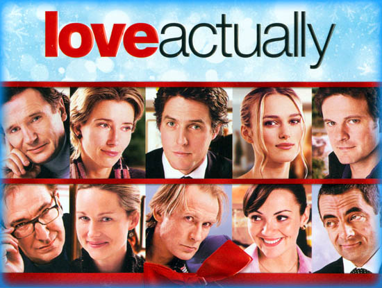
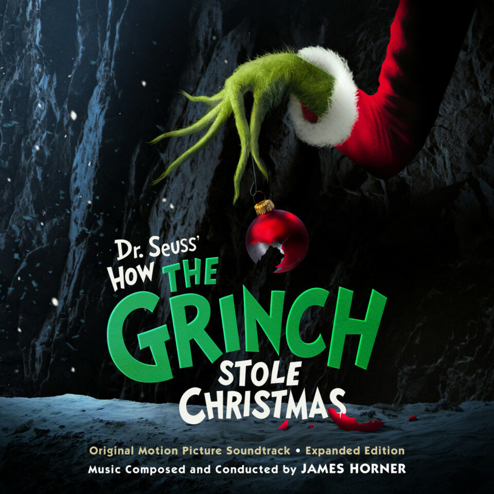
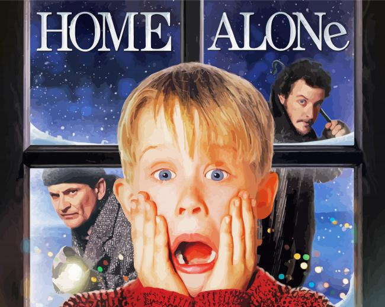
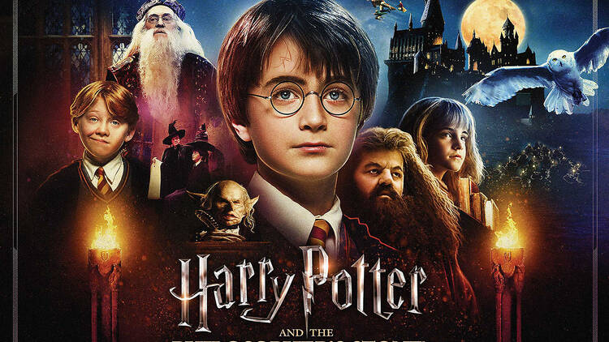
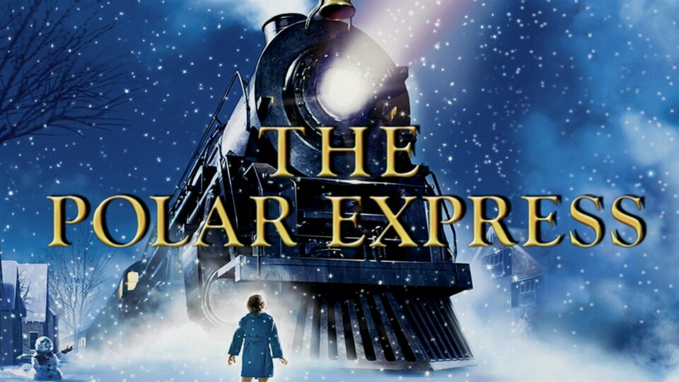
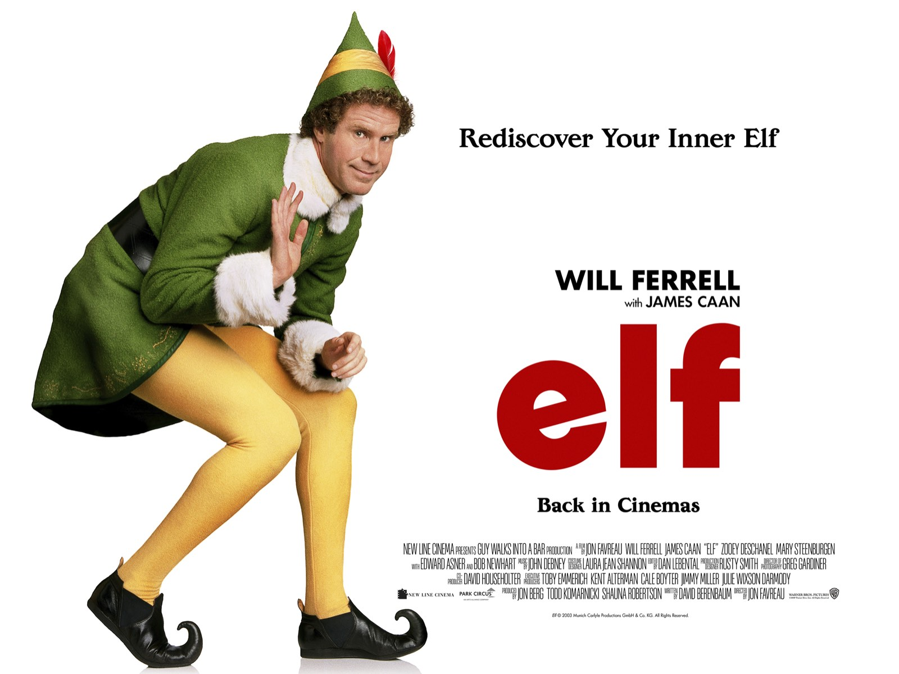
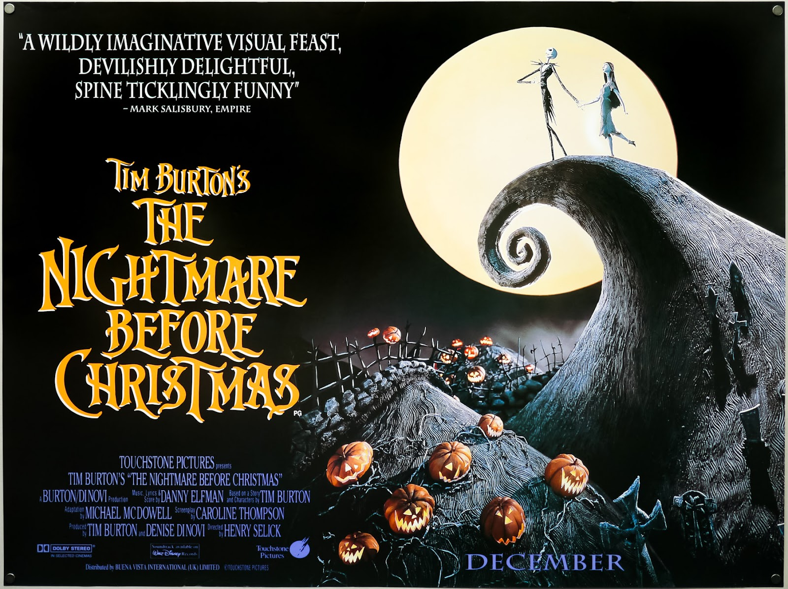
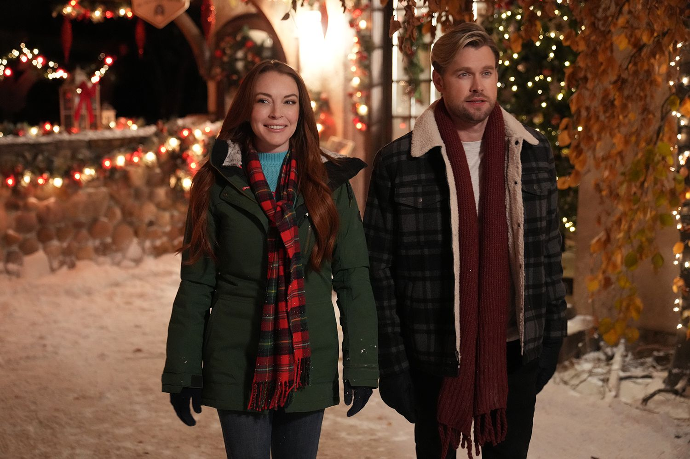

This article has been written and researched by our expert Loveable through a precise methodology. [Learn more about our methodology](https://avada.io/loveable/our-methodological.html)

[Loveable](https://avada.io/loveable/) > [Blog](https://avada.io/loveable/blog/) > [Holiday](https://avada.io/loveable/holiday/)

# 100+ Best Christmas Movie Trivia Questions (With Answers) in 2023

Written by [Blake Simpson](https://avada.io/loveable/author/blake/) Last Updated on September 07, 2023

- [40 Famous Christmas Movie Trivia Questions](https://avada.io/loveable/blog/christmas-movie-trivia/#wp-block-heading-2-2)
    - [Love Actually (2003)](https://avada.io/loveable/blog/christmas-movie-trivia/#wp-block-heading-3-3)
    - [How the Grinch Stole Christmas (2000)](https://avada.io/loveable/blog/christmas-movie-trivia/#wp-block-heading-3-35)
    - [Home Alone (1990)](https://avada.io/loveable/blog/christmas-movie-trivia/#wp-block-heading-3-67)
    - [Harry Potter (2001)](https://avada.io/loveable/blog/christmas-movie-trivia/#wp-block-heading-3-99)
    - [Polar Express (2004)](https://avada.io/loveable/blog/christmas-movie-trivia/#wp-block-heading-3-131)
    - [Elf (2003)](https://avada.io/loveable/blog/christmas-movie-trivia/#wp-block-heading-3-163)
    - [The Nightmare Before Christmas (1993)](https://avada.io/loveable/blog/christmas-movie-trivia/#wp-block-heading-3-195)
    - [A Christmas Story (1983)](https://avada.io/loveable/blog/christmas-movie-trivia/#wp-block-heading-3-227)
- [50 Popular Christmas Movie Trivia Quizzes for 2023](https://avada.io/loveable/blog/christmas-movie-trivia/#wp-block-heading-2-259) 
    - [Classic Christmas Movies](https://avada.io/loveable/blog/christmas-movie-trivia/#wp-block-heading-3-262)
    - [Animated Christmas Movies](https://avada.io/loveable/blog/christmas-movie-trivia/#wp-block-heading-3-283)
    - [Modern Christmas Comedies](https://avada.io/loveable/blog/christmas-movie-trivia/#wp-block-heading-3-306)
    - [Christmas Romances](https://avada.io/loveable/blog/christmas-movie-trivia/#wp-block-heading-3-329)
    - [Heartwarming Christmas Stories](https://avada.io/loveable/blog/christmas-movie-trivia/#wp-block-heading-3-352)
- [Final thought](https://avada.io/loveable/blog/christmas-movie-trivia/#wp-block-heading-2-378)

The holiday season is the perfect time to cozy up with loved ones and enjoy some heartwarming Christmas movies. But how well do you really know these festive films? Test your knowledge with our handpicked collection of the 100+ Best **Christmas Movie Trivia Questions (With Answers)**. Get ready to laugh, reminisce, and challenge your friends to a friendly competition!

## **40 Famous Christmas Movie Trivia Questions**

### [**Love Actually (2003)**](https://www.amazon.com/Love-Actually-Bill-Nighy/dp/B001JIES4Q/)

**1\. In “Love Actually,” what instrument does Mark play to confess his love for Juliet?**

A) Guitar

B) Drums

C) Piano

D) Violin

**Answer: A) Guitar**

**2\. Which actor plays the role of the British Prime Minister in “Love Actually”?**

A) Hugh Grant

B) Colin Firth

C) Liam Neeson

D) Alan Rickman

**Answer: A) Hugh Grant**

**3\. What is the relationship between Jamie and Aurelia in the movie?**

A) Siblings

B) Cousins

C) Friends

D) Employer and housekeeper

**Answer: D) Employer and housekeeper**

**4\. What gift does Mark give to Juliet in “Love Actually”?**

A) A necklace

B) A book

C) A CD

D) A bouquet of roses

**Answer: C) A CD**

**5\. Which character declares their love through a series of handwritten signs in the movie?**

A) Daniel

B) Karen

C) Mark

D) Peter

**Answer: C) Mark**

### [**How the Grinch Stole Christmas (2000)**](https://www.amazon.com/Dr-Seuss-Grinch-Stole-Christmas/dp/B09VK5VH81/)

**1\. What is the name of the town that the Grinch plans to steal Christmas from?**

A) Whoville

B) Grinchville

C) Merryville

D) Christmasville

**Answer: A) Whoville**

**2\. Who narrates the story of “How the Grinch Stole Christmas” in the animated TV special?**

A) Jim Carrey

B) Tom Hanks

C) Boris Karloff

D) Johnny Depp

**Answer: C) Boris Karloff**

**3\. What is the Grinch’s dog’s name?**

A) Max

B) Rex

C) Spot

D) Buddy

**Answer: A) Max**

**4\. What does the Grinch disguise himself as to steal Christmas from the Whos?**

A) A Christmas tree

B) A snowman

C) A reindeer

D) Santa Claus

**Answer: D) Santa Claus**

**5\. What changes the Grinch’s heart and makes him return the stolen presents?**

A) A letter from Cindy Lou Who

B) The Whos’ singing

C) A visit from Santa

D) His dog Max’s pleading

**Answer: B) The Whos’ singing**

### [**Home Alone (1990)**](https://www.amazon.com/Home-Alone-UHD-Macaulay-Culkin/dp/B08GSML24L/)

**1\. In “Home Alone,” where is Kevin McCallister accidentally left behind by his family?**

A) New York City

B) Paris

C) London

D) Chicago

**Answer: B) Paris**

**2\. What is the name of the main antagonist trying to rob Kevin’s house?**

A) Marv

B) Buzz

C) Harry

D) Pete

**Answer: C) Harry**

**3\. Which classic movie do Kevin and his mom watch in “Home Alone”?**

A) “It’s a Wonderful Life”

B) “A Christmas Carol”

C) “Miracle on 34th Street”

D) “Angels with Filthy Souls”

**Answer: D) “Angels with Filthy Souls”**

**4\. What does Kevin use to defend his home from the burglars?**

A) A slingshot

B) A BB gun

C) Booby traps

D) Paint cans

**Answer: C) Booby traps**

**5\. What is the famous line Kevin says when he realizes his family is missing?**

A) “I made my family disappear!”

B) “Merry Christmas, ya filthy animal!”

C) “Keep the change, ya filthy animal!”

D) “I’m not afraid anymore!”

**Answer: A) “I made my family disappear!”**

### [**Harry Potter (2001)**](https://www.amazon.com/Harry-Potter-Sorcerers-Daniel-Radcliffe/dp/B00AP06III/)

**1\. In “Harry Potter and the Sorcerer’s Stone,” what does Harry receive on Christmas from his godfather?**

A) A wand

B) An invisibility cloak

C) A broomstick

D) A book on spells

**Answer: B) An invisibility cloak**

**2\. What magical creature pulls the carriages that transport students from the Hogwarts Express to the castle in the snow?**

A) Hippogriffs

B) Thestrals

C) Centaurs

D) Dragons

**Answer: B) Thestrals**

**3\. What spell is used to create a Patronus?**

A) Expelliarmus

B) Expecto Patronum

C) Wingardium Leviosa

D) Alohomora

**Answer: B) Expecto Patronum**

**4\. In “Harry Potter and the Goblet of Fire,” what task does Harry face during the Triwizard Tournament’s second challenge?**

A) Dragon battling

B) Underwater rescue

C) Maze navigation

D) Spellcasting duel

**Answer: B) Underwater rescue**

**5\. What type of creature does Hagrid introduce in “Harry Potter and the Prisoner of Azkaban” that can repel Dementors?**

A) Niffler

B) Bowtruckle

C) Hippogriff

D) Thestral

**Answer: C) Hippogriff**

### [**Polar Express (2004)**](https://www.amazon.com/Express-Scolari-Michael-Charles-Fleischer/dp/B0BPXHZ36C/)

**1\. What is the main character’s name in “The Polar Express”?**

A) Jack

B) Billy

C) Chris

D) Hero Boy

**Answer: D) Hero Boy**

**2\. What is the destination of the train journey in “The Polar Express”?**

A) The North Pole

B) Santa’s Workshop

C) Candyland

D) Lapland

**Answer: A) The North Pole**

**3\. What is the magical word that allows the children to hear the bell ring in “The Polar Express”?**

A) Jingle Bell

B) Christmas Magic

C) Believe

D) Chime Time

**Answer: C) Believe**

**4\. Who provides the voice for the Conductor in “The Polar Express”?**

A) Tom Hanks

B) Robin Williams

C) Jim Carrey

D) Johnny Depp

**Answer: A) Tom Hanks**

**5\. What does the main character receive from Santa Claus at the end of “The Polar Express”?**

A) A toy train

B) A bell

C) A snow globe

D) A golden ticket

**Answer: B) A bell**

### [**Elf (2003)**](https://www.amazon.com/Elf-Will-Ferrell/dp/B09PQKZJYZ/)

**1\. In the movie “Elf,” what is Buddy’s favorite food?**

A) Spaghetti

B) Pancakes

C) Candy canes

D) Popcorn

**Answer: B) Pancakes**

**2\. Who plays the role of Buddy in “Elf”?**

A) Will Ferrell

B) Jim Carrey

C) Steve Carell

D) Adam Sandler

**Answer: A) Will Ferrell**

**3\. What is the title of the book that Buddy finds in the library in “Elf”?**

A) The North Pole Guide

B) Santa’s Secrets

C) Christmas Chronicles

D) New York City for Dummies

**Answer: D) New York City for Dummies**

**4\. What is Buddy’s real father’s name in “Elf”?**

A) Walter

B) George

C) Michael

D) Frank

**Answer: A) Walter**

**5\. What famous Christmas song does Buddy sing at the end of the movie to raise Christmas spirit?**

A) “Deck the Halls”

B) “Jingle Bells”

C) “Santa Claus Is Coming to Town”

D) “White Christmas”

**Answer: C) “Santa Claus Is Coming to Town”**

### [**The Nightmare Before Christmas (1993)**](https://www.amazon.com/Tim-Burtons-Nightmare-Before-Christmas/dp/B003SI05PG/)

**1\. What is the name of the main character in “The Nightmare Before Christmas”?**

A) Jack Frost

B) Oogie Boogie

C) Sandy Claws

D) Jack Skellington

**Answer: D) Jack Skellington**

**2\. In the movie, what holiday does Jack Skellington accidentally discover?**

A) Halloween

B) Christmas

C) Thanksgiving

D) Easter

**Answer: B) Christmas**

**3\. Who is the ruler of Halloween Town in “The Nightmare Before Christmas”?**

A) Dr. Finkelstein

B) Sally

C) Oogie Boogie

D) Jack Skellington

**Answer: D) Jack Skellington**

**4\. What is the name of the ghost dog that accompanies Jack?**

A) Zero

B) Spooky

C) Boo

D) Scare

**Answer: A) Zero**

**5\. Which famous director produced “The Nightmare Before Christmas”?**

A) Tim Burton

B) Steven Spielberg

C) James Cameron

D) Quentin Tarantino

**Answer: A) Tim Burton**

### [**A Christmas Story (1983)**](https://www.amazon.com/Christmas-Story-Peter-Billingsley/dp/B009IU78LM/)

**What does Ralphie want as a Christmas present in “A Christmas Story”?**

A) A bicycle

B) A BB gun

C) A train set

D) A puppy

**Answer: B) A BB gun**

**Who does Ralphie’s father win a “major award” from in the movie?**

A) The newspaper

B) The radio show

C) The bowling alley

D) The neighbor’s contest

**Answer: D) The neighbor’s contest**

**What does Ralphie’s friend Flick get his tongue stuck to?**

A) An ice cream cone

B) A flagpole

C) A metal slide

D) A candy cane

**Answer: B) A flagpole**

**What kind of carolers visit Ralphie’s family on Christmas Eve?**

A) Children

B) Adults

C) Neighbors

D) Hillbillies

**Answer: D) Hillbillies**

**How does “A Christmas Story” end?**

A) With Ralphie’s family opening presents

B) With the family going to church

C) With the Bumpus hounds ruining Christmas

D) With the neighbors singing carols

**Answer: A) With Ralphie’s family opening presents**

## **50 Popular Christmas Movie Trivia Quizzes for 2023** 

_50 Popular Christmas Movie Trivia for 2023_ 

### **Classic Christmas Movies**

1\. In the movie “Home Alone,” what is the name of the young boy who is accidentally left behind when his family goes on vacation for Christmas?

**Answer: Kevin McCallister**

2\. Which 2003 Christmas film stars Will Ferrell as a human who was raised by elves at the North Pole?

**Answer: Elf**

3\. In the movie “Miracle on 34th Street,” what is the profession of the man claiming to be Santa Claus?

**Answer: Kris Kringle’s profession is an elderly gentleman who claims to be Santa Claus.**

4\. Which 1994 Christmas movie involves a young boy whose wish to have no family comes true, but he soon realizes he wants things back to the way they were?

**Answer: The Santa Clause**

5\. What 1983 holiday film features the adventures of a young boy named Ralphie, who wants a Red Ryder BB gun for Christmas?

**Answer: A Christmas Story**

6\. In the movie “It’s a Wonderful Life,” what is the name of the angel who helps George Bailey see what life would have been like if he had never been born?

**Answer: Clarence**

7.  Which Christmas movie centers around a train that takes a young boy to the North Pole on Christmas Eve?

**Answer: The Polar Express**

8.  In the film “A Christmas Carol,” what is the name of the miserly old man who is visited by three ghosts on Christmas Eve?

**Answer: Ebenezer Scrooge**

9\. Which 1990 Christmas comedy stars Macaulay Culkin as Kevin McCallister, who once again becomes separated from his family during the holiday season?

**Answer: Home Alone 2: Lost in New York**

10\. What 2004 romantic comedy film involves several interconnected stories that take place during the month of December?

**Answer: Love Actually**

### **Animated Christmas Movies**

_Animated Christmas Movies_

11\. In the movie “How the Grinch Stole Christmas,” what is the Grinch’s loyal dog’s name?

**Answer: Max**

12\. Which animated film tells the story of a train conductor who takes a group of children to the North Pole on a magical journey on Christmas Eve?

**Answer: The Polar Express**

13\. What animated movie features the voices of Tom Hanks as the Conductor and the young boy Hero Boy?

**Answer: The Polar Express**

14.  In the animated film “The Nightmare Before Christmas,” what is the name of the main character who discovers the holiday of Christmas Town?

**Answer: Jack Skellington**

15\. What animated movie follows the journey of a young boy named Arthur as he tries to deliver a misplaced present to a little girl before Christmas morning?

**Answer: Arthur Christmas**

16\. In the movie “Rudolph the Red-Nosed Reindeer”, what is Rudolph’s unique characteristic?

**Answer: A red nose that lights up**

17\. Which 2009 animated Christmas movie involves the story of a little boy who receives an early Christmas gift – a magical snow globe?

**Answer: Prep & Landing**

18\. In the animated film “Frosty the Snowman,” what brings Frosty to life?

**Answer: A magical hat**

19\. Which animated film features a group of toys that come to life when humans are not around?

**Answer: Toy Story (while not entirely Christmas-themed, Toy Story has scenes set during Christmas)**

20\. In the movie “A Charlie Brown Christmas,” what kind of tree does Charlie Brown choose for the Christmas play?

**Answer: A small, scrawny tree**

### **Modern Christmas Comedies**

_Modern Christmas Comedies_

21\. In the movie “The Santa Clause,” what does Scott Calvin accidentally cause Santa Claus to do, leading him to become the new Santa?

**Answer: Fall off the roof**

22\. Which 2006 Christmas comedy stars Danny DeVito and Matthew Broderick as neighbors engaged in a holiday lights competition?

**Answer: Deck the Halls**

23.  In the film “Four Christmases,” what is the reason Brad and Kate have never married or had children?

**Answer: They want to avoid the complications of marriage and family gatherings.**

24\. Which 2015 Christmas movie involves the rivalry between two coworkers who are both up for the same promotion?

**Answer: The Night Before**

25\. What 2003 romantic comedy film centers around a man who falls in love with a woman who is already engaged to another man?

**Answer: Love Actually**

26\. In the movie “Bad Moms Christmas,” which three grandmothers unexpectedly visit their daughters for the holidays?

**Answer: Ruth, Isis, and Sandy**

27\. Which 2011 Christmas comedy stars Jason Bateman, Jennifer Aniston, and T.J. Miller, and follows a group of friends trying to throw an epic Christmas party?

**Answer: Office Christmas Party**

28\. In the film “The Holiday,” two women decide to swap homes during the Christmas season. Who plays the roles of these women?

**Answer: Cameron Diaz and Kate Winslet**

29\. Which 2004 comedy involves a workaholic who learns to appreciate the holiday season after being trapped in a time loop that causes him to relive Christmas Day?

**Answer: Christmas with the Kranks**

30\. In the movie “Elf,” what does Buddy use to navigate his way through the Candy Cane Forest and the Sea of Swirly Twirly Gum Drops?

**Answer: A paper and a piece of chewing gum**

### **Christmas Romances**

_Christmas Romances_

31\. Which 2018 Christmas romantic comedy centers around a journalist who is assigned to write a story about a prince who is about to become king?

**Answer: A Christmas Prince**

32\. In the movie “The Holiday,” what does Iris do for a living?

**Answer: She writes a wedding column in a newspaper.**

33\. Which 2008 Christmas film stars Diane Keaton, Sarah Jessica Parker, and Rachel McAdams as members of a dysfunctional family who come together for the holidays?

**Answer: Four Christmases**

34\. In the movie “Serendipity,” what do Jonathan and Sara do to test if fate wants them to be together?

Answer: They write their names and phone numbers on a $5 bill and a copy of “Love in the Time **of Cholera,” respectively.**

35\. Which 2003 romantic comedy involves a man who falls in love with a woman he has never met, only communicating with her through a series of heartfelt letters?

**Answer: Love Actually**

36.  In the film “The Family Stone,” what does Meredith initially do for a living?

**Answer: She is an uptight and career-driven businesswoman.**

37.  Which 2019 romantic comedy follows a woman who discovers a mysterious ornament that transports her to the Christmas of her past?

**Answer: The Christmas Chronicles**

38\. In the movie “Last Christmas,” what medical condition did the main character, Kate, suffer from?

**Answer: Kate suffered from a heart condition that required a transplant.**

39.  Which 2001 romantic comedy film involves a journalist who must write an article about a man who places a classified ad seeking a companion for time travel?

**Answer: The Family Man**

40\. In the movie “The Polar Express,” what is the main message that the Conductor gives to the children?

**Answer: “The true spirit of Christmas lies in your heart.”**

### **Heartwarming Christmas Stories**

_Heartwarming Christmas Stories_

41\. Which 2009 Christmas movie tells the story of a young boy named Ethan who discovers a magical snow globe that transports him to a miniature Christmas village?

**Answer: Snowglobe**

42\. In the film “The Christmas Chronicles,” who helps the main characters Kate and Teddy embark on a mission to save Christmas?

**Answer: Santa Claus (played by Kurt Russell)**

43.  Which 2014 Christmas movie is based on a true story and centers around a mother’s journey to find a way to afford a new toy for her son in time for Christmas?

**Answer: Christmas Under Wraps**

44\. In the movie “Noelle,” who is the daughter of Santa Claus and the heir to the family’s Christmas business?

**Answer: Noelle Kringle**

45\. Which 2009 Christmas film involves a woman who receives a series of 12 Christmas gifts from a secret admirer?

**Answer: The Twelve Men of Christmas**

46\. In the film “Klaus,” what is the name of the reclusive toymaker who becomes friends with a young postman and helps inspire the tradition of gift-giving?

**Answer: Jesper**

47\. Which 2013 Christmas movie follows the story of a young woman who returns to her hometown and embarks on a mission to save her family’s historic inn?

**Answer: Holidaze**

48\. In the movie “The Princess Switch,” what do two identical women do to switch places and experience each other’s lives?

**Answer: They trade places during a baking competition.**

49.  Which 2015 Christmas film features a woman who discovers an old letter while trying to help her grandmother sell her childhood home?

**Answer: Christmas Land**

50\. In the film “The Knight Before Christmas,” what unusual twist occurs when a medieval knight is magically transported to the present day?

**Answer: He falls in love with a modern woman**

**_See More:_**

- [Classic Christmas Movies](https://avada.io/loveable/blog/classic-christmas-movies/) Of All Time

- Funny [Christmas Movie Quotes](https://avada.io/loveable/blog/funny-christmas-movie-quotes/)

## **Final thought**

Since the holiday season approaches, what better way to spread joy and laughter than by diving into the magical world of Christmas movies? From heartwarming classics that warm our souls to side-splitting comedies that leave us in stitches, and from the enchanting stories of animated wonders to the tender romances that touch our hearts, there’s something for everyone in the realm of festive films.

The 100+ Best **Christmas Movie Trivia Questions (With Answers) 2023** we presented here are not just a challenge for your memory but a celebration of the timeless stories that have become an integral part of our holiday traditions. Gather your loved ones, pop some popcorn, and embark on a journey through snowy landscapes, twinkling lights, and heartwarming moments that remind us of the true spirit of Christmas.

- [40 Famous Christmas Movie Trivia Questions](https://avada.io/loveable/blog/christmas-movie-trivia/#wp-block-heading-2-2)
    - [Love Actually (2003)](https://avada.io/loveable/blog/christmas-movie-trivia/#wp-block-heading-3-3)
    - [How the Grinch Stole Christmas (2000)](https://avada.io/loveable/blog/christmas-movie-trivia/#wp-block-heading-3-35)
    - [Home Alone (1990)](https://avada.io/loveable/blog/christmas-movie-trivia/#wp-block-heading-3-67)
    - [Harry Potter (2001)](https://avada.io/loveable/blog/christmas-movie-trivia/#wp-block-heading-3-99)
    - [Polar Express (2004)](https://avada.io/loveable/blog/christmas-movie-trivia/#wp-block-heading-3-131)
    - [Elf (2003)](https://avada.io/loveable/blog/christmas-movie-trivia/#wp-block-heading-3-163)
    - [The Nightmare Before Christmas (1993)](https://avada.io/loveable/blog/christmas-movie-trivia/#wp-block-heading-3-195)
    - [A Christmas Story (1983)](https://avada.io/loveable/blog/christmas-movie-trivia/#wp-block-heading-3-227)
- [50 Popular Christmas Movie Trivia Quizzes for 2023](https://avada.io/loveable/blog/christmas-movie-trivia/#wp-block-heading-2-259) 
    - [Classic Christmas Movies](https://avada.io/loveable/blog/christmas-movie-trivia/#wp-block-heading-3-262)
    - [Animated Christmas Movies](https://avada.io/loveable/blog/christmas-movie-trivia/#wp-block-heading-3-283)
    - [Modern Christmas Comedies](https://avada.io/loveable/blog/christmas-movie-trivia/#wp-block-heading-3-306)
    - [Christmas Romances](https://avada.io/loveable/blog/christmas-movie-trivia/#wp-block-heading-3-329)
    - [Heartwarming Christmas Stories](https://avada.io/loveable/blog/christmas-movie-trivia/#wp-block-heading-3-352)
- [Final thought](https://avada.io/loveable/blog/christmas-movie-trivia/#wp-block-heading-2-378)

### [Blake Simpson](https://avada.io/loveable/author/blake/)

Hi, I'm Blake from Loveable. I help people find perfect gifts for occasions like anniversaries and weddings. I also write a blog about holidays, sharing insights to make them more meaningful. Let's create unforgettable moments together!

- [Twitter](https://twitter.com/intent/tweet)
- [Facebook](https://www.facebook.com/sharer/sharer.php)
- [instagram](https://avada.io/loveable/blog/christmas-movie-trivia/)
- [pinterest](https://www.pinterest.com/loveablellc/)

## Related Posts

[### 120+ Christian Birthday Wishes To Spread Your Love](https://avada.io/loveable/blog/christian-birthday-wishes/) 

[

### 35 Best 70th Birthday Ideas To Celebrate The Special Milestone

](https://avada.io/loveable/blog/70th-birthday-ideas/)

[

### 50 Best 30th Birthday Decorations for a Remarkable Birthday Bash

](https://avada.io/loveable/blog/30th-birthday-decorations/)

[

### 40 Delicious Vegan Christmas Desserts to Delight Your Palate

](https://avada.io/loveable/blog/vegan-christmas-desserts/)

[

### 60 Christmas Team Building Activities to Boost Workplace Spirit

](https://avada.io/loveable/blog/christmas-team-building-activities/)
