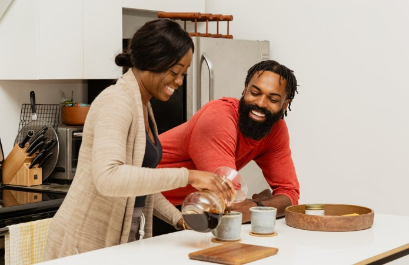

This article has been written and researched by our expert Loveable through a precise methodology. [Learn more about our methodology](https://avada.io/loveable/our-methodological.html)

[Loveable](https://avada.io/loveable/) > [Blog](https://avada.io/loveable/blog/) > [Relationship](https://avada.io/loveable/relationship/)

# 100 Best Good Morning Messages for Him

Written by [Luna Miller](https://avada.io/loveable/author/luna/) Last Updated on August 22, 2023

- [Sweet Good Morning Messages for Him](https://avada.io/loveable/blog/good-morning-messages-for-him/#wp-block-heading-2-3)
- [Romantic good morning messages for him](https://avada.io/loveable/blog/good-morning-messages-for-him/#wp-block-heading-2-15)
- [Flirty good morning messages for him](https://avada.io/loveable/blog/good-morning-messages-for-him/#wp-block-heading-2-28) 
- [Emotional good morning messages for him](https://avada.io/loveable/blog/good-morning-messages-for-him/#wp-block-heading-2-40)
- [Simple good morning messages for him to make him happy](https://avada.io/loveable/blog/good-morning-messages-for-him/#wp-block-heading-2-52) 
- [Caring good morning messages for him to know you love him](https://avada.io/loveable/blog/good-morning-messages-for-him/#wp-block-heading-2-64)
- [Cute morning text messages for him](https://avada.io/loveable/blog/good-morning-messages-for-him/#wp-block-heading-2-76)
- [Naughty good morning messages that make his day](https://avada.io/loveable/blog/good-morning-messages-for-him/#wp-block-heading-2-88) 
- [Funny good morning messages for him](https://avada.io/loveable/blog/good-morning-messages-for-him/#wp-block-heading-2-100) 
- [Long good morning text messages for him](https://avada.io/loveable/blog/good-morning-messages-for-him/#wp-block-heading-2-112)
- [The bottom line](https://avada.io/loveable/blog/good-morning-messages-for-him/#wp-block-heading-2-127)

A nice and thoughtful greeting from a loved one can brighten your entire day, and what better way to show your sweetheart how much you care than with a genuine good morning message? This list has something for every relationship and event, from basic “good morning” wishes to romantic quotations. These messages are ideal for starting your partner’s day on a positive note, whether you want to convey your love, thanks, or just wish him a good day.

Imagine when you get up in the morning and hear: “Every dawn with you by my side is a blessing,” which is one of the most favorites. “I awoke thankful for having you in my life,” and “Good morning, my darling. May your day be as amazing as you are.” These messages are sure to make your boyfriend smile and let him know how much he means to you. Sending a good morning greeting to your sweetheart is a terrific way to start the day off well and show them how much you care. If you’re stuck on ideas, this post collected a list of the **100 finest good morning messages for him** that will make him feel loved and appreciated.

## **Sweet Good Morning Messages for Him**

Sweet Good Morning Messages for Him

- Before you, mornings were so dull and I didn’t want to wake up. But with you by my side each day I feel so happy and cheerful. I hope you have a very good day.
- The day is cloudy, but I’m happy as I’m the owner of your heart that keeps me warm. Thinking of you is the motivation that keeps me going.
- The colors of the sunlight and the breeze reminded me of the beautiful moments we spent together, so I sent you this message in the morning to remind you too!
- My first thought every morning is you as nothing makes me feel more secure than you in my mind! I send you a kiss for choosing me to be in your life!
- I’ve been waiting endlessly for the night to end so that I could be with you again in the morning. I’m sending you to let you know I’m coming to you soon baby!
- My life is the sweetest with you and my heart loveliest with you. Please keep my life sweet always with your love, my sweetheart. Have a great day ahead!
- The morning sunshine gives a tender smile, reminding me of your beautiful heart. I love you.
- The sun is up, the sky is shining bright. I pray that your day starts on a bright note too and you achieve success in everything you do today!
- Although challenges may come today, be happy and at peace knowing you are deeply loved.
- All the beauty in the universe doesn’t compare to your smile. Good morning handsome.

## **Romantic good morning messages for him**

Romantic good morning messages for him

- I woke up this morning with a smile on my face because you were the first person on my mind. Good morning. 
- I am enthusiastic this morning because I woke up remembering that you are my biggest fan.
- Good morning love, don’t forget to remain confident despite what life throws at you.
- May good fortune smile on you as you start your day. Good morning, my love.
- Good morning to the most valuable treasure in my life. Keep smiling and shining.
- I’m always grateful to the universe for bringing you into my life. Have fun today, dear.
- Leave your worries yesterday behind and focus on the luck that the future brings. Good morning, dear.
- Good morning, my love. May the bright rays of the sunshine shine brilliantly on you today.
- My morning cannot start without letting you know how awesome you are. Have a splendid day ahead.
- With your love, I have been able to face life’s challenges. You are a real gem. Good morning.

**_Related_**: 65 Best [Valentine’s Day Quotes](https://avada.io/loveable/valentines-day-quotes/) In 2023 

## **Flirty good morning messages for him** 

Flirty good morning messages for him 

- I can imagine you looking sexy in bed right now. Have a splendid day ahead.
- I had an amazing time in your arms last night. I wish you a bright morning.
- Good morning, dearest. I just got dressed and am on my way out. I hope you will be the one to take these clothes off later today.
- I want to see you, baby, badly. Good morning and enjoy your day.
- Good morning, dear. There are two things I’d like to eat this morning: Breakfast and you!
- I had a steamy and hot dream about you. I can’t wait to be in your arms. Good morning, dear.
- I woke up this morning thinking about the wonderful moments we shared last night. Enjoy your day, darling.
- I will not relax till you are on my body. Good morning, love.
- Good morning, baby. I’m about to get into the shower; I wish we had one together.
- I can’t wait to try out some newfound sex styles on you later tonight. Good morning, love.

## **Emotional good morning messages for him**

Emotional good morning messages for him

- I had the most amazing dream last night because you were in it. Have a nice day, dear.
- You are the best backbone and support system that the universe has blessed me with.
- You are like a distant dream that came true. I’m happy to have you.
- Thank you for inspiring me to be a better person. Good morning, sweetheart.
- You are the perfect blend of love, charisma, beauty, and calmness. I love you.
- Good morning to the most special person in my life. Thanks for putting a smile on my face.
- I will always be there for you all through life’s journey. I love you, babe.
- My morning is incomplete without you in it. Enjoy your day, darling.
- My everyday wish would be to be with you always.
- Today is another day for you to fulfill your dreams. Good morning, dear.

## **Simple good morning messages for him to make him happy** 

Simple good morning messages for him to make him happy 

- I hope never to get over this surreal feeling I have for you.
- I need your good morning kisses to have a nice day.
- I can still perceive your cologne over me. Have a nice day, dear.
- You’re a sweet dream I wish not to wake up from.
- Good morning to the only person who loves me for who I am.
- My life is filled with happiness because of you.
- You are the reason I can’t remember my problems. Good morning, love.
- Staying with you is one of the beautiful highlights of my day.
- I spent my entire night with you, preoccupied with my thoughts.
- Good morning to the prince who won my heart.

## **Caring good morning messages for him to know you love him**

Caring good morning messages for him to know you love him

- Wow! The hottest person in the world is awake. Good morning, darling.
- I fall in love with you each morning because you mean so much to me.
- You are the best gift I have received, and I am always thankful for you each day. Good morning, dear.
- Hey, my most favorite person. I hope you had a blissful night’s rest? Remember, no one is better than you.
- The thoughts of you alone give me life, and I wish you the best life has to offer.
- Good morning baby. I hope you have a great day and I hope to see you soon.
- I am a better person because of you. You are the best I will ever have.
- The world is ours for the taking, dear. I know we can conquer it together. Thanks for being a total sweetheart.
- Good morning to my light-bringer. I hope you have a wonderful day today.
- Good morning, honey. I hope you have a stress-free day. I can’t wait to see you soon.

## **Cute morning text messages for him**

Cute morning text messages for him

- If you didn’t exist, I’m not sure I would enjoy my existence on Earth.
- Good morning to the most handsome man in the universe. I love you!
- I hope you dreamt of me, baby. Have a nice day.
- You mean the world to me. I will never stop loving you.
- The biggest smile on my face has always been because of you. Good morning, my love.
- I’m sending lots of love this morning, babe. Enjoy your day.
- Hey, baby. I’m always thinking about you; I wish you were here.
- Good morning to the most special man in my life. Have a blissful day.
- You are a dream come true, and I am always grateful for you.
- You’re the greatest man I will ever have. I love you, babe.

## **Naughty good morning messages that make his day** 

Naughty good morning messages that make his day 

- I woke up this morning in the mood to destroy your lips. Good morning, baby.
- Good morning, love. This is a gentle reminder that I cannot get enough of you.
- Rise and shine, dear! I can’t wait to treat you like the King you are at night.
- Good morning, sweetheart. My bed is so empty because you are not here.
- Hello, dear. Inform me before you shower so that I can get ready from here.
- Good morning, sunshine. I had a really nasty dream about the both of us last night, and I can’t stop smiling.
- I have a thousand crazy things I would do to you if I woke up beside you. I love you, dear.
- I hope you had a great night, love? I wish I was around to give you kisses all over your body.
- I wish I was around to help your day get started with warm kisses.
- I cannot wait till when I begin waking up by your side each morning.

## **Funny good morning messages for him** 

Funny good morning messages for him 

- I hope you woke up feeling like Superman? But remember that I hold your kryptonite.
- Rise and shine, love. But remember that you cannot outshine me, sweetheart.
- If I wasn’t the first thing on your mind this morning, please go back to sleep, dear.
- Make sure you kiss my picture this morning so you won’t miss me too much.
- This is to remind you that no one will love you like me. Good morning to you, dear.
- Please don’t step out until you’ve done the dishes. I love you, honey.
- I won’t have sex with you until I see you in my dream. Good morning, sweetheart.
- Since you don’t want to get up from bed, you can keep sleeping. Good morning, love.
- Congratulations, you just earned the privilege of spending today with me. Good morning, sweetheart.
- Begin your day with a fart like you usually do. I hope you slept well, love?

## **Long good morning text messages for him**

Long good morning text messages for him

- The best aspect of my mornings is waking up and thinking about you. You are a blessing that I wish never to stop.
- Wake up, sweetheart. It’s a new day and a new chance to conquer all odds that have threatened you. I know you will overcome them.
- You are an amazing gem, sweetheart. Thank you for staying true to yourself and being the best support system ever.
- I miss making your early morning coffee, sweetheart. I can’t wait to spend my night in your arms and treat you like the prince that you are. I love you.
- It’s a blessing to wake up on the right side of the bed each day, and it is largely because I have you in my life. I love you, sweetheart. Have a smooth day ahead.
- All I crave this morning is the feel of your gentle skin against mine, a kiss on my forehead and lips, and a warm hug. I love you.   
- Anytime I’m feeling down, your hugs and kisses are what I need to get through. You’re a treasure in my life, and I hope never to lose you.
- I can’t thank you enough for accepting me as I am. The world is blessed to have you, and I am more blessed to be yours. I love you. Have a great day.   
- I discovered my true identity when you walked into my life, and since then, it has been a rollercoaster of joy and happiness. I enjoy being with you sweetheart, have a cool day ahead.
- Good morning darling, I trust you slept well? Here’s my wishing you a bright and fruitful day. Remember, I am always here for you.

_**Check Out:**_

- Best [Anniversary Gifts for Him](https://avada.io/loveable/anniversary-gifts-him/)

- Best [Personalized Birthday Gifts for Him](https://avada.io/loveable/personalized-birthday-gifts-him/)

## **The bottom line**

Because sweet love quotes bring couples closer together, they are indispensable in love. You even may still send a beautiful good morning greeting to your boyfriend whether you’re in a long-distance relationship or can’t be with him in person. Statements such as “Distance cannot separate us, my love. “Good morning!” or “Wishing you a wonderful day from afar. I can’t wait to see you! “are ideal for reminding your sweetheart that they are always on your mind. Don’t let distance keep the two apart. 

Anyway, sending a good morning message to your sweetheart is a terrific way to start the day off well and show them how much you care. In case you find it hard to think about meaningful messages to your lover, there is a list of **100 Best Good Morning Messages for Him** as a reference. Hope that you and your partner will have wonderful moments enjoying each other company.

- [Sweet Good Morning Messages for Him](https://avada.io/loveable/blog/good-morning-messages-for-him/#wp-block-heading-2-3)
- [Romantic good morning messages for him](https://avada.io/loveable/blog/good-morning-messages-for-him/#wp-block-heading-2-15)
- [Flirty good morning messages for him](https://avada.io/loveable/blog/good-morning-messages-for-him/#wp-block-heading-2-28) 
- [Emotional good morning messages for him](https://avada.io/loveable/blog/good-morning-messages-for-him/#wp-block-heading-2-40)
- [Simple good morning messages for him to make him happy](https://avada.io/loveable/blog/good-morning-messages-for-him/#wp-block-heading-2-52) 
- [Caring good morning messages for him to know you love him](https://avada.io/loveable/blog/good-morning-messages-for-him/#wp-block-heading-2-64)
- [Cute morning text messages for him](https://avada.io/loveable/blog/good-morning-messages-for-him/#wp-block-heading-2-76)
- [Naughty good morning messages that make his day](https://avada.io/loveable/blog/good-morning-messages-for-him/#wp-block-heading-2-88) 
- [Funny good morning messages for him](https://avada.io/loveable/blog/good-morning-messages-for-him/#wp-block-heading-2-100) 
- [Long good morning text messages for him](https://avada.io/loveable/blog/good-morning-messages-for-him/#wp-block-heading-2-112)
- [The bottom line](https://avada.io/loveable/blog/good-morning-messages-for-him/#wp-block-heading-2-127)

### [Luna Miller](https://avada.io/loveable/author/luna/)

I'm Luna Miller, a helpful employee at Loveable. I excel at giving great advice on birthday gifts. I love suggesting memorable experiences like concerts, spas, and getaways. As a reliable and supportive colleague, I'm always there to assist.

- [Twitter](https://twitter.com/intent/tweet)
- [Facebook](https://www.facebook.com/sharer/sharer.php)
- [instagram](https://avada.io/loveable/blog/good-morning-messages-for-him/)
- [pinterest](https://www.pinterest.com/loveablellc/)

## Related Posts

[

### 35 Unforgettable Exciting Adult Birthday Party Ideas

](https://avada.io/loveable/blog/adult-birthday-party-ideas/)

[

### 42 Best 21st Birthday Outfits to Rock the Party

](https://avada.io/loveable/blog/21st-birthday-outfits/)

[

### 50+ Happy 40th Anniversary Quotes, Messages, and Wishes

](https://avada.io/loveable/blog/happy-40th-anniversary-quotes/)

[

### 100+ Heartwarming Happy 30th Anniversary Quotes, Messages, and Wishes

](https://avada.io/loveable/blog/happy-30th-anniversary-quotes/)

[

### 120+ Heartfelt Thank You Messages for The Birthday Wishes

](https://avada.io/loveable/blog/thank-you-messages-birthday-wishes/)
