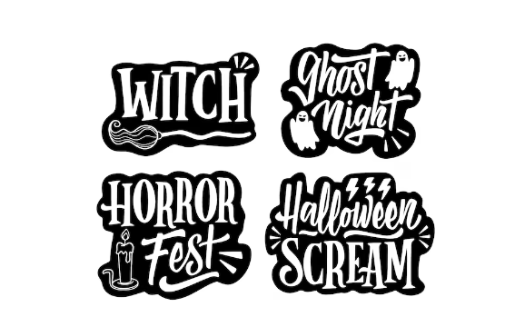
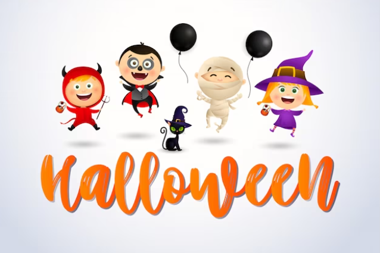
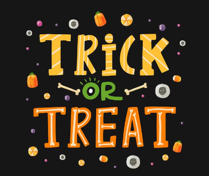
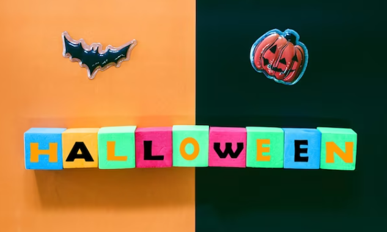
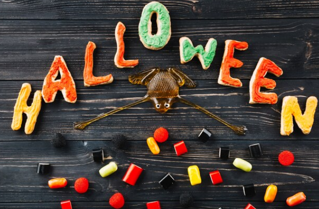
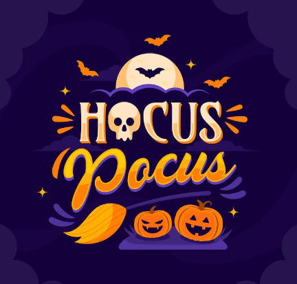
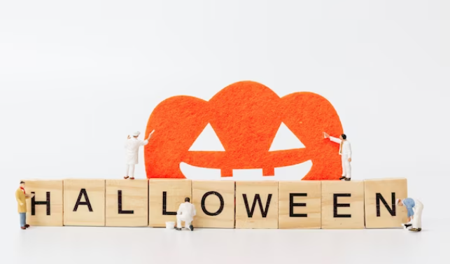
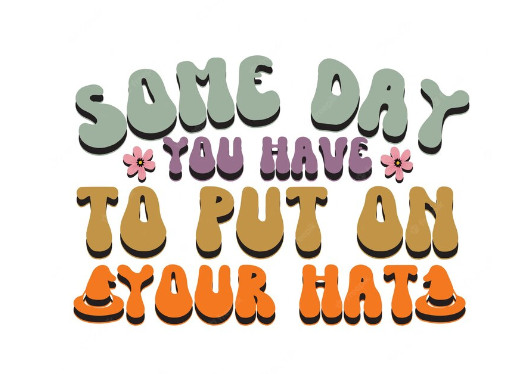
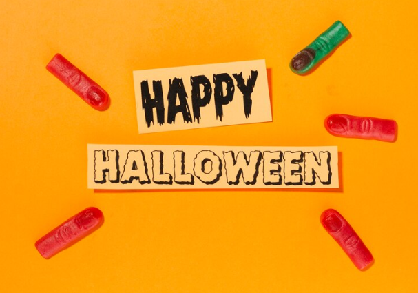

This article has been written and researched by our expert Loveable through a precise methodology. [Learn more about our methodology](https://avada.io/loveable/our-methodological.html)

[Loveable](https://avada.io/loveable/) > [Blog](https://avada.io/loveable/blog/) > [Holiday](https://avada.io/loveable/holiday/)

# 100+ Best Halloween Captions That’re Spooky and Cute in 2023

Written by [Blake Simpson](https://avada.io/loveable/author/blake/) Last Updated on October 03, 2023

- [Importance of captions in social media posts](https://avada.io/loveable/blog/halloween-captions/#wp-block-heading-2-2)
- [Clever and Funny Halloween Captions](https://avada.io/loveable/blog/halloween-captions/#wp-block-heading-2-7)
    - [Captions that evoke laughter and humor](https://avada.io/loveable/blog/halloween-captions/#wp-block-heading-3-10)
    - [Incorporating puns and wordplay related to Halloween](https://avada.io/loveable/blog/halloween-captions/#wp-block-heading-3-33)
    - [Engaging and entertaining Halloween captions for spooky and light-hearted content](https://avada.io/loveable/blog/halloween-captions/#wp-block-heading-3-52)
- [Spooky and Haunting Halloween Captions](https://avada.io/loveable/blog/halloween-captions/#wp-block-heading-2-66)
    - [Creating an eerie atmosphere with Halloween captions](https://avada.io/loveable/blog/halloween-captions/#wp-block-heading-3-68)
    - [Enhancing the impact of horror-themed posts with chilling captions](https://avada.io/loveable/blog/halloween-captions/#wp-block-heading-3-92)
- [Cute and Playful Halloween Captions](https://avada.io/loveable/blog/halloween-captions/#wp-block-heading-2-94)
    - [Captions that highlight the fun and adorable aspects of Halloween](https://avada.io/loveable/blog/halloween-captions/#wp-block-heading-3-97)
    - [Incorporating cute and playful wordings for costumes and decorations](https://avada.io/loveable/blog/halloween-captions/#wp-block-heading-3-99)
    - [Captions that bring out the childlike excitement of the holiday](https://avada.io/loveable/blog/halloween-captions/#wp-block-heading-3-117)
- [Inspirational and Thoughtful Halloween Captions](https://avada.io/loveable/blog/halloween-captions/#wp-block-heading-2-130)
    - [Captions that delve into the deeper meaning of Halloween](https://avada.io/loveable/blog/halloween-captions/#wp-block-heading-3-132)
    - [Encouraging introspection and personal growth through Halloween-inspired captions](https://avada.io/loveable/blog/halloween-captions/#wp-block-heading-3-156)
- [Bottom Line](https://avada.io/loveable/blog/halloween-captions/#wp-block-heading-2-172)

Are you ready to give your Halloween posts a spooktacular boost? Look no further! We have curated a collection of over 30 best **Halloween captions** that will add a hauntingly perfect touch to your social media posts. These captions are made to pique interest and bring your [Halloween-themed movie](https://avada.io/loveable/blog/best-halloween-movies/) to life, whether you’re going for creepy, charming, or a mix of the two. Prepare the most entrancing and enchanting captions for this Halloween season to wow your fans.

## **Importance of captions in social media posts**

When it comes to social media, captions play a crucial role in conveying your message and engaging your audience. Halloween, with its enchanting atmosphere and playful spirit, offers the perfect opportunity to get creative with your captions. Everyone will find something in this selection of Halloween captions, which range from clever wordplay to ominous emotions. These captions will make sure that your photos stand out from the crowd, whether you’re sharing your favorite Halloween goodies, showing off your frightening Halloween décor, or recording your costume.

It might be difficult to capture the spirit of Halloween in a single caption, but do not worry! Our carefully chosen subtitles are meant to inspire just the right amount of sweetness and spookiness. You can easily establish the mood for your Halloween-themed posts with these captions, leaving your fans deliciously spooked. Our selection has you covered whether you want to scare them, make them giggle, or just enjoy the lighthearted side of Halloween. 

In order to up your social media game, check out our selection of 100+ excellent Halloween captions, regardless of whether you enjoy all things spooky or prefer the more charming side of Halloween. Prepare your captions to fascinate your followers by effectively enhancing your Halloween-themed material. These captions will guarantee that your posts are a graveyard blockbuster, whether they feature eerie quotations or sweet and smart humor. This Halloween, embrace the magic of captions and let your imagination run wild. Give your social media posts a ghostly makeover so that your fans will be clamoring for more.

## **Clever and Funny Halloween Captions**

Halloween captions can not lack clever and funny quotes for everybody. With our selection of amusing and intelligent Halloween captions, be ready to add some humor and intelligence to your posts. We know how important it is to convey the spirit of Halloween in a hilarious and clever way, which is why we have hand-picked the funniest captions for your enjoyment. Our selection of Halloween captions has you covered if you’re searching for a fast and simple caption or want to show off your wit and comedy. These Halloween captions, which range from puns and wordplay to humorous one-liners, can help your Halloween posts stand out from the throng. So be ready to have a spooky good time and amuse your followers with the greatest Halloween captions available!

### **Captions that evoke laughter and humor**

If you’re in search of captions that will tickle your funny bone and evoke laughter and humor, look no further. Our collection of Halloween captions is here to add a dose of hilarity to your posts. We understand the importance of capturing the lighter side of Halloween, and that’s why we’ve handpicked the best captions that are guaranteed to make you and your followers laugh out loud. From clever puns to witty one-liners, these captions are the perfect way to bring a smile to everyone’s face. Make plans to amuse with the greatest Halloween captions that will make an impression and keep people laughing all season long. You can choose some Halloween captions below:

- “Creepin’ it real since \[year\]!”
- “Witch better have my candy!”
- “I’m just here for the boos.”
- “Trick or treat, smell my feet, give me something good to eat!”
- “Having a spooktacular time!”
- “Eat, drink, and be scary!”
- “I’m a Halloween enthusiast, not a ghostbuster!”
- “Fangs for the memories!”
- “If you’ve got it, haunt it!”
- “Ghouls just wanna have fun!”
- “I’m too cute to spook!”
- “Boo-tiful and proud!”
- “Beware of the monster within!”
- “I’m here for the candy, not the scares!”
- “Witchful thinking: everyday is Halloween for me!”
- “I’m a happy haunting ground for Halloween!”
- “Halloween: the only time it’s acceptable to ask strangers for candy.”
- “I’m the ghostess with the mostess!”
- “I’m all about that pumpkin spice and everything fright!”
- “Hocus Pocus and chill.”

These captions are sure to evoke laughter and humor, adding an extra dose of fun to your Halloween posts.

### **Incorporating puns and wordplay related to Halloween**

Are you ready to add a touch of wit and cleverness to your Halloween posts? Look no further! We’ve got a collection of Halloween captions that incorporate puns and wordplay, guaranteed to bring a smile to your face and make your followers crack up. These captions are the perfect way to show off your creative side while capturing the essence of the spooky season.

- “I’m so corny, I could be a candy cob!”
- “Creepin’ it real since day one.”
- “Witch better have my candy!”
- “Getting into the ‘spirit’ of things this Halloween.”
- “Pumpkin spice and everything fright!”
- “Having a gourd time this Halloween.”
- “I’m a ‘sucker’ for treats and tricks.”
- “Fangs for the memories!”
- “I’m just ‘dying’ to have a good time this Halloween.”
- “Brew-tiful and proud!”
- “I’m a ‘ghoul’friend you can always count on.”
- “This Halloween, I’m on a ‘scream’ diet: lots of candy and no regrets!”
- “It’s a boo-tiful night for some mischief and mayhem!”
- “I’m the ‘ghostest’ with the mostest!”
- “I’ve got a ‘skeleton’ of puns up my sleeve this Halloween.”

Pun-filled Halloween captions are sure to make your posts stand out and keep your audience entertained. Get ready to have a howling good time and let the puns roll!

### **Engaging and entertaining Halloween captions for spooky and light-hearted content**

Looking to add some engaging and entertaining captions to your spooky and light-hearted Halloween content? We’ve got you covered! These Halloween captions are perfect for capturing the essence of the season while keeping things fun and lighthearted. Whether you’re sharing costume ideas, haunted house adventures, or pumpkin carving masterpieces, these captions will help you engage your audience and keep them entertained.

- “Getting into the Halloween spirit, one ‘boo’ at a time!”
- “Trick or treat, smell my feet, give me something good to eat!”
- “Pumpkin spice and everything nice, that’s what Halloween is made of!”
- “Ready to spook and be spooked this Halloween!”
- “No tricks, just treats and plenty of sweets!”
- “Ghouls just wanna have fun!”
- “Halloween vibes on point!”
- “Witchful thinking: it’s always Halloween in my heart.”
- “Embrace the spooktacular side of life!”
- “Nothing a little Halloween magic can’t fix!”

These are engaging and entertaining Halloween captions, which will add a touch of fun and excitement to your posts. So go ahead, get creative, and let the Halloween spirit shine through your captions!

## **Spooky and Haunting Halloween Captions**

Are you ready to add a touch of spookiness and haunting vibes to your Halloween posts? Look no further! These spooky and haunting Halloween captions are here to give your content an eerie twist. These captions will provide the right ambiance for your Halloween-themed photos, whether you’re capturing the haunting ambiance of a haunted home or highlighting your spine-chilling outfit.

### **Creating an eerie atmosphere with Halloween captions**

Are you looking to create an eerie and chilling atmosphere for your Halloween-themed content? Look no further! With these captivating Halloween captions, you can effortlessly set the tone and evoke a sense of mystery and spookiness. These Halloween captions will contribute to giving your viewers an extraordinary experience, whether you’re posting images of spooky settings, eerie props, or your own spooky outfit.

- “Enter if you dare…”
- “Ghosts and ghouls, welcome to the fright night!”
- “Something wicked this way comes…”
- “Embrace the darkness, it’s Halloween night!”
- “In the realm of shadows, Halloween reigns supreme.”
- “Let the spirits guide you this Halloween…”
- “Shivers down your spine, it’s time for a spine-chilling Halloween!”
- “Beware of what lurks in the shadows…”
- “Capturing the essence of Halloween’s eerie enchantment.”
- “Gather ’round, the spirits have a story to tell…”
- “Step into the shadows…”
- “Unleash the magic of the night with these eerie captions.”
- “A haunted tale begins…”
- “Dare to embrace the darkness this Halloween.”
- “Capturing the essence of the supernatural with these eerie captions.”
- “Leave a trail of goosebumps with these chilling captions.”
- “Let the spirits guide your Halloween journey…”
- “Summoning the Halloween spirits with these captivating captions.”
- “Enter if you dare, into the realm of the unknown…”
- “Creating an atmosphere of mystery and intrigue with these haunting captions.”

With these eerie Halloween captions, you can effortlessly transport your audience into a world of spine-tingling suspense. Get ready to embrace the macabre and captivate your followers with the perfect blend of mystery and intrigue this Halloween season.

### **Enhancing the impact of horror-themed posts with chilling captions**

Looking to add an extra layer of terror to your horror-themed posts this Halloween? Look no further! With these chilling captions, you can enhance the impact of your spine-chilling content and leave your audience trembling with fear. From haunted houses to terrifying costumes, these captions are designed to send shivers down your followers’ spines and keep them engaged in the dark world you’ve created. Get ready to take your Halloween posts to the next level with the best and most bone-chilling captions around. Brace yourself for a chilling journey into the realm of horror!

## **Cute and Playful Halloween Captions**

Featuring these adorable captions, be ready to add some cuteness and humor to your Halloween posts! These captions are ideal for adding a dash of charm and comedy to your Halloween video, whether you’re dressing up in a cute costume or showing off your festive decorations. These captions, which include puns and humorous wordplay, will make your followers smile and interact with your posts. Don’t settle for generic subtitles when you can celebrate Halloween with imagination and humor. Get inspired and let your imagination run wild with the best and most playful Halloween captions that will make your content truly unforgettable!

### **Captions that highlight the fun and adorable aspects of Halloween**

Considering these intriguing captions, be ready to enjoy Halloween’s cute and entertaining side! Halloween captions present a universe of pleasant moments that merit celebration, from adorable costumes to delectable delicacies. These captions are made to stand out on social media and cheer up your followers by highlighting the fun and frivolity of this spooktacular event. These captions will beautifully match your images and bring out the best of this festive season, whether you’re documenting the fun of trick-or-treating or exhibiting your pet friend’s Halloween attire. Prepare to spread Halloween happiness by using the greatest and cutest subtitles to highlight your material!

### **Incorporating cute and playful wordings for costumes and decorations**

In this part, we will provide you with cute and playful Halloween captions. Look at below to know more:

- “Pumpkin kisses and harvest wishes!”
- “Trick or treat, smell my feet, give me something good to eat!”
- “Boo-tiful and boo-tiful cute!”
- “Having a howling good time this Halloween!”
- “Fangs for the memories and the sweet treats!”
- “Witchful thinking and cat-tastic adventures!”
- “Creepin’ it real with cuteness overload!”
- “I’m just here for the boos and the candy!”
- “Batty for Halloween and loving every minute of it!”
- “My costume may be spooky, but I’m all sweetness underneath!”
- “Wishing you a spook-tacular and adorable Halloween!”
- “Cute and cuddly, even when we’re a little kooky!”
- “Ready to trick or treat and be the cutest pumpkin in the patch!”
- “No tricks, just treats and lots of smiles!”
- “Making memories and having a fang-tastic time this Halloween!”

### **Captions that bring out the childlike excitement of the holiday**

Considering these intriguing captions, be ready to enjoy Halloween’s cute and entertaining side! Halloween presents a universe of pleasant moments that merit celebration, from adorable costumes to delectable delicacies. These captions are made to stand out on social media and cheer up your followers by highlighting the fun and frivolity of this spooktacular event. These captions will beautifully match your images and bring out the best of this festive season, whether you’re documenting the fun of trick-or-treating or exhibiting your pet friend’s Halloween attire. Prepare to spread Halloween happiness by using the greatest and cutest subtitles to highlight your material!

- “Channeling my inner child and embracing the Halloween magic!”
- “Nothing beats the thrill of trick or treating and the joy of counting candy!”
- “Feeling like a kid again, filled with Halloween excitement and anticipation.”
- “Unleashing my playful spirit this Halloween, because age is just a number!”
- “Embrace the whimsy and enchantment of Halloween with wide-eyed wonder.”
- “Rekindling the childlike excitement of Halloween, where every costume feels like pure magic.”
- “Giddy with excitement like a kid on Christmas morning, but it’s Halloween!”
- “Finding delight in the simple joys of Halloween, from pumpkin carving to bobbing for apples.”
- “Capturing the essence of childhood with each step in my Halloween costume.”
- “Embracing the nostalgia of Halloween and relishing in the joy of being a kid at heart.”

Let these captions remind you and your followers of the childlike spirit that makes Halloween such a beloved holiday.

## **Inspirational and Thoughtful Halloween Captions**

Celebrate the Halloween season with captions that go beyond the spooky and playful, and delve into the realm of inspiration and thoughtfulness. These captions are designed to add a deeper meaning to your Halloween posts, encouraging reflection and contemplation. From embracing personal growth to appreciating the beauty of darkness, these captions will spark introspection and connect with your audience on a deeper level.

### **Captions that delve into the deeper meaning of Halloween**

Delve into the deeper meaning of Halloween with captions that go beyond the surface-level spookiness. These captions invite introspection and exploration of the symbolism and traditions associated with this bewitching holiday. These captions will encourage reflection and foster a sense of connection to the rich tradition and history of Halloween, from embracing the cycles of life and death to remembering our ancestors.

“In the shadows of Halloween, find the courage to embrace your inner strength.”

- “Let the magic of Halloween remind you that even in darkness, there is beauty.”
- “Embrace the transformative power of Halloween and let go of what no longer serves you.”
- “The scariest monsters are the ones we create within ourselves. Choose love over fear this Halloween.”
- “May the spirits of Halloween inspire you to rise above your fears and step into your true power.”
- “Halloween is a reminder that life is a delicate balance of light and dark, and both are necessary for growth.”
- “Let Halloween be a time of reflection, as we face our shadows and grow stronger in the process.”
- “In the enchantment of Halloween, discover the magic within yourself and let it shine.”
- “This Halloween, let go of the masks and embrace the authenticity that lies beneath.”
- “May the lessons of Halloween guide you towards self-discovery and personal transformation.”
- “Halloween reminds us that in the darkness, there is the promise of new beginnings and the beauty of transformation.”
- “As the veil between worlds grows thin, let us honor our ancestors and the wisdom they impart upon us.”
- “In the pumpkin’s glow and the rustling leaves, we find the whispers of ancient traditions and the magic of folklore.”
- “Halloween invites us to embrace the cycles of life, to celebrate both the light and the shadows within ourselves.”
- “Beyond the costumes and candy, Halloween is a time to connect with our spiritual nature and the unseen energies around us.”
- “In the flickering candlelight, we honor the spirits of the past and acknowledge the interconnectedness of all beings.”
- “Let us dance with the spirits of the night and find solace in the mystery and enchantment that Halloween brings.”
- “Halloween teaches us the power of facing our fears and embracing the shadows within, for it is there that true strength is found.”
- “As the world embraces the magic of Halloween, let us remember the power of imagination and the limitless possibilities it holds.”
- “In the tapestry of Halloween’s traditions, we discover the threads that connect us to generations past and the legacy we leave for those to come.”

With the help of these captions, your viewers will be inspired to dig further into the significance of Halloween and get more familiar with the complex customs and symbolism that go along with it.

### **Encouraging introspection and personal growth through Halloween-inspired captions**

Use Halloween-themed captions to stimulate self-reflection and personal development by going beyond the superficial celebrations. These captions promote introspection and provide provocative ideas, encouraging people to set out on a path of self-discovery and change over the Halloween season.

- “As the world transforms around us, let us embrace the magic of Halloween to reflect on our own inner transformations.”
- “In the shadows of Halloween, we find an opportunity to explore the depths of our souls and unlock hidden potential.”
- “Halloween reminds us that the scariest monsters are often the ones we carry within ourselves. Confront them, and watch yourself grow.”
- “Beyond the costumes and makeup lies a chance for personal reinvention. Embrace the spirit of Halloween and step into a new version of yourself.”
- “In the eerie stillness of the night, take a moment to confront your fears and discover the strength that lies within you.”
- “Halloween is a reminder that change can be both scary and exhilarating. Embrace the unknown and watch yourself blossom.”
- “As the veil thins, let us peer into the depths of our souls and unearth the hidden treasures that lie within.”
- “Halloween beckons us to shed our old skins and embrace growth. Dare to step out of your comfort zone and embrace the transformative power of this season.”
- “Beyond the tricks and treats, Halloween invites us to face our inner demons and emerge stronger and wiser on the other side.”
- “Harness the mystical energy of Halloween to embark on a journey of self-discovery and personal growth. You have the power to rewrite your story.”

**See More:**

- [Halloween Symbols Explained](https://avada.io/loveable/halloween-symbols-explained/) in Detail

- [Halloween Pickup Lines](https://avada.io/loveable/blog/halloween-pickup-lines/) That’ll Make Your Boo

## **Bottom Line**

Inspiring reflection and personal development, these captions serve as a gentle reminder that Halloween is about more than just costumes and treats; it’s also a chance to explore one’s innermost thoughts and accept change. As you go out on a path of strength and self-discovery, embrace the Halloween spirit. In conclusion, **Halloween captions** play a significant role in enhancing the overall experience of the Halloween season. Whether you’re looking for easy, funny, or best captions, there are endless possibilities to express your creativity and engage with your audience. From capturing the spooky and haunting atmosphere to highlighting Halloween’s fun and adorable aspects, these captions allow you to convey your emotions, thoughts, and the essence of this festive occasion. Follow Loveable to learn more about famous tips.

- [Importance of captions in social media posts](https://avada.io/loveable/blog/halloween-captions/#wp-block-heading-2-2)
- [Clever and Funny Halloween Captions](https://avada.io/loveable/blog/halloween-captions/#wp-block-heading-2-7)
    - [Captions that evoke laughter and humor](https://avada.io/loveable/blog/halloween-captions/#wp-block-heading-3-10)
    - [Incorporating puns and wordplay related to Halloween](https://avada.io/loveable/blog/halloween-captions/#wp-block-heading-3-33)
    - [Engaging and entertaining Halloween captions for spooky and light-hearted content](https://avada.io/loveable/blog/halloween-captions/#wp-block-heading-3-52)
- [Spooky and Haunting Halloween Captions](https://avada.io/loveable/blog/halloween-captions/#wp-block-heading-2-66)
    - [Creating an eerie atmosphere with Halloween captions](https://avada.io/loveable/blog/halloween-captions/#wp-block-heading-3-68)
    - [Enhancing the impact of horror-themed posts with chilling captions](https://avada.io/loveable/blog/halloween-captions/#wp-block-heading-3-92)
- [Cute and Playful Halloween Captions](https://avada.io/loveable/blog/halloween-captions/#wp-block-heading-2-94)
    - [Captions that highlight the fun and adorable aspects of Halloween](https://avada.io/loveable/blog/halloween-captions/#wp-block-heading-3-97)
    - [Incorporating cute and playful wordings for costumes and decorations](https://avada.io/loveable/blog/halloween-captions/#wp-block-heading-3-99)
    - [Captions that bring out the childlike excitement of the holiday](https://avada.io/loveable/blog/halloween-captions/#wp-block-heading-3-117)
- [Inspirational and Thoughtful Halloween Captions](https://avada.io/loveable/blog/halloween-captions/#wp-block-heading-2-130)
    - [Captions that delve into the deeper meaning of Halloween](https://avada.io/loveable/blog/halloween-captions/#wp-block-heading-3-132)
    - [Encouraging introspection and personal growth through Halloween-inspired captions](https://avada.io/loveable/blog/halloween-captions/#wp-block-heading-3-156)
- [Bottom Line](https://avada.io/loveable/blog/halloween-captions/#wp-block-heading-2-172)

### [Blake Simpson](https://avada.io/loveable/author/blake/)

Hi, I'm Blake from Loveable. I help people find perfect gifts for occasions like anniversaries and weddings. I also write a blog about holidays, sharing insights to make them more meaningful. Let's create unforgettable moments together!

- [Twitter](https://twitter.com/intent/tweet)
- [Facebook](https://www.facebook.com/sharer/sharer.php)
- [instagram](https://avada.io/loveable/blog/halloween-captions/)
- [pinterest](https://www.pinterest.com/loveablellc/)

## Related Posts

[### 120+ Christian Birthday Wishes To Spread Your Love](https://avada.io/loveable/blog/christian-birthday-wishes/) 

[

### 35 Best 70th Birthday Ideas To Celebrate The Special Milestone

](https://avada.io/loveable/blog/70th-birthday-ideas/)

[

### 50 Best 30th Birthday Decorations for a Remarkable Birthday Bash

](https://avada.io/loveable/blog/30th-birthday-decorations/)

[

### 40 Delicious Vegan Christmas Desserts to Delight Your Palate

](https://avada.io/loveable/blog/vegan-christmas-desserts/)

[

### 60 Christmas Team Building Activities to Boost Workplace Spirit

](https://avada.io/loveable/blog/christmas-team-building-activities/)
