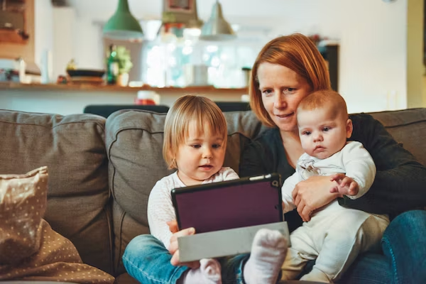
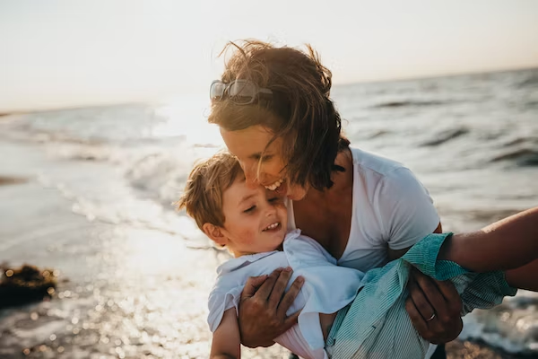

This article has been written and researched by our expert Loveable through a precise methodology. [Learn more about our methodology](https://avada.io/loveable/our-methodological.html)

[Loveable](https://avada.io/loveable/) > [Blog](https://avada.io/loveable/blog/) > [Parenting](https://avada.io/loveable/parenting/)

# 100 Empowering Single Mom Quotes: Inspirational Words for Strong Mothers

Written by [Benjamin Collins](https://avada.io/loveable/author/benjamin/) Last Updated on September 05, 2023

- [Inspirational Quotes for Single Mom](https://avada.io/loveable/blog/single-mom-quotes/#wp-block-heading-2-3) 
- [Powerful Quotes for Single Mom](https://avada.io/loveable/blog/single-mom-quotes/#wp-block-heading-2-40) 
- [Proud Single Mom Quotes](https://avada.io/loveable/blog/single-mom-quotes/#wp-block-heading-2-76) 
- [Bottom Line](https://avada.io/loveable/blog/single-mom-quotes/#wp-block-heading-2-114) 

Being a single mom is never an easy task, but it is a journey that requires immense strength, resilience, and love. Therefore, in this collection, we have gathered a treasure trove of uplifting quotes that celebrate the indomitable spirit of single mothers everywhere. These **Single Mom Quotes** are not only a source of inspiration but also a reminder of the incredible power that lies within every woman’s triumphs of single motherhood.

Within these pages, you will find a diverse range of empowering Single Mom Quotes that touch upon various aspects of the single mother experience. From moments of exhaustion to moments of joy, these quotes encapsulate the determination that defines single moms. If you want to celebrate the incredible strength of single moms in your life, these Words for Strong Mothers are sure to uplift your spirits and remind you of the extraordinary courage and love that flows through the hearts of single mothers.

## **Inspirational Quotes for Single Mom** 

The journey of being a single mother calls for tremendous courage, resiliency, and drive. These motivational sayings serve as a ray of hope and inspiration for single mothers all around the world in the face of diverse difficulties. These quotations serve as reminders that single mothers are capable of incredible things and deserve all the support and adulation they receive. They range from embracing self-love to finding joy in the little moments.

1\. “Just because I am a single mother doesn’t mean I cannot be a success.” – Yvonne Kaloki

2\. “If you bungle raising your children, I don’t think what you do matters very much.” – Jackie Kennedy

3\. “Being a working mother and a working single parent instills in you a sense of determination.” – Felicity Jones

4\. “The women whom I love and admire for their strength and grace did not get that way because stuff worked out. They got that way because stuff went wrong, and they handled it. They handled it in a thousand different ways on a thousand different days, but they handled it. Those women are my superheroes.”- Elizabeth Gilbert

5\. “As a single mum, you’ll discover inner strengths and capabilities you never knew you had.” – Emma-Louise Smith

6\. “I value so many people who have to work full time, definitely single mothers. Their work is the hardest work. I applaud it so much.” – Molly Sims

7\. “I don’t think you necessarily have to be part of a traditional nuclear family to be a good mother.” – Mary Louise Parker

8\. “I want to show the example that you can be a single mother and work and handle a lot of other things at the same time.” – Christina Milian

9\. “As a single mom, I’m juggling a lot and working long hours. Yes, it costs them a little, but what my children get in return is a mother who is energized and content.” – Edie Falco

10\. “There will be so many times you feel like you failed. But in the eyes, ears, and mind of your child, you are a SUPER MOM.” – Stephanie Precourt

11\. “Some days, she has no idea how she’ll do it. But every single day. It still gets done.” – Anonymous

12\. “Being raised by a single mother, I learned to appreciate and value independent women.” – Kenny Conley

13\. ”Respect to all mums doing double duty because of men failing to do their part as dads.” – John Mark Green

14\. ”Being a single parent is not a life full of struggles, but a journey for the strong.” – Meg Lowrey

15\. “When you are a mother, you are never really alone in your thought. A mother always has to think twice, once for herself and once for her child.” – Sophia Loren

16\. “We may encounter many defeats, but we must not be defeated.” – Maya Angelou

17\. “I would say to any single parent currently feeling the weight of stereotype or stigmatization that I am prouder of my years as a single mother than of any other part of my life.” – J.K. Rowling

18\. “I think it’s really important for every mother to find their own way.” — Solange Knowles

19\. “Gone are the days when you would sit and wait for your knight in shining armor. Be brave, be independent, and believe that you can do it, and you can do a better job.”- Unknown

20\. “She has to have four arms, four legs, four eyes, two hearts, and double the love. There is nothing single about a single mom.” — Mandy Hale

21\. “I am a single mom, and I’m the breadwinner and I have to work, and I have to do these things and that’s just the way it is. I don’t think my son even knows any different.” – Charisma Carpenter

22\. “I can’t tell you how much I respect all the single parents out there doing it solo” – Jennie Finch

23\. “Only mothers can think of the future because they give birth to it in their children.”- Maxim Gorky

24\. “A single mom tries when things are hard. She never gives up. She believes in her family, even when things are tough. She knows that above all things, a mother’s love is more than enough.”- Deniece Williams

25\. “It’s not single parenthood in and of itself. It’s more about how people parent.” – Sophie Zadeh

26\. “Mothers – especially single mothers – are heroic in their efforts to raise our nation’s children, but men must also take responsibility for their children and recognize the impact they have on their families’ well-being.” – Evan Bayh

27\. “I didn’t plan on being a single mom, but you have to deal with the cards you are dealt the best way you can.” – Tichina Arnold

28\. “Remember that a single mom is just like any other mom and that our number one priority is till our kids. Any parent does whatever it takes for their kids, and a single mother is no different.” – Paula Miranda

29\. “Nothing you do for children is ever wasted.” – Garrison Keillor

30\. “The most difficult part of dating as a single parent is deciding how much risk your own child’s heart is worth.” – Daniel Pearce

31\. “Better a loving single-parent family than a ‘conventional’ family where the parents hate each other and the father is a demagogue.” – Moby

32\. “I was once a single mother, with very few resources, so I have a special place in my heart for women in difficult situations.” – Linda Lael Miller

33\. “The strength of my mother is something I didn’t pay attention to for so long. Here she was, this single mom, who was part of the Great Migration, who was part of a Jim Crow south, who said, ‘I’m getting my kids out of here. I’m creating opportunities for these young people by any means necessary.” – Jacqueline Woodson

**_See More_**: [Multitasking Mom](https://avada.io/loveable/multitasking-mom/): The Complete Guide to Improve Productivity 

## **Powerful Quotes for Single Mom** 

A fantastic example of a woman’s unbreakable character is becoming a single mother. These inspiring single mom quotes perfectly express their tenacity, willpower, and undying love. These quotations serve as beacons of inspiration, reassuring single mothers that they can build a beautiful existence and have an enduring influence on their children’s lives. They cover a range of topics, from overcoming hurdles to fostering their children’s ambitions. They are warriors that epitomize tenacity, grace, and the capacity to succeed in adversity.

34\. “Single motherhood is an amazing thing; it’s a blessing.” – Kelly Cutrone

35\. “You always have to carry on. And you can, because you have to.” – Kate Winslet

36\. “She has to have four arms, four legs, four eyes, two hearts, and double the love. There is nothing single about a single mom.” – Mandy Hale

37\. “Sometimes the strength of motherhood is greater than natural laws.” – Barbara Kingsolver

38\. “Motherhood is the ultimate call to sacrifice.” – Wangechi Mutu

39\. “I want to show the example that you can be a single mother and work and handle a lot of other things at the same time.” – Christina Milian

40\. “It’s difficult, but far from impossible, and we smile more than we cry.” – Regina King

41\. “I value so many people who have to work full time, definitely single mothers. Their work is the hardest work. I applaud it so much.” – Molly Sims

42\. “As a single mum, you’ll discover inner strengths and capabilities you never knew you had.” – Emma-Louise Smith

43\. “Being a single parent is not a life full of struggles, but a journey for the strong.” – Meg Lowrey

44\. “A single mother has a backbone made of steel and a heart made of gold.”– Anonymous

45\. “There will be so many times you feel like you failed. But in the eyes, ears, and mind of your child, you are a SUPER MOM.” – Stephanie Precourt

46\. “When you’re a single parent, you’re often lonely yet seldom alone. There is no backup… It is mothering without a net.” – Amy Dickinson

47\. “A single mom tries when things are hard. She never gives up. She believes in her family, even when things are tough. She knows that above all things, a mother’s love is more than enough.” – Deniece Williams

48\. “Some days, she has no idea how she’ll do it. But every single day. It still gets done.” – Anonymous

49\. “A single mom: she laughs, she loves, she sacrifices, she overcomes, she inspires.”

50\. “You may be one person, but to your child, you are their world.”

51\. “Strength is what happens when you have no other choice but to be strong.”

52\. “Being a single mom doesn’t mean you’re alone. It means you’re strong enough to handle everything on your own.”

53\. “You are not just a single mom. You are a superhero in disguise.”

54\. “Single moms: rewriting the rules, redefining strength, and raising amazing human beings.”

55\. “The love between a single mom and her child is unbreakable and unstoppable.”

56\. “You are not a statistic; you are a powerful force of love and resilience.”

57\. “No matter how tough it gets, remember that you are making a difference in your child’s life every day.”

58\. “Single moms have the biggest hearts, the strongest wills, and the brightest smiles.”

59\. “Your strength as a single mom is an inspiration to us all.”

60\. “Your child may only have one parent, but they have all the love in the world.”

61\. “Never underestimate the power of a single mom who is determined to succeed.”

62\. “Your strength as a single mom is the greatest gift you can give your child.”

63\. “Being a single mom is tough, but remember that diamonds are formed under pressure.”

64\. “You are capable of amazing things, even as a single mom. Believe in yourself.”

65\. “No matter the obstacles, you are creating a beautiful life for you and your child.”

66\. “Single moms: turning challenges into opportunities and obstacles into stepping stones.”

## **Proud Single Mom Quotes** 

“Proud Single Mom Quotes” honors the extraordinary fortitude and tenacity of single mothers. The steadfast pride that comes from accepting the job of a single mother and the ardent love they have for their kids are embodied in these statements. These quotations serve as inspiring reminders that single parents have every cause to be proud of the singular and exceptional journey they travel with grace and tenacity, from defying social expectations to overcoming obstacles.

67\. “There’s no doubt that motherhood is the best thing in my life. It’s all that really matters.”- Courtney Cox

68\. “Motherhood is the only thing in my life that I’ve really known for sure is something I wanted to do.”- Cynthia Nixon

69\. “Motherhood is a beautiful, wonderful gift… except when it’s not.”- Rachel Hollis

70\. “Motherhood informs my work 100 percent.”- Jessica Marais

71\. “Motherhood is the ultimate call to sacrifice.”- Wangechi Mutu

72\. “Even though it leaves me sleep-deprived, I love every bit of motherhood.”- Neha Dhupia

73\. “Motherhood has relaxed me in many ways. You learn to deal with crisis. I’ve become a juggler, I suppose. It’s all a big circus, and nobody who knows me believes I can manage, but sometimes I do.”- Jane Seymour

74\. “Motherhood is the most challenging as well as the utmost satisfying vocation in this world.”- Nita Ambani

75\. “One thing I know for sure – this motherhood thing is not for sissies.”- Jennifer Nettles

76\. “Motherhood is nitty and gritty and brutal and wonderful. Sometimes, you’re really in the trenches!”- Constance Marie

77\. “We may not want to say it out loud, but motherhood is hard.”- Stephanie Ruhle

78\. “Motherhood was the first instance in my life where I was asked to sacrifice anything for anyone.”- Kim Brooks

79\. “Motherhood is… difficult and… rewarding.”- Gloria Estefan

80\. “There’s a feeling sometimes in motherhood that you’re alone in what you’re going through, and none of us are alone. We’re all going through the same thing.”- Nia Vardalos

81\. “Single motherhood is an amazing thing; it’s a blessing.”- Kelly Cutrone

82\. “The emotions, responsibilities – and the pain – of motherhood are unique to each of us with children. Ask any woman, and she will have her own story to tell.”- Fiona Barton

83\. “That’s what motherhood is: you’re working; you’re doing 25 different jobs, and you’re not getting paid.”- Melissa Peterman

84\. “A single mother has a backbone made of steel and a heart full of gold.”- Unknown

85\. “I’m a hustler. I’m a single mom, so whatever I’ve gotta do, I gotta do.”- Sherri Shepard

86\. “The life of a mother is the life of a child: you are two blossoms on a single branch.” – Karen Maezen Miller

87\. “Not all of us can do great things, but we can do small things with great love.” – Mother Teresa

88\. “You can be a mess and still be a good mom. You are allowed to be both.”- Unknown

89\. “When you’re a single parent, you’re often lonely yet seldom alone. There is no backup… It is mothering without a net.”- Amy Dickinson

90\. “You have to carry on as a mother, no matter what, and that’s what I’ve always done.”- Madonna

91\. “Whenever you feel discouraged, just remember, you are the center of the universe to the tiny humans you made from scratch. You’re kind of a big deal.”- Unknown

92\. “You do the best you can. Some days you feel really good about yourself and some days you don’t.”- Katie Holmes

93\. “My family is blended and diverse, nutty, and loving and understanding. That’s a family.”- Sandra Bullock

94\. “The loves of my life are my children and my mother. I don’t feel as if I need a man.”- Diane Keaton

95\. “The best gift a parent can give children is time … Single moms need to know it’s okay to have a little ‘me’ time.”- Denise Richards

96\. “You make it work. You keep getting out of bed. Sometimes it’s just because you know there’s a cup of coffee downstairs.”- Michelle Williams

97\. “I know how to do anything, I’m a mom.”- Rosanne Barr

98\. “It takes one rad mama to be a father too.”- Unknown

99\. “Motherhood matters. More than having the perfect house, the perfect body, the perfect planning schedule, the perfect kids, the perfect anything. You are a game-changer. A life changer. You are their mother.”- Unknown

100\. “For me, motherhood is learning about the strengths I didn’t know I had, and dealing with the fears I didn’t know existed.”- Halle Berry

**_Check Out_**: Best [Gifts For Single Moms](https://avada.io/loveable/gifts-for-single-moms/) To Make Her Feels Happy

## **Bottom Line** 

The above **single mom quotes** serve as a reminder that being a single mother is a testament to their enduring love and commitment, not just a role. Each quotation captures the spirit of their journey, inspiring and motivating readers to face obstacles, practice self-love, and revel in life’s precious moments. Take inspiration from these single mom quotes, accept their individual journey, and keep inspiring your kids and the rest of the world.

Remember, all of the single-mom quotes honor the costs paid, the difficulties surmounted, and the victories celebrated along the route. They remind us that being a single mother is not a weakness but a source of strength and a chance for development. May these motivational sayings encourage and uplift single mothers. It can be considered as a constant reminder of their immeasurable value, tenacity, and exceptional influence on their kids’ lives.

- [Inspirational Quotes for Single Mom](https://avada.io/loveable/blog/single-mom-quotes/#wp-block-heading-2-3) 
- [Powerful Quotes for Single Mom](https://avada.io/loveable/blog/single-mom-quotes/#wp-block-heading-2-40) 
- [Proud Single Mom Quotes](https://avada.io/loveable/blog/single-mom-quotes/#wp-block-heading-2-76) 
- [Bottom Line](https://avada.io/loveable/blog/single-mom-quotes/#wp-block-heading-2-114) 

### [Benjamin Collins](https://avada.io/loveable/author/benjamin/)

I'm Benjamin Collins, a gift ideas creator at Loveable. We specialize in unique and personalized gifts for any occasion. With my honed skills, I recommend gifts tailored to the recipient's personality and interests, whether it's Halloween, Christmas, or any other celebration.

- [Twitter](https://twitter.com/intent/tweet)
- [Facebook](https://www.facebook.com/sharer/sharer.php)
- [instagram](https://avada.io/loveable/blog/single-mom-quotes/)
- [pinterest](https://www.pinterest.com/loveablellc/)

## Related Posts

[

### 79 Heartfelt Missing Mom Quotes for Expressing Love and Longing

](https://avada.io/loveable/blog/missing-mom-quotes/)

[

### Parenting with Depression: Strategies for Coping, Seeking Help, and Building Resilience

](https://avada.io/loveable/blog/parenting-with-depression/)

[

### 100 Empowering Single Mom Quotes: Inspirational Words for Strong Mothers

](https://avada.io/loveable/blog/single-mom-quotes/)

[

### 99+ Heartfelt Quotes And Wishes: Happy Anniversary to Mom and Dad!

](https://avada.io/loveable/blog/quotes-happy-anniversary-mom-dad/)

[

### 5 Ways to Foster a Positive Parent-Teacher Relationship

](https://avada.io/loveable/blog/parent-teacher-relationship/)
