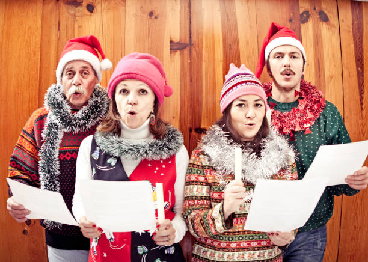

This article has been written and researched by our expert Loveable through a precise methodology. [Learn more about our methodology](https://avada.io/loveable/our-methodological.html)

[Loveable](https://avada.io/loveable/) > [Blog](https://avada.io/loveable/blog/) > [Holiday](https://avada.io/loveable/holiday/)

# 100+ Enchanting Christmas Song Trivia Questions & Answers

Written by [Blake Simpson](https://avada.io/loveable/author/blake/) Last Updated on September 08, 2023

- [100+ Christmas Song Trivia Questions (with Answers) To Play This Holiday Season](https://avada.io/loveable/blog/christmas-song-trivia/#wp-block-heading-2-2)
    - [Classic Holiday Carol Trivia](https://avada.io/loveable/blog/christmas-song-trivia/#wp-block-heading-3-3)
    - [Kid’s Christmas Song Trivia Questions](https://avada.io/loveable/blog/christmas-song-trivia/#wp-block-heading-3-66)
    - [Lyrics Quizzes: Name That Christmas Song](https://avada.io/loveable/blog/christmas-song-trivia/#wp-block-heading-3-129)
    - [Popular Culture Christmas Song Trivia](https://avada.io/loveable/blog/christmas-song-trivia/#wp-block-heading-3-192)
    - [Hard Christmas Music Trivia](https://avada.io/loveable/blog/christmas-song-trivia/#wp-block-heading-3-255)
    - [Christmas Movie Song Questions](https://avada.io/loveable/blog/christmas-song-trivia/#wp-block-heading-3-318) 
    - [Christmas Song Quiz Via Story](https://avada.io/loveable/blog/christmas-song-trivia/#wp-block-heading-3-381)
- [To Conclude,](https://avada.io/loveable/blog/christmas-song-trivia/#wp-block-heading-2-444)

This is the beginning of a joyous adventure through the history of Christmas music! There are more than **100+ Enchanting Christmas Song Trivia Questions & Answers** in this compilation. All the festive songs that have ever touched our hearts are here, from the old standards to the latest radio smashes. Investigate the history of Christmas music, from carol composers to the singers who made them famous. These trivia questions can lend a musical shine to your holiday celebrations, whether you’re a seasonal music expert or just a fan of the wonder of the holiday season.

## **100+ Christmas Song Trivia Questions (with Answers) To Play This Holiday Season**

### **Classic Holiday Carol Trivia**

_Classic Holiday Carol Trivia_

**1\. In the song “Jingle Bells,” what type of animal is mentioned pulling the sleigh?**

A) Horses

B) Reindeer

C) Polar bears

D) Camels

**Answer: B) Reindeer**

**2\. Which holiday carol includes the lyric “Chestnuts roasting on an open fire”?**

A) “Jingle Bell Rock”

B) “Deck the Halls”

C) “Frosty the Snowman”

D) “The Christmas Song”

**Answer: D) “The Christmas Song”**

**3\. “Silent Night” was originally composed in which language?**

A) English

B) German

C) French

D) Spanish

**Answer: B) German**

**4\. In the song “Frosty the Snowman,” what brings Frosty to life?**

A) A magic hat

B) A magical scarf

C) A magical snowflake

D) A magic button

**Answer: A) A magic hat**

**5\. What carol features the lyrics “Joy to the world, the Lord is come”?**

A) “Hark! The Herald Angels Sing”

B) “O Holy Night”

C) “God Rest Ye Merry, Gentlemen”

D) “Joy to the World”

**Answer: D) “Joy to the World”**

**6\. In the song “Rudolph the Red-Nosed Reindeer,” who asks Rudolph to guide the sleigh?**

A) Santa Claus

B) Mrs. Claus

C) Frosty the Snowman

D) The Grinch

**Answer: A) Santa Claus**

**7\. What carol tells the story of a poor child who plays his drum for the newborn baby Jesus?**

A) “We Three Kings”

B) “Little Drummer Boy”

C) “Angels We Have Heard on High”

D) “O Come, All Ye Faithful”

**Answer: B) “Little Drummer Boy”**

**8\. Which carol contains the line “Oh, what fun it is to ride in a one-horse open sleigh”?**

A) “Deck the Halls”

B) “Jingle Bells”

C) “Winter Wonderland”

D) “Sleigh Ride”

**Answer: B) “Jingle Bells”**

**9\. What song asks the question “Do you see what I see?”**

A) “Grandma Got Run Over by a Reindeer”

B) “Santa Claus Is Coming to Town”

C) “Do You Hear What I Hear?”

D) “All I Want for Christmas Is You”

**Answer: C) “Do You Hear What I Hear?”**

**10.  In the song “The Twelve Days of Christmas,” how many total gifts are given?**

A) 78

B) 144

C) 364

D) 12

**Answer: C) 364**

### **Kid’s Christmas Song Trivia Questions**

_Kid’s Christmas Song Trivia Questions_

**1\. In the song “Rudolph the Red-Nosed Reindeer,” what is unusual about Rudolph’s nose?**

A) It’s green

B) It’s blue

C) It’s shiny

D) It’s red

**Answer: D) It’s red**

**2\. “Jingle Bells” is often associated with which holiday?**

A) Halloween

B) Thanksgiving

C) Christmas

D) New Year’s Eve

**Answer: C) Christmas**

**3\. Which song includes the line “You better watch out, you better not cry”?**

A) “Santa Claus Is Coming to Town”

B) “Frosty the Snowman”

C) “Deck the Halls”

D) “Jingle Bell Rock”

**Answer: A) “Santa Claus Is Coming to Town”**

**4\. What song features the lyrics “Frosty the Snowman, was a jolly happy soul”?**

A) “Rudolph the Red-Nosed Reindeer”

B) “Jingle Bells”

C) “Frosty the Snowman”

D) “Winter Wonderland”

**Answer: C) “Frosty the Snowman”**

**5\. In “We Wish You a Merry Christmas,” what do the carolers demand before leaving?**

A) Presents

B) Cookies

C) Figgy pudding

D) Hot chocolate

**Answer: C) Figgy pudding**

**6\. Which song encourages you to “Deck the halls with boughs of holly”?**

A) “Jingle Bell Rock”

B) “Deck the Halls”

C) “Rockin’ Around the Christmas Tree”

D) “Winter Wonderland”

**Answer: B) “Deck the Halls”**

**7\. What song asks the question “Do you wanna build a snowman?”?**

A) “Let It Go” (from Frozen)

B) “Frosty the Snowman”

C) “Winter Wonderland”

D) “Jingle Bells”

**Answer: A) “Let It Go” (from Frozen)**

**8\. Which song features the line “Up on the housetop, reindeer pause”?**

A) “Rudolph the Red-Nosed Reindeer”

B) “Jingle Bells”

C) “Santa Claus Is Coming to Town”

D) “Up on the Housetop”

**Answer: D) “Up on the Housetop”**

**9.  In “The Twelve Days of Christmas,” what are “five golden rings”?**

A) Necklaces

B) Bracelets

C) Earrings

D) Rings of Saturn

**Answer: D) Rings of Saturn**

**10\. Which song suggests that Santa Claus is “comin’ to town”?**

A) “Jingle Bell Rock”

B) “Deck the Halls”

C) “Santa Claus Is Coming to Town”

D) “Frosty the Snowman”

**Answer: C) “Santa Claus Is Coming to Town”**

### **Lyrics Quizzes: Name That Christmas Song**

_Christmas Song Lyrics Quiz: Name That Christmas Song_

**1\. “Chestnuts roasting on an open fire” is the opening line of which Christmas song?**

A) “Jingle Bell Rock”

B) “Frosty the Snowman”

C) “The Christmas Song”

D) “Winter Wonderland”

**Answer: C) “The Christmas Song”**

**2\. “You better watch out, you better not cry” are the first words of which popular Christmas song?**

A) “Santa Claus Is Coming to Town”

B) “Rudolph the Red-Nosed Reindeer”

C) “Deck the Halls”

D) “Joy to the World”

**Answer: A) “Santa Claus Is Coming to Town”**

**3\. “Sleigh bells ring, are you listening?” is the opening line of which classic Christmas song?**

A) “Jingle Bells”

B) “White Christmas”

C) “Let It Snow! Let It Snow! Let It Snow!”

D) “Silent Night”

**Answer: C) “Let It Snow! Let It Snow! Let It Snow!”**

**4\. “I don’t want a lot for Christmas, there is just one thing I need” are lyrics from which popular Christmas song?**

A) “Jingle Bell Rock”

B) “All I Want for Christmas Is You”

C) “Feliz Navidad”

D) “The First Noel”

**Answer: B) “All I Want for Christmas Is You”**

**5\. “Rockin’ around the Christmas tree at the Christmas party hop” are the opening words of which festive song?**

A) “Winter Wonderland”

B) “Rockin’ Around the Christmas Tree”

C) “Jingle Bell Rock”

D) “Here Comes Santa Claus”

**Answer: B) “Rockin’ Around the Christmas Tree”**

**6\. “Joy to the world, the Lord is come; let earth receive her King” are lyrics from which traditional Christmas carol?**

A) “Hark! The Herald Angels Sing”

B) “O Holy Night”

C) “God Rest Ye Merry, Gentlemen”

D) “Joy to the World”

**Answer: D) “Joy to the World”**

**7\. “Silver bells, silver bells, it’s Christmas time in the city” are the opening lines of which well-known Christmas song?**

A) “Silver Bells”

B) “Deck the Halls”

C) “Winter Wonderland”

D) “Jingle Bells”

**Answer: A) “Silver Bells”**

**8\. “Dashing through the snow, in a one-horse open sleigh” are the first words of which classic Christmas tune?**

A) “Jingle Bell Rock”

B) “Sleigh Ride”

C) “Jingle Bells”

D) “Frosty the Snowman”

**Answer: C) “Jingle Bells”**

**9\. “He’s making a list and checking it twice, gonna find out who’s naughty and nice” are lyrics from which popular Christmas song?**

A) “Rudolph the Red-Nosed Reindeer”

B) “We Wish You a Merry Christmas”

C) “Santa Claus Is Coming to Town”

D) “Frosty the Snowman”

**Answer: C) “Santa Claus Is Coming to Town”**

**10\. “Haul out the holly; put up the tree before my spirit falls again” are the opening words of which beloved Christmas song?**

A) “White Christmas”

B) “Deck the Halls”

C) “Have Yourself a Merry Little Christmas”

D) “The Christmas Song”

**Answer: C) “Have Yourself a Merry Little Christmas”**

### **Popular Culture Christmas Song Trivia**

_Popular Culture Christmas Song Trivia_

**1\. Which modern pop artist released the hit song “Last Christmas” in the 1980s?**

A) Madonna

B) Michael Jackson

C) George Michael (Wham!)

D) Prince

**Answer: C) George Michael (Wham!)**

**2\. The song “All I Want for Christmas Is You” is famously performed by which vocalist?**

A) Whitney Houston

B) Mariah Carey

C) Adele

D) Celine Dion

**Answer: B) Mariah Carey**

**3\. In the song “Wonderful Christmastime,” Paul McCartney sings about “simply having” what?**

A) Fun

B) A wonderful time

C) A white Christmas

D) Joyful holidays

**Answer: B) A wonderful time**

**4\. “Do They Know It’s Christmas?” is a charity single recorded by the supergroup Band Aid. Which year did it first release?**

A) 1984

B) 1992

C) 2001

D) 2010

**Answer: A) 1984**

**5\. The song “Feliz Navidad,” which blends English and Spanish lyrics, is performed by which singer?**

A) Julio Iglesias

B) Enrique Iglesias

C) Ricky Martin

D) José Feliciano

**Answer: D) José Feliciano**

**6\. “Happy Xmas (War Is Over)” is a song by John Lennon and Yoko Ono. Which other artist contributed vocals to the song?**

A) Elton John

B) Bob Dylan

C) Paul McCartney

D) George Harrison

**Answer: B) Bob Dylan**

**7\. “Where Are You Christmas?” was originally recorded by Faith Hill for which popular holiday-themed movie?**

A) Home Alone

B) Elf

C) The Polar Express

D) How the Grinch Stole Christmas

**Answer: D) How the Grinch Stole Christmas**

**8\. Which pop star released the song “Mistletoe,” a catchy tune about holiday romance?**

A) Justin Timberlake

B) Bruno Mars

C) Justin Bieber

D) Shawn Mendes

**Answer: C) Justin Bieber**

**9\. “Santa Tell Me” is a modern Christmas song performed by which young artist?**

A) Ariana Grande

B) Demi Lovato

C) Taylor Swift

D) Selena Gomez

Answer: A) Ariana Grande

**10\. “Christmas Lights” is a song by which British rock band, known for their hits like “Yellow” and “Viva la Vida”?**

A) Radiohead

B) Coldplay

C) Oasis

D) The Rolling Stones

**Answer: B) Coldplay**

### **Hard Christmas Music Trivia**

_Hard Christmas Music Trivia_

**1\. Which classical composer’s “Hallelujah Chorus” is often performed during Christmas despite being a part of a larger work?**

A) Johann Sebastian Bach

B) George Frideric Handel

C) Wolfgang Amadeus Mozart

D) Ludwig van Beethoven

**Answer: B) George Frideric Handel**

**2\. The carol “Good King Wenceslas” describes the journey of a king who helps a poor man on which feast day?**

A) Christmas Day

B) St. Stephen’s Day (Boxing Day)

C) Epiphany

D) New Year’s Day

**Answer: B) St. Stephen’s Day (Boxing Day)**

**3\. In “The Twelve Days of Christmas,” what is given on the fifth day?**

A) Five golden rings

B) Five turtle doves

C) Five calling birds

D) Five French hens

**Answer: A) Five golden rings**

**4\. The song “I Saw Mommy Kissing Santa Claus” was sung by which young artist, known for his 1950s hits?**

A) Frankie Lymon

B) Bobby Darin

C) Ritchie Valens

D) Jimmy Boyd

**Answer: D) Jimmy Boyd**

**5\. The song “In the Bleak Midwinter” is set to music composed by which English composer?**

A) Ralph Vaughan Williams

B) Edward Elgar

C) Benjamin Britten

D) Gustav Holst

**Answer: A) Ralph Vaughan Williams**

**6\. In the carol “Angels We Have Heard on High,” what phrase follows “Gloria in Excelsis Deo”?**

A) Venite Adoremus

B) Noel, Noel

C) Hark! The herald angels sing

D) O come, let us adore Him

Answer: A) Venite Adoremus

**7\. “March of the Kings” (or “Marche des Rois”) is a traditional carol from which country?**

A) Germany

B) France

C) Italy

D) Spain

**Answer: B) France**

**8\. The “Coventry Carol” tells the story of what event related to the Nativity?**

A) The visit of the Magi

B) The massacre of the innocents

C) The birth of Jesus

D) The angel’s announcement to the shepherds

**Answer: B) The massacre of the innocents**

**9\. Which English composer wrote the Christmas carol “Unto Us a Boy Is Born”?**

A) John Rutter

B) Benjamin Britten

C) John Tavener

D) William Mathias

**Answer: B) Benjamin Britten**

**10\. The song “A Spaceman Came Travelling” combines themes of Christmas with what other topic?**

A) Science fiction

B) Adventure

C) Love story

D) Historical events

**Answer: A) Science fiction**

### **Christmas Movie Song Questions** 

_Christmas Movie Song Questions_ 

**1\. In the movie “Home Alone,” which classic Christmas song does Kevin use to scare off the burglars?**

A) “Jingle Bells”

B) “Frosty the Snowman”

C) “Rockin’ Around the Christmas Tree”

D) “White Christmas”

**Answer: C) “Rockin’ Around the Christmas Tree”**

**2\. The song “You’re a Mean One, Mr. Grinch” is featured in which animated Christmas film?**

A) “A Charlie Brown Christmas”

B) “How the Grinch Stole Christmas!”

C) “Rudolph the Red-Nosed Reindeer”

D) “The Polar Express”

**Answer: B) “How the Grinch Stole Christmas!”**

**3\. “Christmas Vacation” is a popular holiday movie featuring a title song performed by which artist?**

A) Bing Crosby

B) Nat King Cole

C) Dean Martin

D) Johnny Mathis

**Answer: C) Dean Martin**

**4\. The song “White Christmas” is featured in the film of the same name, starring which legendary actor?**

A) Cary Grant

B) Humphrey Bogart

C) Fred Astaire

D) Bing Crosby

**Answer: D) Bing Crosby**

**5.  Which Christmas movie features the song “Have Yourself a Merry Little Christmas”?**

A) “Elf”

B) “It’s a Wonderful Life”

C) “Miracle on 34th Street”

D) “Meet Me in St. Louis”

**Answer: D) “Meet Me in St. Louis”**

**6\. “Silver and Gold” is a song performed by the character Yukon Cornelius in which beloved Christmas movie?**

A) “The Santa Clause”

B) “Rudolph the Red-Nosed Reindeer”

C) “A Christmas Carol”

D) “The Nightmare Before Christmas”

**Answer: B) “Rudolph the Red-Nosed Reindeer”**

**7.  Which song, sung by the characters Anna and Elsa, is a central theme in the movie “Frozen”?**

A) “Let It Snow! Let It Snow! Let It Snow!”

B) “Winter Wonderland”

C) “Do You Want to Build a Snowman?”

D) “Sleigh Ride”

**Answer: C) “Do You Want to Build a Snowman?”**

**8.  “Hard Candy Christmas” is a song performed in the film adaptation of which popular Christmas-themed play?**

A) “A Christmas Carol”

B) “Miracle on 34th Street”

C) “White Christmas”

D) “The Best Little Whorehouse in Texas”

**Answer: D) “The Best Little Whorehouse in Texas”**

**9.  The song “Believe” by Josh Groban is featured in which Christmas-themed film?**

A) “The Polar Express”

B) “Elf”

C) “The Santa Clause”

D) “A Christmas Carol”

**Answer: A) “The Polar Express”**

**10\. “The Nightmare Before Christmas” includes the memorable song “This Is Halloween.” Which holiday does the movie primarily focus on?**

A) Christmas

B) Thanksgiving

C) Easter

D) Halloween

**Answer: D) Halloween**

### **Christmas Song Quiz Via Story**

_Christmas Song Quiz Via Story_

**1\. In their cozy cabin, they asked, “Which song describes a frosty fellow who comes to life with a magical hat?”**

A) “Frosty the Snowman”

B) “Jingle Bells”

C) “Winter Wonderland”

D) “Let It Snow! Let It Snow! Let It Snow!”

**Answer: A) “Frosty the Snowman”**

**2\. As the snowflakes gently fell outside, they questioned, “Which song tells the story of Santa’s annual visit to town, making sure children behave?”**

A) “Jingle Bell Rock”

B) “Rudolph the Red-Nosed Reindeer”

C) “Santa Claus Is Coming to Town”

D) “Sleigh Ride”

**Answer: C) “Santa Claus Is Coming to Town”**

**3\. The crackling fire cast a warm glow as they pondered, “Which song invites us to gather ’round the tree and rock around?”**

A) “Rockin’ Around the Christmas Tree”

B) “Deck the Halls”

C) “Joy to the World”

D) “Silver Bells”

**Answer: A) “Rockin’ Around the Christmas Tree”**

**4\. As the fire crackled, they reminisced, “Which classic song features a tender moment between a child and Santa Claus?”**

A) “The Christmas Song”

B) “You’re a Mean One, Mr. Grinch”

C) “All I Want for Christmas Is You”

D) “I Saw Mommy Kissing Santa Claus”

**Answer: D) “I Saw Mommy Kissing Santa Claus”**

**5\. Amid the flickering flames, they mused, “Which song paints a picture of a picturesque winter scene?”**

A) “Frosty the Snowman”

B) “White Christmas”

C) “Let It Snow! Let It Snow! Let It Snow!”

D) “Jingle Bells”

**Answer: B) “White Christmas”**

**6\. With the scent of freshly baked cookies in the air, they inquired, “Which song invites us to ‘hang a shining star upon the highest bough’?”**

A) “Deck the Halls”

B) “O Holy Night”

C) “Silent Night”

D) “Have Yourself a Merry Little Christmas”

**Answer: D) “Have Yourself a Merry Little Christmas”**

**7\. As the night grew colder, they asked, “Which song features an inquisitive snowman named Frosty?”**

A) “Let It Snow! Let It Snow! Let It Snow!”

B) “Jingle Bells”

C) “Frosty the Snowman”

D) “Santa Claus Is Coming to Town”

**Answer: C) “Frosty the Snowman”**

**8\. With twinkle lights illuminating the room, they pondered, “Which song celebrates the joys of Christmas bells ringing?”**

A) “Silver Bells”

B) “Jingle Bell Rock”

C) “Jingle Bells”

D) “Sleigh Ride”

**Answer: A) “Silver Bells”**

**9\. By the cozy firelight, they asked, “Which song encourages us to spread cheer and goodwill throughout the season?”**

A) “Joy to the World”

B) “Feliz Navidad”

C) “We Wish You a Merry Christmas”

D) “God Rest Ye Merry, Gentlemen”

**Answer: C) “We Wish You a Merry Christmas”**

**10\. With hearts full of holiday spirit, they wondered, “Which song invites us to dream of a magical, snowy landscape?”**

A) “Let It Snow! Let It Snow! Let It Snow!”

B) “Winter Wonderland”

C) “Jingle Bells”

D) “Santa Claus Is Coming to Town”

**Answer: B) “Winter Wonderland”**

## **To Conclude**,

As we near the end of our journey through **100+ Enchanting Christmas Song Trivia Questions & Answers**, we’re reminded of the eternal songs that unite us during this wonderful season. We’ve looked into the beautiful influence of music on our Christmas celebrations, from timeless classics to the heartfelt stories behind those well-known songs.

Even if you aced the trivia or learned something new, may these musical insights enrich your next Christmas. Allow the melodies to continue, and may the spirit of these songs keep your hearts in harmony all year.

**_See More:_**

- [Best Christmas Songs](https://avada.io/loveable/blog/best-christmas-songs/)

- Best [Christmas Movie Trivia](https://avada.io/loveable/blog/christmas-movie-trivia/)

- [100+ Christmas Song Trivia Questions (with Answers) To Play This Holiday Season](https://avada.io/loveable/blog/christmas-song-trivia/#wp-block-heading-2-2)
    - [Classic Holiday Carol Trivia](https://avada.io/loveable/blog/christmas-song-trivia/#wp-block-heading-3-3)
    - [Kid’s Christmas Song Trivia Questions](https://avada.io/loveable/blog/christmas-song-trivia/#wp-block-heading-3-66)
    - [Lyrics Quizzes: Name That Christmas Song](https://avada.io/loveable/blog/christmas-song-trivia/#wp-block-heading-3-129)
    - [Popular Culture Christmas Song Trivia](https://avada.io/loveable/blog/christmas-song-trivia/#wp-block-heading-3-192)
    - [Hard Christmas Music Trivia](https://avada.io/loveable/blog/christmas-song-trivia/#wp-block-heading-3-255)
    - [Christmas Movie Song Questions](https://avada.io/loveable/blog/christmas-song-trivia/#wp-block-heading-3-318) 
    - [Christmas Song Quiz Via Story](https://avada.io/loveable/blog/christmas-song-trivia/#wp-block-heading-3-381)
- [To Conclude,](https://avada.io/loveable/blog/christmas-song-trivia/#wp-block-heading-2-444)

### [Blake Simpson](https://avada.io/loveable/author/blake/)

Hi, I'm Blake from Loveable. I help people find perfect gifts for occasions like anniversaries and weddings. I also write a blog about holidays, sharing insights to make them more meaningful. Let's create unforgettable moments together!

- [Twitter](https://twitter.com/intent/tweet)
- [Facebook](https://www.facebook.com/sharer/sharer.php)
- [instagram](https://avada.io/loveable/blog/christmas-song-trivia/)
- [pinterest](https://www.pinterest.com/loveablellc/)

## Related Posts

[### 120+ Christian Birthday Wishes To Spread Your Love](https://avada.io/loveable/blog/christian-birthday-wishes/) 

[

### 35 Best 70th Birthday Ideas To Celebrate The Special Milestone

](https://avada.io/loveable/blog/70th-birthday-ideas/)

[

### 50 Best 30th Birthday Decorations for a Remarkable Birthday Bash

](https://avada.io/loveable/blog/30th-birthday-decorations/)

[

### 40 Delicious Vegan Christmas Desserts to Delight Your Palate

](https://avada.io/loveable/blog/vegan-christmas-desserts/)

[

### 60 Christmas Team Building Activities to Boost Workplace Spirit

](https://avada.io/loveable/blog/christmas-team-building-activities/)
