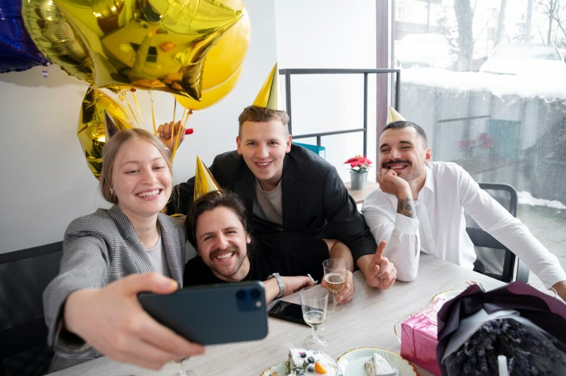
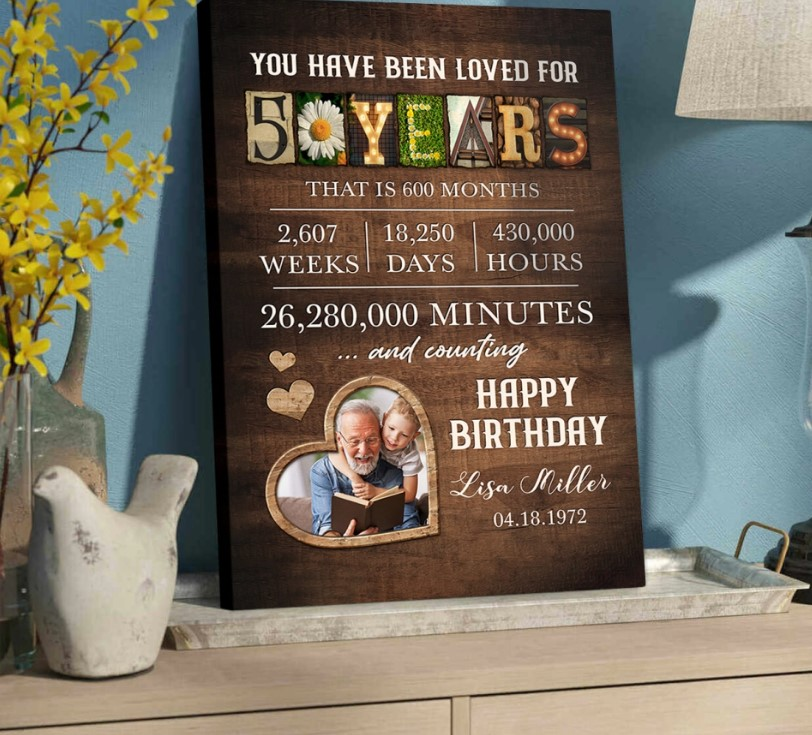
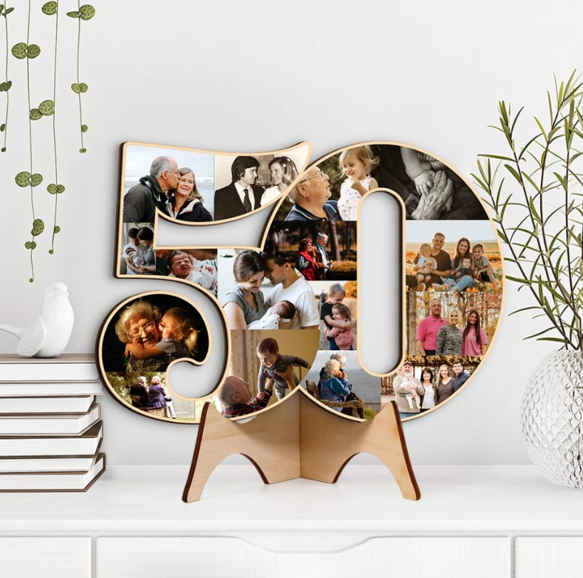
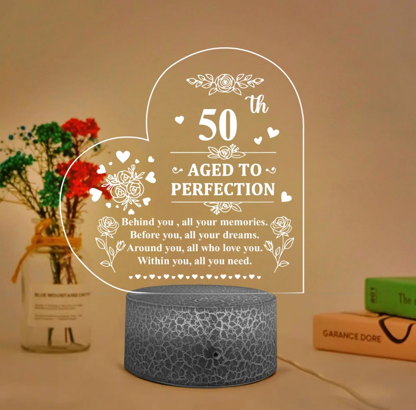
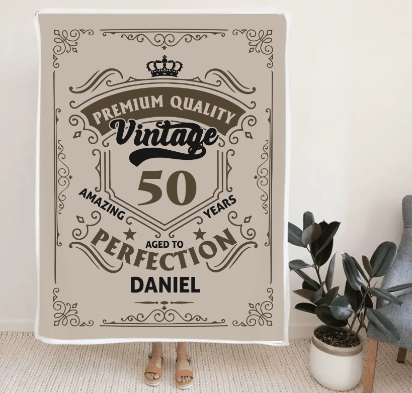
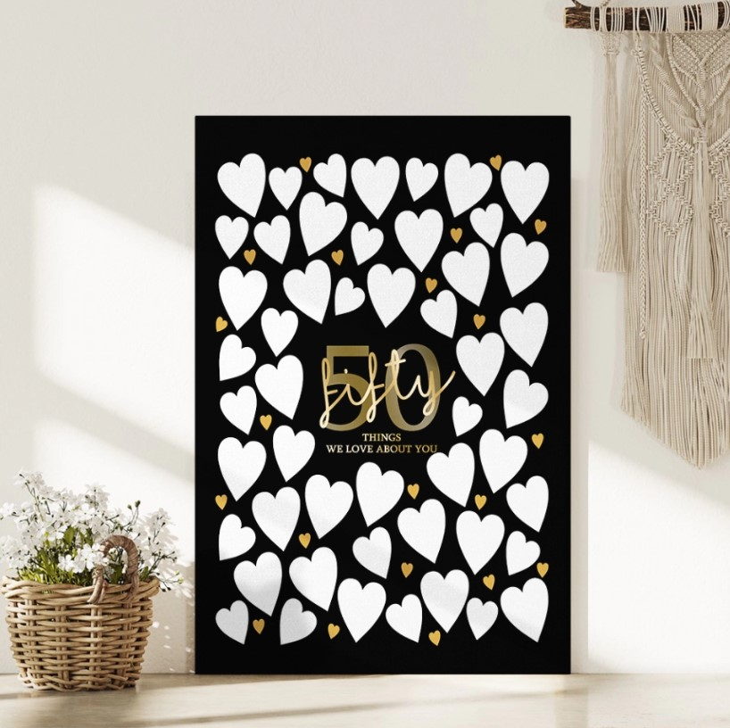

This article has been written and researched by our expert Loveable through a precise methodology. [Learn more about our methodology](https://avada.io/loveable/our-methodological.html)

[Loveable](https://avada.io/loveable/) > [Blog](https://avada.io/loveable/blog/) > [Family](https://avada.io/loveable/family/)

# 100+ Heartfelt 50th Birthday Wishes to Celebrate a Half-Century of Life

Written by [Rose Bryne](https://avada.io/loveable/author/rose/) Last Updated on September 25, 2023

- [100+ Best Happy 50th Birthday Wishes](https://avada.io/loveable/blog/50th-birthday-wishes/#wp-block-heading-2-3)
    - [Heartwarming 50th Birthday Wishes for Your Dad](https://avada.io/loveable/blog/50th-birthday-wishes/#wp-block-heading-3-4)
    - [Sweet 50th Birthday Wishes for Your Mom](https://avada.io/loveable/blog/50th-birthday-wishes/#wp-block-heading-3-37)
    - [Heartfelt 50th Birthday Wishes for Your Friend](https://avada.io/loveable/blog/50th-birthday-wishes/#wp-block-heading-3-70)
    - [Best 50th Birthday Wishes for Your Coworker](https://avada.io/loveable/blog/50th-birthday-wishes/#wp-block-heading-3-103)
    - [Funny Happy 50th Birthday Messages](https://avada.io/loveable/blog/50th-birthday-wishes/#wp-block-heading-3-126)
- [Fabulous 50th Birthday Gifts for Your Beloved Ones](https://avada.io/loveable/blog/50th-birthday-wishes/#wp-block-heading-2-139)
    - [1\. You Have Been Loved For 50 Years – Personalized Canvas Poster](https://avada.io/loveable/blog/50th-birthday-wishes/#wp-block-heading-3-140)
    - [2\. Golden Milestone- Custom Photo Collage Wooden Sign](https://avada.io/loveable/blog/50th-birthday-wishes/#wp-block-heading-3-143)
    - [3\. Personalized 3D Led Light](https://avada.io/loveable/blog/50th-birthday-wishes/#wp-block-heading-3-146)
    - [4\. Premium Quality Vintage Personalized Blanket](https://avada.io/loveable/blog/50th-birthday-wishes/#wp-block-heading-3-149)
    - [5\. 50 Things We Love About You Canvas Poster](https://avada.io/loveable/blog/50th-birthday-wishes/#wp-block-heading-3-152)
- [Wrap up](https://avada.io/loveable/blog/50th-birthday-wishes/#wp-block-heading-2-158)
    -   

The age of 50 is a great achievement worthy of celebration, contemplation, and genuine gratitude. We have the chance to commemorate the remarkable individual who has elegantly navigated through decades of experiences, difficulties, and successes as we stand at the crossroads of life’s path. Over 100 emotional **50th birthday wishes** are presented in this collection, meticulously intended to reflect the depth of appreciation, love, and respect reserved for individuals who have welcomed the passage of time with grace and wisdom. 

These wishes are an homage to the individual who is on the verge of a new chapter, a monument to the lasting traits that have made an unmistakable impression on the lives they’ve touched. Join us in celebrating this milestone and sending our best wishes for the road ahead.

## **100+ Best Happy 50th Birthday Wishes**

### **Heartwarming 50th Birthday Wishes for Your Dad**

A lovely approach to honor this significant turning point in your dad’s life is by sending him heartfelt 50th birthday greetings. Heartfelt words that capture the connection you have are the best way to express your love and gratitude. Tell him how much he means to you and how his knowledge and direction have improved your life over the years. These kind words will add to the fond memories of his 50th birthday.

1. Dad, as you step into your 50s, my heart swells with gratitude for the moments you’ve gifted me. Your unwavering love has been my anchor, and on this milestone birthday, I wish you a world of happiness and fulfilment.

2. On this 50th birthday, I find myself reflecting on the countless lessons you’ve taught me. Your kindness, patience, and strength have shaped my character. May this year bring you the same unwavering support you’ve given me all my life.

3. Dearest Dad, your journey to 50 is a testament to the incredible person you are. The memories we’ve shared, the laughter we’ve echoed, and the tears we’ve wiped together have woven a tapestry of love that will forever adorn our lives.

4. As you turn 50, Dad, I see the legacy of love you’ve built. Your warmth, your smile, and your comforting presence have been my safe haven. May this birthday be a celebration of the beautiful heart you possess.

5. Fifty years of your guidance have moulded me into the person I am today. Your sacrifices and dedication haven’t gone unnoticed. May your 50th birthday be a chance for us to express our love and gratitude for all that you’ve done.

6. Dad, your 50th birthday marks a milestone not just in years but in the depth of the love you’ve showered upon us. With every challenge you’ve conquered and every hurdle you’ve overcome, you’ve shown us the true essence of resilience.

7. Happy 50th Birthday, Dad! Your wisdom is a beacon that has lit up the darkest corners of my life. Your love has been a constant source of strength, and I hope this day brings you the same radiant joy you’ve brought to me.

8. Dad, as you reach the halfway mark, remember that age is just a number – your spirit remains forever youthful in my heart. Your 50th birthday is an opportunity for us to celebrate the incredible person you are and the profound impact you’ve had on us.

9. I want you to know that as you approach your golden birthday at the age of 50, my love for you only deepens. Our family is knit together by your generosity, your humour, and your knowledge.

10. Happy 50th, Dad! Your journey through life has been an inspiration to us all. As you embrace this new chapter, may it be filled with the same joy and love you’ve shared with us.

11. Dad, your 50th birthday is a moment to honour the milestones you’ve reached, the dreams you’ve fulfilled, and the love you’ve generously given. May this year bring you an abundance of happiness and cherished moments.

12. Dad, I think of all the times you’ve held my hand through life’s ups and downs as you celebrate your 50th birthday. Your love has been my haven and your strength has been my rock. I admire you, dearest member of our family.

13. Dad, at 50, your journey is a story of resilience, growth, and boundless love. Your warmth has melted away my troubles, and your guidance has led me through life’s labyrinth. May your birthday be as heartwarming as the memories you’ve created.

14. Happy 50th, Dad! Your laughter has been the soundtrack of my childhood, and your wisdom continues to guide me. Here’s to celebrating the man who has not only raised me but also nurtured my soul.
15. As you enter your 50s, Dad, I want you to know that the love and respect I hold for you have deepened with each passing year. Your wisdom and care have left an indelible mark on my heart.

16. Dad, you’ve not only reached the milestone of 50 but also carved a path of love and compassion for us to follow. May this birthday bring you the same happiness and fulfillment you’ve bestowed upon us?

17. Wishing you a 50th birthday filled with the warmth of family, the embrace of friends, and the happiness that your presence brings to all of us. Your life’s journey is an inspiration, Dad.

18. Happy 50th, Dad! Your devotion and love have been the cornerstones of our family. May your birthday be a reminder of the countless lives you’ve touched and the joy you’ve spread.

19. On this special day, Dad, I celebrate not just your 50 years but the love, laughter, and life lessons you’ve shared with me. Your birthday is a reflection of the beautiful person you are.

20. Dad, your 50th birthday is a celebration not just of the years you’ve lived but of the love that has enriched our lives. May this year be filled with joy, adventure, and all the things that make your heart smile.

21. Happy 50th Birthday, Dad! May this half-century mark bring you endless joy, health, and fulfillment.

22. To the man who has shaped my world with love and wisdom, happy golden 50th, Dad!

23. Cheers to 50 incredible years, Dad! Your strength and guidance have been a beacon of light in our lives.

24. Wishing you a 50th birthday filled with laughter, love, and all the happiness you’ve brought into our lives.

25. Here’s to 50 years of making memories, Dad. May this birthday be the start of even more wonderful adventures.

26. Happy 5-0, Dad! Your love and support have made our family truly special.

27. May your 50s be a chapter filled with good health, cherished moments, and boundless success, Dad.

28. Celebrating 50 years of being an amazing father and an even more incredible friend. Happy birthday!

29. Happy 50th Birthday to the man who taught us that age is just a number and that life is meant to be lived to the fullest.  
    
30. Dad, you’ve turned 50 with grace and style. May your journey ahead be as remarkable as the path you’ve already tread.

### **Sweet 50th Birthday Wishes for Your Mom**

Your mother’s 50th birthday occasion calls for heartfelt greetings that express your thanks and love. Let her know how much her love, courage, and knowledge have influenced your life. With your kind words and gratitude for all she’s done for you, these sincere wishes will make her day even more memorable as she reaches this golden stage of life.

1. Mom, Happy 50th birthday! Your fifty-year path has been one of love, and your brilliance only grows. I hope this new chapter is as lovely as yours.

2. To the graceful and elegant woman turning 50, may your special day reflect the joy you’ve brought into our lives. “Happy birthday, Mom!

3. Wishing the woman who has always been a pillar of support and love a wonderful 50th birthday. May this year be woven with joy and cherished memories.

4. Mom, here’s to 50 years of joy, love, and life! Our family is whole because of your warmth and care. Let’s rejoice over you now and always.

5. Mom, happy golden birthday! May you always be an example to us for your compassion and knowledge. I’m sending you my love and my best wishes from the entire planet.

6. To a mom who is 50 and amazing, I wish you a birthday full of all the things that bring you joy. A day that is as great as you are is due to you.

7. Happy Birthday to the woman who is a year older, a year wiser, and a year more beautiful. Without a doubt, your fifties will be just as great as the years before.

8. Happy 50th birthday to the person who has always been the centre of our family, I say. I hope your day is as wonderful as the love you have shown us.

9. Mom, you’ve come to a stage in life where your knowledge and spirit genuinely shine. May your fifties be filled with unforgettable experiences, treasured memories, and unending delight.

10. Happy 50th Birthday to the mother who has shown us how to live life to the fullest! I hope your future is filled with love, joy, and all you could ever want.

11. Celebrating a mother who has made every day special for 50 amazing years. Here’s to a day full of joy and the love you’ve grown to cherish.

12. Mom, you turned 50 with a spirit full of elegance and a heart filled with love. May the joy of your birthday match the love you’ve shown us throughout the years.

13. Happy 50th birthday to the woman who has demonstrated that a person’s age is only a number. Your energy is still vibrant and motivating. Here’s to a day that’s as fantastic as you!”

14. To a mom who has gracefully turned 50: may your birthday reflect the extraordinary lady you are. I’m wishing you a joyful day.

15. Happy 50th birthday, Mom! Best wishes for the future! Your courage and kindness have moulded us into the people we are today. I hope your day is as lovely as your heart.

16. Mom, for 50 years, you have been a constant source of love in our life. I hope you have a happy birthday that honors the love and joy you have brought into the world.

17. The woman who has made our lives full of joy, love, and the most priceless memories deserves a happy birthday. I hope your day is just as fantastic as you are.

18. Wishing the mum who has made every moment special a wonderful 50th birthday. May you have the joy you deserve throughout this significant year.

19. May your birthday serve as a reminder of the innumerable lives you’ve touched and the love you’ve offered, Mom who has welcomed 50 with open arms.

20. Mom, even at 50, your elegance and beauty are more radiant than ever. May the love you’ve sowed throughout your life come back to you on your birthday.
21. Happy 50th birthday to the person who has made aging attractive. May you experience love, pleasure, and laughter today because of what you’ve done for us.

22. Wishing a mother who is a constant source of inspiration a beautiful 50th birthday. May the fabric of this year be one of love and dreams realized.

23. Mom, you’ve crossed the fifty-year threshold with a heart full of love and an ever-bright grin. I wish you a birthday that is as exceptional as you are.

24. Happy 50th birthday, mum, who has matured like great wine! I wish you a day filled with as much joy and love as you have given to us.

25. Mom, you have blessed everyone you have ever met with your 50 years of life. May the enchantment of your birthday match the love and joy you’ve experienced.

26. Celebrating a mother who is 50 years old and amazing. May your birthday serve as a reminder of the happiness and love you have shared with everyone.

27. Wishing the mother who has always been the center of our family a happy 50th birthday. May your day be as joyful and kind as you have made ours.

28. Mom, as you approach your fifties, may each day be joyful, each moment be cherished, and each wish come true. I’m glad you’re here.

29. Happy 50th Birthday to the mother whose love has been the source of our life’s direction. May you have a day that is as lovely and bright as the love you have shown us.  
    
30. Feel free to choose the ones that resonate the most with you, or personalize them to make them even more special for your mom’s milestone birthday

### **Heartfelt 50th Birthday Wishes for Your Friend**

It’s like weaving a lovely tapestry of memories and aspirations when you send your friend meaningful birthday greetings on their 50th birthday. Let your remarks be the colors that vividly depict your ongoing friendship as they begin this golden chapter of life. Tell each other tales of your shared experiences, inside jokes, and the laughter that has characterized your years of companionship.

1. Cheers to 50 years, my dear friend! Your fortitude, knowledge, and unwavering spirit have been demonstrated over the course of half a century. May this significant year be joyful and full of new experiences.

2. To my wonderful friend on your 50th birthday: Your companionship has broadened my world, and you have embraced life with elegance and fun. Let’s rejoice in the beautiful person you are.

3. I’m wishing you, my dear friend, a wonderful 50th birthday. Your companionship has brought warmth and sunshine into my existence. May this new chapter bring you unimaginable joy.

4. Happy birthday to the friend who has demonstrated that a person’s age is only a number. Your spirit is an inspiration, and your heart is yet young. May you enjoy a great 50th year.

5. Cheers to 50 amazing years of friendship and life! Numerous lives, including mine, have been impacted by your generosity and compassion. Let’s rejoice for you, my dear friend.

6. I’m proud of the incredible person you’ve grown into on your 50th birthday. There have been many memories made along the way, and there will be much more in the future. I wish you a happy birthday, my friend.

7. To a friend who is gracefully turning 50: May your birthday reflect the lovely spirit that you are. I send you my best wishes for joy, health, and unending laughter.

8. I’d want to wish you a very happy 50th birthday, dear friend! I cherish our time spent together and consider our friendship to be a priceless asset. May you have a wonderful day.

9. Happy 50th birthday to the friend who has experienced joy, sorrow, and priceless memories with me. Your friendship is a blessing, and I look forward to our future experiences.

10. To my friend who will always be youthful, reaching 50 is merely another milestone in your active life. May this birthday herald the beginning of a joyous new chapter.

11. Happy 50th birthday, my dear friend. Best wishes. My life has been made more colourful by our friendship, and I hope this year gives you all the happiness you deserve.

12. Know that your friendship has always been a steady source of comfort and joy in my life as you celebrate your 50th birthday. I hope your birthday is as amazing as you are.

13. Happy birthday to the friend turning 50 with a heart full of hopes and a spirit that never ages. I hope you have a wonderful day and that our relationship continues to grow.

14. My dear mate, I wish you a happy 50th birthday! I look forward to sharing many more life milestones with you because of how important your friendship has been to me.

15. To a friend turning 50: May you realize on this day that you’re even more magnificent than you were before. Let’s celebrate the wonderful adventure you’ve been on.

16. Happy Birthday to my friend whose presence has made every day better for the past 50 years. You’ve brought so much joy and love into my life; may it all be yours today.

17. At your 50th birthday, I honour not just the years that you have lived but also the extraordinary person that you are. You’ve been a benefit to me in friendship, and I appreciate you.

18. Happy birthday to my 50-year-old pal! Your relationship has endured the test of time, and I can’t wait to keep having fun and making memories with you.

19. Wishing my dear friend, who has provided joy to every nook and cranny of my life, a fantastic 50th birthday. May this year be filled with both special occasions and fresh beginnings.

20. Happy 50th birthday to the friend who has made ageing a joyful and humorous experience. May you experience the same joy that you have given us today.

21. To my 50-year-old friend: Your friendship has been a continuing source of motivation for me. May your birthday be as brilliant and lovely as our friendship.

22. Warmest greetings on your 50th birthday, dear friend.” Your companionship has brought me comfort and joy, and I’m looking forward to the next chapter.

23. Happy Birthday to a friend who has demonstrated that age is just a number.” Your spirit is still young, and your heart is as alive as ever. A toast to you!

24. Have a happy 50th birthday, my friend!” Your companionship has enhanced my life in innumerable ways, and I cherish the moments we’ve shared.

25. Happy Birthday to my friend, who turned 50 with dignity and a heart full of love! I hope your day is as extraordinary as you are.

26. On your 50th birthday, I cherish the innumerable laughs, experiences, and moments we’ve had together as friends. May the joy you’ve brought into my life be reflected in this birthday.

27. Happy 50th birthday to the friend who has added joy and significance to my life. Let’s celebrate your friendship and all the years that have made it stronger.

28. May the 50th birthday of your friend, who has a heart full of aspirations and a soul full of enthusiasm, usher in a great new chapter.

29. Happy 50th birthday to my friend who has always been a source of encouragement and company. I hope your day is as amazing as our relationship.

30. Happy birthday to my friend who at 50, still exudes warmth and cheerfulness. I hope this significant year brings you all the joy you deserve.

### **Best 50th Birthday Wishes for Your Coworker**

A considerate approach to honor your coworker’s milestone and show appreciation for the camaraderie you enjoy at work is to send them the best 50th birthday greetings. Send your heartfelt greetings and gratitude for all of their hard work and cooperation over the years.

1. Happy 50th birthday!” May you have even more success, joy, and special moments in both your personal and professional life throughout this significant year.

2. Have a wonderful 50th birthday, my friend! Your commitment and labor of love motivate us all. May this year be chock-full of noteworthy accomplishments and intriguing possibilities.

3. To a coworker who is celebrating her 50th birthday with elegance and grace, let’s honor the knowledge and expertise you contribute to our group. I’m glad you’re here.

4. Warmest congratulations on turning 50! Our workplace is a better place because of your leadership and optimism. I hope this year is as amazing as you are.

5. Happy 50th birthday to a coworker who has demonstrated that age is only a number. Your excitement and energy are contagious. “Here’s to many more successful years!”

6. Have a fantastic 50th birthday!” Your focus and attention to your job are very admirable. “May this year be filled with accomplishments and honors.

7. To a coworker who has turned 50, may your birthday serve as a reminder of the incredible journey you’ve embarked on.” Your dedication is an encouragement to us all.

8. “Congratulations on your birthday!” Turning 50 validates your knowledge and experience. May this landmark year provide you with even more possibilities to shine in our workplace.

9. Dear coworker, I wish you a happy 50th birthday! Your upbeat approach and collaborative spirit have made our efforts more pleasurable. “May your year be filled with collaborative success.

10. To a coworker who has reached a significant milestone, may your fifties be a time of continued growth, achievement, and professional fulfillment. Congratulations on your birthday!

11. Happy 50th birthday! Your hard work and efforts have made you an indispensable component of our team. May this year be filled with fresh accomplishments and breakthroughs.

12. Have a wonderful 50th birthday!” Your dedication and perseverance have made an indelible mark on all of us. May this year bring you well-deserved recognition.

13. May your birthday reflect the amazing trip you’ve undergone, to a coworker who has reached the milestone age of 50. Your commitment to excellence is admirable.

14. Happy 50th birthday, my dear! We are very grateful for your commitment and expertise. I hope this year brings you success and improvement.

15. Congratulations on turning 50 to a coworker who has mastered the art of striking a balance between work and life. May you have harmony and continuing prosperity in this significant year.

16. To a coworker who has crossed the halfway point: May your 50s bring you new successes and well-deserved acclaim. Enjoy your birthday!

17. Cheers to 50 years! Everyone who knows you can see how passionate you are about your work. May this year offer you exciting new opportunities in which you may thrive and successes that you can be proud of.

18. Happy 50th birthday, my cherished coworker! Our workplace has flourished thanks to your knowledge and collaboration. May you have even more occasions to grin this year.

19. Happy birthday to a knowledgeable and experienced employee who is turning 50. May this year be one of personal and professional fulfillment.

20. Wishing a wise and hardworking employee a wonderful 50th birthday! Your advice has been quite helpful, and I look forward to what is ahead.

### **Funny Happy 50th Birthday Messages**

A lovely method to commemorate this milestone while maintaining a joyful and jovial mood is to add comedy to your 50th birthday greetings. Make light of aging, the experience that comes with experience, or even the birthday person by sharing a funny tale. These amusing remarks will make them grin and demonstrate that age is just a number when it comes to taking pleasure in life and humor.

1. Age is said to be a condition of mind. In your situation, you’re thinking, ‘What did I come into this room for?’ Happy Birthday!

2. Don’t be concerned about becoming 50. You’re not over the hill; you’re just about to reach the peak of excellence!

3. Happy 50th birthday!” You are now fully qualified to provide unsolicited advise and relate anecdotes that begin, Back in my day…

4. Congratulations on your 50th birthday!” You may now take advantage of senior discounts, early bird promotions, and discussions that begin with ‘Do you remember when?

5. Turning 50 is similar to upgrading to the most recent version of yourself.” You have a few extra ‘features,’ but you’re still the same fantastic person.

6. Congratulations on your 50th birthday!” Remember, you’re marinating, not aging.

7. Congratulations on reaching the halfway point! Now is the time to start griping about “these young kids these days.

8. At 50, you’ve upgraded to life’s premium package. You get more wrinkles, more gray hair, and more excuses for misplacing your spectacles. “Happy birthday!

9. Panic not, 50 is only 32 degrees Celsius. Therefore, technically, you’re still in your thirties.

10. Cheers to 50 years!” Keep in mind that, like a superb wine or a vintage automobile, you are simply becoming more valuable as you age.

## **Fabulous 50th Birthday Gifts for Your Beloved Ones**

### **1\. [You Have Been Loved For 50 Years – Personalized Canvas Poster](https://loveable.us/products/you-have-been-loved-for-50-years-personalized-canvas-poster-best-gift-for-mom-dad-grandparents-on-birthdays-212ihpbnca668?variant=44190822531304)**

With this exquisitely created canvas poster, celebrate the amazing journey of love and unity. This unique artwork commemorates 50 years of special memories and portrays the essence of a strong relationship. A timeless homage to fifty years of love, laughter, and shared adventures, this canvas is embellished with your best memories, names, and significant dates.

### **2\. [Golden Milestone- Custom Photo Collage Wooden Sign](https://loveable.us/products/50-years-old-50-years-anniversary-custom-photo-collage-wooden-sign-best-gift-for-50-years-birthday-anniversary-for-parents-dad-mom-grandparents-303ihplnrw360?variant=44384626475240)**

Our personalized picture collage wooden sign is a genuinely one-of-a-kind way to commemorate a golden anniversary. This exquisite work of art, which features a carefully chosen mix of treasured pictures and recollections from the years, combines nostalgia with craftsmanship. Celebrate any important event with a dash of individual elegance, such as a 50th birthday or anniversary. 

### **3\. [Personalized 3D Led Light](https://loveable.us/products/aged-to-perfection-behind-you-all-your-memories-personalized-3d-led-light-best-birthdays-gift-for-family-member-for-himher-on-birthday-anniversary-301icnvsll093?variant=44269874086120)**

Our customized 3D LED light will shine a light on the road of your most treasured memories. This one-of-a-kind sculpture, which celebrates the process of aging like great wine, has a captivating 3D aspect that artfully displays the statement “Aged To Perfection Behind You All Your Memories.” By personalizing the light with a name, date, or meaningful message, you may give it more personality.

### **4\. [Premium Quality Vintage Personalized Blanket](https://loveable.us/products/premium-quality-vintage-amazing-years-aged-to-perfection-personalized-blanket-best-gift-for-himher-for-husbandwife-for-parents-on-birthday-best-birthday-gift-anniversary-302ihpnpwp243?variant=44325819220200)**

With this customized blanket, you or a loved one may smother themselves in the comfort of priceless memories. This vintage-inspired blanket was created using high-quality fabrics to honor the fantastic years lived and the refinement that comes with maturity. Create a genuinely unique keepsake by adding a name, a personal message, or a date. 

### **5\. [50 Things We Love About You Canvas Poster](https://loveable.us/products/50-60-things-we-love-about-you-personalized-canvas-poster-wall-art-home-decor-best-gift-for-family-mom-dad-parents-graantparents-wife-husband-lovers-302ihplnca236?variant=44325324030184)**

With this personalized canvas poster, you can create a touching memorial that captures the soul of a loved one. This wall art work becomes a personal and sincere present when you have the ability to express 50 distinct reasons why you love someone. It’s a lovely complement to any decor, handcrafted with care and printed on high-quality canvas. 

_**Check Out:**_

- Best [50th Birthday Gift Ideas For Men](https://avada.io/loveable/50th-birthday-gift-ideas-men/)

- Best [50th Birthday Gifts Ideas For Women](https://avada.io/loveable/50th-birthday-gifts-for-women/)

## **Wrap up**

As we draw the curtain on this collection of heartfelt **50th birthday wishes**, let these words stand as a tapestry woven with the threads of love, respect, and the joy of celebrating a half-century of existence. As you stand at the intersection of memories and dreams, may these wishes be the gentle breeze that carries you into the next chapter of your life’s story.

Like a well-aged wine, you’ve evolved into something truly exquisite over the years. As the curtain rises on this new act, may the spotlight shine on your continued journey of growth, adventure, and the fulfillment of aspirations yet to be realized.

Cheers to 50 amazing years, and to the countless adventures that still await. Happy 50th birthday!

- [100+ Best Happy 50th Birthday Wishes](https://avada.io/loveable/blog/50th-birthday-wishes/#wp-block-heading-2-3)
    - [Heartwarming 50th Birthday Wishes for Your Dad](https://avada.io/loveable/blog/50th-birthday-wishes/#wp-block-heading-3-4)
    - [Sweet 50th Birthday Wishes for Your Mom](https://avada.io/loveable/blog/50th-birthday-wishes/#wp-block-heading-3-37)
    - [Heartfelt 50th Birthday Wishes for Your Friend](https://avada.io/loveable/blog/50th-birthday-wishes/#wp-block-heading-3-70)
    - [Best 50th Birthday Wishes for Your Coworker](https://avada.io/loveable/blog/50th-birthday-wishes/#wp-block-heading-3-103)
    - [Funny Happy 50th Birthday Messages](https://avada.io/loveable/blog/50th-birthday-wishes/#wp-block-heading-3-126)
- [Fabulous 50th Birthday Gifts for Your Beloved Ones](https://avada.io/loveable/blog/50th-birthday-wishes/#wp-block-heading-2-139)
    - [1\. You Have Been Loved For 50 Years – Personalized Canvas Poster](https://avada.io/loveable/blog/50th-birthday-wishes/#wp-block-heading-3-140)
    - [2\. Golden Milestone- Custom Photo Collage Wooden Sign](https://avada.io/loveable/blog/50th-birthday-wishes/#wp-block-heading-3-143)
    - [3\. Personalized 3D Led Light](https://avada.io/loveable/blog/50th-birthday-wishes/#wp-block-heading-3-146)
    - [4\. Premium Quality Vintage Personalized Blanket](https://avada.io/loveable/blog/50th-birthday-wishes/#wp-block-heading-3-149)
    - [5\. 50 Things We Love About You Canvas Poster](https://avada.io/loveable/blog/50th-birthday-wishes/#wp-block-heading-3-152)
- [Wrap up](https://avada.io/loveable/blog/50th-birthday-wishes/#wp-block-heading-2-158)
    -  

### [Rose Bryne](https://avada.io/loveable/author/rose/)

Hi, I'm Rose! I love animals and spending time with kids. At Loveable, I help people find unique gifts for special occasions like Valentine's Day, housewarmings, and graduations. I enjoy finding gifts for kids, teens, and animal lovers that match their interests and personalities. Making gift-giving a pleasant experience is my priority. Let me assist you in finding the perfect gift!

- [Twitter](https://twitter.com/intent/tweet)
- [Facebook](https://www.facebook.com/sharer/sharer.php)
- [instagram](https://avada.io/loveable/blog/50th-birthday-wishes/)
- [pinterest](https://www.pinterest.com/loveablellc/)

## Related Posts

[### 30 Best 4 Year Old Birthday Party Ideas For A Memorable Celebration](https://avada.io/loveable/blog/4-year-old-birthday-party-ideas/) 

[

### 16th Birthday Party Ideas to Make an Unforgettable Day

](https://avada.io/loveable/blog/16th-birthday-party-ideas/)

[

### 150+ Inspirational Birthday Quotes to Spread Joy on Special Day

](https://avada.io/loveable/blog/inspirational-birthday-quotes/)

[

### 160+ Birthday Wishes for Wife to Express Eternal Love

](https://avada.io/loveable/blog/birthday-wishes-for-wife/)

[### 90+ Heart Touching Birthday Wishes for Niece to Make Her Day Extra Special](https://avada.io/loveable/blog/birthday-wishes-for-niece/)
