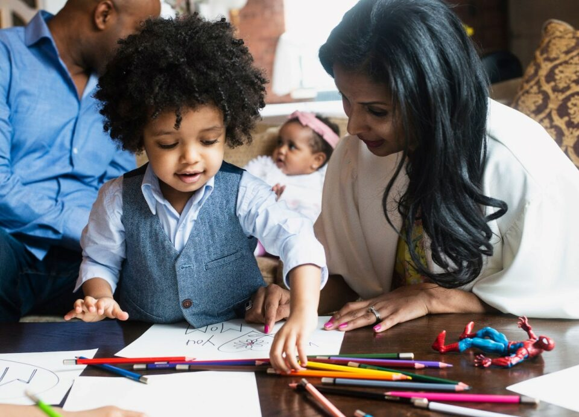
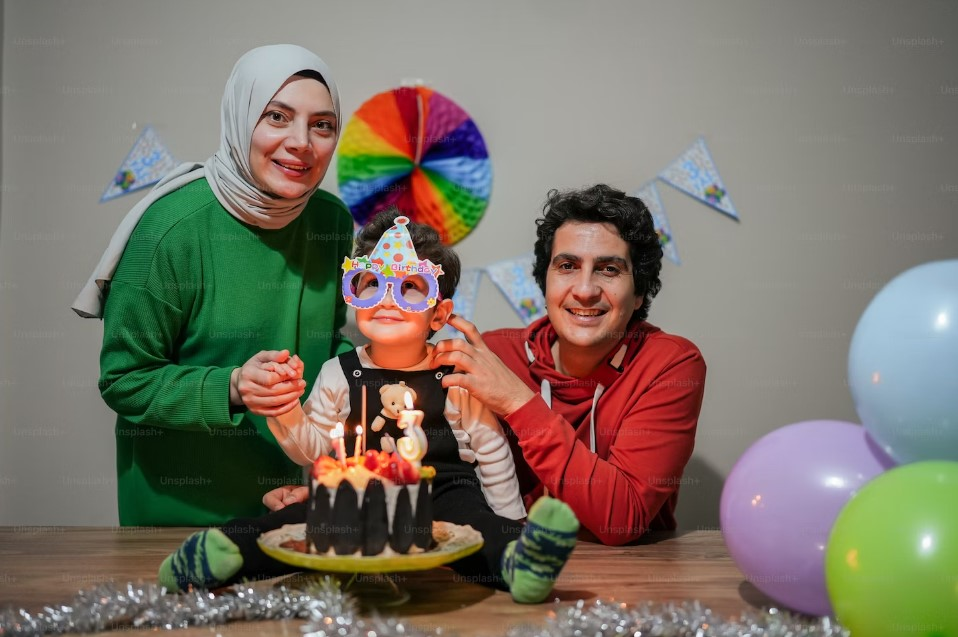

This article has been written and researched by our expert Loveable through a precise methodology. [Learn more about our methodology](https://avada.io/loveable/our-methodological.html)

[Loveable](https://avada.io/loveable/) > [Blog](https://avada.io/loveable/blog/) > [Family](https://avada.io/loveable/family/)

# 100 Heartfelt Birthday Wishes for Son to Express Love

Written by [Rose Bryne](https://avada.io/loveable/author/rose/) Last Updated on September 25, 2023

- [Exploring 100 Birthday Quotes for Son to Be Heartfelt](https://avada.io/loveable/blog/birthday-quotes-for-son/#wp-block-heading-2-3)
    - [Birthday Quotes For Son From Mom](https://avada.io/loveable/blog/birthday-quotes-for-son/#wp-block-heading-3-4)
    - [Birthday Quotes For Son From Dad](https://avada.io/loveable/blog/birthday-quotes-for-son/#wp-block-heading-3-30)
    - [Funny Birthday Quotes For Son](https://avada.io/loveable/blog/birthday-quotes-for-son/#wp-block-heading-3-54)
    - [Heart Touching Birthday Wishes For Son](https://avada.io/loveable/blog/birthday-quotes-for-son/#wp-block-heading-3-77)
    - [Birthday Quotes For Son In Law](https://avada.io/loveable/blog/birthday-quotes-for-son/#wp-block-heading-3-100)
- [Bottom Line](https://avada.io/loveable/blog/birthday-quotes-for-son/#wp-block-heading-2-123)

Welcome to a heartwarming collection tailored just for you – 100 Heartfelt **Birthday Quotes for Son** to Express Love. Your son’s special day is a time to celebrate the incredible journey he’s embarked upon, filled with love, growth, and cherished moments. When you come here, you’ll find a treasury of affectionate messages crafted with you in mind. 

If you’re looking for playful words to bring a smile or thoughtful sentiments to convey your pride, this collection of quotes is ideal for you. We’ve gathered an array of quotes that encapsulate your feelings. Therefore, don’t hesitate to join us and explore a spectrum of emotions designed to help you express your deep love for your son on his birthday.

## **Exploring 100 Birthday Quotes for Son to Be Heartfelt**

### **Birthday Quotes For Son From Mom**

As your son’s special day approaches, it’s a time of reflection and celebration – a moment when your cherished son takes center stage. In this list of Birthday quotes for son from mom, we’ve gathered heartfelt expressions of love, pride, and joy, all meant for you.

1. “Happy birthday, my dear son. Your presence in my life brings me endless joy and pride.”

2. “To my amazing son, may your birthday be as wonderful as the love you bring into my world.”

3. “On your special day, I celebrate not only the day you were born but also the beautiful soul you’ve become.”

4. “As you grow another year older, know that my love for you grows even stronger. Happy birthday!”

5. “To the one who made me a mom, your birthday is a reminder of the precious bond we share.”

6. “With each passing year, you shine brighter. Wishing you a birthday as radiant as your spirit, my son.”

7. “Happy birthday, my son. Your laughter, dreams, and kind heart fill my life with meaning.”

8. “May your birthday be filled with adventures, dreams, and the realization of your goals. I believe in you!”

9. “From the moment you were born, you’ve been the light of my life. Have a truly joyful birthday.”

10. “Watching you grow into an incredible person has been my greatest privilege. Have a wonderful birthday, son.”

11. “On your birthday, I reflect on the strong, compassionate, and remarkable man you’re becoming. I’m so proud.”

12. “Sending you all the love, hugs, and birthday wishes a mother can give. Enjoy your special day, my son.”

13. “Happy birthday to the boy who stole my heart and continues to fill it with love and pride.”

14. “Your birthday marks another chapter of your life’s journey. Keep writing it with courage and grace, my son.”

15. “My love for you knows no bounds, and on your birthday, I wish you a life filled with joy and fulfillment.”

16. “To the one who changed my life forever, may your birthday be as unforgettable as you are to me.”

17. “You’re not just a year older today; you’re a year wiser and more incredible. Happy birthday, my son.”

18. “From your first steps to the person you’ve become, every moment with you has been a gift. Happy birthday!”

19. “As you blow out your candles, know that each one represents a wish of happiness and success for you.”

20. “Happy birthday, my precious son. May your day be as extraordinary as the love between us.”

**_See More:_**

- [Mother-Son Relationships](https://avada.io/loveable/blog/mother-son-relationships/)

- Heartfelt [Birthday Wishes for Son from Mom](https://avada.io/loveable/blog/birthday-wishes-son-mom/)

### **Birthday Quotes For Son From Dad**

Do you remember the first time you held him in your arms, and now he has become an incredible guy? Each day in this journey has been a treasure, right? That’s why, on his special day, let’s choose a quote from the list below to reflect your emotion and love for him. 

1. “Happy birthday, my son. Your journey through life makes me immensely proud.”

2. “On your special day, know that my love for you knows no bounds. Enjoy every moment.”

3. “To the one who calls me dad, may your birthday be as incredible as you are.”

4. “Wishing you a year ahead filled with adventure, growth, and happiness. Happy birthday!”

5. “Son, your birthday marks another year of memories and the promise of a bright future.”

6. “As you blow out the candles, remember that you’ll always be my greatest wish come true.”

7. “Happy birthday! Watching you become a remarkable person has been my greatest joy.”

8. “May your day be filled with joy, surrounded by the love and support of those who care for you.”

9. “To my son, you’re a constant reminder of the beauty and purpose in my life. Celebrate well!”

10. “On your special day, my wish for you is a life filled with dreams realized and goals achieved.”

11. “Happy birthday, son. Your strength and determination inspire me every day.”

12. “As you grow, my admiration for you grows as well. Here’s to celebrating the amazing person you are.”

13. “From the lessons you’ve taught me to the memories we’ve shared, you enrich my life. Enjoy your day!”

14. “To my son, my pride and joy, may your birthday be a reflection of the love you bring to our family.”

15. “Your birthday is a reminder of the happiness you’ve brought into our lives. Have an incredible day!”

16. “Son, your laughter and spirit brighten even the darkest days. Here’s to celebrating you!”

17. “Happy birthday, my son. Keep reaching for the stars and believing in yourself.”

18. “May your birthday be as exceptional as the bond we share. Keep shining, my dear son.”

19. “On your special day, remember that you’re loved beyond measure. Happy birthday!”

20. “To my son, you’re the reason for my smiles and the source of my strength. Have a fantastic birthday!”

**_See More:_** [Father-Son Relationship](https://avada.io/loveable/blog/father-son-relationship/)

### **Funny Birthday **Quotes** For Son**

Let’s light up your son’s special day with laughter! With this collection of funny Birthday quotes for your son, you’ll find playful and heartwarming messages that perfectly capture the joy you bring into his life. These humorous quotes add an extra dose of happiness to his celebration.

1. “Happy birthday, son! Remember, you’re not getting older – you’re just increasing in value, like fine wine.”

2. “Age is just a number, and in your case, it’s a really big number. Happy birthday!”

3. “They say age is relative. Well, in our family, it’s a distant relative. Have a fantastic birthday, my not-so-old son!”

4. “Happy birthday! Just think of it as leveling up in the game of life.”

5. “Son, you’ve reached an age where your back goes out more than you do. Enjoy your special day!”

6. “Another year older, wiser, and closer to needing a separate cake for all those candles. Happy birthday!”

7. “Age is like underwear – it creeps up on you when you least expect it. Have a hilarious birthday, my son!”

8. “Happy birthday! They say the older you get, the wiser you become. Let’s see if that’s true or just a rumor.”

9. “A wise man once said, ‘Forget about your past, you can’t change it.’ I’d like to add, ‘Forget about your age, too!'”

10. “Happy birthday, son! You know you’re getting older when you start to appreciate socks as a gift.”

11. “Don’t worry about getting older. You’re still young at heart and that’s what really matters. Have a fun-filled birthday!”

12. “Birthdays are like chocolate – they’re both good for you if enjoyed in moderation. Have a sweet one!”

13. “Happy birthday! They say with age comes wisdom, but in your case, it also comes with a lot of dad jokes.”

14. “Another year older means another year of being a source of endless entertainment. Keep the laughs coming!”

15. “Aging is inevitable, but growing up is optional. Stay young at heart, my forever-young son. Happy birthday!”

16. “Happy birthday! You’re at an age where your back goes out more often than you do, but at least you’re not alone.”

17. “They say you’re as old as you feel. So, how about we feel young and eat cake all day? Happy birthday!”

18. “Getting older is like leveling up in a game – you unlock new challenges and earn more XP. Have a legendary birthday!”

19. “Happy birthday, son! Here’s to embracing your inner child, even if your outer adult needs to pay the bills.”

20. “Age is just a number, but in your case, it’s a number that’s starting to need its own space. Celebrate accordingly!”

### **Heart Touching Birthday Wishes For Son**

Why not celebrate your son’s special day with profound sentiments? These heart-touching birthday quotes for your son are filled with words crafted just for you. Now, let these quotes convey the depth of your emotions and make his birthday unforgettable.

1. “Happy birthday, my dear son. Your presence in my life is a blessing that fills each day with joy.”

2. “On your special day, I’m reminded of the incredible privilege it is to call you my son.”

3. “To my son, your birthday marks another year of treasured memories and endless love.”

4. “May your journey ahead be as remarkable as the journey we’ve shared so far. Happy birthday!”

5. “As you blow out the candles, know that each one represents a wish for your happiness and success.”

6. “You’ve brought so much meaning into my life. On your birthday, I wish you a future filled with dreams fulfilled.”

7. “Happy birthday! Your growth as a person fills me with pride and excitement for what lies ahead.”

8. “To my son, your birthday is a reminder of the beauty you’ve brought into my world.”

9. “With each passing year, your kindness and strength shine brighter. Have a wonderful birthday.”

10. “Wishing you a day as heartwarming as the love and joy you’ve brought into my life. Happy birthday!”

11. “From the day you were born, your presence has been a source of hope and happiness for me.”

12. “On your special day, I celebrate the incredible person you are and the limitless potential within you.”

13. “Happy birthday, my son. Your journey through life is a testament to your resilience and grace.”

14. “May your birthday be a reflection of the love and warmth you bring into the lives of those around you.”

15. “With each birthday, you become more amazing and dear to my heart. Enjoy this special day.”

16. “On your birthday, my heart swells with love and gratitude for having you as my son.”

17. “Wishing you a birthday filled with laughter, dreams and the realization of your aspirations.”

18. “Happy birthday, my son. Your kindness, strength, and character make me incredibly proud.”

19. “To the one who forever changed my life, your birthday brings back memories of your first steps and a lifetime of love.”

20. “On this day, I celebrate not just your birth but the beautiful soul you’ve grown into. Happy birthday, my son.”

### **Birthday **Quotes** For Son In Law**

It is a chance to extend your warmest wishes to your son-in-law on his special day! With some birthday quotes for your son-in-law, you will find a way to connect with him and make a confirmation that you are a wonderful man.

1. “Happy birthday to a son-in-law who’s not just family, but a true friend.”

2. “On your special day, we celebrate the gift of you in our lives. Have a wonderful birthday!”

3. “May your birthday be as wonderful as the happiness you bring into our family.”

4. “Wishing you a day filled with joy, laughter and all the things you love.”

5. “To a son-in-law who’s made a special place in our hearts, have a fantastic birthday!”

6. “Happy birthday! Your presence has added so much warmth and happiness to our family.”

7. “May your day be filled with love, laughter, and the company of those who care about you.”

8. “Here’s to another year of shared memories, cherished moments, and happiness. Happy birthday!”

9. “Your birthday is a reminder of the joy you bring into our family. Celebrate to the fullest!”

10. “Sending warm wishes on your birthday, along with a heartfelt thank you for being part of our lives.”

11. “To a son-in-law who’s truly appreciated, may your birthday be filled with love and happiness.”

12. “Happy birthday to someone who fits perfectly into our family’s puzzle. Enjoy your special day!”

13. “Your birthday is a chance to celebrate the amazing person you are. Wishing you all the best!”

14. “May your birthday be a reflection of the wonderful impact you’ve had on our family.”

15. “Here’s to another year of shared laughter, great conversations, and cherished moments.”

16. “Happy birthday! You’re not just a son-in-law; you’re a valuable member of our family.”

17. “On your special day, may you be surrounded by the love and happiness you bring into our lives.”

18. “Wishing you a birthday filled with all the things that make you smile.”

19. “To a son-in-law who’s like a son to us, may your birthday be as fantastic as you are.”

20. “Happy birthday! Your presence has enriched our family, and we’re grateful to have you.

## **Bottom Line**

Now, you have come to the end of your journey through these 100 Heartfelt **Birthday **Quotes** for Son** to express love. Remember that every word was chosen with your son in mind. His journey, his milestones, and his uniqueness have been celebrated in these messages. 

That’s why, as you celebrate your son’s special day, these quotes may continue to resonate in his heart, reminding him of your deep bond. Beyond that, it must be lovely words to fill his year with joy, growth, and unwavering love. Happy birthday to your loved son!

- [Exploring 100 Birthday Quotes for Son to Be Heartfelt](https://avada.io/loveable/blog/birthday-quotes-for-son/#wp-block-heading-2-3)
    - [Birthday Quotes For Son From Mom](https://avada.io/loveable/blog/birthday-quotes-for-son/#wp-block-heading-3-4)
    - [Birthday Quotes For Son From Dad](https://avada.io/loveable/blog/birthday-quotes-for-son/#wp-block-heading-3-30)
    - [Funny Birthday Quotes For Son](https://avada.io/loveable/blog/birthday-quotes-for-son/#wp-block-heading-3-54)
    - [Heart Touching Birthday Wishes For Son](https://avada.io/loveable/blog/birthday-quotes-for-son/#wp-block-heading-3-77)
    - [Birthday Quotes For Son In Law](https://avada.io/loveable/blog/birthday-quotes-for-son/#wp-block-heading-3-100)
- [Bottom Line](https://avada.io/loveable/blog/birthday-quotes-for-son/#wp-block-heading-2-123)

### [Rose Bryne](https://avada.io/loveable/author/rose/)

Hi, I'm Rose! I love animals and spending time with kids. At Loveable, I help people find unique gifts for special occasions like Valentine's Day, housewarmings, and graduations. I enjoy finding gifts for kids, teens, and animal lovers that match their interests and personalities. Making gift-giving a pleasant experience is my priority. Let me assist you in finding the perfect gift!

- [Twitter](https://twitter.com/intent/tweet)
- [Facebook](https://www.facebook.com/sharer/sharer.php)
- [instagram](https://avada.io/loveable/blog/birthday-quotes-for-son/)
- [pinterest](https://www.pinterest.com/loveablellc/)

## Related Posts

[### 30 Best 4 Year Old Birthday Party Ideas For A Memorable Celebration](https://avada.io/loveable/blog/4-year-old-birthday-party-ideas/) 

[

### 16th Birthday Party Ideas to Make an Unforgettable Day

](https://avada.io/loveable/blog/16th-birthday-party-ideas/)

[

### 150+ Inspirational Birthday Quotes to Spread Joy on Special Day

](https://avada.io/loveable/blog/inspirational-birthday-quotes/)

[

### 160+ Birthday Wishes for Wife to Express Eternal Love

](https://avada.io/loveable/blog/birthday-wishes-for-wife/)

[### 90+ Heart Touching Birthday Wishes for Niece to Make Her Day Extra Special](https://avada.io/loveable/blog/birthday-wishes-for-niece/)
