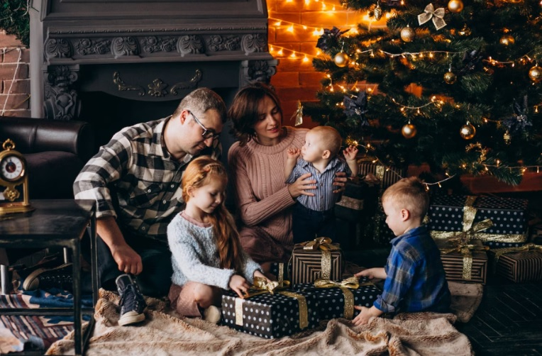
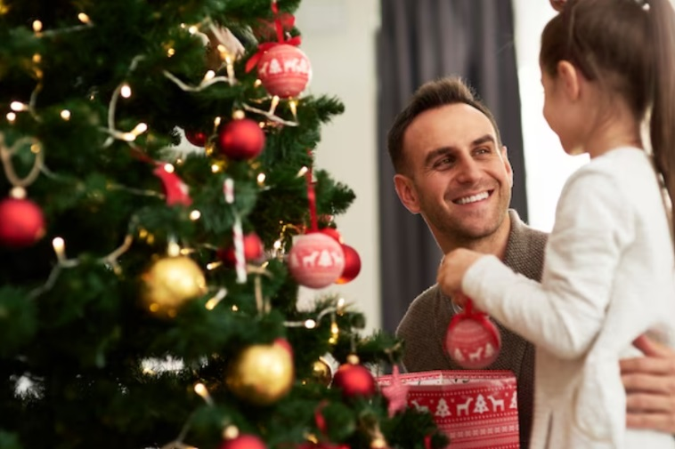
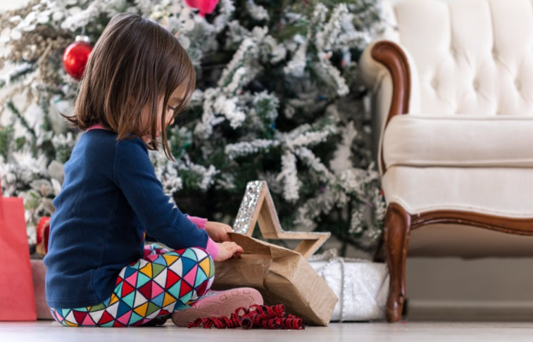
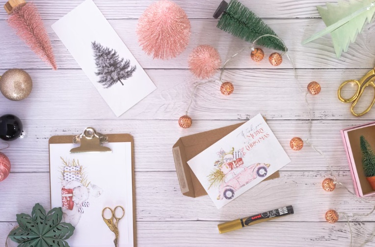

This article has been written and researched by our expert Loveable through a precise methodology. [Learn more about our methodology](https://avada.io/loveable/our-methodological.html)

[Loveable](https://avada.io/loveable/) > [Blog](https://avada.io/loveable/blog/) > [Holiday](https://avada.io/loveable/holiday/)

# 100 Heartfelt Christmas Card Quotes for Your Loved One

Written by [Blake Simpson](https://avada.io/loveable/author/blake/) Last Updated on September 11, 2023

- [100 Sweet Christmas Card Quotes Surely Make Their Hearts Melt](https://avada.io/loveable/blog/christmas-card-quotes/#wp-block-heading-2-3)
    - [Quotes for Family Christmas Cards](https://avada.io/loveable/blog/christmas-card-quotes/#wp-block-heading-3-4)
    - [Christmas Card Quotes for Mom](https://avada.io/loveable/blog/christmas-card-quotes/#wp-block-heading-3-17)
    - [Christmas Card Quotes for Dad](https://avada.io/loveable/blog/christmas-card-quotes/#wp-block-heading-3-32)
    - [Christmas Card Quotes for Kids](https://avada.io/loveable/blog/christmas-card-quotes/#wp-block-heading-3-44)
    - [Friendship Christmas Card Quotes](https://avada.io/loveable/blog/christmas-card-quotes/#wp-block-heading-3-61)
    - [Christmas Quotes for Couples to Write in Cards](https://avada.io/loveable/blog/christmas-card-quotes/#wp-block-heading-3-85)
    - [Short Funny Christmas Quotes for Cards](https://avada.io/loveable/blog/christmas-card-quotes/#wp-block-heading-3-115)
- [Bottom Line](https://avada.io/loveable/blog/christmas-card-quotes/#wp-block-heading-2-128)

The holiday season is upon us, and what better way to spread joy and warmth than by sending heartfelt Christmas cards adorned with meaningful quotes? Whether you’re penning your Christmas cards or seeking inspiration for the perfect sentiment, our exploration of **Christmas card quotes** guides you through a curated collection of eloquent phrases that will melt your loved one’s heart. 

From cherishing family moments to spreading love and gratitude, these quotes add a touch of enchantment to your holiday greetings. Join us as we dive into the world of quotes for Christmas cards, where words become a conduit for sharing the joy and togetherness that make this season truly special.

## **100 Sweet Christmas Card Quotes Surely Make Their Hearts Melt**

### **Quotes for Family Christmas Cards**

Sending family Christmas cards is a cherished tradition that allows us to express our love and appreciation for our closest relatives. The right words can capture the warmth and connection shared among family members. In this compilation of [quotes for family Christmas](https://avada.io/loveable/blog/christmas-family-quotes/) cards, we present sentiments emphasizing the importance of family and togetherness.

1. “Christmas time is cherished family time. Family time is sacred time.”— Russel M. Nelson

2. “From home to home, and heart to heart, from one place to another. The warmth and joy of Christmas brings us closer to each other.”— Emily Matthews

3. “Probably the reason we all go so haywire at Christmas time with the endless unrestrained and often silly buying of gifts is that we don’t quite know how to put our love into words.”— Harlan Miller

4. “The best of all gifts around any Christmas tree: the presence of a happy family all wrapped up in each other.”— Burton Hillis

5. “Christmas Eve, a perfect night to express affection for your family, to forgive those who failed you, and to forget past mistakes.”— Unknown

6. “Christmas is a time when you get homesick – even when you’re home.”— Carol Nelson

7. “The best of all gifts around any Christmas tree: the presence of a happy family all wrapped up in each other”.— Burton Hillis

8. “Christmas Eve, a perfect night to express affection for your family, to forgive those who failed you, and to forget past mistakes.”— Unknown

9. “Christmas… is not an external event at all, but a piece of one’s home that one carries in one’s heart.” – Freya Stark

10. “Christmas is, of course, the time to be home – in heart as well as body.” – Garry Moore

### **Christmas Card Quotes for Mom**

Let’s celebrate the warmth of the holiday season with heartfelt Christmas card quotes for Mom. Express your love and gratitude with words that dance across the page, reminding her of the cherished moments and the boundless joy she brings. From merry memories to wishes wrapped in elegance, these quotes are more than words – they’re a symphony of appreciation for the extraordinary woman who lights up every Christmas with her love.

1. I grew up with the classics. My mom and I would sit and watch ‘Singin’ in the Rain’ and ‘White Christmas’ – those kind of movies. — Lucas Grabeel

2. Mom says you have to believe in Santa if you want presents on Christmas. — C.K. Walker

3.  I love spending time with my family and friends during the holidays, and my favorite holiday tradition would be the pozole that my mom makes almost every Christmas. It’s the best! — Becky G

4. “Money doesn’t make you happy,” Mom insists, whipping carrots and lettuce out of the cart. “Money doesn’t make you laugh when you’re lonely, or make you full of contentment on Christmas morning. — Roxanne St. Claire

5. My mom is a really good cook. I didn’t get the cooking gene, but she cooks this really amazing dinner every Christmas, and that’s always really fun. — Miranda Cosgrove

6. I loved raising my kids. I loved the process, the dirt of it, the tears of it, the frustration of it, Christmas, Easter, birthdays, growth charts, pediatrician appointments. I loved all of it. — Jane Elliot

7. The day I saw my mom eating the Santa cookies on the plate was one of the most horrific days of my life. — Halle Berry

8. Well I looked in my moms closet and saw what I was getting for Christmas, an ultravibe pleasure 2000. — Trey Parker

9. You might be a redneck if you go Christmas shopping for your mom, sister, and girlfriend, and you only need to buy one gift. — Jeff Foxworthy

10. My mom always makes the whole family pile into the car and drive around to look at the Christmas lights. My brother and I never want to do it, but my mom just loves it! — Debby Ryan

11. The familiar warmth from the church saturated his heart. Was this what Mom meant by Christmas joy? — Jennifer Gladen

12. I could stand on my head and flick the bean right there at the dinner table and my mom would be all, “Honey, Christmas is family time, we should be together” and make me finish in front of everyone. — Christopher Moore

### **Christmas Card Quotes for Dad**

Happy holidays to an old git, also known as your great father, and to the original Santa Claus. If he can remain up, thank him for putting up with you and contributing to making Christmas great. Choose from our exclusive collection of Christmas card quotes for dad, and you’ll definitely be the favorite child.

1. Two things happened on Christmas Day. My father texted me to wish me a “Merry Xmas.” Xmas. Couldn’t even type out Christmas. So personal. Love you too, Dad. — J. Lynn

2. From someone whose dad buys him a spade for Christmas, I thought you’d be grateful! — Karl Pilkington

3. Like my dad, I have a Christmas party most years. I like to celebrate and see as many people as possible. — Lauren Graham

4. My dad likes to recite the story of ‘Pablo the Donkey’ before dinner to teach us the real meaning of Christmas. Every year, it’s the same; every year, we cringe! — Mallory Jansen

5. It was, you know, probably 80 degrees out in L.A., and my dad took me outside and there was snow. At the time, I thought, ‘Every kid doesn’t have snow in their backyard on Christmas?’ — Tori Spelling

6. There are three stages of man: he believes in Santa Claus; he does not believe in Santa Claus; he is Santa Claus. — Bob Phillips

7. Growing up, Santa Claus would cover the presents with a white blanket, so when we’d wake up Christmas morning, we had to wait for my dad to do the big reveal of all the presents Santa brought. — Martina Mcbride

8. One Christmas my father kept our tree up till March. He hated to see it go. I loved that. — Mo Rocca

9. “I just bet Dad another thousand that you’ll be back by this Christmas.” – I — Whitney G.

### **Christmas Card Quotes for Kids**

Christmas cards for children are a need since they enhance the richness and delectability of the sweets and cookies, as well as the anticipation of Santa’s coming and, of course, the gifts. Share the joy of Christmas with the kids by sending them heartfelt wishes, and check below to see our collection of Christmas quotes for kids, which will undoubtedly help you with the dilemma of what to put on a Christmas card for children.

1. “Christmas, my child, is love in action. Every time we love, every time we give, it’s Christmas.”— Dale Evans

2. “Remember this December, that love weighs more than gold.”— Josephine Daskam Bacon

3. “One of the things that Christmas reminds us is that Jesus Christ was once a child.” — Hark Herald Sarmiento

4. “Christmas isn’t a season. It’s a feeling.”— Edna Ferber

5. “Christmas is a stocking stuffed with sugary goodness.” — Mo Rocca

6. “This is Christmas. The season of perpetual hope.” — Home Alone

7. “A joy that is shared is a joy made double.” — John Roy

8. “The joy of brightening other lives becomes for us the magic of the holidays.” — W. C. Jones

9. “Christmas is forever, not for just one day. For loving, sharing, giving, are not to put away.” — Norman Wesley Brooks

10. “It’s not how much we give but how much love we put into giving.” — Mother Teresa

11. “Nothing ever seems too bad, too hard, or too sad when you’ve got a Christmas tree in the living room.” — Nora Roberts

12. “If you can’t wrap Christmas presents well, at least make it look like they put up a good fight.”—Unknow

13. “If you believe in the spirit of Christmas, you believe in true magic.” — Toni Sorenson

14. “Teacher says every time a bell rings, an angel gets his wings.” — Zuzu Bailey, It’s a Wonderful Life

### **Friendship Christmas Card Quotes**

Celebrate the joy of cherished bonds as you spread smiles and warmth through thoughtfully crafted messages. These [Christmas friendship quotes](https://avada.io/loveable/blog/christmas-friendship-quotes/) make your cards genuinely memorable and meaningful. What are you waiting for? Share the gift of heartfelt words illuminating the spirit of togetherness and making this festive season even more special.

1. “Friends are relatives you make for yourself.” ― Eustache Deschamps

2. “Life is an awful, ugly place to not have a best friend.” ― Sarah Dessen

3. “Sometimes me think, ‘What is friend?’ Then me say, ‘Friend is someone to share the last cookie with.” ― Cookie Monster

4. “Christmas is the season for kindling the fire of hospitality in the hall, the genial flame of charity in the heart.” — Washington Irving

5. “Christmas is a together-y sort of holiday.” — Winnie the Pooh

6. “Did you ever notice that life seems to follow certain patterns? Like I noticed that every year around this time, I hear Christmas music.” — Tom Sims

7. “I don’t want Christmas season to end, because it’s the only time I can legitimately indulge in on particular addiction: glitter.” — Eloisa James

8. ”The main reason Santa is so jolly because he knows where all the bad girls live.” — George Carlin

9. “There’s something about a Christmas sweater that will always make me laugh.” — Kristen Wiig

10. “Christmas sweaters are only acceptable as a cry for help.” — Andy Borowitz

11. “There are some people who want to throw their arms round you simply because it is Christmas; there are other people who want to strangle you simply because it is Christmas.” — Robert Staughton Lynd

12. “The outdoor Christmas lights, green and red and gold and blue and twinkling, remind me that most people are that way all year round — kind, generous, friendly and with an occasional moment of ecstasy. But Christmas is the only time they dare reveal themselves.” — Harlan Miller

13. “Christmas is doing a little something extra for someone.” — Charles M. Schulz

14. “Christmas can’t be bought from a store. Maybe Christmas means a little bit more.” — Dr. Seuss

15. “When we recall Christmas past, we usually find that the simplest things – not the great occasions – give off the greatest glow of happiness.” — Bob Hope

16. “Christmas to me is as many people as possible happy.” — Tupac Shakur

17. “May your days be merry and bright.” — White Christmas

18. “Oh the weather outside is frightful, But the fire is so delightful, And since we’ve no place to go, Let it snow, let it snow, let it snow.” — “Let it Snow”

19. “Gifts of time and love are surely the basic ingredients of a truly merry Christmas.” — Peg Bracken

20. “Sending Christmas cards is a good way to let your friends and family know that you think they’re worth the price of a stamp.” — Melanie White

21. “A lovely thing about Christmas is that it’s compulsory, like a thunderstorm, and we all go through it together.” — Garrison Keillor

### **Christmas Quotes for Couples to Write in Cards**

Sending a heartfelt message to your significant other in a beautifully crafted Christmas card is a beautiful way to express your love and appreciation. If you like that, why not dive into our fabulous collection of Christmas quotes? And if you’re a little afraid to send a love quote around the holidays, check if you can find any inspiration from the list below!

1. “Probably the reason we all go so haywire at Christmas time with the endless unrestrained and often silly buying of gifts is that we don’t quite know how to put our love into words.” — Harlan Miller

2. “I won’t ask for much this Christmas. I won’t even wish for snow. And I’m just gonna keep on waiting, underneath the mistletoe.”- All I want for Christmas is You — Mariah Carey

3. “Love came down at Christmas, Love all lovely, Love Divine, Love was born at Christmas, Star and Angels gave the sign.”— Christina Rossetti

4. “Love is what is in the room with you at Christmas if you stop opening presents and listen.”— Anon

5. “Blessed is the season which engages the whole world in a conspiracy of love.”— Hamilton Write Mabie

6. “A beautiful sight, we’re happy tonight” —Edward Pola & George Wyle

7. “All I want for Christmas is you” – and maybe some Christmas pudding —Mariah Carey

8. “At Christmas, all roads lead home.” And home is wherever you are —Marjorie Holmes

9. “Blessed is the season which engages the whole world in a conspiracy of love” —Hamilton Wright Mabie

10. “But for now, let me say. Without hope or agenda. Just because it’s Christmas. And at Christmas you tell the truth. To me, you are perfect” —Love Actually

11. “Christmas came early this year. I’m so excited to be spending our first Christmas together.” — Unknown

12. “Christmas comes once a year, but my love for you is constant.” —Unknown

13. “Christmas gives us an opportunity to pause and reflect on the important things around us.” And I know that one of those most important things is you. —David Cameron.

14. “Christmas is like candy; it slowly melts in your mouth sweetening every taste bud, making you wish it could last forever” —Richelle E. Goodrich.

15. “Christmas works like glue; it keeps us all sticking together” —Rosie Thomas.

16. “Christmas is the day that holds all time together.” I’m so glad this Christmas that my past, present and future belongs to you —Alexander Smith.

17. “Christmas may be a day of feasting, or of prayer, but always it will be a day of remembrance – a day in which we think of everything we have ever loved” —Augusta E. Randel.

18. “Christmas waves a magic wand over the world, and behold, everything is softer and more beautiful” —Norman Vincent Peale.

19. Hot chocolate. Warm blankets. Cold Nights. You. What more could a girl want for Christmas?

20. “Hurry down the chimney tonight” —Eartha Kitt.

21. I already have everything I could ever want for Christmas – because I have you.

22. “I feel like I’m gonna kiss you standing beneath that mistletoe” —Otis Redding.

23. I must have been on Santa’s good list – because I got another Christmas with you.

24. “It is Christmas in the heart that puts Christmas in the air.” Thank you for filling my heart with love this Christmas —W.T. Ellis.

25. “It’s not what’s under the tree that matters; it’s who’s gathered around it.” Thank you for another year of being by my side. —Charles Schulz.

26. “I will honor Christmas in my heart and try to keep it all the year.” And with you by my side, that’s easy. —Charles Dickens.

27. “My world is filled with cheer and you this Christmas” —Donny Hathaway.

### **Short Funny Christmas Quotes for Cards**

Tis the season to be jolly, and what better way to spread holiday cheer than with a touch of humor? If you’re looking to add a dash of laughter to your Christmas cards, here are some short and funny quotes to light up the faces of your cherished ones with joyful smiles.

1. “Son of a nutcracker!” — Buddy, Elf

2. “Santa Claus has the right idea. Visit people only once a year.” — Victor Borge

3. “You know you’re getting old when Santa starts looking younger.” — Bart Simpson, The Simpsons: Miracle on Evergreen Terrace

4. “Elves with attitude.” — E.L.F.S. Leader, The Santa Clause

5. “I don’t know what to say, except it’s Christmas, and we’re all in Misery” — Ellen Griswold, The Griswolds

6. “Merry Christmas, you filthy animal.” — Kevin McCallister, Home Alone 2

7. “We elves try to stick to the four main food groups: candy, candy canes, candy corns, and syrup.” — Buddy, Elf

**_See More:_**

- [Short Christmas Card Messages](https://avada.io/loveable/blog/short-christmas-card-messages/)

- Heartwarming DIY [Christmas Card Ideas](https://avada.io/loveable/blog/christmas-card-ideas/)

## **Bottom Line**

In wrapping up, let your Christmas cards become messengers of love, joy, and togetherness. As you pen your heartfelt **Christmas card quotes**, remember that each word carries the power to brighten someone’s day and create lasting memories. Whether near or far, your thoughtful messages will bridge distances and spread warmth, making this holiday season truly magical. So, embrace the art of Christmas card writing and share the gift of connection with those who matter most.

- [100 Sweet Christmas Card Quotes Surely Make Their Hearts Melt](https://avada.io/loveable/blog/christmas-card-quotes/#wp-block-heading-2-3)
    - [Quotes for Family Christmas Cards](https://avada.io/loveable/blog/christmas-card-quotes/#wp-block-heading-3-4)
    - [Christmas Card Quotes for Mom](https://avada.io/loveable/blog/christmas-card-quotes/#wp-block-heading-3-17)
    - [Christmas Card Quotes for Dad](https://avada.io/loveable/blog/christmas-card-quotes/#wp-block-heading-3-32)
    - [Christmas Card Quotes for Kids](https://avada.io/loveable/blog/christmas-card-quotes/#wp-block-heading-3-44)
    - [Friendship Christmas Card Quotes](https://avada.io/loveable/blog/christmas-card-quotes/#wp-block-heading-3-61)
    - [Christmas Quotes for Couples to Write in Cards](https://avada.io/loveable/blog/christmas-card-quotes/#wp-block-heading-3-85)
    - [Short Funny Christmas Quotes for Cards](https://avada.io/loveable/blog/christmas-card-quotes/#wp-block-heading-3-115)
- [Bottom Line](https://avada.io/loveable/blog/christmas-card-quotes/#wp-block-heading-2-128)

### [Blake Simpson](https://avada.io/loveable/author/blake/)

Hi, I'm Blake from Loveable. I help people find perfect gifts for occasions like anniversaries and weddings. I also write a blog about holidays, sharing insights to make them more meaningful. Let's create unforgettable moments together!

- [Twitter](https://twitter.com/intent/tweet)
- [Facebook](https://www.facebook.com/sharer/sharer.php)
- [instagram](https://avada.io/loveable/blog/christmas-card-quotes/)
- [pinterest](https://www.pinterest.com/loveablellc/)

## Related Posts

[### 120+ Christian Birthday Wishes To Spread Your Love](https://avada.io/loveable/blog/christian-birthday-wishes/) 

[

### 35 Best 70th Birthday Ideas To Celebrate The Special Milestone

](https://avada.io/loveable/blog/70th-birthday-ideas/)

[

### 50 Best 30th Birthday Decorations for a Remarkable Birthday Bash

](https://avada.io/loveable/blog/30th-birthday-decorations/)

[

### 40 Delicious Vegan Christmas Desserts to Delight Your Palate

](https://avada.io/loveable/blog/vegan-christmas-desserts/)

[

### 60 Christmas Team Building Activities to Boost Workplace Spirit

](https://avada.io/loveable/blog/christmas-team-building-activities/)
