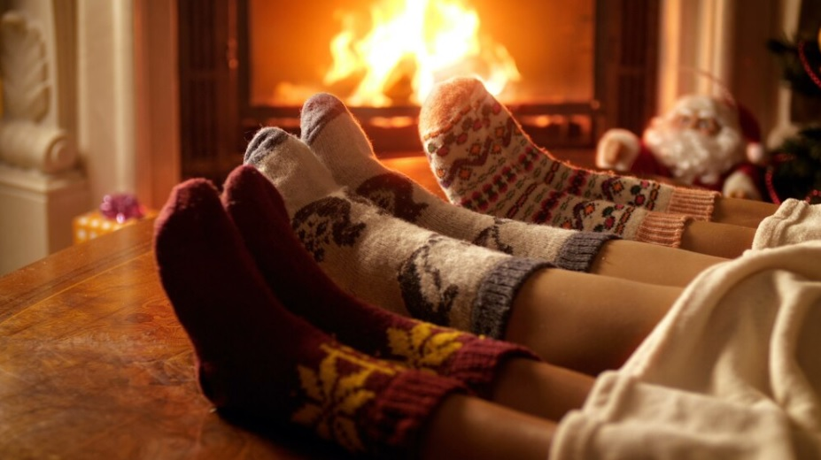
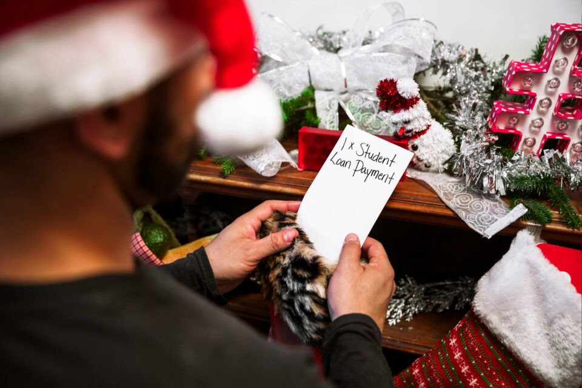
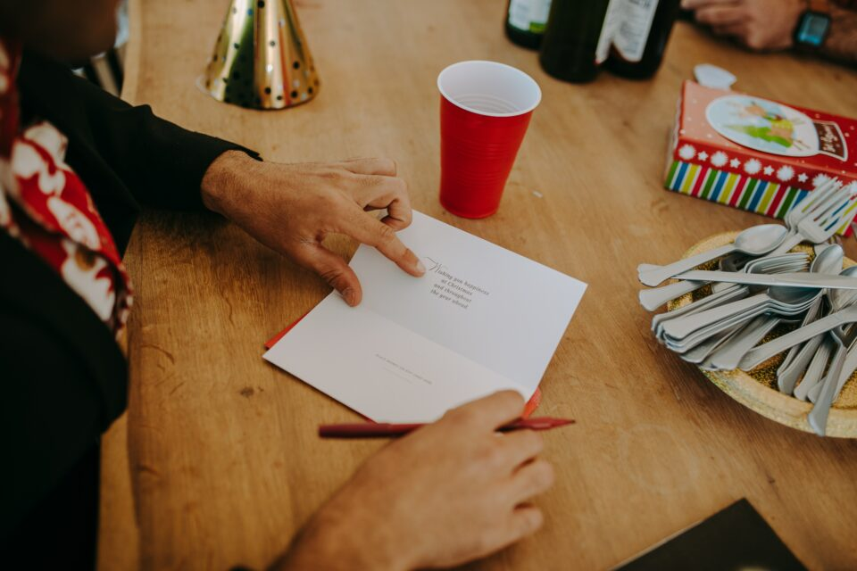
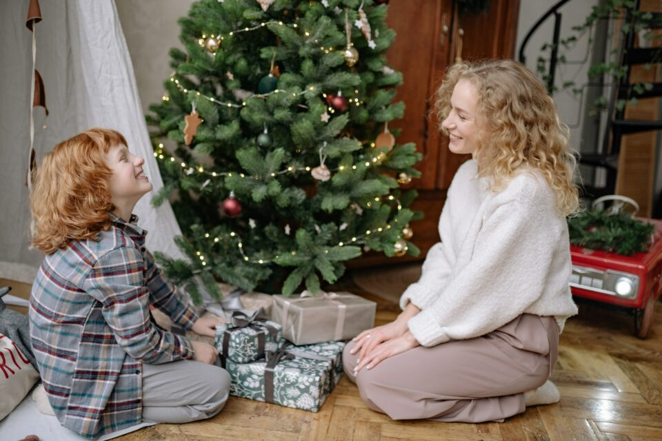
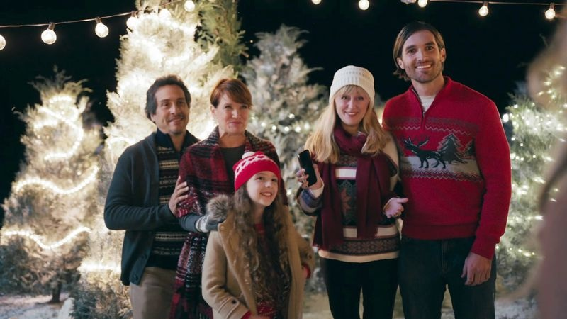

This article has been written and researched by our expert Loveable through a precise methodology. [Learn more about our methodology](https://avada.io/loveable/our-methodological.html)

[Loveable](https://avada.io/loveable/) > [Blog](https://avada.io/loveable/blog/) > [Holiday](https://avada.io/loveable/holiday/)

# 100 Heartwarming Christmas Family Quotes to Spread Joy

Written by [Blake Simpson](https://avada.io/loveable/author/blake/) Last Updated on September 07, 2023

- [100 Best Christmas Family Quotes Will Warm Their Hearts](https://avada.io/loveable/blog/christmas-family-quotes/#wp-block-heading-2-2)
    - [Short Christmas Family Quotes](https://avada.io/loveable/blog/christmas-family-quotes/#wp-block-heading-3-3)
    - [Hilarious Christmas Quotes for Family](https://avada.io/loveable/blog/christmas-family-quotes/#wp-block-heading-3-26)
    - [Popular Christmas Family Quotes](https://avada.io/loveable/blog/christmas-family-quotes/#wp-block-heading-3-49)
    - [Inspirational Christmas Card Sayings for Family Members](https://avada.io/loveable/blog/christmas-family-quotes/#wp-block-heading-3-72)
    - [Family Christmas Quotes Inspired by Movie](https://avada.io/loveable/blog/christmas-family-quotes/#wp-block-heading-3-95)
- [Bottom line](https://avada.io/loveable/blog/christmas-family-quotes/#wp-block-heading-2-121)

The holiday season is a time of warmth, connection, and cherished moments with loved ones. As we gather around the twinkling lights and festive decorations, the spirit of Christmas envelopes us in a cocoon of love and joy. What better way to capture the essence of this magical season than through heartwarming **Christmas family quotes**? These quotes beautifully encapsulate the significance of family bonds, the joy of giving, and the magic of the holiday season. It will become more meaningful when the [Christmas gifts](https://avada.io/loveable/family-christmas-gifts/) you prepare for your family accompany these sayings. In this article, we present a collection of touching Christmas family quotes that will inspire, uplift, and remind you of the true spirit of Christmas.

## **100 Best Christmas Family Quotes Will Warm Their Hearts**

### **Short Christmas Family Quotes**

Christmas family quotes capture the essence of togetherness and joy during the holiday season. These short yet profound messages beautifully express the warmth of family bonds and the spirit of giving. Whether tucked into a heartfelt card or shared around the dinner table, these quotes evoke the coziness that makes this time of year truly special.

1. “A joy that is shared is a joy made double.” — John Roy
2. “Christmas is a season not only of rejoicing but of reflection.”  — Winston Churchill
3. “The smells of Christmas are the smells of childhood.” — Richard Paul Evans in The Christmas Box
4. “You, me, and the Christmas tree. Picked, purchased, and pruned.” — Max Lucado
5. “Christmas is the day that holds all time together.” — Alexander Smith
6. “Remembrance, like a candle, burns brightest at Christmastime.” — Charles Dickens
7. “It’s the most wonderful time of the year!”  — Edward Pola & George Wyle
8. “At Christmas, play and make good cheer, for Christmas comes but once a year.” — Thomas Tusser
9. “Christmas is a time when you get homesick – even when you are home.” – unknown
10. “Christmas is, of course, the time to be home, in heart as well as body.” — Garry Moore
11. “For many, Christmas is also a time for coming together. But for others, service will come first.” — Queen Elizabeth II
12. “Christmas will always be as long as we stand heart to heart and hand in hand.” — Dr. Seuss
13. “Christmas isn’t a season. It’s a feeling.” — Edna Ferber
14. “At Christmas, all roads lead home.” — Marjorie Holmes
15. “Christmas to me is as many people as possible happy.” — Tupac Shakur
16. “Christmas is a piece of one’s home that one carries in one’s heart.” — Freya Stark
17. “The joy of brightening other lives becomes for us the magic of the holidays.” — W.C. Jones
18. I send my thoughts afar, and let them paint your Christmas Day at home – Edward Rowland Sill
19. This is the message of Christmas: We are never alone. — Taylor Caldwell
20. “May you never be too grown up to search the skies on Christmas Eve.” – Unknown

### **Hilarious Christmas Quotes for Family**

The most eagerly awaited season of the year is undoubtedly Christmas. However, it may also be stressful. It might be exhausting to plan the holiday dinner and purchase for Christmas. How about relieving tension and anxiety with a few funny family Christmas quotes? Scroll down for more details.

1. ”A Christmas miracle is when your family doesn’t get into a single argument all day.” – Melanie White
2. “Christmas is a box of tree ornaments that have become part of the family.” – Charles M. Schulz
3. ”Sending Christmas cards is a good way to let your friends and family know that you think they’re worth the price of a stamp.” – Melanie White
4. “Santa Claus has the right idea. Visit people only once a year.” – Victor Borge
5. “It’s that special time of year when your whole family gathers together in one place to look at their cellphones.” – Jimmy Kimmel
6. “Christmas is a time when you get homesick, even if you’re home.” – Carol Nelson
7. “My mother-in-law has come round to our house at Christmas seven years running. This year we’re having a change. We’re going to let her in.” – Leslie ‘Les’ Dawson, Jr.
8. “The best Christmas present I got from my husband was a week to do whatever I wanted.” – Olivia Haigh Williams
9. “My husband’s idea of getting the Christmas spirit is to become Scrooge.” – Melanie White
10. “As we struggle with shopping lists and invitations, compounded by December’s bad weather, it is good to be reminded that there are people in our lives who are worth this aggravation and people to whom we are worth the same.” – Donald E. Westlake
11. “I bought my brother some gift-wraps for Christmas. I took it to the Gift Wrap department and told them to wrap it, but in a different print so he would know when to stop unwrapping.” – Steven Wright
12. “People really act weird at Christmas time! What other time of year do you sit in front of a dead tree in the living room and eat nuts and sweets out of your socks?” – Unknown
13.  “I once bought my kids a set of batteries for Christmas with a note on it saying ‘toys not included.” – Bernard Manning
14. “Never worry about the size of your Christmas tree. In the eyes of children, they are all 30 feet tall.” – Larry Wilde
15. “The one thing women don’t want to find in their stockings on Christmas morning is their husband.” – Joan Rivers
16. “Nothing’s as mean as giving a little child something useful for Christmas.” – Kin Hubbard
17. “There are three stages of man: he believes in Santa Claus; he does not believe in Santa Claus; he is Santa Claus.” – Bob Phillips
18. “We’re the house that’s playing Christmas music by November 1.” – Jonathan Scott
19. “A lovely thing about Christmas is that it’s compulsory, like a thunderstorm, and we all go through it together.” – Garrison Keillor
20. “Adults can take a simple holiday for children and screw it up. What began as a presentation of simple gifts to delight and surprise children around the Christmas tree has culminated in a woman unwrapping six shrimp forks from her dog, who drew her name.” – Erma Bombeck

### **Popular Christmas Family Quotes**

You will find inspiration in this selection of well-known Christmas quotes this holiday season. While some may be entirely new to you, others will feel highly familiar with these sayings. To help you out, let these motivational Christmas quotes guide you in your search for the perfect phrase!

1. “Christmas is like candy; it slowly melts in your mouth sweetening every taste bud, making you wish it could last forever.” – Richelle E. Goodrich
2. “And that, of course, is the message of Christmas. We are never alone. Not when the night is darkest, the wind coldest, the world seemingly most indifferent.” – Taylor Caldwell
3. “The best of all gifts around any Christmas tree: the presence of a happy family all wrapped up in each other.” – Burton Hills
4. “Christmas is a piece of one’s home that one carries in one’s heart.” – Freya Stark
5. “Christmas doesn’t come from a store. Maybe Christmas perhaps means a little bit more.” – Dr. Seuss
6. “Christmas is not as much about opening our presents as opening our hearts.” –Janice Maeditere
7. “My idea of Christmas, whether old-fashioned or modern, is very simple: loving others.” – Bob Hope
8. “Christmas will always be as long as we stand heart to heart and hand in hand.” – Dr. Seuss
9. “Blessed is the season which engages the whole world in a conspiracy of love!” – Hamilton Wright Mabie
10. “Nothing ever seems too bad, too hard, or too sad when you’ve got a Christmas tree in the living room.” – Nora Roberts
11. “Good news from heaven the angels bring, glad tidings to the earth they sing: To us this day a child is given, to crown us with the joy of heaven.” —Martin Luther
12. “Some Christmas tree ornaments do more than glitter and glow, they represent a gift of love given a long time ago.” – Tom Baker
13. “Christmas is not just a time for festivity and merry making. It is more than that. It is a time for the contemplation of eternal things. The Christmas spirit is a spirit of giving and forgiving.” – J.C. Penney
14. “As for me, I like to take my Christmas a little at a time, all through the year.” – David Grayson
15. “Christmas gives us an opportunity to pause and reflect on the important things around us.” – David Cameron
16. “I will honor Christmas in my heart, and try to keep it all the year.” – Charles Dickens
17. “Christmas is the happiness that lights our children’s eyes. Christmas is a song of bells ringing through the skies. Christmas is a time of peace, of contentment deep within, a time of love and silent hope that years will never dim.” — Sherrill Thompson
18. “Christmas is a necessity. There has to be at least one day of the year to remind us that we’re here for something else besides ourselves.” – Eric Severeid
19. “Christmas is not about the lights, not about the presents, not about the food, but about being there for others, being a friend, loving someone whether they are family or not.” – S.E. Smith
20. “Christmas is a season for kindling the fire for hospitality in the hall, the genial flame of charity in the heart.” – Washington Irving

### **Inspirational Christmas Card Sayings for Family Members**

Invoke heartwarming connections with your loved ones this holiday through inspirational Christmas card sayings for family members. When you reach out with these thoughtful messages, you’re kindling the spirit of togetherness and spreading cheer. Now, it’s time to express your deepest sentiments, reaffirm bonds, and celebrate the joy of family!

1. “I think as you grow older your Christmas list gets shorter because the things you want can’t be brought.” – Unknown
2. “Keep looking forward to a better and safer year ahead. Merry Christmas.” – Unknown
3. “Christmas gives us the opportunity to pause and reflect on the important things around us.” – David Cameron
4. “The true Christmas spirit is putting others’ happiness before our own, and finding you’ve never known such happiness.” – Toni Sorenson
5. “Christmas waves a magic wand over the world, and behold, everything is softer and more beautiful.” – Norman Vincent Peale
6. “Christmas works like glue; it keeps us all sticking together.” – Rosie Thomas
7. “Christmas is a day of meaning and traditions, a special day spent in the warm circle of family and friends.” – Margaret Thatcher
8. “I used to think being a kid on Christmas was the best thing ever. Turns out being a parent on Christmas is.” – Unknown
9. “Next Christmas, I hope that we can again hug each other tight and celebrate this season together. Merry Christmas!” – Unknown
10. “We are better throughout the year for having, in spirit, become a child again at Christmastime.” – Laura Ingalls Wilder
11. “He who has not Christmas in his heart will never find it under a tree.” – Roy L. Smith
12. “Family is all about eternal warmth and bond. Christmas is all about being grateful for all the blessings. Family is Christmas.” – Unknown
13. “Christmas is a constant reminder that we are blessed beyond words. Our family is proof that we are blessed beyond words.” – Unknown
14. “I’m dreaming of a white Christmas, just like the ones I used to know.” – Irving Berlin
15. “The best present on Christmas is spending time with family and being reminded of the things that give you real joy.” – Unknown
16. “Some say that it’s beginning to look a lot like Christmas when people are merrily greeting each other with love. I experience Christmas every day with my family.” – Unknown
17. “Miles apart from my family this Christmas is not what I longed for this year, but our love will keep us close to each other no matter what.” – Unknown
18. “May merry Christmas wishes surround you like snowflakes.” – Unknown
19. “My family values the season of Christmas so much that they raised us realizing that it doesn’t have to be December to practice kindness and generosity.” – Unknown
20. “Mankind is a great, an immense family… This is proved by what we feel in our hearts at Christmas.” – Pope John XXIII

### **Family Christmas Quotes Inspired by Movie**

A few well-known [Christmas movies](https://avada.io/loveable/blog/christmas-movie-trivia/) are essential to the holiday season. Even when you can’t curl up in front of the TV all day, quoting Christmas family scenes from movies may keep you in the holiday spirit long after the credits have finished. Turn your celebrations into a reel of heartwarming moments as you weave these quotes into your festivities, making this holiday season unforgettable.

1. “We elves try to stick to the four main food groups: Candy, candy canes, candy corn, and syrup.”- Elf
2. “No one should be alone on Christmas.”-The Grinch that Stole Christmas
3. “You can mess with a lot of things. But you can’t mess with kids on Christmas.”- Home Alone 2
4. “The thing about trains … it doesn’t matter where they’re going. What matters is deciding to get on.”- The Polar Express
5. “Nobody’s walking out on this fun, old-fashioned family Christmas.”-Christmas Vacation
6. “A toy is never truly happy until it is loved by a child.”- Rudolph the Red -Nosed Reindeer
7. “Just because you can’t see something, doesn’t mean it doesn’t exist.”- The Santa Clause
8. “That’s what Christmas memories are made from, they’re not planned, they’re not scheduled, nobody puts them in their Blackberry, they just happen.”- Deck the Halls
9. “There’s a certain magic that comes with the very first snow. For when the first snow is also a Christmas snow, well, something wonderful is bound to happen.”- Frosty the Snowman
10. “You’ll shoot your eye out, kid!”- A Christmas Story
11. “God bless us, everyone!”- A Christmas Carol
12. “Merry Christmas you filthy animal.”- Home Alone
13. “The best way to spread Christmas cheer is singing loud for all to hear.”- Elf
14. “Just remember, the true spirit of Christmas lies in your heart.”- The Polar Express
15. “Faith is believing in things when common sense tells you not to.” – Miracle on 34th Street
16. “Seeing isn’t believing. Believing is seeing.”- The Santa Clause
17. “Seeing is believing, but sometimes the most real things in the world are the things we can’t see.”- The Polar Express
18.  “This is extremely important. Will you please tell Santa that instead of presents this year, I just want my family back.” – Home Alone
19. “But sir, Christmas is a time for giving… a time to be with one’s family.” – Cratchit
20. “Nobody’s walking out on this fun, old-fashioned family Christmas.” – Christmas Vacation

**_See More:_**

- Best [Christmas Wishes](https://avada.io/loveable/blog/christmas-wishes/)

- Heartwarming [Christmas Card Messages](https://avada.io/loveable/blog/christmas-card-messages/)

## **Bottom line**

As the holiday season approaches, let these heartwarming **Christmas family quotes** be a source of inspiration and joy. They remind us of the true essence of Christmas – a time of togetherness, giving, and enchantment. Whether you’re sharing these quotes with loved ones, incorporating them into your festive decor, or simply reflecting on their meaning, they will indeed evoke emotions that capture the season’s magic. Let’s spread the joy and cherish the moments that make this time of year truly special!

- [100 Best Christmas Family Quotes Will Warm Their Hearts](https://avada.io/loveable/blog/christmas-family-quotes/#wp-block-heading-2-2)
    - [Short Christmas Family Quotes](https://avada.io/loveable/blog/christmas-family-quotes/#wp-block-heading-3-3)
    - [Hilarious Christmas Quotes for Family](https://avada.io/loveable/blog/christmas-family-quotes/#wp-block-heading-3-26)
    - [Popular Christmas Family Quotes](https://avada.io/loveable/blog/christmas-family-quotes/#wp-block-heading-3-49)
    - [Inspirational Christmas Card Sayings for Family Members](https://avada.io/loveable/blog/christmas-family-quotes/#wp-block-heading-3-72)
    - [Family Christmas Quotes Inspired by Movie](https://avada.io/loveable/blog/christmas-family-quotes/#wp-block-heading-3-95)
- [Bottom line](https://avada.io/loveable/blog/christmas-family-quotes/#wp-block-heading-2-121)

### [Blake Simpson](https://avada.io/loveable/author/blake/)

Hi, I'm Blake from Loveable. I help people find perfect gifts for occasions like anniversaries and weddings. I also write a blog about holidays, sharing insights to make them more meaningful. Let's create unforgettable moments together!

- [Twitter](https://twitter.com/intent/tweet)
- [Facebook](https://www.facebook.com/sharer/sharer.php)
- [instagram](https://avada.io/loveable/blog/christmas-family-quotes/)
- [pinterest](https://www.pinterest.com/loveablellc/)

## Related Posts

[### 120+ Christian Birthday Wishes To Spread Your Love](https://avada.io/loveable/blog/christian-birthday-wishes/) 

[

### 35 Best 70th Birthday Ideas To Celebrate The Special Milestone

](https://avada.io/loveable/blog/70th-birthday-ideas/)

[

### 50 Best 30th Birthday Decorations for a Remarkable Birthday Bash

](https://avada.io/loveable/blog/30th-birthday-decorations/)

[

### 40 Delicious Vegan Christmas Desserts to Delight Your Palate

](https://avada.io/loveable/blog/vegan-christmas-desserts/)

[

### 60 Christmas Team Building Activities to Boost Workplace Spirit

](https://avada.io/loveable/blog/christmas-team-building-activities/)
