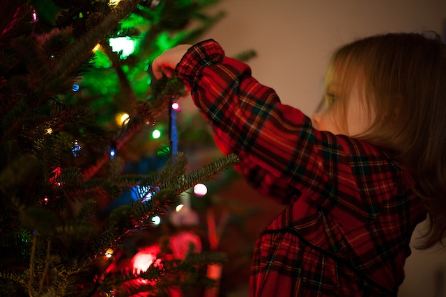
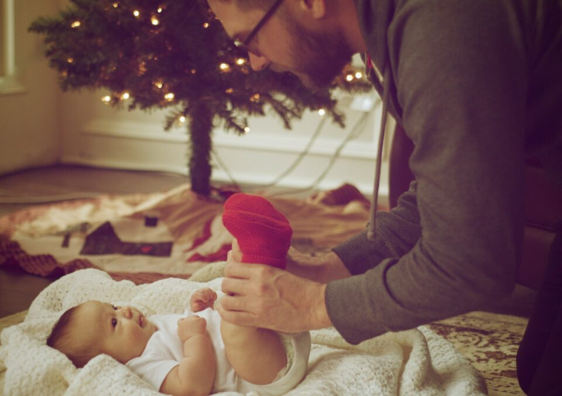
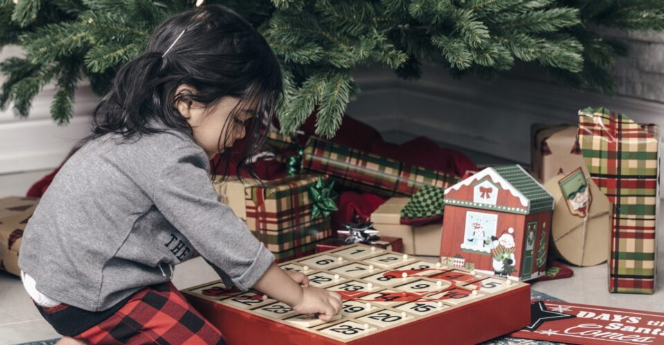

This article has been written and researched by our expert Loveable through a precise methodology. [Learn more about our methodology](https://avada.io/loveable/our-methodological.html)

[Loveable](https://avada.io/loveable/) > [Blog](https://avada.io/loveable/blog/) > [Holiday](https://avada.io/loveable/holiday/)

# 100+ Playful Kids Christmas Jokes To Infuse The Holiday Season With Glee

Written by [Blake Simpson](https://avada.io/loveable/author/blake/) Last Updated on September 07, 2023

- [100+ Best Christmas Jokes For Kids To Make Them Burst Into Laugh](https://avada.io/loveable/blog/kids-christmas-jokes/#wp-block-heading-2-3)
    - [Quick-witted Christmas Jokes For Kids](https://avada.io/loveable/blog/kids-christmas-jokes/#wp-block-heading-3-4)
    - [Knock-knock Christmas Jokes](https://avada.io/loveable/blog/kids-christmas-jokes/#wp-block-heading-3-70)
    - [One-liners Christmas Jokes](https://avada.io/loveable/blog/kids-christmas-jokes/#wp-block-heading-3-114) 
    - [Corny Christmas Jokes From Dad](https://avada.io/loveable/blog/kids-christmas-jokes/#wp-block-heading-3-130)
    - [Mischievous Christmas Present Puns](https://avada.io/loveable/blog/kids-christmas-jokes/#wp-block-heading-3-183)
- [Bottom Line](https://avada.io/loveable/blog/kids-christmas-jokes/#wp-block-heading-2-198)

Prepare to usher in the holiday season with abundant joy and enchantment as we present a treasury of meticulously curated Christmas jokes for kids. With the arrival of the festive period, replete with its picturesque snowscapes and radiant decorations, we are delighted to share a collection that promises to ignite the spirits of young ones and adults alike.

Imagine the sheer delight on children’s faces as they delve into these light-hearted gems, each meticulously crafted to capture the essence of the holidays. From anecdotes about Santa’s legendary sleigh to endearing tales of snowmen’s antics, these **Kid Christmas Jokes** encapsulate the whimsy that makes this season special. A priceless resource for parents, educators, and those who value the gift of shared laughter, these jokes stand as a testament to the joy that unites us during this wondrous time of year.

## **100+ Best Christmas Jokes For Kids To Make Them Burst Into Laugh**

### **Quick-witted Christmas Jokes For Kids**

These quick-witted Christmas jokes is like a treasure trove of merriment waiting to be discovered by your little one. Picture the [joy on the faces of kids](https://avada.io/loveable/christmas-gifts-7-month-old/) and grown-ups as they share in the infectious giggles these jokes inspire.

- What did Santa Claus’s little helper pals learn at school? The Elf-abet.
- What do you think the elves do after their school gets over? The gnome-work
- Why do you think everyone loves Frosty the Snowman? Come on! Because he is COOL!
- What is Santa’s favorite place to give presents? Idaho-ho-ho!
- What did the stamp say to the Christmas card? Stick with me, and we’ll go places!!
- What goes, “Oh! Oh! Oh!”? Santa going backward!
- What do you think the snowmen wear on their heads? The Snow Caps
- What did Adam say to Eve the day before Christmas? It’s Christmas, Eve!
- What comes at the end of Christmas? The letter “S.”
- What do you guess is the Christmas tree’s favorite candy? The Orna-Mints
- Why was the Snowman looking into the carrots? Because he was picking his Nose!
- How can you say Christmas Day is exactly like your job? You do all the work, and some fat guy in a pretty suit gets all the credit.
- Why was Santa’s little helper sad and sulking? Because he had very low elf-esteem.
- What do you think is the name of a grumpy Reindeer? Rude-olph.
- What do you call a cat sitting on the beach on Christmas eve? The Sandy Claws.
- In which year does New Year’s Day come before Christmas? Every Year.
- What does “her Majesty” call her own Christmas Broadcast? The One Show.
- What did the pop culture dancers eat during Christmas? Twerky!
- Which kind of ball can you throw and not expect to bounce? The snowball.
- Why does the Christmas tree visit the barber every year? It needs to be trimmed.
- What do you believe the snowmen eat for breakfast? A bowl of Frosted Flakes.
- What can you call Santa’s little helpers? The Subordinate clauses.
- What did Santa ask Rudolph about the weather on the day of Christmas?
- “Is it going to rain, dear?”
- What did the Doctor say to the angry advent calendar? Sorry, your days are numbered!
- What do you call the kid in your group who doesn’t believe in Santa? A rebel without a Claus!
- What is Santa’s favorite motorcycle? The Holly Davidson
- What do you call the Santa who is broke? Santa Nickel-less
- What is the snowman’s favorite type of food? The Iceberg-ers!
- With what do the reindeer decorate their Christmas trees? Horn-aments
- What do you call when Santa stops moving? The Santa Pause
- What do you call when your Santa becomes a detective? Clues. Santa Clues!
- What did the beaver say to the Christmas tree after a long conversation? It was nice gnawing you!
- How does Darth Vader enjoy his Turkey for Christmas? On the dark side!
- Do you know the kid who was scared of Santa? He was Claus-trophobic.
- How does Rudolf get to know when Christmas is approaching? He refers to the Calen-deer
- What is the one thing that falls on the North Pole and never tends to get hurt? It’s the snow!
- What do the monkeys sing on Christmas Eve? The Jungle Bells!
- What’s the best Christmas present you can get? A broken drum. You just can’t beat it!
- What do you get when there is a cross between a vampire and a Snowman? A Frostbite
- What are the photos of elves called? The Elfies!
- How do the Snowmen travel around? They ride the icicle!
- Why does Santa always go down the chimney? Because it soots him!
- How does the snowman lose weight? He waits for the weather to get warmer!
- What do you call a greedy elf?  We call them Elfish.
- What does the gingerbread man put on his bed? The Cookie sheets.
- What does Santa Claus do when his elves misbehave? He gives them the sack!
- How does the snow globe feel every year? A little shaken!
- How long are an elf’s legs? Just long enough to reach the ground!
- What’s worse than a reindeer with a runny nose? A snowman with a fever!
- What did Santa name his puppy? Santa Paws!
- What’s green, covered in tinsel, and goes ribbit, ribbit? A Mistle-toad.
- How does Santa take photos? With a Pole-aroid camera, of course.
- Why doesn’t Santa go to the hospital? He has private elf care.
- Who is never hungry at Christmas? The turkey – he’s always stuffed.
- What do you call an elf wearing ear muffs? “Anything you like. He can’t hear you!”
- What athlete is warmest in winter? A long jumper!
- What does Rudolph want for Christmas? A Pony sleigh station.
- Why do mummies like Christmas so much? Because of all the wrapping!
- Where do Santa’s reindeer stop for coffee? Star-bucks!
- Which metal band does Santa Claus listen to? Sleigh-er
- Why did Santa Claus get a parking ticket on Christmas Eve? He left his sleigh in a snow parking zone.
- What do you get when you cross a Christmas tree with an iPad? A pineapple!

### **Knock-knock Christmas Jokes**

These jokes can turn any gathering into a symphony of laughter and smiles for your kids. Each knock-knock interaction becomes a delightful exchange that brings people closer together on Christmas.

- Knock, knock! Who’s there? Ya. Ya who? Wow, you’re really excited about Christmas!
- Knock, knock! Who’s there? Noah. Noah who? Noah good Christmas joke?
- Knock, knock! Who’s there? Doughnut. Doughnut who? Doughnut open until Christmas!
- Knock, knock! Who’s there? Chris. Chris who? Christmas is here!
- Knock, knock! Who’s there? Pudding. Pudding who? Pudding up the Christmas lights!
- Knock, knock! Who’s there? Howard. Howard who? Howard you like to sing Christmas carols with me?
- Knock, knock! Who’s there? Interrupting Santa. Inter–Ho ho ho! Merry Christmas!
- Knock, knock! Who’s there? Coal. Coal who? Coal me when you hear Santa.
- Knock Knock! Who’s there? Mary. Mary who? Mary Christmas!
- Knock, knock! Who’s there? Hannah. Hannah who? Hannah partridge in a pear tree.
- Knock, knock! Who’s there? Olive. Olive who? Olive the other reindeer.
- Knock, knock! Who’s there? Luke. Luke who? Luke at all those presents!
- Knock, knock! Who’s there? Ho Ho. Ho Ho who? That Santa impression needs work.
- Knock, knock! Who’s there? Holly. Holly who? Holly-days are the best days.
- Knock, knock! Who’s there? Gladys. Gladys who? Gladys Christmas, aren’t you?
- Knock, knock! Who’s there? Anna. Anna who? Anna partridge in a pear tree.
- Knock, knock! Who’s there? Alaska. Alaska who? Alaska again. What do you want for Christmas?
- Knock, knock! Who’s there? Chris. Chris who? Christmas is here!
- Knock, knock! Who’s there? Snow. Snow who? Snow time to waste. It’s almost Christmas!
- Knock, knock! Who’s there? Donut. Donut who? Donut open ’til Christmas!
- Knock, knock! Who’s there? Ima. Ima who? Ima dreaming of a white Christmas…
- Knock, knock! Who’s there? Dexter. Dexter who? Dexter halls with boughs of holly…
- Knock, knock! Who’s there? Freeze. Freeze who? Freeze a jolly good fellow. Freeze a jolly good fellow…
- Knock, knock! Who’s there? Pikachu. Pikachu who? Pikachu Christmas presents and you’ll be in trouble.
- Knock, knock! Who’s there? Harry. Harry who? Harry up and open your gift!
- Knock, knock! Who’s there? Norway. Norway who? Norway am I kissing anyone under the mistletoe!
- Knock, knock! Who’s there? Tank. Tank who? Tank you for my Christmas present!
- Knock, knock! Who’s there? Kanye. Kanye who? Kanye help me untangle my Christmas lights?
- Knock, knock! Who’s there? Elf. Elf who? Elf I knock again, will you let me in?
- Knock, knock! Who’s there? Irish. Irish who? Irish you a Merry Christmas!
- Knock, knock! Who’s there? Ho Ho. Ho Ho who? Your Santa impression needs a little work!
- Knock, knock! Who’s there? Murray. Murray who? Murray Christmas to all, and to all a good night.
- Knock, knock! Who’s there? Claus. Claus who? Claus I can’t wait any longer!
- Knock, knock! Who’s there? Doughnut. Doughnut who? Doughnut open until Christmas!
- Knock, knock! Who’s there? Luke. Luke who? Luke at all those presents!
- Knock, knock! Who’s there? Wayne. Wayne who? Wayne in a manger…
- Knock, knock! Who’s there? Oakham. Oakham who? Oakham all yea faithful…
- Knock, knock! Who’s there? Interrupting Santa. Inter— Ho ho ho! Merry Christmas!
- Knock, knock! Who’s there? Howard. Howard who? Howard you like to sing Christmas carols with me?
- Knock, knock! Who’s there? Honda. Honda who? Honda first day of Christmas, my true love sent to me…
- Knock, knock! Who’s there? Elf. Elf who? Elf me to wrap this present.

### **One-liners Christmas Jokes** 

Here, you’ll find bite-sized jokes that deliver an [abundance of laughter](https://avada.io/loveable/halloween-puns/) in just a few words to your little ones. Whether shared at family gatherings or tucked into holiday cards, these well-crafted quips create memorable moments and lively conversations.

- Treat yo’elf.
- We have great chemis-tree.
- I once made a snowman laugh so hard, he made yellow snow.
- I’ll never fir-get.
- Let’s get elf-ed up.
- Believe in your elf.
- Have your elf a merry little Christmas.
- Don’t get caught elvesdropping on Santa!
- That holiday sweater is so ugly, the word “ugly” filed a defamation suit against it.
- Get the elf out of here.
- A round of Santa-plause, please.
- Santa cleans his sleigh with Santa-tizer.
- You know you overdid it on Christmas when aliens discover our planet, thanks to your light display.

### **Corny Christmas Jokes From Dad**

Close your eyes and see baby faces light up with groans and laughter as you deliver our collection of corny Christmas jokes. It’s the kind of humor that warms the heart and makes memories, a true reflection of that classic dad-joke charm we all know and secretly adore.

- What do snowmen call their sons and daughters? Chill-dren.
- What is the best Christmas present to receive? A broken drum — you just can’t beat it.
- Who is Santa’s favorite singer? Elf-is Presley.
- How much did Santa pay for his sleigh? Nothing, it was on the house.
- What is Santa’s nationality? North Pole-ish.
- Why does Mrs. Claus like Beyoncé so much? She sleighs.
- What do the reindeer say to Santa on Christmas Eve? We are ready to sleigh.
- Why does Santa use a chimney? It soots him.
- What do reindeer hang on their tree? Horna-ments.
- What do you call kids who no longer believe in Santa Claus? Rebels without a Claus.
- Who is Santa’s favorite singer? Beyon-sleigh.
- Where does Santa stay when he goes on a vacation? At a ho-ho-ho-tel.
- Why doesn’t Santa eat junk food? Because it’s bad for his elf.
- Where do Santa’s reindeer drink their coffee? Star-bucks
- What does Santa suffer from if he gets stuck in someone’s chimney? Claustrophobia.
- What did one Christmas tree say to another? Lighten up!
- What falls at the North Pole and never gets hurt? Snow!
- Why are Christmas trees bad at sewing? Because they always drop their needles!
- How does a snowman lose weight? He waits for the weather to get warmer!
- What did one snowman say to the other snowman? Do you smell carrots?
- What do you get when you combine a Christmas tree with an iPad? A pineapple!
- How do sheep wish each other happy holidays? “Merry Christmas to ewe.”
- What do you call a snowman with a six-pack? The abdominal snowman.
- Why is a foot a good Christmas present? Because it makes a good stocking filler.
- What do snowmen call their offspring? Chill-dren.
- What’s the most popular Christmas wine? “I don’t like Brussels sprouts!”
- What does Santa suffer from if he gets stuck in a chimney? Claustrophobia.
- What’s every parent’s favorite Christmas Carol? Silent Night.
- What do you call a bankrupt Santa? Saint Nickel-less.
- Why does Santa always enter through the chimney? Because it soots him.
- What is Santa’s favorite place to deliver presents? Idaho-ho-ho.
- Did you hear that Santa knows karate? He has a black belt.
- Who delivers Christmas presents to sharks? Santa Jaws.
- What’s Santa Claus’s favorite type of potato chip? Crisp Pringles.
- Why did Frosty’s wife ask for a divorce? He was a total flake.
- What smells most on Christmas? Santa’s nose.
- Which of Santa’s friends is the most chill? Jack Frost.
- How much did Santa’s sleigh cost? It was on the house.
- Which of Santa’s reindeer are dinosaurs afraid of? Comet.
- How you can tell that Santa is real? You can always sense his presents.
- What nationality is Santa Claus? North Polish.
- Why did Mrs. Claus get mad at Santa? Because her husband was a flake.
- Why are Christmas trees so fond of the past? Because the present’s beneath them.
- What’s a reindeer’s favorite game? Stable tennis.
- What do reindeer say before telling a joke? This one will sleigh you!
- Why did Santa go to the liquor store? He was looking for holiday spirits.
- What do you call Santa’s little helpers? Subordinate Clauses.
- What kind of money do reindeer use? Bucks!
- What do reindeer hang on their Christmas trees? Horn-aments.
- What do you call a reindeer on Halloween? A cariBOO!

### **Mischievous Christmas Present Puns**

Surely these Mischievous Christmas Present Puns will delight your children. These clever wordplays add an extra layer of amusement to the art of kid gift-giving, spreading smiles and fostering a Christmas atmosphere.

- What did Santa say on Christmas morning? That’s a wrap!
- Why is a foot a good Christmas gift? It fits right in a stocking.
- Why does a broken drum make a good Christmas present? It can’t be beat.
- I can always predict what’s inside a Christmas present. It’s a gift.
- How many presents can Santa fit in an empty sack? Just one. After that, it’s not empty!
- What animal is best at wrapping gifts? Velociraptor
- I tried wrapping gifts all by myself this year, but it’s not my gift.
- Why couldn’t the teacher couldn’t find anyone to help her with her gifts? No one was present.
- Buying presents this year is a bit of a tree-for-all.
- What do you get when Santa brings in the presents and a fire is burning? Crisp Kringle.
- My wife said if she didn’t like my Christmas gift she’d burn it. So I got her a candle.
- What’s the scariest thing about the holidays? The ghost of Christmas presents.

## **Bottom Line**

This holiday season, infuse the air with laughter and joy through our chosen **kid Christmas jokes**. From jolly Santas to mischievous reindeer, these jokes will start an interesting Christmas conversation with your kids and also put smiles on their faces! Show the spirit of Christmas most delightfully with these humorous gems that will become a treasured part of your family’s festive traditions.

- [100+ Best Christmas Jokes For Kids To Make Them Burst Into Laugh](https://avada.io/loveable/blog/kids-christmas-jokes/#wp-block-heading-2-3)
    - [Quick-witted Christmas Jokes For Kids](https://avada.io/loveable/blog/kids-christmas-jokes/#wp-block-heading-3-4)
    - [Knock-knock Christmas Jokes](https://avada.io/loveable/blog/kids-christmas-jokes/#wp-block-heading-3-70)
    - [One-liners Christmas Jokes](https://avada.io/loveable/blog/kids-christmas-jokes/#wp-block-heading-3-114) 
    - [Corny Christmas Jokes From Dad](https://avada.io/loveable/blog/kids-christmas-jokes/#wp-block-heading-3-130)
    - [Mischievous Christmas Present Puns](https://avada.io/loveable/blog/kids-christmas-jokes/#wp-block-heading-3-183)
- [Bottom Line](https://avada.io/loveable/blog/kids-christmas-jokes/#wp-block-heading-2-198)

### [Blake Simpson](https://avada.io/loveable/author/blake/)

Hi, I'm Blake from Loveable. I help people find perfect gifts for occasions like anniversaries and weddings. I also write a blog about holidays, sharing insights to make them more meaningful. Let's create unforgettable moments together!

- [Twitter](https://twitter.com/intent/tweet)
- [Facebook](https://www.facebook.com/sharer/sharer.php)
- [instagram](https://avada.io/loveable/blog/kids-christmas-jokes/)
- [pinterest](https://www.pinterest.com/loveablellc/)

## Related Posts

[### 120+ Christian Birthday Wishes To Spread Your Love](https://avada.io/loveable/blog/christian-birthday-wishes/) 

[

### 35 Best 70th Birthday Ideas To Celebrate The Special Milestone

](https://avada.io/loveable/blog/70th-birthday-ideas/)

[

### 50 Best 30th Birthday Decorations for a Remarkable Birthday Bash

](https://avada.io/loveable/blog/30th-birthday-decorations/)

[

### 40 Delicious Vegan Christmas Desserts to Delight Your Palate

](https://avada.io/loveable/blog/vegan-christmas-desserts/)

[

### 60 Christmas Team Building Activities to Boost Workplace Spirit

](https://avada.io/loveable/blog/christmas-team-building-activities/)
