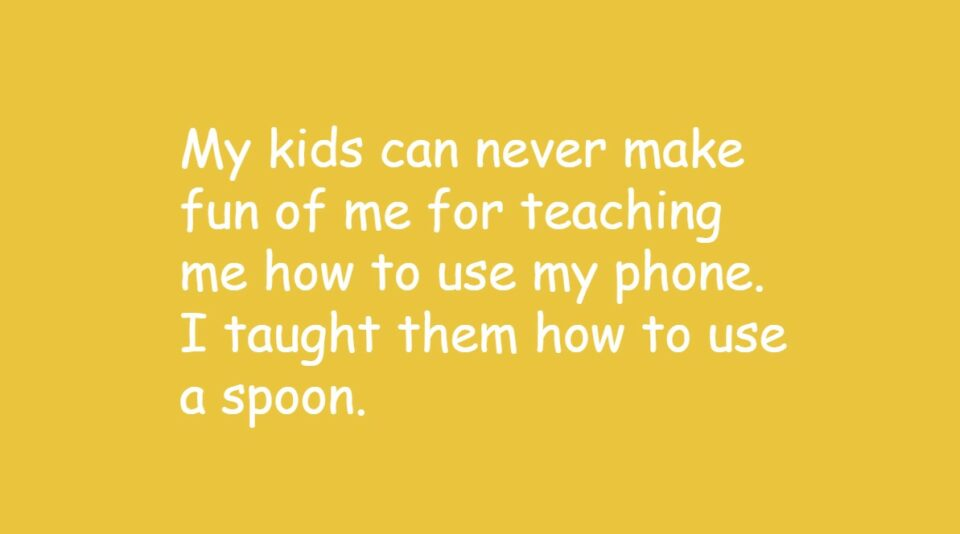
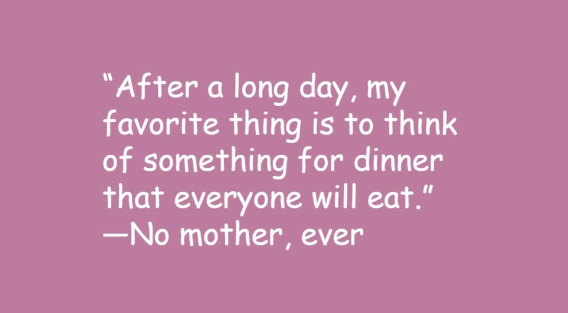
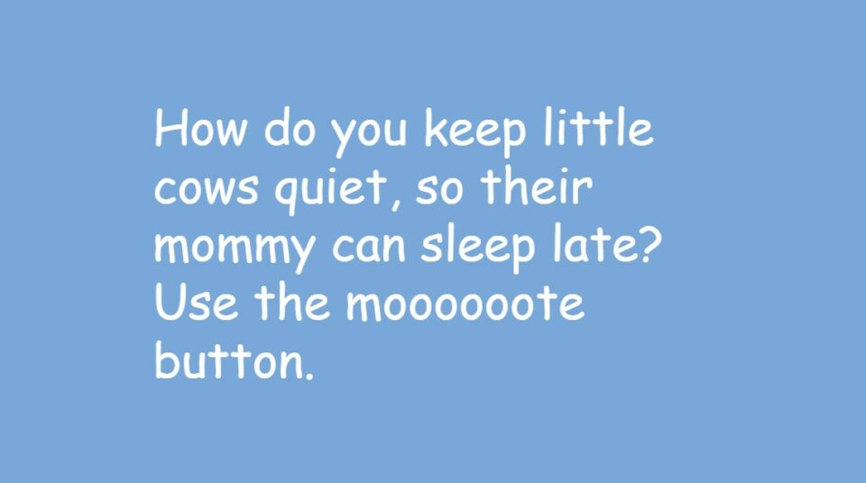
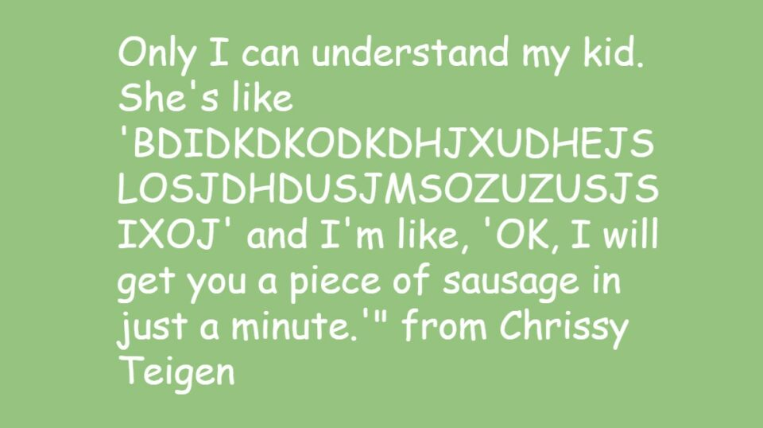

This article has been written and researched by our expert Loveable through a precise methodology. [Learn more about our methodology](https://avada.io/loveable/our-methodological.html)

[Loveable](https://avada.io/loveable/) > [Blog](https://avada.io/loveable/blog/) > [Family](https://avada.io/loveable/family/)

# 101 Hilarious Mom Jokes That Will Leave You in Stitches

Written by [Rose Bryne](https://avada.io/loveable/author/rose/) Last Updated on August 25, 2023

- [Best Mom Jokes](https://avada.io/loveable/blog/hilarious-mom-jokes/#wp-block-heading-2-4)
- [Funny Mom Jokes](https://avada.io/loveable/blog/hilarious-mom-jokes/#wp-block-heading-2-32) 
- [Mom Puns](https://avada.io/loveable/blog/hilarious-mom-jokes/#wp-block-heading-2-59)
- [Celebrity Mom Quotes](https://avada.io/loveable/blog/hilarious-mom-jokes/#wp-block-heading-2-91)
- [Final Thoughts](https://avada.io/loveable/blog/hilarious-mom-jokes/#wp-block-heading-2-118) 

Get ready for a hilarious ride that will have you laughing out loud! We’ve put together a collection of 101 incredibly funny **mom jokes** that are guaranteed to make you burst into laughter. Moms are known for their unconditional love, care, and knack for cracking witty one-liners. 

From the [early days of pregnancy](https://avada.io/loveable/pregnant-mom-gifts/) to the challenges of raising little ones and navigating the teenage years, we’ve got you covered with a collection of uproarious mom jokes. These short and funny jokes are perfect for sharing with the mothers in your life. Whether you want to put a smile on their faces or have a good laugh together, these jokes are sure to do the trick. 

So go ahead and spread the joy by sharing one or even a hundred of these hilarious jokes with all the amazing moms out there!

## **Best Mom Jokes**

1. Some days you question your parenting. On other days you have to question your child’s childing.
2. Nothing is truly lost until Mom can’t find it.
3. My kids can never make fun of me for teaching me how to use my phone. I taught them how to use a spoon.
4. Ever heard of a job that requires no experience, gives no training, pays nothing, and you can’t quit? That’s motherhood. Oh, and people’s lives are on the line.
5. Mommy doesn’t have a favorite child—you all annoy me equally.
6. What’s the fastest land mammal? A toddler who’s been asked what’s in their mouth.
7. As a mom, I’m no longer a snack. I’m a Happy Meal. I come with toys and kids.
8. “It’s spicy” is the universal mom code word for “I don’t want to share.”
9. Don’t be so hard on yourself; the mom in ET had an alien living in her house for weeks and didn’t notice.
10. Being a mother of a teenager is finally understanding why some animals eat their young.
11. I tried to make a joke about a toddler bed, but it fell apart.
12. Helping the kids with homework: Dear Math, grow up and solve your own problems.
13. Why do parents make terrible detectives? Because they always find the evidence after the crime has been committed.
14. I told my son I was going to buy him a book on procrastination, but I kept putting it off.
15. I told my daughter to stop playing with my food. So she started playing with her plate instead.
16. I asked my mom if I was adopted. She said, “Not yet. We’re still waiting for someone to come and claim you.”
17. If being a parent were a job, I’d be the CEO of chaos management.
18. I tried to teach my kids about taxes, but they just responded with, “That sounds like a problem.”
19. What did the accountant say while making breakfast for her kids? This whole parenting thing is taxing.
20. Mom’s recipe for iced coffee: 1. Have kids. 2. Make coffee. 3. Forget you made coffee. 4. Drink it cold.
21. Note to all moms of teens, keep a dog. That way, someone is excited to see you!
22. The most magical power a mother has is the ability to translate toddler nonsense and respond, “Okay, I’ll get you that in just one minute.”
23. Good moms let you lick the beaters after making brownies; great moms turn them off first.
24. I have a joke about chemistry, but I don’t think it will get a reaction.
25. Mom, can you put my shoes on? No, I don’t think they’ll fit me.
26. Motherhood has shown me that you don’t need fun to have alcohol.

## **Funny Mom Jokes** 

1. My mom told me a joke about boxing. I guess I missed the punch line.
2. When I had my first I was addicted to soap, but I’m clean now.
3. I like telling mom jokes. Sometimes, she laughs!
4. Why do moms switch to drinks that are bitter and sweet once they have kids? They’ve been served a cold glass of reali-tea.
5. “After a long day, my favorite thing is to think of something for dinner that everyone will eat.” —No mother, ever
6. Showering as a mom should be an Olympic sport: Everyone’s yelling your name, you have to beat the clock, and you rarely win a medal.
7. I would like to officially apologize to my toddler for opening her granola bar from the top instead of the bottom. I don’t know what I was thinking.
8. Have you heard the urban legend about what happens when you scream “Mom” three times in the shower? A nice lady appears with the towel you forgot.
9. Mom’s recipe for iced coffee: Have kids. Make coffee. Forget you made coffee. Put it in the microwave. Forget you put it in the microwave. Drink it cold.
10. Mom sleep: the state of rest where your eyes are closed but you can still hear everything your kids are doing.
11. Science teacher: “When is the boiling point reached?” Student: “When my mother sees my report card!”
12. Why do Mothers have to have two visits to the optometrist? Because they also have eyes in the back of their head.
13. Why did mom get a plate of English muffins on Mother’s Day? Her family wanted her to feel like a queen!
14. Why is Mother’s Day before Father’s Day? So the kids can spend all their Christmas money on mom.
15. Why did they have to rush the mommy rattlesnake to the doctor? She bit her tongue!
16. When you finally have time for a girls’ night and realize your entire wardrobe went out of style in 2003.
17. “My tween is mad at me and it could be because of any of the horrible things I did this morning: stood in the kitchen, poured coffee, stared out the window, said good morning, breathed…” 
18. When your teenager asks for personal space and you remind her that she came out of your personal space.
19. There’s nothing quite like being told I’m wrong by someone who depends on me for food, clothing, and shelter.
20. What makes more noise than a child jumping on mommy’s bed? Two children jumping on mommy’s bed!
21. I asked my toddler if she wanted to go to the park, and she replied, “No, I’m too busy being adorable.”
22. I used to think I was a morning person, but then I had kids. Now, I’m more of a “give me all the coffee” person.
23. What did Mommy spider say to baby spider? “You spend too much time on the web.”
24. What three words solve dad’s every problem? Ask your mother.
25. “I’m homeschooling like that substitute teacher who rolls in the tv for a movie and just eats snacks in the back of the class.”

## **Mom Puns**

1. Mom, thanks for providing me with womb and board for all of these years!
2. When it comes to parental love and support, I really hit the mother lode with you.
3. Mom, I love you loads. Speaking of, can you do my laundry?
4. My favorite moments in life are really just mom-ents, because everything is better with you.
5. Cheers to thousands of perfect mom-ents this Mother’s Day!
6. Son: “Mom, can I have $20?”

Mom: “Does it look like I am made of money?”

Son: “Well, isn’t that what M-O-M stands for?”

7. Don’t wake up Mom! There are at least seven species that eat their young. Your mom may be one of them.
8. Why was it so hard for the pirate to call his mom? Because she left the phone off the hook.
9. What are the three quickest ways to spread a rumor? The internet, telephone, and telling your mom.
10. Important truth no one tells a first-time mom: Both of you come home from the hospital in diapers.

11. One minute you are young and cool, maybe even a little dangerous, and the next you are reading Amazon reviews for birdseed.
12. What’s black and white and goes round and round? A penguin in the washing machine.
13. I asked a police recruit during an exam, “What would you do if you had to arrest your own mother?
14. When your mother asks, ‘Do you want a piece of advice?’ it is a mere formality. It doesn’t matter if you answer yes or no. You’re going to get it anyway.

15. Every day when you’re raising kids, you feel like you could cry or crack up and just scream, ‘This is ridiculous!’ Because there’s so much nonsense, whether it’s what they’re saying to you or the fact that there’s avocado or poop on every surface.
16. When your children are teenagers, it’s important to have a dog so that someone in the house is happy to see you.
17. Only I can understand my kid. She’s like, ‘Bdidk g idkgndg kgdogjj ogijg.’ And I’m like, ‘Okay, I will get you a piece of sausage in just a minute.
18. I asked a police recruit during an exam, “What would you do if you had to arrest your own mother?”

            He said, “Call for backup.”

19. How do you keep little cows quiet, so their mommy can sleep late? Use the moooooote button.
20. I bought my mom a mug that says, “Happy Mother’s Day from the World’s Worst Son”.

I forgot to mail it, but I think she knows.

21. Mommy: “Mommy will think about it!”

Narrator: “Mommy never thought about it. She knew it was ‘no’ all along and just wanted everyone to STFU.

22. I hate when I’m waiting for mom to cook dinner, and then I remember I am the mom, and I have to cook dinner.
23. Never doubt a mother! She can carry a screaming toddler, two gallons of milk, talk on her cell phone, and still slap the snot out of you for looking at her crazy.
24. Mom: The amazing ability to hear a sneeze through closed doors, in the middle of the night, three bedrooms away… While daddy snores next to you.
25. There is a legend that if you take a shower and scream “Mom” three times, a nice lady appears with the towel you forgot.

## **Celebrity Mom Quotes**

1. “My favorite thing about being a mom is just what a better person it makes you on a daily basis.” from  Drew Barrymore
2. “Sometimes, when I want to take on the world, I try to remember that it’s just as important to sit down and ask my son how he’s feeling or talk to him about life.” from Angelina Jolie
3. “Having a baby is just living in the constant unexpected. You never know when you’re gonna get crapped on or when you’re gonna get a big smile or when that smile immediately turns into hysterics.” from Blake Lively
4. Only I can understand my kid. She’s like ‘BDIDKDKODKDHJXUDHEJSLOSJDHDUSJMSOZUZUSJSIXOJ’ and I’m like, ‘OK, I will get you a piece of sausage in just a minute.'” from Chrissy Teigen
5. “Every day when you’re raising kids, you feel like you could cry or crack up and just scream ‘This is ridiculous!’ because there’s so much nonsense, whether it’s what they’re saying to you or the fact that there’s avocado or poop on every surface.” from Kristen Bell
6. “Becoming a mother has made me next-level confident. I’ve never felt more empowered.” – Kelly Clarkson
7. “I can be covered in spit-up on a conference call while I’m pumping and that’s OK because this is my perfect. It may not be somebody else’s, but this is mine.” – Kerry Washington
8. “I think twice about traveling now, because it needs to be for a damn good reason if I’m going to leave my kid.” – Connie Britton
9. “You have those moments: exhaustion, the stress of having an exuberant child, and you don’t want to be judged by your worst mistakes. It’s a part of life, and it’s a part of what makes us who we are.” – Viola Davis
10. “I tell my daughter every morning, ‘Now, what are the two most important parts of you?’ And she says, ‘My head and my heart.’ Because that’s what I’ve learned in the foxhole: What gets you through life is strength of character and strength of spirit and love.” from Viola Davis
11. “I think every working mom probably feels the same thing: You go through big chunks of time where you’re just thinking, ‘This is impossible — oh, this is impossible.’ And then you just keep going and keep going and you sort of do the impossible.” from Tina Fey
12. “Sleep at this point is just a concept. Something I’m looking forward to investigating in the future.” from Amy Poehler
13. “As a new mom myself, it really was important to hear positive compliments from people just being like, ‘Hey, you’re doing a great job.'” from Shay Mitchell
14. “When I had my children and I felt that type of love, which I know you understand and every mom out there understands, it made me understand that there was a purity to love. That there is an unconditional love.” from Jennifer Lopez
15. “When my daughter is awake, I want her to sleep. When she’s asleep, I want her awake. This is my parenting life.” – Chrissy Teigen
16. “I’ve never met a 2-year-old who is terrible. I’m so cool with every stage my daughter goes through. I just think she’s amazing. I hope she’s not looking at me thinking, ‘Mom, are the terrible 30s coming on with you?'” – Katie Holmes
17. My mother has always been my emotional barometer and my guidance. I was lucky enough to get to have one woman who truly helped me through everything from Emma Stone
18. You don’t ever balance it completely. \[Motherhood\] is a constant struggle of a little more time there, a little more time here, and feeling a little bit guilty all the time.
19.  “I’ve learned the value of absorbing the moment.” from Thandie Newton
20. “Every day when you’re raising kids, you feel like you could cry or crack up and just scream ‘This is ridiculous!’ because there’s so much nonsense, whether it’s what they’re saying to you or the fact that there’s avocado or poop on every surface.” from Kristen Bell
21. “Becoming a mother has made me next-level confident. I’ve never felt more empowered.” from Kelly Clarkson
22. I can be covered in spit-up on a conference call while I’m pumping and that’s ok because this is my perfect. It may not be somebody else’s, but this is mine
23. “I think twice about traveling now, because it needs to be for a damn good reason if I’m going to leave my kid.” from Connie Britton
24. “It just occurred to me that the majority of my diet is made up of the foods my kid did not finish.” from Carrie Underwood
25. “When my daughter is awake, I want her to sleep. When she’s asleep, I want her awake. This is my parenting life.” from Chrissy Teigen

## **Final Thoughts** 

In the world of parenting, laughter truly is the best medicine. We hope that this collection of 101 hilarious **mom jokes** has brought a wave of joy and laughter into your life. From relatable anecdotes to clever punchlines, these jokes celebrate the unique and wonderful journey of motherhood. So, the next time you need a pick-me-up or want to share a lighthearted moment with your loved ones, remember these jokes and let the laughter flow. After all, there’s nothing quite like the gift of laughter to brighten our days and strengthen the bonds of family and friendship. 

- [Best Mom Jokes](https://avada.io/loveable/blog/hilarious-mom-jokes/#wp-block-heading-2-4)
- [Funny Mom Jokes](https://avada.io/loveable/blog/hilarious-mom-jokes/#wp-block-heading-2-32) 
- [Mom Puns](https://avada.io/loveable/blog/hilarious-mom-jokes/#wp-block-heading-2-59)
- [Celebrity Mom Quotes](https://avada.io/loveable/blog/hilarious-mom-jokes/#wp-block-heading-2-91)
- [Final Thoughts](https://avada.io/loveable/blog/hilarious-mom-jokes/#wp-block-heading-2-118) 

### [Rose Bryne](https://avada.io/loveable/author/rose/)

Hi, I'm Rose! I love animals and spending time with kids. At Loveable, I help people find unique gifts for special occasions like Valentine's Day, housewarmings, and graduations. I enjoy finding gifts for kids, teens, and animal lovers that match their interests and personalities. Making gift-giving a pleasant experience is my priority. Let me assist you in finding the perfect gift!

- [Twitter](https://twitter.com/intent/tweet)
- [Facebook](https://www.facebook.com/sharer/sharer.php)
- [instagram](https://avada.io/loveable/blog/hilarious-mom-jokes/)
- [pinterest](https://www.pinterest.com/loveablellc/)

## Related Posts

[### 30 Best 4 Year Old Birthday Party Ideas For A Memorable Celebration](https://avada.io/loveable/blog/4-year-old-birthday-party-ideas/) 

[

### 16th Birthday Party Ideas to Make an Unforgettable Day

](https://avada.io/loveable/blog/16th-birthday-party-ideas/)

[

### 150+ Inspirational Birthday Quotes to Spread Joy on Special Day

](https://avada.io/loveable/blog/inspirational-birthday-quotes/)

[

### 160+ Birthday Wishes for Wife to Express Eternal Love

](https://avada.io/loveable/blog/birthday-wishes-for-wife/)

[### 90+ Heart Touching Birthday Wishes for Niece to Make Her Day Extra Special](https://avada.io/loveable/blog/birthday-wishes-for-niece/)
