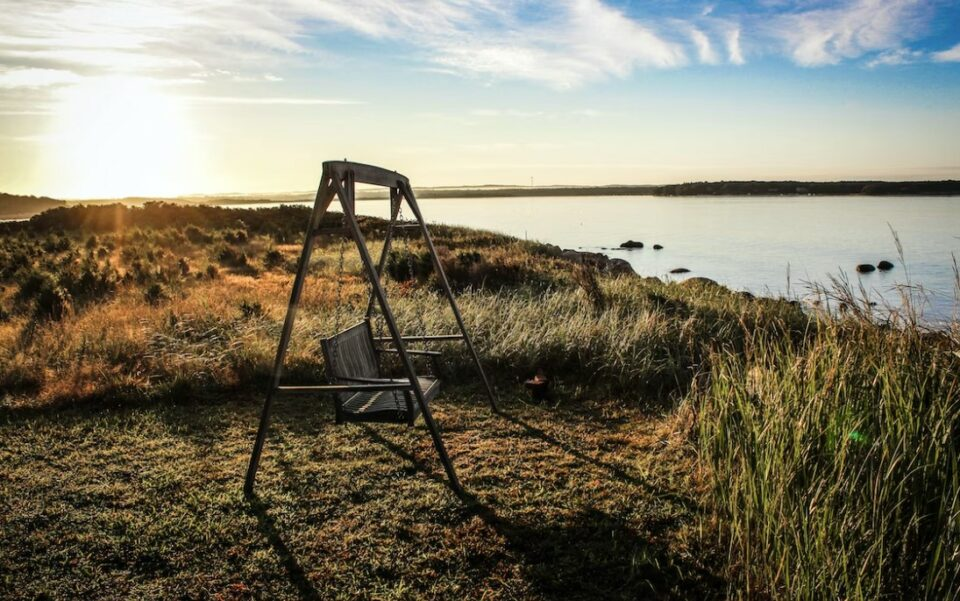
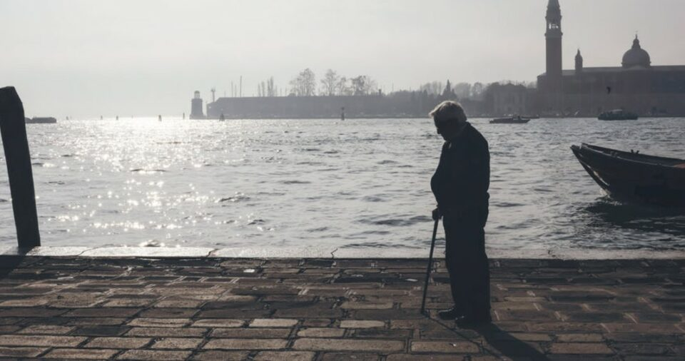
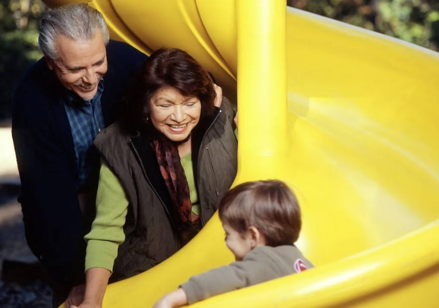

This article has been written and researched by our expert Loveable through a precise methodology. [Learn more about our methodology](https://avada.io/loveable/our-methodological.html)

[Loveable](https://avada.io/loveable/) > [Blog](https://avada.io/loveable/blog/) > [Family](https://avada.io/loveable/family/)

# 11 Best Poems About Retirement

Written by [Rose Bryne](https://avada.io/loveable/author/rose/) Last Updated on August 25, 2023

- [11 Best Poems About Retirement For You](https://avada.io/loveable/blog/poems-about-retirement/#wp-block-heading-2-4) 
    - [1\. “Retirement” By William Wordsworth](https://avada.io/loveable/blog/poems-about-retirement/#wp-block-heading-3-5)
    - [2\. “Some Days retired from the rest” By Emily Dickinson](https://avada.io/loveable/blog/poems-about-retirement/#wp-block-heading-3-22)
    - [3\. ‘Sailing to Byzantium’ By W. B. Yeats](https://avada.io/loveable/blog/poems-about-retirement/#wp-block-heading-3-28)
    - [4\. ‘Sympathy in White Major’ by Philip Larkin](https://avada.io/loveable/blog/poems-about-retirement/#wp-block-heading-3-38)
    - [5\. ‘Warning’ by Jenny Joseph](https://avada.io/loveable/blog/poems-about-retirement/#wp-block-heading-3-65)
    - [6\. William Cowper, ‘Retirement’](https://avada.io/loveable/blog/poems-about-retirement/#wp-block-heading-3-89)
    - [7\. Hello to a New World – Unknown](https://avada.io/loveable/blog/poems-about-retirement/#wp-block-heading-3-99)
    - [8\. ‘This Lime-Tree Bower My Prison’ by Samuel Taylor Coleridge](https://avada.io/loveable/blog/poems-about-retirement/#wp-block-heading-3-116)
    - [9\. The Halls By Mark Halliday](https://avada.io/loveable/blog/poems-about-retirement/#wp-block-heading-3-123)
    - [10\. The Farm By David Lee](https://avada.io/loveable/blog/poems-about-retirement/#wp-block-heading-3-126)
    - [11\. Someday – Unknown](https://avada.io/loveable/blog/poems-about-retirement/#wp-block-heading-3-130) 
- [10 Good Retirement Saying for You](https://avada.io/loveable/blog/poems-about-retirement/#wp-block-heading-2-141)
- [Final Thoughts](https://avada.io/loveable/blog/poems-about-retirement/#wp-block-heading-2-153)

Retirement marks a significant milestone in one’s life, a time of transition, reflection, and new beginnings. It is a chapter filled with mixed emotions as individuals bid farewell to their professional careers and embark on a new journey of relaxation and personal fulfillment. 

Poetry has long been a medium for capturing the essence of various life experiences, and retirement is no exception. In this compilation, we present the 11 best **poems about retirement**, each offering unique perspectives, heartfelt sentiments, and inspiring messages to celebrate this momentous occasion. 

Whether you are about to retire or looking for a thoughtful [gift for a retiring loved one](https://avada.io/loveable/retirement/), these poems beautifully encapsulate the essence of this life-changing event, providing solace, wisdom, and inspiration for the exciting chapter that lies ahead.

## **11 Best Poems About Retirement For You** 

### **1\. “Retirement” By William Wordsworth**

“Retirement” is a poem written by the renowned English Romantic poet William Wordsworth. Wordsworth, known for his deep appreciation of the natural world, uses vivid imagery and introspective reflections to convey the transformative power of retreating from the busyness of life. In this poem, he contemplates the joys and solace of retiring to a quiet and idyllic natural setting, where one can find respite from the demands of society and connect with the beauty of the surrounding environment. “Retirement” is a contemplative piece that invites readers to reflect on the restorative qualities of withdrawing from the world and embracing the serenity of nature.

> “If the whole weight of what we think and feel,
> 
> Save only far as thought and feeling blend
> 
> With action, were as nothing, patriot Friend!
> 
> From thy remonstrance would be no appeal;
> 
> But to promote and fortify the weal
> 
> Of our own Being is her paramount end;
> 
> A truth which they alone shall comprehend
> 
> Who shun the mischief which they cannot heal.
> 
> Peace in these feverish times is sovereign bliss:
> 
> Here, with no thirst but what the stream can slake,
> 
> And startled only by the rustling brake,
> 
> Cool air I breathe; while the unincumbered Mind
> 
> By some weak aims at services assigned
> 
> To gentle Natures, thanks not Heaven amiss.”

### **2\. “Some Days retired from the rest” By Emily Dickinson**

“Some Days retired from the rest” is a poem written by the renowned American poet Emily Dickinson (1830-86). In this brief yet profound piece, Dickinson muses on the appeal of solitude and introspection. She explores the notion of taking respite from the busyness and chaos of the world, finding solace in moments of seclusion. “Some Days retired from the rest” invites readers to contemplate the value of introspection and the serenity that can be found in moments of quiet reflection.

> “Some Days retired from the rest
> 
> In soft distinction lie
> 
> The Day that a Companion came
> 
> Or was obliged to die –”

### **3\. ‘Sailing to Byzantium’ By W. B. Yeats**

“Sailing to Byzantium” is a renowned poem by W. B. Yeats, where he contemplates aging, mortality, and the desire for artistic immortality. Through vivid imagery, Yeats takes the reader on a metaphorical journey to ancient Byzantium, symbolizing eternal art and wisdom. The poem explores the tension between human transience and the timeless power of art, inviting readers to reflect on life’s complexities and the enduring allure of artistic creation.

> “That is no country for old men. The young
> 
> In one another’s arms, birds in the trees,
> 
> —Those dying generations—at their song,
> 
> The salmon-falls, the mackerel-crowded seas,
> 
> Fish, flesh, or fowl, commend all summer long
> 
> Whatever is begotten, born, and dies.
> 
> Caught in that sensual music all neglect
> 
> Monuments of unageing intellect …”

### **4\. ‘Sympathy in White Major’ by Philip Larkin**

“Sympathy in White Major” by Philip Larkin not only features a mouth-watering description of making a gin and tonic, but it also delves into the intricate connection between oneself and society. Like many of Larkin’s poems, it explores the dynamic between the individual and the world that surrounds them, offering insights into the complexities of our relationship with society.

> “When I drop four cubes of ice
> 
> Chimingly in a glass, and add
> 
> Three goes of gin, a lemon slice,
> 
> And let a ten-ounce tonic void
> 
> In foaming gulps until it smothers
> 
> Everything else up to the edge,
> 
> I lift the lot in private pledge:
> 
> He devoted his life to others.
> 
> While other people wore like clothes
> 
> The human beings in their days
> 
> I set myself to bring to those
> 
> Who thought I could the lost displays;
> 
> It didn’t work for them or me,
> 
> But all concerned were nearer thus
> 
> (Or so we thought) to all the fuss
> 
> Than if we’d missed it separately.
> 
> A decent chap, a real good sort,
> 
> Straight as a die, one of the best,
> 
> A brick, a trump, a proper sport,
> 
> Head and shoulders above the rest;
> 
> How many Iives would have been duller
> 
> Had he not been here below?
> 
> Here’s to the whitest man I know –
> 
> Though white is not my favourite colour.”

### **5\. ‘Warning’ by Jenny Joseph**

“Warning,” written in 1961 by Jenny Joseph, is a globally beloved poem that celebrates old age as a time for indulgence and fun. The poem’s character, a middle-aged woman, imagines herself as a cheeky rebel in later years, inspiring conferences, funerals, and bringing joy to people of all ages worldwide.

> “When I am an old woman I shall wear purple
> 
> With a red hat which doesn’t go, and doesn’t suit me.
> 
> And I shall spend my pension on brandy and summer gloves
> 
> And satin sandals, and say we’ve no money for butter.
> 
> I shall sit down on the pavement when I’m tired
> 
> And gobble up samples in shops and press alarm bells
> 
> And run my stick along the public railings
> 
> And make up for the sobriety of my youth.
> 
> I shall go out in my slippers in the rain
> 
> And pick flowers in other people’s gardens
> 
> And learn to spit.
> 
> You can wear terrible shirts and grow more fat
> 
> And eat three pounds of sausages at a go
> 
> Or only bread and pickle for a week
> 
> And hoard pens and pencils and beermats and things in boxes.
> 
> But now we must have clothes that keep us dry
> 
> And pay our rent and not swear in the street
> 
> And set a good example for the children.
> 
> We must have friends to dinner and read the papers.
> 
> But maybe I ought to practise a little now?
> 
> So people who know me are not too shocked and surprised
> 
> When suddenly I am old, and start to wear purple.”

### **6\. William Cowper, ‘Retirement’**

The Olney Hymns were composed in Buckinghamshire, specifically in the village of Olney, located a short distance north of the new town of Milton Keynes, during the 1770s. The musical contribution came from John Newton, while the poet William Cowper penned the lyrics. Within a Christian context, this poem paints a serene and captivating image of retirement, conveying a sense of tranquility and peace.

> Far from the world, O Lord, I flee,
> 
> From strife and tumult far;
> 
> From scenes where Satan wages still
> 
> His most successful war.
> 
> The calm retreat, the silent shade,
> 
> With prayer and praise agree;
> 
> And seem, by Thy sweet bounty made,
> 
> For those who follow Thee …

### **7\. Hello to a New World – Unknown**

> Done your time,
> 
> Put in long hours, too,
> 
> And now, you’re ready to retire.
> 
> That doesn’t mean your life will end,
> 
> Indeed, it’s just about to begin,
> 
> Great moments lie in wait for you
> 
> where life is free of schedules
> 
> time clocks and company rules,
> 
> Adventures abound like sparkling jewels,
> 
> A world of fun discoveries to relate
> 
> that come without an expiration date,
> 
> When the travel bug bites,
> 
> You’re free to take flight,
> 
> And, since you’re the boss of what you do,
> 
> Retirement plans are all up to you.

### **8\. ‘This Lime-Tree Bower My Prison’ by Samuel Taylor Coleridge**

This particular poem was inspired by a true incident in which the poet’s wife unintentionally spilled boiling milk on their foot, resulting in the poet’s confinement throughout Charles Lamb’s visit. What sets this poem apart from others on the list is that it depicts a forced retirement rather than a deliberate retreat from society.

> “A delight
> 
> Comes sudden on my heart, and I am glad
> 
> As I myself were there! Nor in this bower,
> 
> This little lime-tree bower, have I not mark’d
> 
> Much that has sooth’d me …”

### **9\. The Halls By Mark Halliday**

“The Halls” by Mark Halliday is a concise and evocative retirement poem. It captures the essence of transitioning into a new phase of life, exploring the emotions and experiences associated with leaving a career behind. Halliday’s words invite reflection on nostalgia, uncertainty, and anticipation, offering a relatable portrayal of the complexities of retirement.

Read full The Hall [here](https://www.poetryfoundation.org/poems/55018/the-halls)

### **10\. The Farm By David Lee**

“The Farm” by David Lee is a captivating poem that immerses readers in the rural world of farming. Through vivid imagery and skillful language, Lee transports us to the farm, painting a vivid picture of the landscape and the labor that takes place there. The poem celebrates the beauty and simplicity of a way of life closely connected to the land.

Read The Farm full [here](https://www.poetryfoundation.org/poems/52803/the-farm-56d231915a58f)

### **11\. Someday – Unknown** 

> A new lifestyle awaits,
> 
> Shimmering through the years
> 
> of promises and hopes long held
> 
> in the whispered word of “someday”
> 
> silently wondering if that day would ever come,
> 
> now, standing on the threshold,
> 
> the doors of change wide open,
> 
> All you need do is step inside
> 
> to a new world of freedom
> 
> and time to live those dreams you shared.

## 10 Good Retirement Saying for You

1. “People will forget what you said, people will forget what you did, but people will never forget how you made them feel.” – Maya Angelou

2. “Have the courage to follow your heart and intuition. They somehow already know what you truly want…everything else is secondary.” – Steve Jobs

3. “In all of living, have much fun and laughter. Life is to be enjoyed, not just endured.”- Gordon B. Hinckley

4. “There are far better things ahead than we ever leave behind.”- C.S. Lewis

5. There really are two lives we live. The first life and then the second life when we realize we only have one life.

6. Wishing you the best retirement ever! Enjoy the new chapter of your life and enjoy being your own boss.

7. I’m pretty jealous of you, but needless to say, I’m happy for your retirement

8. Retire from your job, but never retire your mind.

9. Age is just a number, but retirement is one of the greatest gifts to mankind.

10. You have to put off being young until you can retire.

## Final Thoughts

These **poems about retirement** offer diverse perspectives, capturing the range of emotions and reflections associated with this significant life transition. From celebrating newfound freedom to pondering life’s deeper meanings, these poems leave a lasting impression, inspiring and guiding readers on the journey of retirement.

- [11 Best Poems About Retirement For You](https://avada.io/loveable/blog/poems-about-retirement/#wp-block-heading-2-4) 
    - [1\. “Retirement” By William Wordsworth](https://avada.io/loveable/blog/poems-about-retirement/#wp-block-heading-3-5)
    - [2\. “Some Days retired from the rest” By Emily Dickinson](https://avada.io/loveable/blog/poems-about-retirement/#wp-block-heading-3-22)
    - [3\. ‘Sailing to Byzantium’ By W. B. Yeats](https://avada.io/loveable/blog/poems-about-retirement/#wp-block-heading-3-28)
    - [4\. ‘Sympathy in White Major’ by Philip Larkin](https://avada.io/loveable/blog/poems-about-retirement/#wp-block-heading-3-38)
    - [5\. ‘Warning’ by Jenny Joseph](https://avada.io/loveable/blog/poems-about-retirement/#wp-block-heading-3-65)
    - [6\. William Cowper, ‘Retirement’](https://avada.io/loveable/blog/poems-about-retirement/#wp-block-heading-3-89)
    - [7\. Hello to a New World – Unknown](https://avada.io/loveable/blog/poems-about-retirement/#wp-block-heading-3-99)
    - [8\. ‘This Lime-Tree Bower My Prison’ by Samuel Taylor Coleridge](https://avada.io/loveable/blog/poems-about-retirement/#wp-block-heading-3-116)
    - [9\. The Halls By Mark Halliday](https://avada.io/loveable/blog/poems-about-retirement/#wp-block-heading-3-123)
    - [10\. The Farm By David Lee](https://avada.io/loveable/blog/poems-about-retirement/#wp-block-heading-3-126)
    - [11\. Someday – Unknown](https://avada.io/loveable/blog/poems-about-retirement/#wp-block-heading-3-130) 
- [10 Good Retirement Saying for You](https://avada.io/loveable/blog/poems-about-retirement/#wp-block-heading-2-141)
- [Final Thoughts](https://avada.io/loveable/blog/poems-about-retirement/#wp-block-heading-2-153)

### [Rose Bryne](https://avada.io/loveable/author/rose/)

Hi, I'm Rose! I love animals and spending time with kids. At Loveable, I help people find unique gifts for special occasions like Valentine's Day, housewarmings, and graduations. I enjoy finding gifts for kids, teens, and animal lovers that match their interests and personalities. Making gift-giving a pleasant experience is my priority. Let me assist you in finding the perfect gift!

- [Twitter](https://twitter.com/intent/tweet)
- [Facebook](https://www.facebook.com/sharer/sharer.php)
- [instagram](https://avada.io/loveable/blog/poems-about-retirement/)
- [pinterest](https://www.pinterest.com/loveablellc/)

## Related Posts

[### 30 Best 4 Year Old Birthday Party Ideas For A Memorable Celebration](https://avada.io/loveable/blog/4-year-old-birthday-party-ideas/) 

[

### 16th Birthday Party Ideas to Make an Unforgettable Day

](https://avada.io/loveable/blog/16th-birthday-party-ideas/)

[

### 150+ Inspirational Birthday Quotes to Spread Joy on Special Day

](https://avada.io/loveable/blog/inspirational-birthday-quotes/)

[

### 160+ Birthday Wishes for Wife to Express Eternal Love

](https://avada.io/loveable/blog/birthday-wishes-for-wife/)

[### 90+ Heart Touching Birthday Wishes for Niece to Make Her Day Extra Special](https://avada.io/loveable/blog/birthday-wishes-for-niece/)
