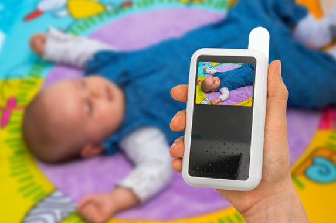
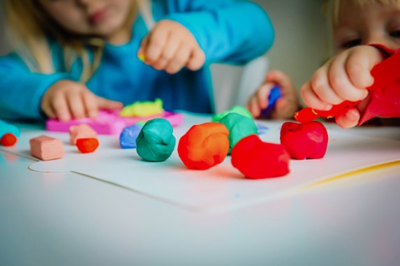
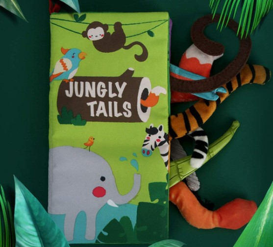
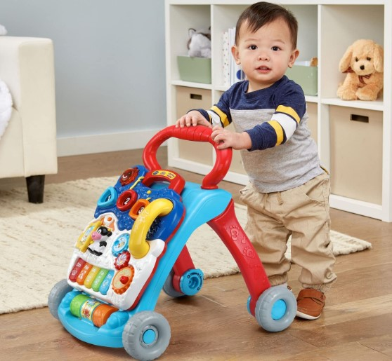
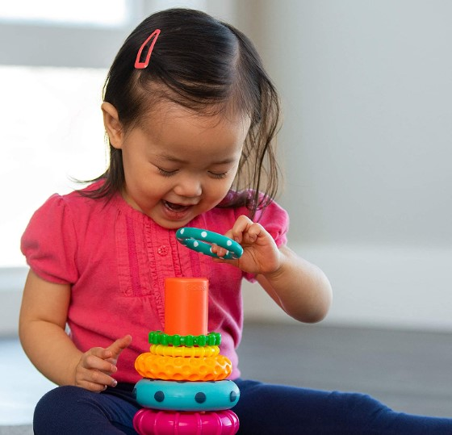
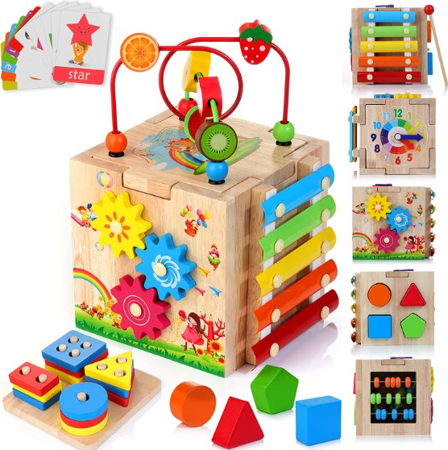
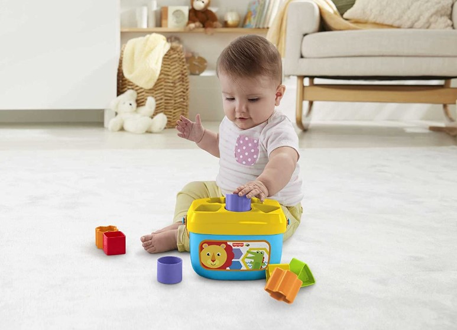
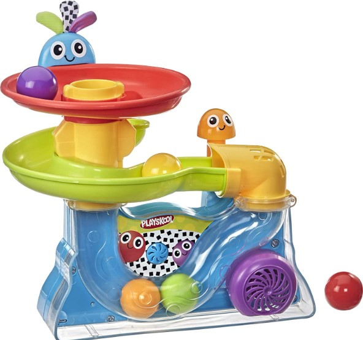
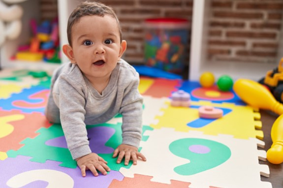

This article has been written and researched by our expert Loveable through a precise methodology. [Learn more about our methodology](https://avada.io/loveable/our-methodological.html)

[Loveable](https://avada.io/loveable/) > [Blog](https://avada.io/loveable/blog/) > [Parenting](https://avada.io/loveable/parenting/)

# 11 Creative and Engaging 9-Month-Old Activities: Ideas to Foster Development and Bonding

Written by [Benjamin Collins](https://avada.io/loveable/author/benjamin/) Last Updated on August 28, 2023

- [11 Creative and Engaging 9-Month-Old Activities](https://avada.io/loveable/blog/9-month-old-activities-ideas/#wp-block-heading-2-3)
    - [1\. Phone Talk](https://avada.io/loveable/blog/9-month-old-activities-ideas/#wp-block-heading-3-4)
    - [2\. Practice using spoons for eating and practice drinking from an open cup](https://avada.io/loveable/blog/9-month-old-activities-ideas/#wp-block-heading-3-7)
    - [3\. Tunnel Time](https://avada.io/loveable/blog/9-month-old-activities-ideas/#wp-block-heading-3-9)
    - [4\. Play Music Together](https://avada.io/loveable/blog/9-month-old-activities-ideas/#wp-block-heading-3-11)
    - [5\. Explore Different Texture](https://avada.io/loveable/blog/9-month-old-activities-ideas/#wp-block-heading-3-14) 
    - [6\. Sand Play](https://avada.io/loveable/blog/9-month-old-activities-ideas/#wp-block-heading-3-16)
    - [7\. Treasure Basket](https://avada.io/loveable/blog/9-month-old-activities-ideas/#wp-block-heading-3-19)
    - [8\. Play with PlayDough](https://avada.io/loveable/blog/9-month-old-activities-ideas/#wp-block-heading-3-21)
    - [9\. Squeak and Hide](https://avada.io/loveable/blog/9-month-old-activities-ideas/#wp-block-heading-3-24)
    - [10\. Stacking Blocks](https://avada.io/loveable/blog/9-month-old-activities-ideas/#wp-block-heading-3-26)
    - [11\. Balloon Pop](https://avada.io/loveable/blog/9-month-old-activities-ideas/#wp-block-heading-3-29)
- [6 Best Educational Toys for 9 Month Old That They’ll Love](https://avada.io/loveable/blog/9-month-old-activities-ideas/#wp-block-heading-2-31) 
    - [1\. Touch and Feel Crinkle Cloth Books](https://avada.io/loveable/blog/9-month-old-activities-ideas/#wp-block-heading-3-32)
    - [2\. Sit-To-Stand Learning Walker](https://avada.io/loveable/blog/9-month-old-activities-ideas/#wp-block-heading-3-35)
    - [3\. Stacking Ring STEM Learning Toy](https://avada.io/loveable/blog/9-month-old-activities-ideas/#wp-block-heading-3-38)
    - [4\. Wooden Activity Cube](https://avada.io/loveable/blog/9-month-old-activities-ideas/#wp-block-heading-3-41)
    - [5\. Fisher-Price Stacking Toy](https://avada.io/loveable/blog/9-month-old-activities-ideas/#wp-block-heading-3-44)
    - [6\. Playskool Busy Ball Popper Toy](https://avada.io/loveable/blog/9-month-old-activities-ideas/#wp-block-heading-3-47) 
- [FAQ 9-Month-Old Activities](https://avada.io/loveable/blog/9-month-old-activities-ideas/#wp-block-heading-2-50) 
    - [1\. What can be taught to a 9-month-old baby?](https://avada.io/loveable/blog/9-month-old-activities-ideas/#wp-block-heading-3-52)
    - [2\. How do I entertain my 9-month-old fussy?](https://avada.io/loveable/blog/9-month-old-activities-ideas/#wp-block-heading-3-54)
    - [3\. What words should a 9-month-old be saying?](https://avada.io/loveable/blog/9-month-old-activities-ideas/#wp-block-heading-3-56)
- [Bottom Line](https://avada.io/loveable/blog/9-month-old-activities-ideas/#wp-block-heading-2-61) 

You might think that 9 months old is too soon for a newborn to have interactive activities. Don’t misunderstand! As a parent or caregiver of a 9-month-old, you may be looking for new and exciting activities to promote your child’s development and strengthen your bond with them. At this age, babies are curious and eager to explore the world around them, making it an ideal time to introduce them to stimulating and interactive activities. 

The good news is that there are several imaginative and interesting **9-month-old activities** that can aid in their cognitive, physical, and social-emotional development. These activities not only allow your baby to learn and grow, but they also give valuable experiences for you and your kid to enjoy. Incorporating sensory play, music, and movement into your everyday routine may be both enjoyable and useful for your 9-month-old. You just need to make sure your baby is always safe while operating activities. Let’s see what it is!

## **11 Creative and Engaging 9-Month-Old Activities**

### **1\. Phone Talk**

Simply place the phone near your baby’s ear and speak to them cheerfully. Tell them about your day, sing a song, or make funny sounds. This exercise can help them improve their listening and communication abilities while also allowing them to bond with you. To protect your baby’s safety, restrict the amount of time he or she spends on the phone.

### **2\. Practice using spoons for eating and practice drinking from an open cup**

Give your baby infant-friendly tools and foods such as Greek yogurt that are easy to scoop for practice. You may also model the habit by sitting at the table with your kid and eating together. Aside from utensils, educating newborns on how to drink from an open cup is critical. Fill a tiny cup with an ounce of water and help your infant bring the cup to their lips. 

### **3\. Tunnel Time**

Make a fun obstacle course for your baby out of a huge cardboard box or a pop-up play tunnel. Crawling through the tunnel will assist your infant in developing gross motor skills and spatial awareness. You may also use the tunnel as a fun hiding place for peek-a-boo games or to encourage your baby to crawl toward you. 

### **4\. Play Music Together**

You don’t have to be a musical genius to enjoy making music with your child; basic instruments such as maracas, bells, and drums are available at most toy stores and may give hours of enjoyment. Encourage your infant to participate by clapping or pounding on an instrument, and remember to dance to the beat!

### **5\. Explore Different Texture** 

Collect a variety of textures, such as a soft blanket, a bouncy ball, a smooth block, and a harsh piece of sandpaper. Allow your baby to touch, hold, and investigate each object as you describe the feel and color. This sensory play exercise fosters your baby’s curiosity and discovery while also promoting cognitive development. 

### **6\. Sand Play**

Fill a shallow container with sand and let your youngster explore the various textures with their hands or child-safe scoops and molds. For added play value, put tiny toys such as automobiles or animals on the sand. Fine motor development and hand-eye coordination can be aided by this form of sensory play.

### **7\. Treasure Basket**

Fill a basket or box with things of various colors and sizes. Natural materials like fruits and vegetables, as well as man-made objects that are suitable for your infant to explore, can be included. Encourage your baby to investigate the things by picking them up, feeling the textures, placing them in their mouth, and experimenting with them in various ways.

### **8\. Play with PlayDough**

While playdough may appear to be a simple toy, it may assist a child’s fine motor skills and hand-eye coordination. Encourage your child to squish, roll, and mold the dough into various shapes and things. You can also supplement their creativity with tools such as plastic knives or rolling pins. 

### **9\. Squeak and Hide**

Squeeze a squeaky toy to produce a noise, then conceal it behind your back, beneath a blanket, or under a pillow and encourage your baby to find it. Repeat the game until your baby is bored. This easy practice is great for helping newborns develop cognitive abilities, auditory skills, and object permanence. It is also a pleasant method to interact with your child and develop a connection. 

### **10\. Stacking Blocks**

Begin by providing your kid with a collection of soft, lightweight blocks. Encourage her to pile them as high as she can before knocking them down. This straightforward game promotes hand-eye coordination, spatial awareness, and fine motor abilities. 

### **11\. Balloon Pop**

Allow your infant to watch while you hold and tap a balloon in the air. Then, let your child to try to tap or strike the balloon. You may also strike the balloon with other parts of their body, such as their hands, feet, or even their head. 

## **6 Best Educational Toys for 9 Month Old That They’ll Love** 

### [**1\. Touch and Feel Crinkle Cloth Books**](https://www.amazon.com/beiens-Crinkle-Children-Development-Interactive/dp/B07TXYC6WD)

The Touch and Feel Crinkle Cloth Books by Beiens are perfect for little explorers! With their brilliant colors and various textures, these charming and interactive books are meant to capture your baby’s interest. These books, made of soft and safe fabric, are ideal for young hands to explore and are constructed to survive many hours of play. You can give your child the gift of discovery and watch their curiosity bloom.

### [**2\.**](https://www.amazon.com/VTech-Sit-to-Stand-Learning-Walker-Blue/dp/B07CRSXMW8/) **[Sit-To-Stand Learning Walker](https://www.amazon.com/VTech-Sit-to-Stand-Learning-Walker-Blue/dp/B07CRSXMW8/)**

The Sit-To-Stand Learning Walker provides fun and learning possibilities with its detachable activity-packed panel. Shape sorters, light-up buttons, and spinning rollers help children improve their fine motor skills and hand-eye coordination. Purchasing this walker is an investment in your child’s sensory development and mobility abilities. It’s a dependable instrument that will keep your child amused while also promoting their overall growth.

### [**3\.**](https://www.amazon.com/Sassy-Stacks-Circles-Stacking-Learning/dp/B07NXDJ52C/r) **[Stacking Ring STEM Learning Toy](https://www.amazon.com/Sassy-Stacks-Circles-Stacking-Learning/dp/B07NXDJ52C/r)**

The Stacking Ring STEM Learning Toy is a fantastic toy that offers multiple benefits for your baby’s development. This toy’s 9-piece set provides infinite options for learning and enjoyment. It’s a durable and BPA-free alternative for babies aged 6 to 24 months. Purchasing this stacking ring toy will not only delight your infant but also aid in his or her cognitive, motor, and sensory development.

### [**4\.**](https://www.amazon.com/HELLOWOOD-Activity-Stacking-Montessori-Learning/dp/B09XKDZT6S) **[Wooden Activity Cube](https://www.amazon.com/HELLOWOOD-Activity-Stacking-Montessori-Learning/dp/B09XKDZT6S)**

Are you looking for the ideal present for your child? Take a look at the Wooden Activity Cube! This cube is likely to capture the imagination of kids aged 1 to 3 with its 8-in-1 design and a wide choice of fascinating activities. This toy has it all, from a bead maze and a baby xylophone to a learning clock and a shape sorter. Don’t pass on this great learning item that will be a hit with both kids and adults!

### [**5\. Fisher-Price Stacking Toy**](https://www.amazon.com/Fisher-Price-FFC84-Babys-First-Blocks/dp/B01NCUSC7V/)

This colorful block set is designed to give hours of fun and learning for babies aged 6 months and above. The blocks are easily put into the bucket for easy cleanup, and the easy-carry handle allows for on-the-go play. Purchase the Fisher-Price Stacking Toy now and watch your child’s abilities and imagination grow!

### [**6\. Playskool Busy Ball Popper Toy**](https://www.amazon.com/Playskool-Explore-Popper-Amazon-Exclusive/dp/B00U5U5VWM) 

As your kid follows colorful balls springing up, rolling down ramps, and racing through transparent tubes, their eyes will light up with delight. This toy gives a great sensory experience that will catch your baby’s interest with exciting music and hilarious sound effects. The simple push-button actuation enables autonomous play, improving motor skill development and building confidence. 

## **FAQ 9-Month-Old Activities** 

### **1\. What can be taught to a 9-month-old baby?**

Babies can be supported in several areas of development. This involves picking up toys and improving fine motor skills by grabbing items ( even crawling or standing). Other important parts of early learning include understanding item permanence and communicating via gestures.

### **2\. How do I entertain my 9-month-old fussy?**

You may begin by providing a range of age-appropriate toys and activities to pique their interest and develop their senses. Singing songs, playing peek-a-boo, or participating in interactive games such as pat-a-cake can also help interest children. 

### **3\. What words should a 9-month-old be saying?**

At around 9 months of age, babies typically start to babble and experiment with different sounds. While they may not have developed clear words yet, they may begin to imitate sounds and syllables. Common babbling sounds include “ma-ma,” “da-da,” and “ba-ba.” 

_**See More:**_

- Fun and Engaging [Activities with 10-Month-Olds](https://avada.io/loveable/blog/activities-with-10-month-olds/)

- Exciting and Educational [Activities for 12-Month-Olds](https://avada.io/loveable/blog/activities-for-12-month-olds/)

## **Bottom Line** 

Finally, engaging in creative and exciting activities with your 9-month-old may significantly influence their development and improve your relationship. The **11 Creative and Engaging 9-Month-Old Activities** listed above offer a wide range of chances for your child to explore, learn, and grow. 

Remember that these activities are intended to support your baby’s general development as much as to entertain them. Each activity provides distinct advantages that enhance their physical and cognitive development. Furthermore, these activities allow you to engage and bond with your kid, providing priceless moments of delight and connection.

As your baby grows and reaches new milestones, it’s vital to modify age-appropriate activities corresponding to their current abilities and interests. You may nourish their growth, engage their curiosity, and build memorable memories together by being thoughtful and present in their playing. So, embrace these **9-month-old activities** and take pleasure in the process of discovery and connecting with your child.

- [11 Creative and Engaging 9-Month-Old Activities](https://avada.io/loveable/blog/9-month-old-activities-ideas/#wp-block-heading-2-3)
    - [1\. Phone Talk](https://avada.io/loveable/blog/9-month-old-activities-ideas/#wp-block-heading-3-4)
    - [2\. Practice using spoons for eating and practice drinking from an open cup](https://avada.io/loveable/blog/9-month-old-activities-ideas/#wp-block-heading-3-7)
    - [3\. Tunnel Time](https://avada.io/loveable/blog/9-month-old-activities-ideas/#wp-block-heading-3-9)
    - [4\. Play Music Together](https://avada.io/loveable/blog/9-month-old-activities-ideas/#wp-block-heading-3-11)
    - [5\. Explore Different Texture](https://avada.io/loveable/blog/9-month-old-activities-ideas/#wp-block-heading-3-14) 
    - [6\. Sand Play](https://avada.io/loveable/blog/9-month-old-activities-ideas/#wp-block-heading-3-16)
    - [7\. Treasure Basket](https://avada.io/loveable/blog/9-month-old-activities-ideas/#wp-block-heading-3-19)
    - [8\. Play with PlayDough](https://avada.io/loveable/blog/9-month-old-activities-ideas/#wp-block-heading-3-21)
    - [9\. Squeak and Hide](https://avada.io/loveable/blog/9-month-old-activities-ideas/#wp-block-heading-3-24)
    - [10\. Stacking Blocks](https://avada.io/loveable/blog/9-month-old-activities-ideas/#wp-block-heading-3-26)
    - [11\. Balloon Pop](https://avada.io/loveable/blog/9-month-old-activities-ideas/#wp-block-heading-3-29)
- [6 Best Educational Toys for 9 Month Old That They’ll Love](https://avada.io/loveable/blog/9-month-old-activities-ideas/#wp-block-heading-2-31) 
    - [1\. Touch and Feel Crinkle Cloth Books](https://avada.io/loveable/blog/9-month-old-activities-ideas/#wp-block-heading-3-32)
    - [2\. Sit-To-Stand Learning Walker](https://avada.io/loveable/blog/9-month-old-activities-ideas/#wp-block-heading-3-35)
    - [3\. Stacking Ring STEM Learning Toy](https://avada.io/loveable/blog/9-month-old-activities-ideas/#wp-block-heading-3-38)
    - [4\. Wooden Activity Cube](https://avada.io/loveable/blog/9-month-old-activities-ideas/#wp-block-heading-3-41)
    - [5\. Fisher-Price Stacking Toy](https://avada.io/loveable/blog/9-month-old-activities-ideas/#wp-block-heading-3-44)
    - [6\. Playskool Busy Ball Popper Toy](https://avada.io/loveable/blog/9-month-old-activities-ideas/#wp-block-heading-3-47) 
- [FAQ 9-Month-Old Activities](https://avada.io/loveable/blog/9-month-old-activities-ideas/#wp-block-heading-2-50) 
    - [1\. What can be taught to a 9-month-old baby?](https://avada.io/loveable/blog/9-month-old-activities-ideas/#wp-block-heading-3-52)
    - [2\. How do I entertain my 9-month-old fussy?](https://avada.io/loveable/blog/9-month-old-activities-ideas/#wp-block-heading-3-54)
    - [3\. What words should a 9-month-old be saying?](https://avada.io/loveable/blog/9-month-old-activities-ideas/#wp-block-heading-3-56)
- [Bottom Line](https://avada.io/loveable/blog/9-month-old-activities-ideas/#wp-block-heading-2-61) 

### [Benjamin Collins](https://avada.io/loveable/author/benjamin/)

I'm Benjamin Collins, a gift ideas creator at Loveable. We specialize in unique and personalized gifts for any occasion. With my honed skills, I recommend gifts tailored to the recipient's personality and interests, whether it's Halloween, Christmas, or any other celebration.

- [Twitter](https://twitter.com/intent/tweet)
- [Facebook](https://www.facebook.com/sharer/sharer.php)
- [instagram](https://avada.io/loveable/blog/9-month-old-activities-ideas/)
- [pinterest](https://www.pinterest.com/loveablellc/)

## Related Posts

[

### 79 Heartfelt Missing Mom Quotes for Expressing Love and Longing

](https://avada.io/loveable/blog/missing-mom-quotes/)

[

### Parenting with Depression: Strategies for Coping, Seeking Help, and Building Resilience

](https://avada.io/loveable/blog/parenting-with-depression/)

[

### 100 Empowering Single Mom Quotes: Inspirational Words for Strong Mothers

](https://avada.io/loveable/blog/single-mom-quotes/)

[

### 99+ Heartfelt Quotes And Wishes: Happy Anniversary to Mom and Dad!

](https://avada.io/loveable/blog/quotes-happy-anniversary-mom-dad/)

[

### 5 Ways to Foster a Positive Parent-Teacher Relationship

](https://avada.io/loveable/blog/parent-teacher-relationship/)
