This article has been written and researched by our expert Loveable through a precise methodology. [Learn more about our methodology](https://avada.io/loveable/our-methodological.html)

[Loveable](https://avada.io/loveable/) > [Blog](https://avada.io/loveable/blog/) > [Holiday](https://avada.io/loveable/holiday/)

# 110 Easy Halloween Costumes for Everyone in 2023

Written by [Blake Simpson](https://avada.io/loveable/author/blake/) Last Updated on August 30, 2023

- [Easy Halloween Costumes for Men](https://avada.io/loveable/blog/easy-halloween-costumes/#wp-block-heading-2-4)
    - [1\. Top Gun Costume](https://avada.io/loveable/blog/easy-halloween-costumes/#wp-block-heading-3-6)
    - [2\. Parks and Recreation Costume](https://avada.io/loveable/blog/easy-halloween-costumes/#wp-block-heading-3-9)
    - [3\. Mario or Luigi Costume](https://avada.io/loveable/blog/easy-halloween-costumes/#wp-block-heading-3-12)
    - [4\. Clark Kent Superman Costume](https://avada.io/loveable/blog/easy-halloween-costumes/#wp-block-heading-3-15)
    - [5\. Blue Pirate Costume](https://avada.io/loveable/blog/easy-halloween-costumes/#wp-block-heading-3-18)
    - [6\. Farmer Costume](https://avada.io/loveable/blog/easy-halloween-costumes/#wp-block-heading-3-21)
    - [7\. Steve Urkel Costume](https://avada.io/loveable/blog/easy-halloween-costumes/#wp-block-heading-3-24)
    - [8\. Dots the Clown Costume](https://avada.io/loveable/blog/easy-halloween-costumes/#wp-block-heading-3-27)
    - [9\. Despicable 3 Movie Minion](https://avada.io/loveable/blog/easy-halloween-costumes/#wp-block-heading-3-30)
    - [10\. Freddy Sweater Costume](https://avada.io/loveable/blog/easy-halloween-costumes/#wp-block-heading-3-33)
    - [11\. Inspector Gadget Costume](https://avada.io/loveable/blog/easy-halloween-costumes/#wp-block-heading-3-36)
    - [12\. ’50 Shades of Grey’ Halloween Costume](https://avada.io/loveable/blog/easy-halloween-costumes/#wp-block-heading-3-39)
    - [13\. Mario Kart Halloween Costume](https://avada.io/loveable/blog/easy-halloween-costumes/#wp-block-heading-3-42)
    - [14\. Dr. Pepper Halloween Costume](https://avada.io/loveable/blog/easy-halloween-costumes/#wp-block-heading-3-45)
    - [15\. Bruce Springsteen Halloween Costume](https://avada.io/loveable/blog/easy-halloween-costumes/#wp-block-heading-3-48)
    - [16\. Elton John Halloween Costume](https://avada.io/loveable/blog/easy-halloween-costumes/#wp-block-heading-3-51)
    - [17\. Brawny Man Halloween Costume](https://avada.io/loveable/blog/easy-halloween-costumes/#wp-block-heading-3-54)
    - [18\. Ferris Bueller From ‘Ferris Bueller’s Day Off’ Halloween Costume](https://avada.io/loveable/blog/easy-halloween-costumes/#wp-block-heading-3-57)
    - [19\. Jon Snow From ‘Game of Thrones’ Halloween Costume](https://avada.io/loveable/blog/easy-halloween-costumes/#wp-block-heading-3-60)
    - [20\. Mister Rogers Halloween Costume](https://avada.io/loveable/blog/easy-halloween-costumes/#wp-block-heading-3-63)
    - [21\. Doc Brown and Marty McFly From ‘Back to the Future’ Halloween Costumes](https://avada.io/loveable/blog/easy-halloween-costumes/#wp-block-heading-3-66)
    - [22\. Mendl’s Man From ‘The Grand Budapest Hotel’ Halloween Costume](https://avada.io/loveable/blog/easy-halloween-costumes/#wp-block-heading-3-69)
    - [23\. Toy Soldier Halloween Costume](https://avada.io/loveable/blog/easy-halloween-costumes/#wp-block-heading-3-72)
    - [24\. Jack Pearson From ‘This Is Us’ Halloween Costume](https://avada.io/loveable/blog/easy-halloween-costumes/#wp-block-heading-3-75)
    - [25\. American Gothic Halloween Costume](https://avada.io/loveable/blog/easy-halloween-costumes/#wp-block-heading-3-78)
    - [26\. Hawaiian Punch Halloween Costume](https://avada.io/loveable/blog/easy-halloween-costumes/#wp-block-heading-3-81)
    - [27\. Chip Gaines From ‘Fixer Upper’ Halloween Costume](https://avada.io/loveable/blog/easy-halloween-costumes/#wp-block-heading-3-84)
    - [28\. Error 404 Halloween Costume](https://avada.io/loveable/blog/easy-halloween-costumes/#wp-block-heading-3-87)
    - [29\. Ron Burgundy From ‘Anchorman’ Halloween Costume](https://avada.io/loveable/blog/easy-halloween-costumes/#wp-block-heading-3-90)
    - [30\. Bob Ross Halloween Costume](https://avada.io/loveable/blog/easy-halloween-costumes/#wp-block-heading-3-93)
    - [31\. ‘Grapes of Wrath’ Halloween Costume](https://avada.io/loveable/blog/easy-halloween-costumes/#wp-block-heading-3-96)
    - [32\. Rip Wheeler from ‘Yellowstone’ Halloween Costume](https://avada.io/loveable/blog/easy-halloween-costumes/#wp-block-heading-3-99)
    - [33\. Movie Theater Floor Halloween Costume](https://avada.io/loveable/blog/easy-halloween-costumes/#wp-block-heading-3-102)
    - [34\. Smart Cookie Halloween Costume](https://avada.io/loveable/blog/easy-halloween-costumes/#wp-block-heading-3-105)
    - [35\. ‘Men in Black’ Halloween Costume](https://avada.io/loveable/blog/easy-halloween-costumes/#wp-block-heading-3-108)
    - [36\. Blessing in Disguise Halloween Costume](https://avada.io/loveable/blog/easy-halloween-costumes/#wp-block-heading-3-111)
    - [37\. Pizza Delivery Man Costume](https://avada.io/loveable/blog/easy-halloween-costumes/#wp-block-heading-3-114)
    - [38\. Inspector Gadget Costume](https://avada.io/loveable/blog/easy-halloween-costumes/#wp-block-heading-3-117)
    - [39\. ‘When Life Gives You Lemons’ Costume](https://avada.io/loveable/blog/easy-halloween-costumes/#wp-block-heading-3-120)
    - [40\. Buzz Lightyear Sweatshirt](https://avada.io/loveable/blog/easy-halloween-costumes/#wp-block-heading-3-123)
- [Easy Halloween Costumes for Women](https://avada.io/loveable/blog/easy-halloween-costumes/#wp-block-heading-2-126)
    - [1\. Rosie the Riveter](https://avada.io/loveable/blog/easy-halloween-costumes/#wp-block-heading-3-128)
    - [2\. DIY Candy Corn Costume](https://avada.io/loveable/blog/easy-halloween-costumes/#wp-block-heading-3-131)
    - [3\. DIY Scarecrow Costume](https://avada.io/loveable/blog/easy-halloween-costumes/#wp-block-heading-3-134)
    - [4\. Coffee Filter Mermaid Costume](https://avada.io/loveable/blog/easy-halloween-costumes/#wp-block-heading-3-137)
    - [5\. Baby from “Dirty Dancing”](https://avada.io/loveable/blog/easy-halloween-costumes/#wp-block-heading-3-140)
    - [6\. Raincloud Costume](https://avada.io/loveable/blog/easy-halloween-costumes/#wp-block-heading-3-143)
    - [7\. Pop-Tart Costume](https://avada.io/loveable/blog/easy-halloween-costumes/#wp-block-heading-3-146)
    - [8\. Superquilter Costume](https://avada.io/loveable/blog/easy-halloween-costumes/#wp-block-heading-3-149)
    - [9\. DIY Balloon Snake Medusa](https://avada.io/loveable/blog/easy-halloween-costumes/#wp-block-heading-3-152)
    - [10\. Smarty Pants Halloween Costume](https://avada.io/loveable/blog/easy-halloween-costumes/#wp-block-heading-3-155)
    - [11\. Belle Halloween Costume for Women](https://avada.io/loveable/blog/easy-halloween-costumes/#wp-block-heading-3-158)
    - [12\. DIY Ice Cream Halloween Costume](https://avada.io/loveable/blog/easy-halloween-costumes/#wp-block-heading-3-161)
    - [13\. Head in the Clouds](https://avada.io/loveable/blog/easy-halloween-costumes/#wp-block-heading-3-164)
    - [14\. Minnie Mouse Costume](https://avada.io/loveable/blog/easy-halloween-costumes/#wp-block-heading-3-167)
    - [15\. Cuckoo Clock](https://avada.io/loveable/blog/easy-halloween-costumes/#wp-block-heading-3-170)
    - [16\. Picnic Blanket Costume](https://avada.io/loveable/blog/easy-halloween-costumes/#wp-block-heading-3-173)
    - [17\. Bat Costume](https://avada.io/loveable/blog/easy-halloween-costumes/#wp-block-heading-3-176)
    - [18\. Mona Lisa Halloween Costume](https://avada.io/loveable/blog/easy-halloween-costumes/#wp-block-heading-3-179)
    - [19\. Burger Costume](https://avada.io/loveable/blog/easy-halloween-costumes/#wp-block-heading-3-182)
    - [20\. Katherine Johnson Costume (from ‘Hidden Figures’)](https://avada.io/loveable/blog/easy-halloween-costumes/#wp-block-heading-3-185)
    - [21\. Patriotic Popsicle Costume](https://avada.io/loveable/blog/easy-halloween-costumes/#wp-block-heading-3-188)
    - [22\. Easy Sailor Costume DIY](https://avada.io/loveable/blog/easy-halloween-costumes/#wp-block-heading-3-191)
    - [23\. DIY Houseplant Halloween Boxtume](https://avada.io/loveable/blog/easy-halloween-costumes/#wp-block-heading-3-194)
    - [24\. Ghost Costume](https://avada.io/loveable/blog/easy-halloween-costumes/#wp-block-heading-3-197)
    - [25\. Rey Costume](https://avada.io/loveable/blog/easy-halloween-costumes/#wp-block-heading-3-200)
    - [26\. Firefly Jar Costume](https://avada.io/loveable/blog/easy-halloween-costumes/#wp-block-heading-3-203)
    - [27\. Bunch of Asparagus Costume](https://avada.io/loveable/blog/easy-halloween-costumes/#wp-block-heading-3-206)
    - [28\. It’s Raining Men Costume](https://avada.io/loveable/blog/easy-halloween-costumes/#wp-block-heading-3-209)
    - [29\. Easy Tinker Bell Halloween Costume](https://avada.io/loveable/blog/easy-halloween-costumes/#wp-block-heading-3-212)
    - [30\. Buttered Toast Costume](https://avada.io/loveable/blog/easy-halloween-costumes/#wp-block-heading-3-215)
    - [31\. DIY Bubble Tea Boba Halloween Costume](https://avada.io/loveable/blog/easy-halloween-costumes/#wp-block-heading-3-218)
    - [32\. Paper Doll Halloween Costume for Women](https://avada.io/loveable/blog/easy-halloween-costumes/#wp-block-heading-3-221)
    - [33\. Lucy & Ethel DIY Costume](https://avada.io/loveable/blog/easy-halloween-costumes/#wp-block-heading-3-224)
- [Easy Halloween Costumes for Kids](https://avada.io/loveable/blog/easy-halloween-costumes/#wp-block-heading-2-228)
    - [1\. Corn Halloween Costume](https://avada.io/loveable/blog/easy-halloween-costumes/#wp-block-heading-3-230)
    - [2\. DIY Garden Gnome Costume](https://avada.io/loveable/blog/easy-halloween-costumes/#wp-block-heading-3-233)
    - [3\. Ted Lasso Kids’ Costumes](https://avada.io/loveable/blog/easy-halloween-costumes/#wp-block-heading-3-236)
    - [4\. DIY Baseball Trophy Costume](https://avada.io/loveable/blog/easy-halloween-costumes/#wp-block-heading-3-239)
    - [5\. Bushel of Apples Costume](https://avada.io/loveable/blog/easy-halloween-costumes/#wp-block-heading-3-242)
    - [6\. DIY Gingham Witch Halloween Costumes](https://avada.io/loveable/blog/easy-halloween-costumes/#wp-block-heading-3-245)
    - [7\. DIY Strawberry Halloween Costume](https://avada.io/loveable/blog/easy-halloween-costumes/#wp-block-heading-3-248)
    - [8\. DIY Cowboy and Horse Halloween Costume](https://avada.io/loveable/blog/easy-halloween-costumes/#wp-block-heading-3-251)
    - [9\. DIY Haunted House Halloween Costume](https://avada.io/loveable/blog/easy-halloween-costumes/#wp-block-heading-3-254)
    - [10\. “Dairy Queen” and Ice Cream Delivery Man](https://avada.io/loveable/blog/easy-halloween-costumes/#wp-block-heading-3-257)
    - [11\. DIY Jar of Pickles and Pickle Halloween Costumes](https://avada.io/loveable/blog/easy-halloween-costumes/#wp-block-heading-3-260)
    - [12\. DIY White Swan Halloween Costume](https://avada.io/loveable/blog/easy-halloween-costumes/#wp-block-heading-3-263)
    - [13\. DIY Cheese Grater & Wedge of Cheese Halloween Costumes](https://avada.io/loveable/blog/easy-halloween-costumes/#wp-block-heading-3-266)
    - [14\. DIY Hot-Air Balloon Halloween Costume](https://avada.io/loveable/blog/easy-halloween-costumes/#wp-block-heading-3-269)
    - [15\. DIY Librarian Halloween Costume](https://avada.io/loveable/blog/easy-halloween-costumes/#wp-block-heading-3-272)
    - [16\. DIY Lego Block Halloween Costume](https://avada.io/loveable/blog/easy-halloween-costumes/#wp-block-heading-3-275)
    - [17\. DIY Flower Pot Halloween Costume](https://avada.io/loveable/blog/easy-halloween-costumes/#wp-block-heading-3-278)
    - [18\. DIY Star Wars Obi-Wan Halloween Costume](https://avada.io/loveable/blog/easy-halloween-costumes/#wp-block-heading-3-281)
    - [19\. DIY ‘Where the Wild Things Are’ Halloween Costume](https://avada.io/loveable/blog/easy-halloween-costumes/#wp-block-heading-3-284)
    - [20\. DIY Homemade Lemon-Lime Halloween Costumes](https://avada.io/loveable/blog/easy-halloween-costumes/#wp-block-heading-3-287)
    - [21\. DIY Where’s Waldo? Halloween Costume](https://avada.io/loveable/blog/easy-halloween-costumes/#wp-block-heading-3-290)
    - [22\. DIY Baby Gumball Machine Halloween Costume](https://avada.io/loveable/blog/easy-halloween-costumes/#wp-block-heading-3-293)
    - [23\. DIY Football Field Halloween Costume](https://avada.io/loveable/blog/easy-halloween-costumes/#wp-block-heading-3-296)
    - [24\. DIY Cowboy and Cowgirl Halloween Costumes](https://avada.io/loveable/blog/easy-halloween-costumes/#wp-block-heading-3-299)
    - [25\. DIY Penny Halloween Costume](https://avada.io/loveable/blog/easy-halloween-costumes/#wp-block-heading-3-302)
    - [26\. DIY No-Sew Care Bears Halloween Costume](https://avada.io/loveable/blog/easy-halloween-costumes/#wp-block-heading-3-305)
    - [27\. DIY Bullseye Halloween Costume](https://avada.io/loveable/blog/easy-halloween-costumes/#wp-block-heading-3-308)
- [Easy Couples Halloween Costumes](https://avada.io/loveable/blog/easy-halloween-costumes/#wp-block-heading-2-312)
    - [1\. KFC Fried Chicken & Colonel Sanders](https://avada.io/loveable/blog/easy-halloween-costumes/#wp-block-heading-3-314)
    - [2\. Fisherman & Trout](https://avada.io/loveable/blog/easy-halloween-costumes/#wp-block-heading-3-317)
    - [3\. Lumberjack & Tree](https://avada.io/loveable/blog/easy-halloween-costumes/#wp-block-heading-3-320)
    - [4\. Princess Peach & Mario](https://avada.io/loveable/blog/easy-halloween-costumes/#wp-block-heading-3-323)
    - [5\. Lightning Bolt & Strike Victim](https://avada.io/loveable/blog/easy-halloween-costumes/#wp-block-heading-3-326)
    - [6\. Nintendo Switch Controller Couple’s Costume](https://avada.io/loveable/blog/easy-halloween-costumes/#wp-block-heading-3-329)
    - [7\. Prom King & Queen](https://avada.io/loveable/blog/easy-halloween-costumes/#wp-block-heading-3-332)
    - [8\. Super Parents](https://avada.io/loveable/blog/easy-halloween-costumes/#wp-block-heading-3-335)
    - [9\. “The Princess Bride” Couple’s Costume](https://avada.io/loveable/blog/easy-halloween-costumes/#wp-block-heading-3-338)
    - [10\. Bonnie & Clyde](https://avada.io/loveable/blog/easy-halloween-costumes/#wp-block-heading-3-341)
- [Bottom Line](https://avada.io/loveable/blog/easy-halloween-costumes/#wp-block-heading-2-344)

When it comes to choosing a costume, convenience and simplicity are key. That’s why these easy [Halloween costumes](https://avada.io/loveable/halloween-costume-ideas/) are designed to be hassle-free and require minimal effort to put together. Whether you’re searching for a last-minute option or prefer a stress-free approach to dressing up, these costume ideas cater to everyone, from kids to adults.

From classic characters like witches, vampires, and superheroes to trendy pop culture icons and clever pun-based costumes, this collection has something for everyone. Whether you want to evoke nostalgia, show off your sense of humor, or channel your favorite [Halloween movie](https://avada.io/loveable/blog/best-halloween-movies/) or TV show character, the variety of easy Halloween costumes ensures there’s a perfect match for your imagination.

So, get ready to embrace the spirit of Halloween and choose from the **110 easy Halloween costumes** for everyone in 2023. With these ideas at your fingertips, you’ll be able to effortlessly bring your Halloween vision to life and join in the fun-filled festivities. Whether you’re trick-or-treating, attending a costume party, or simply embracing the holiday spirit, these easy Halloween costumes will ensure you stand out in style.

## **Easy Halloween Costumes for Men**

These easy Halloween costumes for men offer a wide range of options, from classic characters to pop culture references. Whether you want to embody a beloved superhero, a comedic TV show character, or [a spooky symbol](https://avada.io/loveable/blog/halloween-symbols-explained/), these costume ideas are perfect for a fun and memorable Halloween celebration. 

### **1\. [Top Gun Costume](https://www.amazon.com/Leg-Avenue-Mens-Flight-Costume/dp/B005F50EOC)**

Take to the skies with the iconic Top Gun Costume. Dress up as Maverick or Iceman in a classic flight suit, aviator sunglasses, and military patches. This easy Halloween costume pays homage to the beloved ’80s film and is perfect for those who want to channel their inner pilot. Channel your inner Maverick with this classic fighter pilot outfit. You’ll be soaring high with style and confidence all night.

### **2\. [Parks and Recreation Costume](https://www.amazon.com/Plus-Parks-Recreation-Macklin-Costume/dp/B07ZBLN769)**

Show off your comedic side with a Parks and Recreation Costume. Dress up as Ron Swanson or Andy Dwyer with a plaid shirt, rugged beard, and a deadpan expression. This easy Halloween costume allows you to embody the quirky characters from the popular TV show. Embrace the quirky charm of your favorite TV show characters with a Parks and Recreation-themed costume. It’s an easy way to bring some humor to the Halloween celebration.

### **3\. [Mario or Luigi Costume](https://www.amazon.co.uk/YUUGYD-Brothers-Bodysuit-Carnival-Halloween/dp/B0BS494X47/ref=pd_lpo_sccl_1/261-4299510-2332552?pd_rd_w=9rGkv&content-id=amzn1.sym.efc89c20-c5a9-4620-b6cd-2f4e51bac956&pf_rd_p=efc89c20-c5a9-4620-b6cd-2f4e51bac956&pf_rd_r=30508V8MFD9XYPPAKV44&pd_rd_wg=e5QhN&pd_rd_r=02141523-b206-4c95-ad33-c69880707353&pd_rd_i=B0BS49SPCC&psc=1)**

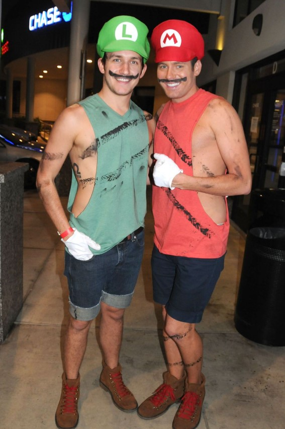

Jump into the world of video games with a Mario or Luigi Costume. Wear blue overalls, a red or green shirt, and a matching hat. This classic and easy Halloween costume is perfect for fans of the Super Mario franchise and is instantly recognizable. Join the iconic Mario Bros duo for a nostalgic and fun Halloween adventure. These costumes will take you back to the golden age of gaming.

### **4\. [Clark Kent Superman Costume](https://www.amazon.in/SUIT-YOURSELF-Superman-Accessory-Standard/dp/B07RJTN4Z1)**

Transform into the mild-mannered reporter with the Clark Kent Superman Costume. Wear a dress shirt, tie, and glasses along with a Superman logo peeking out from under your shirt. This easy Halloween costume allows you to showcase your superhero alter ego.Transform into the Man of Steel by donning the classic Clark Kent outfit. Who knows, you might even find yourself saving the day!

### **5\. [Blue Pirate Costume](https://www.amazon.com/Captain-Jack-Sparrow-Costume-Large/dp/B09J96FFVF?source=ps-sl-shoppingads-lpcontext&ref_=fplfs&psc=1&smid=A2QICQIKTA4BNJ)**

Set sail on the high seas with a Blue Pirate Costume. Wear a pirate hat, eye patch, striped shirt, and a belt with a toy sword. This easy Halloween costume is perfect for those who want to embrace their inner swashbuckler. Arrr, matey! Sail the high seas in style with a dashing blue pirate costume that is sure to turn heads.

### **6\. [Farmer Costume](https://www.amazon.com/Fun-World-Braggart-Farmer-Costume/dp/B07ZDMQKXF)**

Get back to your roots with a Farmer Costume. Wear overalls, a plaid shirt, and a straw hat. Complete the look with a toy pitchfork or a basket of vegetables. This easy Halloween costume captures the rustic charm of a farmer. Keep it simple and charming with a classic farmer costume. You’ll be reaping compliments left and right! Did somebody say, “Did I do that?” Bring the beloved ’90s sitcom character to life with a Steve Urkel costume that will have everyone reminiscing.

### **7\. [Steve Urkel Costume](https://www.amazon.com/Party-City-Neighborhood-Halloween-Suspenders/dp/B08GYMLX1B/ref=sr_1_4?keywords=steve+urkel+costume&qid=1691913257&sr=8-4)**

Step into the shoes of the beloved ’90s character with a Steve Urkel Costume. Wear high-waisted pants, suspenders, a colorful shirt, and oversized glasses. This easy Halloween costume is perfect for fans of the TV show Family Matters. Did somebody say “Did I do that?” Bring the beloved ’90s sitcom character to life with a Steve Urkel costume that will have everyone reminiscing.

### **8\. [Dots the Clown Costume](https://www.amazon.com/Rubies-Haunted-House-Collection-Dotted/dp/B0BRTJPBX7)**

Bring out your playful side with a Dots the Clown Costume. Wear colorful clothing, a clown wig, and paint your face with a big smile and rosy cheeks. This easy Halloween costume is sure to spread joy and laughter. Unleash your playful side with a colorful and cheerful clown costume that will spread joy wherever you go.

### **9\. [Despicable 3 Movie Minion](https://www.amazon.com/Rubies-Despicable-Movie-Minion-Costume/dp/B074CRKFK4)**

Embrace your mischievous side with a Despicable Me Minion Costume. Wear a yellow shirt, denim overalls, and accessorize with goggles and a yellow beanie. This easy Halloween costume is perfect for fans of the popular animated film series. Join Gru’s adorable Minions for a mischievous Halloween filled with laughter and fun.

### **10\. [Freddy Sweater Costume](https://www.amazon.com/Rubies-Costume-Nightmare-Deluxe-Sweater/dp/B00IMB19A4)**

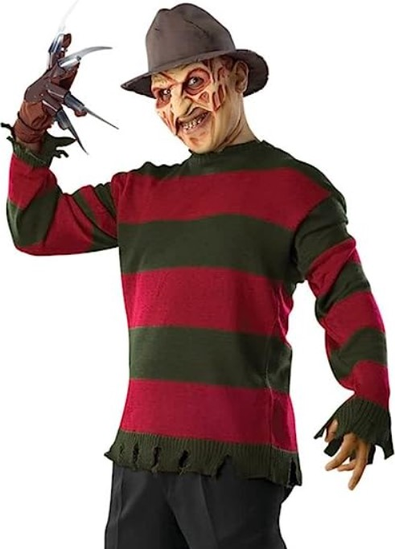

Pay homage to the horror genre with a Freddy Sweater Costume. Wear a striped sweater, a fedora hat, and a glove with plastic knives. This easy Halloween costume allows you to transform into the iconic horror character, Freddy Krueger. Pay homage to the horror genre with a Freddy Krueger-inspired sweater costume that is equal parts spooky and iconic.

### **11\. Inspector Gadget Costume**

Gear up as the gadget-loving detective with an Inspector Gadget Costume. Wear a tan trench coat, a hat, and accessorize with gadgets and gizmos. This easy Halloween costume allows you to bring out your inner sleuth and embrace the whimsy of this beloved character. Go, go, Gadget costume! Transform into the lovable and gadget-equipped detective for a thrilling Halloween adventure.

### **12\. ’50 Shades of Grey’ Halloween Costume**

Add a touch of humor to your Halloween with a ’50 Shades of Grey’ Costume. Wear a gray suit or outfit and attach paint swatches in varying shades of gray. This easy Halloween costume is a playful and clever twist on the popular [Halloween book](https://avada.io/loveable/blog/halloween-books/) and movie series. Get creative and play with fifty shades of grey in a costume that will surely make a statement.

### **13\. Mario Kart Halloween Costume**

Race into Halloween with a Mario Kart Costume. Dress up as your favorite characters from the game, such as Mario, Luigi, or Yoshi. Wear overalls, and a colorful shirt, and accessorize with hats or mustaches. This easy Halloween costume will bring nostalgia and fun to your festivities. Race into Halloween fun with a Mario Kart costume that will have you feeling like a true competitor on the track.

### **14\. Dr. Pepper Halloween Costume**

Quench your Halloween thirst with a Dr. Pepper Costume. Wear a shirt with the Dr. Pepper logo, carry a can or bottle, and accessorize with a doctor’s coat or stethoscope. This easy Halloween costume is perfect for fans of the popular soft drink. Quench your thirst for a unique costume with a Dr. Pepper-inspired outfit that’s both refreshing and fun.

### **15\. Bruce Springsteen Halloween Costume**

Rock the night away with a Bruce Springsteen Costume. Dress in denim, wear a bandana, and carry a guitar. This easy Halloween costume allows you to embody the spirit of “The Boss” and channel the energy of a rock star. Rock the night away as the legendary Bruce Springsteen, bringing his charisma and talent to the Halloween stage.

### **16\. Elton John Halloween Costume**

Bring the glitz and glam with an Elton John Costume. Dress in colorful and flamboyant clothing, wear oversized sunglasses, and style your hair in a signature Elton John fashion. This easy Halloween costume is a tribute to the iconic music legend. Embrace your inner rockstar with an Elton John costume that captures the glitz and glam of his iconic style.

### **17\. Brawny Man Halloween Costume**

Channel your inner lumberjack with a Brawny Man Costume. Wear a plaid shirt, jeans, and accessorize with a roll of paper towels. This easy Halloween costume embraces the rugged and handy aesthetic of the Brawny paper towel brand. Show off your rugged side with a Brawny Man costume that exudes strength and reliability.

### **18\. Ferris Bueller From ‘Ferris Bueller’s Day Off’ Halloween Costume**

Take a day off with a Ferris Bueller Costume. Dress in a casual ’80s outfit, wear a leather jacket, and sport sunglasses. This easy Halloween costume pays homage to the iconic character from the beloved film. Take a day off from the ordinary and step into the shoes of the charismatic Ferris Bueller.

### **19\. Jon Snow From ‘Game of Thrones’ Halloween Costume**

Embrace the world of Westeros with a Jon Snow Costume. Dress in medieval-inspired clothing, wear a fur cape, and carry a sword. This easy Halloween costume allows you to embody the valor and brooding presence of the popular character from ‘Game of Thrones.’ Winter is coming, so gear up as Jon Snow and prepare to defend the realm.

### **20\. Mister Rogers Halloween Costume**

Pay tribute to a beloved television personality with a Mister Rogers Costume. Wear a cardigan, slacks, and accessorize with a red tie and a puppet friend. This easy Halloween costume embodies the warmth and kindness of Mister Rogers. Be the friendly neighbor everyone loves by dressing up as the beloved Mister Rogers.

### **21\. Doc Brown and Marty McFly From ‘Back to the Future’ Halloween Costumes**

Travel through time with a Doc Brown or Marty McFly Costume. Dress in ’80s-inspired clothing, wear a lab coat or a red vest, and style your hair accordingly. This easy Halloween costume is a nod to the iconic characters from the ‘Back to the Future’ film series. Time travel back to the ’80s with these iconic characters from the classic movie.

### **22\. Mendl’s Man From ‘The Grand Budapest Hotel’ Halloween Costume**

Embrace the whimsy of Wes Anderson’s film with a Mendl’s Man Costume. Dress in a purple suit, wear a mustache, and carry a box of pastries. This easy Halloween costume pays homage to the distinctive style of the movie ‘The Grand Budapest Hotel.’ Add a touch of elegance and quirkiness to the Halloween festivities with a Mendl’s Man costume.

### **23\. Toy Soldier Halloween Costume**

March into Halloween with a Toy Soldier Costume. Wear a green military-style uniform, accessorize with a toy rifle, and paint your face to resemble a toy soldier. This easy Halloween costume is both nostalgic and visually striking. Stand tall and proud as a toy soldier, bringing childhood nostalgia to life.

### **24\. Jack Pearson From ‘This Is Us’ Halloween Costume**

Embody the role of a caring father with a Jack Pearson Costume. Dress in ’80s-inspired clothing, wear a plaid shirt, and carry a photo of your loved ones. This easy Halloween costume is a tribute to the beloved character from the TV show ‘This Is Us.’ Embody the kind-hearted and lovable Jack Pearson from the hit TV series ‘This Is Us.’

### **25\. American Gothic Halloween Costume**

Recreate the iconic painting with an American Gothic Costume. Dress in classic farmer attire, wear a black suit and a white shirt, and carry a pitchfork. This easy Halloween costume is a creative and recognizable option for art enthusiasts. Recreate the iconic painting and become a part of art history with this unique costume idea.

### **26\. Hawaiian Punch Halloween Costume**

Bring a punch of tropical flavor with a Hawaiian Punch Costume. Dress in Hawaiian-inspired clothing, wear a lei, and carry a boxing glove painted with a tropical design. This easy Halloween costume pays homage to the popular fruit punch brand. Pack a punch with a playful and punny Hawaiian Punch costume that’s sure to be a hit.

### **27\. Chip Gaines From ‘Fixer Upper’ Halloween Costume**

Get ready for some home improvement with a Chip Gaines Costume. Dress in casual attire, wear a tool belt, and carry a clipboard or blueprints. This easy Halloween costume allows you to channel the charismatic personality of the beloved TV show host. DIY your way into Halloween as the beloved Chip Gaines from the popular home renovation show.

### **28\. Error 404 Halloween Costume**

Add a touch of humor to your Halloween with an Error 404 Costume. Dress in normal clothing and attach a sign or sticker that reads “Error 404 Costume Not Found.” This easy Halloween costume is a playful nod to technology and will bring a smile to everyone’s face. Show off your wit and humor with an Error 404 costume that will leave everyone laughing.

### **29\. Ron Burgundy From ‘Anchorman’ Halloween Costume**

Bring the newsroom charm with a Ron Burgundy Costume. Dress in a suit, wear a mustache, and carry a microphone. This easy Halloween costume pays homage to the memorable character from the comedy film ‘Anchorman.’ Channel your inner anchorman with a Ron Burgundy costume that’s classy and hilarious.

### **30\. Bob Ross Halloween Costume**

Unleash your creativity with a Bob Ross Costume. Dress in jeans, wear a denim shirt, and sport a curly wig. Carry a paintbrush and a palette for added authenticity. This easy Halloween costume allows you to embody the beloved TV painter. Let your creativity shine with a Bob Ross costume that’s as calming as it is artistic.

### **31\. ‘Grapes of Wrath’ Halloween Costume**

Embrace the literary world with a ‘Grapes of Wrath’ Costume. Dress in rugged clothing, carry a bindle stick, and paint on dirt smudges for effect. This easy Halloween costume pays homage to the classic novel by John Steinbeck. Showcase your literary knowledge with a creative costume inspired by this classic novel.

### **32\. Rip Wheeler from ‘Yellowstone’ Halloween Costume**

Channel your inner cowboy with a Rip Wheeler Costume. Dress in Western-style clothing, wear a cowboy hat, and accessorize with a belt buckle and boots. This easy Halloween costume embodies the rugged and charismatic character from the TV show ‘Yellowstone.’ Saddle up and become the rugged cowboy, Rip Wheeler, from the popular TV series ‘Yellowstone.’

### **33\. Movie Theater Floor Halloween Costume**

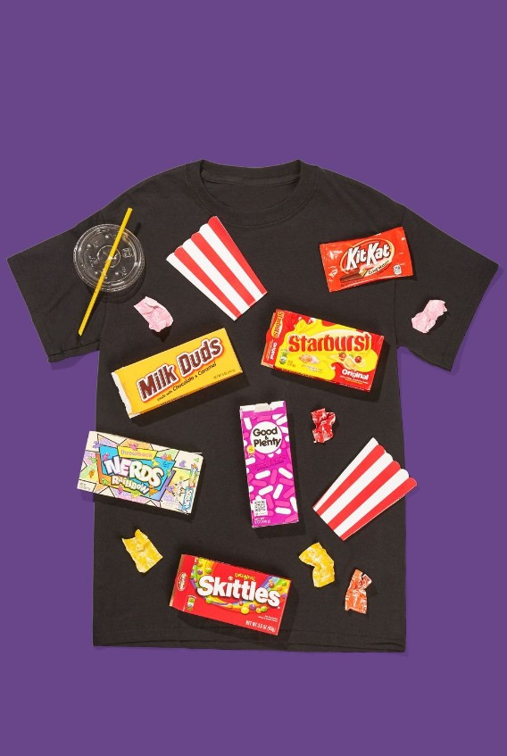

Get creative with a Movie Theater Floor Costume. Dress in black clothing and attach empty popcorn boxes, candy wrappers, and soda cups to your outfit. This easy Halloween costume is a playful and unique option that will surely grab attention. Turn heads and get people talking with a clever and eye-catching movie theater floor costume.

### **34\. Smart Cookie Halloween Costume**

Show off your intelligence with a Smart Cookie Costume. Dress as a classic cookie, wear glasses, and carry a book or a graduation cap. This easy Halloween costume is a clever and punny way to showcase your wit. Prove that you’re one smart cookie with a costume that’s equal parts brainy and sweet.

### **35\. ‘Men in Black’ Halloween Costume**

Become a secret agent with a ‘Men in Black’ Costume. Dress in a black suit, wear sunglasses, and carry a neuralyzer or a toy alien. This easy Halloween costume allows you to step into the world of extraterrestrial investigations. Suit up as an agent from the ‘Men in Black’ and protect the world from extraterrestrial threats.

### **36\. Blessing in Disguise Halloween Costume**

Embrace the humor of unexpected surprises with a Blessing in Disguise Costume. Dress in an angelic outfit with a halo and wings, and carry a sign that says “Blessing in Disguise.” This easy Halloween costume is a clever way to bring laughter and positivity to any Halloween gathering. Turn a phrase into a costume with a blessing-in-disguise outfit that’s sure to make people think.

### **37\. Pizza Delivery Man Costume**

Deliver some fun with a Pizza Delivery Man Costume. Dress in a casual outfit, wear a pizza delivery hat or visor, and carry a pizza box. This easy Halloween costume pays homage to the beloved pizza delivery service and is perfect for pizza lovers. Deliver smiles and cheesy goodness with a pizza delivery man costume that’s both easy and fun.

### **38\. Inspector Gadget Costume**

Become the ultimate crime-fighting detective with an Inspector Gadget Costume. Dress in a trench coat, wear a hat, and accessorize with gadgets such as a magnifying glass or a toy phone. This easy Halloween costume allows you to embrace the quirky and adventurous spirit of the famous cartoon character. Go, go, Gadget costume! Transform into the lovable and gadget-equipped detective for a thrilling Halloween adventure.

### **39\. ‘When Life Gives You Lemons’ Costume**

Turn a sour situation into a sweet one with a ‘When Life Gives You Lemons’ Costume. Dress in yellow clothing, wear a sign that says “When Life Gives You Lemons,” and carry a basket of lemons. This easy Halloween costume is a playful reminder to make the best of any situation. Make the most of Halloween with a costume that turns lemons into a humorous and creative outfit.

### **40\. Buzz Lightyear Sweatshirt**

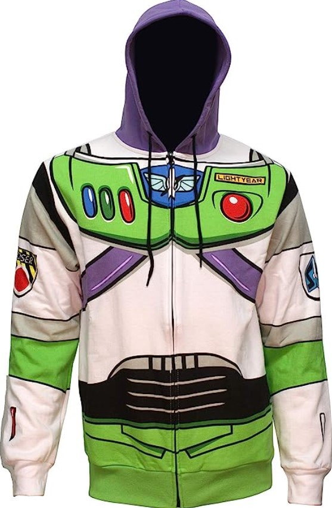

Bring the magic of Toy Story with a Buzz Lightyear Sweatshirt. Wear a sweatshirt with Buzz Lightyear’s iconic spacesuit design, along with jeans or pants. This easy Halloween costume allows you to embody the adventurous and heroic character from the beloved Pixar film. Take flight as the beloved Buzz Lightyear with a cozy and fun Buzz Lightyear sweatshirt costume.

## **Easy Halloween Costumes for Women**

These easy Halloween costumes for women offer a range of options, from iconic characters to creative DIY ideas. Whether you want to embody the strength of Rosie the Riveter or transform into a mythical creature like Medusa, these costume ideas are perfect for expressing your individuality and having fun during the Halloween season.

### **1\. Rosie the Riveter**

Embrace empowerment with a Rosie the Riveter Costume. Channel strength and determination by wearing a denim shirt, tying a red bandana around your head, and adding bold red lipstick. This easy Halloween costume celebrates female empowerment and makes a strong statement. Embody strength and empowerment as Rosie the Riveter, the iconic symbol of women’s resilience.

### **2\. DIY Candy Corn Costume**

Bring the iconic Halloween candy to life with a DIY Candy Corn Costume. Create a three-layered dress or outfit in white, orange, and yellow to resemble the candy corn. This easy Halloween costume is sweet and festive, perfect for Halloween parties or trick-or-treating. Sweeten up the Halloween festivities with a delightful candy corn-inspired costume that’s as easy as it is cute.

### **3\. DIY Scarecrow Costume**

Get into the autumn spirit with a DIY Scarecrow Costume. Wear a plaid shirt, overalls or jeans, and add straw accents to your clothing and hat. This easy Halloween costume captures the charm of a friendly scarecrow in a creative and playful way. Embrace the charm of the harvest season with a DIY scarecrow costume that will showcase your creativity.

### **4\. Coffee Filter Mermaid Costume**

Dive into the enchanting world of mermaids with a Coffee Filter Mermaid Costume. Use coffee filters to create a stunning mermaid tail, and pair it with a seashell-inspired top. This easy Halloween costume is unique and captures the magical essence of mermaid lore. Unleash your inner sea siren with a stunning mermaid costume made from coffee filters for a unique twist.

### **5\. Baby from “Dirty Dancing”**

Recreate the iconic dance moments from “Dirty Dancing” with a Baby Costume. Wear a flowy dress, carry a watermelon prop, and style your hair in a ’60s-inspired updo. This easy Halloween costume allows you to embody the youthful spirit and nostalgia of the beloved film. Step back into the ’80s with a nostalgic Baby costume inspired by the classic movie “Dirty Dancing.”

### **6\. Raincloud Costume**

Make a splash with a Raincloud Costume. Wear shades of gray, attach fluffy cotton balls or felt raindrops to an umbrella or your clothing, and add rain boots. This easy Halloween costume is whimsical and unique, bringing a touch of weather-inspired creativity to your Halloween look. Bring a little rain to the Halloween party with an adorable raincloud costume that will make everyone smile.

### **7\. Pop-Tart Costume**

Indulge your nostalgia with a Pop-Tart Costume. Create a large Pop-Tart shape out of cardboard or foam, decorate it with colorful fabric or paint, and wear it as a front-and-back sandwich board. This easy Halloween costume is a fun and playful homage to the beloved breakfast treat. Turn a childhood favorite into a fun and quirky costume with a Pop-Tart-inspired outfit.

### **8\. Superquilter Costume**

Unleash your superpowers with a Superquilter Costume. Wear a cape adorned with quilting motifs, and accessorize with a sewing machine or quilting tools. This easy Halloween costume celebrates the creative talents of quilters and their ability to bring warmth and joy through their craft. Show off your super quilting skills with a creative and crafty Superquilter costume.

### **9\. DIY Balloon Snake Medusa**

Tap into Greek mythology with a DIY Balloon Snake Medusa Costume. Create a headpiece adorned with inflated balloons in the shape of snakes, wear a flowing gown, and add reptilian makeup. This easy Halloween costume showcases the allure and mystique of the mythical character, Medusa. Embrace the mythological allure of Medusa with a DIY costume that incorporates balloons for a mesmerizing effect.

### **10\. Smarty Pants Halloween Costume**

Display your cleverness with a Smarty Pants Costume. Attach rolls of Smarties candy to a pair of pants or leggings, and wear a shirt that says “Smarty Pants.” This easy Halloween costume is a playful and punny way to show off your wit and humor. Play up your intelligence and wit with a playful Smarty Pants costume that’s sure to impress.

### **11\. Belle Halloween Costume for Women**

Step into a fairytale with a Belle Costume. Wear a yellow ballgown, add a red rose accessory, and style your hair in an elegant updo. This easy Halloween costume allows you to embody the beloved Disney princess. Be the belle of the ball with a stunning Belle costume, bringing the magic of “Beauty and the Beast” to life.

### **12\. DIY Ice Cream Halloween Costume**

Sweeten up Halloween with a DIY Ice Cream Costume. Dress in pastel-colored clothing, create an ice cream cone hat, and add sprinkle accents. This easy Halloween costume is both adorable and deliciously fun. Cool down the Halloween party with a deliciously delightful DIY ice cream costume.

### **13\. Head in the Clouds**

Bring an ethereal touch to Halloween with a Head in the Clouds Costume. Dress in all white, wear a cloud-shaped hat or headpiece, and attach fluffy cotton balls to your clothing. This easy Halloween costume is dreamy and whimsical. Let your imagination soar with a dreamy and ethereal “head in the clouds” costume.

### **14\. Minnie Mouse Costume**

Embrace Disney magic with a Minnie Mouse Costume. Wear a polka dot dress, don a pair of mouse ears, and add a red bow. This easy Halloween costume allows you to transform into the iconic and adorable character. Embrace the timeless charm of Minnie Mouse and add a touch of Disney magic to Halloween.

### **15\. Cuckoo Clock**

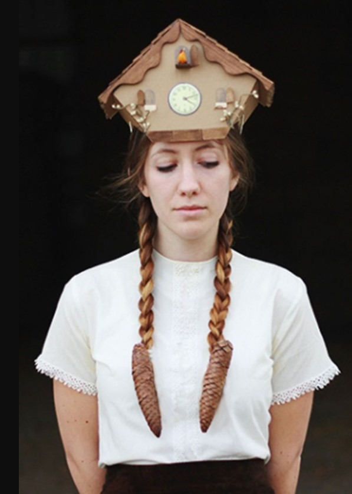

Embrace a touch of nostalgia with a Cuckoo Clock Costume. Create a large clock shape out of cardboard, wear it as a front-and-back sandwich board, and add decorative details. This easy Halloween costume is unique and playful. Keep everyone entertained with a clever and whimsical cuckoo clock costume that’s sure to be a hit.

### **16\. Picnic Blanket Costume**

Celebrate outdoor gatherings with a Picnic Blanket Costume. Dress in gingham-patterned clothing, attach plastic utensils and food props to your outfit, and carry a picnic basket. This easy Halloween costume captures the charm of a delightful picnic. Bring a picnic vibe to the Halloween gathering with a creative picnic blanket-inspired costume.

### **17\. Bat Costume**

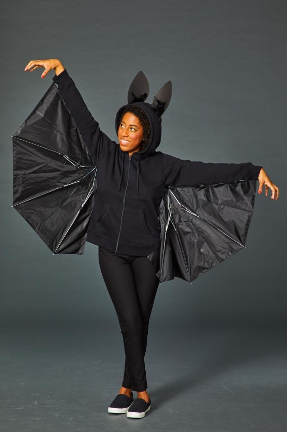

Take flight as a bat with a Bat Costume. Dress in black clothing, create wings using fabric or cardboard, and add bat ears to a headband or hat. This easy Halloween costume allows you to embrace the mysterious and nocturnal nature of these creatures. Take flight as a mysterious and elegant bat, showcasing your love for these nocturnal creatures.

### **18\. Mona Lisa Halloween Costume**

Step into the art world with a Mona Lisa Costume. Dress in Renaissance-inspired clothing, wear a Mona Lisa mask or print, and add a touch of mystery with a subtle smile. This easy Halloween costume brings the iconic painting to life. Pay homage to the art world with a unique and creative Mona Lisa costume that will make you a walking masterpiece.

### **19\. Burger Costume**

Bring a taste of Americana with a Burger Costume. Dress in brown or tan clothing to represent the bun, add colorful felt or fabric for the toppings, and wear a headband or hat with a burger motif. This easy Halloween costume is a playful homage to everyone’s favorite fast food. Serve up some laughter and deliciousness with a humorous and easy-to-wear burger costume.

### **20\. Katherine Johnson Costume (from ‘Hidden Figures’)**

Pay tribute to an inspiring figure with a Katherine Johnson Costume. Dress in ’60s-era clothing, wear glasses, and carry a notebook or calculator. This easy Halloween costume celebrates the achievements of the brilliant mathematician and NASA pioneer. Honor the incredible achievements of Katherine Johnson with a costume that celebrates her brilliance.

### **21\. Patriotic Popsicle Costume**

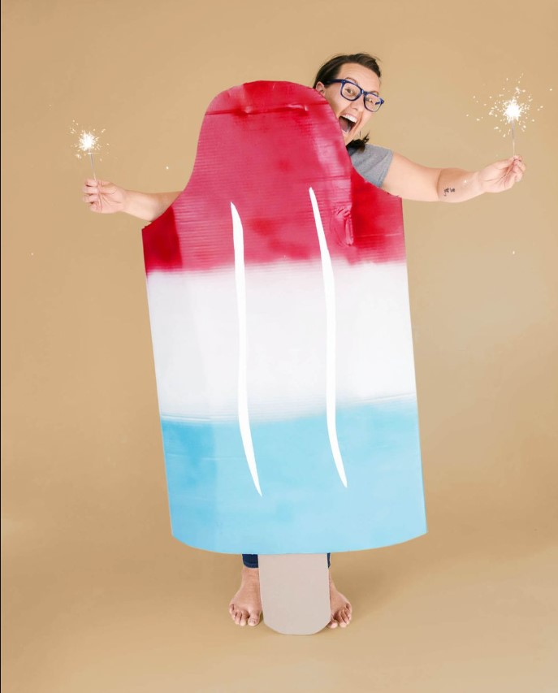

Celebrate the red, white, and blue with a Patriotic Popsicle Costume. Dress in colorful clothing, create a giant popsicle stick using cardboard, and add patriotic decorations. This easy Halloween costume is a fun and festive way to show your national pride. Add a patriotic twist to Halloween with a red, white, and blue popsicle-inspired costume.

### **22\. Easy Sailor Costume DIY**

Set sail with an Easy Sailor Costume. Dress in a white top, navy bottoms, and add nautical accessories such as a sailor hat and anchor accents. This easy Halloween costume captures the timeless and classic style of a sailor. Set sail for Halloween fun with a classic and effortless sailor costume that never goes out of style.

### **23\. DIY Houseplant Halloween Boxtume**

Bring the outdoors inside with a DIY Houseplant Boxtume. Create a large plant pot using a cardboard box, decorate it with faux leaves, and wear it as a front-and-back costume. This easy Halloween costume is creative and whimsical. Go green with a quirky and clever houseplant boxtume that will have everyone talking.

### **24\. Ghost Costume**

Embrace the classic Halloween spirit with a Ghost Costume. Wear a white sheet or dress, cut out eye holes, and style the sheet for an ethereal effect. This easy Halloween costume is simple yet iconic. Embrace the traditional Halloween spirit with a timeless and hauntingly elegant ghost costume.

### **25\. Rey Costume**

Enter the Star Wars universe with a Rey Costume. Dress in desert-toned clothing, wrap fabric around your waist, and carry a staff. This easy Halloween costume allows you to become the fearless and independent character from the beloved franchise. Join the Star Wars universe as the resilient and brave Rey, ready for galactic adventures.

### **26\. Firefly Jar Costume**

Illuminate the night with a Firefly Jar Costume. Dress in dark clothing, create a jar using clear plastic or fabric, and attach glow sticks or LED lights inside. This easy Halloween costume captures the enchanting glow of fireflies. Light up the night with a whimsical firefly jar costume that’s sure to capture everyone’s attention.

### **27\. Bunch of Asparagus Costume**

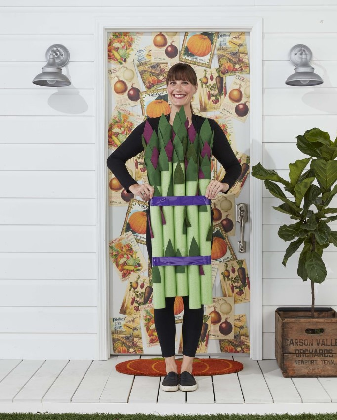

Bring a touch of whimsy to Halloween with a Bunch of Asparagus Costumes. Dress in green clothing, create asparagus spears using foam or fabric, and wear them as a headpiece or attach them to your outfit. This easy Halloween costume is playful and unique. Add a healthy dose of humor with a bunch of asparagus costumes that’s as funny as it is creative.

### **28\. It’s Raining Men Costume**

Create a humorous twist with an It’s Raining Men Costume. Wear a raincoat, attach pictures of male celebrities to umbrellas, and carry them as props. This easy Halloween costume is a playful and funny way to celebrate the rainy season. Bring a shower of laughter to the Halloween party with a hilarious “It’s Raining Men” costume.

### **29\. Easy Tinker Bell Halloween Costume**

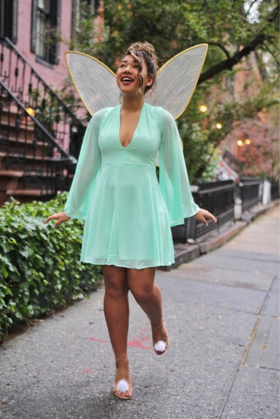

Embrace the magic of Disney with an Easy Tinker Bell Costume. Dress in a green dress or skirt, wear fairy wings, and add a touch of pixie dust with glitter makeup. This easy Halloween costume allows you to become the iconic fairy from Peter Pan. Sprinkle some pixie dust and transform it into the enchanting Tinker Bell for a magical Halloween experience.

### **30\. Buttered Toast Costume**

Bring a delicious twist to Halloween with a Buttered Toast Costume. Dress in tan or beige clothing, create toast-shaped accessories using foam or cardboard, and add a pat of butter using fabric or foam. This easy Halloween costume is a playful and whimsical choice. Toast to a fun-filled Halloween with a buttered toast costume that’s quirky and unique.

### **31\. DIY Bubble Tea Boba Halloween Costume**

Indulge in a trendy and fun DIY Bubble Tea Boba Costume. Dress in pastel-colored clothing, create a giant bubble tea cup using a cardboard box, and add boba ball accents using foam or felt. This easy Halloween costume is a creative and eye-catching option. Sip on the fun with a bubble tea boba-inspired costume that’s equal parts adorable and creative.

### **32\. Paper Doll Halloween Costume for Women**

Step back in time with a Paper Doll Costume. Wear a vintage-inspired dress, create paper cutouts of outfits, and attach them to your clothing using tape or string. This easy Halloween costume captures the nostalgia and charm of paper dolls. Play with nostalgia and dress up as a paper doll with this imaginative costume idea.

### **33\. Lucy & Ethel DIY Costume**

Bring a dose of classic comedy with a Lucy & Ethel Costume. Dress in ’50s-era clothing, channeling the iconic characters from “I Love Lucy.” This easy Halloween costume allows you to embody the humor and friendship of these beloved TV characters. Team up with your bestie and bring the classic duo of Lucy and Ethel to life with a DIY costume that’s a barrel of laughs.

**Related:** Unique [Teacher Halloween Costumes](https://avada.io/loveable/teacher-halloween-costumes/)

## **Easy Halloween Costumes for Kids**

These easy Halloween costumes for kids offer a range of options, from adorable fruits and animals to imaginative characters and objects. Whether your child wants to transform into a cuddly teddy bear, a fierce Jedi knight, or a delicious piece of candy, these costume ideas are perfect for sparking their creativity and making Halloween memorable.

### **1\. Corn Halloween Costume**

Transform into a cute ear of corn with a Corn Costume. Dress in a yellow or green outfit, create a corn cob shape using cardboard, and add corn husk accents. This easy Halloween costume is a playful and farm-inspired option. Harvest some Halloween fun with this cute and colorful corn costume that will make your child the cutest crop in the patch.

### **2\. DIY Garden Gnome Costume**

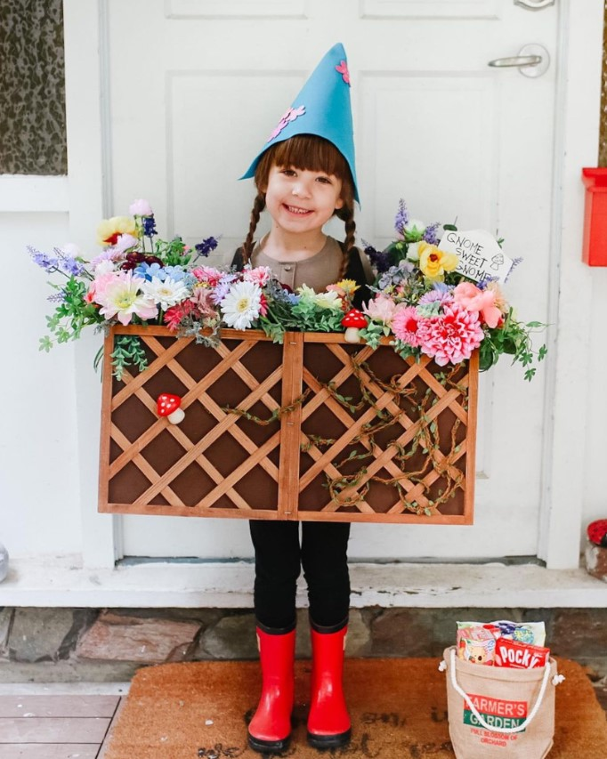

Bring a touch of whimsy to Halloween with a DIY Garden Gnome Costume. Wear a colorful shirt, add a vest and belt, and create a pointed hat using felt or fabric. This easy Halloween costume allows kids to embrace their inner garden guardian. Let your child’s imagination roam free as they transform into an enchanting garden gnome with this easy-to-make costume.

### **3\. Ted Lasso Kids’ Costumes**

Pay homage to the beloved TV series with Ted Lasso Kids’ Costumes. Dress in a coach’s outfit, wear a whistle, and carry a clipboard. This easy Halloween costume celebrates teamwork and positivity. Bring the charm of the beloved character to life with these heartwarming and funny Ted Lasso-inspired costumes.

### **4\. DIY Baseball Trophy Costume**

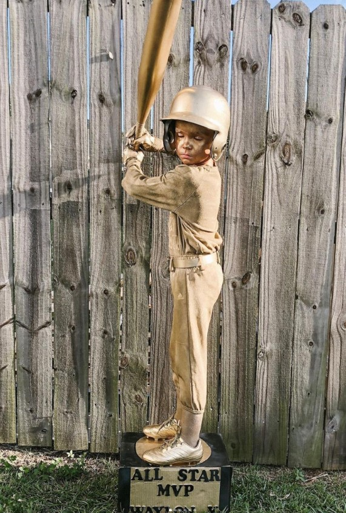

Celebrate the love of sports with a DIY Baseball Trophy Costume. Dress in a baseball uniform, create a trophy shape using cardboard or foam and add gold spray paint for a metallic look. This easy Halloween costume is perfect for young sports enthusiasts. Celebrate your little MVP with a baseball trophy costume that’s sure to score big on Halloween night.

### **5\. Bushel of Apples Costume**

Embrace the autumn harvest with a Bushel of Apples Costume. Dress in red or green clothing, attach artificial apples to a basket, and wear it as a front-and-back costume. This easy Halloween costume showcases the abundance of the season. A bushel of cuteness awaits with this adorable apple-themed costume that’s perfect for little ones.

### **6\. DIY Gingham Witch Halloween Costumes**

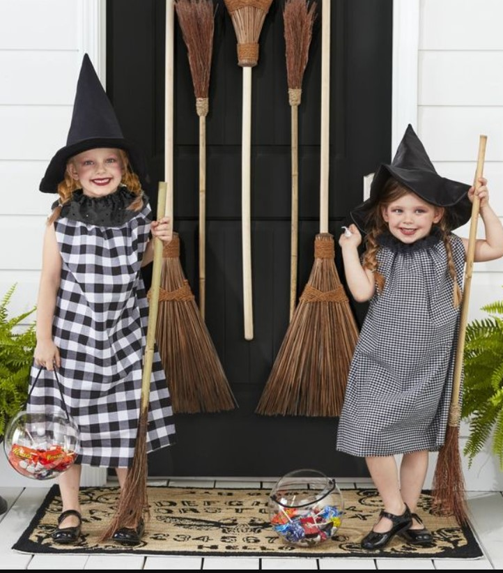

Combine classic witch elements with a twist of gingham in a DIY Gingham Witch Costume. Wear a gingham dress, add a witch’s hat, and accessorize with broomstick and striped stockings. This easy Halloween costume brings a playful and stylish touch to the traditional witch look. Cast a spell of sweetness with these charming gingham witch costumes that are both cute and bewitching.

### **7\. DIY Strawberry Halloween Costume**

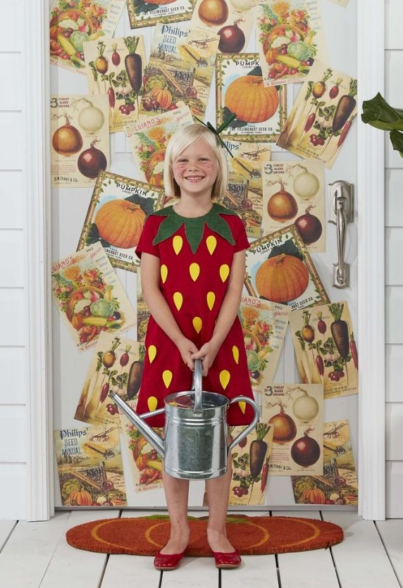

Become a sweet and juicy fruit with a DIY Strawberry Costume. Dress in red clothing, create a strawberry shape using fabric or foam, and add green leaves as a headpiece or collar. This easy Halloween costume is adorable and deliciously fun. Let your child shine as a juicy and delightful strawberry in this fun and fruity costume.

### **8\. DIY Cowboy and Horse Halloween Costume**

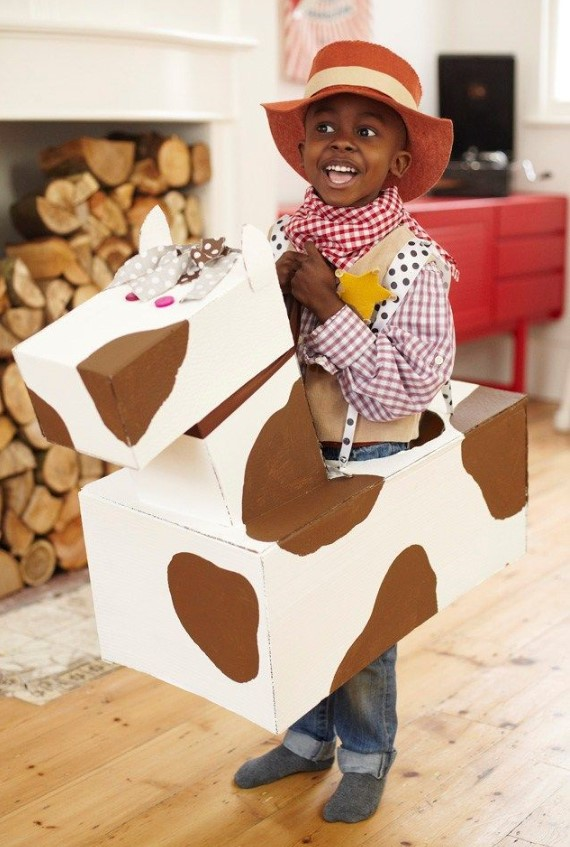

Saddle up for adventure with a DIY Cowboy and Horse Costume. Dress as a cowboy with a hat, vest, and boots, and create a horse-shaped costume using cardboard or fabric. This easy Halloween costume allows kids to become a dynamic duo. Saddle up for a Wild West adventure with this DIY cowboy and horse costume duo that’s full of frontier fun.

### **9\. DIY Haunted House Halloween Costume**

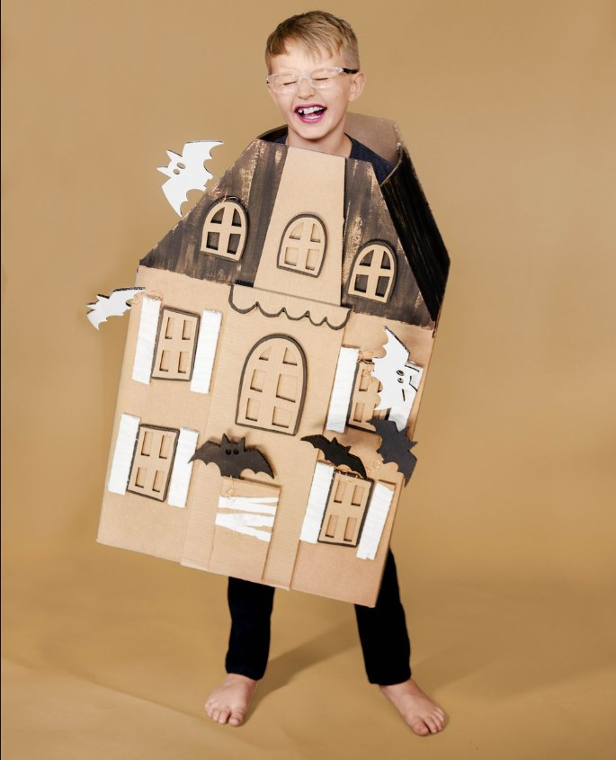

Step into the world of ghosts and ghouls with a DIY Haunted House Costume. Create a haunted house structure using cardboard or fabric, and wear it as a front-and-back costume. This easy Halloween costume is spooky and imaginative. Get into the Halloween spirit with a spooktacular haunted house costume that’s sure to thrill.

### **10\. “Dairy Queen” and Ice Cream Delivery Man**

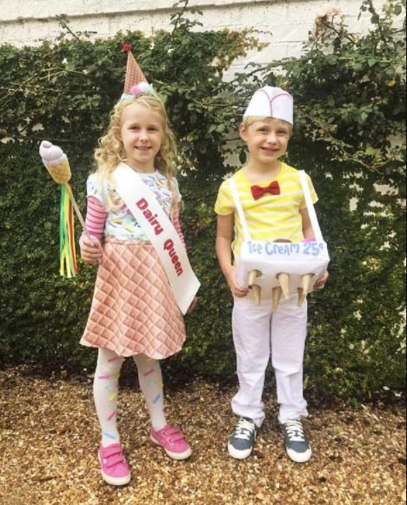

Bring some icy sweetness with a “Dairy Queen” and Ice Cream Delivery Man Costume. Dress as a “Dairy Queen” employee with a logo shirt and hat, and accompany it with an ice cream delivery man outfit. This easy Halloween costume is a playful nod to everyone’s favorite frozen treat. Serve up smiles with this adorable “Dairy Queen” and ice cream delivery man duo costume.

### **11\. DIY Jar of Pickles and Pickle Halloween Costumes**

Embrace the tangy goodness of pickles with a DIY Jar of Pickles and Pickle Costume. Dress as a pickle with a green outfit and add pickle-shaped accessories, while another child dresses as a jar with a large cardboard or fabric cutout. This easy Halloween costume is a delightful and humorous choice. Bring a touch of humor to Halloween with these quirky pickle-themed costumes that will have everyone laughing.

### **12\. DIY White Swan Halloween Costume**

Gracefully glide into Halloween with a DIY White Swan Costume. Dress in white clothing, create a swan’s wings using fabric or feathers, and wear a feathered headpiece. This easy Halloween costume is elegant and enchanting. Glide into Halloween elegance with a graceful and stunning white swan costume.

### **13\. DIY Cheese Grater & Wedge of Cheese Halloween Costumes**

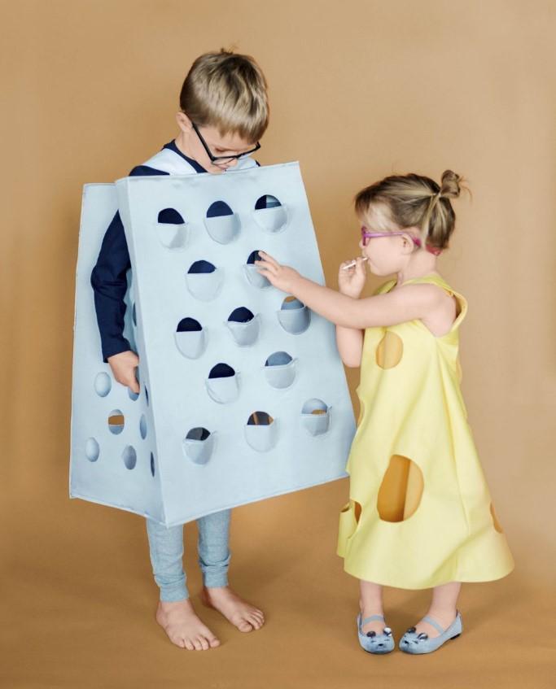

Serve up some cheesy fun with a DIY Cheese Grater and Wedge of Cheese Costume. Dress as a cheese grater with silver clothing and attach foam or fabric cheese wedges. Another child dresses as a cheese wedge using foam or fabric cutouts. This easy Halloween costume is a clever and humorous option. Add a dash of cheesy fun with this creative and punny costume idea.

### **14\. DIY Hot-Air Balloon Halloween Costume**

Embark on a high-flying adventure with a DIY Hot-Air Balloon Costume. Create a hot-air balloon shape using fabric or cardboard, and wear it as a front-and-back costume. This easy Halloween costume is imaginative and captures the wonder of flight. Watch your child’s imagination take flight with this whimsical hot-air balloon costume.

### **15\. DIY Librarian Halloween Costume**

Celebrate the love of books and knowledge with a DIY Librarian Costume. Dress in a cardigan, wear glasses, and carry a stack of books. This easy Halloween costume is perfect for young bookworms and aspiring librarians. Let your little bookworm shine as a charming librarian with this adorable costume.

### **16\. DIY Lego Block Halloween Costume**

Bring the world of creativity to life with a DIY Lego Block Costume. Dress in a solid-colored outfit, create a Lego brick shape using cardboard or foam, and attach Lego studs to represent the iconic building blocks. This easy Halloween costume is colorful and allows for endless imaginative play. Build a fantastic Halloween with this colorful and playful Lego block costume.

### **17\. DIY Flower Pot Halloween Costume**

Embrace the beauty of nature with a DIY Flower Pot Costume. Dress in earthy tones, create a flower pot shape using fabric or cardboard, and add flower decorations to a hat or headband. This easy Halloween costume is blooming with charm. Blossom into Halloween with a blooming flower pot costume that’s as cute as can be.

### **18\. DIY Star Wars Obi-Wan Halloween Costume**

Enter the Star Wars galaxy with a DIY Obi-Wan Costume. Dress in Jedi-inspired clothing, wear a cloak, and add a lightsaber. This easy Halloween costume allows kids to become a heroic Jedi knight. Join the Jedi ranks with this epic and easy-to-make Obi-Wan Kenobi costume.

### **19\. DIY ‘Where the Wild Things Are’ Halloween Costume**

Step into the imaginative world of “Where the Wild Things Are” with a DIY Costume. Dress as Max, the main character, in a wolf onesie or pajamas and wear a crown. This easy Halloween costume captures the magic and adventure of the beloved children’s book. Step into the world of Max and the Wild Things with this imaginative and nostalgic costume.

### **20\. DIY Homemade Lemon-Lime Halloween Costumes**

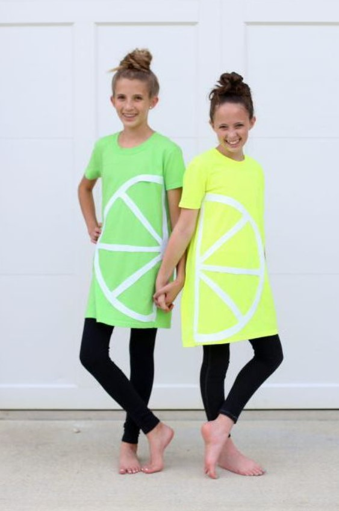

Bring some zest to Halloween with a DIY Lemon-Lime Costume. Dress in yellow or green clothing, create lemon or lime-shaped cutouts using fabric or foam, and wear them as front-and-back costumes. This easy Halloween costume is refreshing and vibrant. Add a zesty twist to Halloween with these refreshing and vibrant lemon-lime costumes.

### **21\. DIY Where’s Waldo? Halloween Costume**

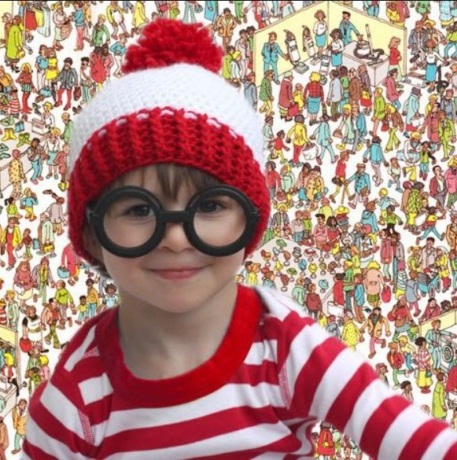

Join the search for Waldo with a DIY Where’s Waldo? Costume. Dress in a red and white striped shirt, wear a beanie with a pom-pom, and carry a magnifying glass. This easy Halloween costume is a playful tribute to the beloved search-and-find character. Embark on a seek-and-find adventure with a classic Where’s Waldo? costume that’s both fun and nostalgic.

### **22\. DIY Baby Gumball Machine Halloween Costume**

Add a touch of sweetness with a DIY Baby Gumball Machine Costume. Dress the child in colorful clothing, attach pom-poms or small colorful balls to a shirt or onesie, and add a “coin slot” and “gumball dispenser” cutouts. This easy Halloween costume is adorable and whimsical. Sweeten up Halloween with this adorable and colorful gumball machine costume for little ones.

### **23\. DIY Football Field Halloween Costume**

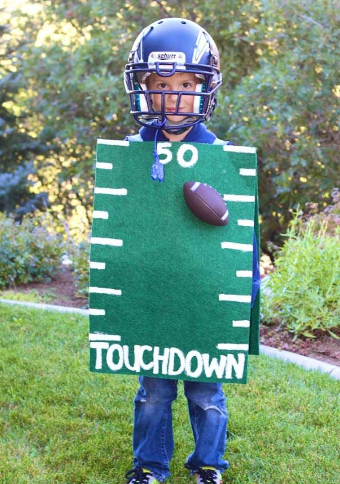

Score a touchdown with a DIY Football Field Costume. Dress in green clothing, create yard lines and football field markings on a shirt or a cardboard cutout, and wear it as a front-and-back costume. This easy Halloween costume is perfect for young sports enthusiasts. Score a touchdown with this sporty and creative football field costume that’s perfect for young athletes.

### **24\. DIY Cowboy and Cowgirl Halloween Costumes**

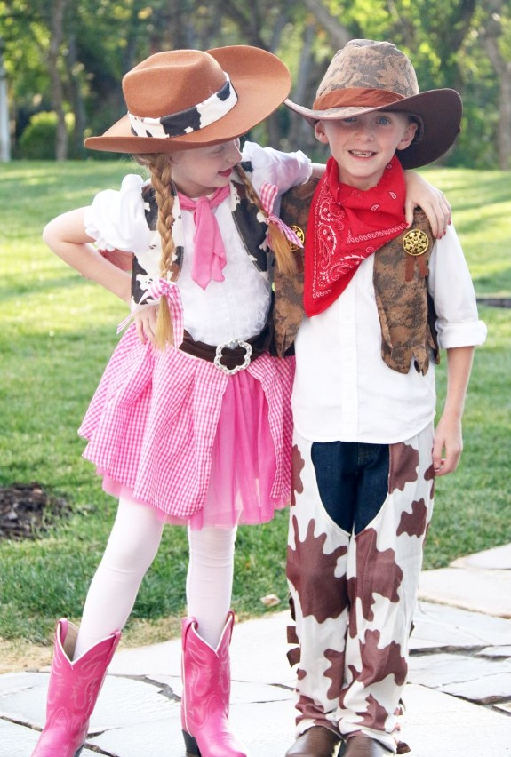

Saddle up for adventure with a DIY Cowboy and Cowgirl Costume. Dress as a cowboy or cowgirl with boots, a hat, and westernaccessories. This easy Halloween costume allows kids to channel their inner Wild West spirit. Round up some Western fun with these charming cowboy and cowgirl costumes.

### **25\. DIY Penny Halloween Costume**

Shine bright as a penny with a DIY Penny Costume. Dress in copper-colored clothing, create a circular cardboard cutout to resemble a penny, and attach it to your outfit. This easy Halloween costume is a unique and eye-catching choice. Let your child shine like a lucky penny with this shiny and delightful costume idea.

### **26\. DIY No-Sew Care Bears Halloween Costume**

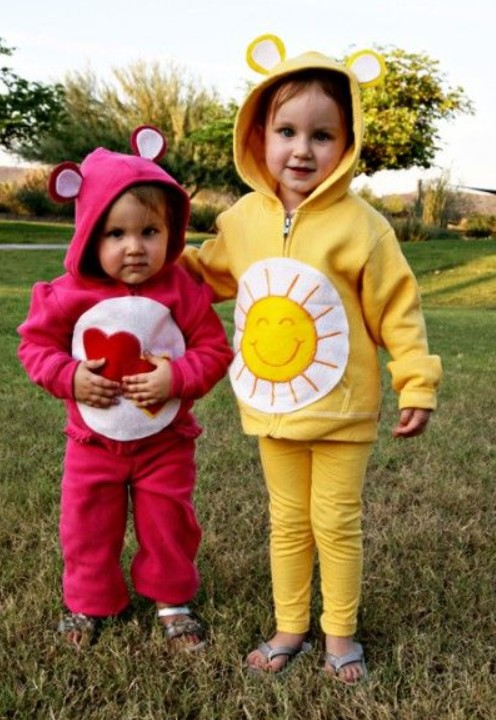

Spread love and cheer with a DIY No-Sew Care Bears Costume. Dress in a colorful hoodie or onesie, add a belly badge using felt or fabric, and wear a matching headband or hat. This easy Halloween costume brings the beloved Care Bears to life. Spread love and cheer with these adorable no-sew Care Bears costumes that are perfect for young fans.

### **27\. DIY Bullseye Halloween Costume**

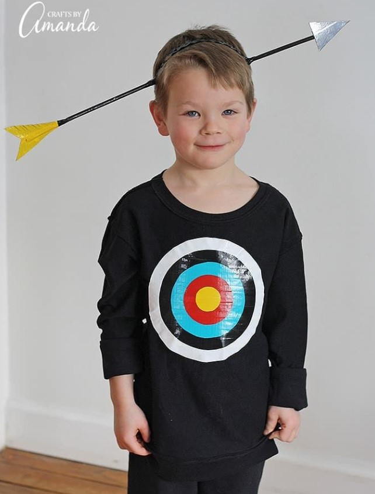

Hit the target with a DIY Bullseye Costume. Dress in red and white clothing, create a bullseye target using fabric or cardboard, and wear it as a front-and-back costume. This easy Halloween costume is fun and interactive. Aim for a bullseye of cuteness with this playful and imaginative bullseye costume.

**Related:** Unique [Baddie Halloween Costumes](https://avada.io/loveable/baddie-halloween-costumes/)

## **Easy Couples Halloween Costumes**

Whether you want to become iconic video game characters, bring a touch of retro elegance, or showcase your playful teamwork, these easy couples Halloween costume ideas are perfect for expressing your creativity and enjoying Halloween together.

### **1\. KFC Fried Chicken & Colonel Sanders**

Bring a tasty twist to Halloween with a KFC Fried Chicken and Colonel Sanders costume. Dress as a bucket of fried chicken, complete with a brown outfit and chicken accessories, while your partner dresses as Colonel Sanders with a white suit, glasses, and a white mustache. This easy Halloween costume is a deliciously fun choice for food-loving couples. Serve up some finger-lickin’ fun with this deliciously delightful KFC Fried Chicken and Colonel Sanders combo. It’s a recipe for Halloween success!

### **2\. Fisherman & Trout**

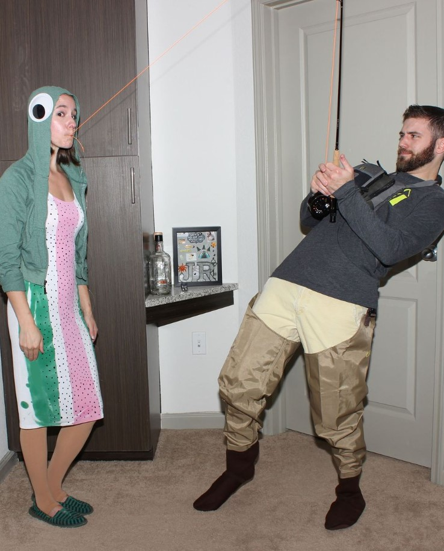

Reel in the Halloween fun with a Fisherman and Trout costume. One partner dresses as a fisherman, wearing fishing gear, a hat, and carrying a fishing rod, while the other dresses as a trout with a silver or rainbow-colored outfit. This easy Halloween costume is a playful and outdoorsy option. Reel in some laughs and create a splash at the Halloween bash with this adorable Fisherman and Trout pairing. It’s a catch of the day!

### **3\. Lumberjack & Tree**

Embrace the rustic charm with a Lumberjack and Tree costume. One partner dresses as a lumberjack, wearing plaid flannel, jeans, and a beanie, while the other dresses as a tree, using shades of brown and green fabric to resemble bark and leaves. This easy Halloween costume is a whimsical and nature-inspired choice. Embrace the great outdoors and showcase your harmony as a couple with this charming Lumberjack and Tree duo. It’s a lumber-match made in heaven!

### **4\. Princess Peach & Mario**

Step into the world of video games with a Princess Peach and Mario costume. One partner dresses as Princess Peach, wearing a pink gown and a crown, while the other dresses as Mario, wearing blue overalls, a red shirt, and a red cap. This easy Halloween costume is a nostalgic and iconic option for gaming couples. Jump into the world of Super Mario with this iconic Princess Peach and Mario pairing. It’s a video game adventure brought to life!

### **5\. Lightning Bolt & Strike Victim**

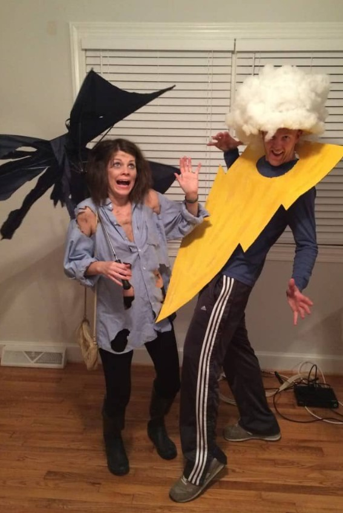

Electrify Halloween with a Lightning Bolt and Strike Victim costume. One partner dresses as a lightning bolt, wearing a black outfit with a yellow lightning symbol, while the other dresses as a strike victim, using gray or black clothing and adding streaks of white paint or fabric to resemble lightning strikes. This easy Halloween costume is a creative and electrifying choice. Add a touch of humor and electrifying energy to Halloween with this witty Lightning Bolt and Strike Victim combination. It’s a shocking hit!

### **6\. Nintendo Switch Controller Couple’s Costume**

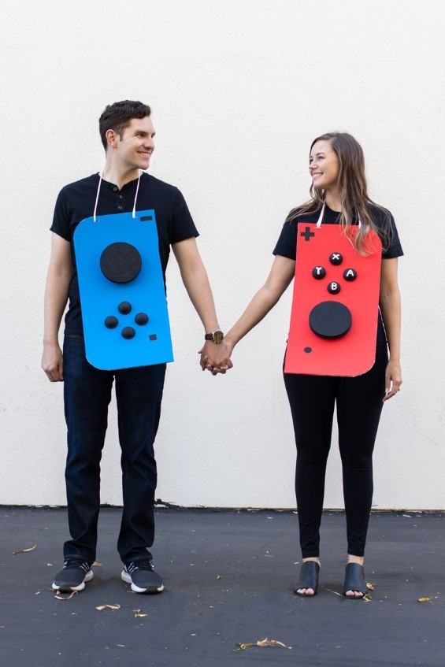

Enter the world of gaming with a Nintendo Switch Controller couple’s costume. Each partner wears half of the controller, creating a complete controller shape when standing side by side. This easy Halloween costume is a playful and geeky choice for gaming enthusiasts. Level up your Halloween game with this fun and innovative Nintendo Switch Controller duo. It’s a gamer’s dream come true!

### **7\. Prom King & Queen**

Feel like royalty with a Prom King and Queen costume. Dress in formal attire, with one partner wearing a crown and the other wearing a sash. This easy Halloween costume allows couples to channel the elegance and charm of prom night. Relive the magic of prom night with this classic and elegant Prom King and Queen ensemble. It’s a dance of romance and nostalgia!

### **8\. Super Parents**

Celebrate the superpowers of parenthood with a Super Parents costume. Dress as superheroes, adding personalized emblems or capes with symbols representing your parental roles (e.g., “Super Mom” or “Super Dad”). This easy Halloween costume is a fun and lighthearted way to showcase your parenting teamwork. Celebrate the superpowers of parenthood with this heartwarming Super Parents costume. It’s a heroic tribute to all the moms and dads out there!

### **9\. “The Princess Bride” Couple’s Costume**

Step into a fairytale with “The Princess Bride” couple’s costume. Dress as Buttercup, wearing a flowing gown, while your partner dresses as Westley, wearing a pirate-like outfit with a black mask. This easy Halloween costume is a romantic and nostalgic choice for fans of the classic film. Step into a fairy tale with this enchanting “The Princess Bride” couple’s costume that will transport you to a world of romance and adventure.

### **10\. Bonnie & Clyde**

Embrace the allure of vintage crime with a Bonnie and Clyde costume. Dress in 1930s-inspired clothing, with one partner wearing a beret, a long coat, and carrying a toy gun, while the other partner dresses in a fedora, and a suit, and carries a briefcase. This easy Halloween costume pays homage to the infamous duo. Embark on a thrilling and daring Halloween adventure as the notorious Bonnie and Clyde duo. It’s a costume that screams “partners in crime”!

## **Bottom Line**

In conclusion, **easy Halloween costumes** provide a fun and accessible way for everyone to participate in the festivities and express their creativity. Whether you’re dressing up as a classic character, a food item, or embracing a clever DIY idea, there are countless options to suit every taste and personality. These costumes allow individuals of all ages to join in the Halloween fun and showcase their unique style. With the wide array of easy Halloween costumes available, individuals can find the perfect outfit to reflect their interests, whether it’s a favorite movie character, a beloved food item, or a whimsical creature.

These costumes offer a chance to step into the shoes of someone else or unleash your inner imagination. From DIY creations to iconic duos and group ensembles, the possibilities are endless. So, whether you’re attending a Halloween party, going trick-or-treating, or simply embracing the spirit of the season, easy Halloween costumes offer a way to get into the festive spirit and make lasting memories. They bring joy, creativity, and a sense of playfulness to the occasion, making Halloween a time for fun and self-expression for everyone in 2023 and beyond.

- [Easy Halloween Costumes for Men](https://avada.io/loveable/blog/easy-halloween-costumes/#wp-block-heading-2-4)
    - [1\. Top Gun Costume](https://avada.io/loveable/blog/easy-halloween-costumes/#wp-block-heading-3-6)
    - [2\. Parks and Recreation Costume](https://avada.io/loveable/blog/easy-halloween-costumes/#wp-block-heading-3-9)
    - [3\. Mario or Luigi Costume](https://avada.io/loveable/blog/easy-halloween-costumes/#wp-block-heading-3-12)
    - [4\. Clark Kent Superman Costume](https://avada.io/loveable/blog/easy-halloween-costumes/#wp-block-heading-3-15)
    - [5\. Blue Pirate Costume](https://avada.io/loveable/blog/easy-halloween-costumes/#wp-block-heading-3-18)
    - [6\. Farmer Costume](https://avada.io/loveable/blog/easy-halloween-costumes/#wp-block-heading-3-21)
    - [7\. Steve Urkel Costume](https://avada.io/loveable/blog/easy-halloween-costumes/#wp-block-heading-3-24)
    - [8\. Dots the Clown Costume](https://avada.io/loveable/blog/easy-halloween-costumes/#wp-block-heading-3-27)
    - [9\. Despicable 3 Movie Minion](https://avada.io/loveable/blog/easy-halloween-costumes/#wp-block-heading-3-30)
    - [10\. Freddy Sweater Costume](https://avada.io/loveable/blog/easy-halloween-costumes/#wp-block-heading-3-33)
    - [11\. Inspector Gadget Costume](https://avada.io/loveable/blog/easy-halloween-costumes/#wp-block-heading-3-36)
    - [12\. ’50 Shades of Grey’ Halloween Costume](https://avada.io/loveable/blog/easy-halloween-costumes/#wp-block-heading-3-39)
    - [13\. Mario Kart Halloween Costume](https://avada.io/loveable/blog/easy-halloween-costumes/#wp-block-heading-3-42)
    - [14\. Dr. Pepper Halloween Costume](https://avada.io/loveable/blog/easy-halloween-costumes/#wp-block-heading-3-45)
    - [15\. Bruce Springsteen Halloween Costume](https://avada.io/loveable/blog/easy-halloween-costumes/#wp-block-heading-3-48)
    - [16\. Elton John Halloween Costume](https://avada.io/loveable/blog/easy-halloween-costumes/#wp-block-heading-3-51)
    - [17\. Brawny Man Halloween Costume](https://avada.io/loveable/blog/easy-halloween-costumes/#wp-block-heading-3-54)
    - [18\. Ferris Bueller From ‘Ferris Bueller’s Day Off’ Halloween Costume](https://avada.io/loveable/blog/easy-halloween-costumes/#wp-block-heading-3-57)
    - [19\. Jon Snow From ‘Game of Thrones’ Halloween Costume](https://avada.io/loveable/blog/easy-halloween-costumes/#wp-block-heading-3-60)
    - [20\. Mister Rogers Halloween Costume](https://avada.io/loveable/blog/easy-halloween-costumes/#wp-block-heading-3-63)
    - [21\. Doc Brown and Marty McFly From ‘Back to the Future’ Halloween Costumes](https://avada.io/loveable/blog/easy-halloween-costumes/#wp-block-heading-3-66)
    - [22\. Mendl’s Man From ‘The Grand Budapest Hotel’ Halloween Costume](https://avada.io/loveable/blog/easy-halloween-costumes/#wp-block-heading-3-69)
    - [23\. Toy Soldier Halloween Costume](https://avada.io/loveable/blog/easy-halloween-costumes/#wp-block-heading-3-72)
    - [24\. Jack Pearson From ‘This Is Us’ Halloween Costume](https://avada.io/loveable/blog/easy-halloween-costumes/#wp-block-heading-3-75)
    - [25\. American Gothic Halloween Costume](https://avada.io/loveable/blog/easy-halloween-costumes/#wp-block-heading-3-78)
    - [26\. Hawaiian Punch Halloween Costume](https://avada.io/loveable/blog/easy-halloween-costumes/#wp-block-heading-3-81)
    - [27\. Chip Gaines From ‘Fixer Upper’ Halloween Costume](https://avada.io/loveable/blog/easy-halloween-costumes/#wp-block-heading-3-84)
    - [28\. Error 404 Halloween Costume](https://avada.io/loveable/blog/easy-halloween-costumes/#wp-block-heading-3-87)
    - [29\. Ron Burgundy From ‘Anchorman’ Halloween Costume](https://avada.io/loveable/blog/easy-halloween-costumes/#wp-block-heading-3-90)
    - [30\. Bob Ross Halloween Costume](https://avada.io/loveable/blog/easy-halloween-costumes/#wp-block-heading-3-93)
    - [31\. ‘Grapes of Wrath’ Halloween Costume](https://avada.io/loveable/blog/easy-halloween-costumes/#wp-block-heading-3-96)
    - [32\. Rip Wheeler from ‘Yellowstone’ Halloween Costume](https://avada.io/loveable/blog/easy-halloween-costumes/#wp-block-heading-3-99)
    - [33\. Movie Theater Floor Halloween Costume](https://avada.io/loveable/blog/easy-halloween-costumes/#wp-block-heading-3-102)
    - [34\. Smart Cookie Halloween Costume](https://avada.io/loveable/blog/easy-halloween-costumes/#wp-block-heading-3-105)
    - [35\. ‘Men in Black’ Halloween Costume](https://avada.io/loveable/blog/easy-halloween-costumes/#wp-block-heading-3-108)
    - [36\. Blessing in Disguise Halloween Costume](https://avada.io/loveable/blog/easy-halloween-costumes/#wp-block-heading-3-111)
    - [37\. Pizza Delivery Man Costume](https://avada.io/loveable/blog/easy-halloween-costumes/#wp-block-heading-3-114)
    - [38\. Inspector Gadget Costume](https://avada.io/loveable/blog/easy-halloween-costumes/#wp-block-heading-3-117)
    - [39\. ‘When Life Gives You Lemons’ Costume](https://avada.io/loveable/blog/easy-halloween-costumes/#wp-block-heading-3-120)
    - [40\. Buzz Lightyear Sweatshirt](https://avada.io/loveable/blog/easy-halloween-costumes/#wp-block-heading-3-123)
- [Easy Halloween Costumes for Women](https://avada.io/loveable/blog/easy-halloween-costumes/#wp-block-heading-2-126)
    - [1\. Rosie the Riveter](https://avada.io/loveable/blog/easy-halloween-costumes/#wp-block-heading-3-128)
    - [2\. DIY Candy Corn Costume](https://avada.io/loveable/blog/easy-halloween-costumes/#wp-block-heading-3-131)
    - [3\. DIY Scarecrow Costume](https://avada.io/loveable/blog/easy-halloween-costumes/#wp-block-heading-3-134)
    - [4\. Coffee Filter Mermaid Costume](https://avada.io/loveable/blog/easy-halloween-costumes/#wp-block-heading-3-137)
    - [5\. Baby from “Dirty Dancing”](https://avada.io/loveable/blog/easy-halloween-costumes/#wp-block-heading-3-140)
    - [6\. Raincloud Costume](https://avada.io/loveable/blog/easy-halloween-costumes/#wp-block-heading-3-143)
    - [7\. Pop-Tart Costume](https://avada.io/loveable/blog/easy-halloween-costumes/#wp-block-heading-3-146)
    - [8\. Superquilter Costume](https://avada.io/loveable/blog/easy-halloween-costumes/#wp-block-heading-3-149)
    - [9\. DIY Balloon Snake Medusa](https://avada.io/loveable/blog/easy-halloween-costumes/#wp-block-heading-3-152)
    - [10\. Smarty Pants Halloween Costume](https://avada.io/loveable/blog/easy-halloween-costumes/#wp-block-heading-3-155)
    - [11\. Belle Halloween Costume for Women](https://avada.io/loveable/blog/easy-halloween-costumes/#wp-block-heading-3-158)
    - [12\. DIY Ice Cream Halloween Costume](https://avada.io/loveable/blog/easy-halloween-costumes/#wp-block-heading-3-161)
    - [13\. Head in the Clouds](https://avada.io/loveable/blog/easy-halloween-costumes/#wp-block-heading-3-164)
    - [14\. Minnie Mouse Costume](https://avada.io/loveable/blog/easy-halloween-costumes/#wp-block-heading-3-167)
    - [15\. Cuckoo Clock](https://avada.io/loveable/blog/easy-halloween-costumes/#wp-block-heading-3-170)
    - [16\. Picnic Blanket Costume](https://avada.io/loveable/blog/easy-halloween-costumes/#wp-block-heading-3-173)
    - [17\. Bat Costume](https://avada.io/loveable/blog/easy-halloween-costumes/#wp-block-heading-3-176)
    - [18\. Mona Lisa Halloween Costume](https://avada.io/loveable/blog/easy-halloween-costumes/#wp-block-heading-3-179)
    - [19\. Burger Costume](https://avada.io/loveable/blog/easy-halloween-costumes/#wp-block-heading-3-182)
    - [20\. Katherine Johnson Costume (from ‘Hidden Figures’)](https://avada.io/loveable/blog/easy-halloween-costumes/#wp-block-heading-3-185)
    - [21\. Patriotic Popsicle Costume](https://avada.io/loveable/blog/easy-halloween-costumes/#wp-block-heading-3-188)
    - [22\. Easy Sailor Costume DIY](https://avada.io/loveable/blog/easy-halloween-costumes/#wp-block-heading-3-191)
    - [23\. DIY Houseplant Halloween Boxtume](https://avada.io/loveable/blog/easy-halloween-costumes/#wp-block-heading-3-194)
    - [24\. Ghost Costume](https://avada.io/loveable/blog/easy-halloween-costumes/#wp-block-heading-3-197)
    - [25\. Rey Costume](https://avada.io/loveable/blog/easy-halloween-costumes/#wp-block-heading-3-200)
    - [26\. Firefly Jar Costume](https://avada.io/loveable/blog/easy-halloween-costumes/#wp-block-heading-3-203)
    - [27\. Bunch of Asparagus Costume](https://avada.io/loveable/blog/easy-halloween-costumes/#wp-block-heading-3-206)
    - [28\. It’s Raining Men Costume](https://avada.io/loveable/blog/easy-halloween-costumes/#wp-block-heading-3-209)
    - [29\. Easy Tinker Bell Halloween Costume](https://avada.io/loveable/blog/easy-halloween-costumes/#wp-block-heading-3-212)
    - [30\. Buttered Toast Costume](https://avada.io/loveable/blog/easy-halloween-costumes/#wp-block-heading-3-215)
    - [31\. DIY Bubble Tea Boba Halloween Costume](https://avada.io/loveable/blog/easy-halloween-costumes/#wp-block-heading-3-218)
    - [32\. Paper Doll Halloween Costume for Women](https://avada.io/loveable/blog/easy-halloween-costumes/#wp-block-heading-3-221)
    - [33\. Lucy & Ethel DIY Costume](https://avada.io/loveable/blog/easy-halloween-costumes/#wp-block-heading-3-224)
- [Easy Halloween Costumes for Kids](https://avada.io/loveable/blog/easy-halloween-costumes/#wp-block-heading-2-228)
    - [1\. Corn Halloween Costume](https://avada.io/loveable/blog/easy-halloween-costumes/#wp-block-heading-3-230)
    - [2\. DIY Garden Gnome Costume](https://avada.io/loveable/blog/easy-halloween-costumes/#wp-block-heading-3-233)
    - [3\. Ted Lasso Kids’ Costumes](https://avada.io/loveable/blog/easy-halloween-costumes/#wp-block-heading-3-236)
    - [4\. DIY Baseball Trophy Costume](https://avada.io/loveable/blog/easy-halloween-costumes/#wp-block-heading-3-239)
    - [5\. Bushel of Apples Costume](https://avada.io/loveable/blog/easy-halloween-costumes/#wp-block-heading-3-242)
    - [6\. DIY Gingham Witch Halloween Costumes](https://avada.io/loveable/blog/easy-halloween-costumes/#wp-block-heading-3-245)
    - [7\. DIY Strawberry Halloween Costume](https://avada.io/loveable/blog/easy-halloween-costumes/#wp-block-heading-3-248)
    - [8\. DIY Cowboy and Horse Halloween Costume](https://avada.io/loveable/blog/easy-halloween-costumes/#wp-block-heading-3-251)
    - [9\. DIY Haunted House Halloween Costume](https://avada.io/loveable/blog/easy-halloween-costumes/#wp-block-heading-3-254)
    - [10\. “Dairy Queen” and Ice Cream Delivery Man](https://avada.io/loveable/blog/easy-halloween-costumes/#wp-block-heading-3-257)
    - [11\. DIY Jar of Pickles and Pickle Halloween Costumes](https://avada.io/loveable/blog/easy-halloween-costumes/#wp-block-heading-3-260)
    - [12\. DIY White Swan Halloween Costume](https://avada.io/loveable/blog/easy-halloween-costumes/#wp-block-heading-3-263)
    - [13\. DIY Cheese Grater & Wedge of Cheese Halloween Costumes](https://avada.io/loveable/blog/easy-halloween-costumes/#wp-block-heading-3-266)
    - [14\. DIY Hot-Air Balloon Halloween Costume](https://avada.io/loveable/blog/easy-halloween-costumes/#wp-block-heading-3-269)
    - [15\. DIY Librarian Halloween Costume](https://avada.io/loveable/blog/easy-halloween-costumes/#wp-block-heading-3-272)
    - [16\. DIY Lego Block Halloween Costume](https://avada.io/loveable/blog/easy-halloween-costumes/#wp-block-heading-3-275)
    - [17\. DIY Flower Pot Halloween Costume](https://avada.io/loveable/blog/easy-halloween-costumes/#wp-block-heading-3-278)
    - [18\. DIY Star Wars Obi-Wan Halloween Costume](https://avada.io/loveable/blog/easy-halloween-costumes/#wp-block-heading-3-281)
    - [19\. DIY ‘Where the Wild Things Are’ Halloween Costume](https://avada.io/loveable/blog/easy-halloween-costumes/#wp-block-heading-3-284)
    - [20\. DIY Homemade Lemon-Lime Halloween Costumes](https://avada.io/loveable/blog/easy-halloween-costumes/#wp-block-heading-3-287)
    - [21\. DIY Where’s Waldo? Halloween Costume](https://avada.io/loveable/blog/easy-halloween-costumes/#wp-block-heading-3-290)
    - [22\. DIY Baby Gumball Machine Halloween Costume](https://avada.io/loveable/blog/easy-halloween-costumes/#wp-block-heading-3-293)
    - [23\. DIY Football Field Halloween Costume](https://avada.io/loveable/blog/easy-halloween-costumes/#wp-block-heading-3-296)
    - [24\. DIY Cowboy and Cowgirl Halloween Costumes](https://avada.io/loveable/blog/easy-halloween-costumes/#wp-block-heading-3-299)
    - [25\. DIY Penny Halloween Costume](https://avada.io/loveable/blog/easy-halloween-costumes/#wp-block-heading-3-302)
    - [26\. DIY No-Sew Care Bears Halloween Costume](https://avada.io/loveable/blog/easy-halloween-costumes/#wp-block-heading-3-305)
    - [27\. DIY Bullseye Halloween Costume](https://avada.io/loveable/blog/easy-halloween-costumes/#wp-block-heading-3-308)
- [Easy Couples Halloween Costumes](https://avada.io/loveable/blog/easy-halloween-costumes/#wp-block-heading-2-312)
    - [1\. KFC Fried Chicken & Colonel Sanders](https://avada.io/loveable/blog/easy-halloween-costumes/#wp-block-heading-3-314)
    - [2\. Fisherman & Trout](https://avada.io/loveable/blog/easy-halloween-costumes/#wp-block-heading-3-317)
    - [3\. Lumberjack & Tree](https://avada.io/loveable/blog/easy-halloween-costumes/#wp-block-heading-3-320)
    - [4\. Princess Peach & Mario](https://avada.io/loveable/blog/easy-halloween-costumes/#wp-block-heading-3-323)
    - [5\. Lightning Bolt & Strike Victim](https://avada.io/loveable/blog/easy-halloween-costumes/#wp-block-heading-3-326)
    - [6\. Nintendo Switch Controller Couple’s Costume](https://avada.io/loveable/blog/easy-halloween-costumes/#wp-block-heading-3-329)
    - [7\. Prom King & Queen](https://avada.io/loveable/blog/easy-halloween-costumes/#wp-block-heading-3-332)
    - [8\. Super Parents](https://avada.io/loveable/blog/easy-halloween-costumes/#wp-block-heading-3-335)
    - [9\. “The Princess Bride” Couple’s Costume](https://avada.io/loveable/blog/easy-halloween-costumes/#wp-block-heading-3-338)
    - [10\. Bonnie & Clyde](https://avada.io/loveable/blog/easy-halloween-costumes/#wp-block-heading-3-341)
- [Bottom Line](https://avada.io/loveable/blog/easy-halloween-costumes/#wp-block-heading-2-344)

### [Blake Simpson](https://avada.io/loveable/author/blake/)

Hi, I'm Blake from Loveable. I help people find perfect gifts for occasions like anniversaries and weddings. I also write a blog about holidays, sharing insights to make them more meaningful. Let's create unforgettable moments together!

- [Twitter](https://twitter.com/intent/tweet)
- [Facebook](https://www.facebook.com/sharer/sharer.php)
- [instagram](https://avada.io/loveable/blog/easy-halloween-costumes/)
- [pinterest](https://www.pinterest.com/loveablellc/)

## Related Posts

[### 120+ Christian Birthday Wishes To Spread Your Love](https://avada.io/loveable/blog/christian-birthday-wishes/) 

[

### 35 Best 70th Birthday Ideas To Celebrate The Special Milestone

](https://avada.io/loveable/blog/70th-birthday-ideas/)

[

### 50 Best 30th Birthday Decorations for a Remarkable Birthday Bash

](https://avada.io/loveable/blog/30th-birthday-decorations/)

[

### 40 Delicious Vegan Christmas Desserts to Delight Your Palate

](https://avada.io/loveable/blog/vegan-christmas-desserts/)

[

### 60 Christmas Team Building Activities to Boost Workplace Spirit

](https://avada.io/loveable/blog/christmas-team-building-activities/)
