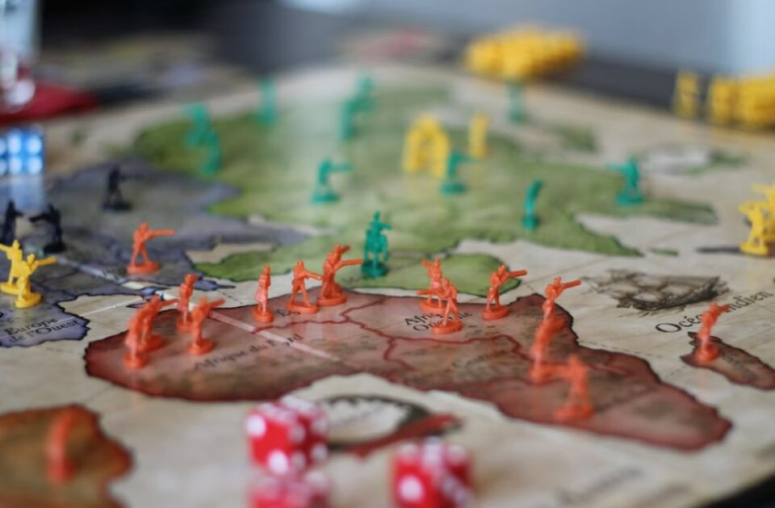
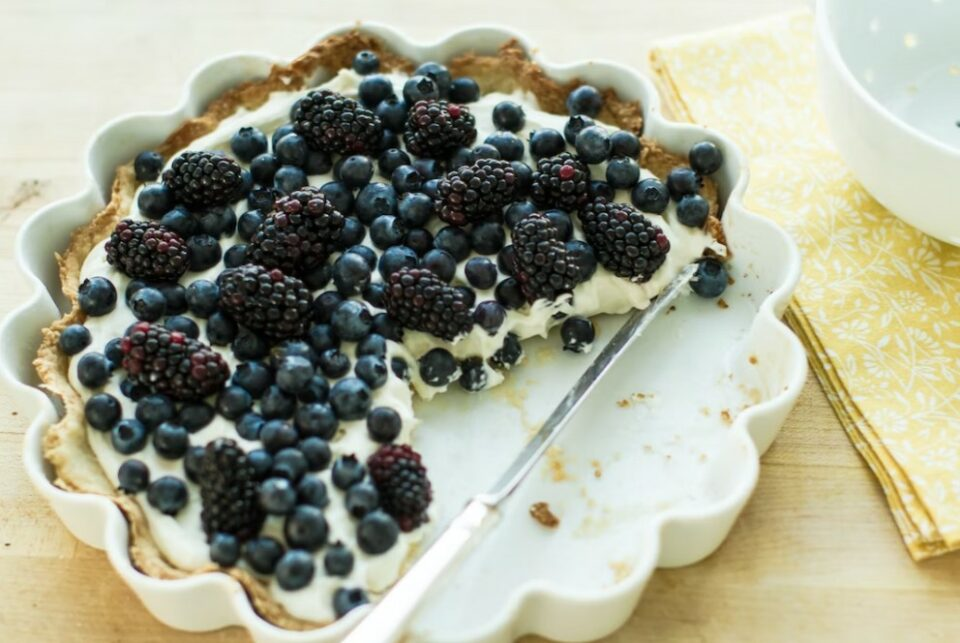
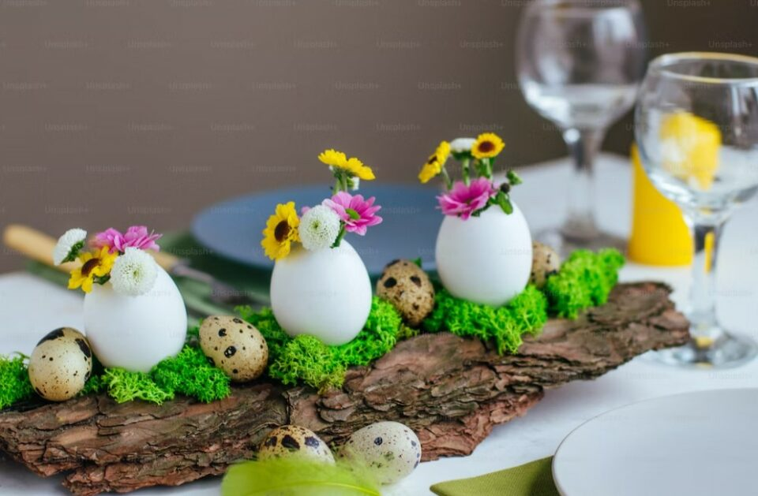
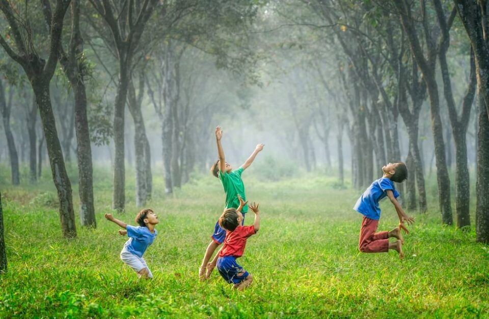
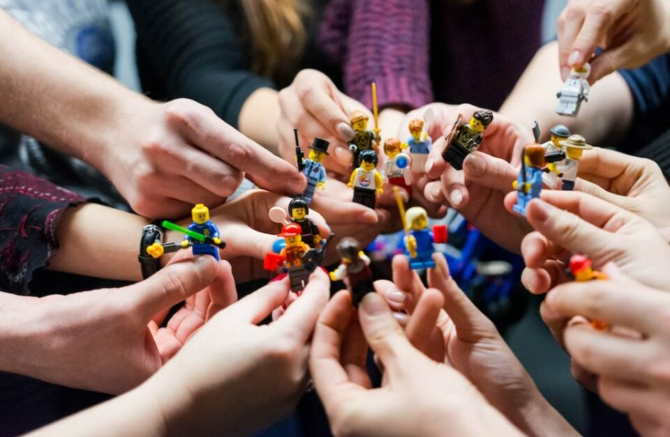

This article has been written and researched by our expert Loveable through a precise methodology. [Learn more about our methodology](https://avada.io/loveable/our-methodological.html)

[Loveable](https://avada.io/loveable/) > [Blog](https://avada.io/loveable/blog/) > [Family](https://avada.io/loveable/family/)

# 12 Best 7-Year-Old Birthday Ideas to Make Their Day Special

Written by [Rose Bryne](https://avada.io/loveable/author/rose/) Last Updated on August 30, 2023

- [12 Best 7th Birthday Party Ideas For 7-Year-Olds Kids](https://avada.io/loveable/blog/7-year-old-birthday-ideas/#wp-block-heading-2-4) 
    - [1\. Choose a Whimsical Theme](https://avada.io/loveable/blog/7-year-old-birthday-ideas/#wp-block-heading-3-5)
    - [2\. Magical Activities and Games](https://avada.io/loveable/blog/7-year-old-birthday-ideas/#wp-block-heading-3-8)
    - [3\. Captivating Entertainment](https://avada.io/loveable/blog/7-year-old-birthday-ideas/#wp-block-heading-3-10)
    - [4\. Enchanting Decorations and Ambiance](https://avada.io/loveable/blog/7-year-old-birthday-ideas/#wp-block-heading-3-13)
    - [5\. Delightful Treats and Refreshments](https://avada.io/loveable/blog/7-year-old-birthday-ideas/#wp-block-heading-3-15)
    - [6\. Party Favors and Souvenirs](https://avada.io/loveable/blog/7-year-old-birthday-ideas/#wp-block-heading-3-18)
    - [7\. Creative 7th Birthday Party: Crafting Party](https://avada.io/loveable/blog/7-year-old-birthday-ideas/#wp-block-heading-3-20)
    - [8\. 7th Birthday Party Idea for Girl: Sewing Party](https://avada.io/loveable/blog/7-year-old-birthday-ideas/#wp-block-heading-3-28)
    - [9\. 7th Birthday Party Idea for Boys: Sports Day Ideas](https://avada.io/loveable/blog/7-year-old-birthday-ideas/#wp-block-heading-3-31) 
    - [10\. Game Night Party for 7-Year-Olds](https://avada.io/loveable/blog/7-year-old-birthday-ideas/#wp-block-heading-3-40) 
    - [11\. Lego Party for 7 Year Olds Boys](https://avada.io/loveable/blog/7-year-old-birthday-ideas/#wp-block-heading-3-47) 
    - [12\. Spa party for 7 Year Olds Girls](https://avada.io/loveable/blog/7-year-old-birthday-ideas/#wp-block-heading-3-50)
- [7-Year-Old Birthday Party Planning Basics](https://avada.io/loveable/blog/7-year-old-birthday-ideas/#wp-block-heading-2-52)
- [Final Thoughts](https://avada.io/loveable/blog/7-year-old-birthday-ideas/#wp-block-heading-2-62) 

Welcome to a world of enchantment and joy! Today, we’ll explore some **7-Year-Old Birthday Ideas**, making it truly magical. Turning seven is a big deal, and we want to make it a day full of delightful memories.

In this guide, we’ll share creative and exciting party ideas that captivate your child’s imagination and amaze their friends. We have whimsical themes, fun activities, and delicious treats lined up for an extraordinary celebration. Let’s dive into the realm of imagination together and create a party that will leave them beaming with joy and wonder. Get ready for a fantastic journey!

In addition to celebrating milestone birthdays, it’s also important to make the little ones feel special on their big day. If you’re searching for the perfect birthday gift for a 7-year-old, we’ve got you covered! Our carefully curated collection of gifts is designed to spark joy and ignite their imagination. From [educational toys](https://avada.io/loveable/educational-games-and-toys-kids/) and interactive games to adorable plushies and creative craft kits, you’ll find a wide range of options that will bring a smile to any 7-year-old’s face. So, don’t miss the opportunity to explore our fantastic [7-year-old gift collection](https://avada.io/loveable/birthday-gifts-7-year-olds/) and find the perfect present to make their birthday truly memorable!

## **12 Best 7th Birthday Party Ideas For 7-Year-Olds Kids** 

### **1\. Choose a Whimsical Theme**

Selecting a captivating theme is the first step in creating a magical atmosphere for the birthday party. Consider your child’s interests, whether it’s princesses, superheroes, fairies, pirates, or unicorns. Once you have chosen a theme, incorporate it into the decorations, invitations, and party favors. Encourage guests to dress up in line with the theme, adding to the enchantment and making the celebration even more immersive.

### **2\. Magical Activities and Games**

To keep the young guests entertained and engaged, plan a variety of magical activities and games. Set up a craft station where children can create their own magic wands, fairy wings, or superhero masks. Organize a treasure hunt or scavenger hunt with clues that lead them to hidden treasures or magical surprises. Consider hiring a face painter or a balloon artist to add an extra touch of whimsy.

### **3\. Captivating Entertainment**

Bring the magic to life with captivating entertainment. Hire a magician who can perform mind-boggling tricks and illusions that will leave the children in awe. Alternatively, arrange for a storyteller to captivate their imaginations with tales of adventure and wonder. Another option is to have a live character performance where beloved characters come to life and interact with the children, creating a truly immersive experience.

### **4\. Enchanting Decorations and Ambiance**

Transform the party venue into a magical wonderland with enchanting decorations. Use colorful balloons, [streamers](https://avada.io/loveable/gifts-streamers/), and ribbons to create a vibrant and whimsical atmosphere. Hang fairy lights or lanterns to add a soft and magical glow. Set up themed table settings with coordinating tablecloths, plates, and napkins. Consider adding elements like a photo booth with props that tie into the theme, allowing children to capture magical memories.

### **5\. Delightful Treats and Refreshments**

No birthday party is complete without delightful treats and refreshments. Design a magical-themed birthday cake or cupcakes adorned with edible decorations that match the theme. Offer a variety of themed snacks, finger foods, and drinks that will delight the young guests. Create a candy or dessert table filled with whimsical treats like rainbow-colored candies, chocolate wands, or fairy-inspired cookies.

### **6\. Party Favors and Souvenirs**

Send the young guests home with a piece of magic by providing them with themed party favors or goody bags. Include small toys, stickers, temporary tattoos, or magical-themed items that tie into the chosen theme. Personalize the party favors with each child’s name or a special message to make them feel extra special.

### **7\. Creative 7th Birthday Party: Crafting Party**

Celebrate your child’s 7th birthday with a fun and creative crafting party that will unleash their imagination and artistic skills. Set up a crafting station with various activities to keep the young guests engaged and entertained. Here are some exciting ideas for the crafting party:

- **T-shirt Design:** Provide plain white T-shirts and fabric markers for the kids to create their own personalized shirts.
- **Jewelry Making:** Set up a jewelry-making station with beads, strings, and charms, allowing the children to design their own unique accessories.
- **Paint and Sip:** Provide canvases, paintbrushes, and non-toxic paints for a guided painting session where each child can create their own masterpiece.
- **DIY Slime:** Offer a slime-making station with different colors and textures, allowing the children to mix and customize their own slime creations.
- **Paper Crafts:** Set out colored papers, scissors, glue, and stickers for the kids to make paper crafts like origami, greeting cards, or paper masks.

### **8\. 7th Birthday Party Idea for Girl: Sewing Party**

Celebrate your little girl’s 7th birthday with a delightful and hands-on sewing party that will spark her creativity and passion for crafting. Transform the party venue into a sewing studio where the young guests can embark on a sewing adventure. Set up sewing stations equipped with child-friendly sewing machines, colorful fabrics, threads, and safety needles. 

Provide simple sewing patterns such as pillows, stuffed animals, or mini tote bags, allowing the girls to learn basic sewing skills and create their own unique masterpieces. With guidance from adult supervisors or a professional sewing instructor, the girls will not only have fun but also develop valuable skills.

### **9\. 7th Birthday Party Idea for Boys: Sports Day Ideas** 

Celebrate your little boy’s 7th birthday with an action-packed Sports Day party that will get everyone moving and having a blast. Transform the party venue into a mini sports arena and provide a variety of games and activities to keep the young athletes entertained. Here are some exciting ideas for a Sports Day party.

- **Obstacle Course:** Set up a challenging obstacle course with hurdles, cones, tunnels, and balance beams for the kids to navigate through.
- **Soccer Shootout:** Create a mini soccer field and organize a friendly shootout, allowing the boys to showcase their kicking skills and compete in a fun and energetic game.
- **Basketball Challenge:** Set up a basketball hoop and let the boys test their shooting abilities with friendly competitions and mini-tournaments.
- **Relay Races:** Arrange relay races where the boys can participate in teams, passing batons and racing against each other for an exhilarating and competitive experience.
- **Tug-of-War:** Divide the boys into two teams and engage in a classic tug-of-war, promoting teamwork and friendly rivalry.
- **Mini Golf:** Create a mini golf course with fun obstacles and challenges for the boys to put their way to victory.

### **10\. Game Night Party for 7-Year-Olds** 

Host a thrilling game night party for your 7-year-olds and create a memorable celebration filled with laughter, friendly competition, and endless fun. Transform your space into a game zone and set up various game stations to keep the young guests entertained throughout the party. Here are some exciting ideas for a game night party:

- **Board Game Bonanza:** Provide a variety of age-appropriate board games, such as Candy Land, Chutes and Ladders, or Guess Who, for the kids to enjoy classic game fun.
- **Minute-to-Win-It Challenges:** Set up a series of quick and hilarious challenges, like stacking cups, balancing objects, or completing tasks within a minute, encouraging friendly competition.
- **Active Games:** Incorporate active games like musical chairs, freeze dance, or Simon Says to get the kids up and moving.
- **DIY Game Station:** Create a craft corner where the children can design and create their own board games or card games using art supplies and their imaginations.
- **Karaoke or Talent Show:** Set up a staging area where the kids can showcase their singing talents or put on a talent show, encouraging creativity and confidence.

### **11\. Lego Party for 7 Year Olds Boys** 

Transform your party venue into a [Lego](https://avada.io/loveable/gifts-lego-lovers/) wonderland where young builders can immerse themselves in a world of creativity and fun. Set up various building stations with an abundance of colorful Lego bricks and challenge the boys to unleash their imaginations through building challenges and games. Organize a thrilling Lego scavenger hunt or engage them in exciting Lego-themed crafts and activities. Let their creativity soar as they decorate Lego-shaped cupcakes or participate in Lego-themed games. 

### **12\. Spa party for 7 Year Olds Girls**

Treat your 7-year-old girls to a spa party that will make them feel like princesses. Transform your space into a relaxing oasis with stations for manicures, pedicures, facials, and makeovers. Provide cozy robes, soft slippers, and soothing music. Let the girls enjoy DIY spa treatments like face masks and scented baths. Enhance the ambiance with fairy lights and calming decorations. Offer healthy snacks and spa-inspired treats. This spa party will create special memories as the girls relax, bond, and feel pampered in a fun and enchanting atmosphere.

## **7-Year-Old Birthday Party Planning Basics**

When planning a 7-year-old birthday party, it’s important to focus on the basics to ensure a successful and enjoyable celebration. Here are some essential elements to consider:

- **Budget:** Consider your budget when planning the party and decide which expenses are most important. Keep in mind that kids often appreciate simple things more than fancy decorations or expensive treats. You can save money by making handmade decorations, like happy birthday signs made from paper and string. 

- **Venue:** Decide whether to host the party at home, in a park, or at a rented venue, considering the number of guests and the space required for activities and games.

- **Guest List:** Create a guest list, keeping in mind your child’s friends and classmates. Consider the size of the venue and your budget when finalizing the number of guests.

- **Invitations:** Send out invitations well in advance, providing the date, time, location, and theme of the party. Include RSVP details and any additional information, such as dress code or special instructions.

- **Activities and Games:** Plan age-appropriate activities and games to keep the children entertained throughout the party. Consider traditional games like pin the tail on the donkey, musical chairs, or a piñata. Incorporate themed activities and crafts related to the chosen theme.

- **Food and Refreshments:** Prepare a menu with kid-friendly foods and snacks. Include options for children with dietary restrictions or allergies. Provide refreshments like juices, water, and a birthday cake or cupcakes.

- **Decorations:** Set the party atmosphere with colorful and themed decorations, such as balloons, streamers, banners, and table centerpieces. Use the theme as a guide when selecting decorations.

- **Party Favors:** Prepare small party favors or goody bags for the guests to take home as a token of appreciation. Fill them with age-appropriate treats, toys, or themed items that tie into the party theme.

## **Final Thoughts** 

These best **7th birthday party ideas** will ensure a magical and unforgettable celebration for your child. From themed parties to creative activities, the key is to personalize the event and create a joyful atmosphere that reflects their interests. With these ideas, you can make their special day one they will cherish for years to come.

- [12 Best 7th Birthday Party Ideas For 7-Year-Olds Kids](https://avada.io/loveable/blog/7-year-old-birthday-ideas/#wp-block-heading-2-4) 
    - [1\. Choose a Whimsical Theme](https://avada.io/loveable/blog/7-year-old-birthday-ideas/#wp-block-heading-3-5)
    - [2\. Magical Activities and Games](https://avada.io/loveable/blog/7-year-old-birthday-ideas/#wp-block-heading-3-8)
    - [3\. Captivating Entertainment](https://avada.io/loveable/blog/7-year-old-birthday-ideas/#wp-block-heading-3-10)
    - [4\. Enchanting Decorations and Ambiance](https://avada.io/loveable/blog/7-year-old-birthday-ideas/#wp-block-heading-3-13)
    - [5\. Delightful Treats and Refreshments](https://avada.io/loveable/blog/7-year-old-birthday-ideas/#wp-block-heading-3-15)
    - [6\. Party Favors and Souvenirs](https://avada.io/loveable/blog/7-year-old-birthday-ideas/#wp-block-heading-3-18)
    - [7\. Creative 7th Birthday Party: Crafting Party](https://avada.io/loveable/blog/7-year-old-birthday-ideas/#wp-block-heading-3-20)
    - [8\. 7th Birthday Party Idea for Girl: Sewing Party](https://avada.io/loveable/blog/7-year-old-birthday-ideas/#wp-block-heading-3-28)
    - [9\. 7th Birthday Party Idea for Boys: Sports Day Ideas](https://avada.io/loveable/blog/7-year-old-birthday-ideas/#wp-block-heading-3-31) 
    - [10\. Game Night Party for 7-Year-Olds](https://avada.io/loveable/blog/7-year-old-birthday-ideas/#wp-block-heading-3-40) 
    - [11\. Lego Party for 7 Year Olds Boys](https://avada.io/loveable/blog/7-year-old-birthday-ideas/#wp-block-heading-3-47) 
    - [12\. Spa party for 7 Year Olds Girls](https://avada.io/loveable/blog/7-year-old-birthday-ideas/#wp-block-heading-3-50)
- [7-Year-Old Birthday Party Planning Basics](https://avada.io/loveable/blog/7-year-old-birthday-ideas/#wp-block-heading-2-52)
- [Final Thoughts](https://avada.io/loveable/blog/7-year-old-birthday-ideas/#wp-block-heading-2-62) 

### [Rose Bryne](https://avada.io/loveable/author/rose/)

Hi, I'm Rose! I love animals and spending time with kids. At Loveable, I help people find unique gifts for special occasions like Valentine's Day, housewarmings, and graduations. I enjoy finding gifts for kids, teens, and animal lovers that match their interests and personalities. Making gift-giving a pleasant experience is my priority. Let me assist you in finding the perfect gift!

- [Twitter](https://twitter.com/intent/tweet)
- [Facebook](https://www.facebook.com/sharer/sharer.php)
- [instagram](https://avada.io/loveable/blog/7-year-old-birthday-ideas/)
- [pinterest](https://www.pinterest.com/loveablellc/)

## Related Posts

[### 30 Best 4 Year Old Birthday Party Ideas For A Memorable Celebration](https://avada.io/loveable/blog/4-year-old-birthday-party-ideas/) 

[

### 16th Birthday Party Ideas to Make an Unforgettable Day

](https://avada.io/loveable/blog/16th-birthday-party-ideas/)

[

### 150+ Inspirational Birthday Quotes to Spread Joy on Special Day

](https://avada.io/loveable/blog/inspirational-birthday-quotes/)

[

### 160+ Birthday Wishes for Wife to Express Eternal Love

](https://avada.io/loveable/blog/birthday-wishes-for-wife/)

[### 90+ Heart Touching Birthday Wishes for Niece to Make Her Day Extra Special](https://avada.io/loveable/blog/birthday-wishes-for-niece/)
