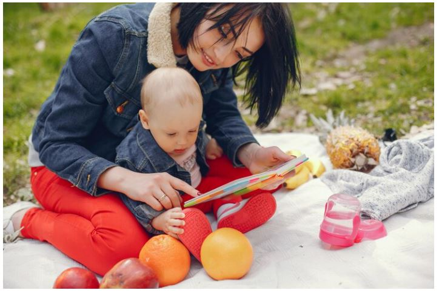
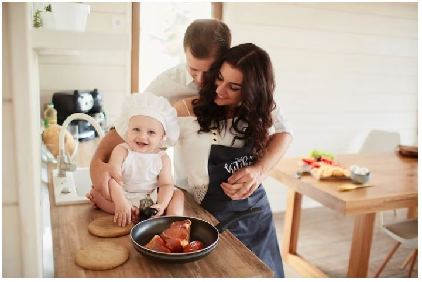
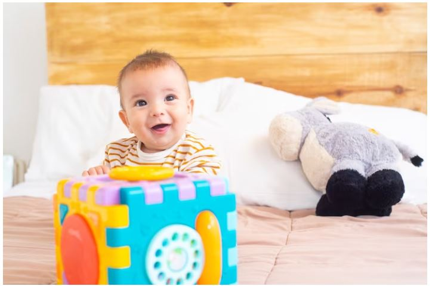
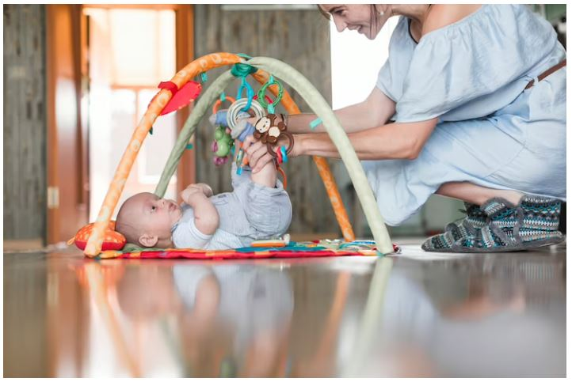
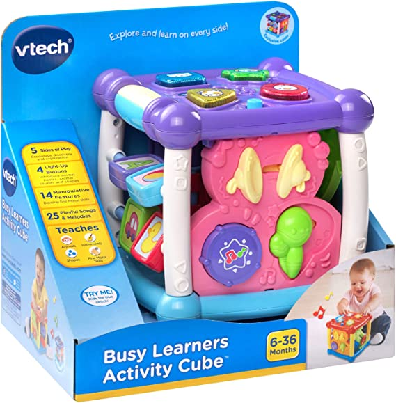
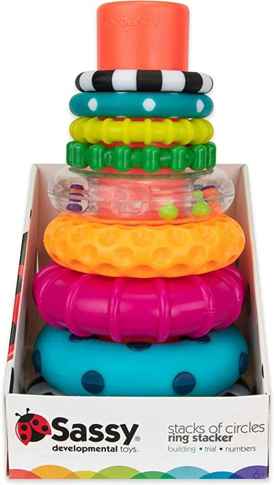
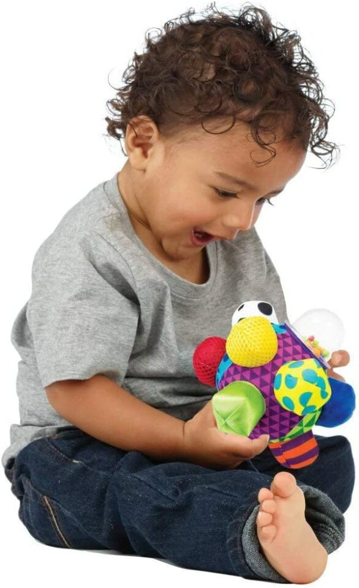
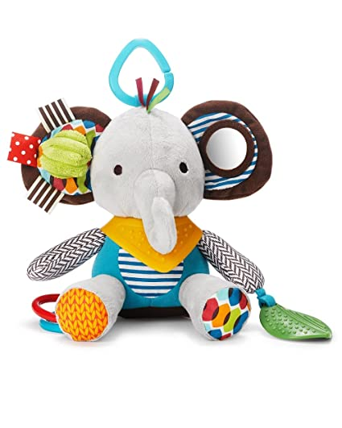
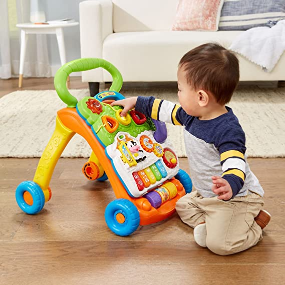
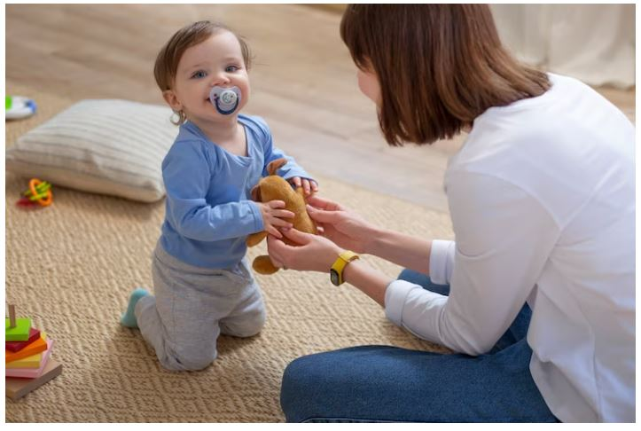

This article has been written and researched by our expert Loveable through a precise methodology. [Learn more about our methodology](https://avada.io/loveable/our-methodological.html)

[Loveable](https://avada.io/loveable/) > [Blog](https://avada.io/loveable/blog/) > [Parenting](https://avada.io/loveable/parenting/)

# 12 Engaging Activities for a 6-Month-Old Baby: Fun and Developmental Ideas

Written by [Benjamin Collins](https://avada.io/loveable/author/benjamin/) Last Updated on August 28, 2023

- [12 Best Activities for a 6-Month-Old Baby](https://avada.io/loveable/blog/activities-for-6-month-old/#wp-block-heading-2-3)
    - [1\. Reading](https://avada.io/loveable/blog/activities-for-6-month-old/#wp-block-heading-3-4) 
    - [2\. Household hub-bub](https://avada.io/loveable/blog/activities-for-6-month-old/#wp-block-heading-3-8)
    - [3\. Peek-a-Boo](https://avada.io/loveable/blog/activities-for-6-month-old/#wp-block-heading-3-11)
    - [4\. Let the Kids Eat by Themselves](https://avada.io/loveable/blog/activities-for-6-month-old/#wp-block-heading-3-15) 
    - [5\. Cook Together](https://avada.io/loveable/blog/activities-for-6-month-old/#wp-block-heading-3-18)
    - [6\. Sit-n-splash the water](https://avada.io/loveable/blog/activities-for-6-month-old/#wp-block-heading-3-22)
    - [7\. Nursery rhyme and dance](https://avada.io/loveable/blog/activities-for-6-month-old/#wp-block-heading-3-25)
    - [8\. Stacking the Blocks](https://avada.io/loveable/blog/activities-for-6-month-old/#wp-block-heading-3-30)
    - [9\. The Noisy Box Activity](https://avada.io/loveable/blog/activities-for-6-month-old/#wp-block-heading-3-33)
    - [10\. Play with Moving Toy](https://avada.io/loveable/blog/activities-for-6-month-old/#wp-block-heading-3-38) 
    - [11\. Tugging the String](https://avada.io/loveable/blog/activities-for-6-month-old/#wp-block-heading-3-41)
    - [12\. Colorful purees](https://avada.io/loveable/blog/activities-for-6-month-old/#wp-block-heading-3-46)
- [5 Best Developmental Toys For a 6-month-old Baby to Help Them Grow](https://avada.io/loveable/blog/activities-for-6-month-old/#wp-block-heading-2-50)
    - [Busy Learners Activity Cube](https://avada.io/loveable/blog/activities-for-6-month-old/#wp-block-heading-3-51)
    - [Stacks of Circles Stacking Ring](https://avada.io/loveable/blog/activities-for-6-month-old/#wp-block-heading-3-55)
    - [Developmental Bumpy Ball](https://avada.io/loveable/blog/activities-for-6-month-old/#wp-block-heading-3-59)
    - [Baby Activity and Teething Toy](https://avada.io/loveable/blog/activities-for-6-month-old/#wp-block-heading-3-62)
    - [Sit-To-Stand Learning Walker](https://avada.io/loveable/blog/activities-for-6-month-old/#wp-block-heading-3-66)
- [FAQ Activities for a 6-Month-Old Baby](https://avada.io/loveable/blog/activities-for-6-month-old/#wp-block-heading-2-70)
    - [1\. Can a 6-month-old watch TV?](https://avada.io/loveable/blog/activities-for-6-month-old/#wp-block-heading-3-72)
    - [2\. Does my 6-month-old get bored?](https://avada.io/loveable/blog/activities-for-6-month-old/#wp-block-heading-3-74)
    - [3\. Can a 6-month-old understand no?](https://avada.io/loveable/blog/activities-for-6-month-old/#wp-block-heading-3-76)
    - [4\. What happens if my 6-month-old isn’t laughing?](https://avada.io/loveable/blog/activities-for-6-month-old/#wp-block-heading-3-79)
- [Bottom Line](https://avada.io/loveable/blog/activities-for-6-month-old/#wp-block-heading-2-84) 

Congratulations on the new addition to your family! As a new parent, it can be overwhelming to figure out how to keep your baby entertained and stimulated. At six months old, your baby is starting to develop more social skills and a sense of curiosity about the world around them. And how do you entertain a 6-month-old?

Engaging activities can help them learn and develop while providing fun bonding time for you both. In this article, we’ll explore **12 engaging activities for a 6-month-old baby**, with ideas for both indoor and outdoor play.

## **12 Best Activities for a 6-Month-Old Baby**

### **1\. Reading** 

Around six months of age, babies start to show a greater interest in books, making it an ideal time to introduce them to reading. 

Although reading to your baby is beneficial from birth, at six months, your little one will focus more intently on the colors and images in the book, listen as you talk about what they see, and may even begin to turn the pages themselves. This is a crucial developmental stage, and by engaging in reading activities, you can help promote their language and cognitive skills.

### **2\. Household hub-bub**

Engage your 6-month-old baby with a collection of fascinating and novel objects, like a squeeze toy, newspaper, or a beeping gadget, to help develop their sensory skills. You should make different sounds with each object, changing the volume and pace, and encourage your baby to mimic your actions. 

Not only does this activity promote motor skills development, but it also enhances your baby’s auditory perception, setting them on the path to becoming an attentive listener.

### **3\. Peek-a-Boo**

As your baby’s cognitive development progresses, they begin to understand the concept of object permanence around 6 months. This means they know that objects still exist, even out of sight. A great way to engage with this new skill is to play a classic game of peekaboo. 

As you cover your face with your hands, your baby will be delighted by your disappearance. When you suddenly reappear with a cheerful “Boo!” they will be amazed and surprised. Eventually, you may notice them trying to pull your hands apart themselves as they come to understand that you’re still there even when they can’t see you.

### **4\. Let the Kids Eat by Themselves** 

As your baby hits the six-month milestone, their curiosity and desire to explore everything with their mouth increases. This is also the perfect time to start introducing solid foods, but have you considered trying baby-led weaning alongside traditional purees? This approach encourages your baby to explore different textures and flavors, helping to develop their taste buds and fine motor skills. 

Don’t worry about the mess – let your little one enjoy the experience of feeding themselves with foods like sliced avocado, steamed beet strips, or strips of banana that they can hold and gum from the top down. As they develop their pincer grasp, you can offer smaller, bite-sized pieces that they can easily pick up and enjoy.

### **5\. Cook Together**

Transforming the kitchen into a sensory playground for your six-month-old baby can be a fun and engaging way to introduce him to the sights, smells, and sounds of [cooking for your baby](https://avada.io/loveable/how-to-make-baby-food/). While you slice and dice vegetables, simply let your baby watch from his high chair, pointing out and explaining the different ingredients you’re using. Encourage him to touch and smell some of the foods to activate his senses and build his cognitive skills.

However, it’s essential to keep in mind that playtime should always be enjoyable for your little one. If you notice that he’s losing interest or getting fussy, it’s time to switch gears and move on to something else. The key is to make playtime a regular part of your baby’s routine, providing him with opportunities to explore and learn in a safe and enjoyable environment.

### **6\. Sit-n-splash the water**

Sit-n-Splash is among great activities for a 6-month-old baby because it provides a fun way for them to explore and play with water. At this age, babies learn to use their hands and fingers to grab and manipulate objects, and playing with water can help strengthen those fine motor skills. 

Additionally, the sensation of the water on their skin can be a new and exciting sensory experience, stimulating their curiosity and encouraging exploration. Finally, water play can also promote hand-eye coordination as babies learn to reach and splash in the water.

### **7\. Nursery rhyme and dance**

If you’re looking for enjoyable activities for a 6-month-old to do, try incorporating nursery rhymes and dancing! 

To get started, lie down on the bed with your head inclined and have your baby sit in your lap facing you. Sing a nursery rhyme or song while rhythmically moving your hands. Then, gently grab your baby’s hands and move them to the rhythm while making some fun sound effects like “Whoosh!” or “Swish.” 

Finally, turn their torso gently as if they were dancing, matching their movements to the beat of the song. This activity will help your baby develop basic voice and movement coordination and social skills. Get ready for some adorable giggles and chortles from your little one!

### **8\. Stacking the Blocks**

At around six months old, babies start developing the ability to grasp objects. A fun way to exercise this skill is to encourage them to play with colorful blocks. 

Here’s how you can help: sit your baby down and stack some blocks in front of them. Then, guide your baby’s hand to hold a block and stack it on top of the others. Even if they don’t get the stacking right, the colorful blocks will attract their attention and motivate them to keep grasping. This exercise will help develop hand-muscle coordination, grasping ability, and hand-eye coordination.

### **9\. The Noisy Box Activity**

To entertain and stimulate your baby, you can create a simple toy using a plastic box filled with baby cereal. To make it, just fill a small plastic container or box with baby cereal and close the lid tightly. Then, bring the box to your baby and shake it like a rattle. 

The noise produced by the cereal will attract your baby, and they will try to grab it. If someone needs assistance, simply reach out and hold their hands gently while shaking the box. It’s best to opt for a container with a transparent plastic cover so that your baby can see inside and get excited. 

This toy can help develop your baby’s cause-and-effect understanding and teach them about the relationship between sound and motion.

### **10\. Play with Moving Toy** 

Playing with moving toys is among excellent activities for a 6-month-old baby because it helps to develop their visual tracking skills and hand-eye coordination. When a baby sees a toy moving, they will instinctively want to follow it with their eyes and reach out to grab it. This helps to improve their ability to focus on and track objects, which is vital for cognitive development. 

Playing with moving toys also encourages a baby to practice reaching and grasping, strengthening their hand muscles and helping to prepare them for more complex fine motor skills later on. Additionally, this activity can help stimulate a baby’s curiosity and imagination, which are essential for their overall development.

### **11\. Tugging the String**

All you need is a soft string made of wool or any other soft material. Place one end of the string in your baby’s hand and gently tug at the other end. 

Don’t worry if your baby initially moves – just encourage them to pull the string towards them. This game is not only fun, but it also helps to strengthen your baby’s grip and overall finger flexibility. 

You could even use a mix of colorful strands to make the game more attractive. By playing this game, your baby will develop grip strength, resistance, and muscle response to a force.

### **12\. Colorful purees**

If your little one is six months old, it’s time to introduce solid foods. And why not make it fun and stimulating activities for a 6-month-old? Here’s a helpful idea: prepare purees of different fruits and vegetables your baby usually eats, and make handprints on drawing paper using the purees. 

To do this, place a plastic sheet in front of your baby to avoid any mess, and then place a large drawing paper on top. Dip your baby’s hands in the puree and make hand impressions on the paper. Repeat this process with different purees to create handprints of different colors. 

This simple art and craft session will provide visual stimulation through the vivid colors of the purees and help develop general tactile perception. And the best part? The colors are edible, so you don’t need to worry about your baby putting their hands in their mouth!

## **5 Best Developmental Toys For a 6-month-old Baby to Help Them Grow**

### [**Busy Learners Activity Cube**](https://www.amazon.com/VTech-Busy-Learners-Activity-Purple/dp/B00OC5FU8Q/ref=sr_1_2?keywords=toys+for+6+month+old&qid=1684424617&sr=8-2)

With five sides of play, this interactive cube encourages discovery and exploration in a fun and engaging way. The four light-up buttons on the cube introduce your baby to animal names, animal sounds, and shapes, promoting early language development and cognitive skills.

But that’s not all – it also comes with a pre-K learning toy with 14 interactive features that develop fine motor skills in any growing mind. Your little one will learn colors, shapes, and more through hands-on play and exploration.

### [**Stacks of Circles Stacking Ring**](https://www.amazon.com/Sassy-Stacks-Circles-Stacking-Learning/dp/B07NXDJ52C/ref=sr_1_3?keywords=toys+for+6+month+old&qid=1684424617&sr=8-3)

What are the activities of a 5 to 6 months baby? Looking for a toy that will engage your baby’s senses and help them learn about shapes and textures? Designed for babies aged 6 months and up, this 9-piece set includes rings in different sizes, colors, and textures, providing plenty of opportunities for your little one to explore and discover.

Each ring features a unique texture and weight, making it a great toy for mouthing and developing fine motor skills. As your baby stacks the rings onto the included base, they’ll also learn about cause and effect, spatial awareness, and problem-solving.

### [**Developmental Bumpy Ball**](https://www.amazon.com/Sassy-Developmental-Months-Patterns-Developing/dp/B004AHMCMI/ref=sr_1_4?keywords=toys+for+6+month+old&qid=1684424617&sr=8-4)

The ball’s bumps come in different textures and sizes, providing tactile stimulation that encourages exploration and discovery. The bright colors and fun design will attract your baby’s attention, making playtime all the more enjoyable. This bumpy developmental ball is perfect for both indoor and outdoor play, making it a versatile toy for any occasion.

### [**Baby Activity and Teething Toy**](https://www.amazon.com/Skip-Hop-Activity-Teething-Multi-Sensory/dp/B00LZKC1S8/ref=sr_1_7?keywords=toys+for+6+month+old&qid=1684424617&sr=8-7)

How do I entertain my 6-month-old working from home? This adorable elephant toy is filled with various textures, patterns, and sounds that will keep your baby engaged and entertained. With rattles, crinkles, and more, your baby’s hands will stay active as they explore all the different features.

Designed for babies aged 6 months and up, this toy is perfect for developing fine motor skills and engaging in sensory exploration.

### [**Sit-To-Stand Learning Walker**](https://www.amazon.com/VTech-Sit-to-Stand-Learning-Walker-Blue/dp/B07CRSXMW8/ref=sr_1_6?keywords=toys+for+6+month+old&qid=1684424617&sr=8-6)

If you’re looking for a way to encourage your little ones to start walking, we’ve got just the thing for you. This detachable activity panel is perfect for keeping them entertained while they’re sitting and can help them learn about animals, colors, music, shapes, and numbers.

And as they grow and start to take their first steps, you can easily attach the panel to our walker so they can keep learning as they move around.

## **FAQ Activities for a 6-Month-Old Baby**

### **1\. Can a 6-month-old watch TV?**

It is not recommended for a 6-month-old to watch TV or other screens. Babies need face-to-face interaction and engagement with their environment at this age to support their cognitive and social-emotional development. Screen time can also interfere with sleep and contribute to language delays. 

### **2\. Does my 6-month-old get bored?**

Yes, it is possible for a 6-month-old baby to get bored. Even though they are not yet mobile, they constantly learn and grow and need stimulation to keep them engaged. Babies at this age have short attention spans and need a variety of activities for a 6-month-old to keep them interested. They may become fussy or restless if they are not engaged or have been doing the same activity for too long.

### **3\. Can a 6-month-old understand no?**

At 6 months old, babies are just starting to understand cause-and-effect relationships and developing their understanding of their environment. They may not fully understand the meaning of the word “no” yet, but they can begin to learn through repetition and consistency.

It’s more effective to redirect their attention or provide positive reinforcement for desired behaviors rather than relying solely on saying “no.”

### **4\. What happens if my 6-month-old isn’t laughing?**

It’s essential to keep in mind that every baby develops at their own pace, so it’s not uncommon for a 6-month-old baby to not be laughing yet. However, if your baby is not showing any signs of joy or pleasure in their daily interactions, it may be a cause for concern and worth discussing with your pediatrician. Other signs to look out for include delayed development in other areas, such as motor skills or social interactions. 

**_See More:_**

- Playful and Educational [7 Months Old Activities](https://avada.io/loveable/blog/7-months-old-activities/)

- Fun and Stimulating [Activities for an 8-Month-Old](https://avada.io/loveable/blog/activities-for-8-month-old/)

## **Bottom Line** 

Engaging with your 6-month-old baby through playtime is not only fun but also essential for their development. Through simple activities like peekaboo, water play, and sensory exploration, you can help your little one improve their cognitive, physical, and social skills. 

Remember to always prioritize safety and supervision during playtime, and don’t forget to have fun and cherish these special moments with your growing baby. With these **12 engaging activities for a 6-month-old**, you and your baby can create wonderful memories while promoting healthy growth and development.

- [12 Best Activities for a 6-Month-Old Baby](https://avada.io/loveable/blog/activities-for-6-month-old/#wp-block-heading-2-3)
    - [1\. Reading](https://avada.io/loveable/blog/activities-for-6-month-old/#wp-block-heading-3-4) 
    - [2\. Household hub-bub](https://avada.io/loveable/blog/activities-for-6-month-old/#wp-block-heading-3-8)
    - [3\. Peek-a-Boo](https://avada.io/loveable/blog/activities-for-6-month-old/#wp-block-heading-3-11)
    - [4\. Let the Kids Eat by Themselves](https://avada.io/loveable/blog/activities-for-6-month-old/#wp-block-heading-3-15) 
    - [5\. Cook Together](https://avada.io/loveable/blog/activities-for-6-month-old/#wp-block-heading-3-18)
    - [6\. Sit-n-splash the water](https://avada.io/loveable/blog/activities-for-6-month-old/#wp-block-heading-3-22)
    - [7\. Nursery rhyme and dance](https://avada.io/loveable/blog/activities-for-6-month-old/#wp-block-heading-3-25)
    - [8\. Stacking the Blocks](https://avada.io/loveable/blog/activities-for-6-month-old/#wp-block-heading-3-30)
    - [9\. The Noisy Box Activity](https://avada.io/loveable/blog/activities-for-6-month-old/#wp-block-heading-3-33)
    - [10\. Play with Moving Toy](https://avada.io/loveable/blog/activities-for-6-month-old/#wp-block-heading-3-38) 
    - [11\. Tugging the String](https://avada.io/loveable/blog/activities-for-6-month-old/#wp-block-heading-3-41)
    - [12\. Colorful purees](https://avada.io/loveable/blog/activities-for-6-month-old/#wp-block-heading-3-46)
- [5 Best Developmental Toys For a 6-month-old Baby to Help Them Grow](https://avada.io/loveable/blog/activities-for-6-month-old/#wp-block-heading-2-50)
    - [Busy Learners Activity Cube](https://avada.io/loveable/blog/activities-for-6-month-old/#wp-block-heading-3-51)
    - [Stacks of Circles Stacking Ring](https://avada.io/loveable/blog/activities-for-6-month-old/#wp-block-heading-3-55)
    - [Developmental Bumpy Ball](https://avada.io/loveable/blog/activities-for-6-month-old/#wp-block-heading-3-59)
    - [Baby Activity and Teething Toy](https://avada.io/loveable/blog/activities-for-6-month-old/#wp-block-heading-3-62)
    - [Sit-To-Stand Learning Walker](https://avada.io/loveable/blog/activities-for-6-month-old/#wp-block-heading-3-66)
- [FAQ Activities for a 6-Month-Old Baby](https://avada.io/loveable/blog/activities-for-6-month-old/#wp-block-heading-2-70)
    - [1\. Can a 6-month-old watch TV?](https://avada.io/loveable/blog/activities-for-6-month-old/#wp-block-heading-3-72)
    - [2\. Does my 6-month-old get bored?](https://avada.io/loveable/blog/activities-for-6-month-old/#wp-block-heading-3-74)
    - [3\. Can a 6-month-old understand no?](https://avada.io/loveable/blog/activities-for-6-month-old/#wp-block-heading-3-76)
    - [4\. What happens if my 6-month-old isn’t laughing?](https://avada.io/loveable/blog/activities-for-6-month-old/#wp-block-heading-3-79)
- [Bottom Line](https://avada.io/loveable/blog/activities-for-6-month-old/#wp-block-heading-2-84) 

### [Benjamin Collins](https://avada.io/loveable/author/benjamin/)

I'm Benjamin Collins, a gift ideas creator at Loveable. We specialize in unique and personalized gifts for any occasion. With my honed skills, I recommend gifts tailored to the recipient's personality and interests, whether it's Halloween, Christmas, or any other celebration.

- [Twitter](https://twitter.com/intent/tweet)
- [Facebook](https://www.facebook.com/sharer/sharer.php)
- [instagram](https://avada.io/loveable/blog/activities-for-6-month-old/)
- [pinterest](https://www.pinterest.com/loveablellc/)

## Related Posts

[

### 79 Heartfelt Missing Mom Quotes for Expressing Love and Longing

](https://avada.io/loveable/blog/missing-mom-quotes/)

[

### Parenting with Depression: Strategies for Coping, Seeking Help, and Building Resilience

](https://avada.io/loveable/blog/parenting-with-depression/)

[

### 100 Empowering Single Mom Quotes: Inspirational Words for Strong Mothers

](https://avada.io/loveable/blog/single-mom-quotes/)

[

### 99+ Heartfelt Quotes And Wishes: Happy Anniversary to Mom and Dad!

](https://avada.io/loveable/blog/quotes-happy-anniversary-mom-dad/)

[

### 5 Ways to Foster a Positive Parent-Teacher Relationship

](https://avada.io/loveable/blog/parent-teacher-relationship/)
