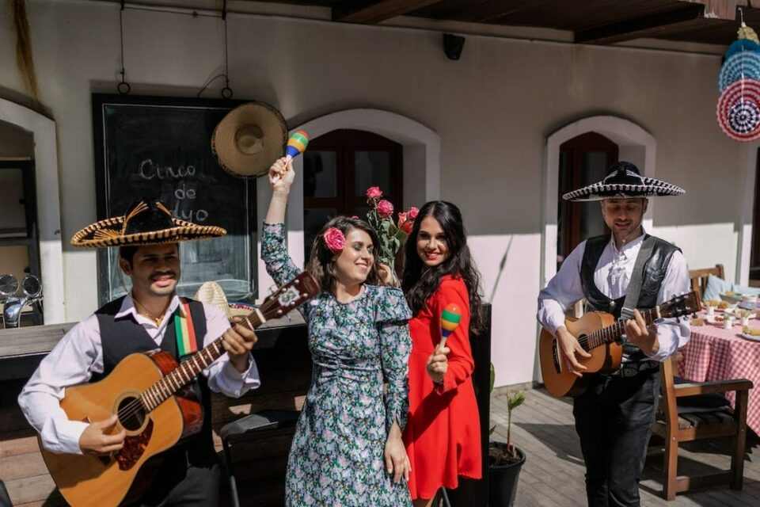
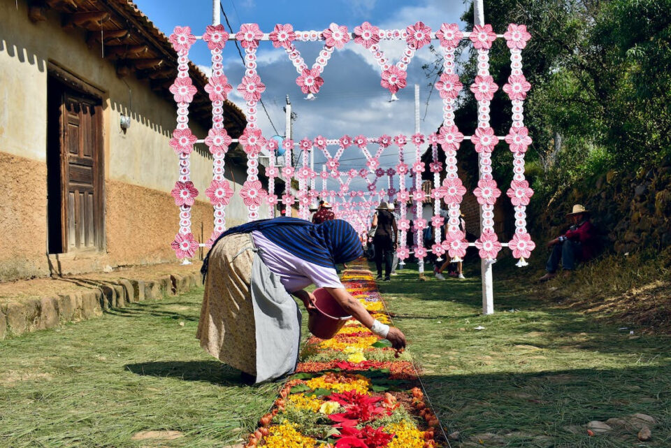
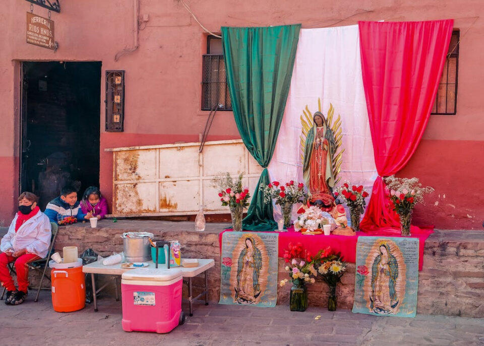
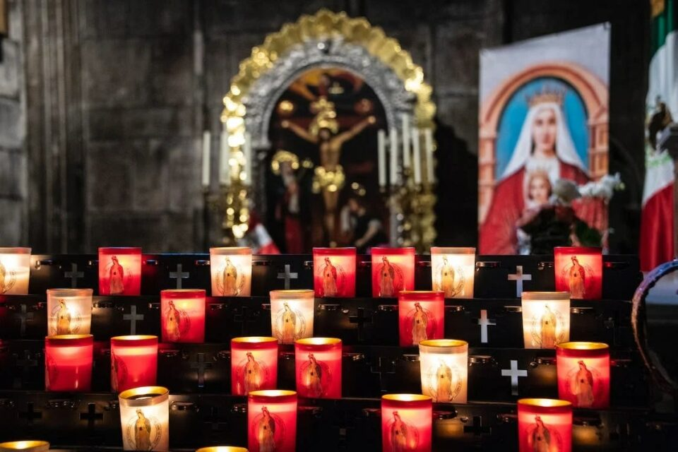
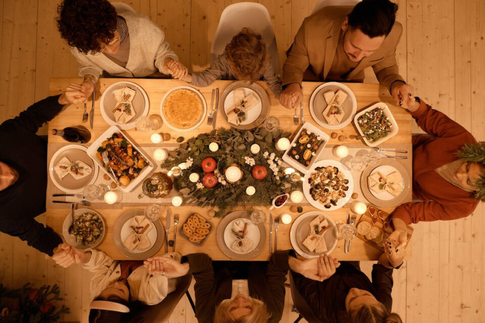
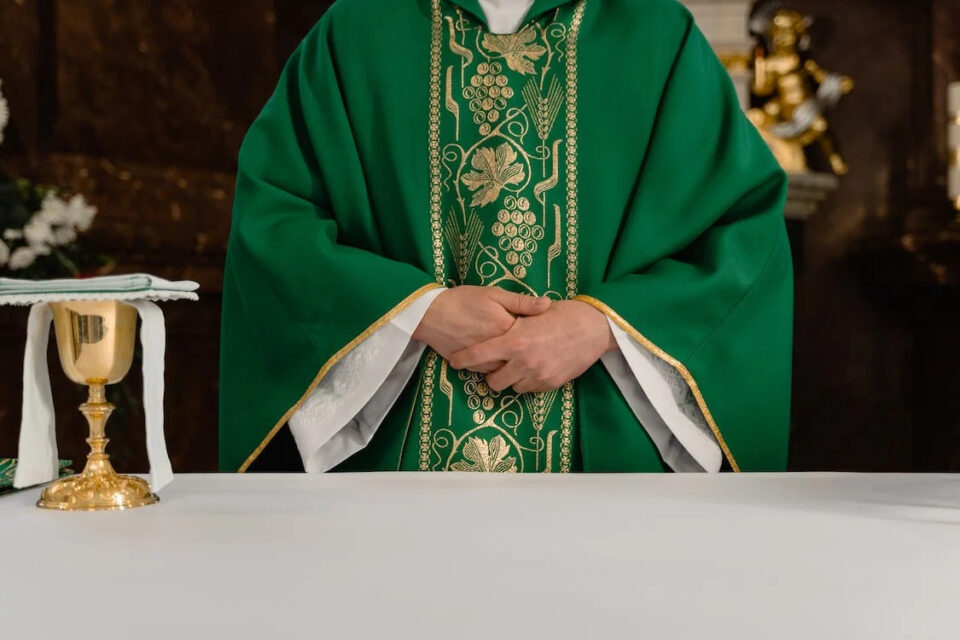
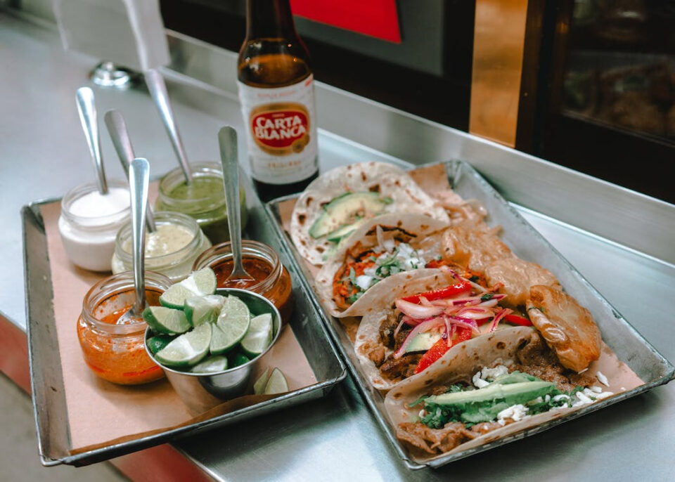
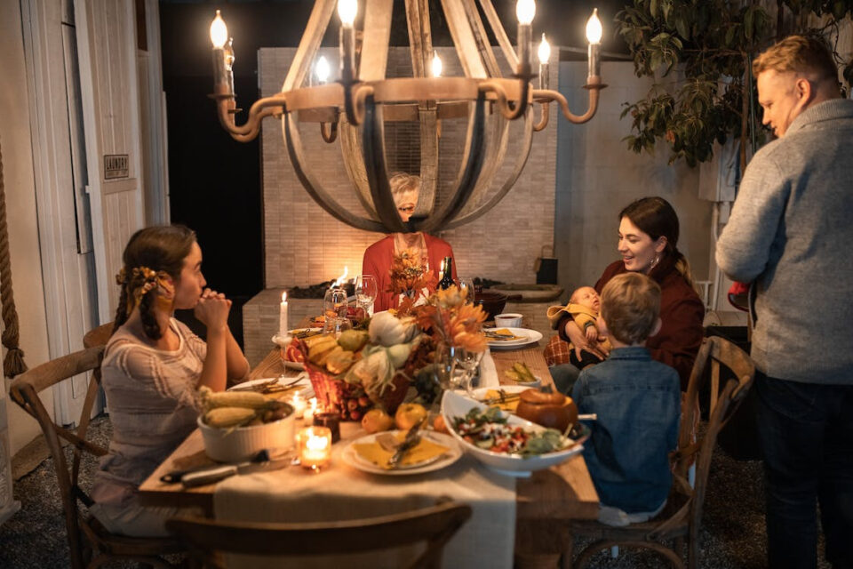
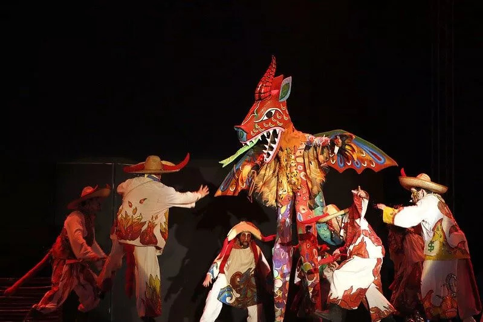
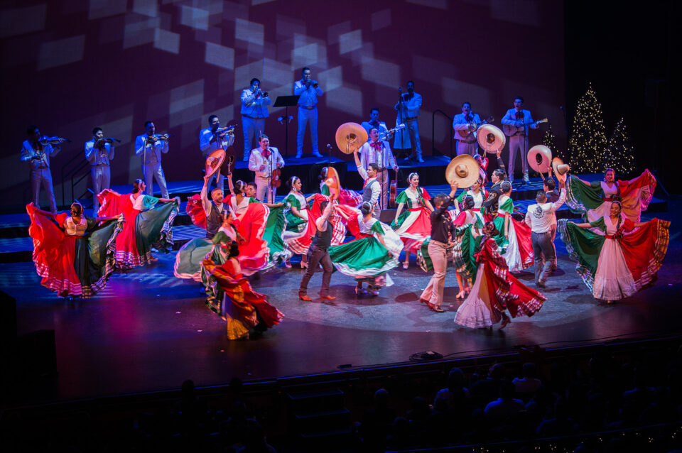

This article has been written and researched by our expert Loveable through a precise methodology. [Learn more about our methodology](https://avada.io/loveable/our-methodological.html)

[Loveable](https://avada.io/loveable/) > [Blog](https://avada.io/loveable/blog/) > [Holiday](https://avada.io/loveable/holiday/)

# 12 Mexican Christmas Traditions: A Colorful Fiesta of Festive Celebrations

Written by [Blake Simpson](https://avada.io/loveable/author/blake/) Last Updated on September 12, 2023

- [12 Unique Mexican Christmas Traditions That You Can Discover](https://avada.io/loveable/blog/mexican-christmas-traditions/#wp-block-heading-2-2)
    - [1\. Posadas – Christmas parties](https://avada.io/loveable/blog/mexican-christmas-traditions/#wp-block-heading-3-3)
    - [2\. The Journey to a Holy place](https://avada.io/loveable/blog/mexican-christmas-traditions/#wp-block-heading-3-7)
    - [3\. Day of the Virgin of Guadalupe](https://avada.io/loveable/blog/mexican-christmas-traditions/#wp-block-heading-3-10)
    - [4\. Celebration of the birth of Jesus](https://avada.io/loveable/blog/mexican-christmas-traditions/#wp-block-heading-3-13)
    - [5\. The Nativity Play “Pastorelas”](https://avada.io/loveable/blog/mexican-christmas-traditions/#wp-block-heading-3-17)
    - [6\. The over party](https://avada.io/loveable/blog/mexican-christmas-traditions/#wp-block-heading-3-20)
    - [7\.  Mass – Misa](https://avada.io/loveable/blog/mexican-christmas-traditions/#wp-block-heading-3-23) 
    - [8\.  Christmas Food – Comida de Navidad](https://avada.io/loveable/blog/mexican-christmas-traditions/#wp-block-heading-3-26)
    - [9\. Drinks – Bebidas](https://avada.io/loveable/blog/mexican-christmas-traditions/#wp-block-heading-3-29)
    - [10\. Family time](https://avada.io/loveable/blog/mexican-christmas-traditions/#wp-block-heading-3-33)
    - [11\. Distinctive dramas](https://avada.io/loveable/blog/mexican-christmas-traditions/#wp-block-heading-3-38)
    - [12\. Navidad is the Day Before](https://avada.io/loveable/blog/mexican-christmas-traditions/#wp-block-heading-3-41)
- [Bottom line](https://avada.io/loveable/blog/mexican-christmas-traditions/#wp-block-heading-2-45)

**Mexican Christmas traditions** showcase the vibrant culture, rich history, and colorful traditions of the Mexican people. Rooted in indigenous customs and Spanish colonial influences, these traditions showcase deep-seated spirituality, familial bonds, and exuberant celebrations. These centuries-old rituals continue to thrive, illuminating the holiday season with their unique charm.

## **12 Unique Mexican Christmas Traditions That You Can Discover**

### **1\. Posadas – Christmas parties**

Mexicans celebrate in their communities during posadas from December 16 until December 23. The major components of this Mexican festival custom are singing the posada song, breaking 7-peaked piatas laden with fruits, and sipping ponche. 

Most of the population is outside the home, while the remainder remains inside with the lights off. People outside begin singing the posada tune and requesting accommodations. Before visiting a posada, make sure you are familiar with the song. 

### **2\. The Journey to a Holy place**

This Mexican Christmas tradition involving the Virgin of Guadalupe, is significant to the people of Mexico. From December 1 to 12, groups from various institutions, businesses, and organizations parade through streets to churches dedicated to the Virgin. They sing songs in honor of the Virgin and perform pre-Hispanic dances. These festivals blend pre-Hispanic and Mexican traditions, influenced by Spanish colonists.

### **3\. Day of the Virgin of Guadalupe**

The 12-day Pilgrimage celebrations come to an end on December 12, which is the Virgin of Guadalupe’s day across Mexico. The last pilgrimage is performed on this day; however, this does not imply that it is the least significant. Contrarily, as this day marks the Virgin of Guadalupe’s anniversary, large contingents of flawless form are paraded to venerate the virgin. The Virgin of Guadalupe is honored with prayers, music, and flowers at these celebrations before “Las Mananitas” is finally sung.

### **4\. Celebration of the birth of Jesus**

The “Nacimientos” is a traditional Christmas decoration in Mexico, depicting Jesus’ birth with painted clay figurines. The figurines depict the individuals that were said to have been there at Jesus’ birth: Joseph, the Virgin Mary, the donkey that brought them, the three wise men, shepherds, their sheep, other farm animals, angels, and, in some cases, even the devil lurking in a corner.

Of course, the primary character is baby Jesus, but he is not placed in the manger until December 24 at 12 midnight, when a family member—usually one of the small ones—has the honor. “Nacimientos” is unquestionably an essential component of how Mexico celebrates Christmas.

### **5\. The Nativity Play “Pastorelas”**

This is one of the most typical Mexican Christmas customs in the world. These are dark comedy dramas in which the actors arrive at the birth of Jesus following a sequence of events. People are generally tempted by the devil, but with the angels’ assistance and good judgment, they make the right decisions and have a lovely Christmas.

### **6\. The over party**

Christmas Eve finally arrives after all the Christmas festival activities and Mexican celebrations. On December 24th, families assemble for a traditional feast with a hog leg or baked turkey, a sweet salad of vegetables and fruits, buns, bunuelos, and Christmas beverages. At 12 a.m., everyone exchanges hugs and Christmas greetings. Some families will swap gifts after supper.

### **7\.  Mass – _Misa_** 

On Nochebuena or Christmas Eve, it is traditional in Mexico to attend church. They are open from early in the morning until late at night, and a large number of people attend. 

### **8\.  Christmas Food – Comida de Navidad**

One of the most popular Christmas dishes in Mexico is fish or bacalao. White wine, potatoes, red pepper, olives, tomato, olive oil, garlic, and onion are used in the preparation. Check out some must-try [Christmas dinner ideas](https://avada.io/loveable/blog/christmas-dinner-ideas/) to make this holiday more memorable.

### **9\. Drinks – Bebidas**

Ponche de frutas (fruit punch) and chocolate caliente (hot cocoa) are the kings of Christmas beverages in Mexico. Hot cocoa doesn’t taste like Christmas unless you use the Abuelita brand, and we love having it with [churros](https://www.spanish.academy/blog/a-vocabulary-guide-at-the-spanish-bakery/).

**_See More:_** 25 Best [Christmas Drinks](https://avada.io/loveable/blog/christmas-drinks/) To Spread Joy and Warmth

### **10\. Family time**

Christmas meals are frequently celebrated all throughout December in Mexico, sometimes with friends, sometimes with family, and with coworkers. But the one with your family on December 24 is the one you must attend. Because of this, events on this day are seldom.

You usually just spend this day with your immediate relatives. You may do whatever you want on January 1. 

**_See More:_** [Funny Family Christmas Card Ideas](https://avada.io/loveable/blog/funny-family-christmas-card/)

### **11\. Distinctive dramas**

Pastorelas are short dramas in which a hermit, his wife, and a few shepherds are stopped by three devils on their trip to visit the newborn monarch, Baby Jesus. They are supported by angels as they battle the devils daily. The State of Mexico pastorelas in Tepotzotlán also feature mariachi music and pyrotechnics. Pick this one if you enjoy stunning displays.

### **12\. Navidad is the Day Before**

The actual holiday in Mexico is December 24 – the day before Christmas to celebrate the birth of Jesus. Families in Mexico have meals together, exchange gifts, and crack jokes. Some people continue to dance till sunrise. 

In Mexico, the day before Christmas is called “nochebuena”. They have a custom of purchasing them and utilizing them as decorations inside our homes, on the street, lawn, front porch, or anywhere else they are noticeable.

## **Bottom line**

As you journey deeper into this article, you’ll immerse yourself in the heartwarming narratives of how these practices came to be and hear from renowned cultural experts who have dedicated their lives to preserving and sharing these age-old festivities. Did you feel excited when exploring the captivating stories and rich history that have shaped this vibrant holiday tapestry?

If you can travel there, come with these fascinating **Mexican Christmas traditions** and experience the joy, warmth, and togetherness they bring to the most beautiful time of the year. 

- [12 Unique Mexican Christmas Traditions That You Can Discover](https://avada.io/loveable/blog/mexican-christmas-traditions/#wp-block-heading-2-2)
    - [1\. Posadas – Christmas parties](https://avada.io/loveable/blog/mexican-christmas-traditions/#wp-block-heading-3-3)
    - [2\. The Journey to a Holy place](https://avada.io/loveable/blog/mexican-christmas-traditions/#wp-block-heading-3-7)
    - [3\. Day of the Virgin of Guadalupe](https://avada.io/loveable/blog/mexican-christmas-traditions/#wp-block-heading-3-10)
    - [4\. Celebration of the birth of Jesus](https://avada.io/loveable/blog/mexican-christmas-traditions/#wp-block-heading-3-13)
    - [5\. The Nativity Play “Pastorelas”](https://avada.io/loveable/blog/mexican-christmas-traditions/#wp-block-heading-3-17)
    - [6\. The over party](https://avada.io/loveable/blog/mexican-christmas-traditions/#wp-block-heading-3-20)
    - [7\.  Mass – Misa](https://avada.io/loveable/blog/mexican-christmas-traditions/#wp-block-heading-3-23) 
    - [8\.  Christmas Food – Comida de Navidad](https://avada.io/loveable/blog/mexican-christmas-traditions/#wp-block-heading-3-26)
    - [9\. Drinks – Bebidas](https://avada.io/loveable/blog/mexican-christmas-traditions/#wp-block-heading-3-29)
    - [10\. Family time](https://avada.io/loveable/blog/mexican-christmas-traditions/#wp-block-heading-3-33)
    - [11\. Distinctive dramas](https://avada.io/loveable/blog/mexican-christmas-traditions/#wp-block-heading-3-38)
    - [12\. Navidad is the Day Before](https://avada.io/loveable/blog/mexican-christmas-traditions/#wp-block-heading-3-41)
- [Bottom line](https://avada.io/loveable/blog/mexican-christmas-traditions/#wp-block-heading-2-45)

### [Blake Simpson](https://avada.io/loveable/author/blake/)

Hi, I'm Blake from Loveable. I help people find perfect gifts for occasions like anniversaries and weddings. I also write a blog about holidays, sharing insights to make them more meaningful. Let's create unforgettable moments together!

- [Twitter](https://twitter.com/intent/tweet)
- [Facebook](https://www.facebook.com/sharer/sharer.php)
- [instagram](https://avada.io/loveable/blog/mexican-christmas-traditions/)
- [pinterest](https://www.pinterest.com/loveablellc/)

## Related Posts

[### 120+ Christian Birthday Wishes To Spread Your Love](https://avada.io/loveable/blog/christian-birthday-wishes/) 

[

### 35 Best 70th Birthday Ideas To Celebrate The Special Milestone

](https://avada.io/loveable/blog/70th-birthday-ideas/)

[

### 50 Best 30th Birthday Decorations for a Remarkable Birthday Bash

](https://avada.io/loveable/blog/30th-birthday-decorations/)

[

### 40 Delicious Vegan Christmas Desserts to Delight Your Palate

](https://avada.io/loveable/blog/vegan-christmas-desserts/)

[

### 60 Christmas Team Building Activities to Boost Workplace Spirit

](https://avada.io/loveable/blog/christmas-team-building-activities/)
