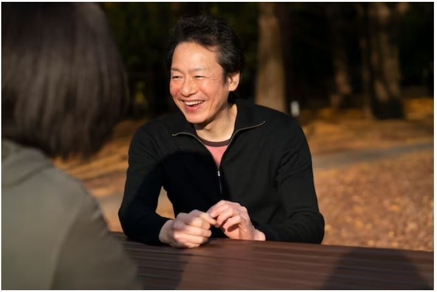

This article has been written and researched by our expert Loveable through a precise methodology. [Learn more about our methodology](https://avada.io/loveable/our-methodological.html)

[Loveable](https://avada.io/loveable/) > [Blog](https://avada.io/loveable/blog/) > [Relationship](https://avada.io/loveable/relationship/)

# 12+ Ultimate Things You Should Know Before Dating An Older Man

Written by [Luna Miller](https://avada.io/loveable/author/luna/) Last Updated on August 21, 2023

- [Are older men more appealing to women?](https://avada.io/loveable/blog/dating-an-older-man/#wp-block-heading-2-3)
- [12+ Ultimate Things You Should Know Before Dating An Older Man](https://avada.io/loveable/blog/dating-an-older-man/#wp-block-heading-2-13)
    - [1\. An older man deserving your time knows what he wants in a love relationship](https://avada.io/loveable/blog/dating-an-older-man/#wp-block-heading-3-15)
    - [2\. He’s financially stable](https://avada.io/loveable/blog/dating-an-older-man/#wp-block-heading-3-18)
    - [3\. Communication easily between both of you](https://avada.io/loveable/blog/dating-an-older-man/#wp-block-heading-3-22)
    - [4\. The older man is more confident](https://avada.io/loveable/blog/dating-an-older-man/#wp-block-heading-3-26)
    - [5\. Jealousy takes a backseat](https://avada.io/loveable/blog/dating-an-older-man/#wp-block-heading-3-29)
    - [6\. He might have less time for you](https://avada.io/loveable/blog/dating-an-older-man/#wp-block-heading-3-32)
    - [7\. Feeling immature can appear in you](https://avada.io/loveable/blog/dating-an-older-man/#wp-block-heading-3-35)
    - [8\. He might be a bit controlling](https://avada.io/loveable/blog/dating-an-older-man/#wp-block-heading-3-40)
    - [9\. Life may be stereotyped](https://avada.io/loveable/blog/dating-an-older-man/#wp-block-heading-3-44)
    - [10\. You might not get along with his friends](https://avada.io/loveable/blog/dating-an-older-man/#wp-block-heading-3-48)
    - [11\. He may have an ex-wife or children](https://avada.io/loveable/blog/dating-an-older-man/#wp-block-heading-3-51)
    - [12\. There might be a slight gap in your relationship](https://avada.io/loveable/blog/dating-an-older-man/#wp-block-heading-3-54)
    - [13\. He may want to get married soon](https://avada.io/loveable/blog/dating-an-older-man/#wp-block-heading-3-58)
    - [14\. You might not have the same sexual desires](https://avada.io/loveable/blog/dating-an-older-man/#wp-block-heading-3-61)
- [Advice on Dating an Older Man](https://avada.io/loveable/blog/dating-an-older-man/#wp-block-heading-2-65)
    - [1\. Respect his past](https://avada.io/loveable/blog/dating-an-older-man/#wp-block-heading-3-67)
    - [2\. Don’t joke about the disparity in years](https://avada.io/loveable/blog/dating-an-older-man/#wp-block-heading-3-70)
    - [3\. If he has children, love them](https://avada.io/loveable/blog/dating-an-older-man/#wp-block-heading-3-72)
    - [4\. Be open about valuable lessons he can teach you](https://avada.io/loveable/blog/dating-an-older-man/#wp-block-heading-3-76)
- [Conclusion](https://avada.io/loveable/blog/dating-an-older-man/#wp-block-heading-2-82)

Are you considering taking the plunge and **dating an older man**? It can be a great experience, but there are also a few things that you should know before jumping into it. Whether it’s just for fun or something more long-term, it’s important to understand the pros and cons of such relationships before getting involved.

With this article, discover 13 key points that will help you make an informed decision when considering dating an older man. All of your burning questions about such partnerships will be answered in this comprehensive guide, from age gaps to societal judgments!

## Are older men more appealing to women?

We are all keenly aware of our age. However, it does more than only indicate the passage of time. Each decade brings with it a new set of social expectations and judgments. This issue makes it difficult to understand why women date older guys properly.

Many people are surprised when young ladies choose older guys if the age difference is too big. But who are we to pass judgment?

People should be allowed to pursue their lives as long as their relationships are consensual and do not cause harm to others. However, how often are these significant age-gap relationships?

According to Psycom, just 8% of heterosexual couples in Western nations have a 10-year or more difference. That works out to less than one person for every ten people you know. Most significantly, there does not appear to be an ideal age difference for a young woman dating an older man.

_Are older men more appealing to women?_

Every partnership experiences ups and downs. Young ladies who prefer older guys may take special advice. So, how can you balance disparities in life objectives or excessive financial disparities?

Tips for a younger woman dating an older man should include how to deal with medical difficulties. Everything will most likely fall on the younger partner’s shoulders.

For younger women, such obstacles can be daunting. At that age, they are frequently still finding things out. As a result, a relationship therapist may be quite beneficial. Regardless of the difficulties, dating an older man, like any other relationship, may be extremely rewarding.

So, do females prefer older men? Yes, according to the statistics, in most situations. Nonetheless, the reality of the age gap is more complicated.

## 12+ Ultimate Things You Should Know Before Dating An Older Man

_12+ Ultimate Things You Should Know Before Dating An Older Man_

### 1\. An older man deserving your time knows what he wants in a love relationship

Among the benefits of dating an older man, older men can possibly bring greater stability, a strong sense of self, and job development to the table than guys in their 20s or 30s. People frequently question whether an older man is more mature than a younger man. It is dependent on the individual, their growth, and their past. Having said that, more life experience frequently leads to better relationship maturity and life wisdom.

Of course, a woman in her 40s or older has plenty of hard-won lessons and accomplishments to talk about. She could like to be acquainted with someone who is on an equal level.

### 2\. He’s financially stable

Being financially healthy does not imply earning $300,000 per year. It’s all about being financially savvy with his money. Perhaps you should invest in it or purchase a property. It is essentially the inverse of being broke, which is a libido-killer for most women.

It’s good to be with a man who can pay for supper. Whose automobile breaks down in front of your house? Who has several shirts? Who can afford an unexpected weekend break with you? 

There’s a fascination to it, and you don’t necessarily find that in a younger person who’s still trying to establish himself in his job.

### 3\. Communication easily between both of you

In terms of communication, an older man is more likely to communicate better than a younger man. He’s more likely to have been in at least one serious relationship, so the communication between you is expected to have come up because he’s learned how to express himself constructively and in ways that will make him a good partner.

Dating an older man could surprise you: he might be a better listener than anybody younger you’ve dated. And if you prefer communicating on the phone to texting, he probably does as well.

_Communication easily between both of you_

### 4\. The older man is more confident

Older guys have more life experience; thus, they tend to be more confident. They’ve been through it all: sexually, financially, professionally, and romantically. They are not afraid to express themselves. They carry themselves with a confident style that you find attractive.

Logically, you’d consider dating an older man if you’ve dated younger men who were weak and lacked confidence. That confidence and willingness to look after his lady are both charming.

### 5\. Jealousy takes a backseat

Younger men are prone to become envious at the drop of a hat. It’s yawn-inducing, but how lovely is it to be with a man who understands that another man may occasionally adore his lady and not stress out about it?

It all comes back to confidence. He is secure in his possessions (including you) and is not intimidated by another guy.

### 6\. He might have less time for you

You may discover that an older man has less time for you than you expected. If he is in an executive-level job at a corporation, he may work late evenings, which means dinners out with you will be rare. 

Perhaps he’s just a guy of habit (which is understandable given his age), and work has dominated everything else for so long that quality time isn’t at the top of his priority list. Are you okay with it? If not, and this is the case, you might wish to talk to someone younger—or date someone younger.

### 7\. Feeling immature can appear in you

_Feeling immature can appear in you_

You are the mature one among your buddies. They look to you for counsel, and you have a cool head on your shoulders.

When you date a much older man, you may feel like a kid as he’s been through much more than you have. He’s had many experiences. And if he makes you feel like that, you’ll suffer even more.

You want a man from whom you can learn, regardless of his age. Just be sure he is taking on the position of your lecturer with your permission.

### 8\. He might be a bit controlling

Older guys, who frequently know what they want, may have a strong urge to dominate a circumstance—and you, too.

As we become older, our habits become more established. Each way is possible. But for a relationship to function, you both need to be able to make changes.

When dating an older man, if you think he’s controlling right away, go away. You need a partner who won’t attempt to convert you and will accept you as you are.

### 9\. Life may be stereotyped

Your previous boyfriend brought you to parties. In addition, you frequently went out to eat or drink. However, this older gentleman wishes to spend every night of the week at home. He’s had his party years already. He’s had enough of going out and being social. As a result, you’re left disappointed.

While it varies on the individual, an older guy may enjoy his routines and be less eager to go out. So if you value having a busy social life, the relationship of dating an older man or younger woman may not be for you.

_Life may be stereotyped_

### 10\. You might not get along with his friends

This man may be madly in love with you; therefore, he’s prepared to overlook the age gaps between you. But his pals are a different story. They may be troubled about why he is dating you and may give you the cold shoulder. 

It may be difficult to persuade them to treat you seriously while you’re much younger than them. On the other hand, if your man’s worth it, you should put in the effort to get along with them as well as possible. But keep in mind that they may never genuinely embrace you.

### 11\. He may have an ex-wife or children

If he has more than a couple years on you, he’s probably had a couple more romances as well. One of them may even have ended in divorce. Again, this is not a terrible thing. If your guy has gone through a failed marriage, he will approach the second marriage with greater caution and insight, bringing lessons gained about himself as a partner in the prior partnership.

However, if he had children from that relationship, there is another factor to consider. How old are his children? Is he in contact with them frequently? Or will you be a part of their lives? This demands a thorough talk. Integrating into his family may be more challenging than you anticipated, particularly if he has older daughters.

### 12\. There might be a slight gap in your relationship

_There might be a slight gap in your relationship_

Perhaps you want someone who is up to date on what’s new, current, or fresh. That’s not to suggest an older person couldn’t do it, but they might not be as up-to-date on every trend. It’s something to think about if you’re dating an older man.

However, not sharing the same hobbies or cultural reference points might be a great opportunity to learn from one another. Only when one person is less flexible or spontaneous while the other is continually asking them to try something new can a problem occur. What is the best solution? Compromise!

### 13\. He may want to get married soon

If he’s searching for a long-term relationship, he could be a touch too quick for you. For example, if he asks your ring size on the first date; starts looking for a house for the two of you early on; or expresses his love for you after only a few times of meetings; you might need to pump the breaks.

You probably desire a committed relationship as well, but you realize you can’t hurry into it. It is never a good idea to rush into a well-established partnership.

### 14\. You might not have the same sexual desires

Everyone in every pair, regardless of age, always desires more or less sex. However, when there are large age gaps, this can be even more obvious. 

An older man has an older body with less energy and a different sexual need. However, this may be resolved by openly discussing sex and if both of your wants are being satisfied. It’s not a deal breaker; it’s just uncomfortable to talk.

**_Check Out_**_:_ Best [Perfect Gift For Him](https://avada.io/loveable/perfect-gift-him/) That He’ll Cherish Forever

## Advice on Dating an Older Man

_Advice on Dating an Older Man_

### 1\. Respect his past

An older man is likely to have had at least one significant relationship in his past. If he has children, his ex may still be present in his life. 

Don’t worsen the situation by appearing envious or bringing up former relationships. You’re with him now, and what’s gone is gone. So you expect the same attitude from him.

### 2\. Don’t joke about the disparity in years

Just like you don’t like being considered a little baby all the time, an old man doesn’t appreciate it at all when you frequently try to make fun of his age. It’s not acceptable. You won’t make a big deal about age if age isn’t important to you.

### 3\. If he has children, love them

_If he has children, love them_

Perhaps you never intended to have children and are now with an older man who does. If you’re serious about going further with him, you should put effort into getting to know them and establishing a relationship with them. That will even further benefit your relationship.

Depending on their ages and characteristics, it may take some time for the kids to warm up to you. Give it some time. Try not to be a second mother to them but rather a friend. Find opportunities to spend time with them alone and do something they enjoy. He’ll take notice and fall even more in love with you!

### 4\. Be open about valuable lessons he can teach you

A man who has been around the block a few times over has a lot to offer. In addition, he may have interests that you’ve never considered, so if you’re open, you could discover new things that you enjoy doing.

He may possibly have learned lessons from previous relationships that might help you be a better companion. So pay attention and see what you may learn.

_**Related:**_

- Best [Fall Dates Ideas](https://avada.io/loveable/fall-dates-ideas/) For Couples 

- 15+ [Things To Talk About On A First Date](https://avada.io/loveable/what-to-talk-about-on-first-date/) To Make A Strong Impression

## Conclusion

Ultimately, **dating an older man** is a unique experience that isn’t for everyone; however, if the chemistry is right and you make mature decisions, it can be a rewarding relationship. No one has all the answers, but ultimately it’s down to individual preference. 

Older men have experienced more of life’s ups and downs, but that doesn’t mean every relationship with an age gap will have a happy ending. That’s why it is important for you to carefully take all of these points into account before committing to an older relationship partner. 

Whether this life-shifting decision turns out to be beneficial or detrimental depends solely on the people involved and their level of tolerance for each other’s differences. That being said, if you both explore your differences in an open-minded way, you can potentially learn from each other and grow together despite whatever age difference exists between the two of you.

- [Are older men more appealing to women?](https://avada.io/loveable/blog/dating-an-older-man/#wp-block-heading-2-3)
- [12+ Ultimate Things You Should Know Before Dating An Older Man](https://avada.io/loveable/blog/dating-an-older-man/#wp-block-heading-2-13)
    - [1\. An older man deserving your time knows what he wants in a love relationship](https://avada.io/loveable/blog/dating-an-older-man/#wp-block-heading-3-15)
    - [2\. He’s financially stable](https://avada.io/loveable/blog/dating-an-older-man/#wp-block-heading-3-18)
    - [3\. Communication easily between both of you](https://avada.io/loveable/blog/dating-an-older-man/#wp-block-heading-3-22)
    - [4\. The older man is more confident](https://avada.io/loveable/blog/dating-an-older-man/#wp-block-heading-3-26)
    - [5\. Jealousy takes a backseat](https://avada.io/loveable/blog/dating-an-older-man/#wp-block-heading-3-29)
    - [6\. He might have less time for you](https://avada.io/loveable/blog/dating-an-older-man/#wp-block-heading-3-32)
    - [7\. Feeling immature can appear in you](https://avada.io/loveable/blog/dating-an-older-man/#wp-block-heading-3-35)
    - [8\. He might be a bit controlling](https://avada.io/loveable/blog/dating-an-older-man/#wp-block-heading-3-40)
    - [9\. Life may be stereotyped](https://avada.io/loveable/blog/dating-an-older-man/#wp-block-heading-3-44)
    - [10\. You might not get along with his friends](https://avada.io/loveable/blog/dating-an-older-man/#wp-block-heading-3-48)
    - [11\. He may have an ex-wife or children](https://avada.io/loveable/blog/dating-an-older-man/#wp-block-heading-3-51)
    - [12\. There might be a slight gap in your relationship](https://avada.io/loveable/blog/dating-an-older-man/#wp-block-heading-3-54)
    - [13\. He may want to get married soon](https://avada.io/loveable/blog/dating-an-older-man/#wp-block-heading-3-58)
    - [14\. You might not have the same sexual desires](https://avada.io/loveable/blog/dating-an-older-man/#wp-block-heading-3-61)
- [Advice on Dating an Older Man](https://avada.io/loveable/blog/dating-an-older-man/#wp-block-heading-2-65)
    - [1\. Respect his past](https://avada.io/loveable/blog/dating-an-older-man/#wp-block-heading-3-67)
    - [2\. Don’t joke about the disparity in years](https://avada.io/loveable/blog/dating-an-older-man/#wp-block-heading-3-70)
    - [3\. If he has children, love them](https://avada.io/loveable/blog/dating-an-older-man/#wp-block-heading-3-72)
    - [4\. Be open about valuable lessons he can teach you](https://avada.io/loveable/blog/dating-an-older-man/#wp-block-heading-3-76)
- [Conclusion](https://avada.io/loveable/blog/dating-an-older-man/#wp-block-heading-2-82)

### [Luna Miller](https://avada.io/loveable/author/luna/)

I'm Luna Miller, a helpful employee at Loveable. I excel at giving great advice on birthday gifts. I love suggesting memorable experiences like concerts, spas, and getaways. As a reliable and supportive colleague, I'm always there to assist.

- [Twitter](https://twitter.com/intent/tweet)
- [Facebook](https://www.facebook.com/sharer/sharer.php)
- [instagram](https://avada.io/loveable/blog/dating-an-older-man/)
- [pinterest](https://www.pinterest.com/loveablellc/)

## Related Posts

[

### 35 Unforgettable Exciting Adult Birthday Party Ideas

](https://avada.io/loveable/blog/adult-birthday-party-ideas/)

[

### 42 Best 21st Birthday Outfits to Rock the Party

](https://avada.io/loveable/blog/21st-birthday-outfits/)

[

### 50+ Happy 40th Anniversary Quotes, Messages, and Wishes

](https://avada.io/loveable/blog/happy-40th-anniversary-quotes/)

[

### 100+ Heartwarming Happy 30th Anniversary Quotes, Messages, and Wishes

](https://avada.io/loveable/blog/happy-30th-anniversary-quotes/)

[

### 120+ Heartfelt Thank You Messages for The Birthday Wishes

](https://avada.io/loveable/blog/thank-you-messages-birthday-wishes/)
