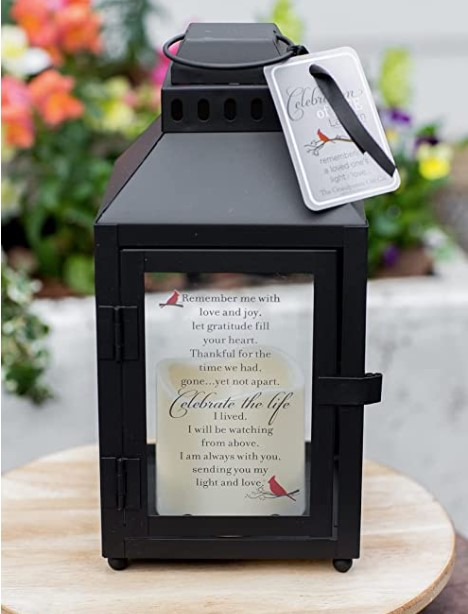
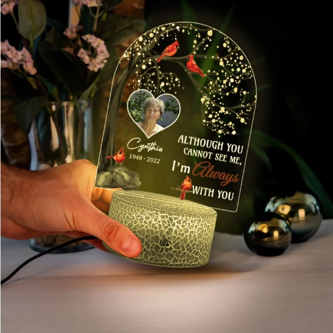
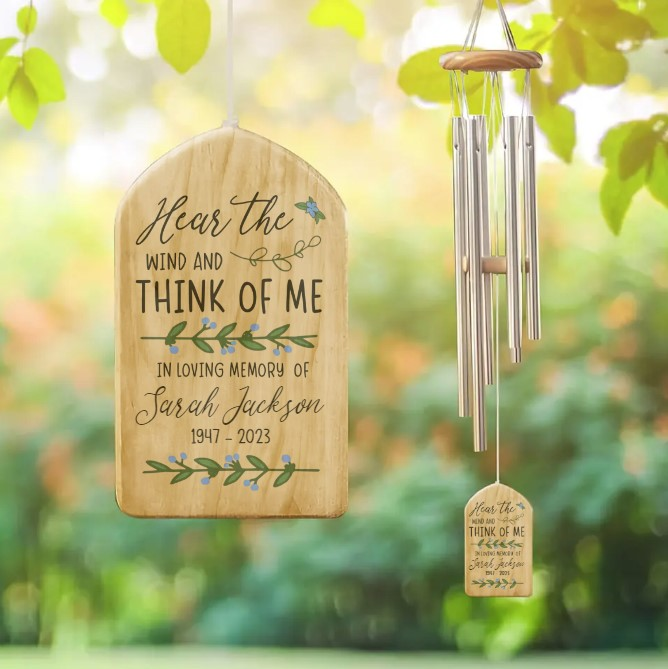

This article has been written and researched by our expert Loveable through a precise methodology. [Learn more about our methodology](https://avada.io/loveable/our-methodological.html)

[Loveable](https://avada.io/loveable/) > [Blog](https://avada.io/loveable/blog/) > [Family](https://avada.io/loveable/family/)

# 12 Ways to Cope with the Loss of a Family Member

Written by [Rose Bryne](https://avada.io/loveable/author/rose/) Last Updated on August 22, 2023

- [What do you say when someone loses a family member?](https://avada.io/loveable/blog/loss-of-a-family-member/#wp-block-heading-2-3)
- [12 Ways to Cope with the Loss of a Family Member](https://avada.io/loveable/blog/loss-of-a-family-member/#wp-block-heading-2-8) 
    - [Create Something to Commemorate Them](https://avada.io/loveable/blog/loss-of-a-family-member/#wp-block-heading-3-10)
    - [Join a Bereavement Emotional Support Group](https://avada.io/loveable/blog/loss-of-a-family-member/#wp-block-heading-3-14)
    - [Control Stress Levels](https://avada.io/loveable/blog/loss-of-a-family-member/#wp-block-heading-3-17)
    - [Be Ready for Painful Reminders](https://avada.io/loveable/blog/loss-of-a-family-member/#wp-block-heading-3-21)
    - [Find Peace in Your Religion](https://avada.io/loveable/blog/loss-of-a-family-member/#wp-block-heading-3-24)
    - [Create a Diary to Keep Memories](https://avada.io/loveable/blog/loss-of-a-family-member/#wp-block-heading-3-28)
    - [Spend Time in Nature](https://avada.io/loveable/blog/loss-of-a-family-member/#wp-block-heading-3-30)
    - [Take Care of Your Health](https://avada.io/loveable/blog/loss-of-a-family-member/#wp-block-heading-3-33)
    - [Keep Doing What You Used to Do Together.](https://avada.io/loveable/blog/loss-of-a-family-member/#wp-block-heading-3-35)
    - [Share Your Feelings With Bereavement Counselor](https://avada.io/loveable/blog/loss-of-a-family-member/#wp-block-heading-3-39)
    - [Accept Your Feelings](https://avada.io/loveable/blog/loss-of-a-family-member/#wp-block-heading-3-41)
    - [If You Have Kids, Tell Them about the Bereavement in a Simple Way](https://avada.io/loveable/blog/loss-of-a-family-member/#wp-block-heading-3-44) 
- [7 Best Memorial Gifts to Tribute the Loss of a Family Member](https://avada.io/loveable/blog/loss-of-a-family-member/#wp-block-heading-2-46)
    - [1\. Memorial Scented Candle](https://avada.io/loveable/blog/loss-of-a-family-member/#wp-block-heading-3-48) 
    - [2\. Personalized Cardinal Memorial Gifts](https://avada.io/loveable/blog/loss-of-a-family-member/#wp-block-heading-3-51)
    - [3\. Memorial Lantern with LED Candle](https://avada.io/loveable/blog/loss-of-a-family-member/#wp-block-heading-3-54)
    - [4\. Personalized Memorial LED Light for Loved One](https://avada.io/loveable/blog/loss-of-a-family-member/#wp-block-heading-3-58) 
    - [5\. Personalized Wind Chimes](https://avada.io/loveable/blog/loss-of-a-family-member/#wp-block-heading-3-61) 
- [Final Thoughts](https://avada.io/loveable/blog/loss-of-a-family-member/#wp-block-heading-2-64)

**The loss of a family member** is one of the most painful moments that a person can go through. Whether it’s a parent, sibling, spouse, or child, the grief and heartache can be overwhelming. Facing the loss of someone you love is never easy, and it’s important to remember that everyone’s journey is unique. 

However, some strategies can help you navigate the grieving process and find a way to move forward. In this article, we will explore 12 ways to cope with the loss of a family member, from seeking support to finding ways to honor their memory. These suggestions may not remove your loss’s pain, but they can provide comfort and guidance during this difficult time.

## What do you say when someone loses a family member?

What do you say when someone loses a family member

**Bereavement is the term used for grieving the loss of a loved one.** 

Bereavement refers to the experience of grief and mourning that follows the death of a significant person in your life. It is an inevitable experience of the human experience and something that most of us will encounter at some point. Losing a loved one can be an excruciatingly painful memory that can leave a lasting impact on our lives.

Bereavement is not limited to the loss of human life. For many of us, our pets are also cherished companions and members of our family. As a result, when a pet passes away, it can evoke similar emotions of grief, anguish, and sorrow.

## 12 Ways to Cope with the Loss of a Family Member 

Your support system, personality, and well-being are all factors that can influence how grief affects you after losing a loved one. Despite the magnitude of pain you may be experiencing; it’s crucial to understand that there are constructive ways to manage the agony and reconcile with your loss. 

### Create Something to Commemorate Them

Create Something to Commemorate Them

Honoring the memory of your loved one through meaningful gestures can aid in the healing process. Crafting a tribute such as a website, photo album, or scrapbook can showcase the affection and connection you shared. 

Additionally, planting a tree or flowers as a tribute can be a fulfilling way to watch new life flourish and bloom, providing a sense of comfort and growth during a difficult time.

### Join a Bereavement Emotional Support Group

Although your loved ones may offer their support, they may not always know the most effective ways to help you cope. Finding solace in the company of those who have undergone similar losses can alleviate feelings of isolation and provide comfort during times of grief. 

Engaging with support groups enables you to listen to others’ experiences and, in turn, gain valuable coping mechanisms. You can locate support groups by reaching out to counseling centers, funeral homes, or hospitals within your vicinity or by contacting a bereavement hotline listed below.

### Control Stress Levels

Control Stress Levels

Managing stress is crucial when coping with the loss of a family member. Grief can take a toll on your emotional and physical well-being, and it’s important to take care of yourself during this challenging time. 

Engage in joyful activities that promote relaxation, such as meditation, yoga, or deep breathing exercises. Additionally, make sure to prioritize self-care by [eating healthy food](https://avada.io/loveable/healthy-lifestyle-habits/), getting enough sleep, and [staying physically active](https://avada.io/loveable/family-outdoor-activities/).

### Be Ready for Painful Reminders

At times, coping with bereavement may feel more tolerable than others. However, a sudden reminder like a photo, melody, or memory can trigger intense emotions. While you can’t anticipate when such triggers may surface, you can brace yourself for significant events like holidays, anniversaries, or birthdays that may reignite your grief. 

Communicate with your loved ones in advance and decide on meaningful ways to honor the occasion. This proactive approach can help ease the burden of grief and provide a sense of comfort and support during difficult times.

### Find Peace in Your Religion

Find Peace in Your Religion

For those who are religious, mourning rituals and practices unique to your faith can offer solace and unite you with others who share your grief. Engaging in religious services, reading spiritual texts, praying, meditating, or seeking guidance from a clergy member can provide comfort and help you make sense of your loved one’s passing. 

Participating in these activities can help you derive meaning from your experience and find a sense of peace amidst the pain.

### Create a Diary to Keep Memories

Expressing the thoughts and feelings that were left unsaid to your loved one can serve as a significant emotional release and aid in comprehending the array of emotions you may be experiencing. Uttering those unspoken words can offer a sense of closure and enable you to process your thoughts and emotions more effectively. By doing so, you may also feel a sense of relief and peace, knowing that you were able to convey what was in your heart.

### Spend Time in Nature

Spend Time in Nature

When you are grieving, spending time in nature and immersing yourself in green spaces can be a peaceful and soothing experience. Activities such as gardening, hiking, or taking a stroll in a park or woodland can help you feel connected with the world around you and provide a sense of tranquility. Nature has a way of helping us slow down and find moments of stillness.

### Take Care of Your Health

Taking care of your physical health by eating well and getting enough sleep can help you cope with grief. Avoid relying on sleep aids for too long and establish a healthy sleep routine instead. This can include going to bed at the same time each night, creating a relaxing environment, and limiting caffeine and alcohol intake before bed. 

### Keep Doing What You Used to Do Together.

Keep Doing What You Used to Do Together.

Continuing with activities that you shared with your loved one can be a way to keep their memory alive and honor their life. Even if it’s painful at first, there may come a time when doing these activities brings you comfort and helps you feel closer to them. 

Whether it’s going to a sports event, listening to music, or taking long walks together, holding onto these routines can be a way to find meaning and a sense of connection even after your loved one is gone.

### Share Your Feelings With Bereavement Counselor

If you’re finding it hard to come to terms with your loss or feel like your grief is too much to handle, seeking help from a bereavement or grief therapist could be a beneficial step. You can choose to talk to a therapist in person or through online video conferencing. By confiding in a professional, you may find it easier to work through emotions that you might not be comfortable sharing with your loved ones.

### Accept Your Feelings

Accept Your Feelings

It’s common to experience a mix of emotions, such as sadness, anger, or exhaustion, while grieving. Acknowledging these feelings is crucial, and seeking support is important when feeling stuck or overwhelmed. Licensed psychologists and other mental health professionals can provide helpful coping strategies and guidance to help manage emotions and get back on track.

### If You Have Kids, Tell Them about the Bereavement in a Simple Way 

It’s necessary to be honest when breaking the news of a loved one’s passing. Don’t delay or sugarcoat the news out of fear of upsetting others. Use clear and straightforward language to share the news and be prepared to answer any questions they may have. Avoid using euphemisms such as “passed on” or “lost.” Instead, simply state the facts, for example, “I have sad news. Uncle Dave died last night.”

## 7 Best Memorial Gifts to Tribute the Loss of a Family Member

When someone passes away, creating a memorial gift can be a thoughtful way to [honor their memory](https://avada.io/loveable/memory-help-games/) and offer comfort to loved ones. If you’re struggling to find the right memorial gift, don’t worry. Loveable has a memorial gift collection that can guide you in choosing one that will be meaningful and satisfying. With our suggestions, you can find a memorial gift that truly reflects the life and legacy of your loved one.

### 1\. [Memorial Scented Candle](https://loveable.ai/products/the-moment-that-you-left-me-custom-name-scented-candle-best-memorial-gifts-loving-memory-212ihpnpsc628?variant=44173906280680) 

memorial scented candle

The custom name-scented candle “The Moment That You Left Me” from Loveable makes a perfect memorial gift to keep the memory of a loved one. The candle’s soft, warm glow and comforting scent can bring peace and closeness to grieving people. In addition, candles are made from materials that are completely safe for health. The ability to personalize the candle with a loved one’s name makes it a beautiful and meaningful present that will be loved for years to come. 

### 2\. [Personalized Cardinal Memorial Gifts](https://www.etsy.com/listing/1132392183/memorial-gift-sympathy-gift-memorial)

Personalized Cardinal Memorial Gifts

This beautiful Cardinal memorial gift is the perfect idea to commemorate a loved one who has passed away. Red cardinal birds have special spiritual significance for Christians because they symbolize eternal life. The personalized photo frame is a heartfelt way to express condolences and offer comfort to grieving friends and family. The elegant design and thoughtful message make this gift a touching tribute to a cherished life. This is also a suitable alternative to sending flowers for funerals, are these gifts can be placed in the home or garden.

### 3\. [Memorial Lantern with LED Candle](https://www.amazon.com/Celebration-Flickering-Candle-Thoughtful-Bereavement-Gift/dp/B07X3XBH4H/?th=1)

Memorial Lantern with LED Candle

The Celebration Flickering Candle is a thoughtful and comforting bereavement gift that serves as a perfect memorial. The flickering light of the candle stands for the warmth and love shared with the deceased, and the inscription on the candle offers words of condolence and comfort to the grieving family. 

The elegant design of the candle makes it a fitting addition to any home or memorial space, and its long-lasting flame ensures that the memory of the loved one continues to burn bright.

### 4\. [Personalized Memorial LED Light for Loved One](https://loveable.ai/products/although-you-cannot-see-me-im-always-with-you-personalized-3d-led-light-best-memorial-gifts-for-family-loss-husband-wife-parents-302ihplnll241?variant=44325056151784) 

Personalized Memorial LED Light for Loved One 

The “Although You Cannot See Me, I’m Always With You” personalized 3D LED light is a thoughtful and sentimental memorial gift that can offer comfort to someone who has lost a loved one. The unique design features a 3D image of an angel with customizable text that reads, “Although you cannot see me, I’m always with you.” The warm and soothing glow of the LED light can be a reminder of the presence of the departed loved one, and the personalized message adds a special touch. It’s a perfect gift to show your support and love during a difficult time.

### 5\. [Personalized Wind Chimes](https://loveable.ai/products/hear-the-wind-and-think-of-me-in-loving-memory-of-personalized-name-custom-years-wind-chimes-gift-for-loss-husband-loss-brother-for-loss-beloved-303icnbnwi369?variant=44384152420584) 

Personalized Wind Chimes 

This personalized wind chime is a perfect accessory as a memorial gift to honor the memory of a loved one who has gone forever. It can be customized with the name and years of your beloved, making it a thoughtful and unique tribute. The soothing sound of the wind chime serves as a reminder of their presence and brings comfort to those who are grieving. It can be hung in the garden or on a porch; each time the wind blows, you can hear the sound and think of your loved one.

## Final Thoughts

Remember that there are many ways to grieve and that everyone experiences loss differently. Allow yourself to feel your emotions and take the time you need to process your grief. While coping with the loss of a family member is never easy, with time and support, it is possible to find a path forward and eventually heal. 

- [What do you say when someone loses a family member?](https://avada.io/loveable/blog/loss-of-a-family-member/#wp-block-heading-2-3)
- [12 Ways to Cope with the Loss of a Family Member](https://avada.io/loveable/blog/loss-of-a-family-member/#wp-block-heading-2-8) 
    - [Create Something to Commemorate Them](https://avada.io/loveable/blog/loss-of-a-family-member/#wp-block-heading-3-10)
    - [Join a Bereavement Emotional Support Group](https://avada.io/loveable/blog/loss-of-a-family-member/#wp-block-heading-3-14)
    - [Control Stress Levels](https://avada.io/loveable/blog/loss-of-a-family-member/#wp-block-heading-3-17)
    - [Be Ready for Painful Reminders](https://avada.io/loveable/blog/loss-of-a-family-member/#wp-block-heading-3-21)
    - [Find Peace in Your Religion](https://avada.io/loveable/blog/loss-of-a-family-member/#wp-block-heading-3-24)
    - [Create a Diary to Keep Memories](https://avada.io/loveable/blog/loss-of-a-family-member/#wp-block-heading-3-28)
    - [Spend Time in Nature](https://avada.io/loveable/blog/loss-of-a-family-member/#wp-block-heading-3-30)
    - [Take Care of Your Health](https://avada.io/loveable/blog/loss-of-a-family-member/#wp-block-heading-3-33)
    - [Keep Doing What You Used to Do Together.](https://avada.io/loveable/blog/loss-of-a-family-member/#wp-block-heading-3-35)
    - [Share Your Feelings With Bereavement Counselor](https://avada.io/loveable/blog/loss-of-a-family-member/#wp-block-heading-3-39)
    - [Accept Your Feelings](https://avada.io/loveable/blog/loss-of-a-family-member/#wp-block-heading-3-41)
    - [If You Have Kids, Tell Them about the Bereavement in a Simple Way](https://avada.io/loveable/blog/loss-of-a-family-member/#wp-block-heading-3-44) 
- [7 Best Memorial Gifts to Tribute the Loss of a Family Member](https://avada.io/loveable/blog/loss-of-a-family-member/#wp-block-heading-2-46)
    - [1\. Memorial Scented Candle](https://avada.io/loveable/blog/loss-of-a-family-member/#wp-block-heading-3-48) 
    - [2\. Personalized Cardinal Memorial Gifts](https://avada.io/loveable/blog/loss-of-a-family-member/#wp-block-heading-3-51)
    - [3\. Memorial Lantern with LED Candle](https://avada.io/loveable/blog/loss-of-a-family-member/#wp-block-heading-3-54)
    - [4\. Personalized Memorial LED Light for Loved One](https://avada.io/loveable/blog/loss-of-a-family-member/#wp-block-heading-3-58) 
    - [5\. Personalized Wind Chimes](https://avada.io/loveable/blog/loss-of-a-family-member/#wp-block-heading-3-61) 
- [Final Thoughts](https://avada.io/loveable/blog/loss-of-a-family-member/#wp-block-heading-2-64)

### [Rose Bryne](https://avada.io/loveable/author/rose/)

Hi, I'm Rose! I love animals and spending time with kids. At Loveable, I help people find unique gifts for special occasions like Valentine's Day, housewarmings, and graduations. I enjoy finding gifts for kids, teens, and animal lovers that match their interests and personalities. Making gift-giving a pleasant experience is my priority. Let me assist you in finding the perfect gift!

- [Twitter](https://twitter.com/intent/tweet)
- [Facebook](https://www.facebook.com/sharer/sharer.php)
- [instagram](https://avada.io/loveable/blog/loss-of-a-family-member/)
- [pinterest](https://www.pinterest.com/loveablellc/)

## Related Posts

[### 30 Best 4 Year Old Birthday Party Ideas For A Memorable Celebration](https://avada.io/loveable/blog/4-year-old-birthday-party-ideas/) 

[

### 16th Birthday Party Ideas to Make an Unforgettable Day

](https://avada.io/loveable/blog/16th-birthday-party-ideas/)

[

### 150+ Inspirational Birthday Quotes to Spread Joy on Special Day

](https://avada.io/loveable/blog/inspirational-birthday-quotes/)

[

### 160+ Birthday Wishes for Wife to Express Eternal Love

](https://avada.io/loveable/blog/birthday-wishes-for-wife/)

[### 90+ Heart Touching Birthday Wishes for Niece to Make Her Day Extra Special](https://avada.io/loveable/blog/birthday-wishes-for-niece/)
