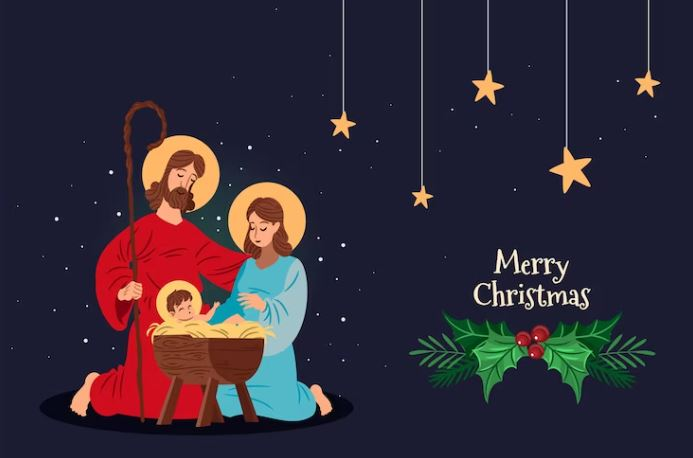

This article has been written and researched by our expert Loveable through a precise methodology. [Learn more about our methodology](https://avada.io/loveable/our-methodological.html)

[Loveable](https://avada.io/loveable/) > [Blog](https://avada.io/loveable/blog/) > [Holiday](https://avada.io/loveable/holiday/)

# 120 Best Christmas Wishes for Friends to Share Joy and Warmth 2023

Written by [Blake Simpson](https://avada.io/loveable/author/blake/) Last Updated on September 13, 2023

- [120 Best Christmas Wishes for Friends to Share Joy and Warmth](https://avada.io/loveable/blog/christmas-wishes-friends/#wp-block-heading-2-3)
    - [Funny Christmas Wishes for Friends](https://avada.io/loveable/blog/christmas-wishes-friends/#wp-block-heading-3-4)
    - [Sweet Christmas Wishes for Friends](https://avada.io/loveable/blog/christmas-wishes-friends/#wp-block-heading-3-28)
    - [Religious Merry Christmas Wishes For Friends](https://avada.io/loveable/blog/christmas-wishes-friends/#wp-block-heading-3-52)
    - [Meaningful Christmas Wishes For Friends](https://avada.io/loveable/blog/christmas-wishes-friends/#wp-block-heading-3-76)
    - [Christmas Wishes to Close Friends](https://avada.io/loveable/blog/christmas-wishes-friends/#wp-block-heading-3-100)
    - [Christmas Wishes for Friends Far Away](https://avada.io/loveable/blog/christmas-wishes-friends/#wp-block-heading-3-124)
    - [Merry Christmas Wishes for Friends on Social Media](https://avada.io/loveable/blog/christmas-wishes-friends/#wp-block-heading-3-148)
- [Final words,](https://avada.io/loveable/blog/christmas-wishes-friends/#wp-block-heading-2-163)

Christmas is not only a time for merry celebrations and festive decorations but also an opportunity to express our heartfelt appreciation for the friends who have stood by us through thick and thin. 

In this spirit of gratitude and togetherness, we’ve curated a list of the **120 best Christmas wishes for friends** to share the joy and warmth that this season brings. Let’s spread love, laughter, and heartfelt sentiments as we exchange these wishes with our dear friends, reminding them of the unique place they hold in our hearts.

## **120 Best Christmas Wishes for Friends to Share Joy and Warmth**

### **Funny Christmas Wishes for Friends**

Funny Christmas wishes for friends are lighthearted and humorous messages shared during the holiday season. They aim to bring joy, laughter, and a sense of camaraderie to the festive celebrations. These wishes often contain clever wordplay, puns, or humorous references related to Christmas traditions, Santa Claus, [Christmas gifts](https://avada.io/loveable/christmas/), decorations, or any other holiday themes.

1\. Wishing you a Christmas full of joy, laughter, and more fruitcake than anyone should ever have to endure!

2\. May your holiday season be filled with so much joy that even your tinsel gets tangled in laughter knots!

3\. Here’s to hoping your Christmas is as lit as your neighbor’s over-the-top light display!

4\. May your holiday gatherings be as drama-free as possible—unless it’s just the good kind of drama for entertaining stories later!

5\. May your eggnog be spiked, your mistletoe strategically placed, and your ugly sweater game strong this Christmas!

6\. Wishing you a Christmas so merry that even your in-laws are a little less Grinch-like this year.

7\. May your holiday season be so bright that astronauts mistake your house for a new star!

8\. Sending you warm wishes and the reminder that calories consumed during the holidays don’t count—because science.

9\. May your stocking be filled with all the fun-sized candy bars you can handle, and may your jeans magically expand to fit.

10\. Here’s to surviving another year of family gatherings, awkward office parties, and fruitcakes that seem to multiply on their own!

11\. May your days be merry and bright, and may your WiFi signal be strong enough for all your virtual holiday gatherings!

12\. Wishing you a Christmas filled with so much joy that even your cat stops knocking over the tree just to get in on the fun!

13\. May your holiday season be filled with more laughter and less fruitcake than ever before!

14\. Here’s to hoping your Christmas wish list comes true, except for that pet elephant you’ve been eyeing—your apartment manager will thank me later!

15\. May your holiday season be as joyful as a kid opening presents, as satisfying as popping bubble wrap, and as hilarious as watching your uncle attempt the latest dance craze!

16\. Wishing you a holiday season so festive that even your cat starts singing carols in the middle of the night!

17\. May your Christmas be filled with joy, love, and an endless supply of cookies that mysteriously disappear.

18\. Here’s to a holiday season so bright that Rudolph asks for sunglasses and Santa starts using GPS!

19\. May your Christmas tree be straighter than your hair after a windy day, and may your holiday selfies be equally fabulous!

20\. Wishing you a holiday season so amazing that even your snowman builds a mini version of you in your honor!

### **Sweet Christmas Wishes for Friends**

These wishes aim to convey warm sentiments, love, and appreciation to friends, creating a sense of closeness and bonding. They often express gratitude for their friendship, reminisce about shared memories, and offer well wishes for the holiday season and the coming year.

1\. May the magic of Christmas fill your heart with warmth and joy, dear friend.

2\. Wishing you a holiday season as wonderful as the friendship we share. Merry Christmas!

3\. May your days be merry, your heart be light, and your Christmas be full of love and delight.

4\. Sending you warm wishes wrapped in love and tied with a bow of friendship. Merry Christmas!

5\. May the spirit of Christmas bring you happiness, peace, and moments of togetherness with loved ones.

6\. Wishing you a season of laughter, love, and beautiful memories that warm your heart all year long.

7\. May the joy of the holiday season fill your home and heart with happiness.

8\. Here’s to the friends who feel like family – may your Christmas be surrounded by love and laughter.

9\. May the sparkle of Christmas lights reflect the twinkle in your eyes and the joy in your heart.

10\. Wishing you a magical Christmas filled with the love and warmth of cherished friendships.

11\. May your holiday season be sprinkled with love, laughter, and all the sweet things life has to offer.

12\. Friends like you make the holiday season even more special. Merry Christmas and a Happy New Year!

13\. May the beauty of Christmas fill each day with happiness and the coming year bring you endless blessings.

14\. In the spirit of giving and sharing, I’m sending you heartfelt wishes for a joyous Christmas.

15\. Here’s to a season of goodwill, friendship, and the kind of joy that lasts long after the holidays are over.

16\. Wishing you a Christmas that’s as sweet and lovely as the friendship we cherish.

17\. May the warmth of friendship and the magic of Christmas light up your world.

18\. During this season of love and togetherness, know that you’re cherished and appreciated. Merry Christmas!

19\. May your heart be full of love, your home full of happiness, and your holidays full of unforgettable moments.

20\. Sending you a sleigh full of best wishes for a holiday season that’s as special as you are.

### **Religious Merry Christmas Wishes For Friends**

Religious Merry Christmas wishes for friends are messages that incorporate faith-based elements and express the spiritual significance of Christmas. These wishes center around the birth of Jesus Christ and the religious aspects of the holiday. They may include biblical references, prayers, or blessings that highlight the Christian belief in the birth of Jesus as the Savior.

1\. May the true spirit of Christmas, the birth of our Savior, fill your heart with peace and joy. Merry Christmas, dear friend!

2\. As we celebrate the birth of Jesus, may His love and grace shine upon you and your loved ones. Have a blessed Christmas.

3\. Wishing you a Christmas season filled with the light of Christ’s love, guiding you through each day.

4\. May the miracle of Christmas remind you of God’s great love for us and bring you hope and salvation. Merry Christmas!

5\. May the joy and wonder of the first Christmas fill your heart and home with blessings that last throughout the year.

6\. This Christmas, may you feel the presence of Christ’s love and find comfort in His divine grace. Merry Christmas, friend!

7\. As we celebrate the birth of Jesus, may His peace and goodness be with you and your family. Merry Christmas!

8\. May the message of Christmas fill your life with faith, hope, and love. Have a blessed and joyous holiday season.

9\. Wishing you a Christmas filled with the beauty of Christ’s birth and the promise of His everlasting love.

10\. May the love and light of Jesus shine upon you this Christmas and always. Have a blessed holiday season.

11\. May the blessings of Christ’s birth bring you inner peace, joy, and a deeper connection with your faith. Merry Christmas!

12\. As we celebrate the gift of Jesus, may you experience His grace and share His love with those around you. Merry Christmas.

13\. May the birth of our Savior bring you the gift of salvation and the promise of eternal life. Have a blessed Christmas.

14\. In this season of hope and renewal, may you feel God’s presence in every moment. Merry Christmas to you and your family.

15\. As we celebrate the birth of Jesus, may His love and sacrifice inspire you to live a life filled with compassion and kindness.

16\. May the joy and peace of Christ’s birth fill your heart and guide you throughout the coming year. Merry Christmas!

17\. This Christmas, may you find solace in the presence of Jesus and may His blessings overflow in your life.

18\. As we remember the birth of our Savior, may His light shine brightly in your heart, illuminating your path. Merry Christmas.

19\. May the gift of Christ’s love be a reminder of the true meaning of Christmas and bring you abundant blessings.

20\. Wishing you a Christmas season filled with the love of God, the joy of salvation, and the promise of a blessed future.

### **Meaningful Christmas Wishes For Friends**

[Meaningful Christmas wishes](https://avada.io/loveable/blog/christmas-wishes/) may include expressions of gratitude for the friend’s presence in one’s life, wishes for peace, happiness, and blessings for the friend and their loved ones. They can also incorporate personal anecdotes, shared memories, or specific qualities that make the friendship special.

1\. May this Christmas season bring you moments of reflection, joy, and cherished memories with the ones you hold dear.

2\. Wishing you a holiday season filled with laughter, love, and a renewed sense of gratitude for the blessings in your life.

3\. As we celebrate Christmas, may the warmth of friendship and the spirit of giving fill your heart with happiness.

4\. May the magic of Christmas remind you of the beautiful moments we’ve shared and the ones yet to come. Merry Christmas!

5\. Here’s to a Christmas that deepens the bonds of friendship, creating lasting memories and treasured moments.

6\. In the spirit of the season, may you find comfort in the presence of loved ones and the joy of creating meaningful memories.

7\. Wishing you a Christmas that’s as special as the friendship we share, filled with love, understanding, and cherished moments.

8\. May the holiday season inspire you to spread kindness, embrace gratitude, and reflect on the meaningful aspects of life.

9\. As you celebrate Christmas, may you be surrounded by the people who bring light to your life and make every moment special.

10\. May the true spirit of Christmas touch your heart, filling it with compassion, hope, and a deeper appreciation for life’s blessings.

11\. In the midst of the festivities, may you find time to connect with loved ones and create memories that warm your heart.

12\. Wishing you a Christmas that enriches your life with meaning, purpose, and the joy of giving to others.

13\. May this Christmas season remind you of the importance of compassion, generosity, and the value of genuine friendships.

14\. Here’s to a holiday season filled with meaningful conversations, heartfelt connections, and cherished moments of togetherness.

15\. As we celebrate Christmas, may your heart be touched by the love and caring spirit that defines this wonderful time of year.

16\. May the beauty of the holiday season remind us of the beauty of friendship and the gift of shared experiences. Merry Christmas!

17\. Wishing you a Christmas that brings you closer to your dreams, fills your heart with joy, and strengthens the bonds of friendship.

18\. May the magic of Christmas fill your days with hope, your heart with happiness, and your life with meaningful purpose.

19\. Here’s to a holiday season that encourages us to reflect on our blessings, appreciate each moment, and embrace the love around us.

20\. As we celebrate Christmas, may the love and warmth of cherished friendships make every day of the season truly special.

### **Christmas Wishes to Close Friends**

Christmas wishes to close friends hold a special meaning as they reflect the depth of the friendship and the bond shared between individuals. These wishes convey warmth, love, and appreciation for the friend’s presence in your life, especially during the holiday season. They serve as a reminder of the strong connection and the importance of friendship.

1\. Wishing you a Christmas filled with the warmth of friendship, the joy of laughter, and the magic of the holiday season.

2\. May your Christmas be as bright and joyful as your friendship has been throughout the year. Merry Christmas!

3\. Here’s to the kind of friends who make the holiday season even more special. May your Christmas be full of love and happiness.

4\. As we celebrate Christmas, I’m reminded of how blessed I am to have you as a close friend. Cheers to many more wonderful times ahead!

5\. May the Christmas lights shine as brightly as the smile you bring to my face. Merry Christmas, my dear friend!

6\. Wishing you a Christmas that’s wrapped in love, tied with laughter, and filled with all the good things life can offer.

7\. May the holiday season bring you the same warmth and joy you bring to my life all year round. Merry Christmas, my dear friend!

8\. Here’s to a Christmas spent with close friends, creating memories that will make us smile for years to come.

9\. As we celebrate this magical time of year, I’m grateful for the gift of your friendship. May your Christmas be truly special.

10\. May your Christmas be a time of peace, happiness, and the kind of joy that only comes from spending time with close friends.

11\. Wishing you a Christmas that’s just as amazing as the friendship we share – filled with love, laughter, and unforgettable moments.

12\. May the spirit of Christmas fill your heart with love and your life with the warmth of cherished friendships.

13\. Here’s to the friends who make every season brighter. May your Christmas be as wonderful as you are.

14\. As we celebrate the birth of Christ, may your heart be filled with gratitude for the wonderful friends in your life. Merry Christmas!

15\. May your Christmas be filled with the kind of joy that only comes from spending time with cherished friends. Happy holidays!

16\. Wishing you a holiday season that’s as amazing as the memories we’ve created together. Merry Christmas, dear friend!

17\. As we gather with loved ones, may your Christmas be a reminder of the bonds of friendship that bring us together. Merry Christmas!

18\. May your Christmas be wrapped in the love of family and the laughter of friends. Cheers to a wonderful holiday season!

19\. Here’s to the friends who make every day feel like a holiday. May your Christmas be as special as you’ve made my life.

20\. May the magic of Christmas fill your heart with joy, your home with love, and your life with the warmth of dear friends.

### **Christmas Wishes for Friends Far Away**

When writing Christmas wishes for friends who are far away, remember that the most important aspect is to convey sincerity and make your friend feel cherished and remembered, despite the distance.

1\. Though miles may separate us, my thoughts and warm wishes for a joyful Christmas are always close to you.

2\. Even though we’re far apart, my heart is with you this Christmas. Wishing you love, joy, and a memorable holiday season.

3\. Distance can’t diminish the warmth of our friendship. Here’s to a Christmas filled with happiness and cherished memories, no matter the miles.

4\. Sending Christmas wishes across the miles, hoping our friendship remains as strong and special as ever.

5\. Though we’re not together this Christmas, know that you’re always in my heart. Wishing you a festive season filled with love and laughter.

6\. Distance can’t diminish the magic of the holiday season. May your Christmas be merry and your days be bright, no matter where you are.

7\. Even though we’re far away, the spirit of Christmas keeps us close. Wishing you a season filled with love, joy, and unforgettable moments.

8\. Though we’re separated by miles, our friendship remains close in my heart. Wishing you a Christmas filled with blessings and happiness.

9\. May the holiday lights shine just as brightly in your world as the memories of our friendship do in mine. Merry Christmas from afar!

10\. Sending you a virtual hug and heartfelt wishes for a wonderful Christmas, even though we’re miles apart.

11\. Though we’re not celebrating together, I’m grateful for the memories we’ve shared. Wishing you a Christmas season as extraordinary as our friendship.

12\. Distance can’t diminish the joy of the holiday season. May your Christmas be filled with laughter, love, and the spirit of togetherness.

13\. May the magic of Christmas transcend the miles, bringing you the warmth of friendship and the joy of the season.

14\. Though you’re far away, you’re close in my thoughts this Christmas. May your holiday season be as special as our bond.

15\. Sending you holiday cheer across the miles, with hopes that your Christmas is filled with happiness, love, and beautiful moments.

16\. Even though we can’t be together, I’m sending my best wishes for a Christmas that’s as bright and beautiful as our friendship.

17\. Our friendship knows no distance, and neither does the spirit of Christmas. Wishing you a joyful holiday season from afar.

18\. Though we’re miles apart, our connection remains strong. Wishing you a Christmas filled with love, laughter, and the warmth of cherished memories.

19\. No matter where you are, our friendship is a gift I cherish. Wishing you a Christmas that’s as wonderful as the bond we share.

20\. May the joy of the holiday season reach you no matter how far you are. Merry Christmas and may our friendship continue to shine bright.

### **Merry Christmas Wishes for Friends on Social Media**

Social media platforms provide a convenient way to reach out to friends, especially those who are geographically distant. Sharing Christmas wishes on social media allows you to connect with friends you may not have the opportunity to meet or speak with in person during the holiday season. It serves as a reminder that you are thinking of them and value their friendship.

1\. 🎄 Wishing all my amazing friends a very Merry Christmas! May your holiday season be filled with joy, love, and laughter. 🎅🎁

2\. 🌟 Merry Christmas, dear friends! May your feed be filled with smiles, your hearts with warmth, and your homes with happiness. 🎉🎄

3\. 🎅🎁 Wishing my social media squad a fantastic Christmas! May your days be merry and your timelines be full of festive cheer. 🌟🎉

4\. 🎄 Sending virtual hugs and festive wishes to all my friends on social media. May your Christmas be as bright as your posts light up my feed! 🎁🎅

5\. 🌟 Merry Christmas, online pals! May the magic of the season bring you joy, and may your notifications be filled with love and positivity. 🎄🎅

6\. 🎁🎉 To all my friends on social media: Wishing you a Christmas filled with blessings, good vibes, and unforgettable moments! Merry Christmas! 🎄🌟

7\. 🎅🎄 May your virtual stockings be filled with positivity, your selfies be on point, and your Christmas be as fabulous as your online presence! 🎁🌟

8\. 🌟🎄 Here’s to a Christmas that’s as bright and shiny as your social media feed. May your day be full of love and happiness! 🎁🎅

9\. 🎅🎁 Merry Christmas to my virtual friends! May your timeline be flooded with festive fun and your heart with the spirit of the season. 🎄🌟

10\. 🌟🎉 To my awesome friends on social media, wishing you a Christmas that’s as magical as the posts you share. Have a wonderful holiday season! 🎄🎅

_**See More:**_

- Heartwarming [Christmas Friendship Quotes](https://avada.io/loveable/blog/christmas-friendship-quotes/)

## Final words,

As the snow falls gently and the twinkling lights illuminate the streets, let’s remember that the true magic of Christmas lies not only in the gifts we give and receive but in the love and connections we nurture. 

Through these 120 **best Christmas wishes for friends**, we hope you’ve found the perfect words to express your feelings and make your friends’ holiday season even brighter. May the joy, warmth, and togetherness of this festive time fill your hearts and homes with lasting memories. 

- [120 Best Christmas Wishes for Friends to Share Joy and Warmth](https://avada.io/loveable/blog/christmas-wishes-friends/#wp-block-heading-2-3)
    - [Funny Christmas Wishes for Friends](https://avada.io/loveable/blog/christmas-wishes-friends/#wp-block-heading-3-4)
    - [Sweet Christmas Wishes for Friends](https://avada.io/loveable/blog/christmas-wishes-friends/#wp-block-heading-3-28)
    - [Religious Merry Christmas Wishes For Friends](https://avada.io/loveable/blog/christmas-wishes-friends/#wp-block-heading-3-52)
    - [Meaningful Christmas Wishes For Friends](https://avada.io/loveable/blog/christmas-wishes-friends/#wp-block-heading-3-76)
    - [Christmas Wishes to Close Friends](https://avada.io/loveable/blog/christmas-wishes-friends/#wp-block-heading-3-100)
    - [Christmas Wishes for Friends Far Away](https://avada.io/loveable/blog/christmas-wishes-friends/#wp-block-heading-3-124)
    - [Merry Christmas Wishes for Friends on Social Media](https://avada.io/loveable/blog/christmas-wishes-friends/#wp-block-heading-3-148)
- [Final words,](https://avada.io/loveable/blog/christmas-wishes-friends/#wp-block-heading-2-163)

### [Blake Simpson](https://avada.io/loveable/author/blake/)

Hi, I'm Blake from Loveable. I help people find perfect gifts for occasions like anniversaries and weddings. I also write a blog about holidays, sharing insights to make them more meaningful. Let's create unforgettable moments together!

- [Twitter](https://twitter.com/intent/tweet)
- [Facebook](https://www.facebook.com/sharer/sharer.php)
- [instagram](https://avada.io/loveable/blog/christmas-wishes-friends/)
- [pinterest](https://www.pinterest.com/loveablellc/)

## Related Posts

[### 120+ Christian Birthday Wishes To Spread Your Love](https://avada.io/loveable/blog/christian-birthday-wishes/) 

[

### 35 Best 70th Birthday Ideas To Celebrate The Special Milestone

](https://avada.io/loveable/blog/70th-birthday-ideas/)

[

### 50 Best 30th Birthday Decorations for a Remarkable Birthday Bash

](https://avada.io/loveable/blog/30th-birthday-decorations/)

[

### 40 Delicious Vegan Christmas Desserts to Delight Your Palate

](https://avada.io/loveable/blog/vegan-christmas-desserts/)

[

### 60 Christmas Team Building Activities to Boost Workplace Spirit

](https://avada.io/loveable/blog/christmas-team-building-activities/)
