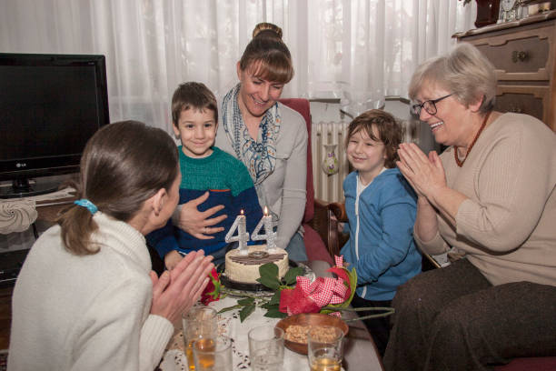

This article has been written and researched by our expert Loveable through a precise methodology. [Learn more about our methodology](https://avada.io/loveable/our-methodological.html)

[Loveable](https://avada.io/loveable/) > [Blog](https://avada.io/loveable/blog/) > [Holiday](https://avada.io/loveable/holiday/)

# 120+ Christian Birthday Wishes To Spread Your Love 

Written by [Luna Miller](https://avada.io/loveable/author/luna/) Last Updated on October 05, 2023

Researched by [David Flynn](https://avada.io/loveable/author/david-flynn/) FROM LOVEABLE LAB

- [120+ Christian Birthday Wishes From Bottom Heart](https://avada.io/loveable/blog/christian-birthday-wishes/#wp-block-heading-2-3)
    - [Inspirational Christian Birthday Wishes](https://avada.io/loveable/blog/christian-birthday-wishes/#wp-block-heading-3-4)
    - [Sincere Christian Birthday Wishes For Family](https://avada.io/loveable/blog/christian-birthday-wishes/#wp-block-heading-3-27)
    - [Christian Birthday Wishes For Friends](https://avada.io/loveable/blog/christian-birthday-wishes/#wp-block-heading-3-50)
    - [Sweet Christian Birthday Wishes For Him](https://avada.io/loveable/blog/christian-birthday-wishes/#wp-block-heading-3-73)
    - [Heartfelt Christian Birthday Wishes For Her](https://avada.io/loveable/blog/christian-birthday-wishes/#wp-block-heading-3-96)
    - [Best Christian Birthday Wishes For Son](https://avada.io/loveable/blog/christian-birthday-wishes/#wp-block-heading-3-119)
    - [Cute Christian Birthday Wishes For Daughter](https://avada.io/loveable/blog/christian-birthday-wishes/#wp-block-heading-3-142)
- [Final Thoughts](https://avada.io/loveable/blog/christian-birthday-wishes/#wp-block-heading-2-165)

God blesses the world with new life through births. We are given the gift of life to make this earth a better place to exist for ourselves and for future generations. Every person who has ever lived or will live has been put here for a reason: to help bring about world peace, hope, faith, and happiness. If you are a Christian and want to wish your loved ones a happy birthday, here are **120+ Christian Birthday Wishes** to express your love that you can use.

Looking for the right [gift for the Christian man](https://avada.io/loveable/christian-gifts-for-men/) in your life can be a meaningful and kind gesture. Whether it’s for a birthday, anniversary, or any special occasion, check out our collection of Christian gifts made to inspire and support his faith journey.

## **120+ Christian Birthday Wishes From Bottom Heart**

### **Inspirational Christian Birthday Wishes**

Inspirational Christian birthday wishes are heartfelt messages that combine the joy of celebrating a loved one’s special day with the uplifting power of faith. Let’s choose the best one for you to show your love:

1\. May God’s love and blessings shine upon you as you celebrate your birthday, lighting the path for the year ahead.

2\. I hope that today God’s love and grace flood your heart with comfort and joy. Many happy returns of the day!

3\. Happy birthday! May the joy of the Lord be your strength today and every day of the coming year.

4\. As you grow another year older, may you also grow closer to God, finding wisdom and comfort in His word.

5\. Wishing you a birthday filled with faith, hope, and love, and may your heart be filled with gratitude for all of God’s blessings.

6\. May your birthday be a reflection of the goodness of God, and may His peace that surpasses all understanding guard your heart.

7\. Celebrating you on your birthday and thanking God for the beautiful soul you are. May He continue to guide your steps.

8\. Many happy returns to you on your birthday! May you be blessed with eternal joy.

9\. On this special day, may you be surrounded by loved ones, and may God’s favor follow you throughout your life.

10\. Wishing you a birthday filled with God’s abundant love, unwavering presence, and never-ending grace.

11\. May your birthday mark the beginning of a year filled with answered prayers, fulfilled dreams, and deeper faith in God.

12\. Happy birthday! May the love of Christ, which surpasses all knowledge, fill your heart and overflow into the lives of those around you.

13\. As you celebrate another year, may you find strength in the promise that God works all things together for your good.

14\. I hope you have a wonderful birthday and many more to come! Happiness and blessings be with you always.

15\. Wishing you a birthday filled with moments of praise and thanksgiving for the incredible gift of life that God has given you.

16\. May your birthday be a reminder of God’s faithfulness and a celebration of His unique purpose for your life.

17\. Happy birthday! May you continue to walk in God’s light, sharing His love and grace with everyone you encounter.

18\. On this day, may you be surrounded by God’s love and the love of those who cherish you. May your year ahead be blessed.

19\. May your birthday be a time of renewal and recommitment to following God’s path for your life, filled with His peace and joy.

20\. Wishing you a birthday filled with God’s blessings, abundant grace, and the knowledge that you are deeply loved by Him.

### **Sincere Christian Birthday Wishes For Family**

Christian birthday greetings from the heart are thoughtful statements that combine the love of family with a firm belief in God. These greetings are an expression of Christian love, gratitude, and blessings.

1\. Happy birthday to a cherished member of our family! May your special day be a reflection of God’s abundant love and grace.

2\. Wishing you a birthday surrounded by the love and prayers of our family. May God’s light continue to shine through you in all that you do.

3\. Wishing you a birthday filled with God’s peace and the warmth of family. May this year be a journey of faith and growth.

4\. As you celebrate your birthday, may you be reminded of the incredible impact you’ve had on our family and the love that surrounds you.

5\. May your birthday bring you closer to God’s purpose for your life and deepen the bonds of love within our family.

6\. Happy birthday! May the light of God’s love shine upon you, guiding your steps and filling your heart with joy.

7\. On this special day, I pray that God’s blessings continue to overflow in your life, bringing happiness to our family and everyone you meet.

8\. Wishing you a birthday filled with moments of gratitude for the gift of family and the faith that binds us together.

9\. May your birthday be a reminder of God’s faithfulness and the strength of our family’s bond. Celebrating you with love and joy.

10\. Happy birthday! May your journey ahead be blessed by God’s grace, and may our family’s love be a constant source of support.

11\. Happy birthday to a treasured member of our family! Your faith and love are a source of inspiration, and I pray that God’s blessings continue to shower upon you.

12\. Wishing you a birthday filled with laughter, love, and the presence of family. May your heart be lifted by knowing how much you mean to us.

13\. May your birthday be a celebration of the unique role you play in our family and a reminder of God’s perfect plan for your life.

14\. Happy birthday! May the love and unity of our family continue to shine brightly, reflecting God’s love for each of us.

15\. On this special day, may you experience the warmth of family and the blessings of God’s unwavering love.

16\. Wishing you a birthday surrounded by family who cherish you and a God who delights in your happiness.

17\. May your birthday be a time of reflection, gratitude, and renewed faith in the journey God has set before you and our family.

18\. Happy birthday! May your year ahead be filled with God’s blessings and the joy of being part of our loving family.

19\. On this day, I celebrate the blessing of having you in our family. May your birthday be a testament to God’s goodness and grace.

20\. Wishing you a birthday filled with moments of connection, laughter and the knowledge that you are loved deeply by both your family and God.

### **Christian Birthday Wishes For Friends**

A tapestry of blessings spreads out, honoring the journey of lives that are alike. Like whispers of grace, they shine a divine light on bonds, echoing the timeless melody of love.

1\. Happy birthday, dear friend! May God’s love and blessings be with you today and always, guiding your path and filling your life with joy.

2\. God has blessed us much with you. You are a bright spot in my day and in the lives of those around you. To a wonderful friend: Happy Birthday!

3\. Wishing you a birthday filled with God’s grace, His unwavering presence, and the joy that comes from being surrounded by loved ones.

4\. You’ve been a great buddy; I’m grateful for that. All the blessings of the Lord be with you.

5\. Happy birthday! May God’s peace that surpasses all understanding guard your heart and mind as you embark on another year of life.

6\. Thank you for being there for me all the time. On your birthday, we wish you all of God’s love.

7\. Wishing you a birthday filled with laughter, love, and the warmth of God’s presence. Your friendship is a treasure, and I’m thankful for you.

8\. May your birthday be a reflection of the beautiful soul you are. Your faith and kindness inspire those around you. Have a blessed day!

9\. Happy birthday, dear friend! May God’s plans for your life unfold in wonderful ways, and may His joy be your strength in every season.

10\. On this special day, I pray that God’s light continues to shine through you, lighting the way for others and bringing hope to their lives.

11\. Wishing you a birthday filled with moments of praise and thanksgiving for the amazing person you’ve become through your faith in Christ.

12\. May your birthday be a time of reflection on God’s goodness and a celebration of the journey you’re on with Him. Your friendship is a blessing.

13\. Happy birthday! May the love of Christ overflow in your life, touching everyone you meet. Your friendship is a testament to His love.

14\. On this day, may you feel the love and prayers of those around you as you celebrate the unique person you are in Christ. Have a joyful birthday!

15\. Wishing you a birthday filled with God’s peace and a heart full of gratitude for the wonderful friendships that surround you.

16\. May your birthday be a reminder of the boundless love God has for you. Your friendship has enriched my life, and I’m thankful for you.

17\. Happy birthday, dear friend! May God’s guidance and wisdom be with you in the coming year, and may your faith continue to shine brightly.

18\. I wish my lovely friend a happy birthday. On your special day, I will pray for you, bless you, and give you hugs.

19\. Wish you a birthday filled with laughter, cherished memories, and the knowledge that you are deeply loved by God and your friends.

20\. May your birthday be a celebration of the incredible journey you’re on with Christ. Your faith and friendship inspire me daily.

### **Sweet Christian Birthday Wishes For Him**

Make his heart melt with Sweet Christian Birthday Wishes. These messages embrace the cherished man in a warm embrace of blessings, capturing the essence of his journey in Christ and the love that binds hearts.

1\. Happy birthday! May God’s love and grace shine upon you today and every day. May your heart be filled with joy and your year be blessed.

2\. Happy birthday, my sweetheart. I thank our Lord and Savior every single day for making you.

3\. May your birthday be a celebration of the wonderful person you are in Christ. May God’s blessings surround you, and may your dreams come true.

4\. Wishing you a birthday filled with God’s peace, His unwavering love, and the joy that comes from knowing you’re cherished by Him.

5\. Happy birthday! May your journey ahead be guided by God’s wisdom and grace. May His plans for you be beyond your wildest dreams.

6\. There are many wonderful things in life, but nothing is better than God’s kindness. God bless you, my dear! Have a great day!

7\. Wishing you a birthday filled with love, laughter and the warmth of God’s presence. Your faith shines brightly, and I’m grateful for you.

8\. May your birthday be a reflection of the faith and hope you have in Christ. May you experience His peace in every aspect of your life.

9\. Happy birthday, dear friend! May God’s joy be your strength, and may your year be marked by growth and deeper intimacy with Him.

10\. On this special day, I pray that God’s blessings overflow in your life. May your faith continue to inspire and uplift those around you.

11\. Wishing you a birthday filled with moments of gratitude for the love of Christ and the incredible journey you’re on with Him.

12\. May your birthday be a celebration of the wonderful person God has made you to be. Your faith and character are truly admirable.

13\. Happy birthday! May your heart be filled with God’s peace that surpasses all understanding and His joy that knows no bounds.

14\. On this day, I celebrate your uniqueness and the way your faith shines through. May God’s love continue to transform your life.

15\. Wishing you a birthday filled with the warmth of God’s love and the assurance that you are deeply cherished by Him.

16\. May your birthday be a time of reflection on God’s goodness and a celebration of His plans for your life. Have a blessed day!

17\. Happy birthday! May your year be filled with answered prayers, blessings, and moments of closeness with our Savior.

18\. I hope your prayers are heard by the Lord Jesus Christ. On your birthday, I want to wish you well.

19\. Wishing you a birthday filled with the knowledge of God’s love for you and the hope of a future filled with His abundant blessings.

20\. May your birthday be a reminder of the incredible ways God has worked in your life. Your faith and perseverance inspire us all.

### **Heartfelt Christian Birthday Wishes For Her**

Beyond the Love, Christian birthday wishes for her are sincere messages that intertwine love’s melody with the depth of faith. These wishes encapsulate the beauty of her journey, celebrating the woman she is in Christ while showering blessings upon her path.

1\. Your soul is dear to me, and God has given me a gift in you. On your birthday, I wish you all the best. Love, happy birthday!

2\. My dear, your kindness reveals your good intentions and pristine heart. I hope that God gives you only happy times in your life. Have a great day!

3\. God, please bless our love and let it last forever and grow. I’m glad it’s your birthday, my love!

4\. May your birthday be a reflection of the beautiful soul you are in Christ. Your faith and kindness inspire everyone around you.

5\. Happy birthday! May God’s peace that surpasses all understanding guard your heart and mind as you enter a new year of life.

6\. On this day, I celebrate the blessing of your life and the faith that guides you. May your year ahead be filled with God’s favor.

7\. Wishing you a birthday filled with laughter, love, and the warmth of God’s presence. Your faith shines brightly, and I’m grateful for you.

8\. May your birthday be a reminder of the incredible person you are. May God’s blessings surround you, and may your dreams come true.

9\. Happy birthday, dear friend! May God’s joy be your strength, and may your year be marked by growth and deeper intimacy with Him.

10\. On this special day, I pray that God’s love continues to shape your life. May your faith inspire others and lead you to greater heights.

11\. Wishing you a birthday filled with moments of gratitude for the love of Christ and the beautiful journey you’re on with Him.

12\. May your birthday be a celebration of the wonderful person God has created you to be. Your faith and character are truly admirable.

13\. Happy birthday! May your heart be filled with God’s peace that surpasses all understanding and His joy that knows no bounds.

14\. On this day, I celebrate the unique individual you are and the way your faith shines through. May God’s love continue to transform you.

15\. Wishing you a birthday filled with the warmth of God’s love and the assurance that you are deeply cherished by Him.

16\. May your birthday be a time of reflection on God’s goodness and a celebration of His plans for your life. Have a blessed day!

17\. Happy birthday! May your year be filled with answered prayers, blessings, and moments of closeness with our Savior.

18\. Honey, Happy birthday! May God always be kind to you and bless you in many ways.

19\. Wishing you a birthday filled with the knowledge of God’s love for you and the hope of a future filled with His abundant blessings.

20\. May your birthday be a reminder of the incredible ways God has worked in your life. Your faith and perseverance inspire us all.

### **Best Christian Birthday Wishes For Son**

If you want to cast some spiritual light on the special relationship you share with your son on his birthday, consider sending him one of the best Christian birthday wishes.

1\. Happy birthday, dear son! May God’s love and guidance be with you today and always, lighting your path and filling your life with blessings.

2\. On this special day, I thank God for the gift of your life. May your birthday be a celebration of His goodness and grace in your journey.

3\. Wishing you a birthday filled with God’s peace, His unwavering love, and the joy that comes from knowing you’re cherished by Him and your family.

4\. May your birthday be a reflection of the wonderful person you are in Christ. Your faith and character inspire everyone around you.

5\. To my dearest son. I wish you happiness and God’s gifts. Have a good birthday!

6\. On this day (xx) years ago, God gave you to our family as a blessing. We can’t picture life without you. Happy Birthday, boy!

7\. Wishing you a birthday filled with laughter, love, and the warmth of God’s presence. Your faith is a light that shines brightly.

8\. May your birthday be a reminder of the incredible journey you’re on with Christ. May God’s blessings surround you, and may your dreams flourish.

9\. Happy birthday, dear son! May God’s joy be your strength, and may your year be marked by growth and deeper intimacy with Him.

10\. For our son. We are all praying for and blessing you today. We are so proud of you, the man you have become, and the beautiful family you are building. Have a good day!

11\. Wishing you a birthday filled with moments of gratitude for the love of Christ and the amazing person you’re becoming through Him.

12\. May your birthday be a celebration of the wonderful person God has created you to be. Your faith and character make us incredibly proud.

13\. Happy birthday! May your heart be filled with God’s peace that surpasses all understanding and His joy that knows no bounds.

14\. On this day, I celebrate the unique individual you are and the way your faith shines through. May God’s love continue to shape your life.

15\. Wishing you a birthday filled with the warmth of God’s love and the assurance that you are deeply cherished by Him and your family.

16\. May your birthday be a time of reflection on God’s goodness and a celebration of His plans for your life. Have a blessed day!

17\. Happy birthday! May your year be filled with answered prayers, blessings, and moments of closeness with our Savior.

18\. On this special day, I pray that God’s grace and mercy continue to guide your steps and illuminate your path. You’re a treasure to us.

19\. Wishing you a birthday filled with the knowledge of God’s love for you and the hope of a future filled with His abundant blessings.

20\. May your birthday be a reminder of the incredible ways God has worked in your life. Your faith and perseverance inspire us all.

### **Cute Christian Birthday Wishes For Daughter**

Cute Christian Birthday Wishes for Daughter are tender sentiments that intertwine parental love with the beauty of faith. These wishes embrace the cherished girl with blessings, celebrating her journey in Christ.

1\. Happy birthday, sweet daughter! May God’s love and grace be with you today and always, guiding your steps and filling your life with joy.

2\. On your birthday, I wish God to make your life full of happiness and peace. Always pray to God for help, because he is always ready to help. Have a happy birthday!

3\. Wishing you a birthday filled with God’s peace, His unwavering love, and the happiness that comes from knowing you’re cherished by Him and your family.

4\. I pray that God gives you better health and happier days. May God give you happiness and success in your life. Have a nice day, little one. I love you.

5\. Happy birthday! May God’s peace that surpasses all understanding guard your heart and mind as you journey through another year of life.

6\. I hope you enjoy all the good things coming your way and are thankful for everything. Have a happy life, honey. Happy birthday, darling! I love you so much.

7\. Wishing you a birthday filled with laughter, love, and the warmth of God’s presence. Your faith shines brightly, and I’m grateful for you.

8\. May your birthday be a reminder of the incredible journey you’re on with Christ. May God’s blessings surround you, and may your dreams come true.

9\. Happy birthday, dear daughter! May God’s joy be your strength, and may your year be marked by growth and deeper intimacy with Him.

10\. On this special day, I pray that God’s love continues to mold your heart. May your faith inspire others and guide you toward His purpose.

11\. Wishing you a birthday filled with moments of gratitude for the love of Christ and the amazing person you’re becoming through Him.

12\. May your birthday be a celebration of the wonderful person God has created you to be. Your faith and character make us incredibly proud.

13\. Happy birthday! May your heart be filled with God’s peace that surpasses all understanding and His joy that knows no bounds.

14\. On this day, I celebrate the unique individual you are and the way your faith shines through. May God’s love continue to shape your life.

15\. Wishing you a birthday filled with the warmth of God’s love and the assurance that you are deeply cherished by Him and your family.

16\. May your birthday be a time of reflection on God’s goodness and a celebration of His plans for your life. Have a blessed day!

17\. Happy birthday! May your year be filled with answered prayers, blessings, and moments of closeness with our Savior.

18\. To our lovely daughter. Our love and thoughts are with you today. May you know God loves you and gives you the best things.

19\. Happy birthday, sweetheart! I beg God to fill you with love, desire, and happiness. May God bless you and show you kindness in your life.

20\. May your birthday remind you of the incredible ways God has worked in your life. Your faith and perseverance inspire us all.

## **Final Thoughts**

**Christian birthday wishes** are a beautiful way to celebrate and honor the life of a loved one while showing our faith and thanks for God’s gifts. when we give these wishes to family, friends, or other people we know, they give us a chance to lift their spirits and remind them of God’s love and guidance. So, let’s celebrate the gift of life and continue to show God’s love, kindness, and grace to everyone around us as we send our blessing of 120+ Christian Birthday Wishes. May God bless and watch over us all through the days ahead. 

- [120+ Christian Birthday Wishes From Bottom Heart](https://avada.io/loveable/blog/christian-birthday-wishes/#wp-block-heading-2-3)
    - [Inspirational Christian Birthday Wishes](https://avada.io/loveable/blog/christian-birthday-wishes/#wp-block-heading-3-4)
    - [Sincere Christian Birthday Wishes For Family](https://avada.io/loveable/blog/christian-birthday-wishes/#wp-block-heading-3-27)
    - [Christian Birthday Wishes For Friends](https://avada.io/loveable/blog/christian-birthday-wishes/#wp-block-heading-3-50)
    - [Sweet Christian Birthday Wishes For Him](https://avada.io/loveable/blog/christian-birthday-wishes/#wp-block-heading-3-73)
    - [Heartfelt Christian Birthday Wishes For Her](https://avada.io/loveable/blog/christian-birthday-wishes/#wp-block-heading-3-96)
    - [Best Christian Birthday Wishes For Son](https://avada.io/loveable/blog/christian-birthday-wishes/#wp-block-heading-3-119)
    - [Cute Christian Birthday Wishes For Daughter](https://avada.io/loveable/blog/christian-birthday-wishes/#wp-block-heading-3-142)
- [Final Thoughts](https://avada.io/loveable/blog/christian-birthday-wishes/#wp-block-heading-2-165)

### [Luna Miller](https://avada.io/loveable/author/luna/)

I'm Luna Miller, a helpful employee at Loveable. I excel at giving great advice on birthday gifts. I love suggesting memorable experiences like concerts, spas, and getaways. As a reliable and supportive colleague, I'm always there to assist.

- [Twitter](https://twitter.com/intent/tweet)
- [Facebook](https://www.facebook.com/sharer/sharer.php)
- [instagram](https://avada.io/loveable/blog/christian-birthday-wishes/)
- [pinterest](https://www.pinterest.com/loveablellc/)

## Related Posts

[### 120+ Christian Birthday Wishes To Spread Your Love](https://avada.io/loveable/blog/christian-birthday-wishes/) 

[

### 35 Best 70th Birthday Ideas To Celebrate The Special Milestone

](https://avada.io/loveable/blog/70th-birthday-ideas/)

[

### 50 Best 30th Birthday Decorations for a Remarkable Birthday Bash

](https://avada.io/loveable/blog/30th-birthday-decorations/)

[

### 40 Delicious Vegan Christmas Desserts to Delight Your Palate

](https://avada.io/loveable/blog/vegan-christmas-desserts/)

[

### 60 Christmas Team Building Activities to Boost Workplace Spirit

](https://avada.io/loveable/blog/christmas-team-building-activities/)
