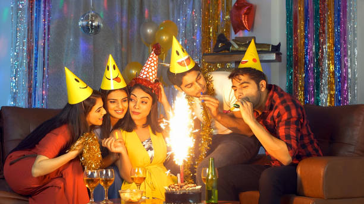

This article has been written and researched by our expert Loveable through a precise methodology. [Learn more about our methodology](https://avada.io/loveable/our-methodological.html)

[Loveable](https://avada.io/loveable/) > [Blog](https://avada.io/loveable/blog/) > [Relationship](https://avada.io/loveable/relationship/)

# 120+ Heartfelt Thank You Messages for The Birthday Wishes

Written by [Luna Miller](https://avada.io/loveable/author/luna/) Last Updated on September 19, 2023

- [120+ Best Thank You Messages to Write Birthday Wishes](https://avada.io/loveable/blog/thank-you-messages-birthday-wishes/#wp-block-heading-2-3)
    - [Touching Thank You Messages for Birthday Wishes](https://avada.io/loveable/blog/thank-you-messages-birthday-wishes/#wp-block-heading-3-4)
    - [Short Thank You Messages for Birthday Wishes](https://avada.io/loveable/blog/thank-you-messages-birthday-wishes/#wp-block-heading-3-27)
    - [Funny Thank You Messages for Birthday Wishes](https://avada.io/loveable/blog/thank-you-messages-birthday-wishes/#wp-block-heading-3-50)
    - [Thank You for Birthday Wishes to Best Friends](https://avada.io/loveable/blog/thank-you-messages-birthday-wishes/#wp-block-heading-3-73)
    - [Thank You for Birthday Wishes to Family](https://avada.io/loveable/blog/thank-you-messages-birthday-wishes/#wp-block-heading-3-96)
    - [Thank You Message for Birthday Wishes to Colleague](https://avada.io/loveable/blog/thank-you-messages-birthday-wishes/#wp-block-heading-3-119)
    - [Thank You for Birthday Wishes on Facebook](https://avada.io/loveable/blog/thank-you-messages-birthday-wishes/#wp-block-heading-3-142)
- [Final words,](https://avada.io/loveable/blog/thank-you-messages-birthday-wishes/#wp-block-heading-2-168)

The best part of celebrating a birthday is opening a card or letter with well-wishes and greetings from friends and family. Intriguing and novel birthday wishes are always being made.

We are responsible for expressing gratitude to those who took the time to send us birthday wishes after the celebration. It might be challenging to find the perfect response to someone’s birthday greetings, so we’ve compiled a list of **120+ heartfelt thank-you messages for your birthday wishes**. Now, let’s find your best words with us to show your sincerity!

## **120+ Best Thank You Messages to Write Birthday Wishes**

### **Touching Thank You Messages for Birthday Wishes**

Getting birthday messages from friends and family makes celebrating another year of life even more heartwarming. Finding the right words to say thank you can be hard, so we’ve put together a list of heartfelt thank-you messages for birthday gifts.

1\. Dear friends and family, your birthday wishes filled my heart with warmth and joy. Thank you for making my day truly special.

2\. I’m overwhelmed by the love and kindness shown through your birthday wishes. Each message means the world to me.

3\. Your birthday wishes were like sunshine on my special day. Thank you for making me feel cherished and loved.

4\. To everyone who took the time to wish me a happy birthday, thank you for making me feel so loved and appreciated.

5\. Your heartfelt birthday wishes put a smile on my face that will last a lifetime. Thank you for brightening my day.

6\. I’m grateful for the flood of birthday wishes that poured in. Your thoughtfulness truly touched my heart.

7\. Thank you for your wonderful birthday wishes. Your words have made my celebration even more meaningful.

8\. Your birthday wishes were the icing on the cake of a perfect day. Thank you for making me feel so special.

9\. Each birthday wish I received was like a precious gift. Thank you for taking the time to make me feel loved.

10\. Your kind words and warm wishes made my birthday unforgettable. Thank you for being a part of my celebration.

11\. Thank you for the heartfelt birthday wishes. Your thoughtfulness made my day even more incredible.

12\. I’m touched by the outpouring of love and affection in your birthday messages. Thank you for being a part of my life.

13\. Your birthday wishes made me feel like the luckiest person in the world. Thank you for your love and friendship.

14\. I can’t express how much your birthday wishes mean to me. Thank you for making my day truly special.

15\. Your birthday wishes warmed my heart and brought a smile to my face. Thank you for your beautiful words.

16\. Your birthday messages touched my heart in the most wonderful way. Thank you for making my day memorable.

17\. I’m beyond grateful for the sweet birthday wishes that came my way. Thank you for making me feel cherished.

18\. Thank you for the heartfelt birthday wishes. Your love and support mean the world to me.

19\. Your birthday wishes made me feel so loved and appreciated. Thank you for being a part of my life’s journey.

20\. My heart is overflowing with gratitude for the amazing birthday wishes. Thank you for making my day extra special.

### **Short Thank You Messages for Birthday Wishes**

Short thank-you messages for birthday wishes are the perfect way to show thanks without overwhelming the people you care about. With sincerity and brevity, these messages let you recognize the warmth and thoughtfulness of your actions. Here, we’ve compiled a list of such short, heartfelt words to help you say “thank you” with grace and style.

1\. Thank you all for the lovely birthday wishes! Your messages made my day shine.

2\. Your wishes filled my heart with joy. Thanks a bunch for making my day special!

3\. Feeling blessed and grateful for your heartfelt birthday wishes. Thanks a million!

4\. Your kind words made my birthday even better. Thanks for the warm wishes!

5\. Your wishes made me feel so loved. Thank you for the birthday cheer!

6\. Thank you for the birthday love! I’m lucky to have such wonderful friends.

7\. My heart is full of gratitude for your birthday wishes. You made my day!

8\. Thanks for the birthday wishes, everyone! Your thoughtfulness means a lot.

9\. Your wishes put a smile on my face. Thank you for the birthday happiness!

10\. Thanks for making my day with your sweet birthday wishes. You’re awesome!

11\. Your messages warmed my heart. Thanks for the birthday love and wishes.

12\. Grateful for your kind birthday wishes. You made my day shine!

13\. Thanks for the birthday wishes, friends! Your words touched my heart.

14\. Your wishes made my birthday extra special. Thanks for the love!

15\. Feeling grateful for the wonderful birthday wishes. You rock!

16\. Thank you for the birthday cheer and warm wishes. You’re the best!

17\. Your wishes made my day brighter. Thank you for the birthday joy!

18\. Thanks for the lovely birthday wishes, everyone. You made my day!

19\. Your messages made me feel loved. Thanks for the awesome birthday wishes!

20\. My heart is full of gratitude for your birthday wishes. Thank you all!

### **Funny Thank You Messages for Birthday Wishes**

Adding a little humor to your thank-you messages for birthday wishes can make the party even more fun. Funny thank-you cards let you show your appreciation in a fun and lighthearted way, showing that you appreciate the wishes and share a playful spirit with the people who sent them.

1\. Thanks for the birthday wishes, everyone! Now that I’m a year older, does that mean I should start acting like a responsible adult? Nah, I’ll pass!

2\. A big shoutout to everyone who made my birthday special with their wishes. You all deserve a slice of my cake… virtually, of course!

3\. Thank you for the birthday wishes! I’m embracing my age like a fine wine – getting better with time, and a bit tipsy!

4\. Your birthday wishes truly touched my heart. And my stomach, because I celebrated with way too much cake. Thanks for contributing to my sugar rush!

5\. Thanks for the birthday wishes, folks! As I get older, I’m realizing that “adulting” is just a fancy term for making it up as you go along.

6\. Your birthday wishes made me feel special. In fact, I felt so special that I treated myself to an extra slice of cake. No regrets!

7\. Thanks for the birthday love, everyone! Age is just a number – and I’m choosing to ignore it while eating another slice of cake.

8\. Your wishes made my day brighter than a birthday candle! Who knew growing older could be so illuminating? Thanks for the reminder!

9\. Thank you for the hilarious birthday wishes! Now that I’m older, I’ve decided to start a new trend: anti-aging through laughter.

10\. Thanks for the birthday wishes, friends! I’m officially one year wiser – or at least that’s what I’ll keep telling myself as I reach for the cake.

11\. Your birthday wishes were the cherry on top of my day. And yes, there were also real cherries on top of my birthday cake. Thanks for the laughs and the sugar rush!

12\. Thanks for the birthday wishes, everyone! At this age, I’m like a fine cheese – getting stinkier but still enjoying life!

13\. Your wishes were like a virtual confetti shower, and I loved every bit of it! Now, if only I could figure out how to clean up this digital mess…

14\. Thank you for the birthday wishes, pals! As I blow out the candles, I’m secretly wishing for a lifetime supply of chocolate and naps.

15\. Your birthday wishes made me smile like a kid in a candy store. Speaking of which, I’ll be celebrating with a bucket of ice cream. Thanks for the inspiration!

16\. Thanks for the birthday wishes, folks! With each passing year, I’m getting closer to unlocking the secrets of the universe – or at least the TV remote.

17\. Your wishes added a sprinkle of happiness to my day. If only sprinkles could also magically make me younger… a girl can dream, right?

18\. Thank you for the birthday wishes! Now that I’m older, I’m considering joining the senior yoga class – if only to laugh at myself trying to touch my toes.

19\. Your birthday wishes were like a virtual party in my inbox. I guess I’ll have to settle for real cake and dancing in my living room. Thanks for the fun!

20\. Thanks for the birthday wishes, everyone! Age is just a number, but cake? Cake is a delicious reality that I’m fully embracing.

### **Thank You for Birthday Wishes to Best Friends**

When your best friends send you birthday wishes, it’s more than just nice to say thanks. It’s a heartfelt way to show how close you are. Our collection of thank-you messages for birthday wishes to best friends gets the essence of this special bond, so you can say “thank you” warmly and sincerely and remind them of how much you both value your friendship.

1\. To my amazing best friends, thank you for flooding my day with your birthday wishes. Your love and friendship mean the world to me!

2\. A big shoutout to my ride-or-die squad! Your heartfelt birthday wishes made my day extra special. Cheers to many more adventures together!

3\. Hey besties, your birthday wishes warmed my heart like a cozy hug. Thank you for being the incredible friends that you are!

4\. To my forever friends, thank you for the sweet birthday wishes! You’ve made my day shine brighter than a disco ball.

5\. Your birthday wishes turned my day into a celebration of friendship. Thank you for being the best part of my life!

6\. Thanks a million, my fabulous besties! Your birthday wishes are like glitter – they make everything sparkle.

7\. To my partner-in-crime besties, your birthday wishes made me feel like the luckiest friend ever. Here’s to more mischief and laughter together!

8\. Hey besties, your birthday wishes were like a symphony of love and joy. Thank you for adding the melody to my special day.

9\. Thank you, dear friends, for the heartfelt birthday wishes! With you by my side, every day feels like a celebration.

10\. Your birthday wishes filled my heart with gratitude and happiness. Here’s to the best friends a person could ask for!

11\. To my beloved besties, your birthday wishes are the icing on my cake of friendship. Thank you for making life sweeter.

12\. Hey pals, your birthday wishes made me feel like the richest person in the world – rich in friendship, that is. Thanks for everything!

13\. Thanks for the birthday wishes, besties! Your friendship is the gift that keeps on giving, and I’m forever grateful.

14\. Your birthday wishes were like a virtual hug from each of you. Thank you for wrapping me in your love and warmth.

15\. To my incredible best friends, your birthday wishes made me smile from ear to ear. I’m lucky to have you by my side.

16\. Thank you for the birthday wishes, my rockstar besties! Your friendship is my greatest treasure, and I’m so lucky to have you.

17\. Your birthday wishes were like a heartwarming playlist of love and friendship. Thank you for being the soundtrack of my life.

18\. Hey besties, your birthday wishes were the cherry on top of an already amazing day. Here’s to more laughter, more memories, and more fun!

19\. Thanks for the birthday wishes, my forever friends! You’re the reason my heart is brimming with happiness today.

20\. To my besties who light up my life, thank you for the incredible birthday wishes. I’m beyond grateful to have you as my chosen family.

### **Thank You for Birthday Wishes to Family**

Family is the most important thing in our lives, and when they send us many birthday wishes, we feel so grateful. When you thank your family for their thoughtful birthday wishes, you give them back the love and care they’ve always given you.

1\. To my beloved family, thank you for the heartwarming birthday wishes. Your love and support make my world shine brighter.

2\. A heartfelt thank you to my family for the amazing birthday wishes. Your words warmed my heart and made my day truly special.

3\. Hey family, your birthday wishes were like a warm hug from each of you. Thank you for making me feel so loved and cherished.

4\. Thanks a bunch, dear family, for the sweet birthday wishes. Your presence in my life is the greatest gift of all.

5\. To my wonderful family, your birthday wishes turned my day into a celebration of love. I’m grateful to have you by my side.

6\. Your birthday wishes brought a smile to my face and joy to my heart. Thank you, dear family, for making my day unforgettable.

7\. Thank you, my dear family, for the thoughtful birthday wishes. Your love and blessings mean more to me than words can express.

8\. Your birthday wishes were like rays of sunshine on a cloudy day. Thank you, family, for brightening up my celebration.

9\. To my incredible family, your birthday wishes made me feel like the luckiest person in the world. Your love knows no bounds, and I’m grateful for it every day.

10\. Thanks for the heartfelt birthday wishes, family. Your unwavering support and love are the foundation of my happiness.

11\. Your birthday wishes filled my heart with gratitude and warmth. Thank you, family, for being my anchor and my source of joy.

12\. Hey family, your birthday wishes were the best gift I could receive. Your presence in my life is a blessing beyond measure.

13\. Thanks for the wonderful birthday wishes, dear family. Your love is the fuel that keeps me going and the reason I smile.

14\. Your birthday wishes were a reminder of the incredible family I have. Thank you for making my day extraordinary.

15\. To my amazing family, your birthday wishes touched my heart in the most beautiful way. I’m lucky to be surrounded by your love.

16\. Thank you for the birthday wishes, family. Your love and support have shaped me into the person I am today.

17\. Your birthday wishes were like a melody of love and affection. Thank you, dear family, for making my day so special.

18\. Hey family, your birthday wishes made my heart swell with happiness. Your love is my greatest treasure.

19\. Thanks for the birthday wishes, my wonderful family. Your presence in my life is the true gift that keeps on giving.

20\. To my dear family, thank you for the beautiful birthday wishes. Your love is the reason my heart is full and my day is bright.

### **Thank You Message for Birthday Wishes to Colleague**

In a professional setting, the camaraderie shared with colleagues is invaluable. This list of 20 thank-you messages for birthday wishes to coworkers is a classy and polite way to show your appreciation.

1\. A big thank you to my fantastic colleagues for the wonderful birthday wishes! Your messages added an extra dose of joy to my special day.

2\. To my amazing work buddies, thank you for the thoughtful birthday wishes. Your kind words made my day shine even brighter.

3\. Hey colleagues, your birthday wishes made me feel appreciated and valued. Thanks for being a wonderful part of my professional journey!

4\. Thanks a bunch for the birthday wishes, team! Your messages brought a smile to my face and warmth to my heart.

5\. Your birthday wishes made my day at the office feel like a celebration. Thank you, colleagues, for the good vibes and positivity.

6\. To my supportive colleagues, thank you for the awesome birthday wishes. Your friendship and camaraderie mean the world to me.

7\. Hey team, your birthday wishes were the boost I needed to power through the workday. Thank you for making my birthday extra special.

8\. Thanks for the birthday wishes, colleagues! Your messages showed that we’re not just colleagues; we’re a supportive and caring work family.

9\. Your birthday wishes turned my regular work routine into something extraordinary. Thank you, colleagues, for your kind gestures.

10\. To my fabulous colleagues, your birthday wishes were a delightful surprise. Thanks for making my day memorable!

11\. Your birthday wishes made the office feel like a more cheerful place. Thank you for spreading the birthday joy, colleagues!

12\. Hey work pals, your birthday wishes made me feel like part of a close-knit team. Thanks for making my day awesome!

13\. Thanks for the birthday wishes, colleagues! Your thoughtfulness added a positive twist to my workday.

14\. Your birthday wishes were the highlight of my day at the office. Thank you, colleagues, for making me feel valued and appreciated.

15\. To my wonderful colleagues, thank you for the birthday wishes that turned my workday into a celebration. Your messages made me feel special.

16\. Thanks a million, team, for the birthday wishes that brightened up my work environment. Your kindness is deeply appreciated.

17\. Hey colleagues, your birthday wishes made me feel like part of an amazing work community. Thank you for your warmth and friendship.

18\. Your birthday wishes were like a breath of fresh air amidst my work tasks. Thank you, colleagues, for making my day lighter.

19\. Thanks for the birthday wishes, team! Your messages reminded me how lucky I am to work with such wonderful people.

20\. To my supportive colleagues, thank you for the birthday wishes that made me feel valued and cherished. Your gestures touched my heart.

### **Thank You for Birthday Wishes on Facebook**

Colleagues are finding it easier to send birthday wishes now that they know how to use social media, especially Facebook. Responding to these requests is a new way to show thanks in the workplace. These thank-you messages on Facebook to colleagues are an easy way to show your appreciation and acknowledge their online actions while keeping a business tone.

1\. Thank you all for the overwhelming birthday wishes on Facebook! Your kind words and messages truly made my day extra special.

2\. To my Facebook friends, your birthday wishes filled my heart with joy and gratitude. Thank you for being a part of my celebration.

3\. Hey everyone, your birthday wishes on Facebook put a smile on my face that lasted all day long. Thanks for the virtual party!

4\. Thanks a bunch for the fantastic birthday wishes on Facebook! Your thoughtful messages made me feel loved and appreciated.

5\. Your birthday wishes flooded my Facebook feed with happiness. Thank you, dear friends, for making me feel so blessed.

6\. To all my Facebook buddies, your birthday wishes were like a virtual hug. I’m grateful for your friendship and good wishes.

7\. Thanks for the birthday wishes, everyone! Your virtual presence and kind words made my day unforgettable.

8\. Your birthday wishes on Facebook were the best gift I could ask for. Thanks for making my special day even more memorable.

9\. To my amazing Facebook friends, thank you for the heartfelt birthday wishes. Your messages warmed my heart and made me feel cherished.

10\. Hey all, your birthday wishes turned my Facebook wall into a canvas of love and good vibes. Thanks for painting my day with positivity!

11\. Thank you for the birthday wishes, friends! Your messages brightened up my Facebook feed and my heart.

12\. Your birthday wishes on Facebook were like a digital party that made me feel surrounded by love. Thanks for the online celebration!

13\. To everyone who took a moment to send me birthday wishes on Facebook, thank you for adding joy to my special day.

14\. Thanks a million, Facebook fam, for the wonderful birthday wishes! Your virtual cheers made my day incredibly memorable.

15\. Your birthday wishes on Facebook made me feel like a social media superstar. Thank you for the virtual love and warm wishes.

16\. Hey friends, your birthday wishes on Facebook were the highlight of my day. Thank you for the positivity and good vibes!

17\. Thanks for the amazing birthday wishes on Facebook! Your messages turned my virtual world into a real-life celebration.

18\. Your birthday wishes on Facebook were the icing on the cake of my special day. Thank you for making my birthday even sweeter!

19\. To all my Facebook friends, thank you for the heartfelt birthday wishes that made me feel so loved and appreciated.

20\. Your birthday wishes on Facebook were like a virtual bouquet of happiness. Thanks for making my day bloom with joy and love.

**_See More:_**

- Best [Birthday Wishes for Brother](https://avada.io/loveable/blog/birthday-wishes-brother/)

- Best [Birthday Wishes For Husband](https://avada.io/loveable/blog/birthday-wishes-for-husband/)

## **Final words**,

In conclusion, this article has **120+ Heartfelt Thank You Messages for Birthday Wishes** that can help you say “thank you” in a heartfelt and meaningful way. There is something for everyone, from simple, sincere words to funny, witty one-liners. 

We hope this article has given you some ideas to thank your coworkers for wishing you a happy birthday. Don’t forget that a simple “thank you” can go a long way toward building better relationships with your coworkers and making the workplace a better place.

- [120+ Best Thank You Messages to Write Birthday Wishes](https://avada.io/loveable/blog/thank-you-messages-birthday-wishes/#wp-block-heading-2-3)
    - [Touching Thank You Messages for Birthday Wishes](https://avada.io/loveable/blog/thank-you-messages-birthday-wishes/#wp-block-heading-3-4)
    - [Short Thank You Messages for Birthday Wishes](https://avada.io/loveable/blog/thank-you-messages-birthday-wishes/#wp-block-heading-3-27)
    - [Funny Thank You Messages for Birthday Wishes](https://avada.io/loveable/blog/thank-you-messages-birthday-wishes/#wp-block-heading-3-50)
    - [Thank You for Birthday Wishes to Best Friends](https://avada.io/loveable/blog/thank-you-messages-birthday-wishes/#wp-block-heading-3-73)
    - [Thank You for Birthday Wishes to Family](https://avada.io/loveable/blog/thank-you-messages-birthday-wishes/#wp-block-heading-3-96)
    - [Thank You Message for Birthday Wishes to Colleague](https://avada.io/loveable/blog/thank-you-messages-birthday-wishes/#wp-block-heading-3-119)
    - [Thank You for Birthday Wishes on Facebook](https://avada.io/loveable/blog/thank-you-messages-birthday-wishes/#wp-block-heading-3-142)
- [Final words,](https://avada.io/loveable/blog/thank-you-messages-birthday-wishes/#wp-block-heading-2-168)

### [Luna Miller](https://avada.io/loveable/author/luna/)

I'm Luna Miller, a helpful employee at Loveable. I excel at giving great advice on birthday gifts. I love suggesting memorable experiences like concerts, spas, and getaways. As a reliable and supportive colleague, I'm always there to assist.

- [Twitter](https://twitter.com/intent/tweet)
- [Facebook](https://www.facebook.com/sharer/sharer.php)
- [instagram](https://avada.io/loveable/blog/thank-you-messages-birthday-wishes/)
- [pinterest](https://www.pinterest.com/loveablellc/)

## Related Posts

[

### 35 Unforgettable Exciting Adult Birthday Party Ideas

](https://avada.io/loveable/blog/adult-birthday-party-ideas/)

[

### 42 Best 21st Birthday Outfits to Rock the Party

](https://avada.io/loveable/blog/21st-birthday-outfits/)

[

### 50+ Happy 40th Anniversary Quotes, Messages, and Wishes

](https://avada.io/loveable/blog/happy-40th-anniversary-quotes/)

[

### 100+ Heartwarming Happy 30th Anniversary Quotes, Messages, and Wishes

](https://avada.io/loveable/blog/happy-30th-anniversary-quotes/)

[

### 120+ Heartfelt Thank You Messages for The Birthday Wishes

](https://avada.io/loveable/blog/thank-you-messages-birthday-wishes/)
