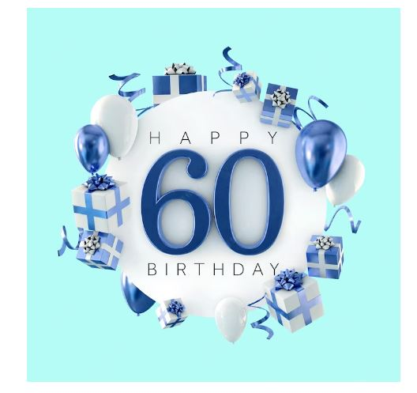
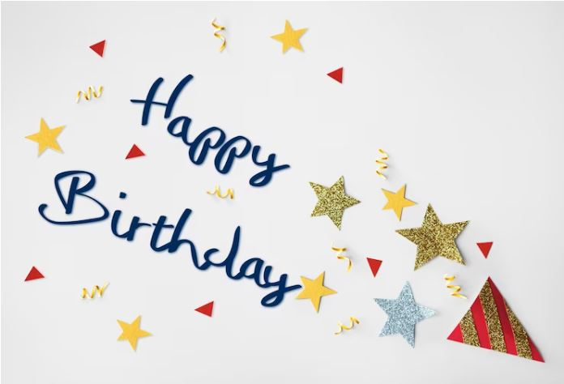
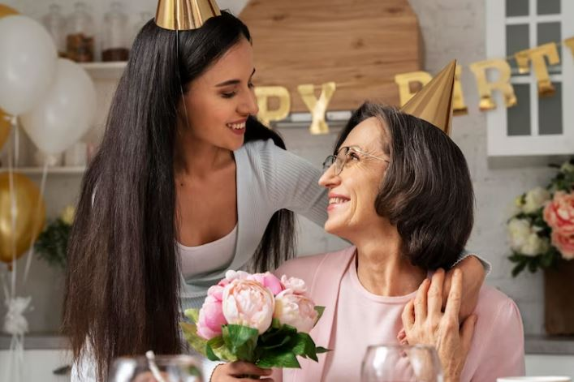
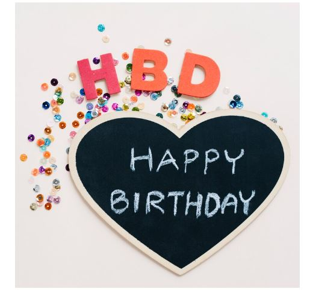
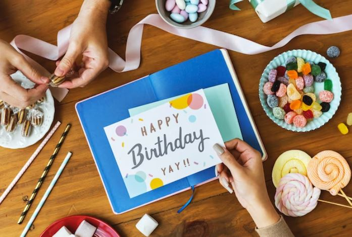

This article has been written and researched by our expert Loveable through a precise methodology. [Learn more about our methodology](https://avada.io/loveable/our-methodological.html)

[Loveable](https://avada.io/loveable/) > [Blog](https://avada.io/loveable/blog/) > [Family](https://avada.io/loveable/family/)

# 120 Wonderful Happy 60th Birthday Wishes to Celebrate a Milestone

Written by [Rose Bryne](https://avada.io/loveable/author/rose/) Last Updated on August 29, 2023

- [Happy 60th Birthday Wishes](https://avada.io/loveable/blog/happy-60th-birthday-wishes/#wp-block-heading-2-4)
- [Funny 60th Birthday Wishes](https://avada.io/loveable/blog/happy-60th-birthday-wishes/#wp-block-heading-2-21)
- [60th Birthday Wishes for Dad](https://avada.io/loveable/blog/happy-60th-birthday-wishes/#wp-block-heading-2-38)
- [60th Birthday Wishes for Mom](https://avada.io/loveable/blog/happy-60th-birthday-wishes/#wp-block-heading-2-55)
- [Happy 60th Birthday Wishes for Partner](https://avada.io/loveable/blog/happy-60th-birthday-wishes/#wp-block-heading-2-72)
- [60th Birthday Wishes for Friend](https://avada.io/loveable/blog/happy-60th-birthday-wishes/#wp-block-heading-2-89)
- [Happy 60th Birthday Wishes For Siblings](https://avada.io/loveable/blog/happy-60th-birthday-wishes/#wp-block-heading-2-106)
- [Inspirational 60th Birthday Quotes](https://avada.io/loveable/blog/happy-60th-birthday-wishes/#wp-block-heading-2-123)
- [Personalizing the Wishes](https://avada.io/loveable/blog/happy-60th-birthday-wishes/#wp-block-heading-2-140)
- [In Conclusion](https://avada.io/loveable/blog/happy-60th-birthday-wishes/#wp-block-heading-2-150)

Welcome to a collection of wonderful happy 60th birthday wishes, carefully crafted to celebrate a momentous milestone in the lives of your loved ones. 

Turning 60 is a remarkable occasion that deserves to be honored and cherished with heartfelt words of appreciation, love, and inspiration. Whether you’re celebrating a parent, partner, friend, or sibling, these birthday wishes aim to capture the essence of their journey, the wisdom they’ve gained, and the joy they bring to those around them. 

Join us in commemorating this special day with personalized messages that will leave a lasting impression on the birthday celebrant’s heart.

## **Happy 60th Birthday Wishes**

1. Happy 60th birthday! Wishing you a day filled with laughter, love, and unforgettable memories. May this milestone year be the best one yet!
2. Congratulations on reaching 60! Here’s to many more years of good health, happiness, and joy. You deserve all the wonderful things life has to offer.
3. Sixty and fabulous! Embrace this new chapter with open arms and a heart full of gratitude. You are an inspiration to us all.
4. Turning 60 is a testament to a life well-lived. May this birthday be a celebration of all your accomplishments and a preview of even greater things to come.
5. Happy 60th birthday to someone who only gets better with age. Your wisdom, kindness, and charm shine brighter with each passing year.
6. Sending you warmest wishes on your 60th birthday. May the years ahead be filled with laughter, love, and cherished moments with family and friends.
7. At 60, you’re not just getting older; you’re becoming a classic! Here’s to a year of vintage memories and timeless adventures.
8. Happy 60th! Remember, age is just a number, and you’re proving that every day with your youthful spirit and zest for life.
9. Sixty years of making the world a better place, one smile at a time. Wishing you a birthday that’s as heartwarming as you are.
10. Happy birthday to a true gem who has been shining brightly for 60 years. May your light continue to illuminate the lives of everyone around you.
11. Welcome to the fabulous 60s club! It’s a place of grace, wisdom, and endless possibilities. Enjoy this new phase of life to the fullest.
12. They say life begins at 60, and with all your experience and wisdom, this year is bound to be extraordinary. Happy birthday!
13. Here’s to a life well-lived and a future filled with even more adventures. Happy 60th birthday to an extraordinary person!
14. Congratulations on turning 60! Your life is a masterpiece, and each passing year adds more colors to your beautiful canvas.
15. Age may add a few wrinkles, but it also adds countless cherished memories and moments. Happy 60th birthday, and here’s to many more incredible years ahead!

## **Funny 60th Birthday Wishes**

1. Happy 60th birthday! They say age is just a number, but at 60, you’re really starting to collect some impressive numbers. Keep counting those candles!
2. Congratulations on reaching the “Sassy Sixties”! Just remember, you’re not old; you’re a classic, like a fine wine or a vintage car.
3. Happy 60th! Welcome to the age when “Getting lucky” means finding your car keys on the first try.
4. Turning 60 is like graduating from the school of life. Now it’s time for the “Senior Year” of partying and having a blast!
5. Don’t worry about turning 60; it’s just 40 with 20 years of experience! Embrace your inner youth and party on!
6. They say with age comes wisdom, but I think you’re wise enough to lie about your age if anyone asks. Happy 29th-again birthday!
7. Happy 60th! At this point, you have two speeds: slow and stop. But hey, at least you’re still moving!
8. Sixty is when you can finally afford all the things you couldn’t afford at 40 because you didn’t have the time to enjoy them. Cheers to financial freedom!
9. Congratulations on hitting the “Big 6-0”! You’ve officially reached the age when “getting lucky” means a great parking spot.
10. Happy 60th birthday! You know you’re getting older when you start to enjoy naps more than parties. Embrace the nap life!
11. Sixty is the perfect age – you’re old enough to know better, but young enough not to care! Enjoy your carefree days!
12. Welcome to the fabulous 60s, where you can say whatever you want because everyone will just think you’re being cute!
13. Turning 60 is like leveling up in the game of life. Now you’ve unlocked the “Retirement Mode” – time to kick back and relax!
14. They say that age is just a number, but at 60, that number comes with creaky joints and a lot of groaning. Happy birthday, old-timer!
15. Happy 60th! Remember, you’re not getting older; you’re getting better, like a fine cheese or a rare vintage. Embrace your aging like a pro!

## **60th Birthday Wishes for Dad**

1. Happy 60th birthday, Dad! Thank you for being a pillar of strength and support in our lives. May this milestone year be filled with happiness and good health.
2. To the world’s greatest dad, on your 60th birthday: You’ve been our rock, our role model, and our guiding light. Here’s to many more years of love and laughter together.
3. Sixty years of life, love, and memories with you as our dad have been truly special. Wishing you a birthday as amazing as you are!
4. Happy 60th to the man who taught us the true meaning of love, sacrifice, and hard work. You’re not just a dad; you’re our hero.
5. Congratulations on turning 60, Dad! Your wisdom and kindness have shaped us into the people we are today. We are forever grateful for your love.
6. Sixty years of making the world brighter with your presence. You’ve touched so many lives, but none more than ours. Happy birthday, Dad!
7. As you celebrate your 60th birthday, know that you are cherished and loved beyond measure. You are the heart and soul of our family.
8. Dear Dad, at 60, you’re like fine wine – getting better with age. Your love and guidance continue to inspire us every day.
9. Happy 60th to the coolest, most incredible dad around! You’ve never stopped being our superhero, and we love you to the moon and back.
10. Here’s to a dad who is forever young at heart. May your 60s be filled with joy, laughter, and unforgettable moments.
11. Happy 60th birthday to a dad who always put his family first. Your selflessness and devotion are truly remarkable.
12. Sixty looks amazing on you, Dad! You’ve aged like a fine vintage, getting better and more cherished with time.
13. To the man who gave us the best childhood memories and the brightest future, happy 60th birthday. You mean the world to us.
14. Dad, you are a true inspiration to us all. Your kindness, humor, and love make every day brighter. Wishing you a sensational 60th birthday!
15. As you celebrate this special milestone, know that you are loved not only for what you’ve done but for who you are. Happy 60th birthday, Dad!

## **60th Birthday Wishes for Mom**

1. Happy 60th birthday, Mom! You’re not just a year older; you’re a year wiser, more beautiful, and more loved than ever before.
2. To the most amazing mom on her 60th birthday: Your love and care have shaped our lives in countless ways. May this milestone year be filled with joy and blessings.
3. Sixty years of love, laughter, and endless memories with you as our mom. Wishing you a birthday that’s as special as you are.
4. Congratulations on turning 60, Mom! Your strength, grace, and compassion continue to inspire us every day.
5. Happy 60th to the woman who made our house a home and our lives a masterpiece. You’re our source of comfort and joy.
6. Sixty years of being the heart and soul of our family. Your love is the glue that holds us all together. Happy birthday, Mom!
7. Dear Mom, at 60, you’re as radiant as ever. Your smile brightens our darkest days, and your love knows no bounds.
8. Here’s to a mom who is forever young at heart. May your 60s be filled with laughter, adventure, and happiness.
9. Happy 60th birthday to the strongest, most beautiful person we know. Your love has been our anchor in life’s stormy seas.
10. Here’s to a mom who is aging gracefully and embracing every moment. Your spirit is an inspiration to us all.
11. Happy 60th birthday, Mom! Your warmth and compassion have touched so many lives, and we’re grateful to call you our mom.
12. Sixty looks stunning on you, Mom! You’ve aged with elegance and wisdom, and we’re blessed to have you as our role model.
13. To a mom who is the epitome of love and sacrifice, happy 60th birthday. You’ve given us the world, and we cherish you more than words can express.
14. Mom, you’ve given us the best of everything – the best advice, the best love, and the best memories. Wishing you a fantastic 60th birthday!
15. As you celebrate this special milestone, know that you are cherished and adored. Your love is a gift that keeps on giving. Happy 60th birthday, Mom!

## **Happy 60th Birthday Wishes for Partner**

1. Happy 60th birthday to the love of my life! With each passing year, our love grows stronger, and I’m grateful for every moment we’ve shared together.
2. Sixty years have never looked so good! You’re not just my partner; you’re my rock, my confidant, and my best friend. Here’s to many more incredible years ahead.
3. Congratulations on reaching this incredible milestone! You’ve enriched my life in ways I never thought possible. Wishing you a birthday filled with love and joy.
4. Happy 60th to the person who makes my heart skip a beat. You bring so much happiness into my life, and I’m forever grateful for your love.
5. Turning 60 is just another reason to celebrate the wonderful person you are. You light up my life in more ways than you know. Have a fantastic birthday!
6. Here’s to a partner who keeps getting better with age, just like fine wine. I’m looking forward to creating more beautiful memories with you.
7. Happy 60th birthday to the one who stole my heart and never gave it back. You’re the missing piece in my life’s puzzle, and I’m so lucky to have you.
8. Sixty years of love and laughter, and I’m excited to share many more with you. You make life an incredible journey.
9. Wishing my extraordinary partner a truly special 60th birthday! You make every day brighter with your smile and love.
10. Happy birthday to the person who completes me in every way possible. Your presence in my life is a blessing I cherish every day.
11. Sixty years of living, loving, and laughing together. I’m grateful for the moments we’ve shared and the ones yet to come.
12. Here’s to the one who knows me better than I know myself. You are my heart, my soul, and my everything. Happy 60th birthday, my love.
13. Congratulations on turning 60 with style and grace! You bring so much happiness into my life, and I can’t imagine a world without you.
14. To the love of my life, on your 60th birthday: You’ve given me a lifetime of love and joy, and I promise to cherish you every day.
15. Happy 60th birthday to the person who makes my heart soar and my spirit sing. I’m grateful for the love we share and excited about our future together.

## **60th Birthday Wishes for Friend**

1. Happy 60th birthday, my dear friend! You’ve been a source of laughter, support, and countless unforgettable memories. Here’s to many more fantastic years ahead!
2. Congratulations on reaching this fabulous milestone! Your friendship has been a blessing, and I’m grateful for every moment we’ve shared together.
3. Sixty years of friendship, and it feels like we’ve only just begun. Thank you for being an amazing friend, and may this birthday be as incredible as you are.
4. Happy 60th to the friend who’s always been there, through thick and thin. Your friendship is a treasure I’ll cherish forever.
5. Turning 60 is just another reason to celebrate the wonderful person you are. You bring joy and positivity to everyone around you.
6. Here’s to a friend who keeps getting better with age, like a fine wine. Wishing you a birthday filled with love, laughter, and all your heart desires.
7. Happy 60th birthday to my partner-in-crime and the one who understands me like no one else. Your friendship is a gift I treasure deeply.
8. Sixty years of life, love, and friendship with you have been a true blessing. Thank you for being the amazing person you are.
9. Wishing my incredible friend a birthday filled with joy, love, and laughter. You deserve all the happiness in the world.
10. Happy 60th to the one who brings sunshine into my life. Your friendship is a ray of light on even the darkest days.
11. Sixty years of being the life of the party and the heart of our group. Thank you for making every gathering unforgettable!
12. Here’s to a friend who knows how to have fun and enjoys every moment to the fullest. May your 60s be a time of new adventures and happy memories.
13. Happy birthday to the one who’s always young at heart. Your spirit is infectious, and I’m grateful to call you my friend.
14. Sixty looks fantastic on you! Your age is just a number, and your spirit is forever young.
15. To the friend who’s seen it all and still has a smile on their face – happy 60th birthday. Your strength and positivity inspire us all.

## **Happy 60th Birthday Wishes For Siblings**

1. Happy 60th birthday, dear sibling! Sixty years of having you as a brother/sister has been a true blessing. May this milestone year bring you joy and fulfillment.
2. Congratulations on reaching the fabulous age of 60! You’re not just my sibling; you’re my lifelong friend. Wishing you a day filled with love and laughter.
3. Sixty years of laughter, tears, and shared memories. Thank you for being the best sibling anyone could ask for. Have a fantastic birthday!
4. Happy 60th to my forever partner in mischief and my shoulder to lean on. You’ve made my life richer in countless ways.
5. Turning 60 is a time to reflect on all the beautiful moments we’ve shared as siblings. Here’s to many more years of love and togetherness.
6. Congratulations on hitting the “Big 6-0”! You’ve been my support system and my strength through every phase of life. I’m grateful to have you as my sibling.
7. Sixty years of growing up together and becoming the amazing individuals we are today. Wishing you a birthday that’s as extraordinary as you are.
8. Happy 60th birthday to my partner in crime, my confidant, and my closest sibling. You’re not just family; you’re my forever friend.
9. Here’s to a sibling who knows me better than anyone else. Your love and understanding mean the world to me. Have a fantastic birthday!
10. Turning 60 is a milestone worth celebrating with the ones we hold closest. I’m grateful to have you as my sibling and friend. Cheers to you!
11. Happy 60th to the one who’s been with me through thick and thin. You’ve been my rock and my inspiration. May your birthday be filled with love and happiness.
12. Sixty years of being part of the same journey, and I wouldn’t have it any other way. You’re more than a sibling; you’re my family.
13. Congratulations on entering the “Golden Years”! May this new chapter be filled with golden memories and endless happiness.
14. Happy 60th to the sibling who knows all my secrets and still loves me unconditionally. You’re a treasure in my life.
15. Sixty years of being each other’s biggest fans and fiercest protectors. I’m grateful for the bond we share, and I wish you the happiest of birthdays!

## **Inspirational 60th Birthday Quotes**

1. “Age is an issue of mind over matter. If you don’t mind, it doesn’t matter.” – Mark Twain
2. “The best is yet to be.” – Robert Browning
3. “You are never too old to set another goal or to dream a new dream.” – C.S. Lewis
4. “Life is not measured by the number of breaths we take, but by the moments that take our breath away.” – Maya Angelou
5. “Age is an opportunity no less than youth itself.” – Henry Wadsworth Longfellow
6. “Don’t count the years, make the years count.” – George Meredith
7. “Life is a journey, and as we age, the journey becomes more like a beautiful painting, filled with rich colors and cherished memories.” – Unknown
8. “The older I get, the more I realize that it’s not about what I have, but who I have in my life that matters.” – Unknown
9. “The beauty of reaching 60 is having the wisdom to see the world through a kaleidoscope of experiences.” – Unknown
10. “The wrinkles on our faces are the roadmap of our lives, showing the paths we’ve taken and the stories we’ve lived.” – Unknown
11. “Life is a gift, and every day is a chance to embrace it with gratitude and joy.” – Unknown
12. “Sixty is not an age; it’s a state of mind filled with wisdom and grace.” – Unknown
13. “At 60, you’re not getting older; you’re becoming a classic, like a fine piece of art.” – Unknown
14. “Age is not a limit, but a badge of honor for the battles we’ve fought and the victories we’ve achieved.” – Unknown
15. “Sixty is the age of renewal, a time to bloom with the wisdom of experience and the enthusiasm of youth.” – Unknown

## **Personalizing the Wishes**

Personalizing happy 60th birthday wishes is a heartfelt way to show appreciation and celebrate the unique individual turning this significant age. By tailoring messages to suit the recipient’s personality, the wishes become more than mere words on a card; they become a reflection of the bond shared. 

Whether they have a great sense of humor, a passion for adventure, or a penchant for wisdom, acknowledging these traits in the message brings a smile to their face.

Furthermore, mentioning specific qualities that make them special adds a personal touch that resonates deeply. By highlighting their kindness, generosity, or unwavering support, the birthday wishes become a testament to the impact they’ve had on others’ lives. It’s an opportunity to express gratitude and admiration for the person they’ve become over the years.

To elevate the experience, adding personal touches ensures a truly unique birthday wish. Inside jokes, shared memories, or references to significant life events create a sense of intimacy and closeness. These personalized elements let the recipient know that the sender understands and cherishes the depth of their connection.

In short, personalizing 60th birthday wishes through tailoring messages, mentioning specific qualities, and adding personal touches elevates the birthday greeting from a simple formality to a genuine expression of love and admiration. It’s a reminder of the beautiful bond they shared and a celebration of the remarkable person they’ve become.

**Related:**

- [60th Birthday Gifts For Man](https://avada.io/loveable/gifts-60-year-old-man/)

- [60th Birthday Gifts](https://avada.io/loveable/60th-birthday-gifts/)

## **In Conclusion**

As we conclude this compilation of **happy 60th birthday wishes**, we hope you’ve found the perfect words to express your affection and admiration for the birthday celebrant. Turning 60 marks a significant chapter in one’s life, a time to embrace the journey taken and the experiences shared. 

These carefully crafted messages seek to honor the incredible people they are and the incredible impact they’ve had on those around them. May these heartfelt wishes bring smiles, tears of joy, and a sense of warmth to the celebrant’s heart as they embark on the next exciting phase of life. 

Here’s to the birthday celebrant – may their 60th year be filled with love, laughter, and unforgettable memories!

- [Happy 60th Birthday Wishes](https://avada.io/loveable/blog/happy-60th-birthday-wishes/#wp-block-heading-2-4)
- [Funny 60th Birthday Wishes](https://avada.io/loveable/blog/happy-60th-birthday-wishes/#wp-block-heading-2-21)
- [60th Birthday Wishes for Dad](https://avada.io/loveable/blog/happy-60th-birthday-wishes/#wp-block-heading-2-38)
- [60th Birthday Wishes for Mom](https://avada.io/loveable/blog/happy-60th-birthday-wishes/#wp-block-heading-2-55)
- [Happy 60th Birthday Wishes for Partner](https://avada.io/loveable/blog/happy-60th-birthday-wishes/#wp-block-heading-2-72)
- [60th Birthday Wishes for Friend](https://avada.io/loveable/blog/happy-60th-birthday-wishes/#wp-block-heading-2-89)
- [Happy 60th Birthday Wishes For Siblings](https://avada.io/loveable/blog/happy-60th-birthday-wishes/#wp-block-heading-2-106)
- [Inspirational 60th Birthday Quotes](https://avada.io/loveable/blog/happy-60th-birthday-wishes/#wp-block-heading-2-123)
- [Personalizing the Wishes](https://avada.io/loveable/blog/happy-60th-birthday-wishes/#wp-block-heading-2-140)
- [In Conclusion](https://avada.io/loveable/blog/happy-60th-birthday-wishes/#wp-block-heading-2-150)

### [Rose Bryne](https://avada.io/loveable/author/rose/)

Hi, I'm Rose! I love animals and spending time with kids. At Loveable, I help people find unique gifts for special occasions like Valentine's Day, housewarmings, and graduations. I enjoy finding gifts for kids, teens, and animal lovers that match their interests and personalities. Making gift-giving a pleasant experience is my priority. Let me assist you in finding the perfect gift!

- [Twitter](https://twitter.com/intent/tweet)
- [Facebook](https://www.facebook.com/sharer/sharer.php)
- [instagram](https://avada.io/loveable/blog/happy-60th-birthday-wishes/)
- [pinterest](https://www.pinterest.com/loveablellc/)

## Related Posts

[### 30 Best 4 Year Old Birthday Party Ideas For A Memorable Celebration](https://avada.io/loveable/blog/4-year-old-birthday-party-ideas/) 

[

### 16th Birthday Party Ideas to Make an Unforgettable Day

](https://avada.io/loveable/blog/16th-birthday-party-ideas/)

[

### 150+ Inspirational Birthday Quotes to Spread Joy on Special Day

](https://avada.io/loveable/blog/inspirational-birthday-quotes/)

[

### 160+ Birthday Wishes for Wife to Express Eternal Love

](https://avada.io/loveable/blog/birthday-wishes-for-wife/)

[### 90+ Heart Touching Birthday Wishes for Niece to Make Her Day Extra Special](https://avada.io/loveable/blog/birthday-wishes-for-niece/)
