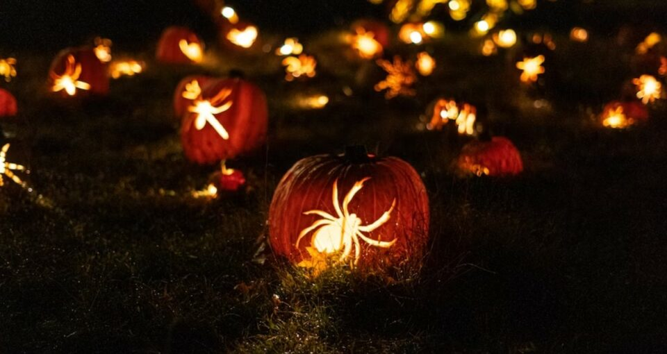
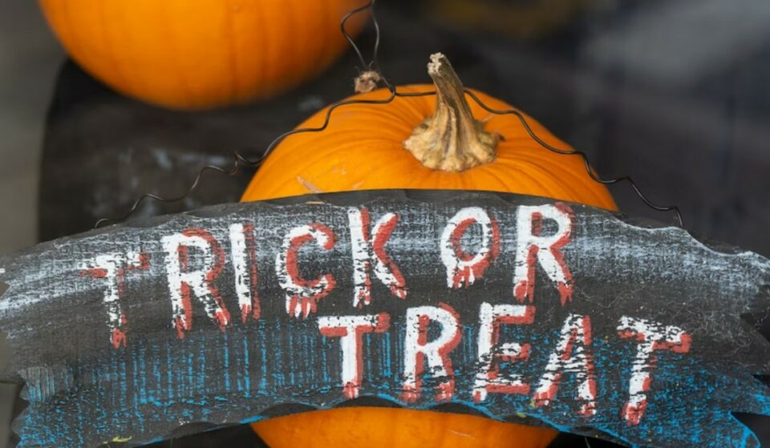
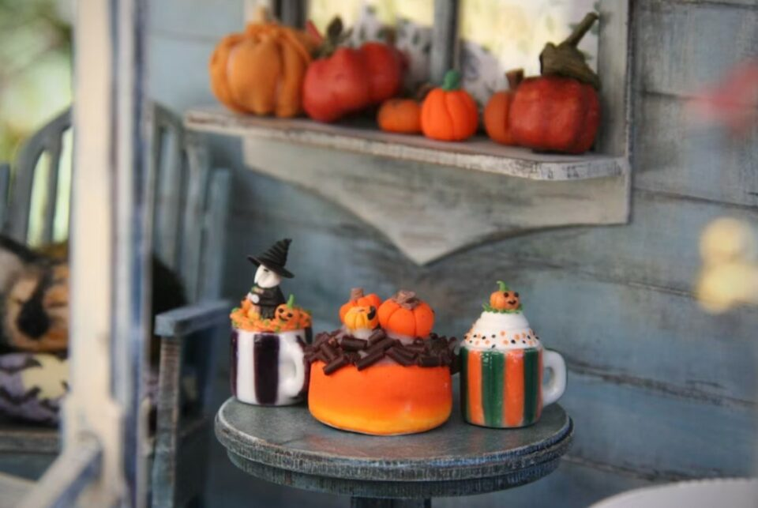
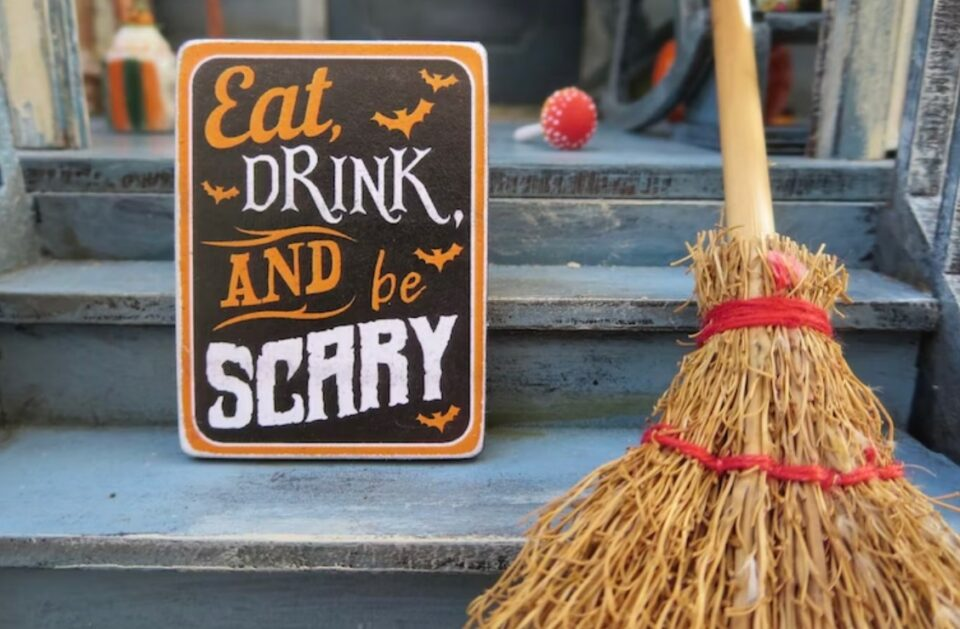

This article has been written and researched by our expert Loveable through a precise methodology. [Learn more about our methodology](https://avada.io/loveable/our-methodological.html)

[Loveable](https://avada.io/loveable/) > [Blog](https://avada.io/loveable/blog/) > [Holiday](https://avada.io/loveable/holiday/)

# 122 Best Halloween Quotes 2023 for The Fun and Frights This October

Written by [Blake Simpson](https://avada.io/loveable/author/blake/) Last Updated on September 05, 2023

- [Top 122 Famous Halloween Quotes In 2023](https://avada.io/loveable/blog/halloween-quotes/#wp-block-heading-2-3)
    - [Meaningful Halloween Quotes](https://avada.io/loveable/blog/halloween-quotes/#wp-block-heading-3-4)
    - [Spooky Halloween Quotes](https://avada.io/loveable/blog/halloween-quotes/#wp-block-heading-3-30)
    - [Other Sayings](https://avada.io/loveable/blog/halloween-quotes/#wp-block-heading-3-57)
    - [Halloween Quotes For All Ages](https://avada.io/loveable/blog/halloween-quotes/#wp-block-heading-3-96)
- [Bottom Line](https://avada.io/loveable/blog/halloween-quotes/#wp-block-heading-2-135)

Some people decorate for Halloween in August; others wait until late October to get into the spirit. To get into the haunted spirit, read up on some of the spookiest **Halloween quotes** and sayings. In this spooky collection of Halloween quotes, we’ve got some creepy quotes from some of the best [Halloween stories](https://avada.io/loveable/blog/best-halloween-stories/), [Halloween poems](https://avada.io/loveable/blog/halloween-poems/), and [movies](https://avada.io/loveable/blog/best-halloween-movies/), as well as some scary sayings from Halloween fans.

Here are 122 of the spookiest Halloween quotes that will have you feeling ghoulish on October 31st when the clock strikes midnight.

## **Top 122 Famous Halloween Quotes In 2023**

### **Meaningful Halloween Quotes**

- “I love Halloween, and I love that feeling: the cold air, the spooky dangers lurking around the corner.” by Evan Peters
- “It’s all just a bunch of hocus pocus!” by Max (Hocus Pocus)
- “Halloween was the best holiday, in my opinion, because it was all about friends, monsters, and candy, rather than family and responsibility.” by Margee Kerr
- “The farther we’ve gotten from the magic and mystery of our past, the more we’ve come to need Halloween.” by Paula Curan
- “When witches go riding, and black cats are seen, the moon laughs and whispers, ‘tis near Halloween.” by Unknown
- “There is a child in every one of us who is still a trick-or-treater looking for a brightly-lit front porch.” by Robert Brault
- “Fear,’ the doctor said, ‘is the relinquishment of logic, the willing relinquishing of reasonable patterns. We yield to it or we fight it, but we cannot meet it halfway.’” by Shirley Jackson (The Haunting of Hill House)
- “Nothing on Earth so beautiful as the final haul on Halloween night.” by Steve Almond
- “I’m so glad I live in a world where there are Octobers.” by L.M. Montgomery
- “She’d always loved Halloween. A magic night. A night when anything could happen. Monsters could be real. Magic could whisper in the air.” by Cynthia Eden
- “Halloween was confusing. All my life my parents said, ‘Never take candy from strangers.’ And then they dressed me up and said, ‘Go beg for it.’” by Rita Rudner
- “Double, double toil and trouble; Fire burn and cauldron bubble.” by William Shakespeare (Macbeth)
- “Magic is really very simple, all you’ve got to do is want something and then let yourself have it.” by Aggie Cromwell (Halloweentown)
- “She used to tell me that a full moon was when mysterious things happen and wishes come true.” by Shannon A. Thompson
- “Halloween shadows played upon the walls of the houses. In the sky, the Halloween moon raced in and out of the clouds… It was a lovely and exciting night, exactly the kind of night Halloween should be.” by Eleanor Estes
- “The world turned upside down–in a good way–for one black velvet night.” by Karen Fortunati, American Author
- “Life itself is but the shadow of death, and souls departed but the shadows of the living.” by Thomas Browne (Garden of Cyrus)
- “Halloween is an opportunity to be really creative.” by Judy Gold, American Comedian
- “There is magic in the night when pumpkins glow by moonlight.” by Unknown
- “Some people are born for Halloween, and some are just counting the days until Christmas.” by Stephen Graham Jones
- “Vampires, werewolves, fallen angels and fairies lurk in the shadows, their intentions far from honorable.” by Jeaniene Frost
- “Tis now the very witching time of night, when churchyards yawn and hell itself breathes out contagion to this world.” by William Shakespeare (Hamlet)
- “Clothes make a statement. Costumes tell a story.” by Mason Cooley, American Aphorist
- “I heard all things in the heaven and in the earth. I heard many things in hell.” by Edgar Allan Poe (The Tell-Tale Heart)

### **Spooky Halloween Quotes**

- “It’s as much fun to scare as to be scared.” by Vincent Price
- “Evil has only the power that we give it.” by Ray Bradbury (Something Wicked This Way Comes)
- “I am the pumpkin king.” by Poor Jack (The Nightmare Before Christmas)
- “Last night you were unhinged. You were like some desperate, howling demon. You frightened me. Do it again.” by Morticia, (The Addams Family)
- “It’s Halloween! It’s Halloween! The moon is full and bright and we shall see that can’t be seen on any other night.” by Jack Prelutsky (It’s Halloween)
- “During the day, I don’t believe in ghosts. At night, I’m a little more open-minded.” by Unknown
- “Every day is Halloween, isn’t it? For some of us.” by Tim Burton
- “I met this six-year-old child, with this blank, pale, emotionless face and the blackest eyes—the Devil’s eyes. I spent eight years trying to reach him, and then another seven trying to keep him locked up.” by Samuel Loomis (Halloween)
- “Beware the dark pool at the bottom of our hearts. In its icy, black depths dwell strange and twisted creatures it is best not to disturb.” by Sue Grafton (‘I’ is for Innocent)
- “Witch parking. All others will be toad.” by Unknown
- “Anyone could see that the wind was a special wind this night, and the darkness took on a special feel because it was All Hallows’ Eve.” by Ray Bradbury (The Halloween Tree)
- “If I cannot inspire love, I will cause fear!” by Mary Shelley, (Frankenstein)
- “Flip the switch and let the cauldron bubble!” by Aunt Frances Owens (Practical Magic)
- “Oh how the candles will be lit and the wood of worm burn in a fiery dust. For on all Hallows’ Eve will the spirits come to play.” by Solange Nicole
- “Not every witch lives in Salem.” by Unknown
- “Most people will tell you growing up means you stop believing in Halloween things—I’m telling you the reverse. You start to grow up when you understand that the stuff that scares you is part of the air you breathe.” by Peter Straub (Magic Terror: 7 Tales)
- “It’s that special time of year where we voluntarily imbibe pumpkin-spiced lattes: the coffee that tastes like a candle.” by John Oliver
- “Maybe ever’body in the whole damn world is scared of each other.” by John Steinbeck (Of Mice and Men)
- “We shall see that at which dogs howl in the dark, and that at which cats prick up their ears after midnight.” by H.P. Lovecraft (The Collected Works of H.P. Lovecraft)
- “At night the fog was thick and full of light, and sometimes voices.” by Erin Bow (Plain Kate)
- “Imagination be a witch tonight.” by Robert Bagg (Hallowe’en)
- “Suddenly the day was gone, night came out from under each tree and spread.” by Ray Bradbury (The Halloween Tree)
- “Shadows of a thousand years rise again unseen, voices whisper in the trees, ‘Tonight is Halloween!’” by Dexter Kozen
- “The oldest and strongest emotion of mankind is fear, and the oldest and strongest kind of fear is fear of the unknown.” by H.P. Lovecraft (Supernatural Horror in Literature)
- “Be careful in the company of monsters that you don’t become one.” by Cindy Gerard (Take No Prisoners)

### **Other Sayings**

- “The dead rise again, bats fly, terror strikes and screams echo, for tonight it’s Halloween.” by Unknown
- “They thought of All Hallows’ Night and the billion ghosts awandering the lonely lanes in cold winds and strange smokes.” by Ray Bradbury (The Halloween Tree)
- “There are three things that I’ve learned never to discuss with people: religion, politics and the Great Pumpkin.” by Linus (It’s the Great Pumpkin, Charlie Brown)
- “They cannot be seen because they creep only in the dark.” by H.P. Lovecraft (The H.P. Lovecraft Collection)
- “On Hallowe’en they all jump off the roof and fly!” by Ice Cream Boy (Practical Magic)
- “In masks and gowns we haunt the street and knock on doors for trick or treat.” by Jack Prelutsky, (It’s Halloween)
- “I might play with my cat and then go trick people to death.” –Scott Holstad, “Shadows Before the Maiming”
- “Catching and holding the attention of an eight-year-old on Halloween is like trying to catch a hummingbird with a piece of dental floss. It’s theoretically possible, but not very likely.” by Abbi Waxman (Adult Assembly Required)
- “I’m wicked through and through.” by Elphaba (Wicked)
- “Pumpkins in October, as fat as the full moon, they sit on our doorstep at night and glow.” by Richelle Goodrich (Being Bold: Quotes, Poetry, & Motivations for Every Day of the Year)
- “Searchers after horror haunt strange, far places.” by H.P. Lovecraft (The Short Stories of H.P. Lovecraft)
- “I knew nothing but shadows and I thought them to be real.” by Oscar Wilde (The Picture of Dorian Gray)
- “You ever feel prickly things on the back of your neck?” by Cole Sear (The Sixth Sense)
- “A witch never gets caught. Don’t forget that she has magic in her fingers and devilry dancing in her blood.” by Roald Dahl (The Witches)
- “There’s a little witch in all of us.” by Alice Hoffman (Practical Magic)
- “When I sleep my spirit slips away from my body and dances naked with the devil.” by Thomasin (The Witch)
- “It’s Halloween. Everyone’s entitled to one good scare.” by Sheriff Leigh Brackett (Halloween)
- “There’s only 365 days left until next Halloween!” by Mayor (The Nightmare Before Christmas)
- “I know of witches who whistle at different pitches, calling things that don’t have names.” by Helen Oyeyemi (White is for Witching)
- “Things are never quite as scary when you’ve got a best friend.” by Bill Waterson (American Cartoonist)
- “Fear has many eyes, and can see things underground.” by Miguel de Cervantes (The Adventures of Don Quixote)
- “Darkness falls across the land, the midnight hour is close at hand.” by Vincent Price (Thriller)
- “What’s the good of being a ghost if you can’t frighten people away?” by Barbara (Beetlejuice)
- “Fear is pain arising from the anticipation of evil.” by Aristotle
- “Whoever is not in his coffin and the dark grave, let him know he has enough.” by Walt Whitman
- “A deep sleep fell upon me—a sleep like that of death.” by Edgar Allan Poe (The Pit and the Pendulum)
- “Listen to them—the children of the night. What music they make!” by Bram Stoker, Irish Author
- “We are the things that others fear.” by Anne Rice (The Vampire Lestat)
- “He thrusts his fists against the posts and still insists he sees the ghosts.” by Stephen King (It)
- “They who dream by day are cognizant of many things which escape those who dream only by night.” by Edgar Allan Poe (The Tell-Tale Heart)
- “By the pricking of my thumbs, Something wicked this way comes.” by William Shakespeare (Macbeth)
- “You are about to enter another dimension. A dimension not only of sight and sound but of mind. A journey into a wondrous land of imagination. Next stop: The Twilight Zone.” by Rod Serling (The Twilight Zone)
- “The ghouls all came from their humble abodes, to get a jolt from my electrodes.” by Robert Pickett (Monster Mash)
- “I would die for her. I would kill for her. Either way, what bliss.” by Gomez (The Addams Family)
- “There are no heroes… in life, the monsters win.” by George R. R. Martin
- “The strength of the vampire is that people will not believe in him.” by Garrett Fort
- “Sticky fingers, tired feet; one last [house](https://avada.io/loveable/halloween-mantel-decor-ideas/), trick or treat!” by Rusty Fischer, American Author

### **Halloween Quotes For All Ages**

- “A mask tells us more than a face.” by Oscar Wilde
- “Be afraid… be very afraid.” by The Fly
- “We make up horrors to help us cope with the real ones.” by Stephen King, American Author
- “Whatever you do, don’t fall asleep.” by A Nightmare on Elm Street
- “Never trust anything that can think for itself if you can’t see where it keeps its brain.” by J.K. Rowling
- “Do you believe in destiny? That even the powers of time can be altered for a single purpose?” by Dracula (1992)
- “There is something at work in my soul, which I do not understand.” by Mary Shelley (Frankenstein)
- “This is my costume. I’m a homicidal maniac. They look just like everyone else.” by Wednesday, The Addams Family (1991)
- “If human beings had genuine courage, they’d wear their costumes every day of the year, not just on Halloween.” by Douglas Coupland
- “Have you come to sing pumpkin carols?” by Linus (It’s the Great Pumpkin, Charlie Brown)
- “On Halloween, witches come true; wild ghosts escape from dreams. Each monster dances in the park.” by Nick Gordon
- “The moon has awoken with the sleep of the sun, the light has been broken; the spell has begun.” by Midgard Morningstar
- “There is something haunting in the light of the moon.” by Joseph Conrad
- “I put a spell on you because you’re mine.” by Jay Hawkins, American Singer-Songwriter
- “Halloween wraps fear in innocence, as though it were a slightly sour sweet. Let terror, then, be turned into a treat…” by Nicholas Gordon
- “Tis the night—the night of the grave’s delight, and the warlocks are at their play; Ye think that without the wild winds shout, but no, it is they—it is they.” by Cleveland Coxe
- “Where there is no imagination, there is no horror.” by Arthur Conan Doyle, British Writer
- “No good deed will I do again.” by Elphaba (Wicked)
- “Believe nothing you hear, and only one half that you see.” by Edgar Allan Poe, American Writer
- “Villainy wears many masks, none so dangerous as the mask of virtue.” by Ichabod Crane (Sleepy Hollow)
- “Goodbye cruel world.” by Winifred Sanderson (Hocus Pocus)
- “I dropped the candies into the children’s bags, thinking: You small mortals don’t realize the power of your stories.” by Karen Russell (Vampires in the Lemon Grove)
- “Such are the autumn people. Beware of them.” by Ray Bradbury (Something Wicked This Way Comes)
- “So the darkness shall be the light, and the stillness the dancing.” by T.S. Eliot
- “That’s what you dream about? Being a monster?” by Edward Cullen (Twilight)
- “I be the witch of the wood.” by Thomasin, (The Witch)
- “Trick or treat, bag of sweets, ghosts are walking down the street.” by Unknown
- “The jack-o’-lantern follows me with tapered, glowing eyes. His yellow teeth grin evily. His cackle I despise.” by Richelle Goodrich, (Slaying Dragons)
- “Candle, spoon and carving knife: nearing the vigil of the dead, let’s impose a little life upon a ripening, faceless head.” by Robert B. Shaw (Jack O’ Lantern)
- “I ain’t ‘fraid of no ghost.” by Ray Parker Jr. (Ghostbusters)
- “Tonight the Great Pumpkin will rise out of the pumpkin patch. He flies through the air and brings toys to all the children of the world.” by Linus (It’s the Great Pumpkin, Charlie Brown)
- “The universe is full of magical things patiently waiting for our wits to grow sharper.” by Eden Phillpotts (A Shadow Passes)
- “Spooky, scary skeletons, send shivers down your spine, shrieking skulls will shock your soul, seal your doom tonight.” by Andrew Gold (Spooky, Scary Skeletons)
- “One thing about living in Santa Carla I never could stomach; all the damn vampires.” by Grandpa (The Lost Boys)
- “Sisters, All Hallows’ Eve has become a night of frolic, where children wear costumes and run amok!” by Winifred Sanderson (Hocus Pocus)
- “Good-bye, Ichabod Crane. I curse the day you came to Sleepy Hollow.” by Katrina Van Tassel (Sleepy Hollow)

**Related:** Hilarious [Halloween Puns](https://avada.io/loveable/halloween-puns/)

## **Bottom Line**

While Halloween can involve trick-or-treating, costumes, and decorations, it has also been a source of inspiration for countless quotes from authors and performers. From spooky warnings to lighthearted puns, these **Halloween quotes** invoke the spirit of Halloween in both young and old alike. Whether you’re gearing up for a night of festivities or just looking for some words to bring your décor alive, let these inspirational quotes be your guide as this spookiest season comes to an end.

- [Top 122 Famous Halloween Quotes In 2023](https://avada.io/loveable/blog/halloween-quotes/#wp-block-heading-2-3)
    - [Meaningful Halloween Quotes](https://avada.io/loveable/blog/halloween-quotes/#wp-block-heading-3-4)
    - [Spooky Halloween Quotes](https://avada.io/loveable/blog/halloween-quotes/#wp-block-heading-3-30)
    - [Other Sayings](https://avada.io/loveable/blog/halloween-quotes/#wp-block-heading-3-57)
    - [Halloween Quotes For All Ages](https://avada.io/loveable/blog/halloween-quotes/#wp-block-heading-3-96)
- [Bottom Line](https://avada.io/loveable/blog/halloween-quotes/#wp-block-heading-2-135)

### [Blake Simpson](https://avada.io/loveable/author/blake/)

Hi, I'm Blake from Loveable. I help people find perfect gifts for occasions like anniversaries and weddings. I also write a blog about holidays, sharing insights to make them more meaningful. Let's create unforgettable moments together!

- [Twitter](https://twitter.com/intent/tweet)
- [Facebook](https://www.facebook.com/sharer/sharer.php)
- [instagram](https://avada.io/loveable/blog/halloween-quotes/)
- [pinterest](https://www.pinterest.com/loveablellc/)

## Related Posts

[### 120+ Christian Birthday Wishes To Spread Your Love](https://avada.io/loveable/blog/christian-birthday-wishes/) 

[

### 35 Best 70th Birthday Ideas To Celebrate The Special Milestone

](https://avada.io/loveable/blog/70th-birthday-ideas/)

[

### 50 Best 30th Birthday Decorations for a Remarkable Birthday Bash

](https://avada.io/loveable/blog/30th-birthday-decorations/)

[

### 40 Delicious Vegan Christmas Desserts to Delight Your Palate

](https://avada.io/loveable/blog/vegan-christmas-desserts/)

[

### 60 Christmas Team Building Activities to Boost Workplace Spirit

](https://avada.io/loveable/blog/christmas-team-building-activities/)
