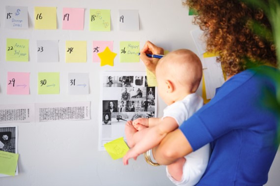

This article has been written and researched by our expert Loveable through a precise methodology. [Learn more about our methodology](https://avada.io/loveable/our-methodological.html)

[Loveable](https://avada.io/loveable/) > [Blog](https://avada.io/loveable/blog/) > [Family](https://avada.io/loveable/family/)

# 13 Best Tips For Balancing Work And Family Life 

Written by [Rose Bryne](https://avada.io/loveable/author/rose/) Last Updated on August 18, 2023

- [Why Is It Important To Balance Work And Family?](https://avada.io/loveable/blog/balancing-work-and-family-life/#wp-block-heading-2-4)
- [13 Best Tips For Balancing Work And Family Life](https://avada.io/loveable/blog/balancing-work-and-family-life/#wp-block-heading-2-17) 
    - [1\. Deal With Your Boss About Flexible Working Time](https://avada.io/loveable/blog/balancing-work-and-family-life/#wp-block-heading-3-18)  
    - [2\. Family Daily Workout](https://avada.io/loveable/blog/balancing-work-and-family-life/#wp-block-heading-3-21) 
    - [3\. Take A Technology Break.](https://avada.io/loveable/blog/balancing-work-and-family-life/#wp-block-heading-3-23)
    - [4\. Create A Family Routine.](https://avada.io/loveable/blog/balancing-work-and-family-life/#wp-block-heading-3-26) 
    - [5\. Control Stress Levels.](https://avada.io/loveable/blog/balancing-work-and-family-life/#wp-block-heading-3-28)
    - [6\. Find Time To Have Fun](https://avada.io/loveable/blog/balancing-work-and-family-life/#wp-block-heading-3-31) 
    - [7\. Priorities](https://avada.io/loveable/blog/balancing-work-and-family-life/#wp-block-heading-3-33)
    - [8\. Share Your Thought And Feelings With Other Families](https://avada.io/loveable/blog/balancing-work-and-family-life/#wp-block-heading-3-36) 
    - [9\. Preparation Is The Key To Balancing Work-Family](https://avada.io/loveable/blog/balancing-work-and-family-life/#wp-block-heading-3-38) 
    - [10\. Find Someone Who Can Support You](https://avada.io/loveable/blog/balancing-work-and-family-life/#wp-block-heading-3-41) 
    - [11\. Reduce Your Time Spent On Distractions.](https://avada.io/loveable/blog/balancing-work-and-family-life/#wp-block-heading-3-43)
    - [12\. Determine Core Values](https://avada.io/loveable/blog/balancing-work-and-family-life/#wp-block-heading-3-46)
    - [13\. Accept setbacks](https://avada.io/loveable/blog/balancing-work-and-family-life/#wp-block-heading-3-48)
- [Bottom line](https://avada.io/loveable/blog/balancing-work-and-family-life/#wp-block-heading-2-52) 

**Balancing work and family** life in today’s fast-paced world may be a daunting endeavor for many. With the pressure to excel in your career and the urge to be with your family, it may feel like a never-ending balancing act, especially after the COVID-19 epidemic has forced many individuals to work from home and manage many duties at the same time, blurring the barriers between work and personal life. You may establish a harmonious balance between work and family life with the correct mentality and some practical suggestions.

It’s no doubt that job expectations may leave you frustrated and fatigued, which can bleed over into your personal life. As a result, the stress of family duties might make it difficult to remain focused and effective at work. The key, though, is to strike a healthy balance that works for you and your family.

Thus, whether you want to minimize stress, boost productivity, or just spend more time with your loved ones, keep reading to learn the best tactics for **balancing work and family** life. With these suggestions, you may regain control of your life and find the harmony you’ve been looking for.

## **Why Is It Important To Balance Work And Family?**

Maintaining a healthy and satisfying life requires balancing work and family. It guarantees that people have time and energy outside of work to dedicate to their personal life, relationships, and interests, which can contribute to general well-being and happiness. There will be some benefits:

- Stress and burnout are reduced.
- Improvements in both mental and physical health
- Personal ties that are stronger
- Increase creativity
- Overall work satisfaction has increased.
- Possibility of engaging in own interests and hobbies
- More control and autonomy over one’s life
- enhanced time management abilities
- Capability to effectively prioritize tasks
- Improved sense of purpose and fulfillment in both job and personal life.

## **13 Best Tips For Balancing Work And Family Life** 

### **1\. Deal With Your Boss About Flexible Working Time**  

The goal of any task is to get the best result, so you always have to make sure that you can satisfy your boss. If your work schedule makes balancing personal and professional obligations difficult, try negotiating flexible working hours or the possibility of working remotely. This allows you to manage your family obligations better while still fulfilling your employment responsibilities. Having a work schedule that allows you to balance your personal and professional lives might boost your job happiness and productivity. As long as you can meet the demand of your boss, it’s OK.

### **2\. Family Daily Workout** 

It will not only be a fun way to bond with your family, but it will also help you keep accountable and inspired to adhere to your workout regimen. Regular exercise provides several physical and mental health advantages, but it can be difficult to incorporate it into your schedule. Making physical activity a family routine. You can plan a regular workout routine that you can undertake with your families such as a simple walk around the block, a yoga session, or even a game of basketball.

### **3\. Take A Technology Break.**

Don’t let technology consume your life; it can reduce productivity and limit social interaction with loved ones. Although technology can aid in work flexibility, being constantly connected to work via mobile devices can hurt your work/life balance. To establish a healthier balance, designate times to unplug from technology and spend time with your family engaging in screen-free activities like walking or cooking together. You may be amazed at how much calmer and more focused you feel after a technology break, which may help you be more present and effective at work and in your personal life.

### **4\. Create A Family Routine.** 

Building these constructive habits is the first step towards a successful daily routine. A daily routine for your family can aid in the creation of structure and harmony in your life. It can help you achieve a healthy work and life balance by allowing you to schedule time for duties and leisure activities. Be flexible and open to changing your routine as needed, but try to keep to it as much as possible. A well-planned family routine allows you to spend quality time with your loved ones while also reducing stress and improving your general well-being.

### **5\. Control Stress Levels.**

Many studies on the relationship between stress and sickness have found that high-stress work settings and a lack of social support are predictors of sick leave in the country’s workforce. Controlling stress levels is, therefore, essential for attaining a good work-life balance. Excessive stress levels can negatively influence your physical and mental health, making it difficult to focus and be present with your loved ones outside of work. You may reduce your stress levels by practicing meditation, engaging in regular physical activity, etc.

### **6\. Find Time To Have Fun** 

We might become so preoccupied with our job and personal commitments that we neglect to schedule time for fun and leisure activities. Life is precious, so doing what can make you happy is essential. Look for chances to enjoy life both at home and in the workplace. Let’s set up a schedule to test exciting events in your life. You will most likely discover that you are more productive and content after amazing times on your own. 

### **7\. Priorities**

It’s important to reflect on what is genuinely important to you in life and allocate your time and energy appropriately. People said that: ” No man is happy who does not think himself so”. Instead of attempting to cram everything into a single day, it may be beneficial to develop a list of your top priorities and then arrange your time around those goals. It’s alright to say no to activities that don’t align with your priorities, and giving yourself time to relax and recharge is important. 

### **8\. Share Your Thought And Feelings With Other Families** 

Making connections with other families may be a great opportunity to share your ideas and feelings regarding work and family life’s ups and downs. Finding individuals going through similar situations who can connect to your problems might be beneficial. Consider confiding in your acquaintances who are also experiencing similar difficulties. You may also join parenting forums, attend school activities, or even create your own family gathering to exchange experiences.

### **9\. Preparation Is The Key To Balancing Work-Family** 

It’s hard at first to set oneself in a fixed routine; However, you can be more professional once you get used to it. The suggestion is to prepare for a demanding work week by planning ahead on Sunday. Use the calendar to review the duties and activities you have planned for the following week. You may prevent feeling worried by being prepared and planning ahead, and you can guarantee that you have adequate time for both work and family. 

### **10\. Find Someone Who Can Support You** 

Finding a supportive person or group can help relieve tension and give much-needed assistance. Find a friend, family member, or mentor who can provide timely support. It’s an ideal idea to have a few trustworthy companions your children can look forward to when they need help, especially when you’re not accessible. Asking for help is not a show of weakness, but rather of strength in admitting that you can’t do it alone.

### **11\. Reduce Your Time Spent On Distractions.**

We might become distracted by things that take up our time and prevent us from focusing on more vital duties. Take some time to review your daily routine and discover any inefficient behaviors to make the most of your workday. Therefore, you may enhance your general well-being and productivity by minimizing the amount of time you spend on these distractions.

### **12\. Determine Core Values**

It is always important to be who you are and why you exist. Keep in mind that each individual has their own value, so no one is the same. To create your core values, you need to identify the things that hold the greatest significance in your life. Allow yourself some time to contemplate what truly matters to you and jot it down. Alternatively, if personal growth is important, you may spend time acquiring new knowledge or pursuing interests. 

### **13\. Accept setbacks**

Determine what you truly want to do and never give up on your goals just because of some setbacks. Accept that there will be barriers and problems on your path to reaching your goals. Accepting failures allows you to learn from them and proceed with a more educated and resilient approach. Instead of viewing setbacks as failures, reframe them as chances to grow and better. You will never fail if you don’t see them as a failure.

**_Related_**: [7 Best Time Management Tips For Working Moms](https://avada.io/loveable/time-management-tips-working-moms/)

## **Bottom line** 

With the high demand for workers and the role of parents today, people have to be multitasking every time. As a result, they can’t schedule suitably their timetable to balance duties and private time. The keyword “how to balance work and family life” is gradually becoming popular when searching on the Internet. It partly warns how people are stressed by their life pressure and find it difficult to handle themselves. Have you ever been in this situation? If you have already come here, you probably need useful advice. 

Remember that establishing balance is not a one-time accomplishment but rather a continuous effort that demands commitment and flexibility. You may design a strategy that works for you and your loved ones by following these **13 Best Tips For Balancing Work And Family Life.** Therefore, start living a more full and balanced life now by taking action.

- [Why Is It Important To Balance Work And Family?](https://avada.io/loveable/blog/balancing-work-and-family-life/#wp-block-heading-2-4)
- [13 Best Tips For Balancing Work And Family Life](https://avada.io/loveable/blog/balancing-work-and-family-life/#wp-block-heading-2-17) 
    - [1\. Deal With Your Boss About Flexible Working Time](https://avada.io/loveable/blog/balancing-work-and-family-life/#wp-block-heading-3-18)  
    - [2\. Family Daily Workout](https://avada.io/loveable/blog/balancing-work-and-family-life/#wp-block-heading-3-21) 
    - [3\. Take A Technology Break.](https://avada.io/loveable/blog/balancing-work-and-family-life/#wp-block-heading-3-23)
    - [4\. Create A Family Routine.](https://avada.io/loveable/blog/balancing-work-and-family-life/#wp-block-heading-3-26) 
    - [5\. Control Stress Levels.](https://avada.io/loveable/blog/balancing-work-and-family-life/#wp-block-heading-3-28)
    - [6\. Find Time To Have Fun](https://avada.io/loveable/blog/balancing-work-and-family-life/#wp-block-heading-3-31) 
    - [7\. Priorities](https://avada.io/loveable/blog/balancing-work-and-family-life/#wp-block-heading-3-33)
    - [8\. Share Your Thought And Feelings With Other Families](https://avada.io/loveable/blog/balancing-work-and-family-life/#wp-block-heading-3-36) 
    - [9\. Preparation Is The Key To Balancing Work-Family](https://avada.io/loveable/blog/balancing-work-and-family-life/#wp-block-heading-3-38) 
    - [10\. Find Someone Who Can Support You](https://avada.io/loveable/blog/balancing-work-and-family-life/#wp-block-heading-3-41) 
    - [11\. Reduce Your Time Spent On Distractions.](https://avada.io/loveable/blog/balancing-work-and-family-life/#wp-block-heading-3-43)
    - [12\. Determine Core Values](https://avada.io/loveable/blog/balancing-work-and-family-life/#wp-block-heading-3-46)
    - [13\. Accept setbacks](https://avada.io/loveable/blog/balancing-work-and-family-life/#wp-block-heading-3-48)
- [Bottom line](https://avada.io/loveable/blog/balancing-work-and-family-life/#wp-block-heading-2-52) 

### [Rose Bryne](https://avada.io/loveable/author/rose/)

Hi, I'm Rose! I love animals and spending time with kids. At Loveable, I help people find unique gifts for special occasions like Valentine's Day, housewarmings, and graduations. I enjoy finding gifts for kids, teens, and animal lovers that match their interests and personalities. Making gift-giving a pleasant experience is my priority. Let me assist you in finding the perfect gift!

- [Twitter](https://twitter.com/intent/tweet)
- [Facebook](https://www.facebook.com/sharer/sharer.php)
- [instagram](https://avada.io/loveable/blog/balancing-work-and-family-life/)
- [pinterest](https://www.pinterest.com/loveablellc/)

## Related Posts

[### 30 Best 4 Year Old Birthday Party Ideas For A Memorable Celebration](https://avada.io/loveable/blog/4-year-old-birthday-party-ideas/) 

[

### 16th Birthday Party Ideas to Make an Unforgettable Day

](https://avada.io/loveable/blog/16th-birthday-party-ideas/)

[

### 150+ Inspirational Birthday Quotes to Spread Joy on Special Day

](https://avada.io/loveable/blog/inspirational-birthday-quotes/)

[

### 160+ Birthday Wishes for Wife to Express Eternal Love

](https://avada.io/loveable/blog/birthday-wishes-for-wife/)

[### 90+ Heart Touching Birthday Wishes for Niece to Make Her Day Extra Special](https://avada.io/loveable/blog/birthday-wishes-for-niece/)
