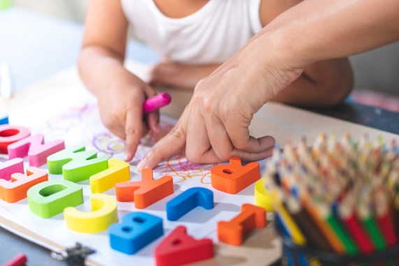
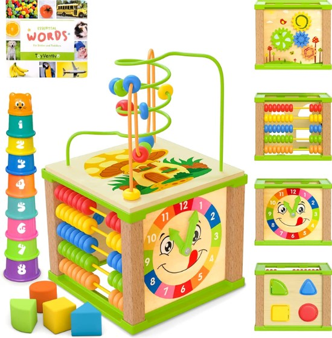
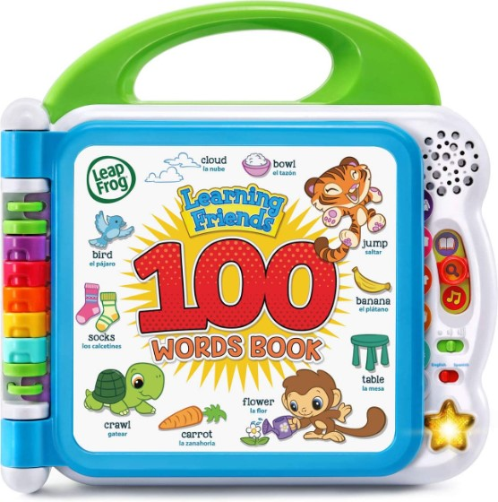
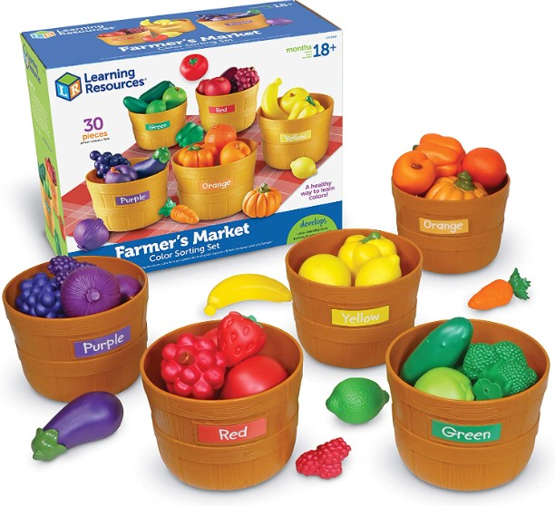
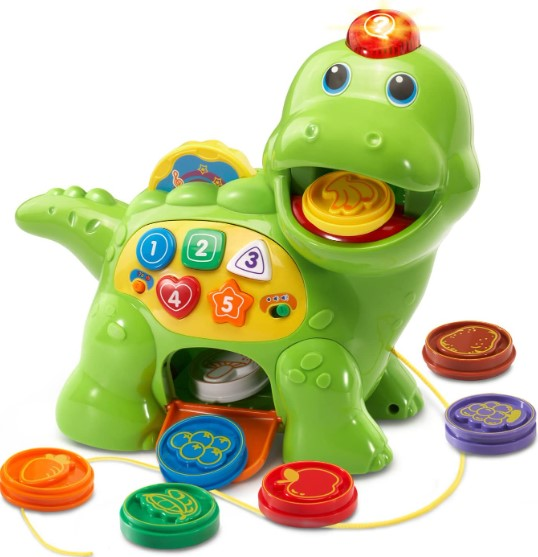
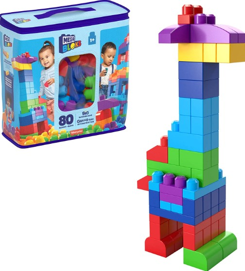
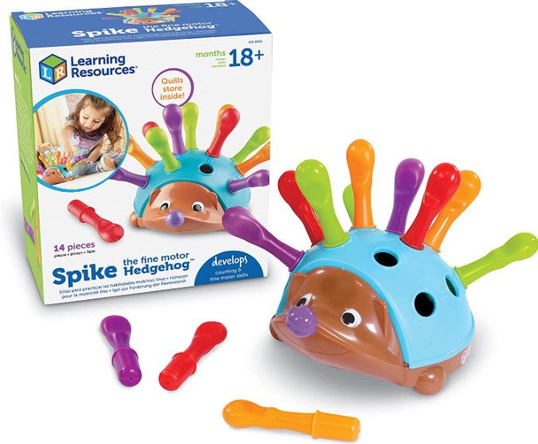

This article has been written and researched by our expert Loveable through a precise methodology. [Learn more about our methodology](https://avada.io/loveable/our-methodological.html)

[Loveable](https://avada.io/loveable/) > [Blog](https://avada.io/loveable/blog/) > [Parenting](https://avada.io/loveable/parenting/)

# 13 Fun and Stimulating Activities for 18-Month-Olds That They Will Enjoy

Written by [Benjamin Collins](https://avada.io/loveable/author/benjamin/) Last Updated on August 28, 2023

- [13 Engaging Activities for 18-Month-Olds](https://avada.io/loveable/blog/activities-for-18-month-olds/#wp-block-heading-2-4)
    - [1\. Doodle Fun with Chalk](https://avada.io/loveable/blog/activities-for-18-month-olds/#wp-block-heading-3-5)
    - [2\. Spice It up](https://avada.io/loveable/blog/activities-for-18-month-olds/#wp-block-heading-3-9)
    - [3\. Dance with Them](https://avada.io/loveable/blog/activities-for-18-month-olds/#wp-block-heading-3-12) 
    - [4\. Pool of flowers](https://avada.io/loveable/blog/activities-for-18-month-olds/#wp-block-heading-3-16)
    - [5\. Walking outdoor](https://avada.io/loveable/blog/activities-for-18-month-olds/#wp-block-heading-3-19)
    - [6\. Feather Blowing](https://avada.io/loveable/blog/activities-for-18-month-olds/#wp-block-heading-3-22)
    - [7\. Play with Shape Block](https://avada.io/loveable/blog/activities-for-18-month-olds/#wp-block-heading-3-26) 
    - [8\. Sort Colors in Muffin Tins](https://avada.io/loveable/blog/activities-for-18-month-olds/#wp-block-heading-3-29)
    - [9\. Learn Letter](https://avada.io/loveable/blog/activities-for-18-month-olds/#wp-block-heading-3-32) 
    - [10\. Pom-Pom Drop](https://avada.io/loveable/blog/activities-for-18-month-olds/#wp-block-heading-3-36) 
    - [11\. Hang with other Toddlers](https://avada.io/loveable/blog/activities-for-18-month-olds/#wp-block-heading-3-39)
    - [12\. Read the Book Together](https://avada.io/loveable/blog/activities-for-18-month-olds/#wp-block-heading-3-43) 
    - [13\. Play with Water in the BathTub](https://avada.io/loveable/blog/activities-for-18-month-olds/#wp-block-heading-3-47) 
- [6 Best Toys For 18-Month-Old That They’ll Love](https://avada.io/loveable/blog/activities-for-18-month-olds/#wp-block-heading-2-50) 
- [FAQ Activities for 18-Month-Olds](https://avada.io/loveable/blog/activities-for-18-month-olds/#wp-block-heading-2-74)
    - [1\. What should an 18-month-old be playing with?](https://avada.io/loveable/blog/activities-for-18-month-olds/#wp-block-heading-3-76)
    - [2\. How do I keep my 18-month-old at home busy?](https://avada.io/loveable/blog/activities-for-18-month-olds/#wp-block-heading-3-82)
    - [3\. What keeps an 18-month-old busy?](https://avada.io/loveable/blog/activities-for-18-month-olds/#wp-block-heading-3-84)
- [Bottom Line](https://avada.io/loveable/blog/activities-for-18-month-olds/#wp-block-heading-2-89)

Enter a world of wonder and excitement as we uncover a treasure trove of 13 exciting and engaging **activities for 18-month-olds**. These inquisitive explorers have an insatiable desire to learn about and interact with the world around them. Prepare to go on an adventure filled with laughter and limitless possibilities as we explore the world of activities meant to thrill your 18-month-old.

With these carefully chosen activities, you can spark your child’s creativity while also nurturing their cognitive, physical, and social abilities. Each activity is designed to deliver a great combination of pleasure and educational value. Keep an eye out for your child’s eyes to light up with delight and wonder as they explore and discover new things.

Come along with us as we explore a world of sensory play, imaginative adventures, and hands-on discovery. These activities will not only keep your 18-month-old entertained but will also create a solid basis for their future growth and development. Prepare to make memorable memories and see the great milestones your child will reach along the journey. Let the fun begin as we discover the delights of 18-month-old activities together.

## **13 Engaging Activities for 18-Month-Olds**

### **1\. Doodle Fun with Chalk**

As they create creative creations on the sidewalk, watch their eyes light up enthusiastically. Their ingenuity has no limitations, from squiggly lines to big forms! 

Allow their small hands to glide across the surface, producing a path of brilliant hues to bring their artwork to life. Expect numerous laughter and proud moments as they proudly show off their chalky masterpieces to anybody who would look. 

### **2\. Spice It up**

Introduce your child to the world of spices and watch their curiosity grow. Allow them to feel the textures, smell the tantalizing aromas, and even taste a pinch (under strict supervision, of course!). 

Each spice, from the warmth of cinnamon to the zing of ginger, will arouse their senses and provide a sensory encounter unlike any other. Allow children to sprinkle, pour, and combine the spices, allowing their imaginations to run wild. 

### **3\. Dance with Them** 

Prepare to groove and dance the day away with your energetic 18-month-old! Put on some lively music and let the rhythm take over. Take your child’s hand in yours and sway, whirl, and boogie together. 

Feel the excitement in their laughter and smiles as they discover the power of movement. Encourage them to experiment with their own unique dancing moves.

### **4\. Pool of flowers**

Fill a small container with fresh flower petals to create a sensory wonderland, allowing your child to immerse themselves in a sensory experience unlike any other. Encourage them to gather handfuls of petals and rain them down like a lovely floral shower. 

They might even start arranging the petals, creating their own pieces of beauty. It’s a genuinely amazing experience that will captivate both you and your child with the beauty of nature. 

### **5\. Walking outdoor**

You’ll go on a [family outdoor together](https://avada.io/loveable/family-outdoor-activities/), enveloped in nature’s splendor, hand in hand. Their small feet will discover the smoothness of the grass and bask in the sun’s warm embrace with each stride. 

Their coordination and balance will improve as they toddle along, promoting their physical growth. Engage in lighthearted conversation, pointing out the delights that surround you, and watch their delight burst forth in cute babbles and giggles. 

### **6\. Feather Blowing**

Take a light feather in their hands and enjoy the thrill of its delicate beauty. Release the feather into the air with a soft breath and watch it dance and spin, defying gravity. 

The astonishment and delight in your child’s eyes as they watch the feather fly gracefully will be priceless. As kids find their own capacity to generate movement and whimsy, each exhalation becomes a wonderful moment. 

### **7\. Play with Shape Block** 

Allow them to grasp the brightly colored blocks in their little hands, feeling the silky texture and examining the various forms. As they learn to organize the blocks, they discover how they fit together like jigsaw pieces. 

Their confidence and problem-solving ability grow with each successful production. The options are unlimited, from erecting buildings to basic constructions. Witness their delight as they destroy their masterpiece, just to rebuild it with infinite excitement. 

### **8\. Sort Colors in Muffin Tins**

Transform a basic baking item into a tool for learning and entertainment. Place a variety of bright things, like buttons, pom-poms, or toy blocks, in distinct divisions of the muffin tray. 

Encourage your child to investigate the brilliant hues and distinguish between them.  Take a minute to admire their focus and perseverance as they finish each sorting assignment. This interactive playtime not only excites their senses but also helps them develop organizing and problem-solving skills.

### **9\. Learn Letter** 

Use colorful alphabet blocks to introduce kids to the magical world of letters. Guide their small fingers to trace the letters’ curves while you sit together, assisting them in associating the visual representation with its matching sound. Make it a game by encouraging children to identify certain letters. 

Their faces gleam with satisfaction and success as they recognize and name the letters. Their phonemic awareness and letter identification abilities improve as their language skills develop, creating a solid foundation for future reading and writing success. 

### **10\. Pom-Pom Drop** 

Make a basic play station out of everyday items like cardboard tubes and a container. Show your toddler how to drop colored pom-poms down the tubes and watch them fall into the container below in awe. 

Let your child’s imagination go wild as they investigate cause-and-effect links – a fascinating and joyous journey of self-discovery. Your child will have fun while learning and growing with this fascinating exercise.

### **11\. Hang with other Toddlers**

These encounters, whether through playdates, parent-child groups, or toddler-friendly workshops, provide essential learning and socializing opportunities. When your child interacts with their friends, their face will light up with excitement. Being around other toddlers exposes them to various personalities, opinions, and ways of playing, which helps to develop their emotional intelligence and empathy. 

So, provide a welcoming atmosphere for your 18-month-old to socialize, have fun, and flourish in the company of other toddlers. It’s a lovely path of growth, connection, and shared experiences that will help them evolve as individuals.

### **12\. Read the Book Together** 

One of the most enriching activities for your 18-month-old is reading books together. Take a seat and enter the beautiful world of storytelling. Bring children to engage with the tale by pointing to photos and describing the people and settings. 

Allow their small fingers to touch and feel the textures as they discover the fun of flipping each page together. You will see their increasing linguistic understanding and capacity to identify things and characters as you read. It’s a wonderful bonding experience that fosters cherished memories and deepens the parent-child tie. 

### **13\. Play with Water in the BathTub** 

Fill the tub with warm water and let your little one explore different water activities.  Encourage them to splash, swirl, and make waves, turning bath time into a playful experience. You can also introduce water-safe bath toys to add an extra element of fun. 

As they explore and interact with water, they develop their sensory awareness, improve their hand dexterity, and strengthen their cognitive abilities. Get ready for some splashing fun with your 18-month-old in the bathtub! 

## **6 Best Toys For 18-Month-Old That They’ll Love** 

**1\.** [**Wooden Kids Baby Activity Cube**](https://www.amazon.com/Spunky-Kinder-Wooden-Kids-Activity/dp/B07NCQ1Z1C/r)

Looking for the ideal present for your 18-month-old? Wooden Kids Baby Activity Cube is an absolute must-have. This toy is great for toddlers because it provides entertainment and learning hours. It comes in a lovely blue gift box and includes a fully outfitted toddler activity play cube, additional stacking cups, and an essential words board book.

It is made of sturdy wood and coated with non-toxic, water-based paint to ensure longevity and safety. It delivers hours of amusement while boosting your child’s growth by combining five different activities in one compact design: a wooden bead labyrinth, abacus, spinning gears, learning clock, and shape sorter.

**2\.** [**Learning Friends 100 Words Book**](https://www.amazon.com/LeapFrog-Learning-Friends-Frustration-Packaging/dp/B07CCFDZZ3)

Children will study word categories like animals, food, colors, and more with their charming learning buddies Turtle, Tiger, and Monkey. They will learn new languages, sound effects, and amusing information by touching the words on the pages. This interesting book also includes two theme songs, which add to the thrill and delight of learning.

**3\.** [**Learning Resources Farmer’s Market Color Sorting Set**](https://www.amazon.com/Learning-Resources-Farmers-Market-Sorting/dp/B006RQ8TY0/)

This set contains realistic play food in vibrant colors as well as color-coordinated baskets. Children may learn about different colors, shapes, and sorting ideas via hands-on play. This set’s sturdy design ensures long-lasting enjoyment and educational value for young children.

Parents and caregivers may consider getting their kids the Farmer’s Market Color Sorting Set since it provides a lively and interactive learning experience. This toy encourages cognitive growth, problem-solving, and hand-eye coordination. 

**4\.** [**Chomp and Count Dino**](https://www.amazon.com/VTech-Chomp-and-Count-Dino/dp/B00K89KFX0)

This lovely dinosaur toy recognizes and responds to eight brilliantly colored food pieces, offering entertaining replies while your kid feeds it. It exposes colors, meals, shapes, and numbers through its many play modes, making learning a fun experience.

It delivers an immersive learning environment with over 130 tunes, melodies, noises, and phrases. As kids answer the dinosaur’s inquiries with the appropriate food pieces, the interactive aspect of this toy fosters active engagement and problem-solving. 

**5\.** [**BLOKS Fisher-Price Toddler Block Toys**](https://www.amazon.com/80-piece-Building-Toddler-Storage-Toddlers/dp/B007GE75HY/)

With 80 large, durable construction blocks, this kit provides infinite opportunities for imaginative play and learning. The blocks are compatible with all MEGA BLOKS building toys. The set also comes with a reusable storage bag, making cleanup quick and easy.

These blocks are the most popular preschool building toy in the United States, confirming its high quality and popularity. Furthermore, these blocks are approved by Fisher-Price, a known brand in early childhood development, and provide a safe and informative playtime experience. 

**6\.** [**Learning Resources Spike The Fine Motor Hedgehog**](https://www.amazon.com/Learning-Resources-Spike-Hedgehog-Sensory/dp/B078WM314M/)

For additional play and learning possibilities, the package includes a 2-piece hedgehog, 12 quills, and an activity guide. This toddler toy has easy-to-grasp components that are appropriate for little hands, making it an excellent choice for toddlers and preschoolers. 

The toy is inclusive since visually challenged kids may play with it, offering sensory stimulation and encouraging tactile exploration. If you want to gift a meaningful and instructive toy for children, this toy is an excellent choice for any occasion.

## **FAQ Activities for 18-Month-Olds**

### **1\. What should an 18-month-old be playing with?**

At 18 months, it is vital that children participate in age-appropriate play activities. To assist their growth, they can play with a range of toys and engage in various sorts of play. 

- Shape sorters and puzzles are interactive toys that assist children in improving their fine motor skills and problem-solving ability. 
- Playing with dolls or toy automobiles fosters imagination and social development. 
- Sensory play with textured toys or sensory bins stimulates their senses and helps them grow cognitively. 
- Reading books together promotes language development and increases vocabulary.

### **2\. How do I keep my 18-month-old at home busy?**

To keep your 18-month-olds busy at home, it’s crucial to provide them with a range of activities. Always make them busy with the list of activities for 18-month-olds above. Remember to follow their lead and adapt activities based on their interests and developmental needs. You can ensure your little one stays busy and happy at home with various engaging options.

### **3\. What keeps an 18-month-old busy?**

You can think about the toys we mentioned above to support their playtime. It will take a long time for them to discover their functions. They will be bored with them after playing for a while, so preparing some is not a bad idea. 

_**See More:**_

- 15 [Games to Play with a Ball for Kids](https://avada.io/loveable/blog/games-to-play-with-a-ball/)

- Engaging [Educational Activities](https://avada.io/loveable/blog/engaging-educational-activities/) For Kids And Students

## **Bottom Line**

Delight your kids with our carefully curated blog of **13 Fun and Stimulating Activities for 18-Month-Olds**. These activities are customized to their developmental needs, ensuring that kids have a great time while learning and growing. You may create unforgettable moments of play and discovery with your child by engaging in these activities. 

Furthermore, investing in these age-appropriate toys and materials gives your child unlimited enjoyment and aids in their general growth and learning. So, why delay? Explore our product line to create memorable moments of delight and progress with your 18-month-old. 

Make the most of this particular stage in your child’s life and embark on a journey of exploration and joy together. These activities will not only entertain but also contribute to their overall development and well-being. Get started with these exciting activities today!

- [13 Engaging Activities for 18-Month-Olds](https://avada.io/loveable/blog/activities-for-18-month-olds/#wp-block-heading-2-4)
    - [1\. Doodle Fun with Chalk](https://avada.io/loveable/blog/activities-for-18-month-olds/#wp-block-heading-3-5)
    - [2\. Spice It up](https://avada.io/loveable/blog/activities-for-18-month-olds/#wp-block-heading-3-9)
    - [3\. Dance with Them](https://avada.io/loveable/blog/activities-for-18-month-olds/#wp-block-heading-3-12) 
    - [4\. Pool of flowers](https://avada.io/loveable/blog/activities-for-18-month-olds/#wp-block-heading-3-16)
    - [5\. Walking outdoor](https://avada.io/loveable/blog/activities-for-18-month-olds/#wp-block-heading-3-19)
    - [6\. Feather Blowing](https://avada.io/loveable/blog/activities-for-18-month-olds/#wp-block-heading-3-22)
    - [7\. Play with Shape Block](https://avada.io/loveable/blog/activities-for-18-month-olds/#wp-block-heading-3-26) 
    - [8\. Sort Colors in Muffin Tins](https://avada.io/loveable/blog/activities-for-18-month-olds/#wp-block-heading-3-29)
    - [9\. Learn Letter](https://avada.io/loveable/blog/activities-for-18-month-olds/#wp-block-heading-3-32) 
    - [10\. Pom-Pom Drop](https://avada.io/loveable/blog/activities-for-18-month-olds/#wp-block-heading-3-36) 
    - [11\. Hang with other Toddlers](https://avada.io/loveable/blog/activities-for-18-month-olds/#wp-block-heading-3-39)
    - [12\. Read the Book Together](https://avada.io/loveable/blog/activities-for-18-month-olds/#wp-block-heading-3-43) 
    - [13\. Play with Water in the BathTub](https://avada.io/loveable/blog/activities-for-18-month-olds/#wp-block-heading-3-47) 
- [6 Best Toys For 18-Month-Old That They’ll Love](https://avada.io/loveable/blog/activities-for-18-month-olds/#wp-block-heading-2-50) 
- [FAQ Activities for 18-Month-Olds](https://avada.io/loveable/blog/activities-for-18-month-olds/#wp-block-heading-2-74)
    - [1\. What should an 18-month-old be playing with?](https://avada.io/loveable/blog/activities-for-18-month-olds/#wp-block-heading-3-76)
    - [2\. How do I keep my 18-month-old at home busy?](https://avada.io/loveable/blog/activities-for-18-month-olds/#wp-block-heading-3-82)
    - [3\. What keeps an 18-month-old busy?](https://avada.io/loveable/blog/activities-for-18-month-olds/#wp-block-heading-3-84)
- [Bottom Line](https://avada.io/loveable/blog/activities-for-18-month-olds/#wp-block-heading-2-89)

### [Benjamin Collins](https://avada.io/loveable/author/benjamin/)

I'm Benjamin Collins, a gift ideas creator at Loveable. We specialize in unique and personalized gifts for any occasion. With my honed skills, I recommend gifts tailored to the recipient's personality and interests, whether it's Halloween, Christmas, or any other celebration.

- [Twitter](https://twitter.com/intent/tweet)
- [Facebook](https://www.facebook.com/sharer/sharer.php)
- [instagram](https://avada.io/loveable/blog/activities-for-18-month-olds/)
- [pinterest](https://www.pinterest.com/loveablellc/)

## Related Posts

[

### 79 Heartfelt Missing Mom Quotes for Expressing Love and Longing

](https://avada.io/loveable/blog/missing-mom-quotes/)

[

### Parenting with Depression: Strategies for Coping, Seeking Help, and Building Resilience

](https://avada.io/loveable/blog/parenting-with-depression/)

[

### 100 Empowering Single Mom Quotes: Inspirational Words for Strong Mothers

](https://avada.io/loveable/blog/single-mom-quotes/)

[

### 99+ Heartfelt Quotes And Wishes: Happy Anniversary to Mom and Dad!

](https://avada.io/loveable/blog/quotes-happy-anniversary-mom-dad/)

[

### 5 Ways to Foster a Positive Parent-Teacher Relationship

](https://avada.io/loveable/blog/parent-teacher-relationship/)
