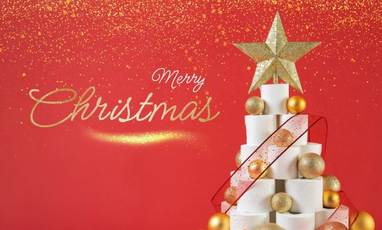
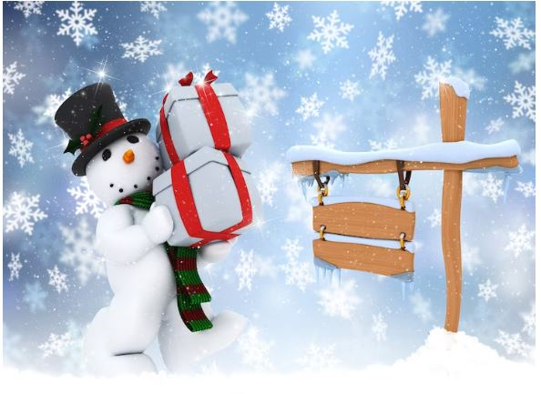

This article has been written and researched by our expert Loveable through a precise methodology. [Learn more about our methodology](https://avada.io/loveable/our-methodological.html)

[Loveable](https://avada.io/loveable/) > [Blog](https://avada.io/loveable/blog/) > [Holiday](https://avada.io/loveable/holiday/)

# 130 Best Christmas Wishes to Spread Festive Cheer on 2023

Written by [Blake Simpson](https://avada.io/loveable/author/blake/) Last Updated on August 21, 2023

- [Popular Christmas Wishes For Family and Friends](https://avada.io/loveable/blog/christmas-wishes/#wp-block-heading-2-3)
- [Funny Christmas Wishes That Make Anyone Giggle](https://avada.io/loveable/blog/christmas-wishes/#wp-block-heading-2-28)
- [Best Religious Christmas Wishes](https://avada.io/loveable/blog/christmas-wishes/#wp-block-heading-2-53)
- [Romantic Christmas Wishes For Couples](https://avada.io/loveable/blog/christmas-wishes/#wp-block-heading-2-78)
- [Famous Quotes About Christmas for Your Beloved Ones](https://avada.io/loveable/blog/christmas-wishes/#wp-block-heading-2-103)
- [Christmas Wishes for Long-Distance Friends](https://avada.io/loveable/blog/christmas-wishes/#wp-block-heading-2-128)
- [In Conclusion,](https://avada.io/loveable/blog/christmas-wishes/#wp-block-heading-2-156)

The holiday season is a time of warmth, joy, and cherished moments with loved ones. As Christmas approaches, the spirit of giving and spreading happiness envelops us all. What better way to share the festive cheer than by sending heartfelt Christmas wishes to those who hold a special place in our hearts? 

From traditional sentiments to modern expressions, we’ve curated a collection of the **130 best Christmas wishes** that capture the essence of this joyous season. Whether you’re looking for the perfect words to include in your holiday cards or simply want to convey your warmest thoughts, these Christmas wishes are sure to inspire your own messages of love and goodwill.

## **Popular Christmas Wishes For Family and Friends**

As we embrace the spirit of Christmas, sending heartfelt wishes becomes a cherished tradition that bridges the gap between hearts and spreads the joy of the festive season. 

Whether you’re crafting a message for a dear friend, a distant relative, or a colleague, these 20 popular Christmas wishes are here to inspire your warm greetings and convey your heartfelt sentiments.

1\. Wishing you a holly jolly Christmas and a New Year filled with blessings.

2\. May your days be merry and bright, and your heart be light this Christmas.

3\. Sending you warm wishes for a joyful and festive holiday season.

4\. May your home be filled with love, laughter, and the magic of Christmas.

5\. Here’s to making wonderful memories and treasuring moments of togetherness.

6\. May the peace and joy of Christmas fill your heart and home.

7\. Wishing you all the happiness your holiday can hold!

8\. Merry Christmas! May your days be merry and your heart be light.

9\. May your Christmas be wrapped in happiness and tied with love.

10\. Warmest wishes for a season of cheer and a Happy New Year!

11\. Sending you love, joy, and all the best this holiday season.

12\. May your Christmas be merry and your New Year be bright.

13\. Hoping your holidays are filled with love, laughter, and endless joy.

14\. May the magic of Christmas bring a smile to your face and warmth to your heart.

15\. Wishing you a season of love, peace, and joy that lasts throughout the year.

16\. May your heart be lifted with the spirit of Christmas and the promise of a new beginning.

17\. Warm wishes for a festive holiday and a year ahead full of dreams come true.

18\. May the beauty of the season fill your life with happiness and your heart with love.

19\. Sending you heartfelt wishes for a Christmas that’s as special as you are.

20\. May the wonder of the holidays surround you with joy and fill your days with warmth.

## **Funny Christmas Wishes That Make Anyone Giggle**

Amidst the hustle and bustle of the holiday season, a touch of laughter can be the perfect ingredient to make Christmas even merrier. Sharing funny Christmas wishes is a delightful way to bring smiles and chuckles to the faces of your friends, family, and loved ones.

So, as you wrap your gifts and deck the halls, don’t forget to sprinkle some humor into your holiday greetings. Here are 20 light-hearted and funny Christmas wishes that are sure to add an extra dose of joy to your festivities.

1\. Hope your holiday season is more “ho ho ho” than “no no no”!

2\. Wishing you an eggnog-fueled, laughter-filled, and cookie-covered Christmas!

3\. May your Christmas be filled with joy, laughter, and just the right amount of fruitcake.

4\. Forget about the calories and indulge in some serious holiday merriment!

5\. May your days be merry and your holiday fruitcakes stay uneaten.

6\. Wishing you a Christmas as lit as your neighbor’s over-the-top decorations!

7\. May your days be full of holiday cheer and your online shopping carts be ever-growing.

8\. Cheers to surviving another year of awkward family photos and questionable fashion choices!

9\. May your Christmas sweaters be tacky and your family gatherings be wacky!

10\. Here’s to hoping your holiday wish list gets better reception than your Wi-Fi!

11\. May your days be merry and your relatives be quirky (in the best way, of course!).

12\. Wishing you a holiday season so bright, it outshines even the tackiest Christmas lights.

13\. May your eggnog be spiked and your spirits be high this holiday season!

14\. Sending warm wishes and cold eggnog – because balance is key during the holidays.

15\. May your holiday season be filled with joy, laughter, and minimal fruitcake consumption.

16\. Wishing you a Christmas filled with love, laughter, and an impressive talent for regifting.

17\. May your Christmas be as joyful as a kid on December 26th (aka the day after Christmas!).

18\. Here’s to a holiday season full of good food, good company, and zero awkward conversations.

19\. Wishing you a Christmas that’s “ho ho hilarious” and “fa la la fabulously funny”!

20\. May your holiday festivities be so epic that they become the stuff of family legend!

## **Best Religious Christmas Wishes**

As we gather to celebrate the birth of Jesus Christ, the true meaning of Christmas shines brightly in our hearts. For those who find solace and inspiration in their faith, sending religious Christmas wishes is a beautiful way to share the blessings and joy of this sacred season.

These heartfelt messages convey not only warm greetings but also the profound significance of Christ’s birth. Join us in embracing the spirit of devotion and love with these 20 touching religious Christmas wishes, perfect for expressing your faith and spreading the message of hope and salvation.

1\. May the miracle of Christ’s birth bring you peace, love, and eternal happiness.

2\. Rejoice in the gift of God’s Son and the salvation He brings. Merry Christmas!

3\. May the light of Christ’s love shine brightly in your heart this Christmas and always.

4\. Wishing you a blessed Christmas filled with the presence of Jesus and the warmth of His love.

5\. As we celebrate the Savior’s birth, may His grace and mercy fill your life abundantly.

6\. May the joy of Christ’s nativity fill your home with love, laughter, and divine blessings.

7\. Rejoice in the miracle of Christmas, for through Christ, we find hope and redemption.

8\. May the baby Jesus bring you comfort, strength, and unwavering faith this holy season.

9\. Let the spirit of Christmas remind us of God’s great love and His perfect plan for us.

10\. May the peace that Christ brings guide your path and fill your heart with serenity.

11\. Celebrate the birth of our Savior with a heart full of gratitude and a soul filled with praise.

12\. May the message of Christmas remind us to spread love, kindness, and compassion to all.

13\. In the humble manger, we find the King of Kings. May His presence bless your Christmas.

14\. Rejoice in the promise of salvation as we honor the birth of Jesus Christ, our Lord.

15\. May the joy of Christ’s coming fill your heart with gratitude and your life with purpose.

16\. As we celebrate Christ’s birth, may His light guide us through life’s journey with unwavering faith.

17\. May the blessings of Christmas bring you closer to God’s love and everlasting grace.

18\. Let us rejoice in the greatest gift of all – the birth of Jesus, who offers us eternal life.

19\. May your Christmas be a reflection of God’s boundless love and a testament to His faithfulness.

20\. In the miracle of Christ’s birth, we find hope, love, and the promise of salvation. Rejoice!

## **Romantic Christmas Wishes For Couples**

Amidst the twinkle of lights and the enchanting holiday melodies, Christmas offers a wonderful opportunity to express your deepest feelings of love and affection to that special someone in your life. Whether it’s a long-time partner, a new flame, or a secret crush, romantic Christmas wishes have the power to create moments of intimacy and warmth. 

Let the magic of the season inspire you to share your heartfelt emotions and kindle the flames of romance. Here are 20 tender and romantic Christmas wishes that will make your loved one’s heart skip a beat and fill your holiday with even more love and joy.

1\. This Christmas, I wish for snowflakes to fall gently around us as we share cozy moments by the fireplace.

2\. As the world is blanketed in snow, my heart is wrapped in the warmth of your love. Merry Christmas, my dear.

3\. May our love shine as brightly as the stars on this magical Christmas night. You’re my forever light.

4\. Underneath the mistletoe, let’s seal our love with a kiss and make this holiday unforgettable.

5\. My Christmas wish is simple: to hold you close, to cherish our moments, and to love you more each day.

6\. Like the ornaments on the tree, you bring beauty and joy into my life. Wishing you a romantic Christmas.

7\. This holiday season, my heart beats to the rhythm of our love, and every note is a melody of happiness.

8\. Through the snowflakes and carolers, I see only you – my love, my joy, my Christmas delight.

9\. As the snow falls softly, my love for you grows stronger. You are my winter’s warmth and my heart’s desire.

10\. Let’s make this Christmas unforgettable with laughter, love, and the promise of a future filled with happiness.

11\. In the soft glow of Christmas lights, I see the reflection of our love – beautiful, warm, and eternal.

12\. This Christmas, I give you the gift of my heart, wrapped in love and tied with the ribbons of devotion.

13\. Your presence is the best present I could ever wish for. Wishing you a holiday season full of love and joy.

14\. As we exchange gifts, know that your love is the most precious treasure I could ever receive.

15\. This holiday season, I want to snuggle up with you and create memories that will warm our hearts forever.

16\. With you by my side, every day feels like a holiday. Here’s to celebrating our love this Christmas and always.

17\. Let’s make this season of giving about giving our hearts to each other. You have mine completely.

18\. In the story of our love, Christmas is the chapter where our hearts intertwine and create a beautiful tale.

19\. As we celebrate Christmas, my love for you grows stronger, deeper, and more enchanting.

20\. Wrapped in your arms, I find the greatest comfort and joy. Wishing you a Christmas filled with our love.

## **Famous Quotes About Christmas for Your Beloved Ones**

Christmas, a time of love, giving, and celebration, has inspired countless words of wisdom and reflection from some of the world’s greatest thinkers, writers, and personalities. These famous quotes capture the essence of the holiday season, from the joy of giving to the spirit of togetherness. 

As we embrace the warmth and magic of Christmas, let these renowned quotes remind us of the profound meanings behind this festive time. Here are 20 timeless and famous quotes about Christmas that beautifully encapsulate the spirit and sentiments of the season.

1\. “Christmas waves a magic wand over this world, and behold, everything is softer and more beautiful.” – Norman Vincent Peale

2\. “The best of all gifts around any Christmas tree: the presence of a happy family all wrapped up in each other.” – Burton Hillis

3\. “Christmas is not a time nor a season, but a state of mind. To cherish peace and goodwill, to be plenteous in mercy, is to have the real spirit of Christmas.” – Calvin Coolidge

4\. “Christmas is doing a little something extra for someone.” – Charles M. Schulz

5\. “Our hearts grow tender with childhood memories and love of kindred, and we are better throughout the year for having, in spirit, become a child again at Christmastime.” – Laura Ingalls Wilder

6\. “Christmas is the spirit of giving without a thought of getting. It is happiness because we see joy in people. It is forgetting self and finding time for others.” – Thomas S. Monson

7\. “Christmas isn’t a season. It’s a feeling.” – Edna Ferber

8\. “I will honor Christmas in my heart, and try to keep it all the year.” – Charles Dickens, “A Christmas Carol”

9\. “The best way to spread Christmas cheer is singing loud for all to hear.” – Will Ferrell, “Elf”

10\. “Christmas, my child, is love in action. Every time we love, every time we give, it’s Christmas.” – Dale Evans

11\. “Christmas is the day that holds all time together.” – Alexander Smith

12\. “Blessed is the season which engages the whole world in a conspiracy of love.” – Hamilton Wright Mabie

13\. “Christmas will always be as long as we stand heart to heart and hand in hand.” – Dr. Seuss

14\. “Christmas is a season not only of rejoicing but of reflection.” – Winston Churchill

15\. “Christmas is the day that holds all time together.” – Alexander Smith

16\. “The joy of brightening other lives, bearing each other’s burdens, easing others’ loads and supplanting empty hearts and lives with generous gifts becomes for us the magic of Christmas.” – W. C. Jones

17\. “He who has not Christmas in his heart will never find it under a tree.” – Roy L. Smith

18\. “Christmas is the keeping-place for memories of our innocence.” – Joan Mills

19\. “Christmas is not just a time for festivity and merry making. It is more than that. It is a time for the contemplation of eternal things.” – Calvin Coolidge

20\. “Christmas is a necessity. There has to be at least one day of the year to remind us that we’re here for something else besides ourselves.” – Eric Sevareid

## **Christmas Wishes for Long-Distance Friends**

Even when miles apart, the bond of friendship remains unbreakable, especially during the heartwarming season of Christmas. When cherished friends are scattered across the map, sending heartfelt wishes becomes a way to bridge the distance and share in the festive spirit. 

These Christmas wishes for long-distance friends are a testament to the enduring connections that time and space cannot diminish. Reach out to your faraway companions with these 20 warm and heartfelt messages, reminding them that no matter the distance, your friendship is a gift that keeps on giving.

1\. Though we’re far apart, my thoughts of you are never distant. Wishing you a magical Christmas filled with joy and love.

2\. Across the miles, our friendship shines as brightly as the holiday lights. Merry Christmas, my dear friend!

3\. Even though we can’t be together, know that you’re always close in my heart. Wishing you a joyful and memorable Christmas.

4\. Sending warm holiday wishes across the miles, wrapped in the ribbon of our everlasting friendship.

5\. Though we’re separated by distance, our bond is as strong as ever. May your Christmas be as wonderful as our friendship.

6\. As the snow falls and the carolers sing, I’m sending you my warmest Christmas wishes from afar.

7\. Even though we can’t clink glasses in person, here’s to a virtual toast to our incredible friendship. Merry Christmas!

8\. No distance can diminish the warmth of our friendship. Wishing you a Christmas season filled with happiness and love.

9\. May the magic of Christmas surround you and bring you comfort, knowing that our friendship is a constant source of joy.

10\. From miles away, I’m sending you a sleigh-load of love, laughter, and best wishes for a Merry Christmas.

11\. The miles may separate us, but our hearts are forever intertwined. Wishing you a holiday season filled with wonder and delight.

12\. Our friendship is a gift that even distance can’t unwrap. May your Christmas be as special as the memories we share.

13\. Though the roads between us are long, the path of our friendship is always well-trodden. Merry Christmas, my faraway friend.

14\. Time zones may keep us apart, but our friendship defies the constraints of geography. Have a magical Christmas!

15\. Sending you a blizzard of Christmas joy, even though we’re miles away. May your holidays be truly unforgettable.

16\. As the holiday lights twinkle, remember that our friendship shines just as brightly, no matter the miles that separate us.

17\. Across the miles, I’m sending you warm hugs and best wishes for a Christmas season that’s as wonderful as you are.

18\. Even though we’re apart this Christmas, you’re always in my thoughts and prayers. Wishing you a blessed and joyful holiday.

19\. Through the screens and the distance, our connection remains unbreakable. May your Christmas be filled with love and laughter.

20\. The magic of Christmas knows no boundaries, just like our friendship. Wishing you a season filled with happiness and togetherness in spirit.

**_See More:_**

- Best [Christmas Gifts Under $25](https://avada.io/loveable/christmas-gifts-under-%2425/)

- Best [Personalized Christmas Cards](https://avada.io/loveable/personalized-christmas-cards/)

## **In Conclusion,**

May the **130 best Christmas wishes** we’ve shared here help you brighten someone’s day, kindle the festive spirit, and create lasting memories that warm the soul for years to come. Embrace the magic of the season, and may your holiday celebrations be filled with laughter, love, and the beauty of shared wishes. Merry Christmas to you and yours!

- [Popular Christmas Wishes For Family and Friends](https://avada.io/loveable/blog/christmas-wishes/#wp-block-heading-2-3)
- [Funny Christmas Wishes That Make Anyone Giggle](https://avada.io/loveable/blog/christmas-wishes/#wp-block-heading-2-28)
- [Best Religious Christmas Wishes](https://avada.io/loveable/blog/christmas-wishes/#wp-block-heading-2-53)
- [Romantic Christmas Wishes For Couples](https://avada.io/loveable/blog/christmas-wishes/#wp-block-heading-2-78)
- [Famous Quotes About Christmas for Your Beloved Ones](https://avada.io/loveable/blog/christmas-wishes/#wp-block-heading-2-103)
- [Christmas Wishes for Long-Distance Friends](https://avada.io/loveable/blog/christmas-wishes/#wp-block-heading-2-128)
- [In Conclusion,](https://avada.io/loveable/blog/christmas-wishes/#wp-block-heading-2-156)

### [Blake Simpson](https://avada.io/loveable/author/blake/)

Hi, I'm Blake from Loveable. I help people find perfect gifts for occasions like anniversaries and weddings. I also write a blog about holidays, sharing insights to make them more meaningful. Let's create unforgettable moments together!

- [Twitter](https://twitter.com/intent/tweet)
- [Facebook](https://www.facebook.com/sharer/sharer.php)
- [instagram](https://avada.io/loveable/blog/christmas-wishes/)
- [pinterest](https://www.pinterest.com/loveablellc/)

## Related Posts

[### 120+ Christian Birthday Wishes To Spread Your Love](https://avada.io/loveable/blog/christian-birthday-wishes/) 

[

### 35 Best 70th Birthday Ideas To Celebrate The Special Milestone

](https://avada.io/loveable/blog/70th-birthday-ideas/)

[

### 50 Best 30th Birthday Decorations for a Remarkable Birthday Bash

](https://avada.io/loveable/blog/30th-birthday-decorations/)

[

### 40 Delicious Vegan Christmas Desserts to Delight Your Palate

](https://avada.io/loveable/blog/vegan-christmas-desserts/)

[

### 60 Christmas Team Building Activities to Boost Workplace Spirit

](https://avada.io/loveable/blog/christmas-team-building-activities/)
