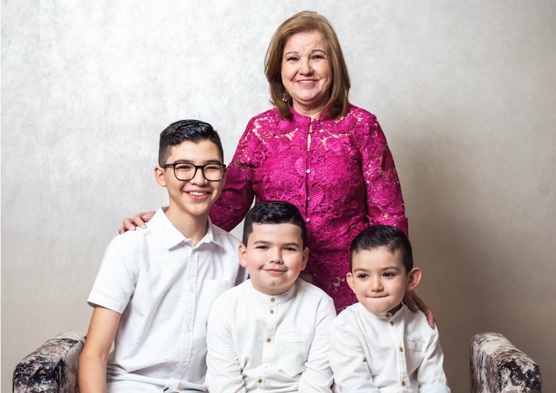
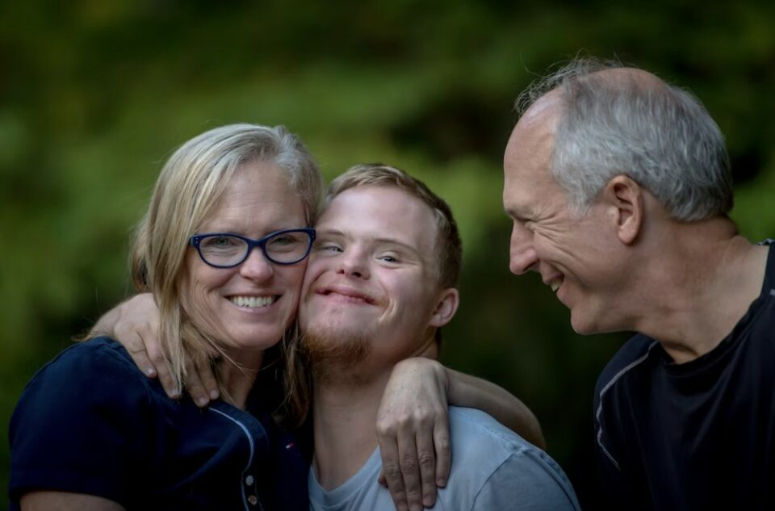
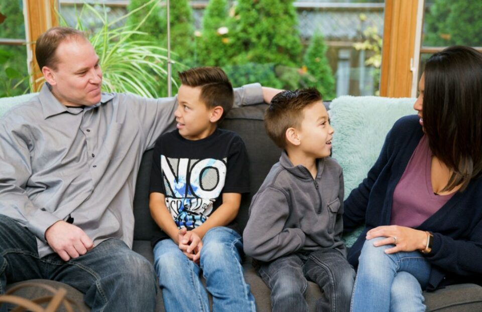

This article has been written and researched by our expert Loveable through a precise methodology. [Learn more about our methodology](https://avada.io/loveable/our-methodological.html)

[Loveable](https://avada.io/loveable/) > [Blog](https://avada.io/loveable/blog/) > [Family](https://avada.io/loveable/family/)

# 14 Common Blended Family Issues And How To Fix Them 

Written by [Rose Bryne](https://avada.io/loveable/author/rose/) Last Updated on August 21, 2023

- [14 Common Blended Family Issues and How to Fix Them Right](https://avada.io/loveable/blog/common-blended-family-issues/#wp-block-heading-2-4) 
    - [1\. Sibling Rivalry](https://avada.io/loveable/blog/common-blended-family-issues/#wp-block-heading-3-5)
    - [2\. Legal Disputes](https://avada.io/loveable/blog/common-blended-family-issues/#wp-block-heading-3-9)
    - [3\. Not Realizing That Your Ex Is Also a Part of Family](https://avada.io/loveable/blog/common-blended-family-issues/#wp-block-heading-3-12)
    - [4\. Not Getting Ready for The World Outside](https://avada.io/loveable/blog/common-blended-family-issues/#wp-block-heading-3-16)
    - [5\. Not Seeing How Hard It Is to Become a Parent](https://avada.io/loveable/blog/common-blended-family-issues/#wp-block-heading-3-19)
    - [6\. Not Getting That Your Family Will Be Different](https://avada.io/loveable/blog/common-blended-family-issues/#wp-block-heading-3-23)
    - [7\. Financial Problems](https://avada.io/loveable/blog/common-blended-family-issues/#wp-block-heading-3-26) 
    - [8\. Being on Different Pages](https://avada.io/loveable/blog/common-blended-family-issues/#wp-block-heading-3-30)
    - [9\. Getting Used to a New Schedule](https://avada.io/loveable/blog/common-blended-family-issues/#wp-block-heading-3-33)
    - [10\. Not Giving Each Child Enough Attention](https://avada.io/loveable/blog/common-blended-family-issues/#wp-block-heading-3-37)
    - [11\. Identity Confusion](https://avada.io/loveable/blog/common-blended-family-issues/#wp-block-heading-3-41)
    - [12\. Visitation and Parenting Plans](https://avada.io/loveable/blog/common-blended-family-issues/#wp-block-heading-3-45)
    - [13\. Don’t Let Your Partner Raise Your Kids](https://avada.io/loveable/blog/common-blended-family-issues/#wp-block-heading-3-48)
    - [14\. Not Realising That You Have To Work for It](https://avada.io/loveable/blog/common-blended-family-issues/#wp-block-heading-3-51)
- [5 Bonus Tips to Strengthen Blended-Family Bond](https://avada.io/loveable/blog/common-blended-family-issues/#wp-block-heading-2-54) 
    - [1\. Be Respectful](https://avada.io/loveable/blog/common-blended-family-issues/#wp-block-heading-3-55)
    - [2\. Solid Marriage](https://avada.io/loveable/blog/common-blended-family-issues/#wp-block-heading-3-57)
    - [3\. Tell Your Ex-Spouse about Any Changes That Are Coming Up.](https://avada.io/loveable/blog/common-blended-family-issues/#wp-block-heading-3-60)
    - [4\. Keep Important Habits and Traditions Going for Your Kids.](https://avada.io/loveable/blog/common-blended-family-issues/#wp-block-heading-3-63)
    - [5\. Do Not Yet Engage in Parenting Behaviour.](https://avada.io/loveable/blog/common-blended-family-issues/#wp-block-heading-3-66)
- [Bottom Line](https://avada.io/loveable/blog/common-blended-family-issues/#wp-block-heading-2-69) 

Blended families can be a beautiful thing, a coming together of two separate families to create a new, loving home. However, with this merging of households comes a unique set of challenges that can test even the strongest of familial bonds. From differences in parenting styles to conflicting loyalties, blended families must navigate a myriad of issues to establish a sense of harmony and unity.

In this article, we will explore 14 common **blended family issues** and provide actionable tips on how to fix them. Whether you’re a parent, step-parent, or child, these tips will help you navigate the unique challenges of a blended family and build a happy, loving home. From establishing clear communication to creating a sense of belonging for all family members, we’ll cover a range of strategies to help you create a harmonious blended family. And even if you’re a son or daughter, there are many ways to [make your step-parents happy](https://avada.io/loveable/gifts-stepmom/).

So, whether you’re just starting out on your blended family journey or looking to improve an already established family dynamic, this article will provide you with the tools and strategies to overcome the most common blended family issues and build a strong, loving, and united family.

## 14 Common Blended Family Issues and How to Fix Them Right 

### 1\. Sibling Rivalry

In blended families, the issue of sibling competition can become more complex and intensified. While competition between biological siblings is present in all families, it can be particularly bitter when it involves step or non-biological siblings.

To [address children’s rivalry](https://biglifejournal.com/blogs/blog/key-strategies-manage-sibling-rivalry), expect more fighting, yep, encourage self-improvement rather than competition, avoid comparisons, and foster kindness and respect among siblings.

### 2\. Legal Disputes

Blending two families can create legal problems from the original separations. In divorce, the family house may go to one partner, but when a new partner enters the picture, the legal agreements related to the house may need to be modified. Ongoing legal disputes or mediation fees can also result in financial difficulties.

To prepare for increased expenses in your blended family, be proactive and consult with your lawyer for a cost estimate. Adjust your budget accordingly. Furthermore, it’s important to shield your children from legal conflicts.

### 3\. Not Realizing That Your Ex Is Also a Part of Family

Blending a family means embracing new relationships and accepting the past. Your partner’s ex may now be an official part of your family, regardless of the nature of their relationship. Just as your ex may remain a part of your family forever, it’s important to recognize the significance of the ex-partner in your partner’s life and your step-children’s lives.

[Working with your partner’s ex](https://www.vox.com/even-better/23282266/family-ex-boundaries-breakup-relationship-healing) can be challenging, but it’s vital to your family’s overall well-being and your relationship with your step-children. It requires a willingness to communicate effectively, set boundaries, and prioritize the children’s needs above any personal conflicts.

### 4\. Not Getting Ready for The World Outside

As a blended family, you may encounter comments and opinions from others, whether they are family members or strangers. It’s not uncommon for people to inquire about which children are biologically yours or express surprise at the size of your family. Unfortunately, negative comments and judgmental attitudes may also arise.

To tackle this issue, you must have a plan in place for handling these situations. This might involve discussing potential scenarios with your partner and children and deciding on a strategy for responding to comments or questions that are hurtful or inappropriate.

### 5\. Not Seeing How Hard It Is to Become a Parent

Many parents just don’t realize how hard it is to be a parent, especially when you have to take on the responsibility of raising kids that aren’t your own. Sometimes this not only takes effort, but you also have to be very patient, accepting that only time can make things better.

Attempting to replace the other parent or using excessive discipline may not endear you to your child. Therefore, try to have a discussion with your partner regarding your role and responsibilities as a new parent, as well as the significance of entering into a pre-existing family.

### 6\. Not Getting That Your Family Will Be Different

Just because you fit the “textbook” definition of a blended family doesn’t mean your experience will be the same as others. No amount of knowledge will prepare you for the real-life dilemmas that will arise within your unique family dynamic. You’ll encounter situations that no one else has faced before and may feel unsure of how to handle them. 

But fear not; by collaborating with your partner, you can develop a game plan to overcome these obstacles. Although traditional family advice may not suffice, every challenge presents an opportunity to learn and grow, ultimately leading you to create a family that you can be truly proud of.

### 7\. Financial Problems 

Blended families are often brimming with children, which means increased expenses and financial strain. Add legal fees to the mix, and it’s a recipe for a potential financial disaster. But don’t worry; there are active steps you can take to set your family up for success. 

Consider seeking out a financial advisor for guidance, or even turn to trusted friends and family for advice and creative ideas. And if you find yourself struggling to make ends meet due to insufficient child support or excessive alimony payments, don’t hesitate to consult with a lawyer for legal assistance and support. 

### 8\. Being on Different Pages

One common issue in blended families is when parents are not on the same page. This can happen when each parent has different ideas about how to raise the children or how to handle certain situations. It can lead to confusion for the children, inconsistency in discipline, and tension between the parents.

To address this issue, all parties need to acknowledge and accept the role of the ex-partner in the family. This includes acknowledging that the children may have a bond with both parents and that they may still have a relationship with the ex-partner.

### 9\. Getting Used to a New Schedule

Each family has its own unique routine, and blending two families means combining different routines that may not mesh well together. To overcome this challenge, creating a new routine for your blended family is essential. 

Set clear family rules and consequences for breaking them, and make sure everyone can see them. In addition, set new curfews that are fair for all children. While they don’t have to be identical, they should be age-appropriate and similar to reduce arguments and conflicts.

### 10\. Not Giving Each Child Enough Attention

Blending families requires a delicate balance of attention and care for each child within the family. As a parent in a blended family, it’s important to recognize that you share equal responsibility for all the children in your family, just as your partner does.

One effective way to ensure that each child feels valued and loved is to carve out one-on-one time with each of them. This helps to foster a sense of safety, belonging, and trust. Remember that as a stepparent, you have the opportunity to make a positive impact on each child’s life and help them feel welcomed and loved in their new family.

Acknowledge that each child may have unique needs, interests, and personalities. As you spend time with each child, take the time to learn what makes them tick and what brings them joy. This can help you build stronger connections with them and ensure that they feel seen and heard within the family unit.

### 11\. Identity Confusion

When forming a new family, children may face identity issues due to several factors. For example, if their mom and stepdad become the primary caregivers, children may become more attached to their stepdad than their biological dad, leading to confusion. Additionally, if the mother changes her last name to match her new husband’s while the kids keep their last name, it can also create a sense of detachment from the mom and confusion.

To address these potential identity issues, family members must have open and honest conversations with the kids early on, ideally before the blended family is officially formed. By letting them know about possible changes and letting them talk about how they feel, you can help them adjust to the new family dynamic and feel more at ease with it.

### 12\. Visitation and Parenting Plans

When parents have visitation with their child, it can create problems for the family. The child may be used to spending time with both parents without a schedule, but a tight parenting plan can make their life feel less free and open. This can cause stress and confusion for the child as they adjust to the new routine.

Visitation can also lead to scheduling conflicts, which can create tension between the parents. It can be hard for everyone to get used to each other when there are new people in the family. Children may also talk to the parent who doesn’t live with them about their stepparent, which can make a hard situation even worse.

### 13\. Don’t Let Your Partner Raise Your Kids

Becoming a blended family means navigating the complexities of being both a partner and a parent. You may find it challenging to give your partner the space to parent your biological children. Similarly, your partner may struggle with the same issue. 

To prevent negative feelings from arising, try to communicate openly and honestly with each other. Setting healthy boundaries can also help to maintain a harmonious household. 

### 14\. Not Realising That You Have To Work for It

In the early stages, there may be situations where you or your partner are unsure of how to respond. Mistakes may also occur, which is normal as both of you are human. It’s essential to have candid conversations about these instances and remain open to making adjustments as you progress through the blending process. You also need to communicate with the children, especially when errors are made, and discuss how you intend to improve moving forward. 

## 5 Bonus Tips to Strengthen Blended-Family Bond 

### 1\. Be Respectful

Mutual reverence is vital in all relationships, and this extends beyond the children’s attitude toward adults. It’s imperative to acknowledge that as family members, everyone deserves respect, irrespective of their age. After all, blending a family signifies that you are now a unified entity.

### 2\. Solid Marriage

A sturdy marriage serves as the bedrock of any family. Without it, the family structure crumbles. However, maintaining a solid union within a blended family can prove to be quite a challenge. Unlike first marriages, couples in blended families do not have the luxury of time to acclimate to each other’s personalities and quirks. They must navigate the nuances of their relationship while simultaneously raising and guiding their children toward growth and maturity.

### 3\. Tell Your Ex-Spouse about Any Changes That Are Coming Up.

Whenever you’re embarking on a major life transition such as relocation, marriage, or any other significant change that could affect your child, you have to keep the other parent informed.

While there’s no need to divulge every intimate detail, sharing the news beforehand can go a long way in preventing unpleasant surprises and maintaining a healthy co-parenting relationship. It shows that you respect and value their role in your child’s life and can help promote a sense of trust and collaboration between both parents.

### 4\. Keep Important Habits and Traditions Going for Your Kids.

Don’t neglect the important family traditions you have with your kids, even as you build a new family. Keeping up with special moments like after-school park visits and birthday breakfasts can help your children feel more comfortable with the changes.

### 5\. Do Not Yet Engage in Parenting Behaviour.

According to stepfamily specialist and psychologist Patricia Papernow, stepparents should view themselves as adult caretakers rather than actual parents. While they may reinforce existing rules, they shouldn’t have ultimate authority over what is permissible for their stepchildren, particularly in the early stages of the relationship. Being unequivocal about your role can aid children in comprehending how their new family unit operates.

**_Related_**: [71 Best Love And Family Quotes To Share Your Love In 2023](https://avada.io/loveable/family-quotes/)

## Bottom Line 

Remember that blending families can come with its own set of unique challenges, but with patience, communication, and a willingness to work together, you can overcome them. By understanding these common **blended family issues** and utilizing the suggested solutions, you can help create a happy and healthy blended family. Best of luck on your journey together!

- [14 Common Blended Family Issues and How to Fix Them Right](https://avada.io/loveable/blog/common-blended-family-issues/#wp-block-heading-2-4) 
    - [1\. Sibling Rivalry](https://avada.io/loveable/blog/common-blended-family-issues/#wp-block-heading-3-5)
    - [2\. Legal Disputes](https://avada.io/loveable/blog/common-blended-family-issues/#wp-block-heading-3-9)
    - [3\. Not Realizing That Your Ex Is Also a Part of Family](https://avada.io/loveable/blog/common-blended-family-issues/#wp-block-heading-3-12)
    - [4\. Not Getting Ready for The World Outside](https://avada.io/loveable/blog/common-blended-family-issues/#wp-block-heading-3-16)
    - [5\. Not Seeing How Hard It Is to Become a Parent](https://avada.io/loveable/blog/common-blended-family-issues/#wp-block-heading-3-19)
    - [6\. Not Getting That Your Family Will Be Different](https://avada.io/loveable/blog/common-blended-family-issues/#wp-block-heading-3-23)
    - [7\. Financial Problems](https://avada.io/loveable/blog/common-blended-family-issues/#wp-block-heading-3-26) 
    - [8\. Being on Different Pages](https://avada.io/loveable/blog/common-blended-family-issues/#wp-block-heading-3-30)
    - [9\. Getting Used to a New Schedule](https://avada.io/loveable/blog/common-blended-family-issues/#wp-block-heading-3-33)
    - [10\. Not Giving Each Child Enough Attention](https://avada.io/loveable/blog/common-blended-family-issues/#wp-block-heading-3-37)
    - [11\. Identity Confusion](https://avada.io/loveable/blog/common-blended-family-issues/#wp-block-heading-3-41)
    - [12\. Visitation and Parenting Plans](https://avada.io/loveable/blog/common-blended-family-issues/#wp-block-heading-3-45)
    - [13\. Don’t Let Your Partner Raise Your Kids](https://avada.io/loveable/blog/common-blended-family-issues/#wp-block-heading-3-48)
    - [14\. Not Realising That You Have To Work for It](https://avada.io/loveable/blog/common-blended-family-issues/#wp-block-heading-3-51)
- [5 Bonus Tips to Strengthen Blended-Family Bond](https://avada.io/loveable/blog/common-blended-family-issues/#wp-block-heading-2-54) 
    - [1\. Be Respectful](https://avada.io/loveable/blog/common-blended-family-issues/#wp-block-heading-3-55)
    - [2\. Solid Marriage](https://avada.io/loveable/blog/common-blended-family-issues/#wp-block-heading-3-57)
    - [3\. Tell Your Ex-Spouse about Any Changes That Are Coming Up.](https://avada.io/loveable/blog/common-blended-family-issues/#wp-block-heading-3-60)
    - [4\. Keep Important Habits and Traditions Going for Your Kids.](https://avada.io/loveable/blog/common-blended-family-issues/#wp-block-heading-3-63)
    - [5\. Do Not Yet Engage in Parenting Behaviour.](https://avada.io/loveable/blog/common-blended-family-issues/#wp-block-heading-3-66)
- [Bottom Line](https://avada.io/loveable/blog/common-blended-family-issues/#wp-block-heading-2-69) 

### [Rose Bryne](https://avada.io/loveable/author/rose/)

Hi, I'm Rose! I love animals and spending time with kids. At Loveable, I help people find unique gifts for special occasions like Valentine's Day, housewarmings, and graduations. I enjoy finding gifts for kids, teens, and animal lovers that match their interests and personalities. Making gift-giving a pleasant experience is my priority. Let me assist you in finding the perfect gift!

- [Twitter](https://twitter.com/intent/tweet)
- [Facebook](https://www.facebook.com/sharer/sharer.php)
- [instagram](https://avada.io/loveable/blog/common-blended-family-issues/)
- [pinterest](https://www.pinterest.com/loveablellc/)

## Related Posts

[### 30 Best 4 Year Old Birthday Party Ideas For A Memorable Celebration](https://avada.io/loveable/blog/4-year-old-birthday-party-ideas/) 

[

### 16th Birthday Party Ideas to Make an Unforgettable Day

](https://avada.io/loveable/blog/16th-birthday-party-ideas/)

[

### 150+ Inspirational Birthday Quotes to Spread Joy on Special Day

](https://avada.io/loveable/blog/inspirational-birthday-quotes/)

[

### 160+ Birthday Wishes for Wife to Express Eternal Love

](https://avada.io/loveable/blog/birthday-wishes-for-wife/)

[### 90+ Heart Touching Birthday Wishes for Niece to Make Her Day Extra Special](https://avada.io/loveable/blog/birthday-wishes-for-niece/)
