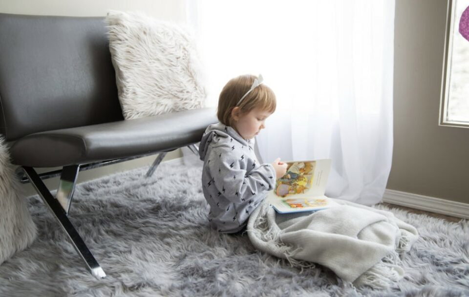
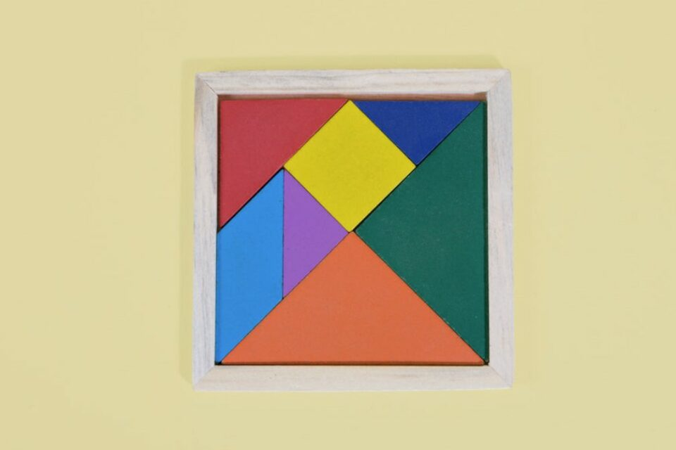
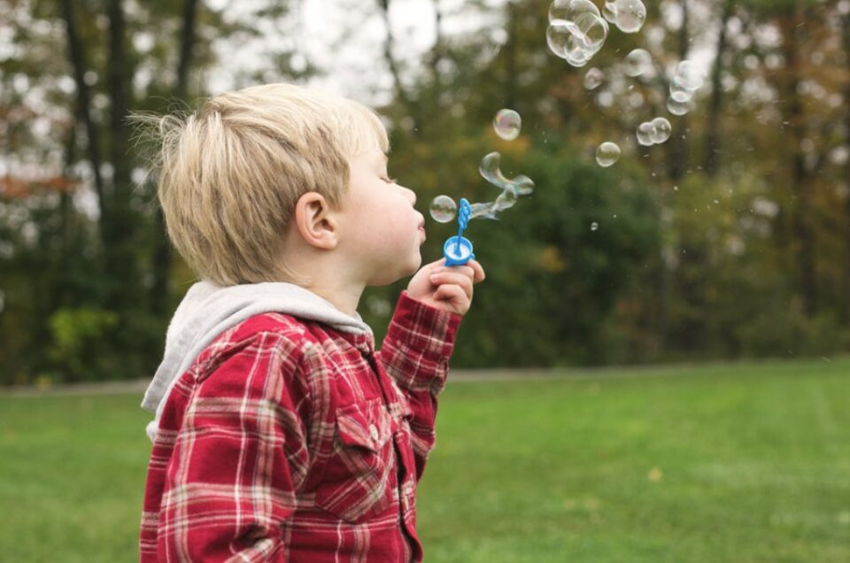
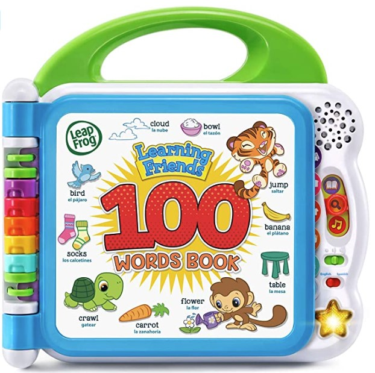
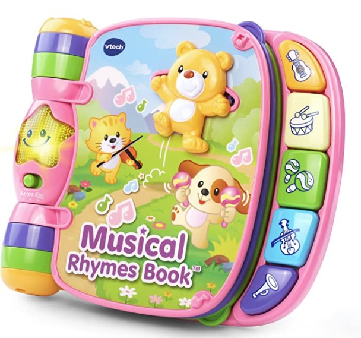
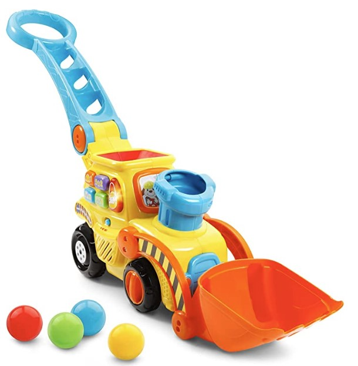
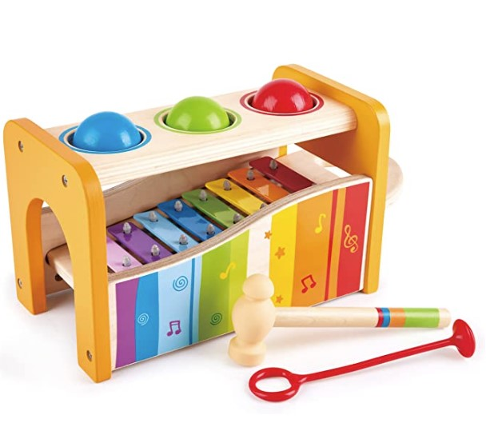
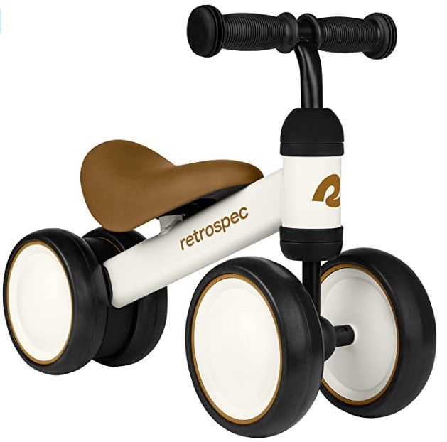
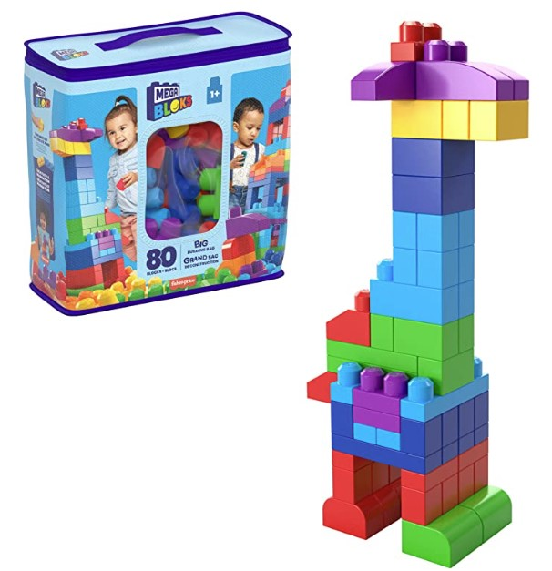

This article has been written and researched by our expert Loveable through a precise methodology. [Learn more about our methodology](https://avada.io/loveable/our-methodological.html)

[Loveable](https://avada.io/loveable/) > [Blog](https://avada.io/loveable/blog/) > [Parenting](https://avada.io/loveable/parenting/)

# 14 Exciting and Educational Activities for 12-Month-Olds That Boost Their Intelligence

Written by [Benjamin Collins](https://avada.io/loveable/author/benjamin/) Last Updated on August 28, 2023

- [14 Best Activities for a 1-Year-Old That You Need to Know](https://avada.io/loveable/blog/activities-for-12-month-olds/#wp-block-heading-2-4)
    - [1\. Storytime](https://avada.io/loveable/blog/activities-for-12-month-olds/#wp-block-heading-3-5) 
    - [2\. Outdoor Walk](https://avada.io/loveable/blog/activities-for-12-month-olds/#wp-block-heading-3-10)
    - [3\. Obstacles Crawl](https://avada.io/loveable/blog/activities-for-12-month-olds/#wp-block-heading-3-13)
    - [4\. Sensory Bottle](https://avada.io/loveable/blog/activities-for-12-month-olds/#wp-block-heading-3-17) 
    - [5\. Play with Puzzle](https://avada.io/loveable/blog/activities-for-12-month-olds/#wp-block-heading-3-19)
    - [6\. Play with Water](https://avada.io/loveable/blog/activities-for-12-month-olds/#wp-block-heading-3-22)
    - [7\. Drawing](https://avada.io/loveable/blog/activities-for-12-month-olds/#wp-block-heading-3-24)  
    - [8\. Magnet Play](https://avada.io/loveable/blog/activities-for-12-month-olds/#wp-block-heading-3-26)
    - [9\. Pom Pom Drop](https://avada.io/loveable/blog/activities-for-12-month-olds/#wp-block-heading-3-29)
    - [10\. Block Stacking](https://avada.io/loveable/blog/activities-for-12-month-olds/#wp-block-heading-3-32) 
    - [11\. Shaving cream mash-up](https://avada.io/loveable/blog/activities-for-12-month-olds/#wp-block-heading-3-36)
    - [12\. Edible Playdough](https://avada.io/loveable/blog/activities-for-12-month-olds/#wp-block-heading-3-39)
    - [13\. Playing with Bubbles](https://avada.io/loveable/blog/activities-for-12-month-olds/#wp-block-heading-3-42) 
    - [14\. Play with the Reflection](https://avada.io/loveable/blog/activities-for-12-month-olds/#wp-block-heading-3-45) 
- [6 Best Toys for 12-Month-Old Baby That They Will Love](https://avada.io/loveable/blog/activities-for-12-month-olds/#wp-block-heading-2-47) 
    - [LeapFrog Learning Friends 100 Words Book](https://avada.io/loveable/blog/activities-for-12-month-olds/#wp-block-heading-3-49)
    - [Musical Rhymes Book](https://avada.io/loveable/blog/activities-for-12-month-olds/#wp-block-heading-3-53)
    - [Pop-a-Balls Push & Pop Bulldozer](https://avada.io/loveable/blog/activities-for-12-month-olds/#wp-block-heading-3-56)
    - [Wooden Musical Pounding Toy for Toddlers](https://avada.io/loveable/blog/activities-for-12-month-olds/#wp-block-heading-3-60)
    - [Baby Walker Balance Bike with 4 Wheels](https://avada.io/loveable/blog/activities-for-12-month-olds/#wp-block-heading-3-63)
    - [Fisher-Price Toddler Block Toys](https://avada.io/loveable/blog/activities-for-12-month-olds/#wp-block-heading-3-67)
- [FAQ Activities for 12-Month-Old](https://avada.io/loveable/blog/activities-for-12-month-olds/#wp-block-heading-2-71) 
    - [What activities should a 1-year-old be able to do?](https://avada.io/loveable/blog/activities-for-12-month-olds/#wp-block-heading-3-72)
    - [What should I start teaching my 12-month-old?](https://avada.io/loveable/blog/activities-for-12-month-olds/#wp-block-heading-3-85)
    - [What is typical play for a 12-month-old?](https://avada.io/loveable/blog/activities-for-12-month-olds/#wp-block-heading-3-87)
- [Bottom Line](https://avada.io/loveable/blog/activities-for-12-month-olds/#wp-block-heading-2-90) 

So your child has just turned one year old; let’s celebrate that together! This is a memorable milestone in a child’s life, marking not only the wonderful memories of the first few months but also a time for you to plan new activities that will aid in their overall physical and intellectual development.

I understand that you may be wondering if there are any new activities that your one-year-old should be engaging in compared to previous months. Is it ok for them to develop well with free play activities at home with parents, or do they need to attend daycare to enhance their social skills? What factors will help your child’s overall development, and what should you be aware of? These are valid questions that can make you feel overwhelmed, but don’t worry; we will address them in this article.

Overall, the main activities for a one-year-old child are quite similar to those of the earlier months, such as crawling, pulling up, and cruising. However, at this stage, we need to focus more on [developing your child’s intellectual abilities](https://avada.io/loveable/educational-toys-1-year-olds/) because this is a period when their brain is rapidly developing. Therefore, we need to incorporate new activities that can enhance their cognitive development. Below are 11 suitable **activities for 12-month-old** children to aid in their intellectual development. Let’s get started!

## 14 Best Activities for a 1-Year-Old That You Need to Know

### **1\. Storytime** 

Many people think a 12-month-old baby cannot understand what adults say, but the reality is different. A one-year-old baby can understand many simple words, phrases, and grammar. Toddlers often learn language by listening and observing the adults around them, so letting them hear as much as possible can give them more learning opportunities.

The best tip to do this is to set a specific time of day to tell stories to your baby. You should buy books with many colors and images or comics. Hold the baby’s finger when telling stories, and follow the words on the pages you read. By doing this, the child will develop a better sense of language. Remember to read with a gentle tone and many different intonations to stimulate the baby’s hearing.

**Related:** Best [Personalized Children’s Books](https://avada.io/loveable/personalized-children-books/) That They’ll Be Happy

### **2\. Outdoor Walk**

Taking young children for regular walks is a good idea to [help them develop their intellect](https://lovevery.com/community/blog/child-development/the-benefits-of-bringing-your-baby-outside/). This will give them the opportunity to observe a wide variety of objects and, of course, speed up their learning process.

When you see your child looking at something, point to it and say the name of the object, for example, “That’s a blue car” or “Look at the dog.” Taking the time to take your child for a walk outside every day (avoiding bad weather days to prevent illness, of course) also helps to strengthen their immune system, as the gentle morning sunlight helps with nutrient absorption.

### **3\. Obstacles Crawl**

Encouraging young children to crawl over small objects placed on the floor can help them develop good hand-eye coordination and fine motor skills. It can also promote cognitive development as they learn to problem-solve and navigate different situations.

A simple and effective way to do this is by taking apart the top and bottom of several boxes and then sticking them together to create a long tunnel. Additionally, using play tents and tunnels can also be a fun and engaging way to help children practice their motor skills and explore the world around them.

### **4\. Sensory Bottle** 

You can improve your child’s visual and sensory skills by putting small beads, such as glitter or rice, into an empty bottle with a tight-fitting lid. Then, give it to your baby and let them shake it to enhance their visual and sensory abilities. You can also create various types of bottles using different containers to increase stimulation.

### **5\. Play with Puzzle**

Try buying a simple [personalized puzzle](https://avada.io/loveable/personalized-puzzles/) set and help your child complete it. At this age, your child may still have difficulty fitting the puzzle pieces together independently, but playing with puzzles can still help improve spatial awareness and problem-solving skills. And don’t forget to praise them once they complete it.

### **6\. Play with Water**

This is such a fun activity that you can enjoy all year round! There are always ways to make it work, whether sunny or snowy outside. This activity will boost the child’s sense of the material. During the summer, you can play outdoors and splash around in a water park or fill up a water table or even a kiddie pool. And when it gets chilly in the winter, your little one can still have a blast playing in the sink or taking a bath.

### **7\. Drawing**  

Consider buying your child a simple box of crayons to do this activity. And when I say “draw” here, it doesn’t mean your child will be drawing the Mona Lisa. All your child will do is scribble colors on a piece of paper. You can also show them how to make marks and introduce different colors. This activity will stimulate their visual senses, and color will increase their creativity as they develop. Note that using crayons instead of paint is better to avoid getting messy.

### **8\. Magnet Play**

Playing with magnets is a fun activity that even I still enjoy even at the age of 10. The way magnets attract and repel is sure to fascinate children. Moreover, there are many games you can play with magnets that you can come up with. For example, you can place a magnet on one side of a paper and the other magnet on the other side, then slowly move the magnets around to make the child amused. 

There are also many fun and exciting games with magnets that you can find on Amazon.

### **9\. Pom Pom Drop**

This game is not only exciting, but it also costs you nothing! All you need to do is attach an empty paper tube to a wall with some tape to hold it in place. Grab some pom poms and let your baby practice their hand-eye coordination skills as they drop the pom pom through the hole. It’s so exciting to watch it come out through the bottom end! 

To start off, you can place the tube vertically. As your little one gets better at it, you can make it more challenging by changing up the angles.

### **10\. Block Stacking** 

Sorting blocks by color, order, and size can be a very fun activity for young children. It is a highly creative activity, and you can start introducing block sorting to your child from the first few months of their life. 

With a wide range of colors, textures, and shapes, this toy helps children develop their imagination and reasoning skills. Make sure to get a set of blocks for your child to enjoy this activity.

### **11\. Shaving cream mash-up**

Playing with shaving cream is a very fun activity, albeit a little messy. Spray some shaving cream onto a surface (preferably in the bathroom), then let your child play with it, squishing and even hitting it to make it splatter. This is a highly satisfying and sensory-stimulating activity for children, and shaving cream is relatively safe since it only involves hand movements. 

You can also add some edible food coloring to make the shaving cream more colorful and visually appealing. Of course, you should always supervise your child during playtime and make sure they don’t put the cream in their mouth or eyes.

### **12\. Edible Playdough**

Playing with play dough is already fun, but you can make it even safer and healthier with these tips. Mix cornstarch with a little bit of water, slowly pouring the water into the bowl of cornstarch and kneading the mixture continuously until you get a soft, pliable dough that feels just like regular play dough. 

Finally, you can divide the dough into smaller pieces and add different food coloring to each piece. These activities are fun and safe, without the harmful chemicals found in regular play dough products that can be harmful to children.

### **13\. Playing with Bubbles** 

Engaging in bubble play can be a fantastic pastime both indoors and outdoors, but take heed to avoid unintentionally wafting bubbles into your little one’s face, for the solution can irritate their eyes. With their inexplicable characteristics, bubbles truly possess a touch of enchantment.

### **14\. Play with the Reflection** 

Infants love to play with mirrors. If you have a generously sized one in your abode, such as on a wardrobe door, introduce your little bundle of joy to it and demonstrate how to make silly faces, clap hands, and exchange high-fives with their reflection. It could also be entertaining to experiment with different accessories, like hats and scarves, in front of the mirror.

## 6 Best Toys for 12-Month-Old Baby That They Will Love 

With the activities mentioned above, I hope you have some great ideas for playing with your little one. However, in addition to those activities, I would like to introduce you to some toys that will accompany your child’s development and that I’m sure your baby will love. These are toys that have been tried and tested by many people and received good reviews. Let’s take a look at them together.

### [**LeapFrog Learning Friends 100 Words Book**](https://www.amazon.com/LeapFrog-Learning-Friends-Frustration-Packaging/dp/B07CCFDZZ3/ref=sr_1_2?keywords=best%2Btoys%2Bfor%2B12%2Bmonth%2Bold&qid=1684032251&sr=8-2&th=1)

As mentioned earlier, this is a prime time for children to learn about language and intonation firsthand. That’s why this fun vocabulary self-learning kit for kids is sure to help them have a great time while learning and learning while having fun.

It features colorful pages with vivid images and sounds that help children learn new words and phrases. With up to 100 vocabulary words included in this product, it ensures that children can learn a lot more about nature, animals, and other objects while playing. The buttons on the side of the book are easy for little fingers to press, and the volume control allows parents to adjust the sound to their desired level.

### [**Musical Rhymes Book**](https://www.amazon.com/VTech-Musical-Rhymes-Amazon-Exclusive/dp/B012C0PFCS/ref=sr_1_4?keywords=best%2Btoys%2Bfor%2B12%2Bmonth%2Bold&qid=1684032251&sr=8-4&th=1)

Unlike the electronic vocabulary book mentioned above, this product includes 40 songs and various melodies to stimulate children’s auditory and cognitive abilities. You can also play with it as a substitute for reading storybooks and singing with your child to make it more enjoyable. The product is made from safe plastic, with easy-to-interact buttons and multiple colors. In addition, the product is also equipped with AAA batteries. It is definitely a worthwhile product to buy for children.

### [**Pop-a-Balls Push & Pop Bulldozer**](https://www.amazon.com/VTech-Pop-a-Balls-Push-Pop-Bulldozer/dp/B06WV7VBY5/ref=sr_1_6?keywords=best%2Btoys%2Bfor%2B12%2Bmonth%2Bold&qid=1684032251&sr=8-6&th=1)

This Pop-a-Balls Push & Pop Bulldozer is a fun and interactive toy for children 12 months and up. This bulldozer toy has a friendly driver and colorful balls that pop up and out as the toy is pushed and pulled along. This can help to encourage children to engage in imaginative play and develop their fine motor skills.

The material used to make this toy is safe for kids as it is made of durable and non-toxic plastic. The toy also features a secure battery compartment that requires a screwdriver to open, ensuring the safety of young children. This toy can improve their hand-eye coordination.

### [**Wooden Musical Pounding Toy for Toddlers**](https://www.amazon.com/Hape-Pound-Bench-Slide-Xylophone/dp/B00712O2D6/ref=sr_1_7?keywords=best+toys+for+12+month+old&qid=1684032251&sr=8-7)

If you’re looking for a toy to help develop your child’s creativity and musicality, this multifunctional musical instrument might be perfect. Your little one can play the xylophone in various ways, like fetching balls and sending them tinkling over or pulling out the keyboard for a solo performance. As they play, they’ll develop essential skills like fine motor skills, hand-eye coordination, and arm movement, and it encourages musical exploration and audio recognition, helping your child establish their own sense of rhythm and melody.

### [**Baby Walker Balance Bike with 4 Wheels**](https://www.amazon.com/Retrospec-Cricket-Walker-Balance-Wheels/dp/B094YM3DMX/ref=sr_1_10?keywords=best%2Btoys%2Bfor%2B12%2Bmonth%2Bold&qid=1684032251&sr=8-10&th=1)

It may be a bit early to start your child on a bike, but it can be a great way to make it easier for them to learn how to ride in the future.

With a sturdy frame made of steel and a comfortable saddle, this balance bike is designed to provide a safe and smooth ride for children between the ages of 1 year old and 2 years old. The four wheels provide excellent stability, making it easy for children to balance and maneuver on their own. The bike is also very lightweight, which makes it easy for parents to transport and store.

### [**Fisher-Price Toddler Block Toys**](https://www.amazon.com/80-piece-Building-Toddler-Storage-Toddlers/dp/B007GE75HY/ref=sr_1_9?keywords=best%2Btoys%2Bfor%2B12%2Bmonth%2Bold&qid=1684032251&sr=8-9&th=1)

Let your child’s creativity soar with this building block set! With over 80 pieces to play with, your little one can create a variety of different animals and shapes (with a little help from you, of course). This is the perfect toy to develop your child’s imagination and hand-eye coordination. The set comes in a range of vibrant colors that are sure to delight your child. 

Made from non-toxic plastic, it’s completely safe for your child to play with, even if they put the blocks in their mouth. Best of all, this set can be enjoyed for years to come as your child continues to find new and exciting ways to play with it.

## FAQ Activities for 12-Month-Old 

### **What activities should a 1-year-old be able to do?**

At one year old, children are developing rapidly and mastering new skills every day. Some activities that a one-year-old may be able to do include:

- Sitting up on their own
- Crawling or even walking
- Pointing at objects they want or are interested in
- Saying a few words or making sounds to communicate
- Playing with toys and exploring their environment
- Starting to use utensils to feed themselves
- Following simple instructions, such as “Come here” or “Give me that.”
- Engaging in social play with parents and caregivers
- Recognizing familiar faces and objects
- Showing emotions and expressing their needs through gestures and sounds.

You should also keep in mind that every child grows at their own pace, and these activities may vary depending on individual development.

### **What should I start teaching my 12-month-old?**

At 12 months, you can start teaching your child various basic skills to lay the foundation for their future development. These skills can include simple words, gestures, signs to help them communicate and basic motor skills like crawling, standing, and walking. Encouraging playtime and toy interaction can also help with cognitive development and problem-solving skills. Reading to your child and introducing them to different textures, sounds, and colors can also aid their sensory and language development. Starting early and incorporating various activities can help support your child’s overall growth and development.

### **What is typical play for a 12-month-old?**

Some typical play for a 12-month-old involves exploring their surroundings and developing their motor skills through crawling, cruising, and walking. They may enjoy playing with simple toys such as balls, blocks, stacking rings, and books with bright colors and simple pictures. 12-month-olds may also enjoy playing peek-a-boo, imitating sounds and actions, and engaging in simple interactive games with caregivers.

_**See More:**_ Fun and Stimulating [Activities for 18-Month-Olds](https://avada.io/loveable/blog/activities-for-18-month-olds/)

## Bottom Line 

There are many exciting and educational activities that parents and caregivers can engage their 12-month-old children in to help promote their intellectual development. By engaging in the activities above, parents can help their child develop essential skills such as cognitive, language, and social-emotional development. These activities help boost intelligence and foster a strong bond between the child and caregiver. 

- [14 Best Activities for a 1-Year-Old That You Need to Know](https://avada.io/loveable/blog/activities-for-12-month-olds/#wp-block-heading-2-4)
    - [1\. Storytime](https://avada.io/loveable/blog/activities-for-12-month-olds/#wp-block-heading-3-5) 
    - [2\. Outdoor Walk](https://avada.io/loveable/blog/activities-for-12-month-olds/#wp-block-heading-3-10)
    - [3\. Obstacles Crawl](https://avada.io/loveable/blog/activities-for-12-month-olds/#wp-block-heading-3-13)
    - [4\. Sensory Bottle](https://avada.io/loveable/blog/activities-for-12-month-olds/#wp-block-heading-3-17) 
    - [5\. Play with Puzzle](https://avada.io/loveable/blog/activities-for-12-month-olds/#wp-block-heading-3-19)
    - [6\. Play with Water](https://avada.io/loveable/blog/activities-for-12-month-olds/#wp-block-heading-3-22)
    - [7\. Drawing](https://avada.io/loveable/blog/activities-for-12-month-olds/#wp-block-heading-3-24)  
    - [8\. Magnet Play](https://avada.io/loveable/blog/activities-for-12-month-olds/#wp-block-heading-3-26)
    - [9\. Pom Pom Drop](https://avada.io/loveable/blog/activities-for-12-month-olds/#wp-block-heading-3-29)
    - [10\. Block Stacking](https://avada.io/loveable/blog/activities-for-12-month-olds/#wp-block-heading-3-32) 
    - [11\. Shaving cream mash-up](https://avada.io/loveable/blog/activities-for-12-month-olds/#wp-block-heading-3-36)
    - [12\. Edible Playdough](https://avada.io/loveable/blog/activities-for-12-month-olds/#wp-block-heading-3-39)
    - [13\. Playing with Bubbles](https://avada.io/loveable/blog/activities-for-12-month-olds/#wp-block-heading-3-42) 
    - [14\. Play with the Reflection](https://avada.io/loveable/blog/activities-for-12-month-olds/#wp-block-heading-3-45) 
- [6 Best Toys for 12-Month-Old Baby That They Will Love](https://avada.io/loveable/blog/activities-for-12-month-olds/#wp-block-heading-2-47) 
    - [LeapFrog Learning Friends 100 Words Book](https://avada.io/loveable/blog/activities-for-12-month-olds/#wp-block-heading-3-49)
    - [Musical Rhymes Book](https://avada.io/loveable/blog/activities-for-12-month-olds/#wp-block-heading-3-53)
    - [Pop-a-Balls Push & Pop Bulldozer](https://avada.io/loveable/blog/activities-for-12-month-olds/#wp-block-heading-3-56)
    - [Wooden Musical Pounding Toy for Toddlers](https://avada.io/loveable/blog/activities-for-12-month-olds/#wp-block-heading-3-60)
    - [Baby Walker Balance Bike with 4 Wheels](https://avada.io/loveable/blog/activities-for-12-month-olds/#wp-block-heading-3-63)
    - [Fisher-Price Toddler Block Toys](https://avada.io/loveable/blog/activities-for-12-month-olds/#wp-block-heading-3-67)
- [FAQ Activities for 12-Month-Old](https://avada.io/loveable/blog/activities-for-12-month-olds/#wp-block-heading-2-71) 
    - [What activities should a 1-year-old be able to do?](https://avada.io/loveable/blog/activities-for-12-month-olds/#wp-block-heading-3-72)
    - [What should I start teaching my 12-month-old?](https://avada.io/loveable/blog/activities-for-12-month-olds/#wp-block-heading-3-85)
    - [What is typical play for a 12-month-old?](https://avada.io/loveable/blog/activities-for-12-month-olds/#wp-block-heading-3-87)
- [Bottom Line](https://avada.io/loveable/blog/activities-for-12-month-olds/#wp-block-heading-2-90) 

### [Benjamin Collins](https://avada.io/loveable/author/benjamin/)

I'm Benjamin Collins, a gift ideas creator at Loveable. We specialize in unique and personalized gifts for any occasion. With my honed skills, I recommend gifts tailored to the recipient's personality and interests, whether it's Halloween, Christmas, or any other celebration.

- [Twitter](https://twitter.com/intent/tweet)
- [Facebook](https://www.facebook.com/sharer/sharer.php)
- [instagram](https://avada.io/loveable/blog/activities-for-12-month-olds/)
- [pinterest](https://www.pinterest.com/loveablellc/)

## Related Posts

[

### 79 Heartfelt Missing Mom Quotes for Expressing Love and Longing

](https://avada.io/loveable/blog/missing-mom-quotes/)

[

### Parenting with Depression: Strategies for Coping, Seeking Help, and Building Resilience

](https://avada.io/loveable/blog/parenting-with-depression/)

[

### 100 Empowering Single Mom Quotes: Inspirational Words for Strong Mothers

](https://avada.io/loveable/blog/single-mom-quotes/)

[

### 99+ Heartfelt Quotes And Wishes: Happy Anniversary to Mom and Dad!

](https://avada.io/loveable/blog/quotes-happy-anniversary-mom-dad/)

[

### 5 Ways to Foster a Positive Parent-Teacher Relationship

](https://avada.io/loveable/blog/parent-teacher-relationship/)
