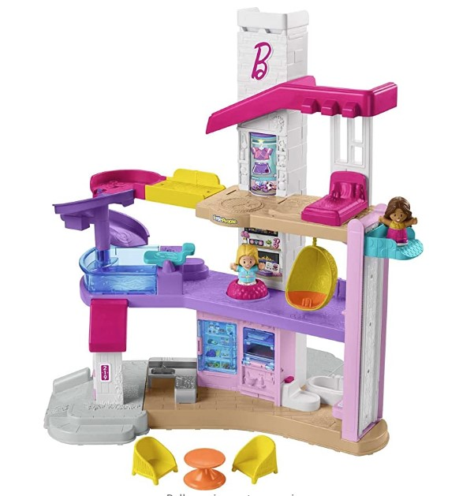

This article has been written and researched by our expert Loveable through a precise methodology. [Learn more about our methodology](https://avada.io/loveable/our-methodological.html)

[Loveable](https://avada.io/loveable/) > [Blog](https://avada.io/loveable/blog/) > [Parenting](https://avada.io/loveable/parenting/)

# 14 Fun and Creative Activities for a 5-Month-Old Baby – Developmental Play Ideas

Written by [Benjamin Collins](https://avada.io/loveable/author/benjamin/) Last Updated on August 28, 2023

- [14 Engaging Activities for a 5-Month-Old Baby](https://avada.io/loveable/blog/activities-for-5-month-old-baby/#wp-block-heading-2-4)
    - [1\. Establish a Routine](https://avada.io/loveable/blog/activities-for-5-month-old-baby/#wp-block-heading-3-5) 
    - [2\. Make Eye Contact with Your Baby](https://avada.io/loveable/blog/activities-for-5-month-old-baby/#wp-block-heading-3-8)
    - [3\. Get your home ready for a baby on the move](https://avada.io/loveable/blog/activities-for-5-month-old-baby/#wp-block-heading-3-10)
    - [4\. Let Him Play with His Reflection](https://avada.io/loveable/blog/activities-for-5-month-old-baby/#wp-block-heading-3-14)
    - [5\. Go for a Nature Walk](https://avada.io/loveable/blog/activities-for-5-month-old-baby/#wp-block-heading-3-16)
    - [6\. The Toy Box Game](https://avada.io/loveable/blog/activities-for-5-month-old-baby/#wp-block-heading-3-19)
    - [7\. Play the “on and off” Game](https://avada.io/loveable/blog/activities-for-5-month-old-baby/#wp-block-heading-3-22)
    - [8\. Sit-ups Workout](https://avada.io/loveable/blog/activities-for-5-month-old-baby/#wp-block-heading-3-25)
    - [9\. Show your baby fun objects](https://avada.io/loveable/blog/activities-for-5-month-old-baby/#wp-block-heading-3-28)
    - [10\. Ball Rolling](https://avada.io/loveable/blog/activities-for-5-month-old-baby/#wp-block-heading-3-30) 
    - [11\. Tummy Time is Always Fun](https://avada.io/loveable/blog/activities-for-5-month-old-baby/#wp-block-heading-3-33) 
    - [12\. Little Piggy Game](https://avada.io/loveable/blog/activities-for-5-month-old-baby/#wp-block-heading-3-35) 
    - [13\. Play with Bubbles](https://avada.io/loveable/blog/activities-for-5-month-old-baby/#wp-block-heading-3-38) 
    - [14\. Tell Them The Story](https://avada.io/loveable/blog/activities-for-5-month-old-baby/#wp-block-heading-3-41)
- [7 Best Developmental Toys for 5-Month-Old that They’ll Love](https://avada.io/loveable/blog/activities-for-5-month-old-baby/#wp-block-heading-2-43) 
    - [1\. Gym & Play Mat for Baby to Toddler](https://avada.io/loveable/blog/activities-for-5-month-old-baby/#wp-block-heading-3-44)
    - [2\. Learners Activity Cube for Toddler](https://avada.io/loveable/blog/activities-for-5-month-old-baby/#wp-block-heading-3-48) 
    - [3\. Circle Stacking Learning Toys](https://avada.io/loveable/blog/activities-for-5-month-old-baby/#wp-block-heading-3-52) 
    - [4\. Little Dream House with Music and Light](https://avada.io/loveable/blog/activities-for-5-month-old-baby/#wp-block-heading-3-57) 
    - [5\. Developmental Bumpy Ball For 5-Month-Old](https://avada.io/loveable/blog/activities-for-5-month-old-baby/#wp-block-heading-3-62)
    - [6\. Tomy Lamaze Mortimer](https://avada.io/loveable/blog/activities-for-5-month-old-baby/#wp-block-heading-3-68) 
    - [7\. Skip Hop Baby Activity Center](https://avada.io/loveable/blog/activities-for-5-month-old-baby/#wp-block-heading-3-72)
- [FAQ Activities for a 5-Month-Old Baby](https://avada.io/loveable/blog/activities-for-5-month-old-baby/#wp-block-heading-2-75)
    - [How do you entertain a 5-month-old?](https://avada.io/loveable/blog/activities-for-5-month-old-baby/#wp-block-heading-3-76)
    - [Can a 5-month-old entertain themselves?](https://avada.io/loveable/blog/activities-for-5-month-old-baby/#wp-block-heading-3-79)
    - [Can a 5-month-old watch TV?](https://avada.io/loveable/blog/activities-for-5-month-old-baby/#wp-block-heading-3-81)
    - [How much tummy time should a 5-month-old have?](https://avada.io/loveable/blog/activities-for-5-month-old-baby/#wp-block-heading-3-83)
- [Bottom Line](https://avada.io/loveable/blog/activities-for-5-month-old-baby/#wp-block-heading-2-88) 

When your baby reaches the 5-month-old, it also means that parents or caregivers must step into a completely new situation with many activities to help the baby’s physical and intellectual development. I understand if you start to feel tired, but don’t worry!

At the 5-month mark, your baby is reaching an exciting stage of development where they are becoming more engaged and expressive. As a parent, you may feel like you can finally communicate with your little ones as they start to show emotions and respond to yours. This is a great time to start playing with your baby daily to help foster their newfound skills and expand upon them.

While your 5-month-old may not be coordinated enough to play games like patty-cake or peekaboo, there are still a lot of fun and creative ways to engage them at this stage. Incorporating developmental play ideas into your daily routine can help your baby learn and grow while having a great time together. So, let’s explore some of **the best activities for 5-month-olds** and games to keep them entertained and stimulated!

## **14 Engaging Activities for a 5-Month-Old Baby**

### **1\. Establish a Routine** 

I always believe establishing a routine can benefit both you and your baby. When it feels right for you and your little one, doing things in a similar order each day can help create a sense of familiarity and security. Having a consistent daily pattern can make your baby may feel more [relaxed and less anxious](https://avada.io/loveable/stress-relief-gifts/), knowing what to expect next. So, take the time to find a routine that works for both you and your baby, and stick to it best as you can.

### **2\. Make Eye Contact with Your Baby**

Making eye contact with your baby can be a wonderful way to engage with them and encourage their development. When your baby follows your eyes, it helps them to turn their head, which can help build their neck strength and head control, just like during tummy time. Make sure you look into your baby’s eyes and enjoy this special connection while helping them grow stronger and more capable.

### **3\. Get your home ready for a baby on the move**

When preparing my home for my moving baby, I took a good look around and identified any potential hazards. You also need to create a safe environment for your little ones to move about in as they explore their surroundings. 

You can also start by securing furniture and electrical cords, covering sharp corners, and placing safety gates on both sides of stairs; with this, you can help prevent unwanted accidents and give yourself peace of mind as your baby begins to explore their world.

### **4\. Let Him Play with His Reflection**

Put a baby-safe mirror (either secured or designed as a toy for babies) at your child’s height and let them look at their reflection. Keep doing this as your baby grows. Finally, your little one will start to understand how their body moves and feels by comparing it to what they see in the mirror. This somehow helps their brain develop a lot.

### **5\. Go for a Nature Walk**

Carry your baby while walking around the house, park, or block, and tell them about what you see. For example, you can say, “Look, this is a banana!” or “Do you see the black car?” You can also respond to your baby’s sounds and movements as you talk, which is called serve and return. This can help your baby’s brain and language development. Talking to your baby from an early age can positively impact their learning abilities.

### **6\. The Toy Box Game**

To complete this task, you will need a container with just a small opening at the top. I will show you how to play with this. 

Get a plastic container with smooth edges and fill it with small toys your baby likes playing with. Show the container to your baby and tilt it so some toys fall out. Do this a few times, and then give the container to your baby and encourage them to move it around. Praise them with kind words every time they slide a toy out of the container. Let your baby shake and make noise with the container, and you can even add some toys to make it louder!

### **7\. Play the “on and off” Game**

When you walk around the house, teach your kid how to turn things on and off, like lights, water faucets, vacuums, or blenders. Say “on” or “off” each time you do it. This helps your baby understand cause and effect. You can also use a flashlight and let your baby follow the light beam around the room. This will improve their tracking skills.

### **8\. Sit-ups Workout**

These activities only need you and your baby!

Sit on a bed with your legs straight. Put a soft towel on your legs and place your baby on it. Hold your baby under your arms and slowly lift your knees to bring your baby close to your face. Sing a song or talk to your baby each time you lift them. Then straighten your legs and repeat the exercise. If your baby can hold their head well, you can lift them without bending your legs.

### **9\. Show your baby fun objects**

Every day, I show my baby something he hasn’t seen before, like a bright-colored toy or a card with contrasting colors. I also give him safe objects, like a teething ring, to hold and explore with his mouth. This helps him develop hand-eye coordination and strengthen his motor skills as he learns to grasp objects.

### **10\. Ball Rolling** 

You can use a ball for this activity, but a special ball for babies with different textures is even better. Give the ball to your baby and let him explore it independently. You can also show your baby different ways to play with the ball, like rolling, throwing, or dropping it into a box or off the table. Just make sure the ball is big enough and not a choking hazard.

### **11\. Tummy Time is Always Fun** 

Lie your baby down on his tummy on a soft rug or bed. Check if he is comfortable in this position. Then, place his toys in front of him and let him have fun with them while you supervise. Playing on his tummy helps to strengthen his back and neck muscles, which is important for him to learn to walk and turn his head. You can also ask someone to stand nearby and call your baby’s name.

### **12\. Little Piggy Game** 

First, lay your baby on its back and lift its legs so it can see its toes. Hold and wiggle their big toe while saying the poem. Repeat this with each toe, and remember to tickle your baby at the end.

This little piggy went to market 🐷; This little piggy stayed home 🐖; this little piggy had roast beef; this little piggy had none. 🐽

### **13\. Play with Bubbles** 

Blowing bubbles can be an exciting and engaging activity for your baby. You and your partner can blow bubbles near your little one, capturing their attention as the bubbles float around them. If your baby seems excited and starts to laugh or move their hands, you can increase the number of bubbles you blow to keep them engaged and entertained. Just keep a close eye on your baby while they play with bubbles to ensure their safety.

### **14\. Tell Them The Story**

This is a wonderful activity with your 5-month-old at bedtime that also encourages learning. Sit with your baby in your lap and hold the book open in front of them. Read the story out loud while pointing to the colorful illustrations. If your little one reaches out to grab the book, let them hold it and turn the pages.

## **7 Best Developmental Toys for 5-Month-Old that They’ll Love** 

### **1\. [Gym & Play Mat for Baby to Toddler](https://www.amazon.com/dp/B075R8BXXC?tag=verywellfamily-onsite-prod-20&linkCode=ogi&th=1&psc=1&ascsubtag=4169816%7Cnbfffbc23801443dbac76ffecf2a23dea08%7CB075R8BXXC)**

This play gym and mat is designed for babies from birth to one year old. It is made from sustainable wood and non-toxic organic cotton and polyester materials. Completely save for your baby as well. 

The play gym has five different Montessori-inspired play zones and various activities supporting physical development. Depending on the baby’s stimulation level, adults can easily take out or hide away from other activities. Additionally, the play gym can be set up and collapsed in just two minutes for convenient storage.

### **2\. [Learners Activity Cube for Toddler](https://www.amazon.com/VTech-Busy-Learners-Activity-Purple/dp/B00OC5FU8Q/ref=sr_1_2?keywords=toys%2Bfor%2B5%2Bmonth%2Bold&qid=1683619629&sr=8-2&th=1)** 

I love the Toddler Activity Cube for Kids. This toy has quickly become my baby’s favorite because it offers so many opportunities for my little one to learn and explore. The five sides of play are perfect for encouraging discovery, and the four light-up buttons have been fantastic for introducing my baby to animal names, sounds, and shapes.

What I appreciate most about this activity cube is how it helps with my baby’s development. It’s a fantastic pre-K learning toy that develops fine motor skills and teaches colors, shapes, and more. Plus, the motion sensor is fantastic for encouraging my little one to crawl and even assists with sitting up to play. The 25 playful songs and melodies keep my baby engaged, entertained, and learning for hours.

### **3\. [Circle Stacking Learning Toys](https://www.amazon.com/Sassy-Stacks-Circles-Stacking-Learning/dp/B07NXDJ52C/ref=sr_1_4?keywords=toys%2Bfor%2B5%2Bmonth%2Bold&qid=1683619629&sr=8-4&th=1)** 

The stacking toy is a fantastic addition to any child’s toy collection. The straight post accepts rings of different sizes, which helps to strengthen hand-eye coordination as children learn to stack the rings in the correct order. The chunky rings are easy for little hands to grasp, strengthening fine motor skills.

What I love most about this toy is that each ring features a different texture and weight. This textural variety is safe for young children exploring the world through their mouths. Additionally, the colorful beads inside the clear ring provide a fun visual and auditory experience, allowing children to connect sound to sight.

If you’re looking for a stacking toy that’s both entertaining and educational, this one is definitely worth considering.

### **4\. [Little Dream House with Music and Light](https://www.amazon.com/Fisher-Price-DreamHouse-Interactive-Toddler-playset/dp/B09P9JQ9Q8/ref=sr_1_1_sspa?keywords=toys+for+5+month+old&qid=1683619629&sr=8-1-spons&psc=1&spLa=ZW5jcnlwdGVkUXVhbGlmaWVyPUE2UlhHQlcxSUZWUDkmZW5jcnlwdGVkSWQ9QTAyMjM0MjgySFUwRlFLQzczTEFCJmVuY3J5cHRlZEFkSWQ9QTEwMDU3ODMxT0c1NlFPTERXWDY5JndpZGdldE5hbWU9c3BfYXRmJmFjdGlvbj1jbGlja1JlZGlyZWN0JmRvTm90TG9nQ2xpY2s9dHJ1ZQ==)** 

The Fisher-Price DreamHouse Interactive Playset is a fantastic toy your child will love. This playset is designed to spark your child’s imagination and creativity, providing endless hours of fun and entertainment.

One of the things that makes this playset so great is its interactive features. It has different rooms, including a living room, kitchen, bedroom, and bathroom, allowing children to create their own stories and scenarios. The playset has over 75 sounds, songs, and phrases, making playtime more engaging.

It’s suitable for children as young as 18 months old and is easy to assemble and use. The playset is durable, ensuring it lasts for years of playtime.

### **5\. [Developmental Bumpy Ball For 5-Month-Old](https://www.amazon.com/Sassy-Developmental-Months-Patterns-Developing/dp/B004AHMCMI/ref=sr_1_3?keywords=toys%2Bfor%2B5%2Bmonth%2Bold&qid=1683619629&sr=8-3&th=1)**

Looking for something simple yet fun? Then this item is perfect for your baby. This ball stimulates your baby’s senses, promoting their development and encouraging them to explore the world around them.

One of the things that makes this ball so great is its texture. The bumpy surface provides a unique tactile experience that helps babies develop their sense of touch. The ball also features bright colors and high-contrast patterns, which can help to stimulate your baby’s developing vision.

In addition to its sensory benefits, the Sassy Developmental Bumpy Ball is also great for promoting gross motor skills. Its lightweight and easy-to-grasp design makes it perfect for little hands, while its soft material is safe for teething babies to chew on.

Surprise your little one today!

### **6\. [Tomy Lamaze Mortimer](https://www.amazon.com/LAMAZE-L27014A1-Lamaze-Mortimer-Moose/dp/B000I2MRLU/ref=sr_1_6?keywords=toys%2Bfor%2B5%2Bmonth%2Bold&qid=1683619629&sr=8-6&th=1)** 

The Lamaze Mortimer Moose is a beautiful toy perfect for toddlers beginning to explore the world around them. This plush moose is designed to be fun and educational, helping promote your child’s development through play. 

I must mention this item’s benefit on a child’s senses. The Lamaze Mortimer Moose features a variety of textures and fabrics, which can help to stimulate your child’s sense of touch and encourage them to explore different materials. In addition, it is also great for promoting gross motor skills. The toy has various features, such as crinkly ears and a squeaker, which can encourage your child to reach, grasp, and manipulate the toy. 

### **7\. [Skip Hop Baby Activity Center](https://www.amazon.com/Skip-Hop-Explore-3-Stage-Activity/dp/B01J94K9OY/ref=sr_1_13?keywords=toys%2Bfor%2B5%2Bmonth%2Bold&qid=1683619629&sr=8-13&th=1)**

Here is a product that will help your little one develop in all aspects. It is designed as a sturdy and safe seat, so your baby will no longer need to be carried by parents for hours. One great thing about this product is that many cute and fun toys are integrated into the tabletop for the child to unleash their creativity. These toys also help the child develop their senses in a flexible way. This product lets you passively supervise your child and help them entertain themselves.

## **FAQ Activities for a 5-Month-Old Baby**

### **How do you entertain a 5-month-old?**

The question is answered above, but I can make a summary.

There are many ways to entertain a 5-month-old! Some ideas include playing peek-a-boo, singing songs, reading books with bright colors and textures, and using toys that encourage grasping and exploration. Tummy time can also be a fun activity for babies at this age as they begin to strengthen their neck and back muscles. Above all, interacting with your baby through talking, smiling, and making eye contact is one of the best ways to entertain and stimulate their developing mind.

### **Can a 5-month-old entertain themselves?**

At 5 months old, babies are still developing their abilities to explore and play independently, so it’s unlikely that they can entertain themselves for long periods. While they may be able to focus on certain objects or toys for a few minutes, they still rely heavily on adult caregivers for interaction and stimulation. 

### **Can a 5-month-old watch TV?**

It is generally not recommended for 5-month-old infants to watch TV or other screens, as their developing brains are still sensitive to overstimulation, and too much screen time can potentially harm their development. It is important to provide infants with appropriate developmental toys and activities to promote their growth and learning.

### **How much tummy time should a 5-month-old have?**

At 5 months old, a baby should have around 1 to 2 hours of tummy time per day. This can be equally divided throughout the day into short sessions. Tummy time is important for strengthening the baby’s neck, shoulder, arm, and back muscles, promoting motor development, and preventing flat spots on the head.

_**Related**_:

- Engaging [Activities for a 6-Month-Old Baby](https://avada.io/loveable/blog/activities-for-6-month-old/)

- Playful and Educational [7 Months Old Activities](https://avada.io/loveable/blog/7-months-old-activities/)

## **Bottom Line** 

I hope these **16 fun and creative activities for 5-month-old babies** inspire you to spend quality time with your little one while promoting their development through play. Enjoy this bonding time and explore new ways to engage and stimulate your baby’s senses.

- [14 Engaging Activities for a 5-Month-Old Baby](https://avada.io/loveable/blog/activities-for-5-month-old-baby/#wp-block-heading-2-4)
    - [1\. Establish a Routine](https://avada.io/loveable/blog/activities-for-5-month-old-baby/#wp-block-heading-3-5) 
    - [2\. Make Eye Contact with Your Baby](https://avada.io/loveable/blog/activities-for-5-month-old-baby/#wp-block-heading-3-8)
    - [3\. Get your home ready for a baby on the move](https://avada.io/loveable/blog/activities-for-5-month-old-baby/#wp-block-heading-3-10)
    - [4\. Let Him Play with His Reflection](https://avada.io/loveable/blog/activities-for-5-month-old-baby/#wp-block-heading-3-14)
    - [5\. Go for a Nature Walk](https://avada.io/loveable/blog/activities-for-5-month-old-baby/#wp-block-heading-3-16)
    - [6\. The Toy Box Game](https://avada.io/loveable/blog/activities-for-5-month-old-baby/#wp-block-heading-3-19)
    - [7\. Play the “on and off” Game](https://avada.io/loveable/blog/activities-for-5-month-old-baby/#wp-block-heading-3-22)
    - [8\. Sit-ups Workout](https://avada.io/loveable/blog/activities-for-5-month-old-baby/#wp-block-heading-3-25)
    - [9\. Show your baby fun objects](https://avada.io/loveable/blog/activities-for-5-month-old-baby/#wp-block-heading-3-28)
    - [10\. Ball Rolling](https://avada.io/loveable/blog/activities-for-5-month-old-baby/#wp-block-heading-3-30) 
    - [11\. Tummy Time is Always Fun](https://avada.io/loveable/blog/activities-for-5-month-old-baby/#wp-block-heading-3-33) 
    - [12\. Little Piggy Game](https://avada.io/loveable/blog/activities-for-5-month-old-baby/#wp-block-heading-3-35) 
    - [13\. Play with Bubbles](https://avada.io/loveable/blog/activities-for-5-month-old-baby/#wp-block-heading-3-38) 
    - [14\. Tell Them The Story](https://avada.io/loveable/blog/activities-for-5-month-old-baby/#wp-block-heading-3-41)
- [7 Best Developmental Toys for 5-Month-Old that They’ll Love](https://avada.io/loveable/blog/activities-for-5-month-old-baby/#wp-block-heading-2-43) 
    - [1\. Gym & Play Mat for Baby to Toddler](https://avada.io/loveable/blog/activities-for-5-month-old-baby/#wp-block-heading-3-44)
    - [2\. Learners Activity Cube for Toddler](https://avada.io/loveable/blog/activities-for-5-month-old-baby/#wp-block-heading-3-48) 
    - [3\. Circle Stacking Learning Toys](https://avada.io/loveable/blog/activities-for-5-month-old-baby/#wp-block-heading-3-52) 
    - [4\. Little Dream House with Music and Light](https://avada.io/loveable/blog/activities-for-5-month-old-baby/#wp-block-heading-3-57) 
    - [5\. Developmental Bumpy Ball For 5-Month-Old](https://avada.io/loveable/blog/activities-for-5-month-old-baby/#wp-block-heading-3-62)
    - [6\. Tomy Lamaze Mortimer](https://avada.io/loveable/blog/activities-for-5-month-old-baby/#wp-block-heading-3-68) 
    - [7\. Skip Hop Baby Activity Center](https://avada.io/loveable/blog/activities-for-5-month-old-baby/#wp-block-heading-3-72)
- [FAQ Activities for a 5-Month-Old Baby](https://avada.io/loveable/blog/activities-for-5-month-old-baby/#wp-block-heading-2-75)
    - [How do you entertain a 5-month-old?](https://avada.io/loveable/blog/activities-for-5-month-old-baby/#wp-block-heading-3-76)
    - [Can a 5-month-old entertain themselves?](https://avada.io/loveable/blog/activities-for-5-month-old-baby/#wp-block-heading-3-79)
    - [Can a 5-month-old watch TV?](https://avada.io/loveable/blog/activities-for-5-month-old-baby/#wp-block-heading-3-81)
    - [How much tummy time should a 5-month-old have?](https://avada.io/loveable/blog/activities-for-5-month-old-baby/#wp-block-heading-3-83)
- [Bottom Line](https://avada.io/loveable/blog/activities-for-5-month-old-baby/#wp-block-heading-2-88) 

### [Benjamin Collins](https://avada.io/loveable/author/benjamin/)

I'm Benjamin Collins, a gift ideas creator at Loveable. We specialize in unique and personalized gifts for any occasion. With my honed skills, I recommend gifts tailored to the recipient's personality and interests, whether it's Halloween, Christmas, or any other celebration.

- [Twitter](https://twitter.com/intent/tweet)
- [Facebook](https://www.facebook.com/sharer/sharer.php)
- [instagram](https://avada.io/loveable/blog/activities-for-5-month-old-baby/)
- [pinterest](https://www.pinterest.com/loveablellc/)

## Related Posts

[

### 79 Heartfelt Missing Mom Quotes for Expressing Love and Longing

](https://avada.io/loveable/blog/missing-mom-quotes/)

[

### Parenting with Depression: Strategies for Coping, Seeking Help, and Building Resilience

](https://avada.io/loveable/blog/parenting-with-depression/)

[

### 100 Empowering Single Mom Quotes: Inspirational Words for Strong Mothers

](https://avada.io/loveable/blog/single-mom-quotes/)

[

### 99+ Heartfelt Quotes And Wishes: Happy Anniversary to Mom and Dad!

](https://avada.io/loveable/blog/quotes-happy-anniversary-mom-dad/)

[

### 5 Ways to Foster a Positive Parent-Teacher Relationship

](https://avada.io/loveable/blog/parent-teacher-relationship/)
