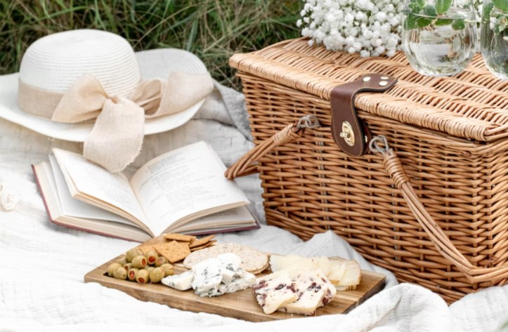
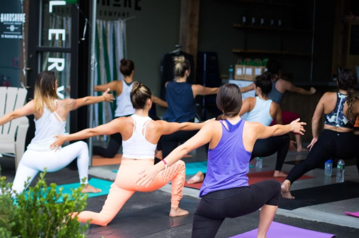
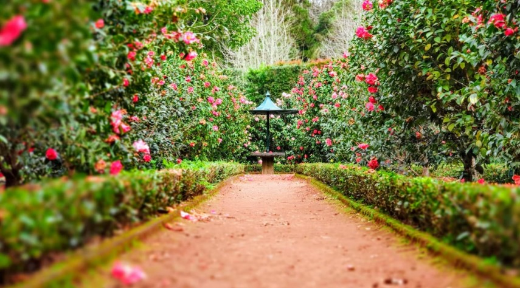
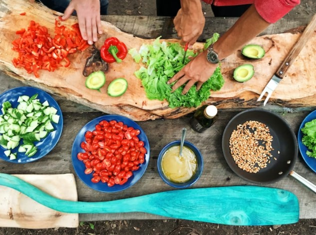
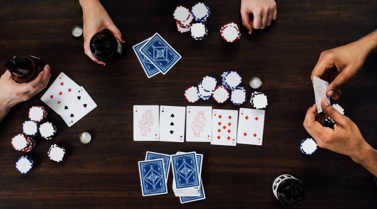
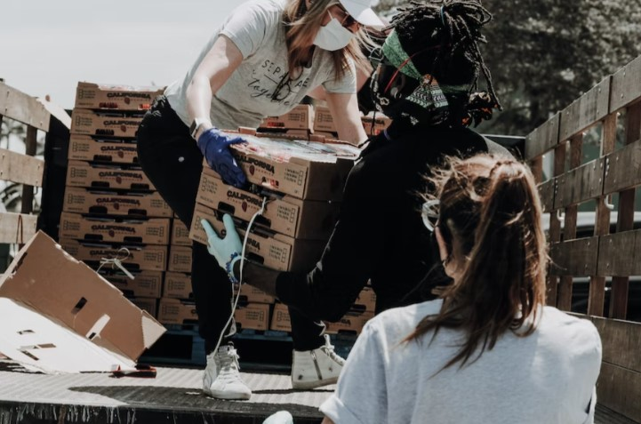

This article has been written and researched by our expert Loveable through a precise methodology. [Learn more about our methodology](https://avada.io/loveable/our-methodological.html)

[Loveable](https://avada.io/loveable/) > [Blog](https://avada.io/loveable/blog/) > [Holiday](https://avada.io/loveable/holiday/)

# 14 Mother’s Day Activities You Should Do With Your Mom

Written by [Blake Simpson](https://avada.io/loveable/author/blake/) Last Updated on June 09, 2023

- [1\. Cooking Together](https://avada.io/loveable/blog/mothers-day-activities/#wp-block-heading-2-4)
- [2\. Take a Nature Walk or Hike](https://avada.io/loveable/blog/mothers-day-activities/#wp-block-heading-2-8)
- [3\. Create a Diy gifts](https://avada.io/loveable/blog/mothers-day-activities/#wp-block-heading-2-11)
- [4\. Watch a movie or tv show](https://avada.io/loveable/blog/mothers-day-activities/#wp-block-heading-2-14)
- [5\. Attend a Virtual event or class](https://avada.io/loveable/blog/mothers-day-activities/#wp-block-heading-2-17)
- [6\. Plan a picnic](https://avada.io/loveable/blog/mothers-day-activities/#wp-block-heading-2-20)
- [7\. Have a Spa Day](https://avada.io/loveable/blog/mothers-day-activities/#wp-block-heading-2-23)
- [8\. Taking a yoga or fitness class together](https://avada.io/loveable/blog/mothers-day-activities/#wp-block-heading-2-26)
- [9\. Visit a museum or art gallery](https://avada.io/loveable/blog/mothers-day-activities/#wp-block-heading-2-29)
- [10\. Plan a garden together](https://avada.io/loveable/blog/mothers-day-activities/#wp-block-heading-2-33)
- [11\. Taking a cooking class](https://avada.io/loveable/blog/mothers-day-activities/#wp-block-heading-2-36)
- [12\. Road trip](https://avada.io/loveable/blog/mothers-day-activities/#wp-block-heading-2-39)
- [13\. Host a game night](https://avada.io/loveable/blog/mothers-day-activities/#wp-block-heading-2-42)
- [14\. Volunteer together](https://avada.io/loveable/blog/mothers-day-activities/#wp-block-heading-2-45)
- [CONCLUSION](https://avada.io/loveable/blog/mothers-day-activities/#wp-block-heading-2-48) 

Remember the person who lifts you up when you’re in trouble, who takes the time to teach you about life, who accepts to love you unconditionally. Do you think about your mother? She deserves more. If life hurts her, come back and make up for that weak heart. It doesn’t have to be vain promises or big gifts, just being together is enough. 

How long haven’t you spent time with your Mother? It’s unfilial if you really have forgotten the wonderful woman who raised you. Take advantage of this short time to love the most important woman in your life. Mother’s Day is a great occasion to express our gratitude to the significant ladies in our lives. Spending quality time together is one of the finest ways to do this. And what better way to commemorate this important day than to participate in an activity with your mother? 

This Mother’s Day, remember to honor the incredible lady who has been there for you through thick and thin. Spending time with your mother is the finest way to show her how much you love and appreciate her, whether it’s a large excursion or a tiny gesture. There is a list of **mother’s day activities** as a reference to enjoy each other’s company.

## **1\. Cooking Together**

Cooking Together

A wonderful meal maybe even more romantic than a lavishly filled restaurant. Don’t worry; even if neither of you is a cook, you can make a fantastic dinner that both of you will enjoy. The enjoyment here comes not from the food, but from the time the two spend together. The one cook, the one vice-cook, this lovely recollection will arise upon returning to the kitchen to remind one half of another. Cooking is simply an excuse to come together. It is also easy to catch simple recipes on the Internet, the breakfast is often the best choice to enjoy this moment with your mother.

**_Related_**: [34 Cooking Gifts for Home Cook That Everyone Will Adore](https://avada.io/loveable/cooking-gifts/)

## **2\. Take a Nature Walk or Hike**

**Take a Nature Walk or Hike**

It is a lovely notion to enjoy nature whenever getting exhausted because of the hustle and bustle of life. After a hard day of work, take your mother somewhere peaceful to meditate and relax. Going out to view what is happening in your world. The gorgeous sky provides us with a sense of calm and tranquility. There is no mist or smoke, only the hazy light of night stars and the dark blanket at night. Going sightseeing is also the best way to relieve stress – An ideal mother’s day activity. Selecting a wonderful place with a complete view, such as mountain peaks, a garden, or a roof, is beneficial to developing contentment. To prepare for a safe trip, don’t forget the necessary pieces of equipment for a long journey such as food, drinks, and survival tools. 

## **3\. Create a Diy gifts**

Create a Diy gifts

Handmade gifts are never underestimated because of their special value. When someone wants to show off love, to express sincerity, gifts will be an impressive way to replace what you want to say. There are many ideas for DIY gifts for your mother. Do you find that it’s difficult to do? Yes, it can be a bit complicated at first if you have never done it before. It can be a drawing paint, a key chain, or a necklace. Otherwise, it’s not bad if you ask your mother and take the time to make something together. The complete product that the two made will be a memorable keepsake for love. 

## **4\. Watch a movie or tv show**

**Watch a movie or tv show**

Seeing new movies might help you relax by producing Dopamine. Is there any program to enjoy with your mother? Ask for what the two like to see, action, horror film, or comedy show. If you have no idea about it, search on the Internet for films related to Mother’s Day. This is the time to close and express love with mom, so don’t miss this opportunity to understand each other more. Bring your blankets and cushions to the Sofa (Bedroom if a screen is available) for hours of entertainment, or go to the movies and get some popcorn and beverages to share with your mother. In the warmth of the blanket, your mother must be very happy because It is not frequent to hold her treasure in her lap.

## **5\. Attend a Virtual event or class**

Attend a Virtual event or class

Numerous supplementary classes and events to enjoy together. It is an amazing idea to do with your mom on the list of Mother’s day activities. Find out whether you and your mom have any mutual desires or hobbies. Link them to find the same ones, and then have a fun class and event together. It can be an online cooking class or a virtual music festival. When having time to do something together, it seems that time beside each other is precious and meaningful. We’re often ready to accept invitations from outsiders, so why don’t you spend a little time with the most vital person in your life?

## **6\. Plan a picnic**

**Plan a picnic**

Picnics with your mum are an excellent opportunity to spend quality time together while enjoying the beautiful outdoors. Go to the woods and get away from the city – a serene environment like that is more desirable after being immersed in manufacturing smoke and pollution. To get the most out of your picnic, choose a gorgeous place such as a park, beach, or forest. After you’ve decided on a location, make a nice and nutritious supper for both you and your mother. Bring along some entertaining items to play with, such as a deck of cards or a frisbee. Take the opportunity to catch up with your mother and exchange anecdotes about your lives while you enjoy your lunch and activities. With these easy recommendations, you’re sure to have a lovely time on your Mother’s Day picnic with your mom.

## **7\. Have a Spa Day**

Have a Spa Day

It’s good to unwind by giving your mom a massage. Arrange a massage at a local spa or get some high-quality skincare to do yourself at home, such as homemade masks, scrubs, and other beauty treatments. Some scented candles and music should be added to the backdrop if proper preparation has been made. You may fulfill both by hiring a skilled massage therapist. You will have fantastic relaxing moments thanks to their skills. Enjoy a selection of services, such as facials, massages, or pedicures, and relax while catching up with your mum. Have a delicious and refreshing dinner after your treatments, and then continue to relax and enjoy each other’s company. A spa day is an ideal opportunity to pamper yourself while also showing your mother how much you love her.

## **8\. Taking a yoga or fitness class together**

**Taking a yoga or fitness class together**

A hectic lifestyle causes you to develop various undesirable habits, such as taking night showers and staying up late. That may be fine for the time being, but if you continue to keep it, it may eventually harm your health. Recognize the value of health as soon as possible and set a resolution to start a new exercise regimen this time with your mother. Attending a yoga or fitness class with your mother might be an unforgettable experience. Not only will you both benefit from better physical health and less stress and worry, but you’ll also have the opportunity to build your relationship and make amazing memories. Spend some time each day to jog or practice yoga; you’ll feel so much better. 

## **9\. Visit a museum or art gallery**

Visit a museum or art gallery

One more meaningful Mother’s day activity is to experience a museum and art gallery not only a terrific way to bond over a shared love in culture and the arts, but it also allows you to learn and grow together. You and your mother may discover diverse civilizations, learn about the history and significance of each piece, and enjoy the exhibition’s beauty together. It’s an opportunity to improve your knowledge and perspective of the world while also spending quality time with your mum. Some great places to visit with your mother include the Louvre Museum in Paris, the Metropolitan Museum of Art in New York City, or the National Gallery in London or some Virtual Museum Tours & Online Art Gallery. 

**Đề suất những nơi có thể đi**

## **10\. Plan a garden together**

**Plan a garden together**

Planning a garden with your mother is one way to make Mother’s Day more memorable. This activity may be a terrific opportunity for family members to spend quality time together and make memorable memories. To begin, select a sunny location to ensure that your garden receives adequate sunshine. When you’ve located the ideal location, it’s time to decide on the style of garden you want. It is critical to engage your mother in all the stages of the process, from selecting the plants to planting them. This will instill a sense of ownership and pride in the garden that you and your partner have worked so hard to develop. You may also photograph the garden as it grows to capture the process and reflect back on the memories.

## **11\. Taking a cooking class**

Taking a cooking class

On Mother’s Day, taking [a cooking class](https://www.forbes.com/sites/irenelevine/2021/05/01/mothers-day-gift-guide-best-virtual-cooking-classes/?sh=646bbfab5ada) with your mother is a lovely way to bond and create lasting memories. You will not only learn new culinary skills and dishes, but you will also get the chance to collaborate and deepen your connection. Preparing and sharing a meal with your mother is an ideal way to express your love and appreciation for her. Furthermore, you may utilize the techniques and recipes you learn in the cooking class to prepare wonderful meals for years to come. Therefore, it won’t disappoint you and your mother.

## **12\. Road trip**

**Road trip**

After a long day of work, she deserves to relax. A fresh journey, new experiences to greet life and learning more. Tired of the city’s hustle and bustle, a natural setting is a fantastic alternative for a day of leisure. It is up to you whether to go somewhere overpowering or tranquil as long as both of you can recharge your batteries. Some recommendations can be on the beach, forest, or hill. It’s even more magnificent if the two can spend time overnight. Remember to prepare some favorite snacks to enjoy the environmentally-friendly nature. A telescope isn’t necessary; the sensation may be felt with the naked eye as well.

## **13\. Host a game night**

Host a game night

Looking for a unique way to spend Mother’s Day with your mother? Why not organize a game night? Today, games are no longer strange to young people, but this time, let’s try to play with your mother. It’s believed that it will help her release Dopamine to relax when being stressed. Bring your family and friends, some food and beverages, and some of your mother’s favorite pastimes. Spending the evening playing together, whether it’s a classic board game or a more modern one, is a terrific way to bond and build lasting memories. So, prepare to throw the dice, shuffle the deck, Truth or Dare and have a great time with your mother on this important day! It’s perfect when everyone can enjoy themselves together.

## **14\. Volunteer together**

**Volunteer together**

It’s fantastic to be able to share with people, to be able to do something that makes us proud of ourselves in retrospect. This is a wonderful Mother’s Day activity that will undoubtedly make her proud of her child. Don’t be scared, and know that we will cherish our time together. Expensive trips and lavish purchases of shiny objects are useless. Why are you considering volunteering? When you bring happiness to someone else, you receive it as well. A journey is undoubtedly worthwhile to see the innocent grins of the underprivileged and realize how fortunate our lives have been. How much money you make yourself is not as valuable as how many people you have helped.

## **CONCLUSION** 

Mother’s Day is a wonderful event that deserves to be marked by thoughtful and memorable activities. These **14 Mother’s Day Activities You Should Do With Your Mom** provide a variety of possibilities, whether you want to relax and unwind with your mom or embark on an adventure. 

The choices are numerous for doing, from making a meal together to going on a gorgeous trek. By spending quality time with your mother, you are not only demonstrating your love for her, but you are also making memories that will last a lifetime. Thus, whether you decide to organize a game night, go on a shopping binge, or simply spend the day at home, make the most of every time with your mother on this special day. 

- [1\. Cooking Together](https://avada.io/loveable/blog/mothers-day-activities/#wp-block-heading-2-4)
- [2\. Take a Nature Walk or Hike](https://avada.io/loveable/blog/mothers-day-activities/#wp-block-heading-2-8)
- [3\. Create a Diy gifts](https://avada.io/loveable/blog/mothers-day-activities/#wp-block-heading-2-11)
- [4\. Watch a movie or tv show](https://avada.io/loveable/blog/mothers-day-activities/#wp-block-heading-2-14)
- [5\. Attend a Virtual event or class](https://avada.io/loveable/blog/mothers-day-activities/#wp-block-heading-2-17)
- [6\. Plan a picnic](https://avada.io/loveable/blog/mothers-day-activities/#wp-block-heading-2-20)
- [7\. Have a Spa Day](https://avada.io/loveable/blog/mothers-day-activities/#wp-block-heading-2-23)
- [8\. Taking a yoga or fitness class together](https://avada.io/loveable/blog/mothers-day-activities/#wp-block-heading-2-26)
- [9\. Visit a museum or art gallery](https://avada.io/loveable/blog/mothers-day-activities/#wp-block-heading-2-29)
- [10\. Plan a garden together](https://avada.io/loveable/blog/mothers-day-activities/#wp-block-heading-2-33)
- [11\. Taking a cooking class](https://avada.io/loveable/blog/mothers-day-activities/#wp-block-heading-2-36)
- [12\. Road trip](https://avada.io/loveable/blog/mothers-day-activities/#wp-block-heading-2-39)
- [13\. Host a game night](https://avada.io/loveable/blog/mothers-day-activities/#wp-block-heading-2-42)
- [14\. Volunteer together](https://avada.io/loveable/blog/mothers-day-activities/#wp-block-heading-2-45)
- [CONCLUSION](https://avada.io/loveable/blog/mothers-day-activities/#wp-block-heading-2-48) 

### [Blake Simpson](https://avada.io/loveable/author/blake/)

Hi, I'm Blake from Loveable. I help people find perfect gifts for occasions like anniversaries and weddings. I also write a blog about holidays, sharing insights to make them more meaningful. Let's create unforgettable moments together!

- [Twitter](https://twitter.com/intent/tweet)
- [Facebook](https://www.facebook.com/sharer/sharer.php)
- [instagram](https://avada.io/loveable/blog/mothers-day-activities/)
- [pinterest](https://www.pinterest.com/loveablellc/)

## Related Posts

[### 120+ Christian Birthday Wishes To Spread Your Love](https://avada.io/loveable/blog/christian-birthday-wishes/) 

[

### 35 Best 70th Birthday Ideas To Celebrate The Special Milestone

](https://avada.io/loveable/blog/70th-birthday-ideas/)

[

### 50 Best 30th Birthday Decorations for a Remarkable Birthday Bash

](https://avada.io/loveable/blog/30th-birthday-decorations/)

[

### 40 Delicious Vegan Christmas Desserts to Delight Your Palate

](https://avada.io/loveable/blog/vegan-christmas-desserts/)

[

### 60 Christmas Team Building Activities to Boost Workplace Spirit

](https://avada.io/loveable/blog/christmas-team-building-activities/)
