This article has been written and researched by our expert Loveable through a precise methodology. [Learn more about our methodology](https://avada.io/loveable/our-methodological.html)

[Loveable](https://avada.io/loveable/) > [Blog](https://avada.io/loveable/blog/) > [Holiday](https://avada.io/loveable/holiday/)

# 15 Best Baddie Halloween Costumes In 2023

Written by [Blake Simpson](https://avada.io/loveable/author/blake/) Last Updated on September 12, 2023

- [Significance of Baddie Halloween Costumes](https://avada.io/loveable/blog/baddie-halloween-costumes/#wp-block-heading-2-3)
- [Popular Baddie Halloween Costume Ideas](https://avada.io/loveable/blog/baddie-halloween-costumes/#wp-block-heading-2-9)
    - [1\. Maleficent from “Sleeping Beauty”](https://avada.io/loveable/blog/baddie-halloween-costumes/#wp-block-heading-3-10)
    - [2\. Ursula from “The Little Mermaid”](https://avada.io/loveable/blog/baddie-halloween-costumes/#wp-block-heading-3-17)
    - [3\. The Joker from “Batman”](https://avada.io/loveable/blog/baddie-halloween-costumes/#wp-block-heading-3-25)
    - [4\. Cruella de Vil from “101 Dalmatians”](https://avada.io/loveable/blog/baddie-halloween-costumes/#wp-block-heading-3-33)
    - [5\. The Woman in Black – The Woman in Black](https://avada.io/loveable/blog/baddie-halloween-costumes/#wp-block-heading-3-41)
    - [6\. Wicked Witch of the West from “The Wizard of Oz”](https://avada.io/loveable/blog/baddie-halloween-costumes/#wp-block-heading-3-49)
    - [7\. Count Dracula – Dracula](https://avada.io/loveable/blog/baddie-halloween-costumes/#wp-block-heading-3-57)
    - [8\. Scar – The Lion King](https://avada.io/loveable/blog/baddie-halloween-costumes/#wp-block-heading-3-65)
    - [9\. Captain Hook – Peter Pan](https://avada.io/loveable/blog/baddie-halloween-costumes/#wp-block-heading-3-72)
    - [10\. The Evil Queen – Snow White and the Seven Dwarfs](https://avada.io/loveable/blog/baddie-halloween-costumes/#wp-block-heading-3-79)
    - [11\. Iago – Othello](https://avada.io/loveable/blog/baddie-halloween-costumes/#wp-block-heading-3-85)
    - [12\. Lady Macbeth – Macbeth](https://avada.io/loveable/blog/baddie-halloween-costumes/#wp-block-heading-3-93)
    - [13\. Fagin – Oliver Twist](https://avada.io/loveable/blog/baddie-halloween-costumes/#wp-block-heading-3-99)
    - [14\. Monsieur Thénardier – Les Misérables](https://avada.io/loveable/blog/baddie-halloween-costumes/#wp-block-heading-3-106)
    - [15\. Harley Quinn from “Suicide Squad”](https://avada.io/loveable/blog/baddie-halloween-costumes/#wp-block-heading-3-112)
- [Tips for Creating Baddie Halloween Costumes](https://avada.io/loveable/blog/baddie-halloween-costumes/#wp-block-heading-2-121)
    - [1\. Emphasizing Villainous Traits](https://avada.io/loveable/blog/baddie-halloween-costumes/#wp-block-heading-3-123)
    - [2\. Attention to Detail in Makeup and Accessories](https://avada.io/loveable/blog/baddie-halloween-costumes/#wp-block-heading-3-126)
    - [3\. Incorporating Signature Colors or Symbols](https://avada.io/loveable/blog/baddie-halloween-costumes/#wp-block-heading-3-129)
    - [4\. Confidence and Attitude in Portrayal](https://avada.io/loveable/blog/baddie-halloween-costumes/#wp-block-heading-3-132)
- [Baddie Halloween Costumes – In Conclusion](https://avada.io/loveable/blog/baddie-halloween-costumes/#wp-block-heading-2-136)

Halloween has arrived! Tired of the traditional black [cat costume](https://avada.io/loveable/cat-costumes/)? Sick of wearing the same old ghost outfit from last year? We can relate! Dressing up in our spookiest and most unique Halloween attire is something we all enjoy to truly embrace the spirit of the holiday. 

To help you get inspired and stay true to our expertise, we’ve come up with some ideas centered around [villainous characters](https://avada.io/loveable/blog/famous-halloween-cartoon-characters/). Check out our **top 15 suggestions for baddie Halloween costumes** right here.

## **Significance of Baddie Halloween Costumes**

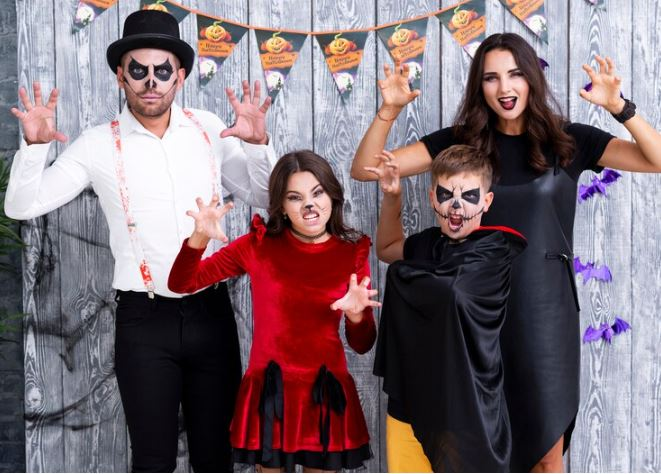

Baddie Halloween costumes hold a unique significance in the realm of costume choices for this spooky holiday. While traditional Halloween costumes often revolve around the idea of heroes and characters embodying good, baddie costumes offer a refreshing twist by embracing the dark side. These costumes allow individuals to tap into their mischievous, rebellious, or wicked personas, providing a thrilling departure from the norm.

- One of the key significances of baddie Halloween costumes lies in the opportunity for self-expression. By embodying iconic villains like Maleficent or The Joker, individuals can explore different facets of their personalities, showcasing their edgier side and challenging societal norms. Baddie costumes provide an outlet for creativity, allowing individuals to reimagine and reinterpret these notorious characters, adding their own personal flair.
- Additionally, baddie costumes often convey a sense of power and confidence. These characters exude charisma, charm, and an air of mystery, allowing the wearer to step into a role that commands attention and captivates others. Donning a baddie costume can be empowering, enabling individuals to embrace their own strength and assertiveness.
- Last but not least, baddie Halloween costumes serve as a celebration of the darker and more complex aspects of human nature. They remind us that there is beauty in embracing our flaws and exploring the multifaceted nature of our personalities. So, this Halloween, unleash your inner villain and revel in the significance of a baddie costume that dares to challenge the status quo.

## **Popular Baddie Halloween Costume Ideas**

### **1\. Maleficent from “Sleeping Beauty”**

Maleficent from “Sleeping Beauty” is not just any baddie Halloween costumes, it’s THE baddie Halloween costume! With her iconic black horns, flowing black gown, and piercing green eyes, Maleficent is the epitome of wickedness and style. 

Stepping into her shoes allows you to channel your inner villainess and embrace your dark side. Whether you’re attending a themed party or going trick-or-treating, Maleficent’s presence will surely leave a lasting impression. 

**Take a look:**

[**Women’s Disney Sleeping Beauty Maleficent Deluxe Costume**](https://www.amazon.com/Disney-Maleficent-Deluxe-Costume-Disguise/dp/B00006CFCX)

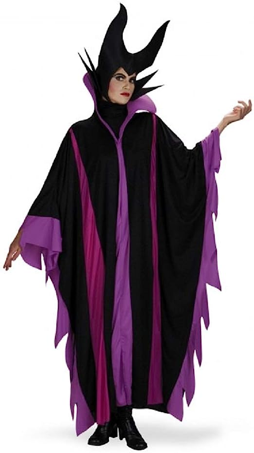

Made from 100% polyester, this costume is both comfortable and durable. The full-length tunic features an attached collar and a foam hood, allowing you to fully embody Maleficent’s wickedness. Whether you’re attending a Halloween party, [celebrating a birthday](https://avada.io/loveable/birthday/), or just want to have a fun-filled night, this costume is perfect for any occasion. 

### **2\. Ursula from “The Little Mermaid”**

Ursula from “The Little Mermaid” is undeniably one of the most iconic and mesmerizing baddie Halloween costumes out there. With her fierce personality and distinctive appearance, Ursula has become a popular choice for those looking to rock a truly wicked Halloween look. 

So, if you’re ready to embrace your dark side and unleash your inner sea witch, consider donning an Ursula costume this Halloween and let your enchanting presence be felt. 

**Take a look:**

[**Disney Little Mermaid Prestige Women Ursula Costume**](https://www.amazon.com/Disney-Little-Mermaid-Prestige-Costume/dp/B08HSNRS2Y)

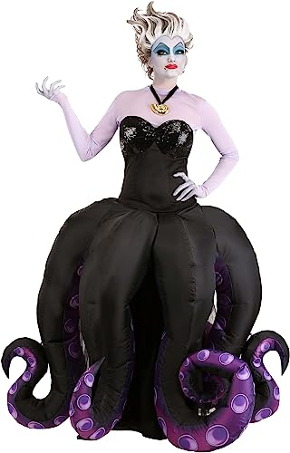

The long-sleeved purple shirt, made from airy mesh material, ensures comfort and breathability. The dress features a dazzling sequin chest area and a convenient zipper down the center back. 

But wait, there’s more! The inflatable skirt overlay, attached at the waist with a secure hook and loop fastener, adds a touch of whimsy and drama. Transform yourself into the wickedly captivating Ursula and make a splash at any costume party or Disney-themed event.

### **3\. The Joker from “Batman”**

Looking for the perfect costume to channel your inner baddie this Halloween? Look no further than the notorious Joker from “Batman”! This iconic character is not only the ultimate embodiment of chaos and mischief, but he also makes for an incredibly captivating and engaging Halloween costume. 

With his vibrant purple suit, green hair, and menacing grin, the Joker is guaranteed to turn heads and make a lasting impression wherever you go. 

**Take a look:**

[**Batman The Dark Knight Deluxe The Joker Child Costume**](https://www.amazon.com/Batman-Knight-Deluxe-Costume-Childs/dp/B001ER6PUC/)

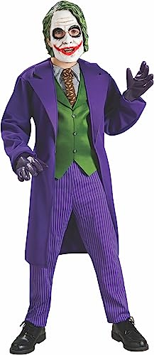

This deluxe costume set is straight out of THE DARK KNIGHT TRILOGY, ensuring an authentic and thrilling experience. The long sleeve jacket, attached shirt front, green vest front and tie, pinstripe pants, and overhead mask create a truly menacing look. 

With the trademark logo on the package and label, you can be confident that you’ve received a genuine safety-tested item. Let your excitement run wild as you transform into the Clown Prince of Crime and bring chaos to Halloween night.

### **4\. Cruella de Vil from “101 Dalmatians”**

This iconic character is the epitome of bad girl style, with her black and white ensemble, fiery red lips, and that signature two-toned hair. With just the right amount of attitude, you can channel your inner villain and turn heads wherever you go.

Bring out your wicked side and embrace the dark glamour of this notorious character. From her dramatic hair to her fur-trimmed coat, Cruella’s style is all about making a bold statement. 

**Take a look:**

[**Women’s Plus Size Cruella De Vil Stole Costume**](https://www.amazon.com/Womens-Plus-Cruella-Stole-Costume/dp/B09FQF8698)

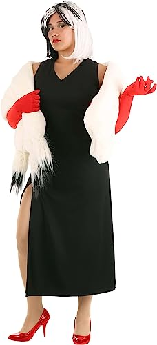

Designed with impeccable attention to detail, this costume is a must-have for any Halloween party or cosplay event. Made from premium fabrics and faux fur, it not only looks stunning but also feels incredibly comfortable. 

The plus-size design ensures a perfect fit to make you feel confident and empowered. With its durability, you can wear this costume year after year, making it a fantastic investment. 

### **5\. The Woman in Black – The Woman in Black**

The Woman In Black, a West End play ghost, is a spine-chilling character. With just 2 characters in the entire play, it manages to create a haunting atmosphere. 

Adapted from Susan Hill’s horror novella, the story revolves around Arthur Kipps, a lawyer, who encounters the mysterious presence of a woman dressed in black at a funeral. From there, things rapidly spiral out of control. It’s quite clear which color costume would be appropriate for this character – black, of course!

**Take a look:**

[**Lady in Black Women’s Ghost Costume**](https://www.amazon.com/Black-Womens-Ghost-Costume-X-Large/dp/B07TCNXRRD)

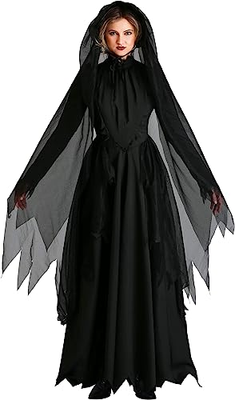

Step into the world of mystery and enchantment with our Lady in Black Women’s Ghost Costume. Made with 100% polyester poplin and knit mesh fabrics, this costume is both comfortable and bewitching. 

The dress features a back zipper for easy wear and a princess-cut bodice gathered into a high neckline, adding an elegant touch. The long leg-o’-mutton sleeves with sheer mesh cuffs add an ethereal and haunting allure. 

### **6\. Wicked Witch of the West from “The Wizard of Oz”**

Indeed, a witch is a popular and predictable Halloween costume option. However, this particular witch is no ordinary one. She possesses the power to command a pack of wolves and a swarm of bees, and her ultimate goal is to eliminate Dorothy and seize control of the land of Oz. 

This portrayal of the witch, characterized by her green skin, can be seen in both the iconic 1939 film adaptation of L. Frank Baum’s original book and the musical version, Wicked. So, it’s time to bring out the green face paint and embrace the wickedness!

**Take a look:**

[**Wizard of Oz Wicked Witch of The West Costume**](http://amazon.com/Wizard-Wicked-Witch-Costume-Medium/dp/B00BJH3L0O)

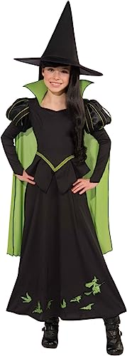

This enchanting ensemble features a long sleeve, full-length dress in mesmerizing shades of green and black. The peplum style top and printed green wicked witch and winged monkey pattern on the skirt exude an air of wickedness. 

With an attached mid-length green cape and a black pointed hat, you’ll feel like the iconic witch herself. Get ready to cast spells and captivate everyone at your next costume party!

### **7\. Count Dracula – Dracula**

If you’re interested in embracing your vampire side, take inspiration from The Count, the ultimate vampire archetype. This character, hailing from Transylvania and boasting centuries of existence, is not just a vampire but also a skilled sorcerer. 

Unlike many vampire portrayals, The Count is surprisingly charming. So, start practicing those accents and cultivating some charisma to match your cape!

**Take a look:**

[**Halloween Vampire Costume**](https://www.amazon.com/Spooktacular-Creations-Renaissance-Halloween-Role-Playing/dp/B07W3PTKPP/)

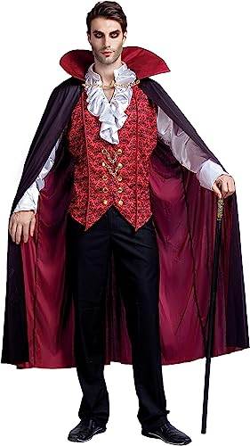

This terrifyingly thrilling outfit includes everything you need to transform into Count Dracula himself. The detailed vest, shirt, scepter, and cape are made with care from 100% polyester, ensuring durability for endless nights of haunting. 

Whether you’re attending a spooky Halloween party or simply want to add some excitement to your holiday event, this is the ideal scary vampire costume for men. So get your fangs ready, embrace the darkness, and prepare to leave a lasting impression wherever you go!

### **8\. Scar – The Lion King**

Scar, the main villain in The Lion King, is a fierce African lion who makes a great choice for those who want to dress up as an animal. In both the musical and the 1994 film, Scar is determined to take over the throne and goes as far as plotting to kill Simba’s father, Mufasa. If that’s not the epitome of evil, I don’t know what is.

**Take a look:**

[**Furry Costume Ears and Tail Set**](https://www.amazon.com/FRCOLOR-Headband-Accessories-Halloween-Costume/dp/B096JJRSRZ)

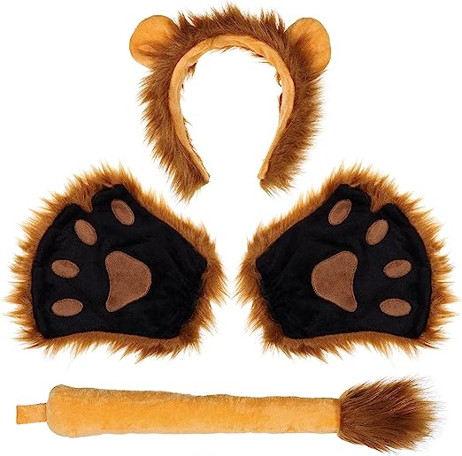

Transform into a wild creature with our Furry Costume Ears and Tail Set! Perfect for baddie Halloween costumes or any dress-up occasion, this set includes an adorable ears headband, paw mittens, and a fluffy tail. Made from high-quality artificial fur, it feels just like the real thing! 

Whether you’re a kid or an adult, this costume set will make you the life of the party. Get ready to pounce and play with excitement! Don’t miss out on the chance to bring your wildest fantasies to life – order now!

### **9\. Captain Hook – Peter Pan**

Captain Hook, the notorious leader of the Jolly Roger and Peter Pan’s arch-nemesis, boasts a striking costume element that is bound to leave a lasting impression – his iron hook, a menacing replacement for the hand he lost to Peter Pan! Imagine the chilling experience of shaking that hand on a dark, eerie night.

**Take a look:**

[**Child Peter Pan Costume**](https://www.amazon.com/Little-Adventures-Child-Costume-Medium/dp/B07N6LZCY2)

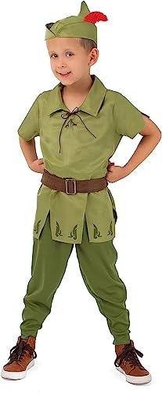

This 4-piece set includes a comfortable top, pants, adjustable hook and loop belt, and a classic cap with a vibrant red fabric feather. Watch as your child’s imagination takes flight, as they embark on thrilling adventures in the enchanting world of Neverland. 

Perfect for Halloween, dress-up parties, or simply for hours of imaginative play, this Peter Pan costume will make your little one feel like the hero of their own fairy tale. Get ready for endless fun and excitement with our Child Peter Pan Costume!

### **10\. The Evil Queen – Snow White and the Seven Dwarfs**

This individual is entirely fixated on being the most attractive person in the area, much like a contemporary version of Jordan. Suppose you are interested in embodying the persona of a classic diva (with a touch of extravagance). In that case, you will require a Magic Mirror to check your appearance regularly, a lavish cape, and a crown.

**Take a look:**

[**Disney Evil Queen Headband Crown and Cape with Collar Kit**](https://www.amazon.com/Disneys-White-Headband-Collar-elope/dp/B073H1NM6P)

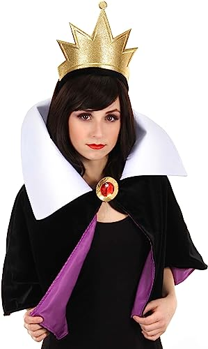

This adult accessory set is designed to bring out your inner villain and make a statement at any costume party or event. Made from 100% polyester, the short cape features a wide white collar, while the cape itself boasts a black velvet outer shell and a luxurious purple satin lining. The crown is securely sewn to an elastic headband, ensuring a comfortable fit for all. 

### **11\. Iago – Othello**

In Shakespeare’s play Othello, Iago is portrayed as the most malevolent character who harbors a deep hatred for the main protagonist. He cunningly concocts a scheme to destroy Othello by manipulating him into believing that his wife is having an affair with his lieutenant. 

What makes Iago particularly deceitful is that Othello places great trust in him, exemplifying the saying “keep your friends close and your enemies closer.” Get ready to immerse yourself in this treacherous character as we delve into the world of Othello.

**Take a look:**

[**Men Steampunk Medieval Jacket**](https://www.amazon.com/dp/B0BV29CVT2)

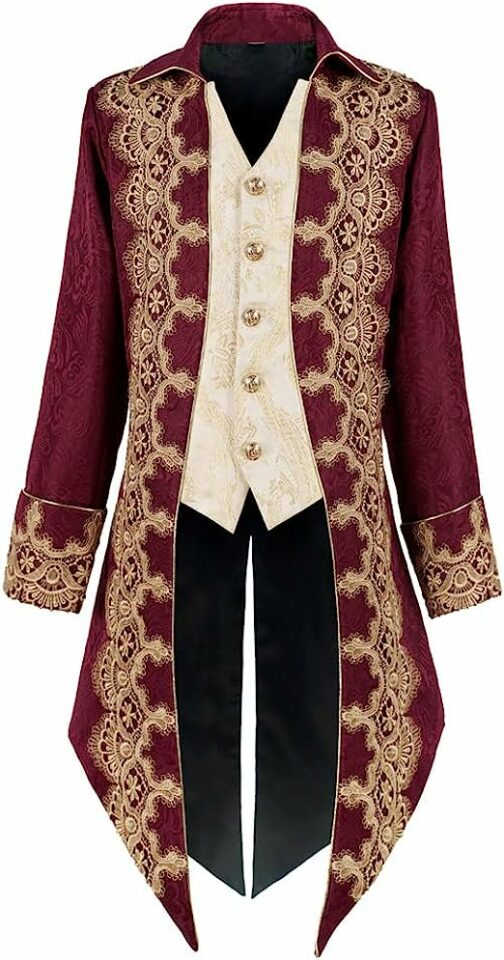

Introducing our Men Steampunk Medieval Jacket, the epitome of style and adventure! Crafted with passion and attention to detail, this Gothic Victorian Frock Coat Uniform is designed to make heads turn. Made with durable polyester, it offers comfort and longevity. 

The button closure adds a touch of sophistication, while the machine wash feature ensures easy maintenance. Whether you’re attending a themed party or simply want to make a bold fashion statement, this jacket is your perfect companion. 

### **12\. Lady Macbeth – Macbeth**

Lady Macbeth, a character from Shakespeare’s plays, is portrayed as the most wicked of all his female characters. She manipulates her husband into murdering the king in order to seize the throne of Scotland. To embody her character, consider wearing a wig with long, braided hair and dressing in traditional 16th-century attire.

**Take a look:**

[**Hooded Gothic Dress Gown**](https://www.amazon.com/Sinastar-Medieval-Vintage-Trumpet-Sleeves/dp/B07G796ZXX)

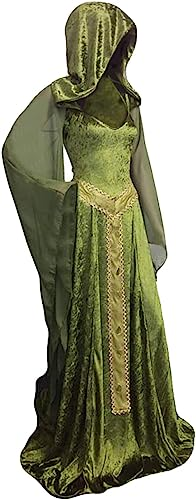

Crafted with exquisite attention to detail, this medieval-inspired masterpiece features a floor-length design adorned with luxurious velvet and intricate lace-up detailing at the back. The dramatic hood and trumpet sleeves add an air of mystery and allure, making it the perfect choice for baddie Halloween costumes, theme parties, photo shoots, or any special occasion. Embrace your inner enchantress and let this stunning gown transport you to a realm of dark beauty!

### **13\. Fagin – Oliver Twist**

Charles Dickens’ fictional character Fagin assumes the role of a mentor to a band of children, urging them to engage in activities such as pickpocketing, smoking, and drinking. Fagin’s appearance is described as “grotesque.” For those seeking to fully embrace the eerie ambiance of Halloween, Fagin is the perfect choice.

**Take a look:**

[**Black Felt Top Hat**](https://www.amazon.com/Skeleteen-Black-Felt-Top-Hat/dp/B07GVNWCZY)

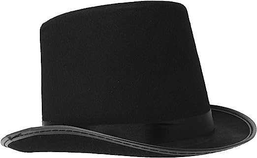

Perfect for Fagin – Oliver Twist, or anyone looking to make a stylish statement, this Victorian-style stovepipe tophat is a must-have accessory. Made from high-quality felt, it is designed to fit men, women, and even kids. 

Pair it with a tuxedo jacket, a crisp white shirt, and a satin bowtie for a look that exudes sophistication and elegance, just like Abraham Lincoln. Whether you’re dressing up for a Halloween party or a theatrical performance, our black felt top hat will add an extra touch of excitement and charm to your ensemble. 

### **14\. Monsieur Thénardier – Les Misérables**

Meet Monsieur Thénardier, the notorious antagonist of the highly acclaimed musical, Les Misérables, which has been running for years in London’s West End. Inspired by Victor Hugo’s novel, Thénardier is portrayed as a heartless and money-driven individual. Alongside his equally deceitful wife, they engage in various dishonest activities such as swindling their inn’s patrons, resorting to begging, and even stealing.

**Take a look:**

[**Les Miserables Monsieur Thenardier Cosplay Costume**](https://www.amazon.com/CosplayDiy-Musical-Miserables-Monsieur-Thenardier/dp/B07GGWK2M5/)

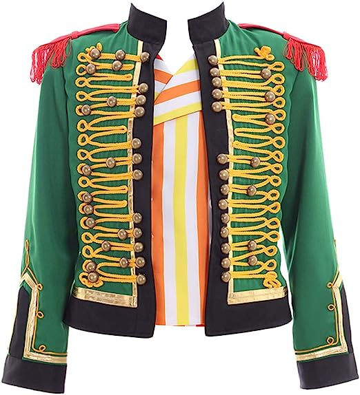

Step into the world of Les Miserables with our Monsieur Thenardier Cosplay Costume! This men’s jacket is meticulously crafted from premium uniform cloth, ensuring durability and authenticity. With its intricate design and attention to detail, you’ll feel like you’ve stepped right into the iconic musical. Whether you’re attending a convention, performing in a play, or simply expressing your [love for the arts](https://avada.io/loveable/gifts-for-art-lovers/), this costume is a must-have.

### **15\. Harley Quinn from “Suicide Squad”**

Harley Quinn from “Suicide Squad” is undeniably one of the most iconic and popular choices when it comes to baddie Halloween costumes. With her quirky, mischievous personality and distinctive red and blue pigtails, she has become a favorite among both comic [book fans](https://avada.io/loveable/gifts-book-lovers/) and movie enthusiasts. 

Embracing the rebellious and unpredictable side of Halloween, dressing up as Harley Quinn allows individuals to tap into their inner baddie and unleash their wild side. Whether it’s sporting her signature “Daddy’s Little Monster” t-shirt or donning her playful jester outfit, this costume choice is guaranteed to turn heads and make a bold statement. 

**Take a look:**

[Suicide Squad Harley Quinn Premium Costume](https://www.amazon.com/Charades-Womens-Suicide-Costume-X-Large/dp/B01LWS3WAC/)

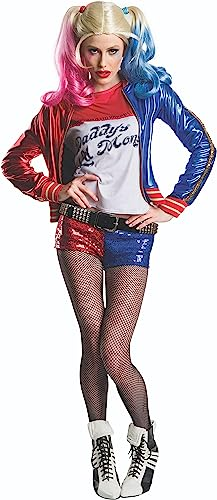

The pullover shirt features eye-catching graphics on the front, while the jacket boasts a zipper down the center front and sequins down the sleeves for a touch of glam. The sequin shorts have an elastic waistband for the perfect fit. 

Whether it’s for Halloween or a cosplay event, this costume will surely make heads turn, and hearts skip a beat. Embrace your inner villainess and unleash your excitement with this premium costume!

**_Related_**: Best [**Halloween Gifts For Adults**](https://avada.io/loveable/halloween-gifts-adults/) Who Love This Spooky Holiday

## **Tips for Creating Baddie Halloween Costumes**

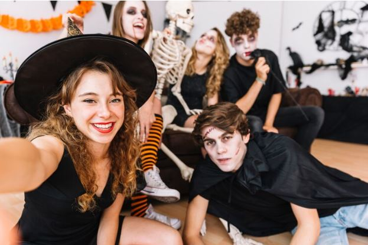

### **1\. Emphasizing Villainous Traits**

To create an authentic baddie Halloween costume, focus on emphasizing the villainous traits of your chosen character. Study their mannerisms, body language, and facial expressions, and try to mimic them. Whether it’s a sly smile, an air of superiority, or a menacing glare, embodying these traits will bring your costume to life and make it more convincing.

The essence of baddie Halloween costumes lies in accurately capturing the character’s villainous traits. By paying attention to their mannerisms and expressions, you can effectively embody the character’s personality and create a more convincing portrayal. This helps you bring the baddie to life and allows others to recognize and connect with the character you’re portraying.

### **2\. Attention to Detail in Makeup and Accessories**

Makeup and accessories play a crucial role in transforming your appearance into that of a baddie. By using bold and dramatic techniques, you enhance the visual impact of your costume and make it more striking. Additionally, carefully chosen accessories that align with the character’s style add depth and authenticity to your overall look.

Don’t underestimate the power of makeup and accessories in transforming into a baddie. Pay attention to the smallest details to achieve a truly immersive look. Experiment with bold and dramatic makeup techniques, such as smoky eyes, exaggerated contouring, or vibrant lip colors. Enhance your costume with carefully selected accessories that reflect the character’s style, like ornate jewelry for Maleficent or a deck of cards for The Joker.

### **3\. Incorporating Signature Colors or Symbols**

Signature colors and symbols are synonymous with iconic baddie characters and are often instantly recognizable. By incorporating these elements into your costume, you establish a strong visual connection to the character and enhance the overall cohesiveness of your look. This attention to detail helps others identify your costume and adds an extra layer of authenticity.

Research the character’s color palette and incorporate it into your outfit and makeup choices. Whether it’s Maleficent’s deep purples and greens or The Joker’s vibrant purple and green combination, using these colors as accents throughout your costume will instantly make it recognizable and visually striking.

### **4\. Confidence and Attitude in Portrayal**

Baddie characters are known for their confidence, charisma, and attitude. By embodying these qualities, you make your portrayal more engaging and captivating. Confidence in your costume and the attitude you bring to the character allows you to fully embrace the role, making it more convincing and memorable for yourself and those around you.

Channel the character’s charisma and self-assuredness, and let it shine through your portrayal. Walk with purpose, speak with conviction, and maintain a commanding presence. Remember, it’s not just about the costume; it’s about how you carry yourself and the energy you exude. Embrace your inner villain and embrace the power that comes with it.

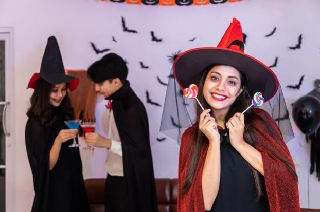

## **Baddie Halloween Costumes – In Conclusion**

**Baddie Halloween costumes** offer a thrilling departure from traditional hero-based outfits, allowing individuals to embrace their darker side and explore the allure of iconic villains. By emphasizing villainous traits, paying attention to detail in makeup and accessories, incorporating signature colors or symbols, and exuding confidence and attitude in portrayal, you can create a baddie costume that captivates and mesmerizes. 

Whether you choose to channel the bewitching elegance of Maleficent or the chaotic energy of The Joker, these baddie Halloween costumes provide a starting point to unlock your creativity and bring these iconic characters to life. So, this Halloween, dare to be different and embrace the power of a baddie costume that will leave a lasting impression on everyone who crosses your path. Unleash your inner villain and step into a world of dark enchantment and mischief. Happy haunting!

- [Significance of Baddie Halloween Costumes](https://avada.io/loveable/blog/baddie-halloween-costumes/#wp-block-heading-2-3)
- [Popular Baddie Halloween Costume Ideas](https://avada.io/loveable/blog/baddie-halloween-costumes/#wp-block-heading-2-9)
    - [1\. Maleficent from “Sleeping Beauty”](https://avada.io/loveable/blog/baddie-halloween-costumes/#wp-block-heading-3-10)
    - [2\. Ursula from “The Little Mermaid”](https://avada.io/loveable/blog/baddie-halloween-costumes/#wp-block-heading-3-17)
    - [3\. The Joker from “Batman”](https://avada.io/loveable/blog/baddie-halloween-costumes/#wp-block-heading-3-25)
    - [4\. Cruella de Vil from “101 Dalmatians”](https://avada.io/loveable/blog/baddie-halloween-costumes/#wp-block-heading-3-33)
    - [5\. The Woman in Black – The Woman in Black](https://avada.io/loveable/blog/baddie-halloween-costumes/#wp-block-heading-3-41)
    - [6\. Wicked Witch of the West from “The Wizard of Oz”](https://avada.io/loveable/blog/baddie-halloween-costumes/#wp-block-heading-3-49)
    - [7\. Count Dracula – Dracula](https://avada.io/loveable/blog/baddie-halloween-costumes/#wp-block-heading-3-57)
    - [8\. Scar – The Lion King](https://avada.io/loveable/blog/baddie-halloween-costumes/#wp-block-heading-3-65)
    - [9\. Captain Hook – Peter Pan](https://avada.io/loveable/blog/baddie-halloween-costumes/#wp-block-heading-3-72)
    - [10\. The Evil Queen – Snow White and the Seven Dwarfs](https://avada.io/loveable/blog/baddie-halloween-costumes/#wp-block-heading-3-79)
    - [11\. Iago – Othello](https://avada.io/loveable/blog/baddie-halloween-costumes/#wp-block-heading-3-85)
    - [12\. Lady Macbeth – Macbeth](https://avada.io/loveable/blog/baddie-halloween-costumes/#wp-block-heading-3-93)
    - [13\. Fagin – Oliver Twist](https://avada.io/loveable/blog/baddie-halloween-costumes/#wp-block-heading-3-99)
    - [14\. Monsieur Thénardier – Les Misérables](https://avada.io/loveable/blog/baddie-halloween-costumes/#wp-block-heading-3-106)
    - [15\. Harley Quinn from “Suicide Squad”](https://avada.io/loveable/blog/baddie-halloween-costumes/#wp-block-heading-3-112)
- [Tips for Creating Baddie Halloween Costumes](https://avada.io/loveable/blog/baddie-halloween-costumes/#wp-block-heading-2-121)
    - [1\. Emphasizing Villainous Traits](https://avada.io/loveable/blog/baddie-halloween-costumes/#wp-block-heading-3-123)
    - [2\. Attention to Detail in Makeup and Accessories](https://avada.io/loveable/blog/baddie-halloween-costumes/#wp-block-heading-3-126)
    - [3\. Incorporating Signature Colors or Symbols](https://avada.io/loveable/blog/baddie-halloween-costumes/#wp-block-heading-3-129)
    - [4\. Confidence and Attitude in Portrayal](https://avada.io/loveable/blog/baddie-halloween-costumes/#wp-block-heading-3-132)
- [Baddie Halloween Costumes – In Conclusion](https://avada.io/loveable/blog/baddie-halloween-costumes/#wp-block-heading-2-136)

### [Blake Simpson](https://avada.io/loveable/author/blake/)

Hi, I'm Blake from Loveable. I help people find perfect gifts for occasions like anniversaries and weddings. I also write a blog about holidays, sharing insights to make them more meaningful. Let's create unforgettable moments together!

- [Twitter](https://twitter.com/intent/tweet)
- [Facebook](https://www.facebook.com/sharer/sharer.php)
- [instagram](https://avada.io/loveable/blog/baddie-halloween-costumes/)
- [pinterest](https://www.pinterest.com/loveablellc/)

## Related Posts

[### 120+ Christian Birthday Wishes To Spread Your Love](https://avada.io/loveable/blog/christian-birthday-wishes/) 

[

### 35 Best 70th Birthday Ideas To Celebrate The Special Milestone

](https://avada.io/loveable/blog/70th-birthday-ideas/)

[

### 50 Best 30th Birthday Decorations for a Remarkable Birthday Bash

](https://avada.io/loveable/blog/30th-birthday-decorations/)

[

### 40 Delicious Vegan Christmas Desserts to Delight Your Palate

](https://avada.io/loveable/blog/vegan-christmas-desserts/)

[

### 60 Christmas Team Building Activities to Boost Workplace Spirit

](https://avada.io/loveable/blog/christmas-team-building-activities/)
