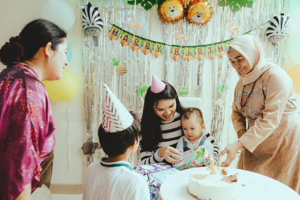
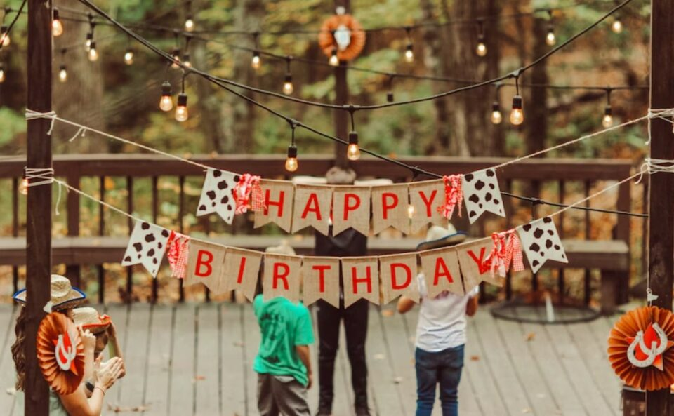
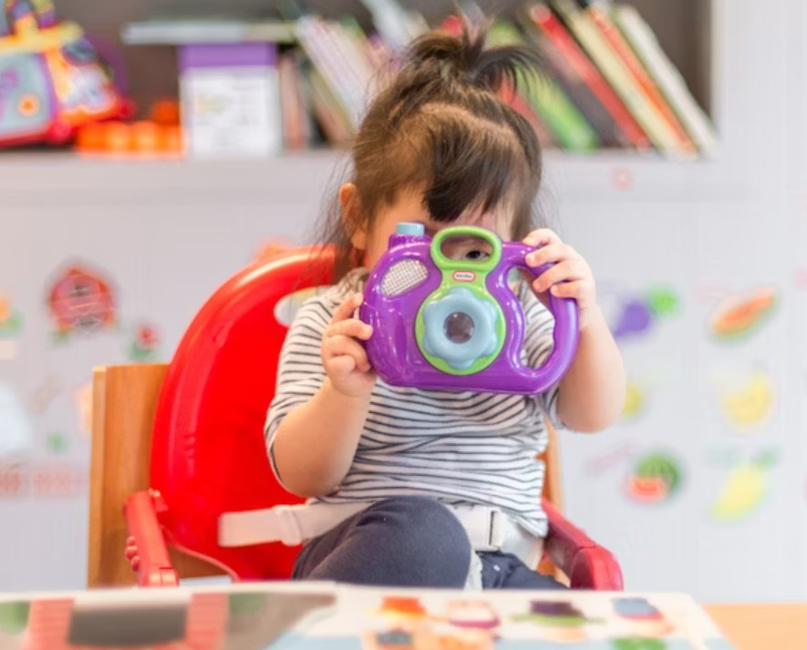
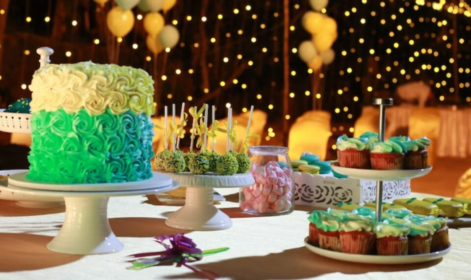
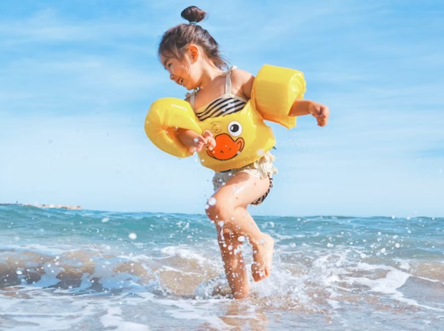
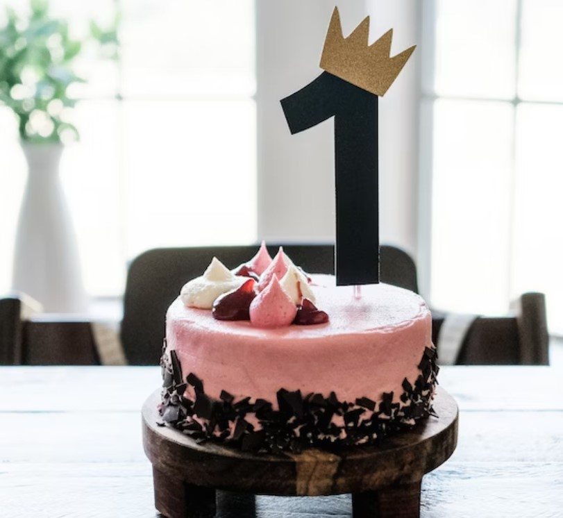

This article has been written and researched by our expert Loveable through a precise methodology. [Learn more about our methodology](https://avada.io/loveable/our-methodological.html)

[Loveable](https://avada.io/loveable/) > [Blog](https://avada.io/loveable/blog/) > [Holiday](https://avada.io/loveable/holiday/)

# 15 Best Ideas To Celebrate 1st Birthday

Written by [Blake Simpson](https://avada.io/loveable/author/blake/) Last Updated on August 22, 2023

- [Bottom Line](https://avada.io/loveable/blog/celebrate-1st-birthday-ideas/#wp-block-heading-2-55) 

A child’s first birthday is a momentous occasion that marks the completion of an incredible journey filled with joy, growth, and countless cherished memories. It is a milestone that not only celebrates the [little one’s first year](https://avada.io/loveable/birthday-gift-1-year-old-boy/) of life but also brings together family, friends, and loved ones to commemorate this significant event. Planning and celebrating 1st birthday party requires careful thought and consideration, as it sets the stage for a memorable celebration that will be cherished for years to come.

As a result, in this article, we present you with a curated list of the **15 best ideas to celebrate a 1st birthday**, ensuring a day filled with fun, love, and laughter. Whether you’re looking for a grand extravaganza or an intimate gathering, these ideas offer a range of options to suit different preferences and budgets. So, whether you are a parent, a grandparent, or [a close friend](https://avada.io/loveable/friendaversary-gifts/) entrusted with organizing this momentous celebration, read on to discover the 15 best ideas to make your child’s first birthday a special memory that will be treasured for a lifetime.

1. **Prepare Birthday Gifts for a 1-Year-Old**

When it comes to selecting birthday gifts for a 1-year-old, it is essential to choose items that engage their senses and aid in their developmental milestones. Toys stimulating their senses, such as soft plush toys with different textures or colorful rattles, can provide hours of entertainment while enhancing their cognitive and fine motor skills. Shape sorters and stackers are great options for encouraging hand-eye coordination and problem-solving abilities. 

Interactive books with touch-and-feel textures or lift-the-flap features not only entertain but also promote early language development. Introducing musical instruments like small drums or xylophones can instill a love for music and rhythm. When choosing a gift, it is crucial to consider the child’s interests, safety, and developmental needs, ensuring a memorable and beneficial experience as they celebrate this special milestone.

2. **Choose The Right Theme**

Choosing the right [theme for a 1-year-old birthday](https://www.happiestbaby.com/blogs/baby/first-birthday-party-themes) party is an exciting opportunity to create a memorable and enjoyable experience for the little ones and their loved ones. Simple and classic themes like animals, balloons, or rainbows are always a hit with little ones. Additionally, interactive themes that encourage exploration and sensory play, such as a garden party or a beach theme, can be both entertaining and educational. 

Consider incorporating age-appropriate activities, such as bubble machines, sensory bins, or soft play areas, to ensure that all guests, including the little one, can participate and enjoy the celebration. When planning a theme, it’s essential to remember the budget and the space available for the event. With creativity and thoughtful planning, a well-chosen theme can create a memorable and magical birthday celebration for the child and their loved ones.

3. **Consider A Suitable Location**

Don’t forget to start looking for an easier alternative while deciding where to hold the party. You might think that throwing the party at home will save you money, but once you take into account the cost, time, and effort required to prepare and serve all of the food, including cake, you might realize that booking a catered hall isn’t such a bad idea after all.

If you intend to host the party at your house, be sure to provide ample chairs and hire help to clean up after the event. Additionally, you must ensure that every aspect of the party is thoroughly organized since; otherwise, it would be challenging to maintain control over everything. 

4. **Choose Outfit for The Baby** 

Ensure that the outfit fits the party’s theme because your kid will be the focus of attention. Make certain that your little girl gets sparkling wings and a tutu if your party has a fairy theme. Wear engineering overalls and a red scarf when the topic is the train. Fancy clothing is also a terrific option because you cannot go bad with an expensive gown or a little suit.

Whatever you decide, keep in mind to keep it straightforward and make sure that everyone will praise it favorably. Don’t wear too much glitz or sparkle. Some of the best recommendations are a simple [T-shirt](https://avada.io/loveable/personalized-t-shirts/) for a guy and a little blouse for a female. 

5. **Prepare Somethings Fun For Little Guests**

Preparing something fun for the little guests at a 1-year-old birthday party ensures that everyone has a delightful and engaging time. When organizing activities, the age range and abilities of the children attending are essential. Setting up a sensory play area with safe and age-appropriate toys, such as soft blocks or textured balls, allows the little ones to explore and engage their senses.

Additionally, simple games like a mini obstacle course or a treasure hunt with age-appropriate clues can spark excitement and engagement. Consider providing a designated play area with [1 age-appropriate toys](https://avada.io/loveable/educational-toys-1-year-olds/) and play equipment to ensure the little guests can play freely and interact with each other. Incorporating these fun elements will make the birthday party a memorable and enjoyable experience for all the little guests.

6. **You Will Need A Photographer**

It is crucial for you to save every memory in every manner possible because this is such a significant time in your child’s life. Do not skimp on the photographer if you want to capture every special moment of your child’s first birthday. Ask one of your reliable friends to take the photos with a real camera if you don’t want to pay a professional photographer. 

Everyone has a smartphone camera these days, but if you rely solely on your phone for the job, it is possible that every hand action will end out blurry. As a result, it is simpler for you to employ a photographer or simply ask a teenager to assist you at the event; he will undoubtedly give it a shot.

7. **Decide How Much To Spend**

The expense here is totally based on your personal financial background, so here is a suggestion. A baby’s first birthday celebration can cost anywhere from less than $50 to more than $500, according to our survey of more than 5,000 parents. Parents spent an average of $200 or less, 25% spent around $200 and $500, and 11% spent over $500. The majority of parents contributed $200 or less.

Depending on the type of party you would like to organize for your child, the sum of money you spend is entirely up to you. You should be aware that, after decorations and cake, food is the major factor in cost increases. At this stage in life, modesty is wonderful, so don’t feel obligated to purchase more than what you can afford.

8. **Prepare Goody Bags For Kids** 

Preparing goody bags for kids at a 1-year-old birthday party is a thoughtful gesture that adds to the excitement and fun of the celebration. When assembling the goody bags, it’s important to remember the children’s age and choose age-appropriate items. Fill the bags with small toys like softballs, teething rings, or bath toys that are safe for infants and stimulate their senses.

It’s always a good idea to include some healthy snacks, like individually wrapped fruit snacks or crackers, considering any dietary restrictions. Decorate the goody bags with colorful ribbons or stickers to make them visually appealing. Lastly, consider adding a personalized note or a small thank-you card to express gratitude for the little guests’ presence. These goody bags will be a delightful takeaway and a token of appreciation for attending the special 1-year-old birthday celebration.

9. **Food**

Both children and adults can enjoy finger meals, and eating them will not interfere with play or social interaction. Provide for both extremes because certain infants may have several teeth and have the ability to bite on food, while others might continue to be toothless. Cut into small pieces, Graham crackers or animal crackers are other options.

Assuming that your little guests would consume very little food, focus more on the variety of flavors, textures, and colors than on quantity. Water, milk, and possibly diluted fruit juice should be available for children, while mineral water or soda should be available for adults. Remember to provide a delicious birthday cake. Although homemade delicacies are unique, stores have a wide selection, or you may try a bakery. Cakes might need to be ordered in advance. 

10. **Choosing Appropriate Time** 

When your child turns one, she’ll probably still be sleeping in the morning and the afternoon. If so, scheduling your event around nap periods might be preferable. Check with their parents about their children’s nap hours if you invite other young guests. If one begins to cry, they all might! 

You might want to keep the party short; an hour or two should be adequate at this age. The celebration can also be celebrated around breakfast or right before supper, both of which are excellent choices. Your baby will enjoy one of the nicest first birthday parties ever if you only choose the timing depending on their interests and daily schedule.

11. **Fingerpaint Party**

Having a fingerpainting party for a 1-year-old birthday can be a delightful and interactive activity for the little guests. Set up a designated area with washable finger paints and large sheets of paper or easels. Encourage the children to explore their creativity by dipping their fingers into vibrant paints and creating their own masterpieces. This sensory experience allows them to engage their senses, develop fine motor skills, and express themselves through art. 

To ensure safety, use non-toxic and child-friendly paints. Display their artwork proudly throughout the party, creating a colorful and personalized gallery. The fingerprint party not only offers a fun and memorable experience but also encourages imagination and self-expression in a playful and age-appropriate way. It will surely be a highlight of the 1-year-old birthday celebration, leaving everyone with lasting memories.

12. **Beach Party at Home**

It is undeniable that having a DIY beach party at home for a 1-year-old birthday celebration brings the joy and excitement of a beach vacation right to your doorstep. Transform your backyard or indoor space into a mini beach oasis by spreading out colorful beach towels, setting up a small inflatable pool or water play area, and scattering beach toys like buckets, shovels, and inflatable balls. 

Create a relaxed and tropical atmosphere with decorations such as palm tree cutouts, seashells, and beach umbrellas. Encourage the little guests to dress in beach attire and provide sun hats or sunglasses as party favors. With creativity and imagination, a DIY beach party at home will transport everyone to a sunny and fun-filled beach experience, making the 1-year-old’s birthday celebration truly memorable.

**_Related_**: [19 Fun and Creative Summer Birthday Party Ideas for All Ages](https://avada.io/loveable/summer-birthday-party-ideas/)  

13. **Storybook Party**

Celebrate a fairytale party to transport the little guests into a magical realm of wonder and creativity for their first birthday. Pick a beloved children’s book as the theme, and then design the venue using ideas from the narrative. Pillows and blankets can be used to create a comfortable reading nook where kids and adults can congregate for storytime.  

Serve themed snacks and desserts as well, like cupcakes with edible storybook decorations or cookies fashioned like the characters from the book. As a party favor, give each kid a miniature storybook to keep the event’s magic going even after it has ended. The 1-year-old’s birthday celebration will be really magical thanks to the storybook party, which will not only interest and entertain the little guests but also encourage a love of reading and storytelling from a young age.

14. **Stamp Handprint Invitations** 

To add a special and heartfelt touch to invitations for a 1-year-old’s birthday party, stamp handprints. Use washable paint or ink pads in vivid colors, and have the birthday child press their hand into cardstock or blank invites. Both the beneficiaries and the family will treasure this distinctive and adorable design as a memento. Include the date, time, and place of the celebration along with a heartfelt invitation for friends to join in on the celebration. 

Send these handprint invitations by mail or in-person to the child’s closest relatives and friends to generate enthusiasm for the impending party. This imaginative and sincere method of creating invites sets the tone for a happy and unique one-year-old birthday celebration that honors not only the child’s development but also the love and connection shared with family and friends.

15. **Get a Special Cake**

Cakes don’t need a special occasion. You may obtain a custom dessert to cap the day off perfectly. Any size will do. Simply put on an appropriate birthday song, grab the cake, and watch your child attempt to blow out the candle. You could capture it all with your phone, which would be entertaining. The delicious cake would excite your baby’s taste buds, and the tune would get him moving.

You would come to the conclusion that the cake that you had purchased was worthwhile in the end. What matters most is a special cake enjoyed with close friends and family. Additionally, it would be an unmatched delight to observe your child taking full use of the day, and it will be one of the most special gifts ever for your child.

## **Bottom Line** 

**Celebrating 1st birthday** is a special milestone that deserves to be celebrated in a memorable and meaningful way. By incorporating the best ideas for a 1st birthday celebration, you can create a joyous and unforgettable experience for your little one and your loved ones. From choosing a theme and decorations to planning activities and creating a delightful cake smash moment, this article provides a comprehensive guide to help you plan a successful and enjoyable celebration.

Remember to prioritize your child’s comfort and happiness throughout the event, and consider involving family and friends to make it a shared experience. Whether you opt for celebrating 1st birthday as a small gathering or a larger party, the key is to focus on creating cherished memories and celebrating the incredible journey of your child’s first year. With the right ideas and a touch of creativity, you can make this milestone a truly magical occasion that will be treasured for years to come.

- [Bottom Line](https://avada.io/loveable/blog/celebrate-1st-birthday-ideas/#wp-block-heading-2-55) 

### [Blake Simpson](https://avada.io/loveable/author/blake/)

Hi, I'm Blake from Loveable. I help people find perfect gifts for occasions like anniversaries and weddings. I also write a blog about holidays, sharing insights to make them more meaningful. Let's create unforgettable moments together!

- [Twitter](https://twitter.com/intent/tweet)
- [Facebook](https://www.facebook.com/sharer/sharer.php)
- [instagram](https://avada.io/loveable/blog/celebrate-1st-birthday-ideas/)
- [pinterest](https://www.pinterest.com/loveablellc/)

## Related Posts

[### 120+ Christian Birthday Wishes To Spread Your Love](https://avada.io/loveable/blog/christian-birthday-wishes/) 

[

### 35 Best 70th Birthday Ideas To Celebrate The Special Milestone

](https://avada.io/loveable/blog/70th-birthday-ideas/)

[

### 50 Best 30th Birthday Decorations for a Remarkable Birthday Bash

](https://avada.io/loveable/blog/30th-birthday-decorations/)

[

### 40 Delicious Vegan Christmas Desserts to Delight Your Palate

](https://avada.io/loveable/blog/vegan-christmas-desserts/)

[

### 60 Christmas Team Building Activities to Boost Workplace Spirit

](https://avada.io/loveable/blog/christmas-team-building-activities/)
