This article has been written and researched by our expert Loveable through a precise methodology. [Learn more about our methodology](https://avada.io/loveable/our-methodological.html)

[Loveable](https://avada.io/loveable/) > [Blog](https://avada.io/loveable/blog/) > [Holiday](https://avada.io/loveable/holiday/)

# 15 Fastating Italian Christmas Traditions That You Will Love

Written by [Blake Simpson](https://avada.io/loveable/author/blake/) Last Updated on September 12, 2023

- [15 Fastating Italian Christmas Traditions That You Must Discover](https://avada.io/loveable/blog/italian-christmas-traditions/#wp-block-heading-2-2)
    - [1\. Signature Santa Claus calling](https://avada.io/loveable/blog/italian-christmas-traditions/#wp-block-heading-3-3)
    - [2\. The day of the Immaculate Conception](https://avada.io/loveable/blog/italian-christmas-traditions/#wp-block-heading-3-7)
    - [3\. No meat feast](https://avada.io/loveable/blog/italian-christmas-traditions/#wp-block-heading-3-11)
    - [4\. Midnight mass](https://avada.io/loveable/blog/italian-christmas-traditions/#wp-block-heading-3-14)
    - [5\. The nativity scene](https://avada.io/loveable/blog/italian-christmas-traditions/#wp-block-heading-3-18) 
    - [6\. Putting the Christmas tree up](https://avada.io/loveable/blog/italian-christmas-traditions/#wp-block-heading-3-22)
    - [7\. Manifest fortune on New Year’s Eve](https://avada.io/loveable/blog/italian-christmas-traditions/#wp-block-heading-3-26)
    - [8\. Cultural music with zampognari](https://avada.io/loveable/blog/italian-christmas-traditions/#wp-block-heading-3-30)
    - [9\. Epiphany at the end of the season](https://avada.io/loveable/blog/italian-christmas-traditions/#wp-block-heading-3-34)
    - [10\. Skiing through the night](https://avada.io/loveable/blog/italian-christmas-traditions/#wp-block-heading-3-38)
    - [11\. Surrounded by tons of sweets](https://avada.io/loveable/blog/italian-christmas-traditions/#wp-block-heading-3-41)
    - [12\. The Italian bingo](https://avada.io/loveable/blog/italian-christmas-traditions/#wp-block-heading-3-44)
    - [13\. Presents from the good witch](https://avada.io/loveable/blog/italian-christmas-traditions/#wp-block-heading-3-48)
    - [14\. Exchanging gift day](https://avada.io/loveable/blog/italian-christmas-traditions/#wp-block-heading-3-52)
    - [15\. Befana day](https://avada.io/loveable/blog/italian-christmas-traditions/#wp-block-heading-3-56) 
- [Bottom line](https://avada.io/loveable/blog/italian-christmas-traditions/#wp-block-heading-2-62)

Italy, a land renowned for its art, history, and gastronomy, dazzles even brighter during the Christmas season. Italian Christmas traditions are a harmonious blend of spirituality, delectable cuisine, and warm camaraderie. Italy’s festive symphony delights both locals and visitors, from feasting exquisite seafood to cherishing intricate nativity scenes. Join us as we explore the captivating tapestry of **Italian Christmas traditions** that infuse the holiday season with a touch of bella Italia.

## **15 Fastating Italian Christmas Traditions That You Must Discover**

### **1\. Signature Santa Claus calling**

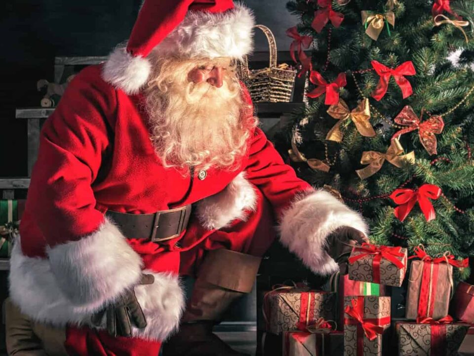

“Babbo Natale” is the Italian term for “Santa Claus” or “Father Christmas.” He is a legendary figure who is said to bring gifts to children on Christmas Eve. According to tradition, Babbo Natale travels on a sleigh pulled by reindeer and enters homes through the chimney to leave presents for well-behaved children.

The concept of Babbo Natale is similar to the Santa Claus figure known in many other cultures, embodying the spirit of giving and generosity during the holiday season. Now, Children can write letters to _Babbo Natale_ or speak to him directly at a shopping mall, Christmas market, or event.

### **2\. The day of the Immaculate Conception**

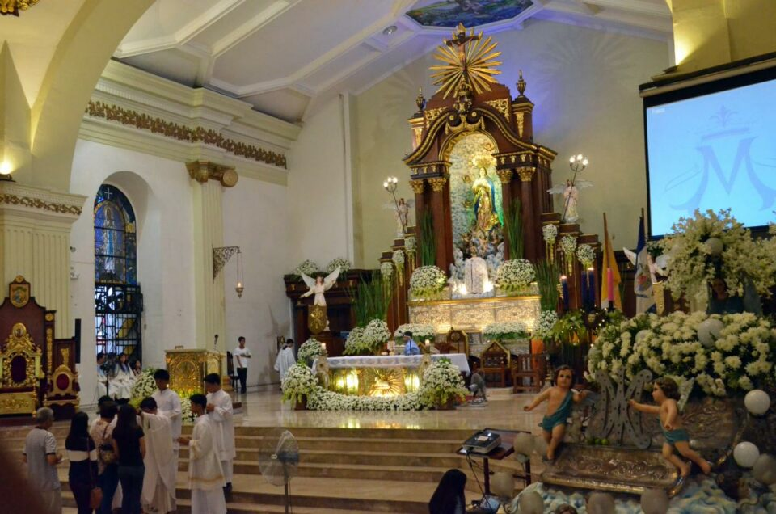

The Day of the Immaculate Conception is a significant religious holiday in Italy, celebrated on December 8th each year. This holiday commemorates the belief in the immaculate conception of the Virgin Mary, who was conceived without original sin.

In Italy, the Day of the Immaculate Conception is a public holiday, meaning many businesses and schools are closed. It is also a day for families to come together and celebrate. These displays often mark the beginning of the Christmas season in Italy.

### **3\. No meat feast**

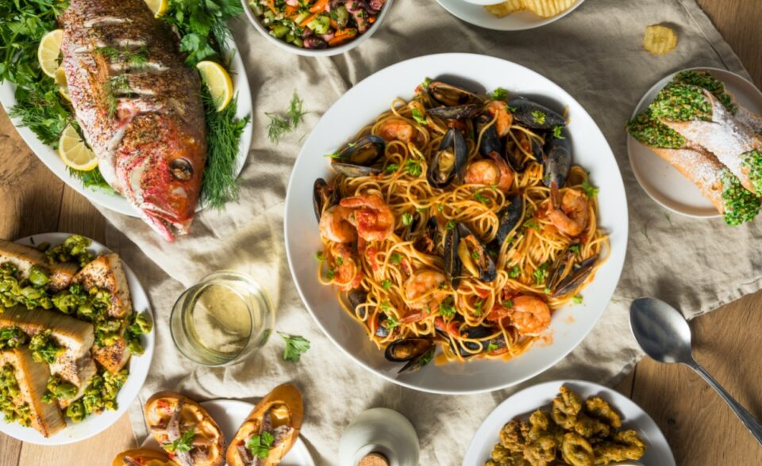

The “Feast of the Seven Fishes” is the name of the [Christmas Eve dinner](https://avada.io/loveable/blog/christmas-dinner-ideas/) in Italy, a seven-course seafood-only meal. Why not roast, you ask? The meat-free tradition originated from the Roman Catholic habit of forgoing meat on Christmas Eve to cleanse the body. The menu’s contents vary depending on the location, but some popular dishes include seafood soup, substantial roast fish, marinated anchovies, and seafood pasta.

### **4\. Midnight mass**

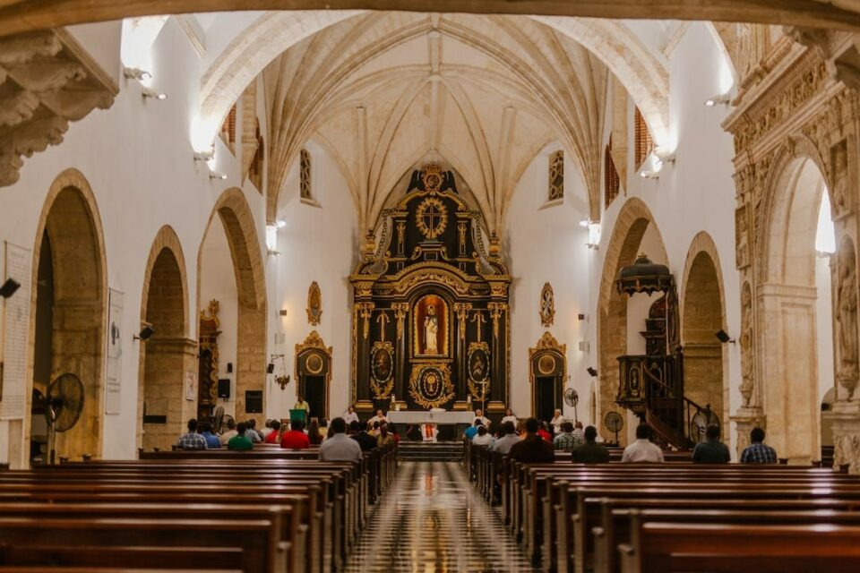

After the feast of the seven fishes, Italian families flock to their local churches to attend midnight mass. In Italy, “Midnight Mass” refers to the traditional Catholic Mass that takes place on Christmas Eve, typically around 9:30 PM.

This Mass, also known as “La Messa di Mezzanotte” in Italian, is a significant religious event for many Italians as they gather to celebrate the birth of Jesus Christ. The Mass usually includes hymns, readings from the Bible, and a sermon that reflects on the meaning of Christmas and the significance of Jesus’ birth.

### **5\. The nativity scene** 

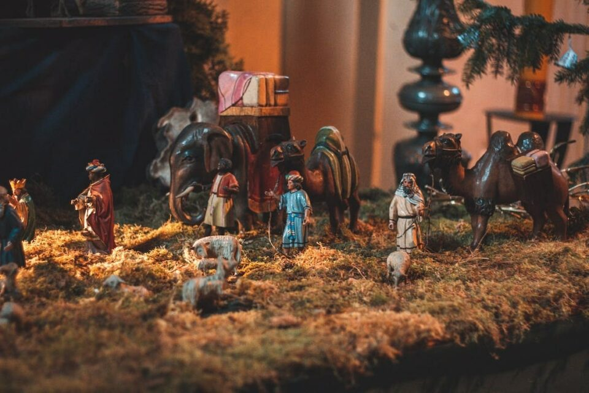

“Presepi,” also known as Italian Nativity Scenes, is a cherished tradition in Italy during Christmas. These Nativity scenes depict the birth of Jesus Christ and are often elaborate and intricately crafted. Italian artisans take great pride in creating Presepi, and many families pass down their Nativity scene sets from generation to generation.

The display of Presepi usually begins on December 8th, the Feast of the Immaculate Conception, and continues until the Epiphany on January 6th. It’s a meaningful tradition that serves as a visual reminder of the holiday’s religious significance.

### **6\. Putting the Christmas tree up**

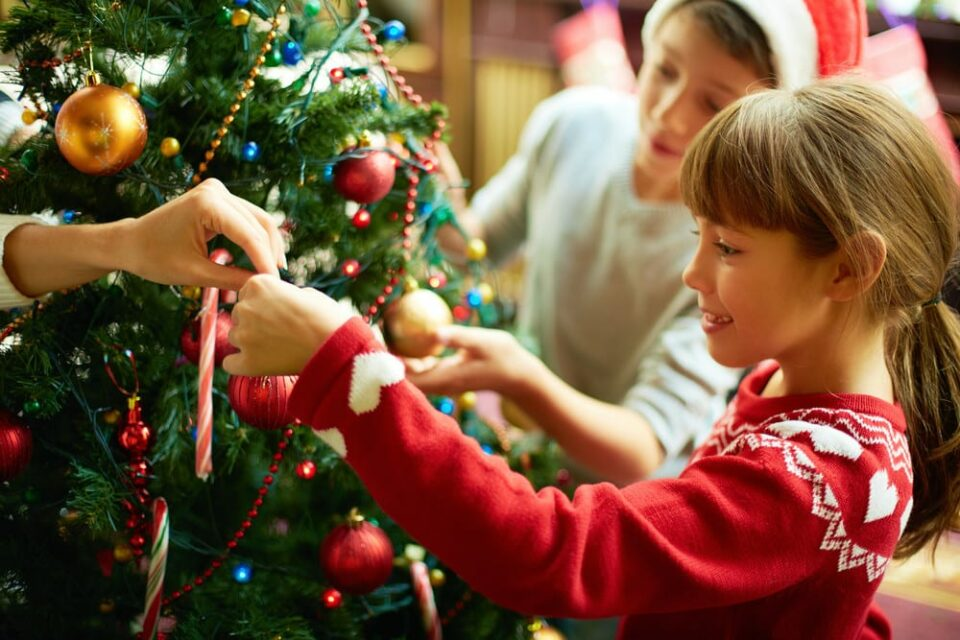

Putting up the Christmas tree on December 8th in Italy is a significant custom. Although artificial trees are more common, genuine ones are beginning to appear in grocery shops and on major street corners.  After the lights are up, kids enjoy hanging the decorations.

The Christmas tree topper usually features a portable (decorated pointed top), an angel (Gabriel, the Annunciation messenger), or a star (representing the comet that signaled the location of infant Jesus to the Three Kings). Each household has unique [Christmas tree decorations](https://avada.io/loveable/blog/christmas-tree-decorating-ideas/), including the following: Every Christmas tree is distinctive and features ornaments, garlands, and balls.

### **7\. Manifest fortune on New Year’s Eve**

The Italians are superstitious and have many hilarious and weird New Year’s Eve traditions. Traditionally, pork with its richness represents wealth, while lentils symbolize money because of their coin-like shape. Eating dishes containing those is believed to bring prosperity in the new year. 

And to guarantee that the coming year is a success, get yourself a pair of red underwear. Italians flock to markets and department stores after Christmas to get their hands on the lucky item.

### **8\. Cultural music with zampognari**

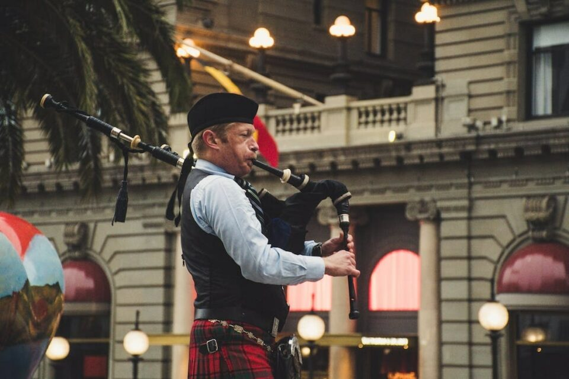

During the Christmas season, zampognari is especially popular. They often perform in town centers and Christmas markets, enhancing the festive atmosphere with their unique tunes. Their music adds a charming and nostalgic element to the holiday festivities, harkening back to Italy’s rural traditions and connecting people to their cultural heritage. 

Zampognari and their music are a wonderful example of how traditional folk elements continue to play a role in modern celebrations.

### **9\. Epiphany at the end of the season**

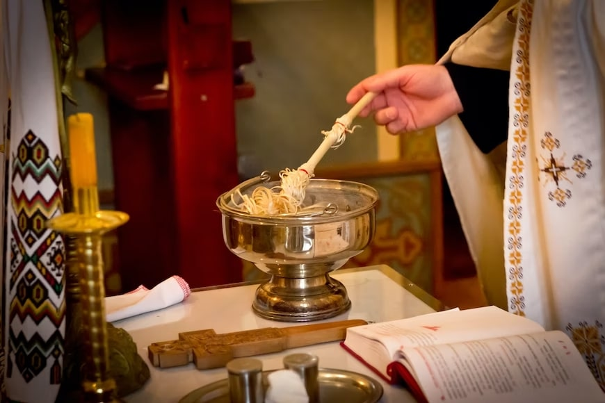

The Epiphany, celebrated on January 6th, marks the end of the Christmas season in many Christian traditions, including in Italy. It’s a day that commemorates the visit of the three Wise Men, or Magi, to the baby Jesus, symbolizing the revelation of Christ to the world. 

According to tradition, La Befana is a kind and magical old woman who travels on a broomstick, visiting homes to deliver gifts and sweets to children who have been good throughout the year. Like Santa Claus, children hang stockings or leave out shoes on the night of January 5th in anticipation of La Befana’s visit.

### **10\. Skiing through the night**

Many ski resorts in Italy offer special holiday packages and events during the Christmas season. These can include festive activities such as torchlight ski parades, Christmas markets, and even visits from Santa Claus on the slopes. Skiing under the twinkling lights and amidst the snowy landscape during the day is a picturesque experience that captures the holiday spirit.

### **11\. Surrounded by tons of sweets**

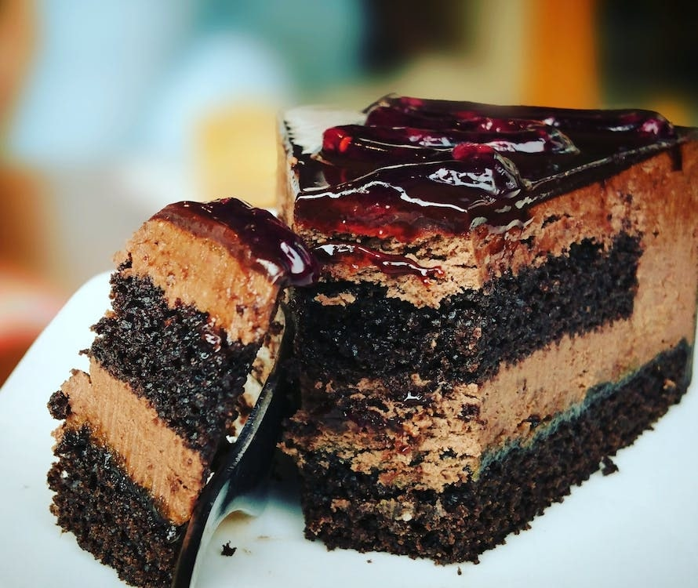

Italy is the destination to visit over the holidays if you have a sweet craving. Markets and bakeries have several delicacies, including Christmas cookies and nougat. The Italian sweet pastries that arrive throughout the Christmas season are what stand out the most, though. Each area has its specialty, many of which resemble cakes rather than bread, but they are all utterly mouthwatering.

### **12\. The Italian bingo**

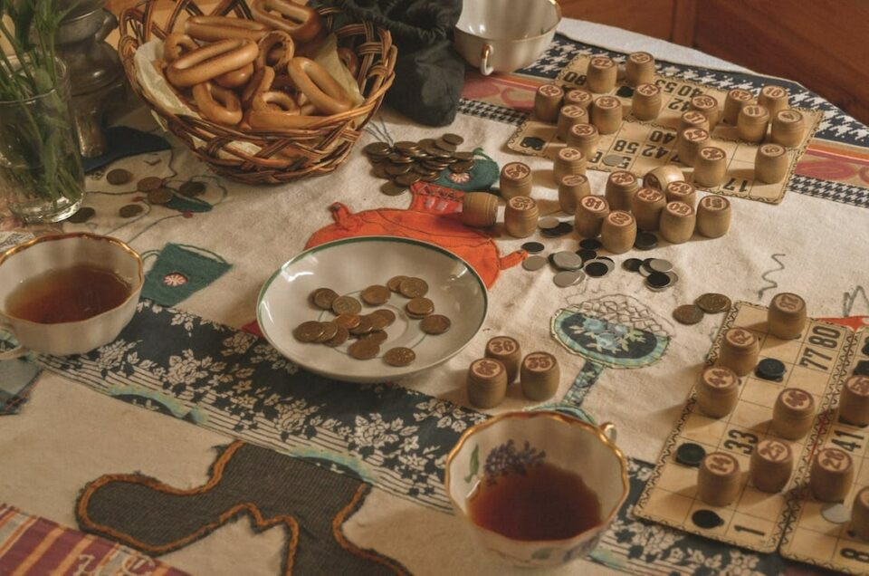

Tombola, often called Italian Bingo, is a popular traditional game in Italy, especially during the Christmas and New Year holidays. Like regular bingo, it is a social and entertaining game of chance that brings families and friends together for lighthearted fun. 

Tombola is not only a game but also a cultural tradition that has been passed down through generations in Italy. It adds a festive and communal aspect to holiday gatherings, allowing people of all ages to come together and celebrate.

### **13\. Presents from the good witch**

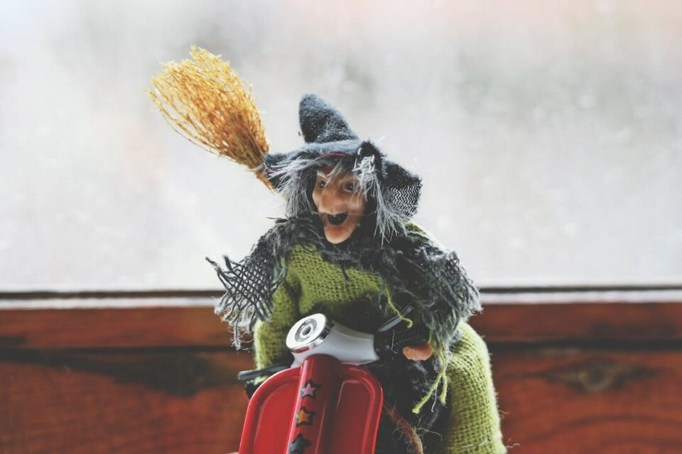

Some cultures believe in benevolent supernatural figures, such as “good witches,” who bring gifts and blessings to children during specific times of the year. One well-known example is “La Befana” in Italy, celebrated on the Epiphany, on January 6th. 

La Befana is depicted as a kind old woman who flies on a broomstick and enters homes through the chimney to deliver gifts and sweets to children who have been good throughout the year. This tradition blends Christian and pagan elements and adds a unique and festive touch to the holiday season in Italy.

### **14\. Exchanging gift day**

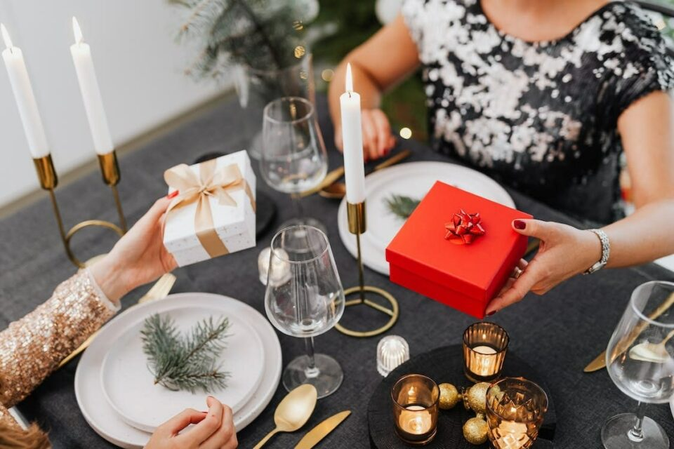

In Italy, Christmas Day (December 25th) is the main day for gift-giving, where families gather to exchange presents and enjoy festive meals. The Epiphany (January 6th) is also a significant gift-giving occasion associated with the character “La Befana.” Children leave stockings or shoes for La Befana to fill with treats and small gifts.

However, individual families and friends may have their own customs and preferences regarding gift exchange. Some may also exchange gifts on Saint Stephen’s Day (December 26th) or New Year’s Day (January 1st).

### **15\. Befana day** 

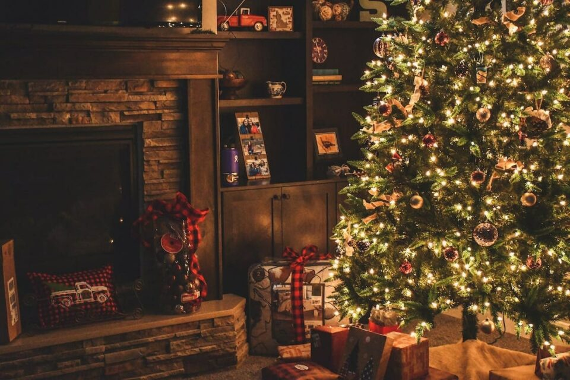

“Befana” is believed to be derived from the Italian word “Epifania,” which refers to the Epiphany. The character of La Befana is a blend of Christian and pagan folklore, and her story is linked to the biblical story of the Three Wise Men or Magi who visited the baby Jesus.

La Befana is a mythical character often depicted as a kind and magical old woman. She travels on a broomstick and visits homes on the night of January 5th, leaving gifts and treats for children who have been good throughout the year. Similar to Santa Claus in other cultures, children hang stockings or leave out shoes in anticipation of La Befana’s visit.

_**See More:**_

- 12 [Mexican Christmas Traditions](https://avada.io/loveable/blog/mexican-christmas-traditions/) You’ll Love

## **Bottom line**

**Italian Christmas traditions** are a testament to the country’s rich history and deep-rooted sense of community. From the Feast of Seven Fishes to the charming nativity scenes, each tradition reflects the joy and togetherness that define the holiday season in Italy. As you celebrate this year, consider adding a touch of Italian flair to your festivities. Buon Natale! Incorporating these cherished Italian customs into your celebrations can infuse them with warmth and meaning. Take a page from Italy’s book this holiday season and revel in the magic of togetherness, delicious food, and heartfelt traditions.

- [15 Fastating Italian Christmas Traditions That You Must Discover](https://avada.io/loveable/blog/italian-christmas-traditions/#wp-block-heading-2-2)
    - [1\. Signature Santa Claus calling](https://avada.io/loveable/blog/italian-christmas-traditions/#wp-block-heading-3-3)
    - [2\. The day of the Immaculate Conception](https://avada.io/loveable/blog/italian-christmas-traditions/#wp-block-heading-3-7)
    - [3\. No meat feast](https://avada.io/loveable/blog/italian-christmas-traditions/#wp-block-heading-3-11)
    - [4\. Midnight mass](https://avada.io/loveable/blog/italian-christmas-traditions/#wp-block-heading-3-14)
    - [5\. The nativity scene](https://avada.io/loveable/blog/italian-christmas-traditions/#wp-block-heading-3-18) 
    - [6\. Putting the Christmas tree up](https://avada.io/loveable/blog/italian-christmas-traditions/#wp-block-heading-3-22)
    - [7\. Manifest fortune on New Year’s Eve](https://avada.io/loveable/blog/italian-christmas-traditions/#wp-block-heading-3-26)
    - [8\. Cultural music with zampognari](https://avada.io/loveable/blog/italian-christmas-traditions/#wp-block-heading-3-30)
    - [9\. Epiphany at the end of the season](https://avada.io/loveable/blog/italian-christmas-traditions/#wp-block-heading-3-34)
    - [10\. Skiing through the night](https://avada.io/loveable/blog/italian-christmas-traditions/#wp-block-heading-3-38)
    - [11\. Surrounded by tons of sweets](https://avada.io/loveable/blog/italian-christmas-traditions/#wp-block-heading-3-41)
    - [12\. The Italian bingo](https://avada.io/loveable/blog/italian-christmas-traditions/#wp-block-heading-3-44)
    - [13\. Presents from the good witch](https://avada.io/loveable/blog/italian-christmas-traditions/#wp-block-heading-3-48)
    - [14\. Exchanging gift day](https://avada.io/loveable/blog/italian-christmas-traditions/#wp-block-heading-3-52)
    - [15\. Befana day](https://avada.io/loveable/blog/italian-christmas-traditions/#wp-block-heading-3-56) 
- [Bottom line](https://avada.io/loveable/blog/italian-christmas-traditions/#wp-block-heading-2-62)

### [Blake Simpson](https://avada.io/loveable/author/blake/)

Hi, I'm Blake from Loveable. I help people find perfect gifts for occasions like anniversaries and weddings. I also write a blog about holidays, sharing insights to make them more meaningful. Let's create unforgettable moments together!

- [Twitter](https://twitter.com/intent/tweet)
- [Facebook](https://www.facebook.com/sharer/sharer.php)
- [instagram](https://avada.io/loveable/blog/italian-christmas-traditions/)
- [pinterest](https://www.pinterest.com/loveablellc/)

## Related Posts

[### 120+ Christian Birthday Wishes To Spread Your Love](https://avada.io/loveable/blog/christian-birthday-wishes/) 

[

### 35 Best 70th Birthday Ideas To Celebrate The Special Milestone

](https://avada.io/loveable/blog/70th-birthday-ideas/)

[

### 50 Best 30th Birthday Decorations for a Remarkable Birthday Bash

](https://avada.io/loveable/blog/30th-birthday-decorations/)

[

### 40 Delicious Vegan Christmas Desserts to Delight Your Palate

](https://avada.io/loveable/blog/vegan-christmas-desserts/)

[

### 60 Christmas Team Building Activities to Boost Workplace Spirit

](https://avada.io/loveable/blog/christmas-team-building-activities/)
