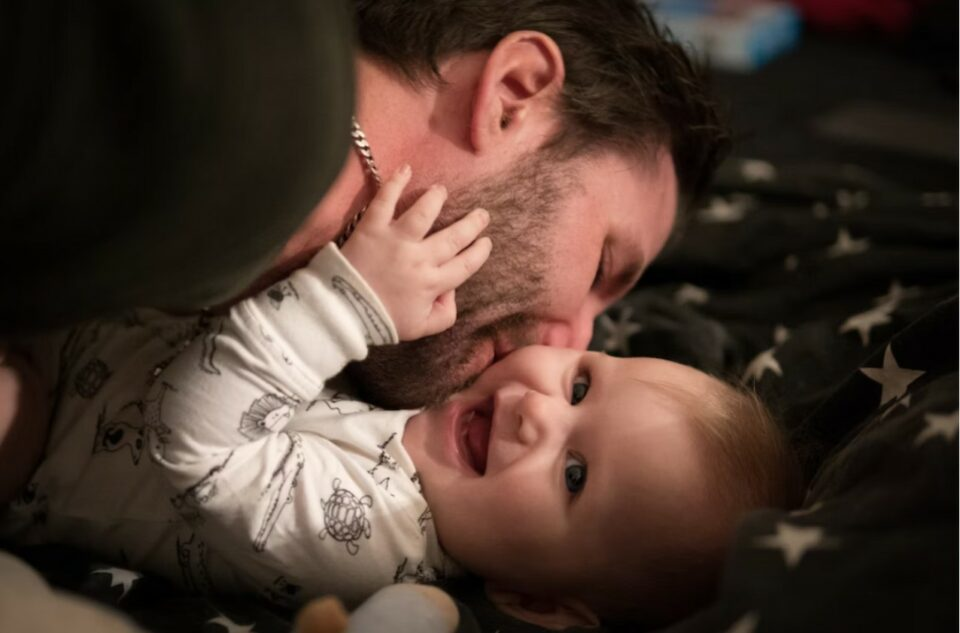

This article has been written and researched by our expert Loveable through a precise methodology. [Learn more about our methodology](https://avada.io/loveable/our-methodological.html)

[Loveable](https://avada.io/loveable/) > [Blog](https://avada.io/loveable/blog/) > [Parenting](https://avada.io/loveable/parenting/)

# 15 First-Time Dad Tips to Become a hands-on dad

Written by [Benjamin Collins](https://avada.io/loveable/author/benjamin/) Last Updated on August 28, 2023

- [15 First-Time Dad Tips to Become a hands-on dad](https://avada.io/loveable/blog/first-time-dad-tips/#wp-block-heading-2-3)
    - [The Bottom Line](https://avada.io/loveable/blog/first-time-dad-tips/#wp-block-heading-3-59)

Are you about to become a first-time father? Having a child is a thrilling and somewhat terrifying event for any first-time dad. And now that you’re a father for the first time, you are one of the luckiest people on earth, and you are just so awesome! Although it’s a wonderful experience, you might be asking how dads can assist with infants and what are some of the **first-time dad tips** you can have.

There are many ways you may bond with the baby and help your partner simultaneously; you have no obligation to simply serve endless cups of tea and look for a spare component. Get ready to make a brand new impact in your special position as a hands-on dad by following these **first-time dad tips** for brand-new fathers, which cover everything from father-baby bonding to how dads can assist during labor.

## 15 First-Time Dad Tips to Become a hands-on dad

1. **Make a plan for finance**

A baby being born also means that there is one more member in your family, and it also means that the expense of the whole family will become greater. In that case, as a hands-on dad, what would you do?

Raising a baby is expensive; one need not be a magician to understand this. Consider spending some time sitting down and determining how the baby will impact your finances if you’re wondering how to support your family with this new arrival effectively. If money is tight, you might be able to make some budgetary adjustments and make room in your spending plan for the costs associated with a new baby.

2. **Learn baby’s sign**

All of a sudden, a new young child has existed in your life! Learning the significance of your baby’s cries, gurgles, and coos is important, but it will take some time. You’ll rapidly learn to recognize the signs of infant hunger and infant fatigue so you can intervene before the wailing begins.

Infant signs of hunger can include sucking on hands, rooting, and smacking lips, while infant signs of fatigue can include jerky limb movements and a glazed expression. You aim to become an expert at interpreting baby indications and always have a nappy on hand.

**_Related_**: 17 [Essential Babysitting Tips](https://avada.io/loveable/essential-babysitting-tips/) for First-Time and Experienced Sitters

3. **Communicate with the newborn**

Although they have just been born, every word you speak to your kid strengthens your bond and helps them learn the language. As a result, in addition to reading to your baby, keep them updated on your activities, no matter how simple they may be: “I’m just searching for a piece of cloth to use for cleaning up this spit-up,” for example. 

Of course, you should also be talking to them lovingly and whispering sweet nothings to them throughout. The joyful gurgles and coos will continue even if you read aloud football scores or quotes from your favorite movies. To conclude, as babies know and understand what you are saying, try to communicate with them more. 

4. **Ask if dad can help with baby**

Greetings to the brand-new world of diaper changes, baby baths, and attempting to comfort your crying infant. If you do not know what to do, ask if you can help. You can take an active part right away and put your knowledge of child care to use. It can be so helpful to work during the night in order to give your partner a rest, and if your partner is nursing, you could wash (the baby, that is!) and settle them thereafter. 

Additionally, if you are bottle-feeding, this is a wonderful chance for you to spend some time with your child at dusk and foster father-child relationships. You’ll never forget such kinds of bonding experiences over the early morning meals.

5. **Get lots of skin-to-skin contact with newborn**

Did you realize there are so many advantages to getting in touch physically with your baby, such as holding your baby on your bare chest or inside your shirt if it’s cold? Your baby’s temperature and heart rate may be controlled, and being near you can also help them relax and strengthen your relationship. Naturally, keeping your baby’s diaper on will help you avoid any unpleasant surprises.

After bathing your baby, the very first moment in the early hours when you can take your kid to bed with you, or even during bottle feedings, are all great opportunities for some father-child skin-to-skin contact. You will savor the father-child connection just as deeply as your child does at this lovely time.

6. **Prepare yourself thoroughly**

As a whole new father who has never known the feeling of being a first-time dad, you need to prepare yourself thoroughly for everything. There is a ton of advice available about what to anticipate as a new dad and parent, so brushing up now, before the kid is born, can help you feel ready. Take pregnancy classes with your partner if you want to be able to help your partner more directly. In addition to receiving all the helpful tips, you’ll have a newfound understanding of what your partner’s body is about to experience.

Additionally, the workshops will provide tips on how dads may assist during labor, which can greatly enhance the crucial father-child bonding that occurs during pregnancy. It’s a terrific way to connect with other soon-to-be parents and dads to take lessons with them. You’ll be happy you had those WhatsApp conversations at two in the morning to get you through the night, and you could end up meeting some lifelong pals!

7. **Take great care of your relationship**

You’ve probably already realized that raising a baby is a life-altering event! Sometimes the plans you and the other person had before the baby arrived may not work out as you had hoped. Additionally, you’ll be completely worn out. The greatest approach to prevent the strain of being a first-time parent from affecting your relationship is to maintain communication and be open with one another. 

Relationship issues among new parents can be resolved by lavish pampering, massages, and breaks. Everyone is different, so do not be afraid to decline unwelcome guests if you feel it will help you adjust to life as the three of you. For extra advice, see our guide on how to welcome guests after giving birth to a baby.

8. **Share household chores**

What a little vacuuming and [housekeeping](https://www.merriam-webster.com/dictionary/housekeeping#:~:text=%3A%20the%20work%20or%20activity%20of,responsible%20for%20doing%20such%20work) can accomplish! You might be doing the majority of the housework in the first couple of months after the arrival of your child. You can surprise your partner by preparing their favorite food or ordering delivery so you each can take a break; it does not take anything to help improve your relationship. Do the household tasks because your companion will be worn out from days of feeding and caring for you. 

Here is our best tip for brand-new dads: Put your partner’s needs first and be a terrific spouse or partner—that is what you do best! Have a discussion about how you are splitting parenting chores and sharing home responsibilities as you get into the swing of things so that you’re explicit and happy about who is doing what.

9. **Provide support for postpartum depression**

According to thorough research, postpartum depression and anxiety affect approximately 1 in 7 women and are genuine problems. You could want to try to solve the problem as a helpful spouse, but that’s usually not the best course of action. Make sure mom receives the necessary medical attention first.

For the greatest advice on how to help your wife or spouse if she’s experiencing postpartum depression, you can check out some of the best investigations you can find online. For the latest and most effective ways, find the doctors, and they will tell you what to do in this case.

10. **Offer breastfeeding assistance**

Giving birth is the most difficult time for the wife, so offer breastfeeding support as much as possible. There are many dads who support nursing that you can emulate even if you might not have breasts. You may be there for your partner throughout, whether by providing pillows and back rubs for comfort or giving her a drink of water before she asks. Moms might get quite thirsty as their milk begins to flow), or just listen if she’s having a hard time. 

Finding breastfeeding support services could be helpful if your partner needs assistance because breastfeeding can be difficult, especially in the early stages. Just let your partner know you’re there for them, and everything will be fine.

11. **Save memories via photos**

There is nothing better you can do rather than take photos to preserve those unforgettable moments with your beloved child and wife. Babies undergo such rapid development. The first few months and weeks of fatherhood will pass quickly, but make sure your phone is well-charged because there will be many photo opportunities. Keep taking pictures throughout the day, whether it’s of simply your kid or of your significant other and your child. 

There are never too many pictures of your adorable new baby. Selfies of you and your beautiful child are also a requirement. And no, it does not need to be overly staged and posed to share on social media; rather, you and your spouse should capture this moment so you can look back on it in the future and remember the day you became parents.

12. **Learn how to co-parent**

As both of you are now parents, it is really important to know and learn how to co-parent so that you can prevent all the unwanted things from happening. It goes without saying that consistency is essential for babies. As a result, both you and your significant other will need to collaborate to create established patterns and frameworks for your child. 

Once those habits are established, you’ll need to work together to stick to them. You should discuss what you want for parenting your child, as you and your spouse were likely reared differently. Just keep in mind that each child has different needs and ways to develop; therefore, do not assume or follow any prepared guidelines that do not fit your child.

13. **Self-care for dad** 

Being a parent for the first time is also difficult for dads, and dads should pay attention to taking care of themselves. It’s crucial that you look after yourself so that you can look after your family as best you can. Your dad’s energy levels will be maintained by getting out and exercising. It is amazing what a terrific workout pulling a baby carriage up an uphill path can be, and then you can release all of your stress by working out.

Remember to take a nap whenever you can, and stay in close communication with friends and family. Speaking with other dads can be beneficial, and they may have their own advice for new dads as well. It is even better if you and the other person can spend some time practicing self-care together.

14. **Plan for alone time**

You might be asking if it is even reasonable to anticipate you will have some alone time when we are talking about alone time. With a kid, your life will undoubtedly change; however, you are still able to discover ways to relax. And your time being alone will also play a crucial role in your responsibility as a first-time dad.

Teaming up with your spouse or partner is a simple thing. Simply swap off watching the kid if you need some alone time or want to spend time with friends. Moments with your infant will be even more enjoyable whenever you each have a couple of minutes to relax. Go out with your friends or just simply spend a little time with yourself to take a rest.

**_Related_**: 30 Best [Dad Hobbies](https://avada.io/loveable/dad-hobbies/) That Fit Any Kind Of Dad

15. **Prepare for the unexpected**

Despite your best efforts, you will still experience situations as a first-time father for which nothing can adequately prepare you.  It could be a problem brought on by your relationship or a first-time action that produced an unfavorable outcome. 

And just remember that even if the worst thing happens to you as a first-time father, be composed and tell your wife or friends about it. Just keep in mind that things that are not expected can and will happen; you do not need to live in constant fear of it. You will already be better prepared than others as long as you are aware of that. Stay calm, and everything will get on the right way you want.

**_See More:_**

- [Stay-at-Home Dads](https://avada.io/loveable/blog/stay-at-home-dads/): Definition, Reasons, and Challenges 

- [Dad Fitness](https://avada.io/loveable/blog/dad-fitness/): 11 Strategies for Staying Healthy While Balancing Fatherhood

### The Bottom Line

You may still feel wondering about everything happening in your period of being a newborn dad. But you do not have to worry if you have thoroughly read our **first-time dad tips** and recommendations above, as we believe that all of those things are literally down on earth and have been checked by the others.

It is amazing to be a first-time parent and meet your newborn child. You can learn so much to become one of the best newborn dads ever. Therefore, this article provides newborn parents, especially those needing first-time dad tips, with knowledge so they feel more in control and less afraid. 

- [15 First-Time Dad Tips to Become a hands-on dad](https://avada.io/loveable/blog/first-time-dad-tips/#wp-block-heading-2-3)
    - [The Bottom Line](https://avada.io/loveable/blog/first-time-dad-tips/#wp-block-heading-3-59)

### [Benjamin Collins](https://avada.io/loveable/author/benjamin/)

I'm Benjamin Collins, a gift ideas creator at Loveable. We specialize in unique and personalized gifts for any occasion. With my honed skills, I recommend gifts tailored to the recipient's personality and interests, whether it's Halloween, Christmas, or any other celebration.

- [Twitter](https://twitter.com/intent/tweet)
- [Facebook](https://www.facebook.com/sharer/sharer.php)
- [instagram](https://avada.io/loveable/blog/first-time-dad-tips/)
- [pinterest](https://www.pinterest.com/loveablellc/)

## Related Posts

[

### 79 Heartfelt Missing Mom Quotes for Expressing Love and Longing

](https://avada.io/loveable/blog/missing-mom-quotes/)

[

### Parenting with Depression: Strategies for Coping, Seeking Help, and Building Resilience

](https://avada.io/loveable/blog/parenting-with-depression/)

[

### 100 Empowering Single Mom Quotes: Inspirational Words for Strong Mothers

](https://avada.io/loveable/blog/single-mom-quotes/)

[

### 99+ Heartfelt Quotes And Wishes: Happy Anniversary to Mom and Dad!

](https://avada.io/loveable/blog/quotes-happy-anniversary-mom-dad/)

[

### 5 Ways to Foster a Positive Parent-Teacher Relationship

](https://avada.io/loveable/blog/parent-teacher-relationship/)
