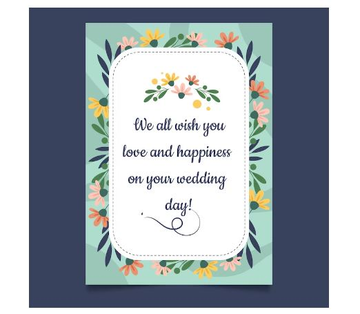
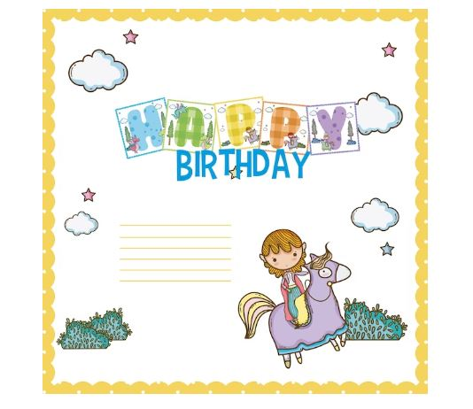
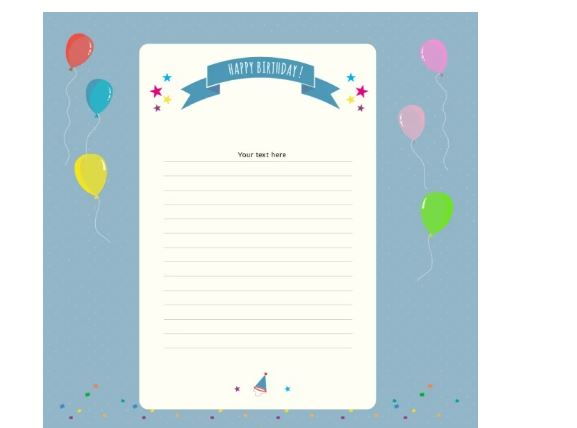
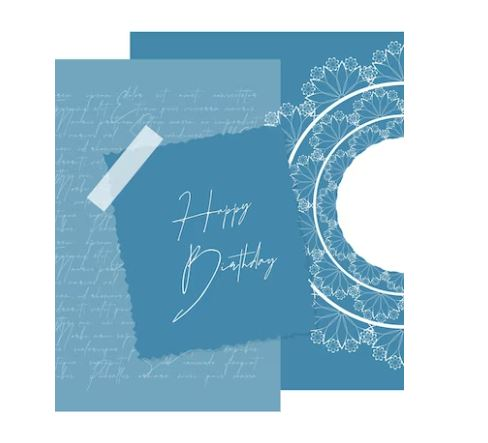
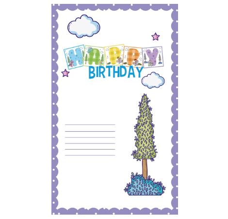
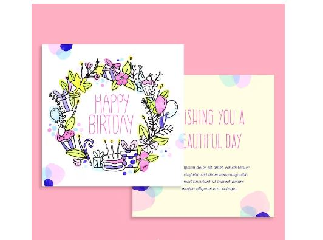

This article has been written and researched by our expert Loveable through a precise methodology. [Learn more about our methodology](https://avada.io/loveable/our-methodological.html)

[Loveable](https://avada.io/loveable/) > [Blog](https://avada.io/loveable/blog/) > [Holiday](https://avada.io/loveable/holiday/)

# 15 Heartfelt Birthday Poems for Your Loved Ones

Written by [Blake Simpson](https://avada.io/loveable/author/blake/) Last Updated on September 26, 2023

- [15 Heartfelt Birthday Poems for Your Loved Ones](https://avada.io/loveable/blog/birthday-poems/#wp-block-heading-2-4)
    - [1\. When I Wish You “Happy Birthday” By Kevin Nishmas](https://avada.io/loveable/blog/birthday-poems/#wp-block-heading-3-6)
    - [2\. Blessed, Loved and Carefree By Kevin Nishmas](https://avada.io/loveable/blog/birthday-poems/#wp-block-heading-3-19)
    - [3\. Feel Your Spirit Burn By Kevin Nishmas](https://avada.io/loveable/blog/birthday-poems/#wp-block-heading-3-33)
    - [4\. Every One of Your Birthdays By Joanna Fuchs](https://avada.io/loveable/blog/birthday-poems/#wp-block-heading-3-46)
    - [5\. A Birthday by Christina Georgina Rossetti](https://avada.io/loveable/blog/birthday-poems/#wp-block-heading-3-67)
    - [6\. A Precious Flower By Kevin Nishmas](https://avada.io/loveable/blog/birthday-poems/#wp-block-heading-3-85)
    - [7\. Birthday Blessings by Howard The Motivational Poet Simon](https://avada.io/loveable/blog/birthday-poems/#wp-block-heading-3-102)
    - [8\. One Gift You Cannot Buy By Kevin Nishmas](https://avada.io/loveable/blog/birthday-poems/#wp-block-heading-3-117)
    - [9\. Happy Birthday Dear Friend by Anjali Sinha](https://avada.io/loveable/blog/birthday-poems/#wp-block-heading-3-131)
    - [10\. Birthday Blessings By Joanna Fuchs](https://avada.io/loveable/blog/birthday-poems/#wp-block-heading-3-176)
    - [11\. Even When By Kevin Nishmas](https://avada.io/loveable/blog/birthday-poems/#wp-block-heading-3-193)
    - [12\. A Birthday Wish for Our Own Robert Frost by Bonnie Collins](https://avada.io/loveable/blog/birthday-poems/#wp-block-heading-3-211)
    - [13\. Happy Birthday, Special Treasure By Joanna Fuchs](https://avada.io/loveable/blog/birthday-poems/#wp-block-heading-3-230)
    - [14\. My Beautiful Birthday Boy By Kevin Nishmas](https://avada.io/loveable/blog/birthday-poems/#wp-block-heading-3-250)
    - [15\. You Can Do It By Kevin Nishmas](https://avada.io/loveable/blog/birthday-poems/#wp-block-heading-3-265)
- [To Wrap Up,](https://avada.io/loveable/blog/birthday-poems/#wp-block-heading-2-289)

Are you looking for **happy birthday poems**? You can find special poems here to wish your loved ones a happy birthday uniquely. Poems can be cool, smart, happy, funny, romantic, or inspiring, and they’re a great way to say “Happy Birthday” to the people you care about. 

You can use, change, or combine the clever, cool, cute, funny, happy, inspirational, romantic, and heartfelt poems below to make your birthday wishes. If you need ideas, just go to the section with the poems you need for today.

In addition to finding lovely birthday poems, you can explore Loveable’s special [birthday gift collection](https://avada.io/loveable/birthday/) for unique ideas to delight your loved ones!

## **15 Heartfelt Birthday Poems for Your Loved Ones**

### **1\. When I Wish You “Happy Birthday” By Kevin Nishmas**

When I wish you “happy birthday,”

There’s so much more I want to say,

Though it’s hard to utter the words,

Nothing’s going to stop me today.

When I wish you “happy birthday,”

What I mean is “I love you,”

You’re more than the world to me,

I’m so thankful for all you do.

When I wish you “happy birthday,”

It’s because you make me proud,

Now that I’ve put down these words,

I just want to scream them out loud.

### **2\. Blessed, Loved and Carefree By Kevin Nishmas**

Your special day comes once a year,

It’s 24 hours of celebrating you,

I’m not sure about most things,

But this much I know is true.

Your birthday is a gift of love,

Some believe it’s heaven sent,

I think it’s a gift you give yourself,

A day you do all you’ve dreamt.

So I wish you “happy birthday,”

Because you deserve to be,

Every moment all day long,

Blessed, loved and carefree.

### **3\. Feel Your Spirit Burn** **By Kevin Nishmas**

You live for the chase,

Keen to run all day long,

Free from the thought of rest,

You know you can do no wrong.

You savor each step of the way,

Bending to each twist and turn,

Your head’s deep in the game,

You can feel your spirit burn. 

Even close to the finish line,

Fierce enough to win the race,

Your heart’s set on running,

You live for the chase.

### **4\. Every One of Your Birthdays By Joanna Fuchs**

Every one of your birthdays

is a gift to the rest of us

who have had the pleasure

of having you in our lives

for another year.

Every one of your birthdays

brings joyful memories

of your bright smile

and your love of life.

Every one of your birthdays

reminds us of your sensitivity

and service to others,

and other delights

too numerous to name

that we are gifted with

just by knowing you.

Happy Birthday

to one in a million.

May you, and we

enjoy many more.

### **5\. A Birthday by Christina Georgina Rossetti**

My heart is like a singing bird

Whose nest is in a water’d shoot;

My heart is like an apple-tree

Whose boughs are bent with thickset fruit;

My heart is like a rainbow shell

That paddles in a halcyon sea;

My heart is gladder than all these

Because my love is come to me.

Raise me a dais of silk and down;

Hang it with vair and purple dyes;

Carve it in doves and pomegranates,

And peacocks with a hundred eyes;

Work it in gold and silver grapes,

In leaves and silver fleurs-de-lys;

Because the birthday of my life

Is come, my love is come to me.

### **6\. A Precious Flower By Kevin Nishmas**

You’re my little sister,

Younger only by birth,

Nobody is like you,

Nobody on this earth.

There’s only one you,

You are a precious flower,

The find you least expect,

The bloom that empowers.

There’s no need to change you,

You are as you should be,

You are love uncontained,

Boundless hope forever free.

You were born a blessing,

Beautiful from the start,

You’re my little sister,

Evermore in my heart.

### **7\. Birthday Blessings** **by Howard The Motivational Poet Simon**

The sun got out of bed

Swam across the ocean

Just to shine on you today

The wind climbed mountains

Endured dusty deserts

Just to blow on you today

The birds organized their orchestra

Traveled to nearby trees

Just to serenade you today

The rain descended high heavens

Bowed at your feet

Just to refresh you today

I join all of nature in wishing you

A blessed birthday today

### **8\. One Gift You Cannot Buy By Kevin Nishmas**

There’s one gift you cannot buy,

A buried treasure precious and true,

It’s the gift of a close, kind friend,

Exactly what I have in you.

We’ve shared each other’s joys,

And cried on each other’s shoulders,

These are our precious moments,

That make us stronger, even bolder.

So I wish you “Happy birthday,”

With all my heart and soul,

We’ll be best friends forever,

Two halves of one fabulous whole.

### **9\. Happy Birthday Dear Friend by Anjali Sinha**

On this day,

to your Pa and Ma

a condign star was born.

A precious one,

God gave this world,

a special gift

That was YOU,

the day YOU were born.

Your sempervirent nature,

touched many lives I know,

A sempiternal brook of kindness

that wants to merge with the ocean.

A difference in this world

YOU made,

Not only for me

But those around YOU too.

On this your birthday,

I wish YOU a life of blessedness.

May all your fondest dreams come true,

That with every candle on your birthday cake,

a lovely surprise await YOU.

My wish for YOU -that whatsoever

YOU want most in life-

come your way,

just the way YOU imagined it

or maybe better.

I hope YOU treasure

this friendship,

and nothing can succedaneum this,

as much I do.

Look forward,

for many more happy birthdays

to follow,

in friendship with YOU,

Happy Birthday dear friend

I wish God’s opulent Blessings inundate YOU

And good wishes, to last YOU all lifes through

And with this sincerest hope and joy

That will never end

From which YOU can

to others lend.

May each new birthday

Be the best YOU ever knew

### **10\. Birthday Blessings By Joanna Fuchs**

Instead of counting candles,

Or tallying the years,

Contemplate your blessings now,

As your birthday nears.

Consider special people

Who love you, and who care,

And others who’ve enriched your life

Just by being there.

Think about the memories

Passing years can never mar,

Experiences great and small

That have made you who you are.

Another year is a happy gift,

So cut your cake, and say,

“Instead of counting birthdays,

I count blessings every day!”

### **11\. Even When By Kevin Nishmas**

Even when I’m hanging by a thread,

And I don’t want to let go at all,

I can still release my grip to fate,

Because I know you will catch my fall.

Even when I’m walking on thin ice,

And there’s simply nowhere to run,

You take me to kinder, higher ground,

Where brave souls and wild hearts are one.

Even when I need to stand my ground,

And I only have one leg to stand on,

I lean on you for strength and faith,

Braving the struggle until it’s gone.

Even when my cup has runneth over,

And I cannot take another drop,

You gladly give me your own glass,

Infused with love and filled to the top.

### **12\. A Birthday Wish for Our Own Robert Frost by Bonnie Collins**

Happy Birthday to someone who

is celebrating it very soon

If I could send a bouquet of

sunshine, I would, however

this wish from my heart will

have to do

The enjoyment you have

given us through your tender

words of natures crest

and fill our hearts with happiness

at the same moment can take

a small item, a lonely accorn and

transform its life to the fallen ground

All of nature comes through your eyes,

and shows throughout your heart,

so on this day comming forth on

the new year, may I say Happy Birthday

Andrew……

### **13\. Happy Birthday, Special Treasure By Joanna Fuchs**

God gave a gift to the world when you were born—

a person who loves, who cares,

who sees a person’s need and fills it,

who encourages and lifts people up,

who spends energy on others

rather than herself,

someone who touches each life she enters,

and makes a difference in the world,

because ripples of kindness flow outward

as each person you have touched, touches others.

Your birthday deserves to be a national holiday,

because you are a special treasure

for all that you’ve done.

May the love you have shown to others

return to you, multiplied.

I wish you the happiest of birthdays,

and many, many more,

so that others have time to appreciate you

as much as I do.

### **14\. My Beautiful Birthday Boy By Kevin Nishmas**

Happy birthday!

Sweet like a honey drop,

As loving as can be,

A heart the size of an ocean,

A soul filled with glee.

You’re not just a siren song,

You’re a lifelong symphony,

Your rhythm moves me,

To rise up, dance and sing.

I’m glad you were born today,

My beautiful birthday boy,

You make my life stunning,

And fill it with such joy.

### **15\. You Can Do It By Kevin Nishmas**

I know you can do it,

If you would only try,

It’s mind over matter,

There is no better high.

You must forget yourself,

And let go of what’s dear,

You’ll see beyond the noise,

You will conquer your fear.

If you’re afraid to fail,

Know you are not alone,

Even the brave fight fear,

We all dread the unknown.

But you truly stand out,

The world needs what you bring,

When it’s your turn to shine,

Reach out for the brass ring.

Climb the wall before you,

Build a bridge to cloud nine,

Unsteady ground you’ll tread,

It will be worth your time.

_**See More:**_

- [Best Friend Poems](https://avada.io/loveable/blog/best-friend-poems/)

- Best [Halloween Poems](https://avada.io/loveable/blog/halloween-poems/)

## **To Wrap Up,**

These heartfelt **birthday poems** serve as touching tributes to express your affection for those close to your heart. Whether it’s a simple gesture of love or a profound sentiment, these verses offer a beautiful way to celebrate the special people in your life. Each poem carries the power to create lasting memories and cherished moments, making birthdays even more meaningful. So, embrace the warmth of these poetic words and let them add an extra layer of love and joy to your loved ones’ special day.

- [15 Heartfelt Birthday Poems for Your Loved Ones](https://avada.io/loveable/blog/birthday-poems/#wp-block-heading-2-4)
    - [1\. When I Wish You “Happy Birthday” By Kevin Nishmas](https://avada.io/loveable/blog/birthday-poems/#wp-block-heading-3-6)
    - [2\. Blessed, Loved and Carefree By Kevin Nishmas](https://avada.io/loveable/blog/birthday-poems/#wp-block-heading-3-19)
    - [3\. Feel Your Spirit Burn By Kevin Nishmas](https://avada.io/loveable/blog/birthday-poems/#wp-block-heading-3-33)
    - [4\. Every One of Your Birthdays By Joanna Fuchs](https://avada.io/loveable/blog/birthday-poems/#wp-block-heading-3-46)
    - [5\. A Birthday by Christina Georgina Rossetti](https://avada.io/loveable/blog/birthday-poems/#wp-block-heading-3-67)
    - [6\. A Precious Flower By Kevin Nishmas](https://avada.io/loveable/blog/birthday-poems/#wp-block-heading-3-85)
    - [7\. Birthday Blessings by Howard The Motivational Poet Simon](https://avada.io/loveable/blog/birthday-poems/#wp-block-heading-3-102)
    - [8\. One Gift You Cannot Buy By Kevin Nishmas](https://avada.io/loveable/blog/birthday-poems/#wp-block-heading-3-117)
    - [9\. Happy Birthday Dear Friend by Anjali Sinha](https://avada.io/loveable/blog/birthday-poems/#wp-block-heading-3-131)
    - [10\. Birthday Blessings By Joanna Fuchs](https://avada.io/loveable/blog/birthday-poems/#wp-block-heading-3-176)
    - [11\. Even When By Kevin Nishmas](https://avada.io/loveable/blog/birthday-poems/#wp-block-heading-3-193)
    - [12\. A Birthday Wish for Our Own Robert Frost by Bonnie Collins](https://avada.io/loveable/blog/birthday-poems/#wp-block-heading-3-211)
    - [13\. Happy Birthday, Special Treasure By Joanna Fuchs](https://avada.io/loveable/blog/birthday-poems/#wp-block-heading-3-230)
    - [14\. My Beautiful Birthday Boy By Kevin Nishmas](https://avada.io/loveable/blog/birthday-poems/#wp-block-heading-3-250)
    - [15\. You Can Do It By Kevin Nishmas](https://avada.io/loveable/blog/birthday-poems/#wp-block-heading-3-265)
- [To Wrap Up,](https://avada.io/loveable/blog/birthday-poems/#wp-block-heading-2-289)

### [Blake Simpson](https://avada.io/loveable/author/blake/)

Hi, I'm Blake from Loveable. I help people find perfect gifts for occasions like anniversaries and weddings. I also write a blog about holidays, sharing insights to make them more meaningful. Let's create unforgettable moments together!

- [Twitter](https://twitter.com/intent/tweet)
- [Facebook](https://www.facebook.com/sharer/sharer.php)
- [instagram](https://avada.io/loveable/blog/birthday-poems/)
- [pinterest](https://www.pinterest.com/loveablellc/)

## Related Posts

[### 120+ Christian Birthday Wishes To Spread Your Love](https://avada.io/loveable/blog/christian-birthday-wishes/) 

[

### 35 Best 70th Birthday Ideas To Celebrate The Special Milestone

](https://avada.io/loveable/blog/70th-birthday-ideas/)

[

### 50 Best 30th Birthday Decorations for a Remarkable Birthday Bash

](https://avada.io/loveable/blog/30th-birthday-decorations/)

[

### 40 Delicious Vegan Christmas Desserts to Delight Your Palate

](https://avada.io/loveable/blog/vegan-christmas-desserts/)

[

### 60 Christmas Team Building Activities to Boost Workplace Spirit

](https://avada.io/loveable/blog/christmas-team-building-activities/)
