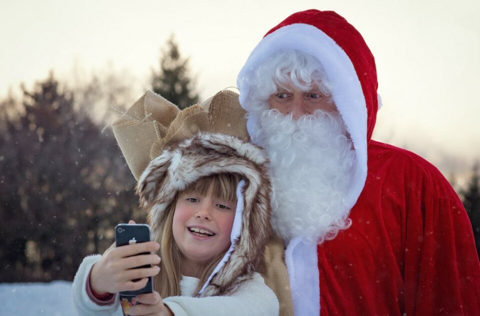
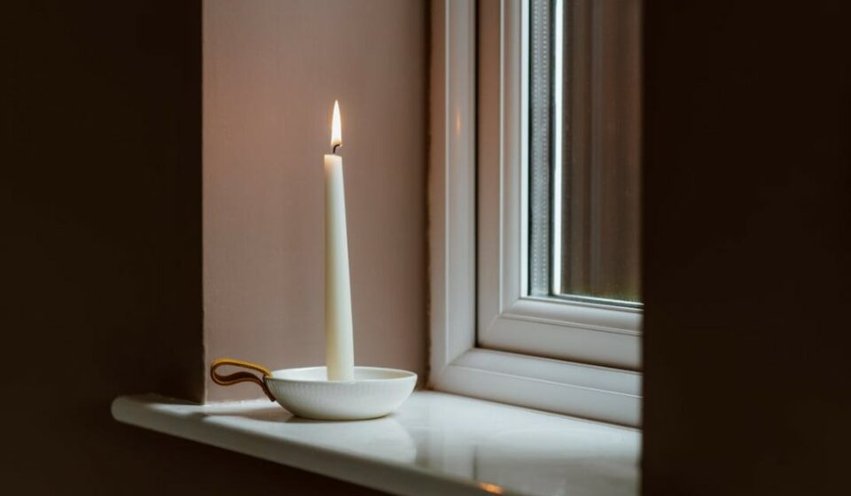
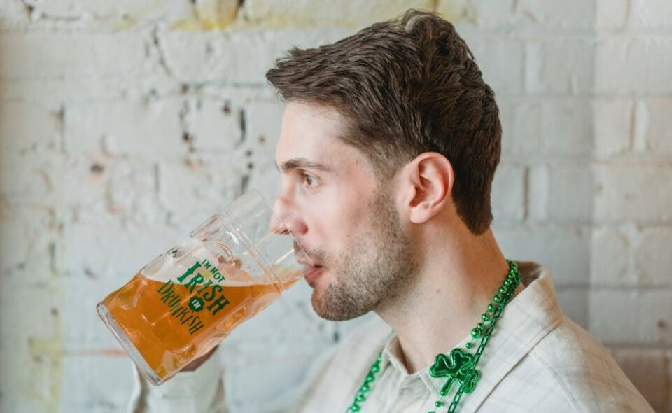
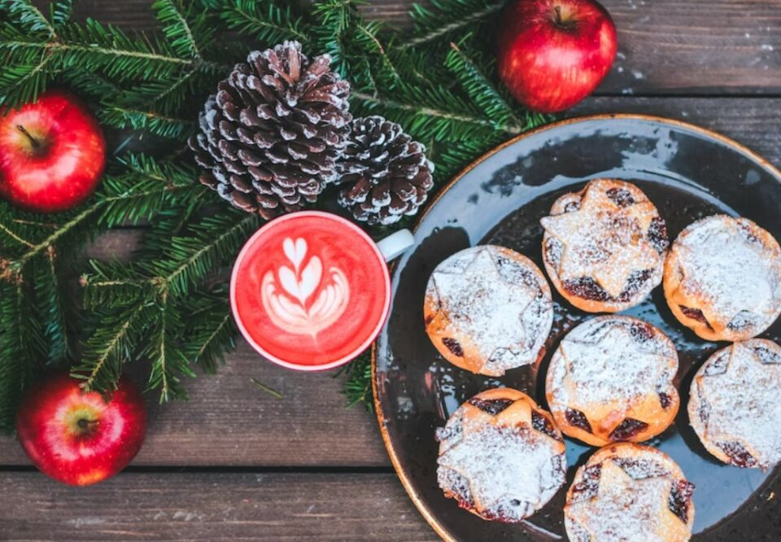
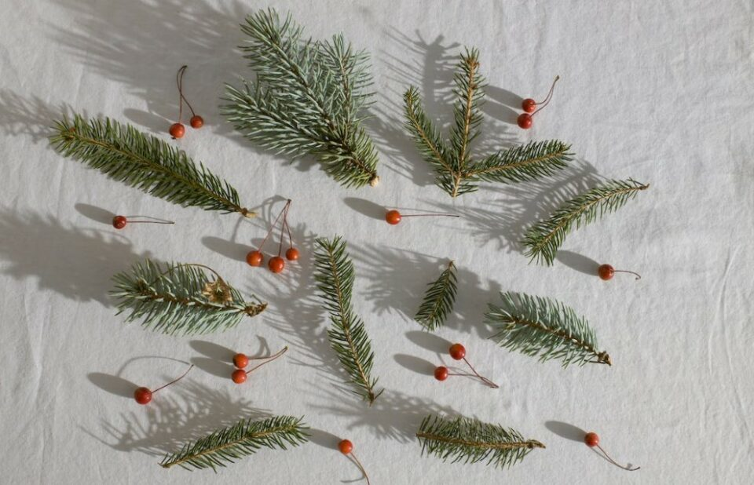
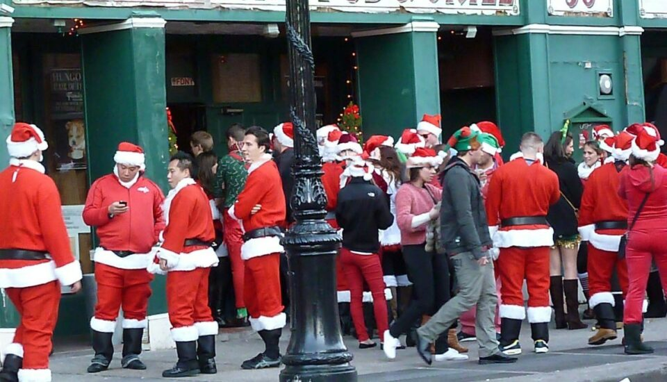
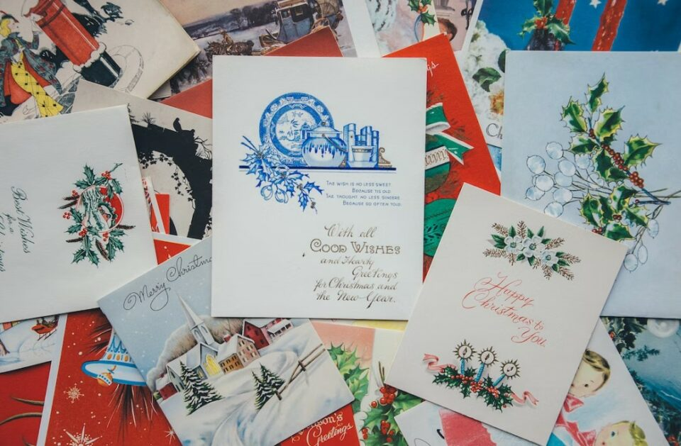
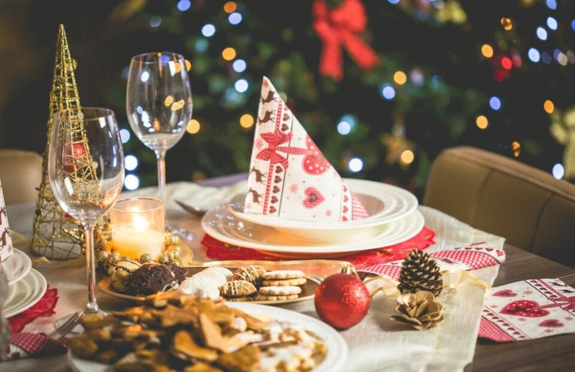
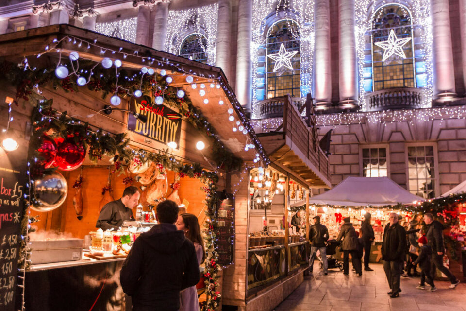
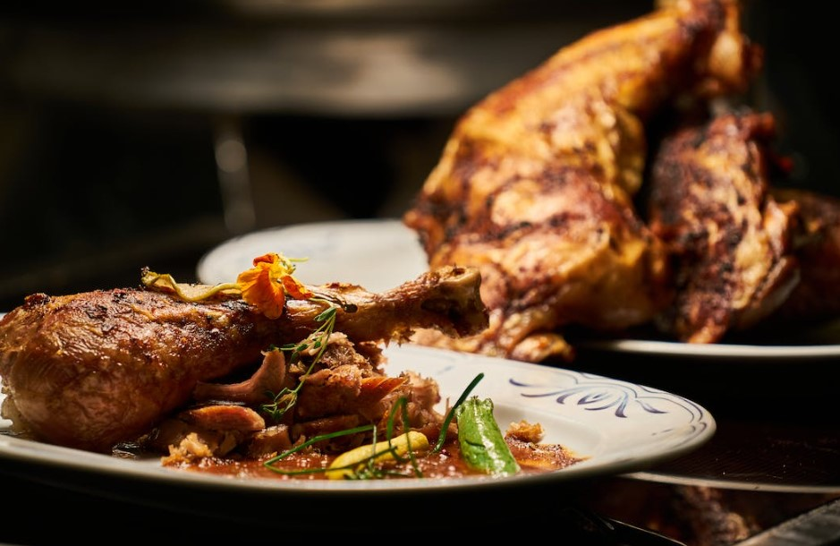

This article has been written and researched by our expert Loveable through a precise methodology. [Learn more about our methodology](https://avada.io/loveable/our-methodological.html)

[Loveable](https://avada.io/loveable/) > [Blog](https://avada.io/loveable/blog/) > [Holiday](https://avada.io/loveable/holiday/)

# 15 Impressive Irish Christmas Traditions that’ll Blow Your Mind

Written by [Blake Simpson](https://avada.io/loveable/author/blake/) Last Updated on September 13, 2023

- [15 Impressive Irish Christmas Traditions That’ll Blow Your Mind](https://avada.io/loveable/blog/irish-christmas-traditions/#wp-block-heading-2-3)
    - [1\. The Arrival Of Santy](https://avada.io/loveable/blog/irish-christmas-traditions/#wp-block-heading-3-4)
    - [2\. Horse Races On St. Stephen’s Day](https://avada.io/loveable/blog/irish-christmas-traditions/#wp-block-heading-3-8)
    - [3\. A Candle In The Window](https://avada.io/loveable/blog/irish-christmas-traditions/#wp-block-heading-3-12)
    - [4\. Wren Boys And Saint Stephen’s Day](https://avada.io/loveable/blog/irish-christmas-traditions/#wp-block-heading-3-16)
    - [5\. Guinness And Mince Pies For Santa Claus](https://avada.io/loveable/blog/irish-christmas-traditions/#wp-block-heading-3-20)
    - [6\. Christmas Decorations – Holly And Ivy](https://avada.io/loveable/blog/irish-christmas-traditions/#wp-block-heading-3-24)
    - [7\. 12 Pubs Of Xmas](https://avada.io/loveable/blog/irish-christmas-traditions/#wp-block-heading-3-27)
    - [8\. Fasting For Charity](https://avada.io/loveable/blog/irish-christmas-traditions/#wp-block-heading-3-31)
    - [9\. Sending Christmas Cards](https://avada.io/loveable/blog/irish-christmas-traditions/#wp-block-heading-3-35)
    - [10\. Midnight Mass On Xmas Eve](https://avada.io/loveable/blog/irish-christmas-traditions/#wp-block-heading-3-40)
    - [11\. Traditional Christmas Fry Up](https://avada.io/loveable/blog/irish-christmas-traditions/#wp-block-heading-3-44)
    - [12\. Xmas Annuals](https://avada.io/loveable/blog/irish-christmas-traditions/#wp-block-heading-3-47)
    - [13\. Little Christmas For Women](https://avada.io/loveable/blog/irish-christmas-traditions/#wp-block-heading-3-51)
    - [14\. Xmas Dinner With Turkey](https://avada.io/loveable/blog/irish-christmas-traditions/#wp-block-heading-3-55)
    - [15\. Christmas Shopping On December 8th](https://avada.io/loveable/blog/irish-christmas-traditions/#wp-block-heading-3-59)
- [Bottom Line](https://avada.io/loveable/blog/irish-christmas-traditions/#wp-block-heading-2-66)

Amidst the enchanting landscapes of Ireland, a land rich in culture and history, a magical time of the year unfolds. **Irish Christmas traditions** come alive as the festive spirit takes hold, weaving a tapestry of warmth, merriment, and old-world charm. These cherished traditional Irish customs, passed down through generations, infuse the holiday season with a unique blend of joy and reverence that captivates hearts worldwide.

With each passing year, these customs remind us that the true magic of the season lies in the bonds we share and the stories we tell, bridging generations and cultures with a warmth that knows no boundaries.

## **15 Impressive Irish Christmas Traditions That’ll Blow Your Mind**

### **1\. The Arrival Of Santy**

Much akin to his presence in the United States, Santa Claus, also known as Santy, visits Ireland. Preparations involve meticulously cleaning chimneys to ensure his seamless entry into homes, thus safeguarding his iconic red attire from dirt or soot.

The imminent arrival of Santa and the gifts he bears are a source of great excitement and anticipation among Irish youngsters.

### **2\. Horse Races On St. Stephen’s Day**

While St. Stephen may not go with horse races on Ireland’s St. Stephen’s Day, the roots of this festivity seem to diverge from this association. The highly anticipated yearly races held at the Leopardstown racetrack in southern Dublin attract a substantial crowd of about 20,000 enthusiastic attendees. 

However, diving into the historical and cultural context, the direct correlation between this gathering and the historical Germanic practice of horse racing on the same day appears slightly at best as a respectful tribute to the saint.

### **3\. A Candle In The Window**

During the 1970s, a tradition that enjoyed immense popularity but appears to be fading in contemporary times is the ‘candle in the window’ tradition. 

This ritual holds deep symbolic significance as it harks back to extending a hospitable gesture to Joseph and Mary during their quest for shelter. The candle guided unfamiliar travelers and conveyed a profound compassion message, particularly to the less fortunate. The place might foster a sense of interconnectedness and shared humanity.

### **4\. Wren Boys And Saint Stephen’s Day**

In the rustic expanses of Ireland, predominantly within the Munster region, a captivating tradition unfolds on St. Stephen’s Day that brings together people of all ages. This unique Irish Christmas Tradition involves donning time-worn attire and adorning faces with vivid pigments. The participants embark on a merry journey, traversing from one abode to another in a harmonious procession. 

As they move, the air becomes infused with the harmonious melodies of songs, the rhythmic cadence of dance, and the enchanting strains of musical renditions. This captivating spectacle – Wren Day, presents a multifaceted celebration that bridges generations and creates a memorable tapestry of communal merriment.

### **5\. Guinness And Mince Pies For Santa Claus**

All of us are familiar with the tradition of setting out milk and cookies as a delightful offering for Santa Claus. However, the customs diverge distinctly in Ireland, where a unique approach prevails, and Santa, referred to as “Santy,” has a penchant for indulging in heartfelt treats.

In this charming corner of the world, the norm shifts toward presenting a pint of the iconic Guinness beer symbolic of Irish conviviality. This delectable combination paints a vivid culinary portrait of Irish Christmas offerings.

### **6\. Christmas Decorations – Holly And Ivy**

Nowadays, Irish homes are decorated with a diverse array of Christmas decorations. The outdoor lighting trend has experienced a surge in recent years, while the tradition of [Christmas trees](https://avada.io/loveable/blog/christmas-tree-decorating-ideas/) has maintained its beloved status for roughly seventy years. Within indoor spaces, customary adornments like holly and ivy have played a significant role, with a preference leaning toward ivy adorned with red berries.

### **7\. 12 Pubs Of Xmas**

An age-old Christmas song alludes to the 12 days preceding Christmas Day, spotlighting the tokens of affection exchanged by enamored partners during this span. Yet, envision a more extraordinary gesture – presenting your beloved with a distinctive offering: a pint from each of the region’s most esteemed twelve pubs. 

This endearing custom has become a favored choice among locals and visitors, encapsulating the celebration that Ireland exudes. However, undertaking this venture, only a select few manage to traverse this pleasant journey to its culmination!

### **8\. Fasting For Charity**

Certain charitable organizations in Ireland orchestrate a noteworthy endeavor through 48-hour fasting campaigns. It is strategically devised to generate essential funds for the underprivileged segments of society.

During this Irish Christmas Tradition of Fasting For Charity, participants undertake a challenging feat, abstaining from food intake for 48 hours while sustaining themselves solely with water. The outcome of their dedication and sacrifice is truly remarkable.

### **9\. Sending Christmas Cards**

Throughout the annals of Irish culture, they send their lovable Christmas greetings through physical cards sent by mail, conveying warmth and goodwill to cherished family and friends. 

In days of yore, these carefully chosen cards took on their own life, becoming more than mere paper with well-wishes. They changed into cherished tokens adorning both mantelpieces and walls. These festively decorated cards nestle into the heart of an Irish household’s Christmas decor, weaving a visual narrative of affection and shared joy.

**_See more_:** _Best [Personalized Christmas Cards](https://avada.io/loveable/personalized-christmas-cards/)_

### **10\. Midnight Mass On Xmas Eve**

Christmas Eve Mass carries substantial importance in Irish culture. It is a noteworthy religious ceremony that intricately weaves a sense of observance. This holds even for those who might not frequently attend church services during the rest of the year.

The uniqueness of this evening fosters a shared resolve among individuals to unite in this congregation. The anticipation of the occasion arouses a collective commitment to participate. It forges a bond that transforms personal routines and underscores the essence of communal spirit during this significant season.

### **11\. Traditional Christmas Fry Up**

In keeping with tradition, the commencement of Christmas morning is marked by a hearty breakfast known as a “fry up.” This meal encompasses a medley of skillfully fried items, including eggs, bacon, sausages, black pudding, white pudding, potato farls, and occasionally baked beans, which vary based on each family’s preferences.

### **12\. Xmas Annuals**

During the Christmas season, it’s customary for Irish children to receive volumes known as annuals. These books encompass several elements, including brief narratives and interactive activities. We can enjoy games, puzzles, word search challenges, captivating cartoons, and vivid photographs.

These cherished annuals are bestowed upon the young recipients by Santa Claus on occasion, or they might be presented as heartfelt gifts from dear family members and friends. The choices are abundant in Irish bookstores and gift shops.

### **13\. Little Christmas For Women**

January 6th, as the Feast of the Epiphany arrives, Ireland partakes in the festivities of Little Christmas, also recognized as Women’s Christmas, or Nollaig na mBan. Historically denoting the conclusion of the 12-day Christmas period, this day is a tribute to the women who tirelessly dedicated themselves during the holiday season.

During this occasion, the roles are reversed, with men assuming household responsibilities, allowing women to reconnect with friends, perhaps enjoy visiting a local pub, and generally relish a day of relaxation and rejuvenation.

### **14\. Xmas Dinner With Turkey**

At the heart of the Irish Christmas dinner is the turkey accompanied by stuffing, typically of sage and onion or thyme and onion varieties. In addition to the turkey, ham commonly shares the table. Popular accompaniments include Brussels sprouts. While options like carrot and parsnip mash, glazed carrots, and cauliflower cheese add delectable dimensions. 

Christmas dinner involves setting the table again with milk, bread, and a candle to offer a welcoming gesture to any wandering traveler. This age-old practice was initially intended to symbolize the hospitality extended to Mary and Joseph.

### **15\. Christmas Shopping On December 8th**

In years past, December 8th held significant importance as a major shopping day in Ireland. This date was considered a holy day of obligation on the Catholic church calendar, resulting in Irish children having a day off from school.

This day is marked when rural residents from various parts of Ireland flock to larger towns and cities to complete their Christmas shopping.

**_See More:_**

- [Italian Christmas Traditions](https://avada.io/loveable/blog/italian-christmas-traditions/)

- [Mexican Christmas Traditions](https://avada.io/loveable/blog/mexican-christmas-traditions/)

## **Bottom Line**

In the realm of **Irish Christmas traditions**, a tapestry of old-world charm and contemporary merriment is woven. From the iconic candle in the window to the heartwarming Laden Table, each practice carries the essence of unity, generosity, and community. These cherished rituals, steeped in culture, remind us that the true enchantment of the season lies in the bonds we foster and the stories we pass down, bridging generations and infusing the festive season with enduring magic.

- [15 Impressive Irish Christmas Traditions That’ll Blow Your Mind](https://avada.io/loveable/blog/irish-christmas-traditions/#wp-block-heading-2-3)
    - [1\. The Arrival Of Santy](https://avada.io/loveable/blog/irish-christmas-traditions/#wp-block-heading-3-4)
    - [2\. Horse Races On St. Stephen’s Day](https://avada.io/loveable/blog/irish-christmas-traditions/#wp-block-heading-3-8)
    - [3\. A Candle In The Window](https://avada.io/loveable/blog/irish-christmas-traditions/#wp-block-heading-3-12)
    - [4\. Wren Boys And Saint Stephen’s Day](https://avada.io/loveable/blog/irish-christmas-traditions/#wp-block-heading-3-16)
    - [5\. Guinness And Mince Pies For Santa Claus](https://avada.io/loveable/blog/irish-christmas-traditions/#wp-block-heading-3-20)
    - [6\. Christmas Decorations – Holly And Ivy](https://avada.io/loveable/blog/irish-christmas-traditions/#wp-block-heading-3-24)
    - [7\. 12 Pubs Of Xmas](https://avada.io/loveable/blog/irish-christmas-traditions/#wp-block-heading-3-27)
    - [8\. Fasting For Charity](https://avada.io/loveable/blog/irish-christmas-traditions/#wp-block-heading-3-31)
    - [9\. Sending Christmas Cards](https://avada.io/loveable/blog/irish-christmas-traditions/#wp-block-heading-3-35)
    - [10\. Midnight Mass On Xmas Eve](https://avada.io/loveable/blog/irish-christmas-traditions/#wp-block-heading-3-40)
    - [11\. Traditional Christmas Fry Up](https://avada.io/loveable/blog/irish-christmas-traditions/#wp-block-heading-3-44)
    - [12\. Xmas Annuals](https://avada.io/loveable/blog/irish-christmas-traditions/#wp-block-heading-3-47)
    - [13\. Little Christmas For Women](https://avada.io/loveable/blog/irish-christmas-traditions/#wp-block-heading-3-51)
    - [14\. Xmas Dinner With Turkey](https://avada.io/loveable/blog/irish-christmas-traditions/#wp-block-heading-3-55)
    - [15\. Christmas Shopping On December 8th](https://avada.io/loveable/blog/irish-christmas-traditions/#wp-block-heading-3-59)
- [Bottom Line](https://avada.io/loveable/blog/irish-christmas-traditions/#wp-block-heading-2-66)

### [Blake Simpson](https://avada.io/loveable/author/blake/)

Hi, I'm Blake from Loveable. I help people find perfect gifts for occasions like anniversaries and weddings. I also write a blog about holidays, sharing insights to make them more meaningful. Let's create unforgettable moments together!

- [Twitter](https://twitter.com/intent/tweet)
- [Facebook](https://www.facebook.com/sharer/sharer.php)
- [instagram](https://avada.io/loveable/blog/irish-christmas-traditions/)
- [pinterest](https://www.pinterest.com/loveablellc/)

## Related Posts

[### 120+ Christian Birthday Wishes To Spread Your Love](https://avada.io/loveable/blog/christian-birthday-wishes/) 

[

### 35 Best 70th Birthday Ideas To Celebrate The Special Milestone

](https://avada.io/loveable/blog/70th-birthday-ideas/)

[

### 50 Best 30th Birthday Decorations for a Remarkable Birthday Bash

](https://avada.io/loveable/blog/30th-birthday-decorations/)

[

### 40 Delicious Vegan Christmas Desserts to Delight Your Palate

](https://avada.io/loveable/blog/vegan-christmas-desserts/)

[

### 60 Christmas Team Building Activities to Boost Workplace Spirit

](https://avada.io/loveable/blog/christmas-team-building-activities/)
