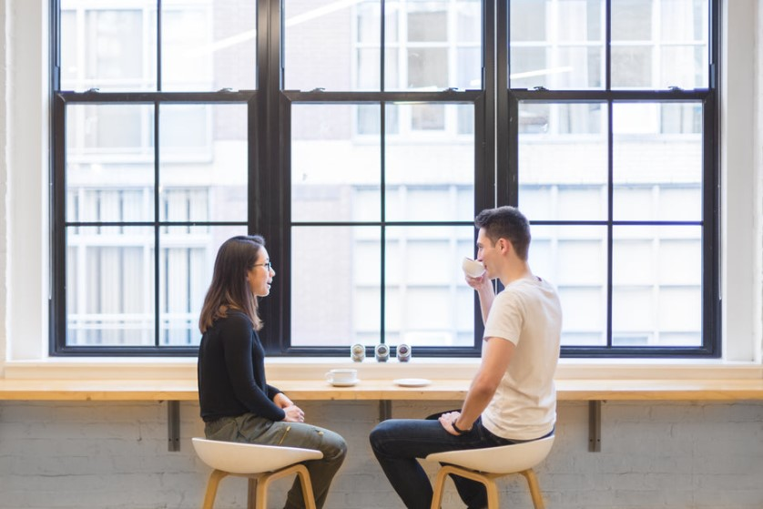

This article has been written and researched by our expert Loveable through a precise methodology. [Learn more about our methodology](https://avada.io/loveable/our-methodological.html)

[Loveable](https://avada.io/loveable/) > [Blog](https://avada.io/loveable/blog/) > [Relationship](https://avada.io/loveable/relationship/)

# 15+ Things To Talk About On A First Date To Make A Strong Impression

Written by [Luna Miller](https://avada.io/loveable/author/luna/) Last Updated on August 22, 2023

- [What to talk about on a first date?](https://avada.io/loveable/blog/what-to-talk-about-on-first-date/#wp-block-heading-2-4)
    - [1\. Start a conversation with the basics](https://avada.io/loveable/blog/what-to-talk-about-on-first-date/#wp-block-heading-3-6)
    - [2\. Consider, notice and ask about small details](https://avada.io/loveable/blog/what-to-talk-about-on-first-date/#wp-block-heading-3-10) 
    - [3\. Give some subtle compliments](https://avada.io/loveable/blog/what-to-talk-about-on-first-date/#wp-block-heading-3-13)
    - [4\. Pay attention to their attitude when communicating with you](https://avada.io/loveable/blog/what-to-talk-about-on-first-date/#wp-block-heading-3-23)
    - [5\. Talk About Your Hometown](https://avada.io/loveable/blog/what-to-talk-about-on-first-date/#wp-block-heading-3-26)
    - [6\. Explore Preferences](https://avada.io/loveable/blog/what-to-talk-about-on-first-date/#wp-block-heading-3-36)
    - [7\. Talk about how they feel about their occupation](https://avada.io/loveable/blog/what-to-talk-about-on-first-date/#wp-block-heading-3-44)
    - [8\. Discuss the movies, TV shows, and books you enjoy](https://avada.io/loveable/blog/what-to-talk-about-on-first-date/#wp-block-heading-3-47)
    - [9\. Talk about your Hobbies Openly](https://avada.io/loveable/blog/what-to-talk-about-on-first-date/#wp-block-heading-3-50)
    - [10\. Confer about traveling](https://avada.io/loveable/blog/what-to-talk-about-on-first-date/#wp-block-heading-3-53)
    - [11\. Discuss your favorite music](https://avada.io/loveable/blog/what-to-talk-about-on-first-date/#wp-block-heading-3-56)
    - [12\. Talk about your favorite food](https://avada.io/loveable/blog/what-to-talk-about-on-first-date/#wp-block-heading-3-59)
    - [13\. Mention something about your dating profile](https://avada.io/loveable/blog/what-to-talk-about-on-first-date/#wp-block-heading-3-62)
    - [14\. Share your ambition in life, and work](https://avada.io/loveable/blog/what-to-talk-about-on-first-date/#wp-block-heading-3-66)
    - [15\. Share each other’s best memories](https://avada.io/loveable/blog/what-to-talk-about-on-first-date/#wp-block-heading-3-75)
    - [16\. Ask what their expectation is for this meeting](https://avada.io/loveable/blog/what-to-talk-about-on-first-date/#wp-block-heading-3-79)
    - [17\. Keep your conversation interesting](https://avada.io/loveable/blog/what-to-talk-about-on-first-date/#wp-block-heading-3-87)
    - [18\. Know when to over](https://avada.io/loveable/blog/what-to-talk-about-on-first-date/#wp-block-heading-3-92)
- [What you should not talk about](https://avada.io/loveable/blog/what-to-talk-about-on-first-date/#wp-block-heading-2-102)

Are you nervous about your upcoming first date? Talking on a first date might be intimidating. It might be tough to know what to say, how to broach certain topics, and how to guarantee that you and your date match each other. Careful preparation is indispensable for such important meetings, besides dressing properly, a list of appropriate questions about **what to talk about on a first date** is necessary. 

It might be beneficial to consider the talks you must avoid. These issues such as politics or religion, as well as anything that might be deemed too intimate or improper. Rather than asking general questions, try to find out what makes somebody unique. This can help you understand their ideals and the relationships they have with individuals who are important to them. 

Here are some ideas on what to talk about on a first date to maximize your chances of creating an impact. Read and analyze in detail as a reference to having good look in front of her. Remember that the first look is always important.

## **What to talk about on a first date?**

There is a list of 15+ things to talk about on A first date to make a strong impression for those who need some suggestions. Consider them to talk in turn. In some cases, you can change the order of questions to make the conversation smooth and natural as much as possible. However, don’t depend too much on them, keep in mind that the most important key to successful dating is sincerity. 

### **1\. Start a conversation with the basics**

Start a conversation with the basics

Everything has to start with the basic things whether you like or not because it’s impolite to be too curious the first time. It is said that A good beginning makes a good ending, surely, you must consider leading the conversation to favorable peace in the opening. Deeper talks will flow more effortlessly once you’ve built some solid relationships. It is extremely hard for the first time because of your weak mentality. However, be confident and you’ll be able to steer the discussion to more fascinating and avoid awkward lulls after you know more about your date’s mood.

To set a positive tone and infuse some energy into the flow, you can even enthuse about things you like doing. However, be careful to manage the content of the talk. The questions asked must be closely related and have the same topic; or if you want to change the topic, pay attention to what to talk about next to adjust and lead the conversation smoothly. These early reveals will help the subsequent dialogue feel much smoother and more natural.

### **2\. Consider, notice and ask about small details** 

Never underestimate the value of small things because it is said that “Penny and penny laid up will be many”. Show your appreciation by paying attention to what they said, what they did, and what is their expression. When they are sharing about themselves, try to guess their thought and what would come next to respond appropriately. You can be smart to summarize what they just say to show how you focus on their talks.

In case you see them uncomfortable in the seat, call for an arrangement; or they feel a little bit cold, proactively ask staff to increase the temperature of the air conditioner. You would get a gentle and elegant look from your partner. On the other hand, “small talk” is essential to create the conversation to truly engage with what the other person is saying and to take advantage of any possibilities for you both to start giving unique insights about yourselves. It helps the topic of the talk to last for hours without embarrassment.

### **3\. Give some subtle compliments**

Give some subtle compliments

Everyone loves to hear glowing reviews from others. Giving some compliments about strong points you can see from them. After a short conversation of about 15 to 20 minutes, you should find some ways to praise your date’s personality or energy as well. Some sentence patterns you can use in many cases if you still don’t know what to talk about on a first date.

- I found you so interesting
- You are so funny
- I really love your voice
- You are so much more amazing than I expected
- Your jewelry is so gorgeous and fit for you. Where did you buy it?
- I know the brand of clothes you’re wearing, do you like it too?

Remember that one of the most important things is don’t make it unnatural. It is impolite if you try to compliment their shortcomings, it can be considered an insult and libel. Therefore, the use of compliments must be distributed appropriately in the conversation so as not to cause awkwardness.

### **4\. Pay attention to their attitude when communicating with you**

A person’s attitude may frequently reveal their genuine personality, so it’s also critical to pay attention to their real reactions. When maintaining the conversation, don’t just focus on how to prolong the conversation, but pay attention to how they respond to your questions. Logically switching to another topic keeps the conversation consecutively flowing.

Take care of their postures, gestures, and facial expressions to ensure that everything is going comfortably. If they enthusiastically answer your questions and always show off smiles on face, the dating is truly successful. Besides, listening to their responses when talking about others is also important to judge their personality. Do they tend to blame someone for their mistakes? If they did, be careful to avoid dealing with their troubles.

### **5\. Talk About Your Hometown**

It’s wonderful to share about each other’s origin, not a very sensitive topic. Where they come from can partly reflect their personality and characteristics. It’s just an interesting topic to mention on the first date to understand each other more and whatever the story, you have to show empathy to them. 

If they had a bad experience with their hometown, you could comfort them. Or if they are proud of where they were born, give some positive comments that you love this place too. Deeply exploiting this topic such as tourist sites, history of formation, human life, etc. Sometimes, lies are even needed to get attention from your partners, who will be created thought that they are similar views to you.

Example questions:

- where are you from?
- What are you most proud of about your hometown?
- What you often did when you were a little child?
- What sports did you play with your neighbors?
- what is the most memorable memory in your hometown?
- When you can realize that she’s happy to speak up, the date is pretty much under control. 

### **6\. Explore Preferences**

Explore Preferences

In case you can see the modesty in their answer, you have to be quick to adjust the dialogue. It’s hard to get a detailed answer from open-ended questions, be smart to ask preference questions to have a brief understanding of their hobbies. After collecting “small details” above, let’s dig into them in depth. Ask about what they are truly concerned about. Thanks to this way, you can manage the conversation however you like instead of turning it into an interrogation. It’s softer when you offer some choices for them to choose from. There are several other references below that you can use for any situation to start a new talk.

- Are you an introvert or an extrovert?
- Are you prefer dogs or cats?
- Do you like to stay in the urban or the suburb?
- Would you choose a fun job or a well-paid one?
- For you,  is spending leisure time listening or reading more relaxing?

### **7\. Talk about how they feel about their occupation**

Their current job can partly display their desire and personality. After getting the answer, you should extend the topic with consecutively related questions. However, rather than simply learning what they do for a living, ask about their feeling and motivation to welcome this job. Hence, you’ll probably receive a lot more intriguing, honest response. Showing your desire to understand them more, but don’t cross the line! Instead of a scripted response, you may turn basic queries into in-depth talks in which you elicit the core of who they are as a person.

One more basic courtesy, whatever their job, you don’t have to express disappointment or disrespect. It’s easy to capture your attitude when there are any changes in the face. As a result, dating becomes uncomfortable and awkward, or even in the worst case, they will never want to see you again. 

### **8\. Discuss the movies, TV shows, and books you enjoy**

Discussing what they do in their free time is another great conversation starter. This might include preferred performers, TV series, actors, film studios, and books. In media society, there are many online webs and channels to follow blockbuster movies or books, Netflix is an example of the most popular channel. The topics of favorite TV shows, movies, and novels may help keep the conversation going as you and your partner disclose more about their personalities.

To start this topic, you need to know what types of films they are watching currently. Or you can check them with a trending film at this moment. You can determine whether there are any chemicals with them when they talk about it passionately.

### **9\. Talk about your Hobbies Openly**

This topic is considered the most popular about what to talk about on a first date. Whenever someone talks about your hobby, it’s really fun to share together. By describing your hobbies, you may reveal more about yourself to your partner while also providing an opportunity to learn more about them. By assessing how much free time individuals truly have and how they spend it, you may learn about their preferences.

What do they spend much time enjoying, listening or reading, playing or chilling? There are countless options here since you may discuss a wide range of subjects. No matter do you care about it or not, they are very interested in actively saying what they like. When we can find mutual hobbies, the first date is not enough for the two to confide.

### **10\. Confer about traveling**

Confer about traveling

Traveling is one of the most popular forms of enjoyment today. People find it wonderful to see the heritage of the world. Once you realize that the two have something in common, you can mention beautiful places, where they want to go in the future. Hawaii, New York, London, anywhere to discover how fantastic the world is. Conferring about traveling that partly somewhat grasp their future plans. By talking openly about your dream vacations and preferred travel destinations, you and your partner will have a better understanding of one other’s interests and hobbies. 

### **11\. Discuss your favorite music**

In case they don’t mention it when sharing their hobby list, you have to understand that they don’t prioritize music over their main interests. They definitely have a favorite playlist themselves because no one doesn’t listen to music, that’s for sure. It’s a great date when they both love the same song and singer because there are many aspects to maintain the conversation. 

When you have no idea about the mentioned artists, tactfully ask for more details about them. Besides, whether you and they listen to the same music or not, you must always show respect to their favorite singer. You can also share the best and worst concerts you’ve been to, or whose concert you would like to go to next time.

### **12\. Talk about your favorite food**

Don’t forget the way to the heart is through the stomach, so don’t forget about this topic when you’re struggling to figure out what to talk about on a first date. If this first date is in a restaurant, you should talk about the menu and the food that the two are tasting. Check how they feel about food with questions like “It’s good or bad? Do you into it? How was it decorated?” In case of a bad experience, you won’t back again. 

As the conversation drags on to this point, it’s certain that the second date is necessary. Share with each other the delicious restaurants in town and then book an appointment with that person next time: “Have you have any recommendations for the next time we meet, I hope to get somewhere that can satisfy our taste.”

### **13\. Mention something about your dating profile**

Mention something about your dating profile

Mention something about your dating profile when they want to match you after seeing it. Do you know each other through a dating app or introduced by an acquaintance? Let’s take a look at the points that impress them the most about you. This is quite an interesting topic to consider what they think about you at this moment.

For a long-term relationship, you should mention deal breakers that led to the breakdowns in your previous relationships. The sooner you bring them up, the more willing both of you are to find a solution to deal with. Of course, after comprehending each other’s information, the two will discuss how to solve these problems in order to maintain this relationship.

### **14\. Share your ambition in life, and work**

Back to the living topic. This is the perfect time to talk about the ideas and ambitions that they want to do. You don’t need to suggest what to talk about on a first date for them, ask a question they can freely talk about themselves. Being open and honest with someone may be a terrific approach to getting to know them better when it comes to these major life topics. 

Everyone has their own ambition and they use it as a motivation to strive to live, so it’s great if you can exploit them to understand each other better. 

Example templates of what to talk about on a first date in this topic:

- Is there anything you still can’t do?
- Do you have a special dream that you would like to fulfill?
- Are you going to stay in your current job forever?
- Do you want to challenge yourself in a new field?
- Are you planning to take up a new job if your current job offers few opportunities for advancement?

### **15\. Share each other’s best memories**

Share each other’s best memories

The best memories they’ve had are the right topic as we already have a basic understanding of each other. You can tactfully mention memories of their trip, family, school, or even their loss for a more in-depth look. Listening to your date describe things that have significant meanings for them or made them happy will introduce you to a different side of them. 

When the dialogue is nearing the end but you don’t want to end it, let’s turn this topic again. For example, “What is one of the most unforgettable memories for you so far?”, it’s quite a simple question, but you can dig it very deep if you are professional. After their response, quickly find the connection to lead to your own story. 

### **16\. Ask what their expectation is for this meeting**

Although this question is extremely important, it’s can be impolite to point it out the first time. You can mention this when the date is almost over to see what they think of you after talking. This meeting is scheduled for a special purpose, so you always hope that the two can meet the same demand to avoid waste of time. 

- Why do you want to have a date at this moment?
- Do you think that I can satisfy your demand?
- What are my points leading you to this date?
- Do you want to have a temporary or permanent relationship?
- What do you think about this date, will we have another one?

Do you tend to find a long-term relationship or ONS? It is important to answer. Your date is looking for someone to build a nest together but you just want to have more love experience instead of tying yourself to a pole. Surely, the two need to reconsider this relationship. 

### **17\. Keep your conversation interesting**

Keep your conversation interesting

It’s understandable that prolonging the conversation leads to boredom. If casual conversation annoys you, think about asking more imaginative questions. Humor seems hard for some people, but to keep the conversation interesting, it is the only way. No one wants to spend hours with a tasteless person, you have to show something special only in you. 

There is no principle for sense of humor, each case will have a different treatment, which requires you to be flexible. You could learn some funny jokes or poems to apply to the talk, it could make everything go smoothly. However, be careful because there is a thin line between humor and ungrateful. Some funny samples to follow: “I’m trying to seem like a cool boy in your eyes, so stop making me so interested in you.”

**_Related_**: [W](https://blog-admin.loveable.ai/wp-admin/post.php?post=2032&action=edit)[hen To Say I Love Yo](https://avada.io/loveable/when-to-say-i-love-you/)[u](https://blog-admin.loveable.ai/wp-admin/post.php?post=2032&action=edit)? Are You Ready To Say Them?

### **18\. Know when to over**

No matter how attractive a conversation is, you must be smart and flexible to find the right time to end. Each other is still interesting in each other’s eyes just as long as we have secrets, so don’t show anything on the first date. Make them curious about your life and stimulate them with the implication. 

In the good case, there are chemicals between you and them and the conversation can go on for hours. However, you should leave something for another day to make them hope to see you again. Whether you want to have another meeting or not, it’s time to end the talk to avoid shyness. You would end the talk with some elegant samples like:

- It’s amazing to have the opportunity to be with you. I hope that the time stops flowing to stay, but it’s not.
- It will be more wonderful if I don’t have business tomorrow.
- I think we should have another date to finish this talk.
- I don’t realize that it’s too late. Sorry for my lack of subtlety.

**_See More:_**

- Best [Fall Dates Ideas](https://avada.io/loveable/fall-dates-ideas/) For Couples 

- What Is A [Pillow Talk](https://avada.io/loveable/what-is-a-pillow-talk/)? Use It to Create An Intimate Conversation

## **What you should not talk about**

When it comes to a first date, it can be difficult to know what to talk about. It’s crucial to focus on topics that are interesting and engaging, and to stay away from topics that can make the conversation awkward or uncomfortable. Ask open-ended questions about their interests and hobbies. Besides, the main key for any long-term relationship is sincerity, let’s show them that from you. Enjoy the conversation and remember to be yourself – that’s the best way to make a good impression!

You can make a strong impression on your date by talking openly and honestly. There is a list of **15+ Things To Talk About On A First Date To Make A Strong Impression** no matter who you are or what kind of date you’re on, having the right conversation topics can really make the difference between a successful and enjoyable date, or a forgettable one. 

- [What to talk about on a first date?](https://avada.io/loveable/blog/what-to-talk-about-on-first-date/#wp-block-heading-2-4)
    - [1\. Start a conversation with the basics](https://avada.io/loveable/blog/what-to-talk-about-on-first-date/#wp-block-heading-3-6)
    - [2\. Consider, notice and ask about small details](https://avada.io/loveable/blog/what-to-talk-about-on-first-date/#wp-block-heading-3-10) 
    - [3\. Give some subtle compliments](https://avada.io/loveable/blog/what-to-talk-about-on-first-date/#wp-block-heading-3-13)
    - [4\. Pay attention to their attitude when communicating with you](https://avada.io/loveable/blog/what-to-talk-about-on-first-date/#wp-block-heading-3-23)
    - [5\. Talk About Your Hometown](https://avada.io/loveable/blog/what-to-talk-about-on-first-date/#wp-block-heading-3-26)
    - [6\. Explore Preferences](https://avada.io/loveable/blog/what-to-talk-about-on-first-date/#wp-block-heading-3-36)
    - [7\. Talk about how they feel about their occupation](https://avada.io/loveable/blog/what-to-talk-about-on-first-date/#wp-block-heading-3-44)
    - [8\. Discuss the movies, TV shows, and books you enjoy](https://avada.io/loveable/blog/what-to-talk-about-on-first-date/#wp-block-heading-3-47)
    - [9\. Talk about your Hobbies Openly](https://avada.io/loveable/blog/what-to-talk-about-on-first-date/#wp-block-heading-3-50)
    - [10\. Confer about traveling](https://avada.io/loveable/blog/what-to-talk-about-on-first-date/#wp-block-heading-3-53)
    - [11\. Discuss your favorite music](https://avada.io/loveable/blog/what-to-talk-about-on-first-date/#wp-block-heading-3-56)
    - [12\. Talk about your favorite food](https://avada.io/loveable/blog/what-to-talk-about-on-first-date/#wp-block-heading-3-59)
    - [13\. Mention something about your dating profile](https://avada.io/loveable/blog/what-to-talk-about-on-first-date/#wp-block-heading-3-62)
    - [14\. Share your ambition in life, and work](https://avada.io/loveable/blog/what-to-talk-about-on-first-date/#wp-block-heading-3-66)
    - [15\. Share each other’s best memories](https://avada.io/loveable/blog/what-to-talk-about-on-first-date/#wp-block-heading-3-75)
    - [16\. Ask what their expectation is for this meeting](https://avada.io/loveable/blog/what-to-talk-about-on-first-date/#wp-block-heading-3-79)
    - [17\. Keep your conversation interesting](https://avada.io/loveable/blog/what-to-talk-about-on-first-date/#wp-block-heading-3-87)
    - [18\. Know when to over](https://avada.io/loveable/blog/what-to-talk-about-on-first-date/#wp-block-heading-3-92)
- [What you should not talk about](https://avada.io/loveable/blog/what-to-talk-about-on-first-date/#wp-block-heading-2-102)

### [Luna Miller](https://avada.io/loveable/author/luna/)

I'm Luna Miller, a helpful employee at Loveable. I excel at giving great advice on birthday gifts. I love suggesting memorable experiences like concerts, spas, and getaways. As a reliable and supportive colleague, I'm always there to assist.

- [Twitter](https://twitter.com/intent/tweet)
- [Facebook](https://www.facebook.com/sharer/sharer.php)
- [instagram](https://avada.io/loveable/blog/what-to-talk-about-on-first-date/)
- [pinterest](https://www.pinterest.com/loveablellc/)

## Related Posts

[

### 35 Unforgettable Exciting Adult Birthday Party Ideas

](https://avada.io/loveable/blog/adult-birthday-party-ideas/)

[

### 42 Best 21st Birthday Outfits to Rock the Party

](https://avada.io/loveable/blog/21st-birthday-outfits/)

[

### 50+ Happy 40th Anniversary Quotes, Messages, and Wishes

](https://avada.io/loveable/blog/happy-40th-anniversary-quotes/)

[

### 100+ Heartwarming Happy 30th Anniversary Quotes, Messages, and Wishes

](https://avada.io/loveable/blog/happy-30th-anniversary-quotes/)

[

### 120+ Heartfelt Thank You Messages for The Birthday Wishes

](https://avada.io/loveable/blog/thank-you-messages-birthday-wishes/)
