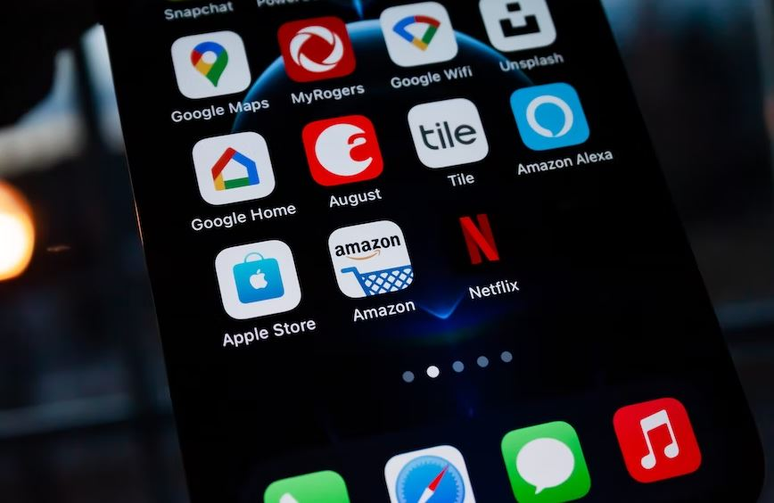

This article has been written and researched by our expert Loveable through a precise methodology. [Learn more about our methodology](https://avada.io/loveable/our-methodological.html)

[Loveable](https://avada.io/loveable/) > [Blog](https://avada.io/loveable/blog/) > [Family](https://avada.io/loveable/family/)

# 15 Tricks to Save Money on Amazon That Make You Surprised

Written by [Rose Bryne](https://avada.io/loveable/author/rose/) Last Updated on August 16, 2023

- [1\. Join Amazon Prime today](https://avada.io/loveable/blog/tricks-to-save-money-amazon/#wp-block-heading-2-3)
- [2\. Bundle your purchases to receive free shipping](https://avada.io/loveable/blog/tricks-to-save-money-amazon/#wp-block-heading-2-8)
- [3\. Get credit from Amazon for choosing slower shipping options](https://avada.io/loveable/blog/tricks-to-save-money-amazon/#wp-block-heading-2-11)
- [4\. Save even more money by clipping Amazon coupons](https://avada.io/loveable/blog/tricks-to-save-money-amazon/#wp-block-heading-2-13)
- [5\. To get the best deal, set an alert](https://avada.io/loveable/blog/tricks-to-save-money-amazon/#wp-block-heading-2-17)
- [6\. Utilize daily discounts](https://avada.io/loveable/blog/tricks-to-save-money-amazon/#wp-block-heading-2-19)
- [7\. Purchase overstocked items at a great discount](https://avada.io/loveable/blog/tricks-to-save-money-amazon/#wp-block-heading-2-22)
- [8\. Trade in items you purchased but do not need](https://avada.io/loveable/blog/tricks-to-save-money-amazon/#wp-block-heading-2-24)
- [9\. Purchase refurbished goods for much less](https://avada.io/loveable/blog/tricks-to-save-money-amazon/#wp-block-heading-2-28)
- [10\. Compare the price](https://avada.io/loveable/blog/tricks-to-save-money-amazon/#wp-block-heading-2-31)
- [11\. Verify independent vendors](https://avada.io/loveable/blog/tricks-to-save-money-amazon/#wp-block-heading-2-34)
- [12\. Actively seek out coupons each day](https://avada.io/loveable/blog/tricks-to-save-money-amazon/#wp-block-heading-2-37)
- [13\. View the Epic Daily Deals page](https://avada.io/loveable/blog/tricks-to-save-money-amazon/#wp-block-heading-2-42)
- [14\. Choose no-rush shipping to receive more benefits](https://avada.io/loveable/blog/tricks-to-save-money-amazon/#wp-block-heading-2-46)
- [15\. Examine cash-back promotions](https://avada.io/loveable/blog/tricks-to-save-money-amazon/#wp-block-heading-2-49)
- [The bottom line](https://avada.io/loveable/blog/tricks-to-save-money-amazon/#wp-block-heading-2-52)

Most of us love [Amazon](https://www.amazon.com/) for its convenient shopping experience and a wide variety of products, but did you know there is some hidden trick to saving money on Amazon? You can slash your expenses on Amazon with a few creative steps and get amazing discounts. 

Are you looking for how to save money on Amazon purchases? This article will share **15 proven ways to save big on Amazon purchases**, guaranteed to surprise and delight even the savviest shoppers! So if you’re seeking a surefire way to stretch your budget further without sacrificing quality or selection, read on – it’s time to learn how easy saving money on Amazon can be.

## 1\. Join Amazon Prime today

Join Amazon Prime today

If you aren’t currently an Amazon Prime member, you’ve definitely heard about all the fantastic benefits of being a member. When you join Amazon Prime, you are effectively paying a one-time fee for perks that will save you money in the long term. 

This includes exclusive discounts on eligible items, free and fast shipping, free grocery delivery with Amazon Fresh, one free book per month, early access to Amazon sales events, special family-oriented offers such as up to 20% off subscriptions to diapers, baby food, and more, and a 15% Baby Registry completion discount.

Amazon Prime membership costs $119, so the simplest way to assess if this Amazon Prime saving trick is worth it is to consider how much you often spend on Amazon. If you anticipate placing at least 15 items per year, a Prime membership is a need. That’s at least one order per month; you might find it helpful to consider your Amazon history while deciding what’s best.

## 2\. Bundle your purchases to receive free shipping

Not a Prime member, but don’t want to pay for shipping? When you spend at least $25 on certain goods, you’ll get free 5-8 day shipping. Anything branded “Free Shipping” on the product description page that is fulfilled and sent by Amazon is eligible. 

This trick to save money on Amazon may include grouping things that you would not ordinarily do and, in general, putting in a bit more work in planning your purchases. But what about free shipping? It’s worthwhile.

## 3\. Get credit from Amazon for choosing slower shipping options

If you have Amazon Prime, you can learn more about how to save more money on Amazon with this. You can get free, no-rush shipping instead of regular two-day shipping. By selecting a slower shipment speed, a special discount is provided to your order immediately, and a promotional credit is credited to your account for a future order after your current order is sent. This is a very simple trick to save money on Amazon.

## 4\. Save even more money by clipping Amazon coupons

Save even more money by clipping Amazon coupons

Amazon coupons really exist! Many of these special coupon codes could well be found on individual product pages in the ‘Special Offers’ area. You may also save money on food, home supplies, and other items by clipping coupons from Amazon. 

The discounts will be reflected immediately during checkout as you simply click “Clip Coupon.” There are offers for 30% off apparel and up to 20% off home and kitchen.

## 5\. To get the best deal, set an alert

Camelcamelcamel.com monitors Amazon pricing as they vary over time. You may specify target prices for items instead of manually tracking them. If the price drops, you’ll receive an email notice so you may jump in. For example, you could save $240 by having them email you when the price drops.

## 6\. Utilize daily discounts

 Pay careful attention to the page’s header on Amazon.com. See the little tab labeled “Today’s Deals”? To save, click that and prepare to do so. Deals of the Day (products reduced for just one day) and Lightning Deals may be found there (items discounted for a few hours or until the set stock runs out). By asking Alexa, what are my deals? on an Echo device, you may also find out about the newest offers.

Many products have been reduced to their lowest prices ever, with some items reduced by 70% or more. You may use the Watch a Deal alert on the Amazon App to ensure you never miss a deal. Simply click ‘Watch this Deal’ on any product to receive an alert on your phone when the deal is about to begin.

## 7\. Purchase overstocked items at a great discount

It may take some searching to locate Amazon Outlet, but once you do, be ready to save. The Outlet is a part of Amazon where you can discover discounts on overstock and clearance items. It includes apparel, cosmetics, home and furnishings, and even things under $10.

## 8\. Trade in items you purchased but do not need

Consider unneeded items as a trick to save money on Amazon. For example, you bought the book back in October, but you have no need for it. 

You may trade in approved items (such as [books](https://avada.io/loveable/gifts-book-lovers/), [gadgets](https://avada.io/loveable/gadget-gift/), video [games](https://avada.io/loveable/gifts-gamers/), DVDs, and more) through the Amazon Trade-In program in exchange for an Amazon.com gift card. A free, pre-paid delivery label is also provided as part of the procedure.

Trade in items you purchased but do not need

## 9\. Purchase refurbished goods for much less

Amazon Renewed provides used, refurbished, and open-box items. Customers who browse Amazon Renewed may get goods from popular brands that work and look new but are less expensive. Each Amazon Renewed item has been carefully checked by suppliers and comes with a 90-day guarantee. 

To provide the greatest and safest purchasing experience possible, you should thoroughly read this warranty, pay attention to any fine print on the goods, and understand the return policy. Then, you are more likely to have a great Amazon saving trick.

## 10\. Compare the price

Since Amazon is quick, simple, and reputable, you probably don’t think twice before making a purchase of hand soap from there. To be sure you’re receiving the greatest bargain possible, check prices on other websites, just like you would with any other purchase. Typically, Amazon will display comparable products on the same screen as you browse a certain product. 

Some could be offered under the same name and have the same specifications but come in a different color or smell, which is occasionally far less expensive. To ensure you are not going to lose your money on an inferior product, check the reviews while you browse.

## 11\. Verify independent vendors

You usually compare prices before taking out your credit card when making a major purchase, such as a new washing machine or auto part. Why not apply the same rule to Amazon, then? Amazon might be a little complicated and misleading because the lowest price isn’t always displayed on the product pages.

The product may occasionally be sold by independent sellers for less money than what is indicated on the main product page. On the bottom right of the page, you can see a statement that reads, “available for a lesser price from other merchants.” Numerous of the less expensive substitutes are still eligible for Prime two-day shipping. Look for these warning indicators before you buy from an Amazon seller.

## 12\. Actively seek out coupons each day

You only need to stay alert because, believe it or not, there are constantly Amazon discounts floating around the site. To find coupons for items in various categories, visit the Amazon Coupons website or keep an eye out for the little orange coupon flags that show beneath the price on a product’s Amazon page. 

Discounts are available on a wide range of products, including supplements, cleaning supplies, leggings, and other must-have items. Keep in mind that they ultimately expire, much like paper coupons.

Coupon collection is simple: Just click “clip coupon” and then “add to cart.” When you check out, the discount will be instantly applied. You may always enter a discount code at checkout if you locate a deal elsewhere other than Amazon.

Actively seek out coupons each day

## 13\. View the Epic Daily Deals page

When you’re looking for a new hairdryer after your old one breaks, you probably don’t stop by Amazon’s main page to check out the offer of the day. Because Amazon updates the selection every 24 hours, this might be a wasted chance. 

Visit the Epic Daily Deals page to get lightning deals (limited-time discounts), coupons, and other limited-time offerings for hidden-gem Amazon goods.

Related: [Amazon Gifts For Men](https://avada.io/loveable/amazon-gifts-men/)

## 14\. Choose no-rush shipping to receive more benefits

Amazon Prime members who select free no-rush shipping over free two-day shipping can earn bonuses and benefits for future Amazon purchases. Occasionally, the website will give quick savings and rebates. After products are sent, the incentives are normally applied to accounts. 

If you’re not in a hurry to get your item, this is one of the finest methods to earn points without putting in any extra work. Begin your buying by looking at these Amazon items with excellent ratings.

## 15\. Examine cash-back promotions

Earning money while spending money may seem odd, but it is achievable with a cash-back credit card. Amazon’s Rewards Visa offers 3% cash back, while its Prime Rewards Visa offers 5% cash back on Amazon and Whole Foods purchases. 

In addition, the Prime card offers 10% off certain Amazon purchases. This is an excellent option if you spend the bulk of your money at Amazon or Whole Foods.

## The bottom line

The ability to save money on Amazon is immense and rich with opportunity. From saving on shipping fees to using virtual credit cards, these 15 tricks make saving money easier than ever before. 

Perhaps **the best trick to save money on Amazon** was delayed gratification—waiting for prices to drop to find better deals or discounts that would be the most beneficial. No matter which of these techniques are used, they all come together to create a fruitful shopping experience that successfully saves money in the long run. 

Remember, small changes can often move mountains when it comes down to them, so don’t feel discouraged if you do not see remarkable changes immediately! With steady effort and dedication, it’s possible to make a real difference for your wallet by capitalizing on Amazon’s many deals and discounts. So buckle up, take notes from these tricks to save money on Amazon above, and start pocketing more of your hard-earned cash today!

- [1\. Join Amazon Prime today](https://avada.io/loveable/blog/tricks-to-save-money-amazon/#wp-block-heading-2-3)
- [2\. Bundle your purchases to receive free shipping](https://avada.io/loveable/blog/tricks-to-save-money-amazon/#wp-block-heading-2-8)
- [3\. Get credit from Amazon for choosing slower shipping options](https://avada.io/loveable/blog/tricks-to-save-money-amazon/#wp-block-heading-2-11)
- [4\. Save even more money by clipping Amazon coupons](https://avada.io/loveable/blog/tricks-to-save-money-amazon/#wp-block-heading-2-13)
- [5\. To get the best deal, set an alert](https://avada.io/loveable/blog/tricks-to-save-money-amazon/#wp-block-heading-2-17)
- [6\. Utilize daily discounts](https://avada.io/loveable/blog/tricks-to-save-money-amazon/#wp-block-heading-2-19)
- [7\. Purchase overstocked items at a great discount](https://avada.io/loveable/blog/tricks-to-save-money-amazon/#wp-block-heading-2-22)
- [8\. Trade in items you purchased but do not need](https://avada.io/loveable/blog/tricks-to-save-money-amazon/#wp-block-heading-2-24)
- [9\. Purchase refurbished goods for much less](https://avada.io/loveable/blog/tricks-to-save-money-amazon/#wp-block-heading-2-28)
- [10\. Compare the price](https://avada.io/loveable/blog/tricks-to-save-money-amazon/#wp-block-heading-2-31)
- [11\. Verify independent vendors](https://avada.io/loveable/blog/tricks-to-save-money-amazon/#wp-block-heading-2-34)
- [12\. Actively seek out coupons each day](https://avada.io/loveable/blog/tricks-to-save-money-amazon/#wp-block-heading-2-37)
- [13\. View the Epic Daily Deals page](https://avada.io/loveable/blog/tricks-to-save-money-amazon/#wp-block-heading-2-42)
- [14\. Choose no-rush shipping to receive more benefits](https://avada.io/loveable/blog/tricks-to-save-money-amazon/#wp-block-heading-2-46)
- [15\. Examine cash-back promotions](https://avada.io/loveable/blog/tricks-to-save-money-amazon/#wp-block-heading-2-49)
- [The bottom line](https://avada.io/loveable/blog/tricks-to-save-money-amazon/#wp-block-heading-2-52)

### [Rose Bryne](https://avada.io/loveable/author/rose/)

Hi, I'm Rose! I love animals and spending time with kids. At Loveable, I help people find unique gifts for special occasions like Valentine's Day, housewarmings, and graduations. I enjoy finding gifts for kids, teens, and animal lovers that match their interests and personalities. Making gift-giving a pleasant experience is my priority. Let me assist you in finding the perfect gift!

- [Twitter](https://twitter.com/intent/tweet)
- [Facebook](https://www.facebook.com/sharer/sharer.php)
- [instagram](https://avada.io/loveable/blog/tricks-to-save-money-amazon/)
- [pinterest](https://www.pinterest.com/loveablellc/)

## Related Posts

[### 30 Best 4 Year Old Birthday Party Ideas For A Memorable Celebration](https://avada.io/loveable/blog/4-year-old-birthday-party-ideas/) 

[

### 16th Birthday Party Ideas to Make an Unforgettable Day

](https://avada.io/loveable/blog/16th-birthday-party-ideas/)

[

### 150+ Inspirational Birthday Quotes to Spread Joy on Special Day

](https://avada.io/loveable/blog/inspirational-birthday-quotes/)

[

### 160+ Birthday Wishes for Wife to Express Eternal Love

](https://avada.io/loveable/blog/birthday-wishes-for-wife/)

[### 90+ Heart Touching Birthday Wishes for Niece to Make Her Day Extra Special](https://avada.io/loveable/blog/birthday-wishes-for-niece/)
