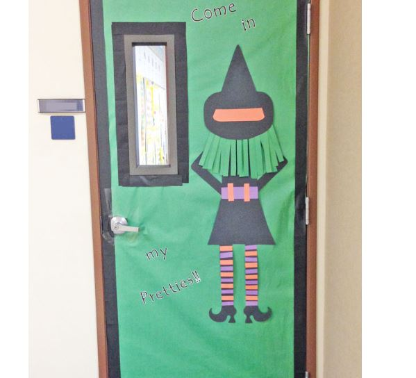
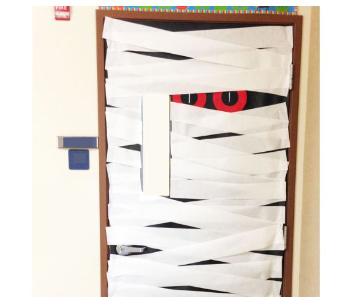

This article has been written and researched by our expert Loveable through a precise methodology. [Learn more about our methodology](https://avada.io/loveable/our-methodological.html)

[Loveable](https://avada.io/loveable/) > [Blog](https://avada.io/loveable/blog/) > [Holiday](https://avada.io/loveable/holiday/)

# 15 Unique Classroom Door Halloween Decorations in 2023

Written by [Blake Simpson](https://avada.io/loveable/author/blake/) Last Updated on August 24, 2023

- [Planning and Preparation](https://avada.io/loveable/blog/classroom-door-halloween-decorations/#wp-block-heading-2-3)
- [15 Cool Classroom Door Halloween Decorations](https://avada.io/loveable/blog/classroom-door-halloween-decorations/#wp-block-heading-2-13)
    - [1\. Striped Witch Door](https://avada.io/loveable/blog/classroom-door-halloween-decorations/#wp-block-heading-3-14)
    - [2\. Simple Mummy Door](https://avada.io/loveable/blog/classroom-door-halloween-decorations/#wp-block-heading-3-18)
    - [3\. Jack O’ Lantern Door](https://avada.io/loveable/blog/classroom-door-halloween-decorations/#wp-block-heading-3-22)
    - [4\. Monsters, Inc. Door](https://avada.io/loveable/blog/classroom-door-halloween-decorations/#wp-block-heading-3-26)
    - [5\. Dracula Door](https://avada.io/loveable/blog/classroom-door-halloween-decorations/#wp-block-heading-3-30)
    - [6\. Spooky Students Door](https://avada.io/loveable/blog/classroom-door-halloween-decorations/#wp-block-heading-3-34)
    - [7\. Mad Scientist Door](https://avada.io/loveable/blog/classroom-door-halloween-decorations/#wp-block-heading-3-38)
    - [8\. Polka-Dotted Monster Door](https://avada.io/loveable/blog/classroom-door-halloween-decorations/#wp-block-heading-3-42)
    - [9\. Scarecrow Door](https://avada.io/loveable/blog/classroom-door-halloween-decorations/#wp-block-heading-3-45)
    - [10\. My teacher is Maleficent](https://avada.io/loveable/blog/classroom-door-halloween-decorations/#wp-block-heading-3-49)
    - [11\. Frankentstein Door Idea](https://avada.io/loveable/blog/classroom-door-halloween-decorations/#wp-block-heading-3-53)
    - [12\. Haunted House Halloween Classroom](https://avada.io/loveable/blog/classroom-door-halloween-decorations/#wp-block-heading-3-58)
    - [13\. Simple Spiderweb Door](https://avada.io/loveable/blog/classroom-door-halloween-decorations/#wp-block-heading-3-62)
    - [14\. Hocus Pocus Classroom](https://avada.io/loveable/blog/classroom-door-halloween-decorations/#wp-block-heading-3-66)
    - [15\. Caution Tape Door](https://avada.io/loveable/blog/classroom-door-halloween-decorations/#wp-block-heading-3-70)
- [Collaborative Classroom Projects](https://avada.io/loveable/blog/classroom-door-halloween-decorations/#wp-block-heading-2-76)
- [In Conclusion,](https://avada.io/loveable/blog/classroom-door-halloween-decorations/#wp-block-heading-2-85)

Get your classroom ready for the scary season with these fun, cute, and not-too-scary **classroom door Halloween ideas**. Kids will love seeing the creative doors when they arrive at school, getting them excited for the big trick-or-treating day. 

Let’s break out the butcher paper, construction paper, and scissors to [start crafting](https://avada.io/loveable/blog/easy-halloween-craft-ideas/). Don’t worry if door decorations aren’t allowed—these ideas can also be done on a bulletin board. Let’s spook up your classroom doors with these clever ideas!

## **Planning and Preparation**

When it comes to classroom door Halloween decorations, a little planning and preparation can go a long way in ensuring a successful and engaging experience.

1. **Emphasize the importance of brainstorming and planning before starting the decoration process.**

Before diving into the decoration process, it’s essential to emphasize the importance of brainstorming and planning. Encourage [teachers in Halloween](https://avada.io/loveable/blog/teacher-halloween-costumes/) to gather their thoughts, explore creative ideas, and envision the kind of atmosphere they want to create. This step allows for a cohesive and well-executed decoration theme.

**2\. Provide tips for selecting a theme that aligns with the age group and interests of the students.**

Choosing a theme that resonates with the age group and interests of the students is crucial. Younger children might enjoy [cute and friendly Halloween characters](https://avada.io/loveable/blog/famous-halloween-cartoon-characters/), while older students might prefer spooky or mysterious themes. By aligning the decorations with their interests, you can enhance their engagement and excitement.

**3\. Discuss practical considerations such as budget, materials, and safety guidelines.**

Practical considerations should also be taken into account. Discuss the budget available for the decorations and suggest cost-effective options such as utilizing recyclable materials or seeking donations from parents. It’s important to consider safety guidelines as well. Ensure that all materials used are age-appropriate, non-toxic, and flame-resistant.

To make the process more manageable, create a checklist of necessary materials, such as butcher paper, construction paper, adhesive, scissors, and any additional props or embellishments. Encourage teachers to involve their students in the preparation process, fostering a sense of ownership and teamwork.

## **15 Cool Classroom Door Halloween Decorations**

### **1\. Striped Witch Door**

You don’t have to stress about being fancy when it comes to the Striped Witch Door decoration. The beauty of this project lies in its simplicity. Notice that, apart from the witch’s shoes, the rest of the design can be achieved using basic shapes.

As long as you can cut a straight line, you’ll likely find success with this creative endeavor. To add the finishing touch, craft the door trim using black crepe paper, bringing the witch’s enchanting presence to life. 

### **2\. Simple Mummy Door**

For a simple yet spooktacular Mummy Door decoration, follow these easy steps. Start by covering the entire door with black paper to create a dark and eerie backdrop. Next, add the mummy’s eyes using large cutouts or drawn shapes, strategically placing them to evoke a mysterious gaze. Finally, transform your door into a wrapped mummy by layering random strips of white paper across the black background. 

Allow the strips to crisscross and overlap, creating the illusion of bandages. You can vary the lengths and thickness of the strips for added visual interest.

### **3\. Jack O’ Lantern Door**

Transform your classroom door into a friendly and festive Jack O’ Lantern with this fun classroom door [Hallow](https://avada.io/loveable/cool-halloween-decorations/)[e](https://avada.io/loveable/cool-halloween-decorations/)[en decoration idea](https://avada.io/loveable/cool-halloween-decorations/). Start by covering the entire door with bright orange paper to create the base of your pumpkin. Next, cut out facial features such as eyes, a nose, and a toothy grin from black construction paper. 

You can get creative with the expressions, making them silly, spooky, or even winking. Attach the facial features to the orange background using glue or double-sided tape, arranging them to give your Jack O’ Lantern its unique personality. 

### **4\. Monsters, Inc. Door**

Turn your classroom door into a whimsical and enchanting portal straight out of Monsters, Inc. with this captivating Halloween decoration idea. Bring the lovable characters from the [Halloween movie](https://avada.io/loveable/blog/best-halloween-movies/) to life and create a door that will spark the imaginations of your students.

To add an interactive element, consider creating movable parts. Attach the eyes with brads, allowing them to rotate, or use adhesive Velcro dots to make them interchangeable. This will allow students to have fun playing with the expressions and creating their own monster combinations.

### **5\. Dracula Door**

Create a captivating [Dracula Door](https://www.pinterest.com/pin/halloween-dracula-door-decor--197243658657667631/) for your classroom this Halloween with these simple steps. Begin by covering the top two-thirds of the door with white paper, setting the stage for Dracula’s haunting presence. Then, using red, black, and white construction paper, cut out basic shapes to represent Dracula’s iconic features. Craft a sharp widow’s peak for his forehead, menacing eyes, a pointy nose, and a sinister mouth with fangs.

This Dracula Door decoration is an easy yet impactful way to bring a touch of Halloween flair to your classroom. It sets the stage for fun and imaginative learning while adding a festive atmosphere. 

### **6\. Spooky Students Door**

For the Spooky Students Door, the ghosts and haunted houses featured in the design can be easily created using a die-cut machine, commonly found in school workrooms, or with a cutting machine like a Silhouette Cameo. If you don’t have access to these machines, don’t worry! You can still achieve the spooky effect by visiting a dollar store. 

Look for ghost-shaped paper packets that can serve as a suitable alternative for creating your own ghostly decorations. With a little creativity and resourcefulness, you can bring the Spooky Students theme to life on your classroom door, immersing students in a fun and eerie Halloween atmosphere.

### **7\. Mad Scientist Door**

The Mad Scientist Door decoration will not only excite students about Halloween but also ignite their passion for science. It’s a fantastic way to create a dynamic and engaging learning environment while celebrating the spirit of the season. So put on your lab coat and goggles, gather your materials, and let your classroom door transform into a thrilling laboratory of imagination and discovery.

Don’t forget to incorporate interactive elements. Attach buttons or switches that students can press to activate blinking lights or animated creatures. You can also create a “Name the Mystery Substance” game, where students can guess the contents of mysterious jars filled with unknown substances.

### **8\. Polka-Dotted Monster Door**

The Polka Dotted Monster Door is a personal favorite that is sure to impress! Start by covering the door with a vibrant, solid color of your choice. For the polka dots, trace circles onto scrapbook paper using Tupperware lids. Get creative with the mouth, teeth, and horns by freehanding their shapes. Transform the largest circle into an eye. You’ll be surprised at how easily you can bring this design to life, and the end result will be absolutely amazing!

### **9\. Scarecrow Door**

If you find yourself in a situation where the supply room is out of brown paper, fear not! The brown door itself is the ideal canvas for creating a charming scarecrow-themed masterpiece. To achieve the look, use black masking tape to create the signature “stitching” details that give the scarecrow its rustic charm. 

Let your imagination run wild as you bring this delightful and whimsical character to life on your classroom door. With a few simple materials and a touch of creativity, your scarecrow door will become a standout decoration that welcomes students into a festive and inviting atmosphere.

### **10\. My teacher is Maleficent**

Transform your classroom door into a bewitching scene with the enchanting theme of “My Teacher is Maleficent.” Observe the basic shapes that make up Maleficent’s iconic silhouette and use your artistic skills to bring her to life.

One technique you can try is using paper curls to create certain elements of Maleficent’s design. Experiment with rolling paper strips tightly or loosely to form intricate curls that can be attached to the door, adding depth and texture to the overall look.

### **11\. Frankentstein Door Idea**

Bring the iconic character of Frankenstein to life on your classroom door on Halloween with this super simple and fun Frankenstein Door Idea. Start by covering the entire door in a vibrant shade of green, creating the perfect backdrop for your creation.

Next, add a few touches with paper cutouts to highlight Frankenstein’s distinctive features. Cut out shapes for his bolts, hair, and stitches using black construction paper or cardstock. Place them strategically on the door to capture his unique appearance.

Finally, grab a black Sharpie and let your creativity flow as you draw on the finer details of Frankenstein’s face. Add his eyes, eyebrows, nose, mouth, and any other characteristic features you’d like to emphasize.

### **12\. Haunted House Halloween Classroom**

To make the scene even more immersive, you can play haunting sound effects or spooky music as students approach the door. This will further enhance the Halloween experience and set the tone for a thrilling adventure.

The Haunted House Classroom door Halloween decoration will ignite students’ imaginations and create an unforgettable learning environment. They will be excited to enter the classroom, ready to embark on a spooky journey of discovery. So, grab your scissors, paper, and creative spirit, and let your classroom door become a gateway to a haunted realm where learning and fun intersect in the spirit of Halloween.

### **13\. Simple Spiderweb Door**

With this Simple Spiderweb Door, you can choose to use any color behind the spiderweb to suit your preference or classroom theme. Experiment with different color combinations to create the desired effect.

As students approach the classroom, they will be greeted by a captivating spiderweb that sparks their curiosity and sets the stage for a thrilling learning experience. Embrace the spooky ambiance and let your creativity weave a web of excitement and engagement for your students.

### **14\. Hocus Pocus Classroom**

Start by covering the door with deep purple or black paper to set the mysterious tone. Cut out stars, moons, and other magical symbols from yellow or gold paper and scatter them across the door to create a celestial backdrop.

Add silhouettes of the iconic Sanderson sisters – Winifred, Sarah, and Mary – by printing or drawing their outlines onto black paper. Place them strategically on the door to capture their mischievous presence. You can even add details such as their distinctive hairstyles and accessories to bring them to life.

### **15\. Caution Tape Door**

When time is limited, but you still want to make an impact, simply grab a few rolls of caution tape and start wrapping them around your door. The vibrant yellow and black stripes will instantly create a sense of warning and intrigue.

To enhance the spooky atmosphere, consider adding a spider web to the caution tape. Stretch a synthetic spider web across the door and place tiny black spiders throughout it, creating an eerie scene that will give your students a delightful shiver.

The simplicity of the Caution Tape Door makes it a versatile choice for any classroom. Whether you’re teaching younger or older students, the combination of caution tape and spider web adds an element of excitement and intrigue to your learning environment.

**_Related_**: DIY [Halloween Door Decorations](https://avada.io/loveable/halloween-door-decorations/) that Evoke the Spooky Season

## **Collaborative Classroom Projects**

By involving students in the decoration process and incorporating collaborative projects, you create a classroom environment that celebrates teamwork, nurtures creativity, and showcases each student’s unique talents. It not only enhances the Halloween spirit but also promotes a sense of belonging and unity among the students.

1. **Foster teamwork and creativity by involving students in the decoration process**

Collaborative classroom projects offer a fantastic opportunity to foster teamwork, boost creativity, and create a sense of ownership among students during the decoration process. By involving them in the decision-making and implementation, you can enhance their engagement and make the experience truly memorable.

**2\. Discuss ideas for interactive elements like a pumpkin patch where students can contribute their own decorated pumpkins.**

One idea to promote collaboration is to create an interactive element, such as a pumpkin patch on the classroom door. Provide each student with a small pumpkin and allow them to decorate it according to their own unique style. Then, arrange the pumpkins on the door to create a vibrant and personalized display. This activity not only encourages individual creativity but also creates a collective artwork that showcases the diverse talents of the students.

**3\. Encourage the creation of a spooky story or poem display on the door, showcasing the literary talents of the students.**

Another collaborative idea is to encourage the creation of a spooky story or poem display. Ask students to write their own spooky stories or poems and invite them to submit their work. Select a few captivating pieces and showcase them on the classroom door. This not only highlights the literary talents of the students but also adds an element of intrigue and mystery to the overall decorations.

## **In Conclusion,**

**Classroom door Halloween decorations** offer a remarkable opportunity to transform your door into a hauntingly fun experience that students will cherish. By involving students in the planning and execution process, you create an atmosphere that fosters excitement, creativity, and a sense of ownership.

Through collaborative efforts, students can contribute their unique ideas and talents, making the decorations truly special. Whether it’s selecting a theme that aligns with their interests or incorporating interactive elements like a pumpkin patch where students can showcase their decorated pumpkins, the possibilities are endless.

So, unleash your creativity, collaborate with your students, and let your classroom door become a bewitching centerpiece that leaves a lasting impression. Get ready to create a Halloween experience that students will remember fondly for years to come.

- [Planning and Preparation](https://avada.io/loveable/blog/classroom-door-halloween-decorations/#wp-block-heading-2-3)
- [15 Cool Classroom Door Halloween Decorations](https://avada.io/loveable/blog/classroom-door-halloween-decorations/#wp-block-heading-2-13)
    - [1\. Striped Witch Door](https://avada.io/loveable/blog/classroom-door-halloween-decorations/#wp-block-heading-3-14)
    - [2\. Simple Mummy Door](https://avada.io/loveable/blog/classroom-door-halloween-decorations/#wp-block-heading-3-18)
    - [3\. Jack O’ Lantern Door](https://avada.io/loveable/blog/classroom-door-halloween-decorations/#wp-block-heading-3-22)
    - [4\. Monsters, Inc. Door](https://avada.io/loveable/blog/classroom-door-halloween-decorations/#wp-block-heading-3-26)
    - [5\. Dracula Door](https://avada.io/loveable/blog/classroom-door-halloween-decorations/#wp-block-heading-3-30)
    - [6\. Spooky Students Door](https://avada.io/loveable/blog/classroom-door-halloween-decorations/#wp-block-heading-3-34)
    - [7\. Mad Scientist Door](https://avada.io/loveable/blog/classroom-door-halloween-decorations/#wp-block-heading-3-38)
    - [8\. Polka-Dotted Monster Door](https://avada.io/loveable/blog/classroom-door-halloween-decorations/#wp-block-heading-3-42)
    - [9\. Scarecrow Door](https://avada.io/loveable/blog/classroom-door-halloween-decorations/#wp-block-heading-3-45)
    - [10\. My teacher is Maleficent](https://avada.io/loveable/blog/classroom-door-halloween-decorations/#wp-block-heading-3-49)
    - [11\. Frankentstein Door Idea](https://avada.io/loveable/blog/classroom-door-halloween-decorations/#wp-block-heading-3-53)
    - [12\. Haunted House Halloween Classroom](https://avada.io/loveable/blog/classroom-door-halloween-decorations/#wp-block-heading-3-58)
    - [13\. Simple Spiderweb Door](https://avada.io/loveable/blog/classroom-door-halloween-decorations/#wp-block-heading-3-62)
    - [14\. Hocus Pocus Classroom](https://avada.io/loveable/blog/classroom-door-halloween-decorations/#wp-block-heading-3-66)
    - [15\. Caution Tape Door](https://avada.io/loveable/blog/classroom-door-halloween-decorations/#wp-block-heading-3-70)
- [Collaborative Classroom Projects](https://avada.io/loveable/blog/classroom-door-halloween-decorations/#wp-block-heading-2-76)
- [In Conclusion,](https://avada.io/loveable/blog/classroom-door-halloween-decorations/#wp-block-heading-2-85)

### [Blake Simpson](https://avada.io/loveable/author/blake/)

Hi, I'm Blake from Loveable. I help people find perfect gifts for occasions like anniversaries and weddings. I also write a blog about holidays, sharing insights to make them more meaningful. Let's create unforgettable moments together!

- [Twitter](https://twitter.com/intent/tweet)
- [Facebook](https://www.facebook.com/sharer/sharer.php)
- [instagram](https://avada.io/loveable/blog/classroom-door-halloween-decorations/)
- [pinterest](https://www.pinterest.com/loveablellc/)

## Related Posts

[### 120+ Christian Birthday Wishes To Spread Your Love](https://avada.io/loveable/blog/christian-birthday-wishes/) 

[

### 35 Best 70th Birthday Ideas To Celebrate The Special Milestone

](https://avada.io/loveable/blog/70th-birthday-ideas/)

[

### 50 Best 30th Birthday Decorations for a Remarkable Birthday Bash

](https://avada.io/loveable/blog/30th-birthday-decorations/)

[

### 40 Delicious Vegan Christmas Desserts to Delight Your Palate

](https://avada.io/loveable/blog/vegan-christmas-desserts/)

[

### 60 Christmas Team Building Activities to Boost Workplace Spirit

](https://avada.io/loveable/blog/christmas-team-building-activities/)
