This article has been written and researched by our expert Loveable through a precise methodology. [Learn more about our methodology](https://avada.io/loveable/our-methodological.html)

[Loveable](https://avada.io/loveable/) > [Blog](https://avada.io/loveable/blog/) > [Holiday](https://avada.io/loveable/holiday/)

# 15 Unique Polish Christmas Traditions Where Culture and Celebration Unite

Written by [Blake Simpson](https://avada.io/loveable/author/blake/) Last Updated on September 13, 2023

- [15 Interesting Polish Christmas Tradition To Unleash Holiday Spirit](https://avada.io/loveable/blog/polish-christmas-traditions/#wp-block-heading-2-3)
    - [1\. 3 Days Of Xmas!](https://avada.io/loveable/blog/polish-christmas-traditions/#wp-block-heading-3-4)
    - [2\. An Empty Chair](https://avada.io/loveable/blog/polish-christmas-traditions/#wp-block-heading-3-8)
    - [3\. 12 Traditional Dishes Of Wigilia](https://avada.io/loveable/blog/polish-christmas-traditions/#wp-block-heading-3-12)
    - [4\. A Fish In The Bathtub](https://avada.io/loveable/blog/polish-christmas-traditions/#wp-block-heading-3-17)
    - [5\. Christmas Eve Presents Giver](https://avada.io/loveable/blog/polish-christmas-traditions/#wp-block-heading-3-21)
    - [6\. The Very First Star](https://avada.io/loveable/blog/polish-christmas-traditions/#wp-block-heading-3-25)
    - [7\. Advent – The Time Before Xmas](https://avada.io/loveable/blog/polish-christmas-traditions/#wp-block-heading-3-29)
    - [8\. Xmas Spider](https://avada.io/loveable/blog/polish-christmas-traditions/#wp-block-heading-3-34)
    - [9\. Polish Gingerbread](https://avada.io/loveable/blog/polish-christmas-traditions/#wp-block-heading-3-38)
    - [10\. Sharing A Wafer](https://avada.io/loveable/blog/polish-christmas-traditions/#wp-block-heading-3-43)
    - [11\. Choinka](https://avada.io/loveable/blog/polish-christmas-traditions/#wp-block-heading-3-47)
    - [12\. Singing Christmas Carols](https://avada.io/loveable/blog/polish-christmas-traditions/#wp-block-heading-3-51)
    - [13\. Smell Of Tangerines And Oranges](https://avada.io/loveable/blog/polish-christmas-traditions/#wp-block-heading-3-54) 
    - [14\. Polishing Windows For Jesus!](https://avada.io/loveable/blog/polish-christmas-traditions/#wp-block-heading-3-58)
    - [15\. Every Animal Can Talk!!](https://avada.io/loveable/blog/polish-christmas-traditions/#wp-block-heading-3-62)
- [Bottom Line](https://avada.io/loveable/blog/polish-christmas-traditions/#wp-block-heading-2-68)

Amidst the winter’s embrace, snowflakes delicately blanket the landscape, and a captivating tapestry of tradition and heritage unfolds in Poland. **Polish Christmas traditions** radiate an allure that captures the essence of togetherness, reverence, and time-honored rituals. As families gather and homes are adorned, the festive spirit comes alive, painting a vivid portrait of a season where customs, both ancient and modern.

While deeply rooted in history, Polish Christmas traditions embrace contemporary elements that breathe fresh life into the festivities. The dazzling display of city lights and the bustling Christmas markets showcase the harmonious blend of old-world charm and modern celebration.

## **15 Interesting Polish Christmas Tradition To Unleash Holiday Spirit**

### **1\. 3 Days Of Xmas!**

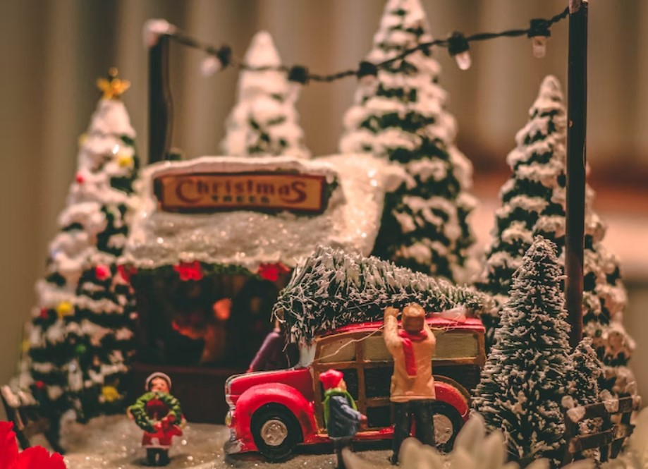

In Poland, the festive season extends beyond a single day, spanning three consecutive days of celebration. The commencement of Christmas festivities takes place on the 24th through Wigilia. Following this, the 25th, Christmas Day or the First Day of Christmas in Poland, adopts a more leisurely pace. 

It’s common for individuals to visit extended family members, forging connections and sharing yet another communal meal. On the 26th – Boxing Day assumes the identity of the Second Day of Christmas in Poland, completing the trio of joyous occasions.

### **2\. An Empty Chair**

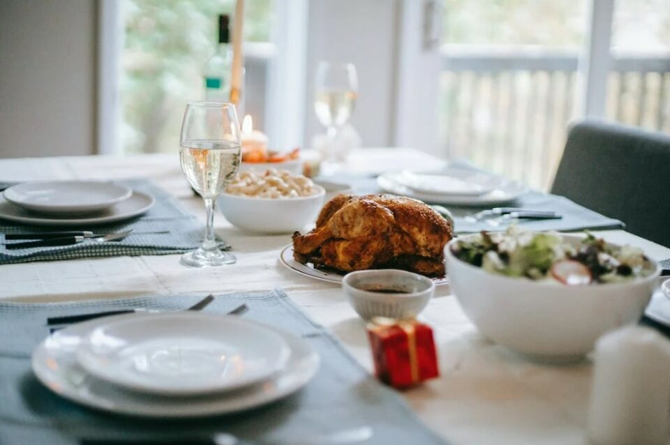

During the Wigilia feast, a deeply rooted Polish tradition entails the appearance of an unoccupied chair and a meticulously set place setting. This custom echoes the Polish conviction that no individual should experience hunger or solitude during Wigilia, instilling a sense of warmth and inclusivity. 

For some families, this vacant seat carries an additional layer of significance. The empty chair transcends its physical absence, embodying a profound connection between generations, a gesture of compassion, and a beacon of unity.

### **3\. 12 Traditional Dishes Of Wigilia**

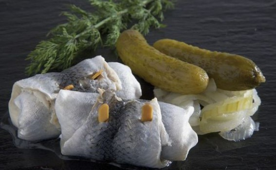

This meal is the time-honored tradition of serving twelve dishes, each a distinctive representation of family preferences. A customary practice ensures good fortune in the forthcoming twelve months. 

For those of the Catholic faith, this arrangement of twelve courses mirrors the revered twelve apostles of Jesus. The Wigilia spread abstains from featuring meat or potent alcoholic beverages. Instead, it is richly imbued with an array of fish dishes that exemplify the essence of this feast.

**Read more:** [_Dishes of Wigilia Recipes_](https://keytopoland.com/post/14-delicious-polish-christmas-recipes)

### **4\. A Fish In The Bathtub**

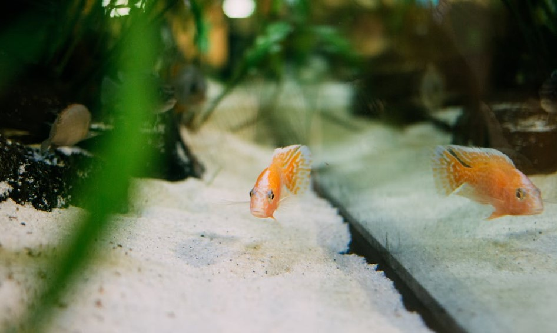

Carp stands as the customary centerpiece of the Wigilia feast. The fish is transported home in a plastic bag and housed in a bathtub until the meal preparation time arrives. 

Many individuals retain these scales in their wallets to carry this luck throughout the subsequent year. For certain older women, a unique tradition entails placing the scales within their bra during the meal. Then, it later bestows them upon guests as gifts on the following day.

### **5\. Christmas Eve Presents Giver**

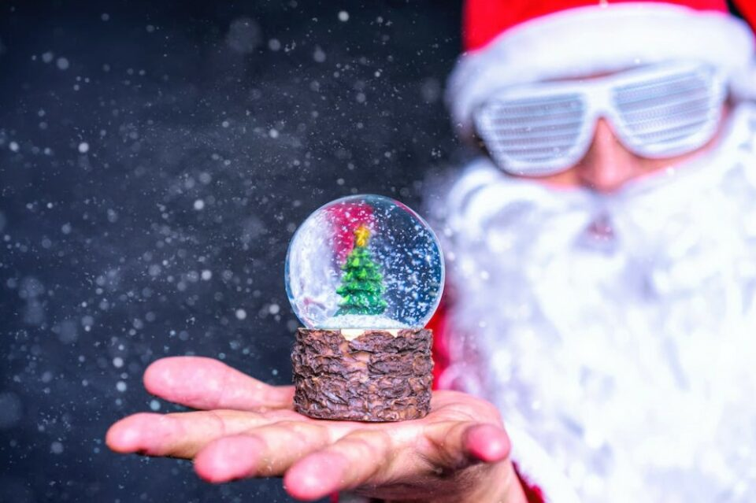

In Poland, the giver of gifts during the festive season, commonly known as Santa Claus, also answers to the name “Mikołaj” or Saint Nicholas. Usually, he ushers in the presents on the 6th of December. 

A whimsical tradition entails encouraging children to maintain hushed tones during the Wigilia meal, with the intention of not startling away the gift-giver. This charming practice weaves an extra layer of enchantment into the anticipation of the festivities.

### **6\. The Very First Star**

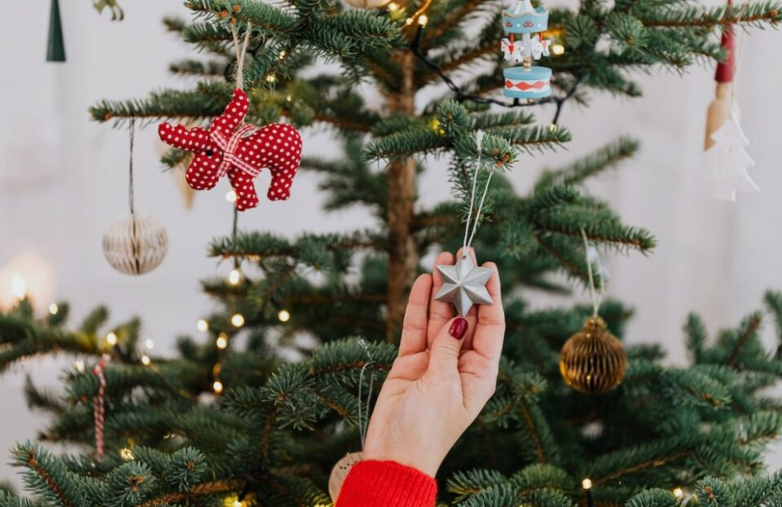

Embedded in Polish culture is the custom of refraining from consuming food until the appearance of the initial star in the evening sky on Christmas Eve. Children frequently position themselves by a window, eagerly scanning the horizon for the inaugural glimmering light. 

This age-old practice bears symbolic significance, reminiscent of the Star of Bethlehem. According to biblical accounts, it led the Wisemen on their journey to locate the birthplace of Jesus.

### **7\. Advent – The Time Before Xmas**

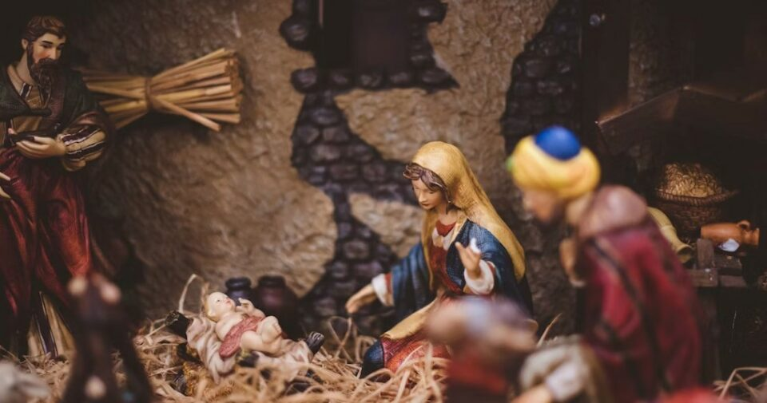

Advent, a period leading up to Christmas, carries profound symbolism of the sacred birth. This interlude spans four Sundays before Christmas Day, with Sundays witnessing the illumination of an additional candle on the Advent wreath.

As the evening descends, a special occurrence known as “roraty” takes center stage, featuring dedicated masses for children. These young participants carry illuminated lanterns, lending a captivating radiance and creating a mesmerizing sight. 

**See more:** [_Men’s Advent Calendars_](https://avada.io/loveable/men's-advent-calendars/)

### **8\. Xmas Spider**

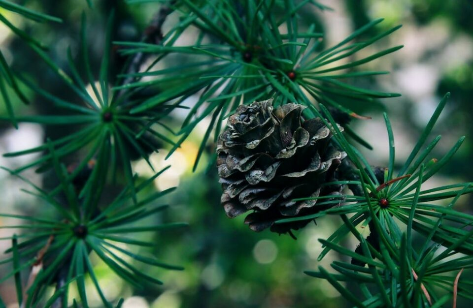

The tale of the Christmas Spider narrates an ancient legend featuring a family unable to adorn their Christmas tree due to financial constraints. The tree is decorated with delicate strands of silver and gold woven in a pattern reminiscent of a spider’s web. 

This story has evolved into a belief that encountering a spider on a Christmas Tree brings good fortune. Regarding this belief, some incorporate an artificial spider into their tree decorations, hoping to invite luck and blessings.

### **9\. Polish Gingerbread**

For now, let us share insights about gingerbread, known as “pierniki.” These classic cookies necessitate preparation or baking a couple of weeks before Christmas, allowing them time to mature and reach their peak flavor.

A cherished tradition involves baking these cookies at home, often transforming into a delightful activity for children who cut and decorate them. The most exquisite of these cookies find their place adorning the Christmas tree or are exchanged with friends and family.

**See more**: _[Best Christmas Cookies](https://avada.io/loveable/christmas-cookies/)_

### **10\. Sharing A Wafer**

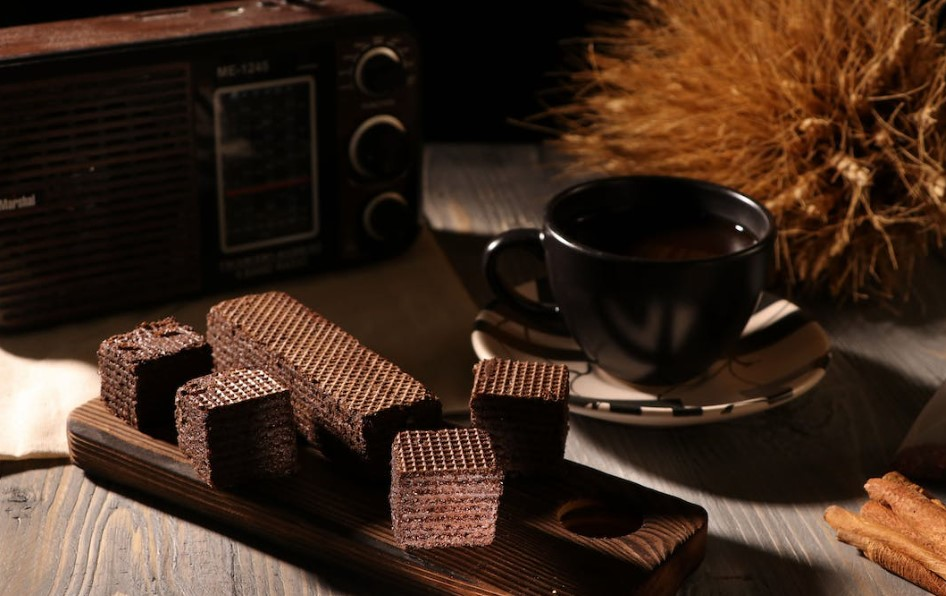

Christmas Eve holds paramount significance for the Polish population among all the festive days during Christmas. This day sees men frequently opting for button-down shirts or suits, while women often choose dresses for this occasion.

Before indulging in the Christmas feast, a notable tradition involves sharing a Christmas wafer. This act carries profound symbolism, epitomizing unity and shared bonds. As the wafers exchange, heartfelt holiday wishes are extended, encapsulating a poignant symbolic gesture that unites hearts.

### **11\. Choinka**

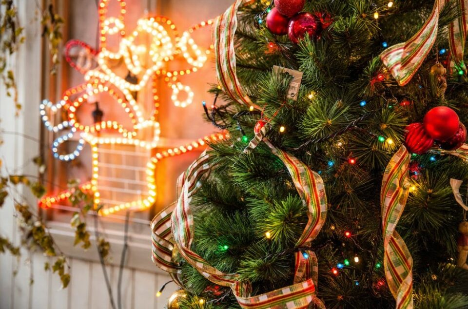

Interestingly, the Christmas tree wasn’t originally a Polish custom; it was introduced to us from Germany during the XVIII and XIX centuries. Before its adoption, homes used to be embellished with evergreen branches or mistletoe suspended from the ceiling. 

However, a Christmas tree has become indispensable, rendering any home incomplete without its festive charm during the holiday season.

### **12\. Singing Christmas Carols**

Some families in Poland will sing Christmas Carols after the meal is finished. These songs are not similar to those found in the United States but have a more solemn and religious tone. In some parts of Poland, more often in the countryside, people travel between houses singing carols or performing short nativity skits.

### **13\. Smell Of Tangerines And Oranges** 

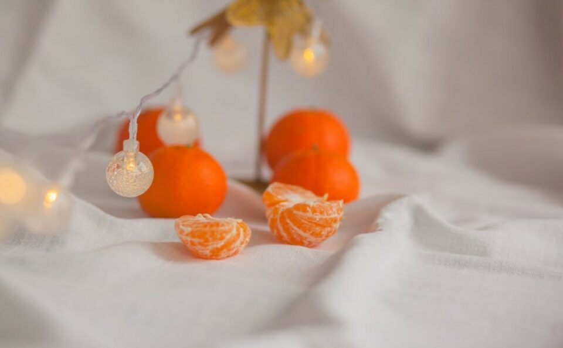

A rather intriguing phenomenon in Poland is the unmistakable aroma of oranges and tangerines permeating the air wherever you venture. This olfactory hallmark becomes pervasive, wafting through houses and even school corridors.

An exciting twist to this experience is that the oranges available in Polish stores during this time are at their zenith of sweetness and flavor. Beyond their taste quality, Christmas oranges also boast an attractive price point.

### **14\. Polishing Windows For Jesus!**

As the Christmas season approaches, a tradition ensues in Polish households that demands the utmost sparkle and shine. This entails a comprehensive cleansing of everything covering every home corner. Interestingly, a playful undertone exists as some individuals poke fun at this pre-Christmas cleaning frenzy. 

A sentiment emerges that questions whether investing such substantial effort into cleaning is justified. The occasion at hand is celebrating Jesus’ birthday rather than a contest in cleaning prowess.

### **15\. Every Animal Can Talk!!**

Among Polish beliefs, a captivating notion asserts that Christmas Eve is the sole night when animals possess the gift of speech. In my childhood, spending Christmas at my grandfather’s abode, where dogs were part of the household, would evoke immense excitement. Throughout the night, I would eagerly trail the dogs, thus revealing the magic of this special night.

**_See More:_**

- Impressive [Irish Christmas Traditions](https://avada.io/loveable/blog/irish-christmas-traditions/)

- Absorbing [Christmas Pickle Traditions](https://avada.io/loveable/blog/christmas-pickle-traditions/)

## **Bottom Line**

When it comes to **Polish Christmas traditions**, an intricate blend of heritage and religious devotion orchestrates a celebration that stands apart from any other. From the sharing of Christmas wafers to the joyous resonance of carols and the charming belief in enchanted creatures. Each unique custom contributes a distinct brushstroke to the vibrant canvas of festivities. 

These Polish Christmas traditions do more than just create a rich tapestry of togetherness, reverence, and jubilation; they also transport us to a realm where time-honored traditions meld seamlessly with the enchantment of the season, invoking a feeling of awe that remains both eternal and captivating.

- [15 Interesting Polish Christmas Tradition To Unleash Holiday Spirit](https://avada.io/loveable/blog/polish-christmas-traditions/#wp-block-heading-2-3)
    - [1\. 3 Days Of Xmas!](https://avada.io/loveable/blog/polish-christmas-traditions/#wp-block-heading-3-4)
    - [2\. An Empty Chair](https://avada.io/loveable/blog/polish-christmas-traditions/#wp-block-heading-3-8)
    - [3\. 12 Traditional Dishes Of Wigilia](https://avada.io/loveable/blog/polish-christmas-traditions/#wp-block-heading-3-12)
    - [4\. A Fish In The Bathtub](https://avada.io/loveable/blog/polish-christmas-traditions/#wp-block-heading-3-17)
    - [5\. Christmas Eve Presents Giver](https://avada.io/loveable/blog/polish-christmas-traditions/#wp-block-heading-3-21)
    - [6\. The Very First Star](https://avada.io/loveable/blog/polish-christmas-traditions/#wp-block-heading-3-25)
    - [7\. Advent – The Time Before Xmas](https://avada.io/loveable/blog/polish-christmas-traditions/#wp-block-heading-3-29)
    - [8\. Xmas Spider](https://avada.io/loveable/blog/polish-christmas-traditions/#wp-block-heading-3-34)
    - [9\. Polish Gingerbread](https://avada.io/loveable/blog/polish-christmas-traditions/#wp-block-heading-3-38)
    - [10\. Sharing A Wafer](https://avada.io/loveable/blog/polish-christmas-traditions/#wp-block-heading-3-43)
    - [11\. Choinka](https://avada.io/loveable/blog/polish-christmas-traditions/#wp-block-heading-3-47)
    - [12\. Singing Christmas Carols](https://avada.io/loveable/blog/polish-christmas-traditions/#wp-block-heading-3-51)
    - [13\. Smell Of Tangerines And Oranges](https://avada.io/loveable/blog/polish-christmas-traditions/#wp-block-heading-3-54) 
    - [14\. Polishing Windows For Jesus!](https://avada.io/loveable/blog/polish-christmas-traditions/#wp-block-heading-3-58)
    - [15\. Every Animal Can Talk!!](https://avada.io/loveable/blog/polish-christmas-traditions/#wp-block-heading-3-62)
- [Bottom Line](https://avada.io/loveable/blog/polish-christmas-traditions/#wp-block-heading-2-68)

### [Blake Simpson](https://avada.io/loveable/author/blake/)

Hi, I'm Blake from Loveable. I help people find perfect gifts for occasions like anniversaries and weddings. I also write a blog about holidays, sharing insights to make them more meaningful. Let's create unforgettable moments together!

- [Twitter](https://twitter.com/intent/tweet)
- [Facebook](https://www.facebook.com/sharer/sharer.php)
- [instagram](https://avada.io/loveable/blog/polish-christmas-traditions/)
- [pinterest](https://www.pinterest.com/loveablellc/)

## Related Posts

[### 120+ Christian Birthday Wishes To Spread Your Love](https://avada.io/loveable/blog/christian-birthday-wishes/) 

[

### 35 Best 70th Birthday Ideas To Celebrate The Special Milestone

](https://avada.io/loveable/blog/70th-birthday-ideas/)

[

### 50 Best 30th Birthday Decorations for a Remarkable Birthday Bash

](https://avada.io/loveable/blog/30th-birthday-decorations/)

[

### 40 Delicious Vegan Christmas Desserts to Delight Your Palate

](https://avada.io/loveable/blog/vegan-christmas-desserts/)

[

### 60 Christmas Team Building Activities to Boost Workplace Spirit

](https://avada.io/loveable/blog/christmas-team-building-activities/)
